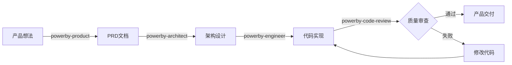
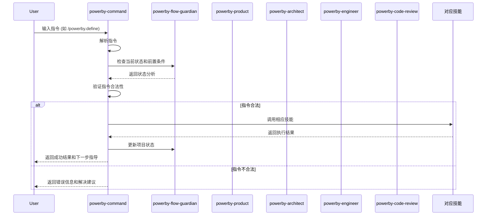

# PowerBy Skills - AI驱动的产品开发流程技能包

**版本**: v3.1.0
**更新日期**: 2025-12-26
**技能类型**: 完整技能生态系统 (Complete Skill Ecosystem)

[](https://opensource.org/licenses/MIT)
[](https://claude.ai)
[](#)

## 🚀 快速开始

### 一分钟安装

#### 方式一：Claude插件市场安装（推荐）

1. **在Claude中打开技能市场**
   - 点击左侧菜单"技能市场"
   - 搜索"powerby-skills"

2. **安装技能**
   - 点击"powerby-skills"
   - 点击"添加到项目"

3. **安装命令**
   ```bash
   /powerby.init
   ```

4. **开始使用**
   ```bash
   /powerby.initialize 我的项目 "项目描述"
   ```

#### 方式二：GitHub克隆

```bash
git clone https://github.com/your-org/powerby-skills.git
cd powerby-skills/skills/powerby-command
chmod +x setup.sh && ./setup.sh
```

📖 **详细安装指南**: [INSTALL.md](INSTALL.md)

## 📋 概述

PowerBy Skills 是一套完整的AI驱动产品开发流程技能包，涵盖从产品构思到代码交付的完整生命周期。通过严格的质量门禁和MVP精简流程，帮助团队高效产出高质量产品。

## ✨ 核心特性

- **🎯 MVP驱动**: 基于奥卡姆剃刀原则，专注核心价值交付
- **🔄 技能协作**: 7个核心技能协调，覆盖完整产品生命周期
- **📏 质量门禁**: 8个质量门禁确保每个阶段输出质量
- **⚡ 快速流程**: 支持≤3天小需求的快速处理
- **📚 文档驱动**: 完整的文档体系和可追溯性
- **🛡️ 流程守护**: Flow Guardian确保严格遵循流程
- **🌿 GitFlow集成**: 标准GitFlow分支管理，支持并行开发和独立Bug修复
- **🔬 三层立体诊断**: Bug修复采用表现层-逻辑层-数据层立体诊断框架 🔥
- **🔍 需求对齐**: 问题报告阶段先对齐需求再诊断，确保方向正确 🔥

### 核心技能

| 技能 | 角色 | 核心能力 | 适用阶段 |
|------|------|---------|----------|
| **powerby-product** | AI产品经理 | MVP驱动需求精炼、功能拆解 | P0-P1 |
| **powerby-architect** | 首席架构师 | 技术架构设计、可视化 | P3-P4 |
| **powerby-engineer** | 资深工程师 | TDD实现、质量保证 | P5-P6 |
| **powerby-code-review** | 首席审查师 | 代码审计、验收方案 | P7-P8 |
| **powerby-command** | 指令管理 | 流程协调、状态管理 | 全流程 |
| **powerby-bugfix** | 故障诊断师 | 证据驱动诊断、单文档修复 | 独立流程 |
| **powerby-github-branch** | GitHub分支管理专家 | GitFlow分支管理自动化 | 为其他技能提供支持 |
| **powerby-flow-guardian** | 流程守护 | 状态检查、问题诊断 | 全流程 |

### 完整工作流程



## 🏗️ 架构设计

```mermaid
graph TB
    subgraph "PowerBy Skills 生态"
        PM[powerby-product<br/>产品经理]
        ARCH[powerby-architect<br/>架构师]
        ENG[powerby-engineer<br/>工程师]
        CR[powerby-code-review<br/>代码审查]
        BUGFIX[powerby-bugfix<br/>故障诊断师] 🔧
        FG[powerby-flow-guardian<br/>流程守护者]
        CMD[powerby-command<br/>指令管理] ⭐
    end

    subgraph "指令调用"
        INIT[/powerby.initialize]
        DEFINE[/powerby.define]
        CLARIFY[/powerby.clarify]
        RESEARCH[/powerby.research]
        DESIGN[/powerby.design]
        PLAN[/powerby.plan]
        IMPLEMENT[/powerby.implement]
        REVIEW[/powerby.review]
        BUGFIX[/powerby-bugfix]
    end

    %% 指令到CMD的关系
    INIT --> CMD
    DEFINE --> CMD
    CLARIFY --> CMD
    RESEARCH --> CMD
    DESIGN --> CMD
    PLAN --> CMD
    IMPLEMENT --> CMD
    REVIEW --> CMD
    BUGFIX --> CMD

    %% CMD到技能的映射
    CMD --> PM
    CMD --> ARCH
    CMD --> ENG
    CMD --> CR
    CMD --> BUGFIX

    %% Bug-Fix独立流程
    BUGFIX -.-> BUGFIX

    %% 流程维护
    CMD -.-> FG

    classDef commandSkill fill:#4caf50,stroke:#388e3c,stroke-width:3px,color:#fff
    class CMD commandSkill
```

## 🎯 完整工作流程

### 标准流程（适用于新项目）

```bash
# 步骤1: 项目初始化 (P0)
/powerby.initialize 电商平台 "构建B2C电商核心功能"

# 步骤2: 需求定义+澄清 (P1)
/powerby.define "实现用户注册、商品浏览、购物车和订单管理"

# 步骤3: 技术调研 (P3)
/powerby.research

# 步骤4: 架构设计 (P4)
/powerby.design

# 步骤5: 任务规划 (P5)
/powerby.plan --tasks-per-day 3

# 步骤6: 开发实现 (P6)
/powerby.implement --tdd

# 步骤7: 代码审查 (P7)
/powerby.review
```

### 快速流程（适用于小需求，≤3天）

```bash
# 适用于临时功能、简单Bug修复、功能扩展
/powerby.quick 为购物车添加优惠券功能，预计2天完成
```

**快速流程特点**：
- ⚡ 总时间≤5小时
- 🎯 P1+P2融合（需求定稿制）
- ✅ 关键节点人工确认
- 📦 基于现有架构增量开发

### GitFlow分支管理策略

PowerBy项目集成标准GitFlow分支管理，通过独立的 `powerby-github-branch` 技能提供分支管理能力：

#### 分支类型
```bash
main                 # 生产就绪代码
develop              # 开发集成分支
feature/001-{name}   # P0-P8完整迭代分支
bugfix/002-{desc}    # 一般Bug修复分支
hotfix/003-{desc}    # 紧急修复分支
```

#### 自动分支流程
```bash
# P1阶段完成后自动创建feature分支
powerby-command → powerby-github-branch.create_feature_branch()

# P8阶段完成后自动合并分支
powerby-command → powerby-github-branch.merge_branch()

# Bug修复时自动选择分支类型
powerby-command → powerby-github-branch.create_bugfix_branch()
```

#### 分支策略优势
- ✅ **并行开发**: 多个feature分支同时进行，不相互干扰
- ✅ **独立Bug修复**: bugfix/hotfix独立流程，快速响应问题
- ✅ **标准化流程**: 清晰的命名规范和生命周期管理
- ✅ **自动集成**: 与P0-P8流程和Bug修复流程无缝集成
- ✅ **技能解耦**: 分支管理独立为专门技能，职责清晰

### MVP精简流程

```
P0 → P1 → P3 → P4 → P5 → P6 → P7
```

**注意**：
- ✅ P2（独立澄清阶段）已合并到P1中
- ✅ P8（运维交付）为可选流程
- ✅ 总共7个核心阶段，专注MVP交付

## 📖 完整指令参考

### 核心指令列表

| 指令 | 阶段 | 对应技能 | 主要职责 | 输出文档 |
|------|------|---------|---------|----------|
| `/powerby.initialize` | P0 | powerby-command | 项目初始化，定义迭代主任务 | constitution.md, project.json |
| `/powerby.define` | P1 | powerby-product | 需求定义+澄清，融合P1+P2 | prd.md, function-points.md, clarifications.md |
| `/powerby.quick` | P0-P5 | powerby-fullstack | 快速流程，≤3天需求 | 快速流程文档集合 |
| `/powerby.research` | P3 | powerby-architect | 技术调研，评估技术方案 | technical-research.md |
| `/powerby.design` | P4 | powerby-architect | 架构设计，四阶段强制流程 | architecture.md, data-model.md, contracts/ |
| `/powerby.plan` | P5 | powerby-engineer | 任务规划，分解可执行任务 | tasks.md, checklists/ |
| `/powerby.implement` | P6 | powerby-engineer | 开发实现，TDD开发方式 | 代码+测试+实现报告 |
| `/powerby.review` | P7-P8 | powerby-code-review | 代码审查，质量把控 | code-review-report.md, delivery-report.md |

### GitHub分支管理指令

**注意**: 分支管理不直接暴露指令，由其他技能调用：

| 调用方 | 功能 | 触发时机 | 自动化程度 |
|--------|------|---------|-----------|
| powerby-command | 创建feature分支 | P1阶段完成后 | 全自动 |
| powerby-command | 合并feature分支 | P8阶段完成后 | 全自动 |
| powerby-bugfix | 创建bugfix/hotfix分支 | Bug修复开始时 | 全自动 |
| powerby-bugfix | 合并和清理分支 | Bug修复完成后 | 全自动 |

### 快速流程指令

| 指令 | 适用场景 | 时间控制 | 特点 |
|------|---------|---------|------|
| `/powerby.quick` | ≤3天的小需求 | ≤5小时 | P1融合、人工确认、增量开发 |

### Bug修复流程（独立于P0-P8流程）

| 指令 | Bug级别 | 分支类型 | 合并策略 |
|------|---------|----------|----------|
| `/powerby-bugfix` | P0/P1 | hotfix/* | main + develop |
| `/powerby-bugfix` | P2/P3 | bugfix/* | develop |

**Bug修复流程特点**：
- 🔍 **需求对齐**: 先查找相关PRD，对齐业务目标，量化明确正确状态
- 🔬 **三层立体诊断**: 表现层-逻辑层-数据层立体分析，全面无死角
- ✅ **四重验证**: 双重验证+跨层验证+整体检查+严格判定
- 📊 **完整证据链**: 正向证据链+反向排除链，确保诊断准确
- 🗂️ **单文档记录**: 所有过程在一个文档中完成
- 🌿 **GitHub分支管理**: 自动创建、合并、清理分支

**七阶段Bug修复流程**：
1. **需求对齐与澄清** 🔍 - 查找相关PRD，对齐目标和验收标准
2. **问题现象描述** - 详细记录问题表现、证据链、复现逻辑
3. **三层立体诊断分析** 🔬 - 表现层+逻辑层+数据层立体诊断
4. **修复方案确认** - 提供多个方案供用户选择
5. **用户确认** - 获取用户对修复方案的确认
6. **实施修复** - 编写修复代码，添加验证测试
7. **验证交付** - 回归测试，分支合并清理，文档归档

**Bug修复分支管理**：
- 根据严重程度自动选择分支类型
- 完整记录分支创建和合并过程
- 修复完成后自动清理分支

### 质量门禁系统

| Gate | 阶段转换 | 检查要点 | 通过标准 |
|------|----------|----------|----------|
| Gate 1 | P1→P3 | MVP需求定稿 | 核心价值、功能完整性、范围明确 |
| Gate 3 | P3→P4 | 技术调研完整性 | 技术选型、可行性、风险评估 |
| Gate 4 | P4→P5 | 架构设计清晰性 | 组件职责、数据流、决策记录 |
| Gate 5 | P5→P6 | 开发规划详细性 | 任务分解、依赖关系、验收标准 |
| Gate 6 | P6→P7 | 开发实现质量 | 功能完整、代码质量、测试覆盖 |
| Gate 7 | P7→完成 | 代码审查严格性 | 规范检查、安全审查、性能评估 |

### Bug修复质量门禁（独立流程）

| Gate | 检查要点 | 通过标准 |
|------|----------|----------|
| Gate 1 | 问题报告完整性 | 需求对齐清晰、正确状态定义量化、现象清晰、复现步骤明确 |
| Gate 2 | 诊断分析准确性 | 三层立体诊断完整、跨层验证充分、根因定位准确 |
| Gate 3 | 修复方案合理性 | 方案可行、影响面最小 |
| Gate 4 | 用户确认 | 方案已确认、意见已记录 |
| Gate 5 | 修复实施质量 | 代码规范、注释完整 |
| Gate 6 | 验证测试有效性 | 测试通过、无副作用 |
| Gate 7 | 交付完整性 | 文档完整、分支已清理 |

### 指令执行流程



## 🔍 质量门禁

每个阶段都有对应的质量门禁检查：

| Gate | 阶段 | 检查要点 | 通过标准 |
|------|------|----------|----------|
| Gate 1 | P1→P2 | MVP范围合理性 | 5项验收标准 |
| Gate 2 | P2→P3 | 需求澄清充分性 | 4项验收标准 |
| Gate 3 | P3→P4 | 技术调研完整性 | 4项验收标准 |
| Gate 4 | P4→P5 | 架构设计清晰性 | 5项验收标准 |
| Gate 5 | P5→P6 | 开发规划详细性 | 5项验收标准 |
| Gate 6 | P6→P7 | 开发实现质量 | 6项验收标准 |
| Gate 7 | P7→P8 | 代码审查严格性 | 5项验收标准 |
| Gate 8 | P8→完成 | 项目交付完整性 | 6项验收标准 |

## 🎯 最佳实践

### ✅ 推荐做法

1. **严格遵循流程**: 不跳过任何阶段或门禁
2. **充分确认**: 每个阶段都等待门禁检查通过
3. **记录决策**: 所有重要决策都有文档记录
4. **及时更新**: 状态变化立即更新到项目元数据
5. **主动澄清**: 遇到模糊点主动询问Flow Guardian

### ❌ 避免做法

1. **流程跳跃**: 不要跳过前置阶段直接进入后续阶段
2. **门禁绕过**: 不要绕过质量门禁检查
3. **文档滞后**: 避免代码实现与文档不同步
4. **重复造轮子**: 优先使用现有库和服务

## 📁 项目结构

```
powerby-skills/                          # 项目根目录
├── 📄 README.md                        # 项目说明（本文件）
├── 📄 INSTALL.md                       # 详细安装指南 ⭐
├── 📄 LICENSE                          # MIT许可证
├── 📄 package.json                     # 项目配置
├── 📁 .github/                         # GitHub配置
│   ├── 📁 workflows/                   # GitHub Actions工作流
│   │   ├── ci.yml                      # 持续集成
│   │   ├── release.yml                 # 自动发布
│   │   ├── branch-management.yml       # 分支管理验证
│   │   └── 📁 scripts/                 # 自动化脚本
│   ├── CODEOWNERS                      # 代码所有者
│   ├── pull_request_template.md        # PR模板
│   └── 📁 ISSUE_TEMPLATE/              # Issue模板
├── 📁 skills/                          # 技能包目录
│   ├── 📁 powerby-command/             # 指令管理技能
│   │   ├── SKILL.md                    # 技能定义文档
│   │   ├── README.md                   # 使用说明
│   │   ├── COMMANDS_VALIDATION_REPORT.md # 命令验证报告
│   │   ├── THIRD_PARTY_INSTALLATION.md # 第三方安装指南
│   │   ├── setup.sh                    # 安装脚本
│   │   ├── powerby-cli.py              # CLI工具
│   │   └── 📁 templates/               # 命令模板
│   │       └── 📁 .claude/
│   │           └── 📁 commands/        # 9个命令模板文件
│   ├── 📁 powerby-product/             # 产品经理技能
│   ├── 📁 powerby-architect/           # 架构师技能
│   ├── 📁 powerby-engineer/            # 工程师技能
│   ├── 📁-powerby-code-review/         # 代码审查技能
│   ├── 📁 powerby-bugfix/              # Bug修复技能
│   ├── 📁 powerby-github-branch/       # GitHub分支管理技能
│   ├── 📁 solution-evaluation/         # 方案评估技能
│   ├── 📁 requirement-alignment/       # 需求对齐技能
│   ├── 📁 mermaid-architecture/        # 架构可视化技能
│   ├── 📁 test-spec-design/            # 测试规格设计技能
│   ├── 📁 mvp-prioritization/          # MVP优先级评估技能
│   └── 📁 function-point-checker/      # 功能点检查技能
├── 📁 scripts/                         # 分支管理脚本
│   ├── create-iteration-branch.sh      # 创建迭代分支
│   ├── cleanup-branches.sh             # 清理分支
│   └── list-branches.sh                # 查看分支状态
├── 📁 docs/                            # 文档目录
│   ├── powerby-workflow-complete-guide.md # 完整工作流指南
│   ├── powerby-quality-gates.md        # 质量门禁指南
│   ├── powerby-lifecycle-framework.md  # 生命周期框架
│   ├── branch-management-strategy.md   # 分支管理策略
│   ├── github-iteration-optimization-plan.md # GitHub最佳实践
│   ├── github-best-practices-implementation-summary.md # 实施总结
│   ├── powerby-bugfix.md               # Bug修复流程指南
│   └── 📁 bugs/                        # Bug修复文档目录
│       └── 📁 checklists/              # 诊断分析检查清单
│           └── diagnosis-checklist.md  # 三层立体诊断检查清单
└── 📁 .claude-plugin/                  # Claude插件配置
    └── marketplace.json                # 市场配置
```

## 🔧 技能协作

### 技能调用链

```
用户输入 /powerby.command
    ↓
powerby-command 解析指令
    ↓
检查前置条件和当前状态
    ↓
调用对应核心技能
    ↓
执行工作流程
    ↓
更新项目状态
    ↓
返回结果给用户
```

### 核心技能职责

**powerby-product (P0-P1)**
- 产品需求定义
- MVP功能拆解
- 优先级评估
- 用户故事编写

**powerby-architect (P3-P4)**
- 技术选型分析
- 系统架构设计
- 数据模型设计
- API契约定义

**powerby-engineer (P5-P6)**
- 任务分解规划
- TDD开发实现
- 代码质量保证
- 测试覆盖率达标

**powerby-code-review (P7-P8)**
- 代码质量审计
- 安全性审查
- 性能评估
- 验收方案设计

### Flow Guardian流程守护

**功能职责**：
- ✅ 状态检查：实时跟踪项目当前阶段
- ✅ 前置验证：确保每个阶段的前置条件满足
- ✅ 门禁检查：验证每个阶段的质量门禁
- ✅ 流程指导：提供下一步操作建议

**使用方式**：
```bash
/powerby-flow-guardian analyze  # 查看当前状态
/powerby-flow-guardian check    # 检查前置条件
/powerby-flow-guardian guide    # 获取操作指导
```

## 📚 学习资源

### 必读文档

- 📖 **[安装指南](INSTALL.md)** - 详细的安装步骤和配置说明 ⭐
- 📋 **[完整工作流指南](docs/powerby-workflow-complete-guide.md)** - PowerBy完整流程说明
- 🔒 **[质量门禁指南](docs/powerby-quality-gates.md)** - 质量检查标准
- 🔄 **[生命周期框架](docs/powerby-lifecycle-framework.md)** - 核心理论框架
- 🌿 **[分支管理策略](docs/branch-management-strategy.md)** - GitFlow分支管理详解
- 📊 **[GitHub最佳实践](docs/github-best-practices-implementation-summary.md)** - 实施总结

### 技能文档

- **powerby-product**: [SKILL.md](skills/powerby-product/SKILL.md) - 产品经理技能
- **powerby-architect**: [SKILL.md](skills/powerby-architect/SKILL.md) - 架构师技能
- **powerby-engineer**: [SKILL.md](skills/powerby-engineer/SKILL.md) - 工程师技能
- **powerby-code-review**: [SKILL.md](skills/powerby-code-review/SKILL.md) - 代码审查技能
- **powerby-command**: [SKILL.md](skills/powerby-command/SKILL.md) - 指令管理技能
- **powerby-bugfix**: [SKILL.md](skills/powerby-bugfix/SKILL.md) - Bug修复技能（v3.1.0）
  - 🔍 需求对齐与澄清
  - 🔬 三层立体诊断分析
  - 📋 [bug-template.md](skills/powerby-bugfix/templates/bug-template.md) - Bug修复文档模板
  - 📊 [diagnosis-checklist.md](docs/bugs/checklists/diagnosis-checklist.md) - 三层立体诊断检查清单
- **powerby-github-branch**: [SKILL.md](skills/powerby-github-branch/SKILL.md) - GitHub分支管理技能

### Bug修复文档

- **📋 [powerby-bugfix.md](docs/powerby-bugfix.md)** - Bug修复流程指南
  - 七阶段完整流程
  - 三层立体诊断分析框架
  - 需求对齐与澄清机制
  - 质量门禁标准
- **📊 [diagnosis-checklist.md](docs/bugs/checklists/diagnosis-checklist.md)** - 三层立体诊断检查清单
  - 需求对齐检查项
  - 表现层-逻辑层-数据层诊断方法
  - 四重验证机制
  - 简化版检查清单（方法导向）

### 分支管理文档

- 🌿 **[分支管理策略](docs/branch-management-strategy.md)** - GitFlow分支管理完整指南
- 🔧 **[创建分支脚本](scripts/create-iteration-branch.sh)** - 创建迭代分支工具
- 🧹 **[清理分支脚本](scripts/cleanup-branches.sh)** - 清理已合并分支工具
- 📋 **[查看分支脚本](scripts/list-branches.sh)** - 查看分支状态工具

### 第三方安装

- 📦 **[第三方安装指南](skills/powerby-command/THIRD_PARTY_INSTALLATION.md)** - Claude插件市场安装
- ✅ **[命令验证报告](skills/powerby-command/COMMANDS_VALIDATION_REPORT.md)** - 安装完整性验证

## 🛠️ 故障排除

### 常见问题

#### 问题1：命令不显示
**症状**: 输入`/powerby`没有自动补全

**解决方案**:
```bash
# 1. 重新安装命令
/powerby.init

# 2. 检查目录结构
ls -la .claude/commands/

# 3. 验证安装
cat .claude/commands/powerby-initialize.md
```

#### 问题2：权限错误
**症状**: 安装时提示Permission denied

**解决方案**:
```bash
# 修复权限
chmod 755 .claude/commands/
chmod 644 .claude/commands/powerby-*.md

# 重新安装
/powerby.init
```

#### 问题3：命令执行失败
**症状**: 运行命令时报错

**解决方案**:
1. 检查项目是否已初始化（需要`.powerby`目录）
2. 确认`.claude/commands/`目录中有所有命令文件
3. 查看Claude错误日志
4. 重新运行`/powerby.init`

#### 问题4：前置条件错误
```
❌ 错误: 当前阶段是P0，需要P1阶段才能执行此指令

💡 建议: 请先执行 /powerby.initialize 完成项目初始化
```

#### 问题5：文档缺失错误
```
❌ 错误: 缺少必需文档: docs/constitution.md

💡 建议: 请先执行 /powerby.initialize 创建项目宪章
```

#### 问题6：门禁检查失败
```
❌ 错误: Gate 1检查失败 - MVP范围不合理

💡 建议:
   - 重新审视核心价值定义
   - 削减非必要功能
   - 使用 /powerby.define 重新定义需求
```

### 获取帮助

- 📖 **详细故障排除**: [INSTALL.md](INSTALL.md#-常见问题)
- 🐛 **提交Bug**: [GitHub Issues](https://github.com/your-org/powerby-skills/issues)
- 💬 **社区讨论**: [GitHub Discussions](https://github.com/your-org/powerby-skills/discussions)
- 📧 **邮件联系**: powerby-team@example.com

## 📝 更新日志

### v3.1.0 (2025-12-26) 🔥 最新版本

**需求对齐与三层立体诊断全面升级**

#### 重大更新
- 🔍 **需求对齐与澄清**: Bug修复流程新增需求对齐环节
  - 在问题报告阶段先查找相关PRD文档和需求条目，对齐业务目标和功能期望
  - 充分理解之后，根据文档需求量化明确表达正确情况（功能表现、业务逻辑、数据状态、边界条件、异常处理）
  - 必须用户确认需求理解正确后才能开始诊断

#### Bug修复流程增强
- 🔬 **三层立体诊断分析框架** (v3.0.0已有): 全面升级Bug诊断方法
  - 表现层诊断：UI表现、用户交互、界面响应
  - 逻辑层诊断：业务逻辑、算法流程、数据处理
  - 数据层诊断：数据存储、数据传输、数据完整性
  - 四重验证机制：双重验证+跨层验证+整体检查+严格判定
  - 完整证据链：正向证据链+反向排除链

#### 文档更新
- ✨ **bug-template.md**: 新增需求对齐与澄清章节
- ✨ **diagnosis-checklist.md**: 新增简化版检查清单（方法导向）
- ✨ **powerby-bugfix.md**: 流程指南全面更新
- ✨ **powerby-command模板**: 更新为七阶段流程

#### 质量门禁升级
- Gate 1更新: 问题报告完整性 → 需求对齐清晰、正确状态定义量化
- Gate 2更新: 诊断分析准确性 → 三层立体诊断完整、跨层验证充分

#### 变更类型
- **流程创新**: 需求对齐前置，确保诊断方向正确
- **诊断升级**: 三层立体诊断框架，全方位无死角
- **文档完善**: 模板、检查清单、流程指南全面更新
- **质量提升**: 从源头确保诊断准确性

### v3.0.0 (2025-12-26)

**三层立体诊断分析框架**

#### 核心变更
- 🌟 **三层立体诊断**: 采用表现层-逻辑层-数据层立体诊断框架
- 🔍 **双重验证机制**: 每层进行正确性证明 + 错误性排除
- 🔗 **跨层联动验证**: 表现↔逻辑、逻辑↔数据、数据↔表现两两验证
- 🎯 **整体检查机制**: 从整体角度审视三层关系（闭环、自洽、一致性）
- 📊 **完整证据链**: 正向证据链 + 反向排除链

#### 架构优化
- **诊断深度**: 从单点诊断升级为网格诊断
- **验证方式**: 从单向验证升级为双向验证
- **判定标准**: 严格遵循数据+逻辑+需求+表现均正确才视为正确

#### 文档更新
- **模板更新**: bug-template.md 采用三层立体诊断分析结构
- **检查清单**: 新增简化版诊断分析检查清单（方法导向）
- **流程文档**: 更新powerby-bugfix.md流程指南

#### 变更类型
- **流程创新**: 三层立体诊断分析框架
- **文档升级**: 模板、检查清单、流程文档全面更新
- **质量提升**: 从65项检查项简化为6个检查方法+4个验证原则

### v2.5.0 (2025-12-24)

**GitHub分支管理技能独立化**

#### 重大更新
- 🌟 **GitHub分支管理技能**: 创建独立的 `powerby-github-branch` 技能
  - 标准分支类型：main, develop, feature, bugfix, hotfix
  - 自动化分支创建、合并、清理
  - 为其他技能提供分支管理API
  - 支持并行开发和独立Bug修复

#### 架构优化
- **技能解耦**: 分支管理从command中解耦为独立技能
- **单一职责**: command专注流程协调，github-branch专注分支管理
- **自动化集成**: 在P1/P8关键节点自动触发分支操作

#### 新增功能
- ✨ **powerby-github-branch技能**: 独立的GitHub分支管理技能
  - create_feature_branch() - 创建feature分支
  - merge_branch() - 合并分支
  - cleanup_branches() - 清理分支
  - create_bugfix_branch() - 创建Bug修复分支
  - merge_and_cleanup() - 合并并清理

- ✨ **自动化集成**: 在关键节点自动调用
  - P1完成后 → 自动创建feature分支
  - P8完成后 → 自动合并分支
  - Bug修复时 → 自动选择分支类型

#### 技能协作
- **powerby-command**: 集成github-branch调用
- **powerby-bugfix**: 集成github-branch调用
- **powerby-github-branch**: 专注分支管理

#### 变更类型
- **架构改进**: 技能解耦和职责分离
- **工作流程**: 自动化分支管理集成
- **新技能**: powerby-github-branch v1.0.0

### v2.3.0 (2025-12-23)

**Bug-Fix专项技能发布**

#### 新增功能
- ✨ **powerby-bugfix技能**: 独立的故障诊断与修复流程
  - 证据驱动诊断：基于日志、堆栈、代码事实的分析方法
  - 单文档记录：bug、分析、任务、验证全部在一个文档中
  - 五阶段流程：问题报告→诊断分析→修复计划→实施修复→验证交付
  - 最小代价修复：奥卡姆剃刀原则，选择最直接的修复方案

#### 技能集成
- 🔧 **Command集成**: 新增/powerby-bugfix指令
- 🔧 **Engineer协作**: powerby-engineer可调用powerby-bugfix处理代码问题
- 🔧 **文档完善**: 更新README.md技能列表和工作流程图

#### 变更类型
- **新技能**: Bug-Fix专项技能
- **流程扩展**: 独立于P0-P8的问题修复流程
- **文档更新**: 完整集成到项目文档体系

### v2.2.0 (2025-12-20)

**Fail-Fast钢铁纪律与语义化文档契约整合**

#### 重大更新
- ✨ **第6条核心原则**: Fail-Fast钢铁纪律
  - 显式抛出，禁止隐藏
  - 契约先行（Guard Clauses）
  - 报错即文档
  - 防御性编程
  - 异常即规格
  - 确定性抛出
  - 禁止静默返回

- ✨ **第7条核心原则**: 语义化文档契约
  - 注释即负债的抵消
  - 标准化协议（JSDoc/Python Docstrings/GoDoc等）
  - 同步演进（逻辑改动，注释必须先动）
  - 契约透明化

#### 新增功能
- 🔧 **P5阶段优化**: tasks.md模板强制异常路径验证和边界检查
- 🔧 **P6阶段文档驱动TDD**: TDD循环扩展为红-文档-绿-重构
- 🔧 **Gate 6质量门禁强化**: 新增文档化率检查（公共接口100%覆盖）
- 🔧 **架构设计升级**: 整合Fail-Fast要求到原子层定义准则

#### 技能文档更新
- ✅ powerby-engineer: 完整整合7条核心原则
- ✅ powerby-command: 整合7条核心原则到工作流程
- ✅ powerby-architect: 整合Fail-Fast钢铁纪律到架构设计
- ✅ **powerby-bugfix**: 新增专项故障诊断与修复技能（v1.0.0）
- ✅ 所有技能文档版本同步到v2.2.0

#### 变更类型
- **核心原则**: 重大增强
- **流程创新**: 文档驱动TDD
- **质量门禁**: 文档化率硬性标准
- **新技能**: Bug-Fix专项技能（独立流程）

### v2.1.0 (2025-12-19)

**MVP精简优化版本**

#### 新增功能
- ✅ MVP精简流程：移除P2独立澄清阶段，合并到P1中
- ✅ 快速流程支持：新增`/powerby.quick`命令，支持≤3天小需求
- ✅ 第三方安装支持：完整的Claude插件市场安装指南
- ✅ 命令验证报告：100%命令定义完整性验证

#### 优化改进
- ✅ 奥卡姆剃刀原则应用：移除非功能性属性扫描
- ✅ P8运维流程独立：标记为可选流程
- ✅ 命令参数简化：`initialize`和`define`命令更加简洁
- ✅ 安装方法标准化：支持多种安装方式

#### 修复问题
- ✅ 修复powerby-init.md中P2残留引用
- ✅ 同步POWERBY_COMMANDS列表与实际文件
- ✅ 更新所有文档与MVP精简流程一致

#### 文档更新
- ✅ 新增INSTALL.md详细安装指南
- ✅ 更新README.md完整使用说明
- ✅ 新增第三方安装指南
- ✅ 新增命令验证报告

### 版本规划

**v3.2.0 (计划中)**
- 🔍 需求对齐自动化工具
- 📊 诊断分析可视化报告
- 🔗 三层诊断结果导出功能

**v3.3.0 (计划中)**
- 🤖 AI辅助诊断优化
- 📱 移动端支持
- 🌐 多语言支持

**v4.0.0 (未来)**
- 🎯 智能需求分析
- 📈 预测性质量门禁
- 🔄 自动化工作流编排

## 📄 许可证

[](https://opensource.org/licenses/MIT)

本项目采用 MIT 许可证。详情请参阅 [LICENSE](LICENSE) 文件。

## 🤝 贡献指南

我们欢迎社区贡献！请查看 [CONTRIBUTING.md](CONTRIBUTING.md) 了解详细信息。

### 贡献方式

- 🐛 提交Bug报告
- 💡 提出功能建议
- 📖 改进文档
- 💻 提交代码改进

### 开发环境设置

```bash
# 克隆仓库
git clone https://github.com/your-org/powerby-skills.git
cd powerby-skills

# 安装依赖
npm install

# 运行测试
npm test

# 构建项目
npm run build
```

## 📊 项目统计

[](https://github.com/your-org/powerby-skills)
[](https://github.com/your-org/powerby-skills/fork)
[](https://github.com/your-org/powerby-skills)

### 技能包统计

- **核心技能**: 7个
- **原子技能**: 6个
- **总指令数**: 9个
- **质量门禁**: 8个（P0-P8）+ 7个（Bug修复）
- **自动化脚本**: 3个
- **GitHub工作流**: 4个
- **文档页数**: 70+
- **Bug修复文档**: 3个（流程指南、模板、检查清单）

## 👥 团队

- **项目负责人**: PowerBy Team
- **核心开发**: Claude AI
- **文档维护**: Community Contributors
- **质量保证**: PowerBy QA Team

## 🙏 致谢

感谢所有为PowerBy Skills做出贡献的开发者和用户！

### 技术支持

- **Claude AI**: 提供强大的AI能力支持
- **开源社区**: 提供宝贵的反馈和建议
- **早期用户**: 帮助我们不断改进产品

## 🔮 未来规划

### 短期目标（3个月）

- [ ] 自动化测试覆盖率提升至90%
- [ ] 新增5个原子技能
- [ ] 完善可视化工具
- [ ] 社区文档翻译

### 中期目标（6个月）

- [ ] 支持更多AI模型
- [ ] 集成CI/CD流水线
- [ ] 开发VS Code插件
- [ ] 建立认证体系

### 长期愿景（1年）

- [ ] 成为行业标准
- [ ] 构建开发者生态
- [ ] 支持企业级部署
- [ ] 实现完全自动化

---

## 🎯 开始使用

**安装只需3步**:

1. **安装技能**: 在Claude中搜索"powerby-skills"并安装
2. **运行安装命令**: `/powerby.init`
3. **开始第一个项目**: `/powerby.initialize 我的项目 "项目描述"`

📖 **详细说明**: [INSTALL.md](INSTALL.md)

**祝您使用愉快！** 🎉
