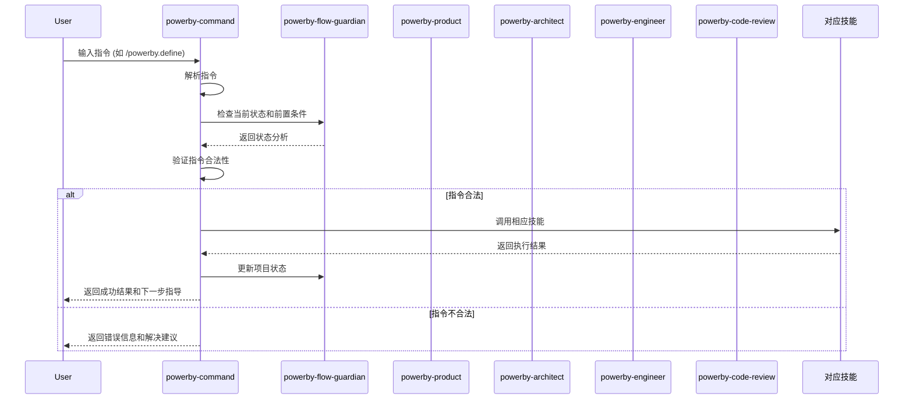

# PowerBy Command Skill - 指令管理技能

**版本**: v1.0.0
**创建日期**: 2025-12-18
**技能类型**: 核心技能 (Core Skill)

## 📋 概述

PowerBy Command Skill 是PowerBy生态的指令管理核心技能，负责解析和执行PowerBy指令、调用对应的核心技能完成任务、管理项目流程状态、提供流程维护和指导。它集成Flow Guardian确保严格遵循P0-P8生命周期，通过统一指令接口协调powerby-product、powerby-architect、powerby-engineer、powerby-code-review等核心技能。

## ✨ 核心特性

- **🔄 技能协作**: 通过skill调用接口协调各个核心技能
- **📊 状态管理**: 跟踪和管理项目流程状态
- **🛡️ 流程维护**: 集成Flow Guardian确保流程合规
- **🎯 指令解析**: 理解并执行多种格式的PowerBy指令
- **📏 质量保障**: 9个质量门禁确保每个阶段的输出质量

## 🏗️ 架构设计

```mermaid
graph TB
    subgraph "PowerBy Skills 生态"
        PM[powerby-product<br/>产品经理]
        ARCH[powerby-architect<br/>架构师]
        ENG[powerby-engineer<br/>工程师]
        CR[powerby-code-review<br/>代码审查]
        FG[powerby-flow-guardian<br/>流程守护者]
        CMD[powerby-command<br/>指令管理] ⭐
    end

    subgraph "指令调用"
        INIT[/powerby.initialize]
        DEFINE[/powerby.define]
        CLARIFY[/powerby.clarify]
        RESEARCH[/powerby.research]
        DESIGN[/powerby.design]
        PLAN[/powerby.plan]
        IMPLEMENT[/powerby.implement]
        REVIEW[/powerby.review]
    end

    %% 指令到CMD的关系
    INIT --> CMD
    DEFINE --> CMD
    CLARIFY --> CMD
    RESEARCH --> CMD
    DESIGN --> CMD
    PLAN --> CMD
    IMPLEMENT --> CMD
    REVIEW --> CMD

    %% CMD到技能的映射
    CMD --> PM
    CMD --> ARCH
    CMD --> ENG
    CMD --> CR

    %% 流程维护
    CMD -.-> FG

    classDef commandSkill fill:#4caf50,stroke:#388e3c,stroke-width:3px,color:#fff
    class CMD commandSkill
```

## 🚀 快速开始

### 技能安装

```bash
# 克隆项目
git clone <repository-url>
cd powerby-skills/skills/powerby-command

# 查看技能文档
cat SKILL.md
```

### 指令使用示例

在支持PowerBy Skills的环境中，您可以通过以下方式使用指令：

```bash
# 1. 项目初始化 (P0)
/powerby.initialize my-project "这是一个PowerBy项目" --team "张三,李四" --tech-stack "Python+React"

# 2. 需求定义 (P1) - 调用 powerby-product
/powerby.define "我想构建一个任务管理系统" --user-group "团队成员" --problem "任务分配不清晰"

# 3. 需求澄清 (P2) - 调用 powerby-product
/powerby.clarify --questions 5

# 4. 技术调研 (P3) - 调用 powerby-architect
/powerby.research

# 5. 架构设计 (P4) - 调用 powerby-architect
/powerby.design

# 6. 任务规划 (P5) - 调用 powerby-engineer
/powerby.plan --tasks-per-day 3

# 7. 开发实现 (P6) - 调用 powerby-engineer
/powerby.implement --tdd

# 8. 代码审查 (P7-P8) - 调用 powerby-code-review
/powerby.review
```

### 查看当前状态

```bash
# 使用Flow Guardian查看项目状态
/powerby-flow-guardian analyze
```

## 📖 指令参考

### 指令序列

```
/powerby.initialize → /powerby.define → /powerby.clarify →
/powerby.research → /powerby.design → /powerby.plan →
/powerby.implement → /powerby.review
```

### 指令映射表

| 指令 | 对应技能 | 执行阶段 | 主要职责 | 输出文档 |
|------|---------|---------|---------|----------|
| `/powerby.initialize` | powerby-command (内部) | P0 | 项目初始化和宪章建立 | constitution.md, project.json |
| `/powerby.define` | powerby-product | P1 | 需求定义和功能点清单 | prd.md, function-points.md |
| `/powerby.clarify` | powerby-product | P2 | 需求澄清和边界明确 | clarifications.md |
| `/powerby.research` | powerby-architect | P3 | 技术调研和方案确认 | research.md |
| `/powerby.design` | powerby-architect | P4 | 架构设计和方案确认 | architecture.md, data-model.md |
| `/powerby.plan` | powerby-engineer | P5 | 任务规划和方案确认 | tasks.md |
| `/powerby.implement` | powerby-engineer | P6 | 开发实现和交付 | implementation-report.md |
| `/powerby.review` | powerby-code-review | P7-P8 | 代码审查和项目交付 | code-review-report.md |

### 指令执行流程



## 🔍 质量门禁

每个阶段都有对应的质量门禁检查：

| Gate | 阶段 | 检查要点 | 通过标准 |
|------|------|----------|----------|
| Gate 1 | P1→P2 | MVP范围合理性 | 5项验收标准 |
| Gate 2 | P2→P3 | 需求澄清充分性 | 4项验收标准 |
| Gate 3 | P3→P4 | 技术调研完整性 | 4项验收标准 |
| Gate 4 | P4→P5 | 架构设计清晰性 | 5项验收标准 |
| Gate 5 | P5→P6 | 开发规划详细性 | 5项验收标准 |
| Gate 6 | P6→P7 | 开发实现质量 | 6项验收标准 |
| Gate 7 | P7→P8 | 代码审查严格性 | 5项验收标准 |
| Gate 8 | P8→完成 | 项目交付完整性 | 6项验收标准 |

## 🎯 最佳实践

### ✅ 推荐做法

1. **严格遵循流程**: 不跳过任何阶段或门禁
2. **充分确认**: 每个阶段都等待门禁检查通过
3. **记录决策**: 所有重要决策都有文档记录
4. **及时更新**: 状态变化立即更新到项目元数据
5. **主动澄清**: 遇到模糊点主动询问Flow Guardian

### ❌ 避免做法

1. **流程跳跃**: 不要跳过前置阶段直接进入后续阶段
2. **门禁绕过**: 不要绕过质量门禁检查
3. **文档滞后**: 避免代码实现与文档不同步
4. **重复造轮子**: 优先使用现有库和服务

## 📁 项目结构

```
powerby-skills/
├── skills/                          # PowerBy技能目录
│   ├── powerby-command/             # 指令管理技能
│   │   └── SKILL.md                 # 技能文档
│   ├── powerby-product/             # 产品经理技能
│   ├── powerby-architect/           # 架构师技能
│   ├── powerby-engineer/            # 工程师技能
│   ├── powerby-code-review/         # 代码审查技能
│   ├── powerby-flow-guardian/       # 流程守护技能
│   │   ├── SKILL.md
│   │   ├── powerby-flow-guardian-overview.md
│   │   ├── powerby-flow-guardian-integration.md
│   │   └── powerby-flow-guardian-summary.md
│   └── implementations/             # 技能实现
│       ├── powerby_command.py       # 指令系统Python实现
│       └── powerby_flow_guardian.py # 流程守护Python实现
└── docs/                            # 文档目录
    ├── powerby-lifecycle-overview.md
    └── powerby-command-design-summary.md
```

## 🔧 技能集成

### 与Flow Guardian的协作

powerby-command与powerby-flow-guardian紧密协作：

1. **状态检查**: 每次执行前调用Flow Guardian检查当前状态
2. **前置验证**: 使用Flow Guardian验证前置条件
3. **门禁更新**: 执行后更新门禁状态到Flow Guardian
4. **指导生成**: 基于Flow Guardian的状态生成下一步指导

### 与核心技能的协作

| 指令阶段 | 调用技能 | 传递参数 |
|---------|---------|---------|
| P0 | powerby-command (内置) | 项目名称、描述、团队、技术栈 |
| P1-P2 | powerby-product | PRD路径、功能点、澄清记录 |
| P3-P4 | powerby-architect | 需求文档、调研报告、架构约束 |
| P5-P6 | powerby-engineer | 架构文档、任务计划、实现要求 |
| P7-P8 | powerby-code-review | 所有文档、代码链接、审查标准 |

## 📚 相关文档

- [PowerBy 生命周期概览](docs/powerby-lifecycle-overview.md)
- [PowerBy 指令流程设计总结](docs/powerby-command-design-summary.md)
- [PowerBy Flow Guardian 技能](skills/powerby-flow-guardian-overview.md)
- [PowerBy Command Skill 设计文档](skills/powerby-command-skill.md)

## 🛠️ 错误处理与指导

### 常见错误场景

#### 1. 前置条件错误
```
❌ 错误: 当前阶段是P0，需要P1阶段才能执行此指令

💡 建议: 请先执行 /powerby.initialize 完成项目初始化
```

#### 2. 文档缺失错误
```
❌ 错误: 缺少必需文档: docs/constitution.md

💡 建议: 请先执行 /powerby.initialize 创建项目宪章
```

#### 3. 流程跳跃错误
```
❌ 错误: 无法从P0直接跳转到P3

💡 建议: 正确流程: P0 → P1 → P2 → P3
   当前应执行: /powerby.define
```

#### 4. 门禁检查失败
```
❌ 错误: Gate 1检查失败 - MVP范围不合理

💡 建议:
   - 重新审视核心价值定义
   - 削减非必要功能
   - 使用 /powerby.define 重新定义需求
```

## 📝 更新日志

### v1.0.0 (2025-12-18)

- ✅ 初始版本发布
- ✅ 完成8个核心指令的设计
- ✅ 完成技能集成架构
- ✅ 完成与Flow Guardian的协作
- ✅ 完成Python实现框架
- ✅ 完成质量门禁系统

## 📄 许可证

MIT License

## 👥 团队

- **设计师**: Claude
- **维护者**: PowerBy Team

---

**注意**: 本技能严格遵循PowerBy生命周期框架，确保项目开发的每个阶段都经过严格的质量门禁检查，防止流程跳跃和质量退化。
