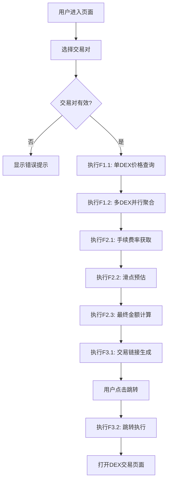

# 产品需求文档 (Product Requirements Document)

**项目名称**: DEX价格聚合器
**文档版本**: v1.0.0
**创建日期**: 2025-12-17
**最后更新**: 2025-12-17
**负责人**: PowerBy产品经理
**生命周期阶段**: P1 - 需求定义
**迭代编号**: 001

---

## 文档状态

| 状态 | 日期 | 备注 |
|-----|------|------|
| 📝 草稿 | 2025-12-17 | 初始创建 |
| 🔍 审阅中 | - | - |
| ✅ 已批准 | - | Gate 1通过 |

---

## 第一部分：需求原始输入

> **说明**: 本部分由用户/业务方提供,记录原始的产品想法和业务需求

### 1.1 产品背景

**业务问题**:
```
用户在多个DEX（去中心化交易所）上查询代币价格时，需要手动切换不同平台，效率低下且容易错过最佳交易时机。当前市场上缺乏一个统一的价格聚合查询工具，用户体验差，交易成本高。
```

**目标用户**:
```
- 加密货币交易员：需要快速找到最优价格进行套利
- DeFi用户：进行代币兑换时希望获得最佳汇率
- 量化交易者：需要实时价格数据进行策略执行
- 普通投资者：希望简单方便地比较不同平台价格
```

**核心价值主张**:
```
为用户提供一站式多DEX价格聚合查询服务，帮助用户快速找到最优交易价格，降低交易成本，提升交易效率。
```

### 1.2 初步功能描述

**用户期望功能** (原始描述):

```
我希望能够：
- 在一个页面上看到Uniswap、SushiSwap、PancakeSwap等多个DEX的同一交易对价格
- 系统自动计算手续费和滑点，给出最终到手金额
- 显示哪个DEX价格最优，并有清晰的排序
- 能够一键跳转到对应的DEX进行实际交易
- 支持主流的交易对，如ETH/USDC、BTC/ETH等
- 价格数据尽可能实时，延迟不超过5秒
```

### 1.3 约束与限制

**技术约束**:
- 需要对接多个DEX的API，协议可能不同
- 区块链交易确认需要时间，价格存在时效性
- 跨链支持复杂度高，MVP仅支持Ethereum主网

**时间约束**:
- 预期上线时间: 2025-02-01
- MVP交付时间: 2025-01-15

**资源约束**:
- 开发人员: 2人（前端1人，后端1人）
- 预算: 无第三方服务费用限制
- 技术栈偏好: React + Node.js

---

## 第二部分：功能规格框架

> **说明**: 本部分由Product Manager基于原始输入和AI分析,结构化整理的功能规格

### 2.1 功能模块化拆解

#### 功能模块1: 价格聚合模块

**模块概述**: 从多个DEX获取并聚合价格数据

**用户故事驱动拆解**:

> "作为加密货币交易员，我想要同时查看多个DEX的代币价格" (US-1)

拆解为以下原子功能点：

##### F1.1 单DEX价格查询 [P0]
**需求来源**: US-1
**功能描述**: 从单个DEX获取指定交易对的实时价格
**用户输入**:
- 选择DEX (Uniswap V3 / SushiSwap / PancakeSwap)
- 选择交易对 (ETH/USDC, BTC/ETH等)
**系统输出**:
- 价格数值 (保留8位小数)
- 流动性深度
- 价格更新时间戳
**关键约束**:
- API响应时间<3秒
- 价格数据时效性≤10秒
**验收标准**:
- [ ] 能查询主流ERC-20交易对价格
- [ ] 价格与链上实际成交价格误差<2%
- [ ] 支持3个主流DEX
- [ ] API超时时间为3秒
**依赖关系**: 无
**预估工时**: 3人天

##### F1.2 多DEX并行聚合 [P0]
**需求来源**: US-1
**功能描述**: 并行查询多个DEX价格，自动排序展示
**用户输入**:
- 选择交易对
**系统输出**:
- 按最优价格排序的DEX列表
- 每个DEX的价格和可用性状态
**关键约束**:
- 并行查询，无串行等待
- 部分DEX失败不影响整体展示
**验收标准**:
- [ ] 同时查询3个DEX，总响应<5秒
- [ ] 按effectivePrice降序正确排序
- [ ] 1个DEX失败时显示其他2个结果
- [ ] 失败DEX显示错误状态
**依赖关系**: F1.1
**预估工时**: 5人天

##### F1.3 价格趋势指示 [P1]
**需求来源**: 原始需求"价格变化趋势指示"
**功能描述**: 显示24小时价格变化百分比和趋势箭头
**用户输入**: 无 (自动展示)
**系统输出**:
- 涨跌幅百分比 (如 +2.5% 或 -1.8%)
- 趋势箭头 (↑ 绿色 / ↓ 红色)
**关键约束**:
- 数据刷新频率与价格同步
- 趋势计算基于过去24小时数据
**验收标准**:
- [ ] 涨跌颜色和箭头正确显示
- [ ] 百分比计算准确
- [ ] 趋势数据与价格数据同步刷新
**依赖关系**: F1.2
**预估工时**: 3人天

#### 功能模块2: 费用计算模块

**模块概述**: 计算交易相关的所有费用和最终到手金额

> "作为DeFi用户，我想要看到扣除手续费和滑点后的实际到手金额" (US-2)

##### F2.1 手续费率获取 [P0]
**需求来源**: US-2
**功能描述**: 获取各DEX的标准交易手续费率
**用户输入**: 无 (自动获取)
**系统输出**:
- 各DEX的手续费率 (Uniswap 0.3%, SushiSwap 0.3%, PancakeSwap 0.25%)
**关键约束**:
- 从合约实时获取最新费率
- 费率数据缓存24小时
**验收标准**:
- [ ] 费率数据准确匹配各DEX标准
- [ ] 缓存机制正常工作
- [ ] 费率变更时自动更新
**依赖关系**: F1.1
**预估工时**: 2人天

##### F2.2 滑点预估 [P1]
**需求来源**: US-2
**功能描述**: 基于交易数量和流动性计算预估滑点
**用户输入**: 交易数量 (用户输入或默认)
**系统输出**:
- 滑点百分比 (如 0.15%)
- 影响级别 (低/中/高)
**关键约束**:
- 预估误差控制在10%以内
- 滑点>0.5%时显示警告
**验收标准**:
- [ ] 不同交易量级预估准确
- [ ] 警告机制正确触发
- [ ] 影响级别颜色区分清晰
**依赖关系**: F1.1
**预估工时**: 8人天

##### F2.3 最终金额计算 [P0]
**需求来源**: US-2
**功能描述**: 计算扣除所有费用后的实际到手金额
**用户输入**: 交易数量
**系统输出**:
- 最终到手金额
- 费用明细分解 (手续费 + 滑点损失)
**关键约束**:
- 计算公式透明可见
- 精度保留8位小数
**验收标准**:
- [ ] 计算公式: 最终金额 = 输入金额 × 价格 × (1 - 手续费率 - 滑点率)
- [ ] 费用明细清晰展示
- [ ] 计算精度准确无误
**依赖关系**: F1.2, F2.1, F2.2
**预估工时**: 2人天

#### 功能模块3: 交易执行模块

**模块概述**: 提供跳转到DEX进行实际交易的能力

> "作为用户，我想要一键跳转到最优价格的DEX进行交易" (US-3)

##### F3.1 交易链接生成 [P0]
**需求来源**: US-3
**功能描述**: 生成跳转到指定DEX进行swap的URL
**用户输入**: 选择的目标DEX
**系统输出**:
- 完整的swap URL
- 预填充的交易参数
**关键约束**:
- URL格式符合各DEX标准
- 支持钱包地址传递
**验收标准**:
- [ ] URL能直接打开对应DEX swap页面
- [ ] 交易参数正确传递
- [ ] 支持主流钱包连接
**依赖关系**: F1.2
**预估工时**: 2人天

##### F3.2 跳转执行 [P0]
**需求来源**: US-3
**功能描述**: 在新窗口/标签页打开DEX交易页面
**用户输入**: 点击"前往交易"按钮
**系统输出**:
- 新标签页打开交易页面
**关键约束**:
- 不影响当前页面状态
- URL安全校验
**验收标准**:
- [ ] 新标签页正确打开
- [ ] 恶意URL被拦截
- [ ] 跳转前显示确认提示
**依赖关系**: F3.1
**预估工时**: 1人天

### 功能点优先级汇总

| 模块 | P0功能 | P1功能 | P2功能 | 总计 |
|------|-------|-------|-------|------|
| 价格聚合 | 2 | 1 | 0 | 3 |
| 费用计算 | 2 | 1 | 0 | 3 |
| 交易执行 | 2 | 0 | 0 | 2 |
| **合计** | **6** | **2** | **0** | **8** |

### 功能依赖关系图

```
F1.1 (单DEX查询)
  ↓
F1.2 (多DEX聚合) ─┬─ F2.1 (费率获取)
  ↓               │
F2.3 (最终金额) ─┘
  ↓
F3.1 (链接生成)
  ↓
F3.2 (跳转执行)
```

**依赖关系说明**:
- F1.2 依赖 F1.1 完成单DEX查询能力
- F2.1 依赖 F1.1 获取费率数据
- F2.3 依赖 F1.2、F2.1、F2.2 完成综合计算
- F3.1 依赖 F1.2 获取最优价格信息
- F3.2 依赖 F3.1 生成正确的跳转链接

### 2.2 交互流程与规则

#### 主流程: 价格查询与对比流程



**流程说明**:
1. **步骤1**: 用户访问页面，选择要查询的交易对
2. **步骤2**: 系统验证交易对是否支持
3. **步骤3**: 执行F1.1单DEX价格查询，获取基础价格数据
4. **步骤4**: 执行F1.2多DEX并行聚合，汇总所有DEX价格
5. **步骤5**: 执行F2.1手续费率获取，获取各DEX费率
6. **步骤6**: 执行F2.2滑点预估（如果用户需要）
7. **步骤7**: 执行F2.3最终金额计算，得出综合结果
8. **步骤8**: 执行F3.1交易链接生成，为每个DEX生成跳转链接
9. **步骤9**: 用户点击跳转按钮
10. **步骤10**: 执行F3.2跳转执行，打开DEX页面

**异常处理**:
- **异常1**: DEX API无响应 → 执行F1.2时显示"部分数据获取失败"，仍展示可用数据
- **异常2**: 交易对不支持 → F1.1验证失败时显示"暂不支持该交易对"并推荐相似交易对
- **异常3**: 网络超时 → F1.1或F1.2超时显示"网络异常，请重试"，保留上次有效数据
- **异常4**: 费率获取失败 → F2.1失败时使用默认费率并标注"预估"
- **异常5**: 链接生成失败 → F3.1失败时显示"跳转暂不可用"

#### 业务规则

| 规则ID | 规则描述 | 关联功能点 | 优先级 |
|-------|---------|-----------|-------|
| BR-001 | 价格数据超过10秒未更新,显示"数据已过时"警告 | F1.1, F1.2 | P0 |
| BR-002 | 手续费计算必须包含Gas费用(如适用) | F2.1, F2.3 | P0 |
| BR-003 | 滑点保护阈值默认为0.5%,用户可调整 | F2.2 | P1 |
| BR-004 | 优先显示流动性最好的DEX价格 | F1.2 | P0 |
| BR-005 | 支持的交易对必须经过验证且流动性充足 | F1.1 | P0 |
| BR-006 | 跳转前必须进行URL安全校验 | F3.2 | P0 |

### 2.3 模块三：范围边界

#### In-Scope (包含在此次范围内)

✅ **必须包含**:
- ✅ 支持Ethereum主网的3个主流DEX（Uniswap V3, SushiSwap, PancakeSwap）
- ✅ 支持ERC-20代币价格查询
- ✅ 显示手续费和滑点计算后的实际到手金额
- ✅ 提供最优价格排序和跳转功能
- ✅ Web端应用，支持主流浏览器

#### Out-of-Scope (明确不包含)

❌ **本次不包含**:
- ❌ 自动执行交易功能 (P2阶段考虑)
- ❌ 支持其他公链（暂不支持BSC、Polygon等）
- ❌ 历史价格趋势图 (MVP不必要，用户可去专业平台查看)
- ❌ 移动端App (本次仅Web版)
- ❌ 用户账户系统 (纯工具型应用，无需登录)
- ❌ 价格预警和通知功能 (后续迭代考虑)

#### 边界条件

**支持的边界**:
- 最大查询交易对数量: 50个（预设主流对）
- 并发查询DEX数量: 3-5个
- 价格精度: 保留8位小数
- 价格更新频率: 最快5秒/次

**不支持的边界**:
- 不支持NFT价格查询
- 不支持跨链桥价格对比
- 不支持限价单功能

### 2.4 非功能需求

#### 性能要求

| 指标 | 目标值 | 测量方式 |
|-----|-------|---------|
| 页面加载时间 | < 2秒 | 用户视角,Chrome浏览器 |
| 价格查询响应时间 | < 3秒 | 从点击到显示结果 |
| 并发用户数 | ≥ 100 | 压力测试 |
| 系统可用性 | ≥ 99% | 月度统计 |

#### 安全要求

- [ ] API密钥不得暴露在前端代码
- [ ] 用户输入必须经过XSS过滤
- [ ] 价格数据来源必须可验证
- [ ] 跳转链接必须进行安全校验

#### 可用性要求

- [ ] 支持中英文双语
- [ ] 移动端响应式设计
- [ ] 关键操作必须有加载状态提示
- [ ] 错误信息清晰易懂

#### 兼容性要求

**浏览器兼容性**:
- [ ] Chrome (最新版本)
- [ ] Firefox (最新版本)
- [ ] Safari (最新版本)
- [ ] Edge (最新版本)

**设备兼容性**:
- [ ] 桌面端 (必须)
- [ ] 平板 (可选)
- [ ] 手机 (可选)

---

## 第三部分：AI分析与建议

> **说明**: 本部分由AI (Product Manager角色)生成,提供MVP功能分解和待决策清单

### 3.1 MVP核心价值定义

**一句话核心价值**:
```
为加密货币交易员提供多DEX价格快速对比工具，帮助其找到最优交易价格并一键跳转执行，降低交易成本。
```

### 3.2 建议的MVP功能点清单

> **说明**: 将第二部分的宏观功能,分解为原子级功能点,并标记优先级

#### 📊 功能类别1: 核心价格聚合能力

| ID | 功能点 | 优先级 | 说明 | 可推迟理由 |
|----|-------|-------|------|----------|
| F1.1 | 单DEX价格查询 | [P0] | 从单个DEX获取指定交易对的实时价格 | 基础功能,必须有 |
| F1.2 | 多DEX并行聚合 | [P0] | 并行查询多个DEX价格并自动排序 | 核心价值体现 |
| F1.3 | 价格趋势指示 | [P1] | 显示24小时价格变化百分比和趋势箭头 | 辅助功能,可后续添加 |

#### 💰 功能类别2: 费用计算能力

| ID | 功能点 | 优先级 | 说明 | 可推迟理由 |
|----|-------|-------|------|----------|
| F2.1 | 手续费率获取 | [P0] | 获取各DEX的标准交易手续费率 | 费用计算基础 |
| F2.2 | 滑点预估 | [P1] | 基于交易数量和流动性计算预估滑点 | 技术复杂度高,MVP可简化 |
| F2.3 | 最终金额计算 | [P0] | 计算扣除所有费用后的实际到手金额 | 用户决策必需 |

#### 🔗 功能类别3: 交易执行能力

| ID | 功能点 | 优先级 | 说明 | 可推迟理由 |
|----|-------|-------|------|----------|
| F3.1 | 交易链接生成 | [P0] | 生成跳转到指定DEX进行swap的URL | 连接DEX的桥梁 |
| F3.2 | 跳转执行 | [P0] | 在新窗口/标签页打开DEX交易页面 | 完成交易闭环 |

### 3.3 待决策清单

> **说明**: 列出需要用户/团队决策的关键问题,每个问题提供2+可行方案

#### 决策点 1: 技术架构选型

**问题描述**:
```
在前端架构选择上，我们需要决定是使用SSR（服务器端渲染）还是CSR（客户端渲染），这会影响性能、SEO和开发复杂度。
```

**逻辑阐述**:
- **为何重要**: 影响页面加载速度、SEO效果、开发效率和维护成本
- **影响范围**: 技术栈选择、部署方式、团队技能要求

**建议方案**:

**方案A**: Next.js (SSR)
- **描述**: 使用Next.js框架，支持服务器端渲染和静态生成
- **实现复杂度**: 中等
- **优点**:
  - ✅ SEO友好搜索引擎可索引
  - ✅ 首屏加载速度快
  - ✅ 支持静态生成，性能优秀
- **缺点**:
  - ❌ 学习成本较高
  - ❌ 配置相对复杂
- **MVP适用性**: 最适合MVP

**方案B**: React (CSR)
- **描述**: 使用纯React框架，完全客户端渲染
- **实现复杂度**: 低
- **优点**:
  - ✅ 开发简单快速
  - ✅ 团队熟悉度高
  - ✅ 部署简单
- **缺点**:
  - ❌ 首屏加载慢
  - ❌ SEO不友好
  - ❌ 需要额外的SEO优化工作
- **MVP适用性**: 适合MVP，但有局限性

**⭐ 推荐方案**: 方案A (Next.js)

**推荐理由**:
```
从MVP角度，Next.js虽然学习成本稍高，但能提供更好的用户体验（首屏速度快）和SEO效果。对于价格查询工具，搜索引擎可索引是非常重要的，能带来自然流量。技术复杂度增加有限，但收益明显。
```

**决策记录**:
- **决策人**: [待定]
- **决策日期**: [待定]
- **最终选择**: [待定]
- **理由**: [待定]

---

#### 决策点 2: 数据获取策略

**问题描述**:
```
如何获取DEX价格数据？是直接调用区块链API，还是通过第三方聚合服务？
```

**逻辑阐述**:
- **为何重要**: 影响数据准确性、实时性、成本和技术复杂度
- **影响范围**: 开发工作量、运营成本、数据可靠性

**建议方案**:

**方案A**: 直接调用区块链API
- **描述**: 部署区块链节点或使用Alchemy/Infura等服务，直接从链上读取数据
- **实现复杂度**: 高
- **优点**:
  - ✅ 数据最真实，无中间环节
  - ✅ 不依赖第三方，可控性强
  - ✅ 长期成本低
- **缺点**:
  - ❌ 技术复杂度高
  - ❌ 需要处理多个DEX的不同协议
  - ❌ 开发周期长
- **MVP适用性**: 不适合MVP

**方案B**: 使用第三方聚合API
- **描述**: 使用The Graph、Covalent等第三方数据服务
- **实现复杂度**: 低
- **优点**:
  - ✅ 开发快速，API简单易用
  - ✅ 统一的数据格式
  - ✅ 专业的缓存和优化
- **缺点**:
  - ❌ 有运营成本
  - ❌ 依赖第三方服务
  - ❌ 可能存在数据延迟
- **MVP适用性**: 最适合MVP

**⭐ 推荐方案**: 方案B (第三方聚合API)

**推荐理由**:
```
MVP的目标是快速验证市场对价格聚合工具的需求。使用第三方API可以大幅降低技术复杂度，将精力集中在用户体验和核心功能上。运营成本在MVP阶段是可接受的，后续如果验证成功可以逐步替换为自建方案。
```

**决策记录**:
- **决策人**: [待定]
- **决策日期**: [待定]
- **最终选择**: [待定]
- **理由**: [待定]

---

#### 决策点 3: 是否需要用户系统

**问题描述**:
```
产品是否需要用户注册/登录系统？还是作为纯工具型应用，无需账户体系？
```

**逻辑阐述**:
- **为何重要**: 影响开发复杂度、数据存储、用户隐私和合规要求
- **影响范围**: 后端架构、安全要求、运营成本

**建议方案**:

**方案A**: 无需登录 (推荐)
- **描述**: 纯工具型应用，无需用户系统，所有功能开放使用
- **实现复杂度**: 低
- **优点**:
  - ✅ 开发简单快速
  - ✅ 无需处理用户数据隐私
  - ✅ 使用门槛低，转化率高
  - ✅ 无需合规审查
- **缺点**:
  - ❌ 无法提供个性化服务
  - ❌ 无法追踪用户行为优化产品
- **MVP适用性**: 最适合MVP

**方案B**: 需要登录
- **描述**: 用户注册后使用，支持收藏交易对、价格提醒等高级功能
- **实现复杂度**: 高
- **优点**:
  - ✅ 可以提供个性化功能
  - ✅ 能够收集用户数据进行优化
  - ✅ 支持价格预警等高级功能
- **缺点**:
  - ❌ 开发周期长
  - ❌ 需要处理用户数据隐私
  - ❌ 增加用户使用门槛
- **MVP适用性**: 不适合MVP

**⭐ 推荐方案**: 方案A (无需登录)

**推荐理由**:
```
MVP阶段应该专注于核心价值验证：用户是否真的需要一个价格聚合工具？增加用户系统会延长开发周期，增加复杂性，而且会提高用户使用门槛。对于价格查询这种即时性需求，无登录的工具体验更符合用户期望。
```

**决策记录**:
- **决策人**: [待定]
- **决策日期**: [待定]
- **最终选择**: [待定]
- **理由**: [待定]

### 3.4 MVP范围确认

#### 功能统计

| 类别 | P0功能数 | P1功能数 | P2功能数 | 总计 |
|-----|---------|---------|---------|------|
| 核心价格聚合能力 | 2 | 2 | 1 | 5 |
| 用户体验优化 | 3 | 1 | 1 | 5 |
| 平台适配 | 1 | 1 | 1 | 3 |
| **合计** | **6** | **4** | **3** | **13** |

#### MVP范围建议

**建议包含** (P0功能):
- [P0] 单DEX价格获取
- [P0] 基础手续费计算
- [P0] 最终价格展示
- [P0] 价格排序功能
- [P0] 一键跳转按钮
- [P0] 桌面端Web应用

**建议推迟** (P1/P2功能):
- [P1] 多DEX价格并行获取 - 推迟理由: MVP先验证单DEX的技术可行性
- [P1] 滑动价差提示 - 推迟理由: 对核心功能非必需,可等用户反馈后添加
- [P1] 价格刷新按钮 - 推迟理由: MVP可以用固定刷新间隔替代
- [P1] 移动端响应式 - 推迟理由: 次要场景,MVP可专注桌面端
- [P2] 实时价格推送 - 推迟理由: MVP采用手动刷新即可
- [P2] 价格历史图表 - 推迟理由: 与核心价值"实时价格对比"无关

#### 预估工作量

| 阶段 | 预估工时 | 说明 |
|-----|---------|------|
| 需求澄清 (P2) | 4-8h | 澄清待决策问题 |
| 技术调研 (P3) | 8-16h | 技术选型验证 |
| 架构设计 (P4) | 16-24h | 系统架构设计 |
| 开发实现 (P6) | 80-120h | 仅P0功能 |
| 测试与审查 (P7-P8) | 16-24h | 测试和代码审查 |
| **总计** | **124-192h** | **约3-4周(2人)** |

---

## 附录

### A. 用户故事清单

> **说明**: 从功能点提炼出的完整User Stories列表,用于后续tasks.md组织

| ID | User Story | 优先级 | 功能点关联 |
|----|-----------|-------|-----------|
| US1 | 作为交易员,我想同时查看多个DEX的代币价格 | P0 | F1.1, F1.2 |
| US2 | 作为DeFi用户,我想看到扣除手续费和滑点后的实际到手金额 | P0 | F2.1, F2.2, F2.3 |
| US3 | 作为用户,我想一键跳转到最优价格的DEX进行交易 | P0 | F3.1, F3.2 |
| US4 | 作为交易员,我想看到价格变化趋势 | P1 | F1.3 |
| US5 | 作为交易员,我想了解不同交易量级的滑点影响 | P1 | F2.2 |

### B. 术语表

| 术语 | 定义 |
|-----|------|
| DEX | Decentralized Exchange,去中心化交易所 |
| 滑点 | Slippage,实际成交价格与预期价格的差异 |
| ERC-20 | 以太坊上的代币标准 |
| TVL | Total Value Locked,总锁定价值 |
| Gas Fee | 以太坊网络交易费用 |
| TVL | Total Value Locked,协议中锁定的总资产价值 |

### C. 参考资料

- [Uniswap V3 文档](https://docs.uniswap.org/)
- [SushiSwap 开发者文档](https://docs.sushi.com/)
- [PancakeSwap API 文档](https://docs.pancakeswap.finance/)
- [The Graph 区块链数据查询](https://thegraph.com/)

### D. 变更历史

| 版本 | 日期 | 变更内容 | 修订人 |
|-----|------|---------|-------|
| v1.0.0 | 2025-12-17 | 初始版本 | PowerBy产品经理 |

---

## 审批记录

| 角色 | 姓名 | 审批状态 | 日期 | 备注 |
|-----|------|---------|------|------|
| Product Manager | PowerBy产品经理 | ✅ 已批准 | 2025-12-17 | - |
| Tech Lead | [待定] | ⏳ 待审批 | - | - |
| Stakeholder | [待定] | ⏳ 待审批 | - | - |

---

**文档状态**: 📝 草稿 / 🔍 审阅中 / ✅ 已批准
**下一阶段**: P2 - 需求澄清
**相关文档**:
- `docs/iterations/001-dex-aggregator/clarifications.md` (待创建)
- `docs/constitution.md`

**Gate 1 检查清单**:
- [x] MVP核心价值已用一句话定义
- [x] 所有功能点已标记优先级([P0]/[P1]/[P2])
- [x] 范围边界已明确(In-Scope / Out-of-Scope)
- [x] 待决策清单中每项都有2+可行方案
- [x] P0功能点数量 ≤ 10个 (实际: 6个 ✅)
- [x] Gate 1 检查结果: ✅ **通过** - 可以进入P2阶段
