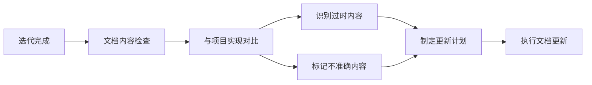
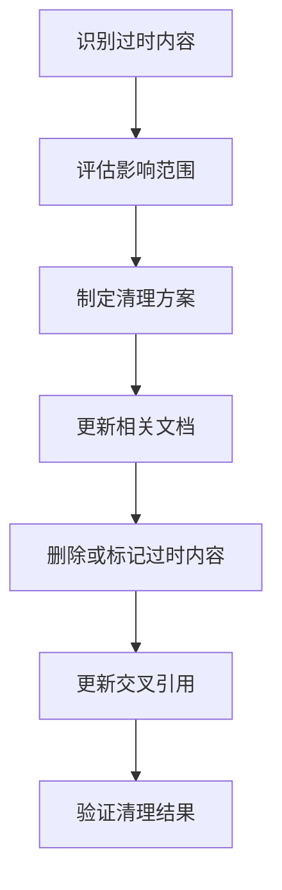
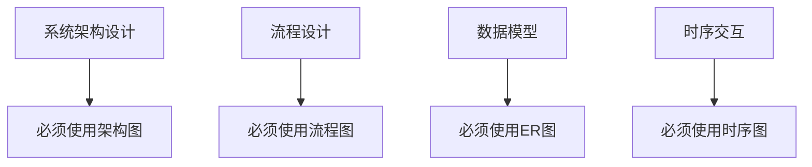
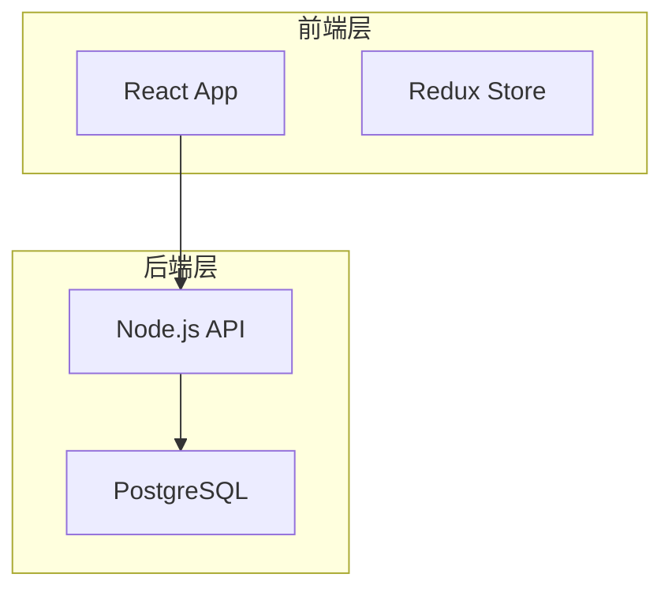
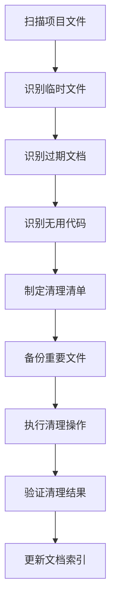
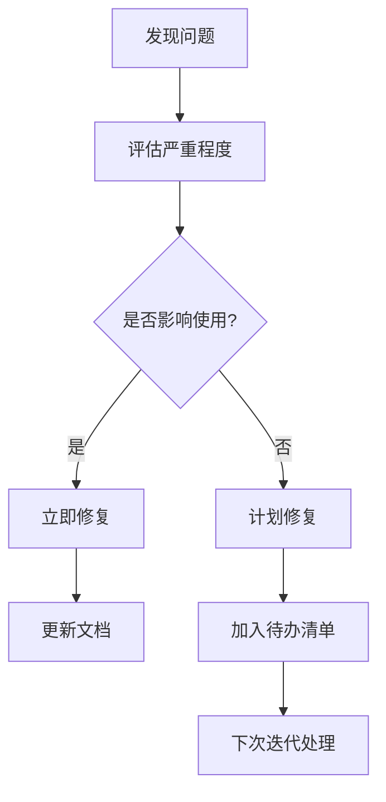

# 流程维护者 - 文档与项目整洁性维护职责

**版本**: v1.0.0
**创建日期**: 2025-12-19
**适用范围**: PowerBy 全项目
**维护者**: 流程维护者 (Process Maintainer)

---

## 一、文档生命周期管理职责

### 1.1 迭代文档检查与验证

#### 检查范围
每次迭代完成后，流程维护者必须检查：

**核心文档**：
- ✅ PRD文档 (`prd.md`)
- ✅ 功能点清单 (`function-points.md`)
- ✅ 需求澄清记录 (`clarifications.md`)
- ✅ 技术调研文档 (`technical-research.md`)
- ✅ 架构设计文档 (`architecture.md`)
- ✅ 任务规划文档 (`tasks.md`)

**检查维度**：


#### 对比验证流程
1. **文档vs实现一致性检查**
   ```bash
   # 检查文档描述的功能是否已在代码中实现
   # 检查架构设计是否与实际代码结构一致
   # 检查任务清单是否与实际完成情况匹配
   ```

2. **版本同步检查**
   - 文档版本号与代码版本是否一致
   - 最后修改时间是否合理
   - 变更日志是否完整

3. **准确性与完整性验证**
   - 核心功能描述是否准确
   - 技术方案是否可行
   - 验收标准是否可测试

### 1.2 过时内容清理

#### 识别标准
以下内容应被标记为过时：
- ❌ **功能已废弃** - 文档中描述但代码中已移除的功能
- ❌ **技术已淘汰** - 使用过时技术栈的描述
- ❌ **流程已变更** - 与当前流程不符的操作步骤
- ❌ **版本已升级** - 旧版本特性的描述未更新

#### 清理流程


#### 处理方式
- **完全删除** - 内容完全过时且无参考价值
- **标记deprecated** - 暂时保留但标记为废弃
- **移动到archive** - 移到历史文档目录
- **更新为新版本** - 修改为当前有效内容

### 1.3 不准确内容修正

#### 常见不准确类型
1. **功能描述错误** - 文档与实际功能不符
2. **技术参数错误** - 版本号、配置参数等错误
3. **流程步骤错误** - 操作步骤与实际不符
4. **命名不一致** - 变量名、函数名、文件名不匹配

#### 修正标准
- **立即修正** - 影响功能使用的关键错误
- **计划修正** - 次要错误纳入迭代计划
- **版本修正** - 大型变更在版本更新时统一修正

---

## 二、文档结构化与可视化职责

### 2.1 Mermaid图表使用规范

#### 必须使用Mermaid的场景


**具体要求**：
- ✅ **架构文档** - 至少包含1张系统架构图
- ✅ **流程文档** - 关键流程必须使用流程图
- ✅ **设计文档** - 组件关系必须使用关系图
- ✅ **技术调研** - 技术选型对比必须使用对比表

#### Mermaid最佳实践
```markdown
# 好的例子


# 避免的例子
❌ 纯文字描述复杂架构
❌ 使用外部图片而非Mermaid
❌ 图表过于复杂（超过20个节点）
```

### 2.2 Markdown结构规范

#### 文档结构标准
```markdown
# 文档标题
**版本**: vX.X.X
**创建日期**: YYYY-MM-DD
**最后更新**: YYYY-MM-DD

---

## 一、概述
- 背景介绍
- 目的说明
- 适用范围

## 二、核心内容
### 2.1 细分主题1
### 2.2 细分主题2

## 三、示例
### 3.1 使用示例
### 3.2 最佳实践

## 四、注意事项
- 限制条件
- 常见错误
- 故障排除

---

## 相关文档
- [相关文档1](./doc1.md)
- [相关文档2](./doc2.md)
```

#### 内容组织原则
1. **分层清晰** - H1-H6层级合理
2. **内容完整** - 覆盖所有关键信息
3. **可读性强** - 段落长度适中，重点突出
4. **可维护性** - 模块化组织，便于更新

### 2.3 文档归档规范

#### 标准文档归档
```
docs/
├── constitution.md                    # 项目宪章（根目录）
├── PROJECT_STRUCTURE.md               # 项目结构说明
├── README.md                          # 项目说明
├── processes/                         # 流程文档
│   ├── P0_P1_MERGE_OPTIMIZATION_PLAN.md
│   ├── MVP_PRODUCT_REQUIREMENTS_PLAN.md
│   └── ...
├── architecture/                      # 架构文档
│   ├── system-overview.md
│   └── technology-stack.md
└── templates/                         # 文档模板
```

#### 迭代文档归档
```
docs/iterations/
├── 001-{project-name}/                # 迭代编号-项目名
│   ├── init.md                        # P0: 初始化
│   ├── prd.md                         # P1: 产品需求
│   ├── function-points.md             # P1: 功能点清单
│   ├── clarifications.md              # P1: 需求澄清
│   ├── technical-research.md          # P3: 技术调研
│   ├── architecture.md                # P4: 架构设计
│   └── tasks.md                       # P5: 任务规划
└── 002-{project-name}/
    └── ...
```

#### 非标准文档处理
对于没有明确归档位置的文档：
1. **临时文档** - 放在 `/docs/temp/`，定期清理
2. **实验文档** - 放在 `/docs/experiments/`，标记实验性质
3. **参考文档** - 放在 `/docs/references/`，注明来源和用途
4. **历史文档** - 放在 `/docs/archive/`，保留但不推荐使用

---

## 三、项目整洁性维护职责

### 3.1 定期清理任务

#### 清理频率
- **每次迭代结束后** - 清理迭代相关临时文件
- **每周一次** - 清理缓存文件和日志
- **每月一次** - 清理过期文档和备份
- **版本发布前** - 全面清理和整理

#### 清理范围

**临时文件**：
```bash
# 必须删除的文件类型
*.tmp          # 临时文件
*.log          # 日志文件
*.bak          # 备份文件
*.swp          # Vim临时文件
.DS_Store      # macOS系统文件
Thumbs.db      # Windows缩略图文件

# 必须删除的目录
__pycache__/           # Python缓存
node_modules/          # NPM依赖（如果有）
.pytest_cache/         # 测试缓存
*.egg-info/           # Python包信息
.coverage             # 覆盖率文件
htmlcov/              # 覆盖率报告
```

**过期文档**：
- 超过6个月未更新的文档
- 功能已废弃但未标记的文档
- 重复或冗余的文档
- 过期的配置文档

**无用的测试代码**：
- 未使用的测试用例
- 已删除功能的测试
- 调试用的临时测试
- 性能测试的临时脚本

#### 清理流程


### 3.2 项目结构优化

#### 目录结构规范
```
powerby-skills/
├── .git/                     # Git版本控制
├── .gitignore                # Git忽略规则
├── README.md                 # 项目说明
├── PROJECT_STRUCTURE.md      # 项目结构说明
├── docs/                     # 核心文档
│   ├── constitution.md       # 项目宪章
│   ├── processes/            # 流程文档
│   ├── architecture/         # 架构文档
│   └── iterations/           # 迭代文档
├── skills/                   # 技能模块
│   ├── powerby-product/      # 产品经理技能
│   ├── powerby-architect/    # 架构师技能
│   ├── powerby-engineer/     # 工程师技能
│   └── ...                   # 其他技能
├── templates/                # 文档模板
└── references/               # 参考资料
```

#### 文件命名规范
- **文档文件** - 使用短横线分隔：`document-name.md`
- **迭代文档** - 使用编号前缀：`001-project-name.md`
- **配置文件** - 使用点前缀：`.config-file`
- **模板文件** - 使用template后缀：`template-name.md.template`

### 3.3 质量检查清单

#### 文档质量检查
- [ ] 文档结构清晰，标题层级合理
- [ ] 关键内容使用Mermaid图表可视化
- [ ] 交叉引用链接有效
- [ ] 版本号和日期信息完整
- [ ] 无拼写和语法错误
- [ ] 格式统一，符合规范

#### 项目整洁性检查
- [ ] 无临时文件和缓存文件
- [ ] 无过期或废弃文档
- [ ] 目录结构清晰合理
- [ ] 文件命名规范一致
- [ ] .gitignore配置完整
- [ ] 无重复或冗余文件

#### 维护频率检查
- [ ] 每次迭代后更新文档
- [ ] 每周清理临时文件
- [ ] 每月审查文档有效性
- [ ] 版本发布前全面整理

---

## 四、工具与自动化

### 4.1 文档维护工具

#### 推荐工具
- **文档检查工具** - 链接检查器、拼写检查器
- **图表生成工具** - Mermaid Live Editor、Draw.io
- **格式检查工具** - Markdown Lint、Prettier
- **版本控制工具** - Git、GitHub/GitLab

#### 自动化脚本示例
```bash
#!/bin/bash
# 清理临时文件脚本

echo "开始清理临时文件..."

# 清理Python缓存
find . -type d -name "__pycache__" -exec rm -rf {} + 2>/dev/null
find . -name "*.pyc" -delete

# 清理系统文件
find . -name ".DS_Store" -delete 2>/dev/null
find . -name "Thumbs.db" -delete 2>/dev/null

# 清理日志文件
find . -name "*.log" -mtime +7 -delete 2>/dev/null

echo "临时文件清理完成"
```

### 4.2 文档验证流程

#### 预提交检查
```bash
# 提交前必须通过
1. 文档链接检查
2. 拼写和语法检查
3. Mermaid图表渲染检查
4. 格式规范检查
```

#### 定期审查
```bash
# 每月执行
1. 文档有效性审查
2. 过期内容识别
3. 交叉引用验证
4. 版本同步检查
```

---

## 五、职责执行指南

### 5.1 日常工作流程

**每日检查**：
- 检查新增文档是否符合规范
- 清理当日产生的临时文件
- 更新文档索引（如有变更）

**迭代后检查**：
- 验证迭代文档完整性
- 对比文档与实现一致性
- 清理迭代临时文件
- 更新相关文档交叉引用

**每周维护**：
- 清理缓存和临时文件
- 检查文档链接有效性
- 审查文档结构合理性
- 更新维护日志

**每月优化**：
- 全面审查文档有效性
- 识别和清理过期内容
- 优化文档结构和组织
- 制定改进计划

### 5.2 问题处理流程

#### 发现问题


#### 修复流程
1. **问题确认** - 验证问题确实存在
2. **影响评估** - 评估影响范围和严重程度
3. **修复方案** - 制定修复计划
4. **执行修复** - 更新文档或清理文件
5. **验证结果** - 确认问题已解决
6. **记录日志** - 记录修复过程和结果

### 5.3 绩效指标

#### 文档质量指标
- 文档覆盖率 ≥ 95%
- 文档准确率 ≥ 98%
- 链接有效率 ≥ 99%
- Mermaid图表完整率 = 100%

#### 项目整洁性指标
- 临时文件数量 = 0
- 过期文档数量 ≤ 5
- 重复文档数量 = 0
- 缓存目录数量 = 0

#### 维护效率指标
- 问题响应时间 ≤ 24小时
- 清理任务完成率 = 100%
- 文档更新及时率 ≥ 95%

---

## 六、注意事项

### 6.1 备份策略
- 删除文件前确认备份
- 重要文档修改前备份
- 定期备份整个文档库

### 6.2 变更通知
- 重大变更及时通知相关人员
- 更新文档索引和目录
- 记录变更日志

### 6.3 权限管理
- 文档修改权限控制
- 删除操作审批流程
- 版本回滚机制

---

## 七、相关文档

- [项目宪章](./constitution.md)
- [PowerBy工作流完整指南](./powerby-workflow-complete-guide.md)
- [P0+P1流程合并优化方案](./P0_P1_MERGE_OPTIMIZATION_PLAN.md)
- [MVP产品需求计划](./MVP_PRODUCT_REQUIREMENTS_PLAN.md)

---

**最后更新**: 2025-12-19
**维护者**: 流程维护者 (Process Maintainer)
**版本**: v1.0.0
