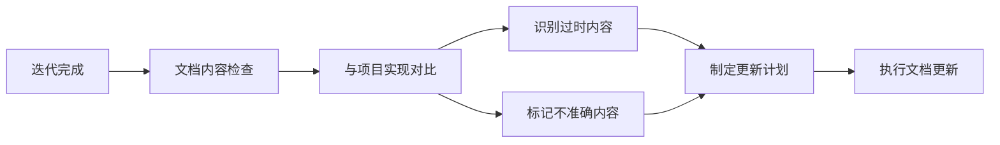
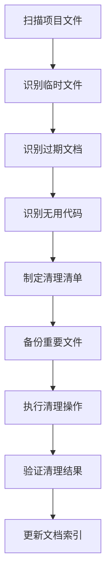

# 流程维护者 - 完整职责总结

**版本**: v2.0.0
**更新日期**: 2025-12-19
**适用范围**: PowerBy 全项目生态

---

## 🎯 职责概览

流程维护者是PowerBy生态的"系统管理员"，负责确保整个研发流程的**标准化**、**规范化**和**持续优化**。

---

## 📋 核心职责体系

### 一、流程文档维护 (Core)

#### 1.1 流程文档管理
- **维护P0-P8完整流程定义**
- **维护标准流程和快速流程规范**
- **维护宪章文档模板** (`constitution.md`)
- **维护MVP产品需求维度标准**

#### 1.2 模板和命令维护
- 维护所有命令模板：
  - `/powerby.define` - 需求定义命令
  - `/powerby.quick` - 快速流程命令
  - `/powerby.initialize` - 项目初始化（已标记deprecated）
  - `/powerby.research`, `/powerby.design`, `/powerby.plan`, `/powerby.implement`
- 维护所有文档模板：
  - PRD、功能点清单、技术调研、架构设计、任务规划模板

#### 1.3 质量门禁系统
- **Gate 0-7** (标准流程质量门禁)
- **Q-Gate 0-5** (快速流程质量门禁)
- 门禁通过标准定义与检查逻辑更新

---

### 二、文档与项目整洁性维护 ⭐ 新增

#### 2.1 迭代文档检查与验证


**检查范围**：
- ✅ PRD文档 (`prd.md`)
- ✅ 功能点清单 (`function-points.md`)
- ✅ 需求澄清记录 (`clarifications.md`)
- ✅ 技术调研文档 (`technical-research.md`)
- ✅ 架构设计文档 (`architecture.md`)
- ✅ 任务规划文档 (`tasks.md`)

**对比验证**：
- 文档vs实现一致性检查
- 版本同步检查
- 准确性与完整性验证

#### 2.2 过时内容清理
**识别标准**：
- ❌ 功能已废弃但文档未更新
- ❌ 技术已淘汰但描述未修改
- ❌ 流程已变更但步骤未同步
- ❌ 版本已升级但特性未更新

**处理方式**：
- **完全删除** - 内容完全过时且无参考价值
- **标记deprecated** - 暂时保留但标记为废弃
- **移动到archive** - 移到历史文档目录
- **更新为新版本** - 修改为当前有效内容

#### 2.3 文档结构化与可视化
**Mermaid图表使用规范**：
- ✅ **架构文档** - 至少包含1张系统架构图
- ✅ **流程文档** - 关键流程必须使用流程图
- ✅ **设计文档** - 组件关系必须使用关系图
- ✅ **技术调研** - 技术选型对比必须使用对比表

**Markdown结构规范**：
```markdown
# 文档标题
**版本**: vX.X.X
**创建日期**: YYYY-MM-DD
**最后更新**: YYYY-MM-DD

---

## 一、概述
## 二、核心内容
## 三、示例
## 四、注意事项

---

## 相关文档
```

#### 2.4 文档归档规范
**标准文档归档**：
```
docs/
├── constitution.md                    # 项目宪章
├── processes/                         # 流程文档
├── architecture/                      # 架构文档
└── templates/                         # 文档模板
```

**迭代文档归档**：
```
docs/iterations/
├── 001-{project-name}/
│   ├── init.md                        # P0: 初始化
│   ├── prd.md                         # P1: 产品需求
│   ├── function-points.md             # P1: 功能点清单
│   ├── clarifications.md              # P1: 需求澄清
│   ├── technical-research.md          # P3: 技术调研
│   ├── architecture.md                # P4: 架构设计
│   └── tasks.md                       # P5: 任务规划
```

---

### 三、项目整洁性维护 🧹 新增

#### 3.1 定期清理任务
**清理频率**：
- **每次迭代结束后** - 清理迭代相关临时文件
- **每周一次** - 清理缓存文件和日志
- **每月一次** - 清理过期文档和备份
- **版本发布前** - 全面清理和整理

**清理范围**：
```bash
# 必须删除的文件类型
*.tmp          # 临时文件
*.log          # 日志文件
*.bak          # 备份文件
*.swp          # Vim临时文件
.DS_Store      # macOS系统文件
Thumbs.db      # Windows缩略图文件

# 必须删除的目录
__pycache__/           # Python缓存
node_modules/          # NPM依赖
.pytest_cache/         # 测试缓存
*.egg-info/           # Python包信息
.coverage             # 覆盖率文件
```

**清理流程**：


#### 3.2 项目结构优化
**目录结构规范**：
```
powerby-skills/
├── docs/                     # 核心文档
│   ├── constitution.md       # 项目宪章
│   ├── processes/            # 流程文档
│   ├── architecture/         # 架构文档
│   └── iterations/           # 迭代文档
├── skills/                   # 技能模块
├── templates/                # 文档模板
└── references/               # 参考资料
```

**文件命名规范**：
- **文档文件** - 短横线分隔：`document-name.md`
- **迭代文档** - 编号前缀：`001-project-name.md`
- **配置文件** - 点前缀：`.config-file`
- **模板文件** - template后缀：`template-name.md.template`

#### 3.3 质量检查清单
**文档质量检查**：
- [ ] 文档结构清晰，标题层级合理
- [ ] 关键内容使用Mermaid图表可视化
- [ ] 交叉引用链接有效
- [ ] 版本号和日期信息完整
- [ ] 无拼写和语法错误
- [ ] 格式统一，符合规范

**项目整洁性检查**：
- [ ] 无临时文件和缓存文件
- [ ] 无过期或废弃文档
- [ ] 目录结构清晰合理
- [ ] 文件命名规范一致
- [ ] .gitignore配置完整
- [ ] 无重复或冗余文件

---

### 四、流程监控与指导 (Monitor)

#### 4.1 状态感知（通过powerby-flow-guardian技能）
- 实时监控项目当前阶段
- 检测门禁状态
- 分析迭代健康度
- 扫描文档完整性

#### 4.2 指导建议生成
- 提供当前阶段操作建议
- 生成下一步行动指南
- 预警流程风险
- 诊断流程问题

#### 4.3 合规性审计
- 监控流程执行合规性
- 识别流程跳跃风险
- 检查文档完整性
- 验证命名规范

---

### 五、流程优化与改进 (Optimize)

#### 5.1 流程分析
- 分析流程瓶颈和耗时点
- 识别重复返工问题
- 监控门禁通过率
- 收集用户反馈

#### 5.2 流程优化案例
**近期完成的优化**：
1. ✅ **P0+P1流程合并** - 将2步操作合并为1步
2. ✅ **MVP需求维度精简** - 从10个维度精简到2个必须维度
3. ✅ **自动初始化功能** - 提升用户体验
4. ✅ **快速流程标准化** - P0-P5完整流程定义

**优化原则**：
- 减少用户操作步骤
- 自动化机械性操作
- 基于数据驱动决策
- 持续收集反馈改进

---

### 六、版本管理与变更控制 (Version Control)

#### 6.1 变更管理
- 流程变更的影响评估
- 版本控制和发布管理
- 向后兼容性保障
- 迁移指南编写

#### 6.2 文档同步
- 确保所有文档与实际流程一致
- 更新使用示例和最佳实践
- 维护变更日志
- 编写升级指南

---

### 七、团队协作与支持 (Collaboration)

#### 7.1 跨角色协调
- 与**产品经理**（powerby-product）协调需求定义流程
- 与**架构师**（powerby-architect）协调技术调研和设计流程
- 与**工程师**（powerby-engineer）协调实现和交付流程
- 与**代码审查**（powerby-code-review）协调质量把关流程

#### 7.2 培训与支持
- 编写流程使用指南
- 提供最佳实践建议
- 解答流程相关问题
- 收集并处理流程反馈

---

## 🎁 核心价值

流程维护者确保PowerBy系统：

### 用户体验价值
- **流程一致性** - 所有项目遵循相同的标准流程
- **操作简化** - 自动化减少用户操作步骤
- **文档清晰** - 结构化、可视化、易理解

### 质量保障价值
- **质量可控** - 通过门禁系统确保每个阶段的质量
- **文档准确** - 定期检查和更新，确保文档与实现一致
- **项目整洁** - 清理无用文件，保持项目结构清晰

### 持续改进价值
- **持续优化** - 基于数据和反馈不断改进流程
- **版本管理** - 规范变更流程，确保向后兼容
- **知识沉淀** - 维护文档体系，积累最佳实践

---

## 📊 绩效指标

### 文档质量指标
- 文档覆盖率 ≥ 95%
- 文档准确率 ≥ 98%
- 链接有效率 ≥ 99%
- Mermaid图表完整率 = 100%

### 项目整洁性指标
- 临时文件数量 = 0
- 过期文档数量 ≤ 5
- 重复文档数量 = 0
- 缓存目录数量 = 0

### 维护效率指标
- 问题响应时间 ≤ 24小时
- 清理任务完成率 = 100%
- 文档更新及时率 ≥ 95%
- 流程优化建议采纳率 ≥ 80%

---

## 🔄 日常工作流程

### 每日检查
- 检查新增文档是否符合规范
- 清理当日产生的临时文件
- 更新文档索引（如有变更）

### 迭代后检查
- 验证迭代文档完整性
- 对比文档与实现一致性
- 清理迭代临时文件
- 更新相关文档交叉引用

### 每周维护
- 清理缓存和临时文件
- 检查文档链接有效性
- 审查文档结构合理性
- 更新维护日志

### 每月优化
- 全面审查文档有效性
- 识别和清理过期内容
- 优化文档结构和组织
- 制定改进计划

---

## 🛠️ 工具与自动化

### 文档维护工具
- **文档检查工具** - 链接检查器、拼写检查器
- **图表生成工具** - Mermaid Live Editor、Draw.io
- **格式检查工具** - Markdown Lint、Prettier
- **版本控制工具** - Git、GitHub/GitLab

### 自动化脚本
```bash
#!/bin/bash
# 清理临时文件脚本

echo "开始清理临时文件..."

# 清理Python缓存
find . -type d -name "__pycache__" -exec rm -rf {} + 2>/dev/null
find . -name "*.pyc" -delete

# 清理系统文件
find . -name ".DS_Store" -delete 2>/dev/null
find . -name "Thumbs.db" -delete 2>/dev/null

# 清理日志文件
find . -name "*.log" -mtime +7 -delete 2>/dev/null

echo "临时文件清理完成"
```

---

## 📚 相关文档

- [文档与项目整洁性维护详细职责](./PROCESS_MAINTAINER_DOCUMENTATION_RESPONSIBILITIES.md)
- [项目宪章](./constitution.md)
- [PowerBy工作流完整指南](./powerby-workflow-complete-guide.md)
- [P0+P1流程合并优化方案](./P0_P1_MERGE_OPTIMIZATION_PLAN.md)
- [MVP产品需求计划](./MVP_PRODUCT_REQUIREMENTS_PLAN.md)
- [PowerBy Flow Guardian技能文档](../skills/powerby-flow-guardian.md)

---

**维护者**: 流程维护者 (Process Maintainer)
**最后更新**: 2025-12-19
**版本**: v2.0.0
