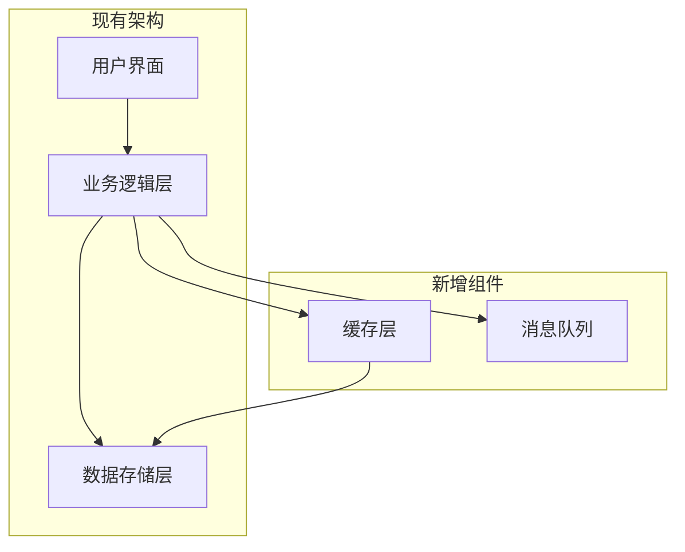
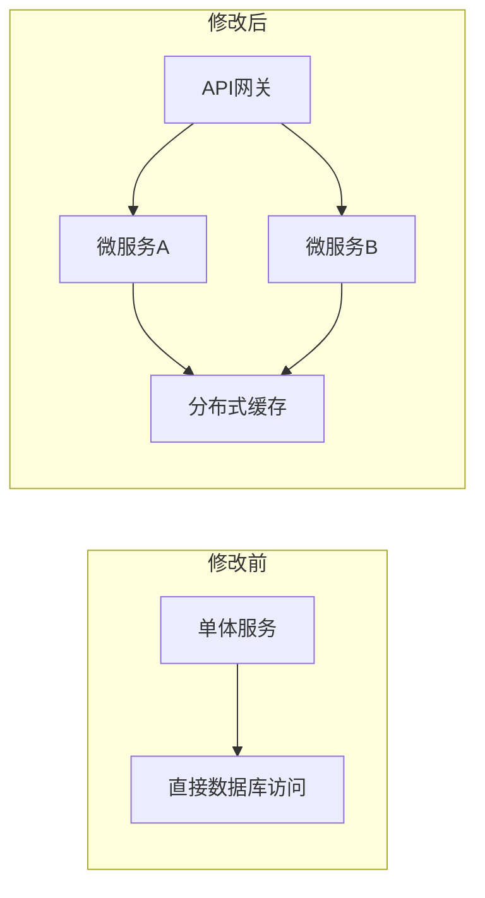
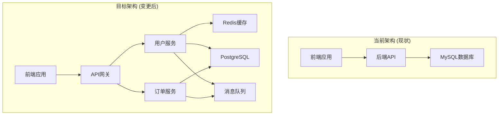

# PowerBy 简化变更点管理方案

**创建日期**: 2025-12-19
**版本**: v1.0.0
**设计原则**: 奥卡姆剃刀原则 - 最小侵入式优化
**适用范围**: 仅P4架构设计阶段

---

## 1. 设计理念

### 1.1 核心原则

- ✅ **不新增文档** - 只在现有架构设计文档中增加变更点说明
- ✅ **可视化优先** - 使用Mermaid图表清晰展示变更
- ✅ **最小侵入** - 只增加必要的章节和说明
- ✅ **简洁明了** - 避免过度复杂的结构

### 1.2 设计目标

参考OpenSpec的proposal.md理念：
```markdown
## Why
[为什么需要变更]

## What Changes
- [变更内容列表]
- [标记BREAKING变更]

## Impact
- 影响范围
- 关键文件/系统
```

但在PowerBy中简化为：
- 在`architecture.md`中直接增加"变更点说明"章节
- 使用Mermaid图展示架构变更前后对比
- 使用Markdown表格列出具体变更点

---

## 2. 架构文档变更点章节设计

### 2.1 在architecture.md中新增章节

**章节位置**: 在"架构设计"主章节之后，"下一步行动"之前

**新增章节结构**:

```markdown
## 变更点说明

### 变更概述
[简要说明为什么需要这些架构变更，与现有系统的主要差异]

### 架构变更对比

#### 新增组件
[使用Mermaid图展示新增的架构组件]

#### 修改组件
[使用Mermaid图展示修改的架构组件]

#### 移除组件
[使用Mermaid图展示移除的架构组件]

### 具体变更点清单

| 变更类型 | 组件/模块 | 变更描述 | 影响范围 | 风险等级 |
|---------|---------|---------|---------|---------|
| **NEW** | [组件名] | [详细变更说明] | [影响的功能/系统] | 高/中/低 |
| **MODIFIED** | [组件名] | [详细变更说明] | [影响的功能/系统] | 高/中/低 |
| **REMOVED** | [组件名] | [详细变更说明] | [影响的功能/系统] | 高/中/低 |

### 技术影响分析

#### 新增技术栈
- **技术1**: [技术名称] - [用途] - [学习成本]

#### 性能影响
- **改进点**: [性能提升描述]
- **风险点**: [潜在性能风险]

#### 依赖变更
- **新增依赖**: [依赖的服务/组件]
- **升级依赖**: [升级的组件/版本]
```

### 2.2 Mermaid图表示例

**新增组件示例**:


**修改组件示例**:


**完整架构对比示例**:


---

## 3. 与PowerBy流程集成

### 3.1 在P4阶段增加变更点说明

**更新powerby-architect技能**:

```markdown
### 🛠️ 执行步骤 (遵循Px执行协议)

#### Step 1: 任务拆解
进入P4阶段后，首先拆解本阶段的子任务清单：

## P4: 架构设计 🔄 (进行中)

### 子任务列表
- [ ] 解读PRD和功能需求
- [ ] 设计目标架构
- [ ] **新增**: 标注架构变更点
- [ ] 绘制变更前后对比图
- [ ] 分析技术影响
- [ ] 评估风险等级
- [ ] 完成architecture.md文档
- [ ] Gate 3检查

现在开始执行第一个子任务：解读PRD和功能需求
```

**在架构设计输出中增加**:

```markdown
### 标准输出格式

**必须包含的章节**:
1. 架构概述
2. 架构设计
3. 组件说明
4. **变更点说明** ⭐ (新增)
5. 数据流设计
6. 接口契约
7. 下一步行动
```

### 3.2 Gate 3检查增加变更点验证

**更新Gate 3验收标准**:

```markdown
### Gate 3: 架构设计检查

**验收标准**:
- [ ] 架构设计完整性
- [ ] 组件职责清晰
- [ ] 接口契约定义
- [ ] **变更点说明完整** ⭐ (新增)
- [ ] 风险评估合理
- [ ] 技术选型合理

**变更点说明检查**:
- [ ] 是否有变更点概述
- [ ] 是否有Mermaid对比图
- [ ] 是否有具体变更点清单表格
- [ ] 是否有技术影响分析
- [ ] 是否有风险等级评估
```

---

## 4. 技能指令更新

### 4.1 powerby-architect技能更新

**新增指令话术**:

```markdown
在架构设计完成后，需要明确标注相对于现有系统的变更点：

**标准话术**:
"现在我将在架构设计文档中增加'变更点说明'章节，
清晰展示架构变更前后的对比..."

**具体操作**:
1. **变更概述**: 简要说明为什么需要这些变更
2. **架构对比图**: 使用Mermaid图展示变更前后对比
3. **变更点清单**: 使用表格列出NEW/MODIFIED/REMOVED组件
4. **技术影响**: 分析新增技术、性能影响、依赖变更
5. **风险评估**: 标记高/中/低风险等级
```

### 4.2 标准模板片段

**可直接复用的模板**:

```markdown
## 变更点说明

### 变更概述
基于PRD中的功能需求分析，当前架构需要进行以下主要变更：
- [变更原因1]
- [变更原因2]
- [变更原因3]

### 架构变更对比

#### 当前架构 (现状)
[现有系统架构描述]

#### 目标架构 (变更后)
[变更后系统架构描述]

### 具体变更点清单

| 变更类型 | 组件/模块 | 变更描述 | 影响范围 | 风险等级 |
|---------|---------|---------|---------|---------|
| NEW | [缓存层] | 新增Redis缓存提升性能 | 全局性能提升 | 中 |
| MODIFIED | [数据层] | 从MySQL迁移到PostgreSQL | 数据存储层 | 高 |
| REMOVED | [单体API] | 拆分为微服务架构 | 整个后端系统 | 高 |

### 技术影响分析

#### 新增技术栈
- **Redis**: 缓存层 - 团队已有使用经验
- **PostgreSQL**: 替代MySQL - 需要数据迁移

#### 性能影响
- **改进点**: 缓存层提升响应速度30%
- **风险点**: 数据迁移期间可能存在停机时间

#### 依赖变更
- **新增依赖**: Redis服务、PostgreSQL服务
- **升级依赖**: 无
```

---

## 5. 实施建议

### 5.1 最小侵入式实施

**只修改**:
- ✅ `docs/powerby-lifecycle-framework.md` - 在P4阶段定义中增加变更点说明要求
- ✅ `skills/powerby-architect/SKILL.md` - 增加变更点管理指令
- ✅ `skills/powerby-architect/templates/` - 增加变更点说明模板

**不修改**:
- ❌ 不新增独立文档
- ❌ 不修改其他阶段流程
- ❌ 不增加额外工具或依赖

### 5.2 实施优先级

**立即实施** (优先级P0):
- ✅ 在P4阶段定义中增加变更点说明要求
- ✅ 更新powerby-architect技能，增加变更点管理能力
- ✅ 创建变更点说明模板片段

**后续优化** (优先级P1):
- ✅ 在实际项目中使用和验证
- ✅ 收集反馈，优化模板结构
- ✅ 完善技能指令和话术

### 5.3 学习成本

**对团队的影响**:
- ✅ **学习成本极低**: 只是增加一个章节
- ✅ **可视化友好**: Mermaid图易于理解
- ✅ **无需新工具**: 使用现有Markdown编辑工具
- ✅ **文档集中**: 变更点说明与架构文档在一起

---

## 6. 预期收益

### 6.1 流程改进

**P4阶段收益**:
- ✅ 架构变更点清晰可见
- ✅ 便于团队理解架构变更范围
- ✅ 支持变更影响分析和风险评估
- ✅ 为开发实现提供明确指导

**整体收益**:
- ✅ 变更管理规范化
- ✅ 团队协作效率提升
- ✅ 架构文档质量提升
- ✅ 最小侵入式改进

### 6.2 对比OpenSpec

**相似点**:
- 都明确标注"为什么、变更什么、影响"
- 都进行影响分析和风险评估
- 都支持变更的可追溯管理

**差异点**:
- PowerBy更简化：不新增文档，只在架构文档中增加章节
- PowerBy更可视化：大量使用Mermaid图表
- PowerBy更集中：变更点说明与架构设计在一起

---

## 7. 下一步行动

### 7.1 实施计划

**如果方案获得批准**:
1. **立即实施**: 更新PowerBy生命周期框架文档
2. **技能更新**: 更新powerby-architect技能
3. **模板创建**: 创建变更点说明模板片段
4. **验证测试**: 在实际项目中使用

**预期时间线**:
- 主流程更新：0.5天
- 技能模块更新：1天
- 模板创建：0.5天
- 验证测试：1-2天

### 7.2 与原方案的对比

| 维度 | 原方案 | 简化方案 |
|------|-------|---------|
| **新增文档** | product-changes.md + architecture-changes.md | 无 (仅增加章节) |
| **实施复杂度** | 高 | 低 |
| **学习成本** | 中 | 极低 |
| **维护成本** | 中 | 低 |
| **变更可见性** | 高 | 中 |
| **文档分散度** | 高 (多文档) | 低 (集中) |

---

**设计者**: 流程维护者 (Process Maintainer)
**设计日期**: 2025-12-19
**版本**: v1.0.0
**原则**: 奥卡姆剃刀 - 最小侵入式优化
**等待**: 用户审核确认
