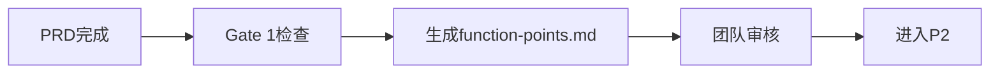
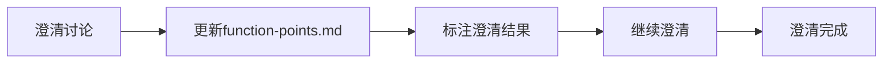
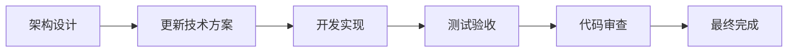

# 单文档维护标准

**版本**: v1.0.0
**创建日期**: 2025-12-18
**维护者**: PowerBy产品团队
**适用范围**: 所有PowerBy项目迭代

---

## 📋 概述

### 核心理念

**一个功能迭代同一份文档只有一份，永远维护最新状态**

这是PowerBy工作流的基本原则，旨在：
- 避免文档分散和版本混乱
- 确保团队始终基于最新信息工作
- 提高文档维护效率
- 降低沟通成本

---

## 🎯 核心原则

### 1. 单源真实 (Single Source of Truth)

每个功能迭代的每类文档**只有一份**：
- ✅ 只有一个PRD文档
- ✅ 只有一个功能点清单文档
- ✅ 只有一个架构文档
- ✅ 只有一个澄清记录文档

**禁止行为**：
- ❌ 创建文档的副本或多个版本
- ❌ 在不同位置保存相同内容的文档
- ❌ 创建临时文档而不更新主文档

### 2. 永远更新最新状态

当文档内容发生变化时：
- ✅ 直接更新主文档
- ✅ 保持文档路径不变
- ✅ 更新版本号和变更记录
- ✅ 通知团队文档已更新

**操作流程**：
```
发现变更需求 → 定位主文档 → 更新内容 → 记录变更 → 通知团队
```

### 3. 路径固定原则

文档路径在迭代期间**保持不变**：

```
docs/iterations/{id}-{name}/
├── prd.md                    (永远不变路径)
├── function-points.md        (永远不变路径)
├── clarifications.md         (永远不变路径)
└── architecture.md           (永远不变路径)
```

---

## 📝 功能点清单文档维护规范

### 文档位置

```
docs/iterations/{id}-{name}/function-points.md
```

### 维护原则

1. **P1阶段结束时首次生成**
   - 使用 `function-point-checker` 从PRD自动提取
   - 生成结构化的功能点清单

2. **P2阶段基于此文档澄清**
   - 所有功能点讨论基于此文档
   - 在文档上直接标注澄清结果
   - 更新功能点的8要素信息

3. **后续阶段持续更新**
   - P4架构设计：在文档上标注技术方案
   - P6测试完成：在文档上标注验收状态
   - P7代码审查：验证功能点实现完整性

### 更新操作

#### P2阶段更新功能点

**场景**: 需要澄清或修改功能点F1.1

**操作步骤**:
1. 打开 `docs/iterations/{id}-{name}/function-points.md`
2. 定位到F1.1部分
3. 更新相应的8要素
4. 在"更新记录"部分添加变更记录
5. 标记文档版本为最新

**示例更新**:
```markdown
#### [P0] F1.1 单DEX价格查询
- **需求来源**: US-1 (澄清结果：增加支持DAI交易对)
- **功能描述**: 从单个DEX获取指定交易对的实时价格
- **验收标准**:
  - [ERC-20交易 ] 能查询主流对价格(含DAI)
  - [ ] 价格与链上实际成交价格误差<2%
  - [ ] 支持3个主流DEX
  - [ ] API超时时间为3秒
- **⚠️ 问题**: 无 (已澄清)

## 📝 更新记录
| 版本 | 日期 | 更新内容 | 更新人 |
| v1.0 | 2025-12-18 | 初始版本 | Product Manager |
| v1.1 | 2025-12-18 | 增加DAI支持澄清 | Product Manager |
```

#### 禁止的操作

❌ **以下操作严格禁止**：
- 创建 `function-points-v2.md`
- 创建 `function-points-2025-12-18.md`
- 在 `clarifications.md` 中重新列出功能点
- 创建 `功能点讨论.md` 等临时文档

---

## 🔄 文档生命周期管理

### 阶段1：创建 (P1结束)



### 阶段2：澄清 (P2期间)



### 阶段3：追踪 (P3-P7期间)



---

## 🚦 质量门禁

### Gate 1: 功能点清单生成检查

- [ ] `function-points.md` 已生成
- [ ] 所有功能点都已提取
- [ ] 8要素信息完整
- [ ] 优先级标记正确
- [ ] 依赖关系图已生成

### Gate 2: 澄清完成检查

- [ ] 所有功能点已澄清
- [ ] `function-points.md` 已更新澄清结果
- [ ] 无模糊不清的功能点
- [ ] 验收标准可测试

### Gate 3: 实现跟踪检查

- [ ] 技术方案已标注
- [ ] 验收状态已更新
- [ ] 与实际实现一致

---

## 👥 角色与职责

### Product Manager

**职责**：
- 负责功能点清单的初始生成
- 主导基于功能点清单的澄清工作
- 确保文档始终保持最新状态

**权限**：
- ✅ 可更新 `function-points.md`
- ✅ 可添加澄清记录
- ✅ 可标注质量问题和改进建议

**禁止**：
- ❌ 不得创建功能点清单的副本
- ❌ 不得在其他文档中重复列出功能点

### Architect

**职责**：
- 基于功能点清单进行架构设计
- 在功能点清单上标注技术实现方案
- 确保架构设计与功能点一致

**权限**：
- ✅ 可在功能点清单上标注技术方案
- ✅ 可更新依赖关系的技术实现
- ✅ 可添加技术风险标注

### Engineer

**职责**：
- 参考功能点清单进行开发
- 基于功能点清单设计测试
- 验证实现与功能点一致性

**权限**：
- ✅ 可在功能点清单上标注实现状态
- ✅ 可更新验收测试结果

### Code Reviewer

**职责**：
- 使用功能点清单验证代码实现
- 确保所有功能点都已正确实现
- 验证验收标准是否满足

**权限**：
- ✅ 可查看功能点清单
- ✅ 可标注审查结果

---

## 🔍 常见问题

### Q1: 如果多人同时需要更新功能点清单怎么办？

**A**: 建议采用以下流程：
1. 通过团队沟通确定更新顺序
2. 一个人在文档中添加更新内容
3. 更新完成后通知其他人
4. 其他人基于最新版本继续工作

### Q2: 如何处理功能点的重大变更（如拆分或合并）？

**A**:
1. 在功能点清单上直接修改
2. 更新功能点编号和依赖关系
3. 在"更新记录"中详细记录变更原因
4. 通知团队注意编号变化

### Q3: 如果发现功能点清单有错误怎么办？

**A**:
1. 立即更新 `function-points.md` 修正错误
2. 在更新记录中说明错误原因和修正内容
3. 检查是否影响其他文档
4. 如有必要，同步更新相关文档

### Q4: 可以创建功能点清单的备份吗？

**A**:
- **不需要**：Git版本控制已经提供了完整的备份和历史记录
- **禁止**：创建文档副本会造成混乱
- **替代方案**：使用 `git log` 查看历史版本

---

## 📚 相关文档

- [`function-point-checker` 技能文档](../skills/function-point-checker/SKILL.md)
- [`powerby-product` 技能文档](../skills/powerby-product/SKILL.md)
- [PowerBy生命周期概览](./powerby-lifecycle-overview.md)
- [功能点清单模板](../templates/function-points-template.md)

---

## 🎯 检查清单

### 日常操作检查

- [ ] 是否直接更新了主文档？
- [ ] 是否保持了文档路径不变？
- [ ] 是否记录了变更历史？
- [ ] 是否通知了团队？

### 阶段检查

- [ ] P1结束时是否生成了功能点清单？
- [ ] P2澄清是否基于功能点清单进行？
- [ ] 后续阶段是否有在功能点清单上标注？
- [ ] 团队是否始终使用最新版本？

### 质量检查

- [ ] 是否存在文档副本？
- [ ] 是否存在重复的功能点列表？
- [ ] 文档版本是否是最新的？
- [ ] 团队是否知道主文档位置？

---

## 🚀 实施建议

### 团队培训

1. **新成员入职**：必须学习此规范
2. **定期回顾**：每月检查执行情况
3. **案例分享**：分享正确的维护案例

### 工具支持

1. **文档模板**：使用标准模板生成文档
2. **版本控制**：利用Git跟踪变更历史
3. **通知机制**：建立文档更新通知机制

### 持续改进

1. **收集反馈**：定期收集团队反馈
2. **优化流程**：根据实际情况优化规范
3. **更新文档**：保持规范文档的时效性

---

**最后更新**: 2025-12-18
**下次回顾**: 2026-01-18
**版本**: v1.0.0
