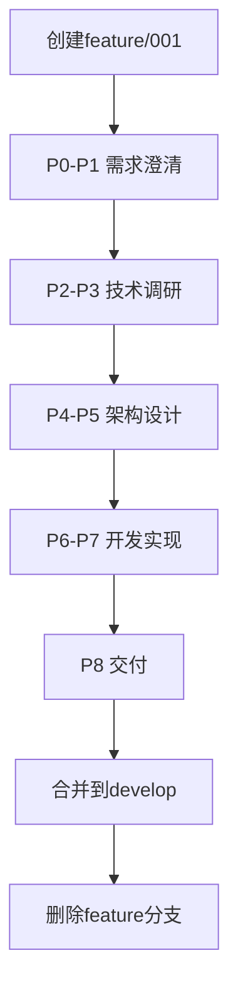
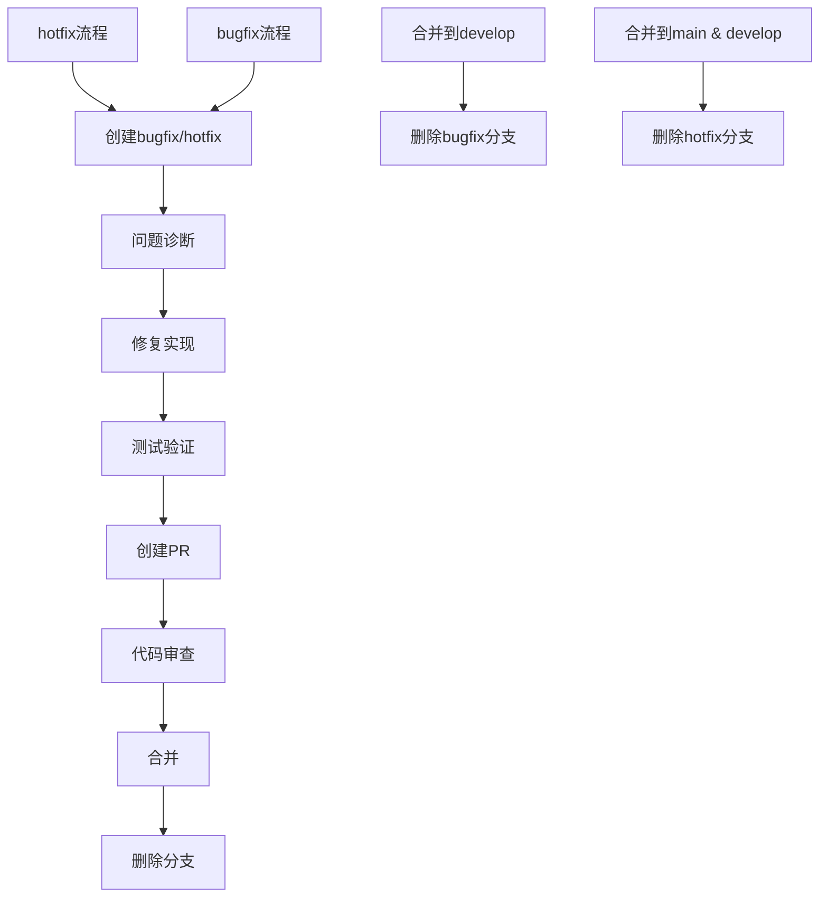
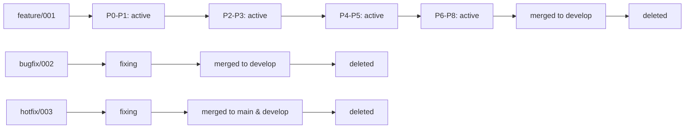

# PowerBy分支管理策略优化方案

## 📋 现状分析

### 当前PowerBy P0-P8流程
```
P0 → P1 → P2 → P3 → P4 → P5 → P6 → P7 → P8
 ↓    ↓    ↓    ↓    ↓    ↓    ↓    ↓    ↓
初始  需求  MVP   调研  架构  规划  实现  审查  交付
```

**存在的问题**：
- ❌ 所有阶段在同一个分支（通常是main）进行
- ❌ 无法追踪特定迭代的完整生命周期
- ❌ 难以区分不同迭代的进度和状态
- ❌ Bug修复流程与主开发流程混合
- ❌ 分支命名不规范，难以管理

### 理想状态的目标
- ✅ 每个P0-P8迭代有独立的分支追踪
- ✅ 清晰的分支命名规范
- ✅ Bug修复流程独立管理
- ✅ 支持并行开发多个迭代
- ✅ 便于代码审查和合并

## 🎯 优化方案设计

### 核心设计理念

#### 1. 迭代驱动分支管理
**每个完整的P0-P8生命周期对应一个feature分支**

```
main (生产就绪)
  ↑
develop (开发集成)
  ↑
feature/001-task-manager (P0-P8完整迭代)
  ├── P0-P1: 需求分析和澄清
  ├── P2-P3: 技术调研和优先级
  ├── P4-P5: 架构设计和规划
  └── P6-P8: 实现、审查和交付
```

#### 2. 独立Bug修复流程
```
bugfix/002-login-error (一般Bug修复)
hotfix/003-security-vuln (紧急修复)
```

## 📐 详细分支策略

### 分支类型和命名规范

#### 1. 主分支 (长期分支)
```
main
├── 用途: 生产就绪代码
├── 保护: 强制PR + 2个审查者
├── 更新: 只接受来自develop或hotfix的PR
└── 触发: 自动release (未来扩展)

develop
├── 用途: 开发集成分支
├── 保护: 强制PR + 1个审查者
├── 更新: 合并feature和bugfix分支
└── 策略: 每周五合并到main
```

#### 2. 功能分支 (每个迭代一个)
```
feature/{id}-{name}
├── 用途: 完整的P0-P8迭代生命周期
├── 命名规则:
│   ├── id: 3位数字，001, 002, 003...
│   ├── name: 英文短横线分隔 (e.g., task-manager)
│   └── 示例: feature/001-task-manager, feature/002-payment-system
├── 生命周期: 从P0开始到P8结束
├── 分支源: 从develop创建
└── 合并: P8完成后合并到develop

P0-P1阶段: 需求和澄清
P2-P3阶段: 调研和优先级
P4-P5阶段: 架构和规划
P6-P8阶段: 实现、审查和交付
```

#### 3. Bug修复分支 (独立流程)
```
bugfix/{id}-{description}
├── 用途: 一般Bug修复
├── 命名规则:
│   ├── id: 3位数字，独立递增
│   ├── description: 问题简短描述
│   └── 示例: bugfix/002-login-timeout, bugfix/003-ui-glitch
├── 优先级: P2/P3级别Bug
├── 分支源: 从develop创建
└── 合并: 修复完成后合并到develop

workflow:
develop ──→ bugfix/002-login-error ──→ develop
              ↓
              PR → 审查 → 合并
```

#### 4. 紧急修复分支 (独立流程)
```
hotfix/{id}-{description}
├── 用途: 紧急修复 (P0/P1级别)
├── 命名规则:
│   ├── id: 3位数字，独立递增
│   ├── description: 紧急问题描述
│   └── 示例: hotfix/004-security-vuln, hotfix/005-data-loss
├── 优先级: P0/P1级别严重问题
├── 分支源: 从main创建
└── 合并: 同时合并到main和develop

workflow:
main ──→ hotfix/004-security-vuln ──→ main & develop
                  ↓
                  PR → 审查 → 合并
```

### 分支生命周期管理

#### feature分支生命周期


**详细阶段说明**：
1. **P0-P1阶段**: 需求定义和澄清
   - 创建PRD文档
   - 需求对齐和确认
   - 产出：prd.md

2. **P2-P3阶段**: MVP优先级和技术调研
   - 功能点清单
   - MVP优先级评估
   - 技术方案调研
   - 产出：功能点清单、技术调研报告

3. **P4-P5阶段**: 架构设计和开发规划
   - 架构设计
   - 技术选型
   - 开发任务分解
   - 产出：architecture.md、tasks.md

4. **P6-P8阶段**: 实现、审查和交付
   - 开发实现
   - 代码审查
   - 测试和验收
   - 交付文档
   - 产出：implementation.md

#### bugfix/hotfix分支生命周期


## 🔄 工作流程示例

### 创建新迭代分支
```bash
# 1. 确保develop是最新的
git checkout develop
git pull origin develop

# 2. 创建新的feature分支
git checkout -b feature/001-task-manager

# 3. 初始化迭代文档
mkdir -p docs/iterations/001-task-manager
touch docs/iterations/001-task-manager/{prd.md,architecture.md,tasks.md,implementation.md}

# 4. 提交初始化
git add .
git commit -m "feat(iteration): initialize 001-task-manager iteration

- Create iteration structure
- Add PRD template
- Add architecture template
- Add tasks template

Refs #100"

# 5. 推送到远程
git push origin feature/001-task-manager
```

### P0-P1阶段：需求澄清
```bash
# 在feature分支上进行工作
git checkout feature/001-task-manager

# 编辑PRD文档
vim docs/iterations/001-task-manager/prd.md

# 提交变更
git add docs/iterations/001-task-manager/prd.md
git commit -m "docs(prd): complete requirements for task-manager

- Define core features
- Add user stories
- Specify acceptance criteria

Closes #101"

# 推送到远程
git push origin feature/001-task-manager
```

### P2-P3阶段：技术调研
```bash
# 继续在feature分支工作
git checkout feature/001-task-manager

# 创建功能点清单
vim docs/iterations/001-task-manager/feature-list.md

# MVP优先级评估
vim docs/iterations/001-task-manager/mvp-priority.md

# 提交
git add .
git commit -m "feat(mvp): define MVP priorities for task-manager

- Add feature breakdown
- Classify P0/P1/P2 priorities
- Add validation rules

Refs #102"
```

### P4-P5阶段：架构设计
```bash
# 架构设计
git checkout feature/001-task-manager

# 创建架构文档
vim docs/iterations/001-task-manager/architecture.md

# 任务分解
vim docs/iterations/001-task-manager/tasks.md

# 提交
git add .
git commit -m "feat(architecture): design system architecture

- Define component structure
- Add data flow diagrams
- Specify technology stack

Refs #103"
```

### P6-P8阶段：实现和交付
```bash
# 开发实现
git checkout feature/001-task-manager

# 实现功能
# ...

# 提交代码
git add .
git commit -m "feat(impl): implement core task-manager functionality

- Add CRUD operations
- Add user interface
- Add data validation

Refs #104"

# P8完成后，合并到develop
git checkout develop
git merge feature/001-task-manager
git push origin develop

# 删除feature分支
git branch -d feature/001-task-manager
git push origin --delete feature/001-task-manager
```

### Bug修复流程
```bash
# 创建bugfix分支
git checkout develop
git pull origin develop
git checkout -b bugfix/002-login-timeout

# 修复Bug
vim docs/bugs/002-login-timeout.md
# 修复相关代码...

# 提交
git add .
git commit -m "fix(auth): resolve login timeout issue

- Increase timeout to 30s
- Add retry mechanism
- Improve error handling

Fixes #105"

# 创建PR
gh pr create \
  --title "fix: login timeout issue" \
  --body "## Bug修复
修复登录超时问题

## 变更内容
- 增加超时时间
- 添加重试机制
- 改进错误处理

## 测试
- [x] 单元测试
- [x] 集成测试" \
  --base develop \
  --head bugfix/002-login-timeout

# 合并后删除分支
```

### 紧急修复流程
```bash
# 创建hotfix分支 (从main创建)
git checkout main
git pull origin main
git checkout -b hotfix/003-security-vulnerability

# 紧急修复
# ...

# 提交
git add .
git commit -m "fix(security): patch authentication vulnerability

- Add input validation
- Sanitize user input
- Add security headers

Fixes #106"

# 创建PR到main
gh pr create \
  --title "hotfix: critical security vulnerability" \
  --body "## 紧急修复
P0级别安全漏洞修复

## 影响范围
- 所有用户
- 认证模块

## 修复内容
- 输入验证
- 用户输入清理
- 安全头设置

## 测试
- [x] 安全测试
- [x] 渗透测试" \
  --base main \
  --head hotfix/003-security-vulnerability

# 合并后同步到develop
git checkout develop
git merge main
git push origin develop
```

## 📊 分支管理规范

### 分支创建规范
```bash
# feature分支 (每个迭代)
# 命名: feature/{id}-{name}
# 示例: feature/001-task-manager
git checkout develop
git checkout -b feature/{id}-{name}

# bugfix分支 (一般Bug)
# 命名: bugfix/{id}-{description}
# 示例: bugfix/002-login-error
git checkout develop
git checkout -b bugfix/{id}-{description}

# hotfix分支 (紧急修复)
# 命名: hotfix/{id}-{description}
# 示例: hotfix/003-security-vuln
git checkout main
git checkout -b hotfix/{id}-{description}
```

### 分支保护规则
```yaml
main:
  required_status_checks:
    strict: true
  required_pull_request_reviews:
    required_approving_review_count: 2
    require_code_owner_reviews: true
  restrictions: null

develop:
  required_status_checks:
    strict: false
  required_pull_request_reviews:
    required_approving_review_count: 1
  restrictions: null

feature/*:
  required_status_checks:
    strict: false
  required_pull_request_reviews:
    required_approving_review_count: 1
  restrictions: null
  allow_force_pushes: true

bugfix/*:
  required_status_checks:
    strict: false
  required_pull_request_reviews:
    required_approving_review_count: 1
  restrictions: null
  allow_force_pushes: true

hotfix/*:
  required_status_checks:
    strict: false
  required_pull_request_reviews:
    required_approving_review_count: 1
  restrictions: null
  allow_force_pushes: true
```

### 分支清理规范
```bash
# 删除已合并的feature分支
git branch -d feature/001-task-manager
git push origin --delete feature/001-task-manager

# 删除已合并的bugfix分支
git branch -d bugfix/002-login-error
git push origin --delete bugfix/002-login-error

# 删除已合并的hotfix分支
git branch -d hotfix/003-security-vuln
git push origin --delete hotfix/003-security-vuln

# 批量清理本地分支
git branch --merged develop | grep "feature/" | xargs git branch -d
git branch --merged develop | grep "bugfix/" | xargs git branch -d
git branch --merged main | grep "hotfix/" | xargs git branch -d
```

## 🎯 迭代状态追踪

### 分支状态映射


### 迭代进度可视化
```
# docs/iterations/index.md

## 活跃迭代
- **feature/001-task-manager** (P6-P8: 实现中)
- **feature/002-payment-system** (P2-P3: 调研中)
- **feature/003-user-profile** (P0-P1: 需求澄清中)

## 修复进行中
- **bugfix/002-login-timeout** (审查中)
- **hotfix/003-security-vuln** (合并中)

## 已完成
- **feature/000-initial-setup** (已合并到develop)
```

## ✅ 实施检查清单

### 分支创建
- [ ] 创建develop分支（如果不存在）
- [ ] 设置分支保护规则
- [ ] 创建第一个feature分支
- [ ] 验证分支命名规范

### 工作流程
- [ ] 团队培训分支策略
- [ ] 创建PR模板
- [ ] 设置CODEOWNERS
- [ ] 验证合并流程

### 文档管理
- [ ] 更新迭代文档结构
- [ ] 创建分支管理指南
- [ ] 提供示例和工作流
- [ ] 定期审查和优化

## 🔍 优势分析

### 对比现有流程
| 方面 | 现有流程 | 优化后流程 |
|------|----------|------------|
| **迭代追踪** | 混合在main中 | 独立feature分支 |
| **Bug修复** | 与开发混合 | 独立bugfix/hotfix流程 |
| **并行开发** | 难以区分 | 支持多个feature并行 |
| **代码审查** | 非强制 | 强制PR和审查 |
| **分支管理** | 无规范 | 标准化命名和生命周期 |

### 预期收益
- ✅ **清晰的迭代追踪**: 每个P0-P8生命周期独立分支
- ✅ **高效的Bug管理**: bugfix/hotfix独立流程
- ✅ **支持并行开发**: 多个feature分支同时进行
- ✅ **强制代码质量**: PR和审查机制
- ✅ **标准化流程**: 规范的命名和生命周期

## 📝 需要确认的问题

1. **分支命名**: feature/001-task-manager 格式是否符合您的期望？
2. **迭代ID**: 从001开始递增是否合适？
3. **develop分支**: 是否需要develop作为集成分支，还是直接从main创建feature？
4. **分支保护**: 是否需要强制PR和审查？
5. **文档结构**: 迭代文档是否需要调整以配合分支管理？

---

**方案版本**: v1.0.0
**创建时间**: 2025-12-24
**适用范围**: PowerBy P0-P8完整生命周期 + Bug修复流程
