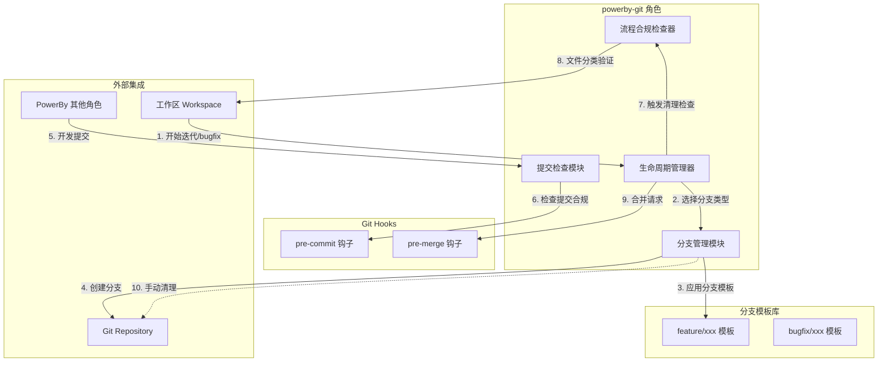

# PowerBy Git 分支管理角色 - 架构设计文档

> 版本: v1.0.0
> 创建日期: 2026-01-12
> 状态: 已确认

---

## 阶段一：需求解读与目标对齐

### 核心业务目标

构建独立的 `powerby-git` 角色，实现基于工作区的 Git 分支管理生命周期，自动触发分支创建、清理检查、合并检查等流程。

**核心价值**:
- 确保每次迭代/bug-fix 都在规范的分支上进行
- 提供分支生命周期管理（创建 → 开发 → 检查 → 合并）
- 自动检查文件合规性，确保临时文件被清理
- 将分支管理流程规范化、自动化

### 关键用户流程

```
┌─────────────────────────────────────────────────────────────────┐
│                    迭代/bug-fix 生命周期流程                      │
├─────────────────────────────────────────────────────────────────┤
│                                                                 │
│  1. [开始] 迭代/bug-fix 启动，自动或手动触发分支创建               │
│           ↓                                                     │
│  2. [创建分支] powerby-git 自动创建规范命名的 feature/bugfix 分支 │
│           ↓                                                     │
│  3. [开发] 用户在分支上进行开发工作                                │
│           ↓                                                     │
│  4. [提交检查] 每次 git commit 时自动检查文件合规性               │
│           ↓                                                     │
│  5. [清理检查] 迭代/bug-fix 结束时，触发文件合规检查              │
│           ↓                                                     │
│  6. [合并检查] 合并前最终合规验证                                 │
│           ↓                                                     │
│  7. [手动清理] 用户手动调用 powerby-git cleanup 清理已完成分支    │
│           ↓                                                     │
│  8. [结束] 流程闭环                                               │
│                                                                 │
└─────────────────────────────────────────────────────────────────┘
```

### 关键约束

1. **分支命名规范**:
   - Feature 分支: `feature/{迭代名}`
   - Bugfix 分支: `bugfix/{bug名}`

2. **文件合规性（合法文件三类）**:
   - 业务代码、测试用例（持续引用的）
   - PowerBy 流程规定的文档（prd.md, task.md 等）
   - 用户明确指明的文件

3. **分支清理**: 默认手动触发，不自动清理

---

## 阶段二：架构设计与可视化

### 核心架构图



### 概念解读

`powerby-git` 是一个独立的 Git 分支管理角色，负责监督和控制整个分支生命周期。它像一个"分支守护者"，确保每次迭代/bug-fix 都在规范的分支上进行，并在结束时进行质量门禁检查。

### 组件职责

| 组件 | 职责 | 核心功能 |
|------|------|----------|
| **生命周期管理器 (LC)** | 协调整个流程 | 自动触发分支创建、检查事件 |
| **分支管理模块 (BG)** | 分支 CRUD 操作 | 创建、命名验证、提供清理命令 |
| **提交检查模块 (CC)** | 提交时检查 | 文件合规性、提交信息格式 |
| **流程合规检查器 (PC)** | 合规性验证 | 文档归档、文件白名单验证 |
| **分支模板库** | 预定义模板 | feature/bugfix 命名模板 |
| **Git Hooks** | 自动化检查 | pre-commit、pre-merge 钩子 |

### 组件与需求映射

| 组件 | 负责实现的需求点 |
|------|------------------|
| 分支管理模块 (BG) | 1. 新建 feature/bug 分支，自动生成规范命名 |
| 生命周期管理器 (LC) | 2. 默认自动触发，用户可主动调用 |
| 提交检查模块 (CC) | 3. 强制 git branch 约束 |
| 流程合规检查器 (PC) | 4. 清理临时代码/数据/文件，检查文档归档 |
| 生命周期管理器 (LC) | 5. 合并前检查，手动清理分支 |

### 交互说明

| 步骤 | 触发 | 组件 | 说明 |
|------|------|------|------|
| 1 | 自动/手动 | LC | 接收迭代/bugfix开始信号 |
| 2 | LC | BG | 根据类型选择对应模板 |
| 3 | BG | FT/BT | 填充命名规范，生成完整分支名 |
| 4 | BG | GR | 执行 git checkout -b 创建分支 |
| 5 | 开发提交 | CC | 变更触发检查 |
| 6 | CC | PH | pre-commit 钩子拦截不合规提交 |
| 7 | 结束 | LC | 触发清理检查 |
| 8 | PC | WS | 遍历工作区文件，执行白名单验证 |
| 9 | 合并 | GH | pre-merge 钩子执行最终合规检查 |
| 10 | 手动 | BG | 用户调用 cleanup 命令删除已完成分支 |

---

## 阶段三：关键决策点与方案评估

### 决策点一：文件合规性检测方式 ✅ 已确认

**采用双重检查机制**:
- **提交时检查（轻量）**: 只检查变更文件，即时反馈
- **合并前检查（全量）**: 扫描工作区所有文件，确保最终质量

### 决策点二：临时文件识别策略 ✅ 已确认

**白名单机制**: 定义"合法文件"白名单，不在白名单即提示删除。

**合法文件三类**:
1. 业务代码、测试用例（持续引用）
2. PowerBy 流程规定的文档
3. 用户明确指明的文件

### 决策点三：powerby-git 与现有角色的集成方式 ✅ 已确认

**独立 CLI + Git Hooks 混合模式**:
- 主流程通过 `powerby-git` 命令显式控制
- Git Hooks 在后台做合规检查，双重保障

---

## 阶段四：命令与 API 设计

### CLI 命令清单

| 命令 | 参数 | 说明 |
|------|------|------|
| `powerby-git start --type=feature --name=xxx` | --type, --name | 创建新分支 |
| `powerby-git status` | - | 查看当前分支状态 |
| `powerby-git check` | --type=commit\|merge | 执行合规性检查 |
| `powerby-git list` | --merged\|--unmerged | 列出分支 |
| `powerby-git cleanup --dry-run` | --dry-run, --force | 清理已合并分支（手动） |

### Git Hooks 集成

```bash
# pre-commit 钩子
powerby-git check --type=commit

# pre-merge 钩子
powerby-git check --type=merge
```

---

## 阶段五：文件白名单规范

### PowerBy 流程规定文件

```
docs/
├── iterations/
│   └── {iteration-id}/
│       ├── prd.md                    # 产品需求文档
│       ├── task.md                   # 任务分解文档
│       ├── architecture.md           # 架构设计文档
│       ├── research.md               # 技术调研报告
│       ├── clarifications.md         # 需求澄清记录
│       └── function-points.md        # 功能点清单
├── bugs/
│   └── {bug-id}/
│       ├── diagnosis.md              # 诊断报告
│       └── resolution.md             # 解决方案
├── proposals/                        # 方案提案
└── references/                       # 参考资料
```

### 项目核心文件

```
{source}/                    # 源代码目录
tests/                       # 测试用例目录
package.json / pyproject.toml / go.mod  # 依赖配置
README.md                    # 项目说明
CONTRIBUTING.md              # 贡献指南
```

---

## 附录

### 分支命名规范

| 类型 | 模式 | 示例 |
|------|------|------|
| Feature | `feature/{迭代名}` | `feature/user-authentication` |
| Bugfix | `bugfix/{bug名}` | `bugfix/login-timeout` |
| Hotfix | `hotfix/{版本}-{问题}` | `hotfix/v1.2.3-critical-security` |
| Release | `release/{版本}` | `release/v2.0.0` |

### 提交信息规范

```
{类型}({范围}): {描述}

# 类型: feat, fix, docs, style, refactor, test, chore
# 范围: 可选，影响的模块

示例:
feat(auth): add JWT token refresh mechanism
fix(database): resolve connection pool leak
docs(readme): update installation instructions
```

---

> 文档路径: `docs/iterations/004-powerby-git/architecture.md`
