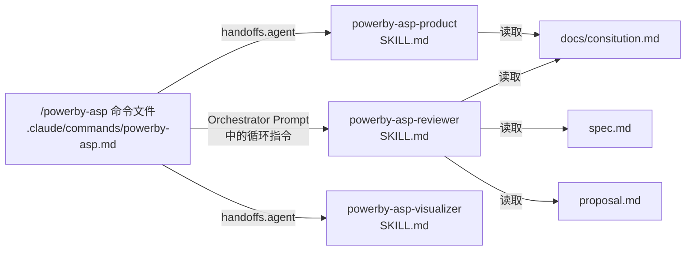
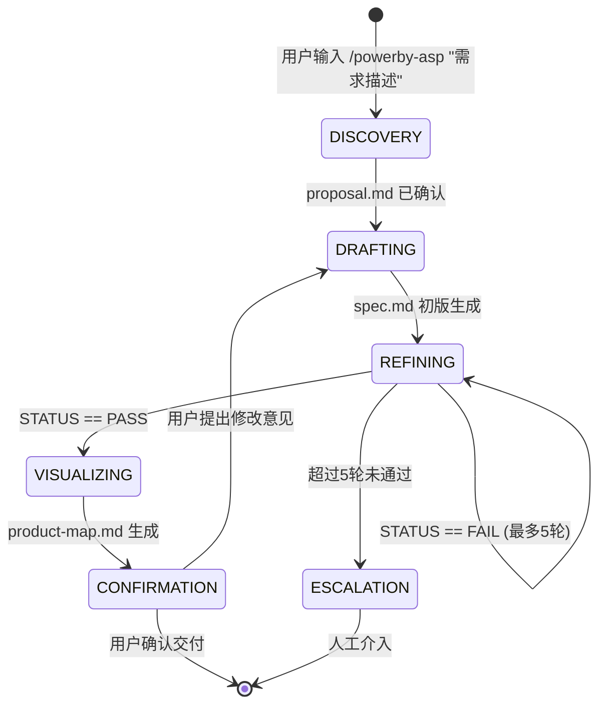
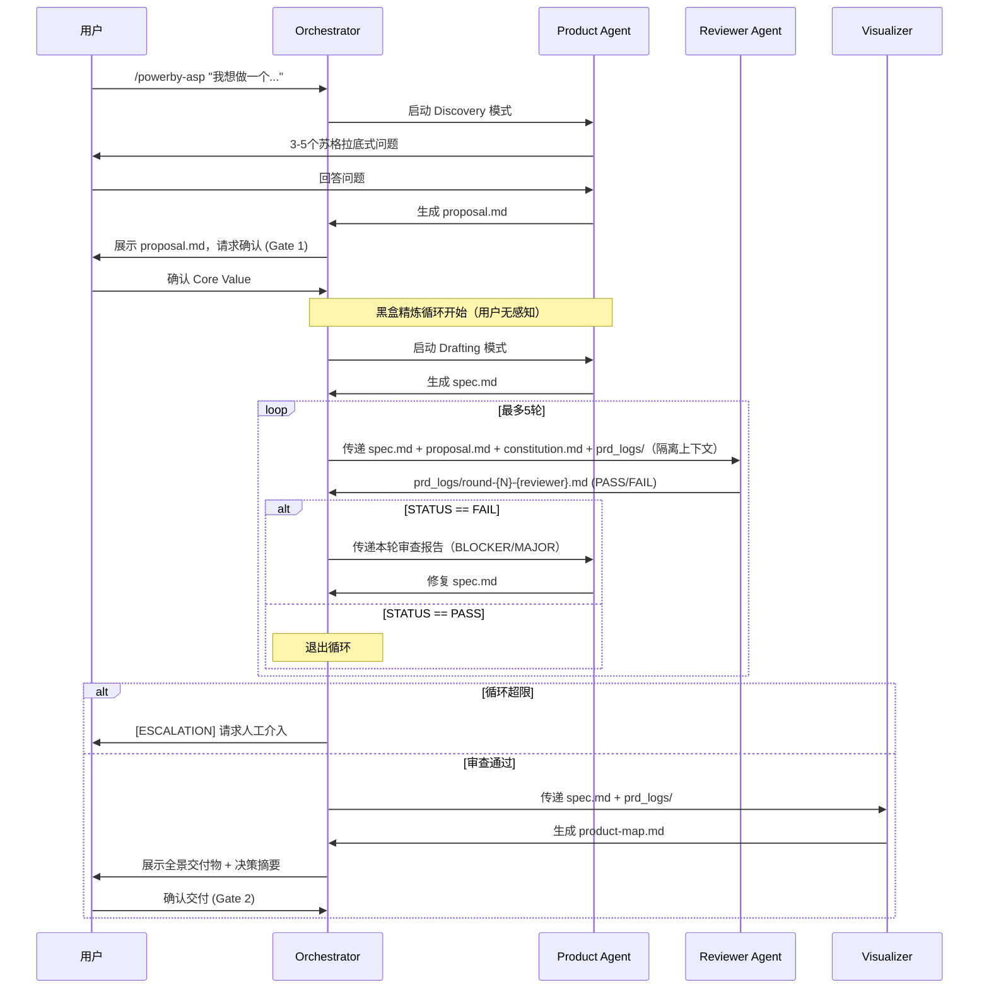

# 产品需求文档 (PRD)

**项目名称**: PowerBy Autonomous Spec Protocol (ASP)
**迭代编号**: 005
**文档版本**: v1.2.0
**创建日期**: 2026-02-09
**生命周期阶段**: ASP - DISCOVERY（本文档为 ASP 流程的需求定义产物）
**触发命令**: `/powerby-asp`

---

> **⚠️ 流程隔离声明**
>
> `powerby-asp` 是一套**全新的、独立的研发流程**，与现有的 PowerBy P0-P8 生命周期流程**完全隔离**。
>
> - **禁止混淆**：ASP 拥有自己的阶段定义（DISCOVERY → DRAFTING → REFINING → VISUALIZING → CONFIRMATION），与 P0-P8 无任何继承或映射关系
> - **独立命名空间**：所有 ASP 相关的 Skill 均以 `powerby-asp-` 为前缀，与现有 `powerby-product`、`powerby-reviewer` 等 Skill 完全独立
> - **独立命令**：通过 `/powerby-asp` 触发，不复用 `/powerby-define`、`/powerby-review` 等现有命令
> - **独立产物**：ASP 产出 proposal.md / spec.md / prd_logs/ / product-map.md，与现有流程的 prd.md / function-points.md / clarifications.md 是不同的文档体系
> - **独立质量门禁**：ASP 定义自己的 Gate 1（Proposal Lock）和 Gate 2（Spec Approval），与现有 P0-P8 的 Gate 体系无关

## 第一部分：需求原始输入

### 1.1 产品愿景

构建一个 **"自治式规格精炼工厂" (Autonomous Spec Refinery)**，通过引入 Orchestrator（编排器）接管**需求定义阶段**，协调 Product Agent（产品经理）与 Reviewer Agent（审查员）进行**对抗性协作**。用户只需提供初始意图和最终确认，中间的"提问-草拟-审查-修正"循环由 AI 自治完成。

> **注意**：ASP 是一套全新的独立研发流程，不是对现有 P0-P8 流程中某个阶段的替换或增强。ASP 拥有自己完整的五阶段生命周期：DISCOVERY → DRAFTING → REFINING → VISUALIZING → CONFIRMATION。

### 1.2 核心价值（一句话）

**用户输入一句话需求，系统自动完成"苏格拉底式提问 → 规格草拟 → 对抗审查 → 自我修正 → 可视化交付"的全流程，产出逻辑自洽、边界清晰的产品规格。**

### 1.3 用户画像

- **极客开发者/架构师**：希望通过自然语言快速启动项目，不愿在文档格式和反复的 Prompt 交互中浪费时间，只关心最终的规格质量。

### 1.4 引用原则

- **零假设原则 (Zero-Assumption Principle)**：系统不假设用户一开始就提供了完美需求，必须通过苏格拉底式提问来挖掘。
- **MVP 优先原则**：自动化流程的目标是产出最小可行性规格，而非大而全的文档。

### 1.5 实现约束（关键补充 v1.1）

> **本产品的实现载体是 Skill 提示词文件（SKILL.md），而非代码。**

- **所有 Agent 角色**（Product、Reviewer、Visualizer）均通过 SKILL.md 提示词定义来完成任务
- **Orchestrator** 是一个命令文件（`.claude/commands/powerby-asp.md`），通过 `handoffs` 机制调用各 Skill
- **Review 循环**也是通过调用 Skill 提示词完成——Orchestrator 的 Prompt 指令中包含循环逻辑，在单会话中依次调用 Product Skill 和 Reviewer Skill
- **不写任何代码**——全部通过 Skill 规范（frontmatter + Markdown 提示词）实现

### 1.6 流程隔离声明（关键补充 v1.2）

> **powerby-asp 是一套全新的、独立的研发流程，禁止与现有 P0-P8 流程混淆。**

#### ASP 与现有流程的对比

| 维度 | powerby-asp（新流程） | 现有 P0-P8 流程 |
|------|----------------------|-----------------|
| **阶段定义** | DISCOVERY → DRAFTING → REFINING → VISUALIZING → CONFIRMATION | P0 → P1 → P2 → P3 → P4 → P5 → P6 → P7 → P8 |
| **触发命令** | `/powerby-asp` | `/powerby-define`、`/powerby-design`、`/powerby-implement` 等 |
| **Skill 命名** | `powerby-asp-product`、`powerby-asp-reviewer`、`powerby-asp-visualizer` | `powerby-product`、`powerby-reviewer`、`powerby-architect` 等 |
| **核心机制** | 对抗性协作（Product vs Reviewer 自动 PK 循环） | 顾问式协作（用户主导，AI 辅助） |
| **用户参与度** | 最小化（仅 Discovery 提问 + Confirmation 确认） | 全程参与（每个阶段都需要用户确认） |
| **质量门禁** | ASP Gate 1（Proposal Lock）、ASP Gate 2（Spec Approval） | Gate 1-8（各阶段独立门禁） |
| **产出文档** | proposal.md、spec.md、prd_logs/、product-map.md | prd.md、function-points.md、clarifications.md、architecture.md 等 |
| **自动化程度** | 黑盒自动化（Drafting+Refining 全自动） | 半自动（每步需用户确认） |

#### 隔离规则

1. **命名隔离**：所有 ASP 相关的 Skill、命令、文档均以 `asp` 标识，不复用现有命名
2. **流程隔离**：ASP 的五阶段与 P0-P8 无映射关系，不存在"ASP 的 DISCOVERY = P1"这样的等价
3. **角色隔离**：`powerby-asp-product` ≠ `powerby-product`，两者是不同的角色定义，提示词完全独立
4. **产物隔离**：ASP 的 spec.md ≠ 现有流程的 prd.md，两者是不同的文档规范
5. **门禁隔离**：ASP Gate 1/Gate 2 与现有 Gate 1-8 是完全独立的质量检查体系

#### 实现架构（Skill 体系）

```
skills/
├── powerby-asp-product/
│   └── SKILL.md              # Product Agent 提示词（三种模式）
├── powerby-asp-reviewer/
│   └── SKILL.md              # Reviewer Agent 提示词（对抗审查）
└── powerby-asp-visualizer/
    └── SKILL.md              # Visualizer 提示词（Mermaid 全景图）

.claude-plugin/
└── marketplace.json          # [更新] 注册三个新 Skill

skills/powerby-command/templates/.claude/commands/
└── powerby-asp.md            # 命令文件（Orchestrator 编排逻辑）
```

#### 命令文件与 Skill 的关系



#### Skill 调用机制

参照现有 `powerby-define.md` 命令的 `handoffs` 格式（仅参考文件格式，ASP 是独立流程）：
```yaml
---
description: 自治式规格精炼 - 输入需求，自动完成提问→草拟→审查→修正→可视化全流程
handoffs:
  - label: ASP Orchestrator
    agent: powerby-asp-product
    prompt: |
      你现在作为 ASP Orchestrator 运行。
      按照以下流程自动执行...
      [Orchestrator 编排逻辑写在此处]
---
```

**Review 过程的 Skill 调用方式**：
- Orchestrator 的 Prompt 中包含明确指令：在 Refining 阶段，读取 `powerby-asp-reviewer` 的 SKILL.md 提示词，以该角色身份审查 spec.md
- 通过 Prompt 策略实现角色切换：先以 Product 角色生成 spec.md，再切换为 Reviewer 角色审查，再切回 Product 角色修复

---

## 第二部分：功能规格框架

### 模块一：功能定义与拆解

#### 2.1 核心模块：Orchestrator（流程编排器）

**定义**：一个命令文件（`.claude/commands/powerby-asp.md`），通过 `handoffs` 机制和 Prompt 编排指令，协调三个 Skill 角色完成全流程。不写任何代码，全部通过 Skill 提示词实现。

**实现方式**：
- **命令文件** (`powerby-asp.md`)：定义 `handoffs` 字段指向 `powerby-asp-product` Skill，Prompt 中包含完整的五阶段编排逻辑
- **角色切换**：Orchestrator 的 Prompt 指令中明确要求在不同阶段读取对应 Skill 的 SKILL.md，以该角色身份执行任务
- **Review 调用**：在 Refining 阶段，Prompt 指令要求读取 `powerby-asp-reviewer/SKILL.md` 的提示词，切换为 Reviewer 角色对 spec.md 进行审查

**状态机**：


**上下文隔离策略（单会话模拟）**：
- Orchestrator 在调用 Reviewer 时，仅将 spec.md、constitution.md 和 proposal.md 三个文件的内容作为输入
- 屏蔽 Product Agent 的思考过程、用户对话历史
- 通过 Prompt 策略强制 Reviewer 只基于文档内容进行审查

#### 2.2 阶段一：交互式探究 (Discovery Phase)

**执行角色**：powerby-asp-product

| 属性 | 描述 |
|------|------|
| 触发条件 | 用户输入 `/powerby-asp "需求描述"` |
| 输入 | 用户的一句话需求 |
| 处理 | 读取 constitution.md，识别模糊点 |
| 输出 | 3-5 个澄清问题 |
| 结束条件 | 获取到足够生成 proposal.md 的信息 |

**业务规则**：
- Agent 不得直接生成文档，必须先提问
- 提问必须覆盖：User Intent（谁在用）、Core Value（核心价值）、MVP Boundary（MVP边界）
- 用户回答后生成 proposal.md，格式包含：`# Why`, `# What`, `# Out of Scope`, `# Success Metrics`

**异常流程**：
- 用户拒绝回答问题 → 提示用户至少回答核心价值相关问题
- 用户回答仍然模糊 → 追问一轮（最多追问2次），之后基于已有信息生成 proposal.md 并标注不确定项

**状态定义**：
| 状态 | 描述 |
|------|------|
| Empty State | 用户输入 `/powerby-asp` 但未提供需求描述 → 提示用户输入一句话需求 |
| Error State | constitution.md 文件不存在或不可读 → 报错并终止流程，提示用户检查文件 |
| Loading State | Agent 正在分析需求并生成澄清问题 → 向用户展示「正在分析您的需求...」提示 |

#### 2.3 阶段二：黑盒精炼循环 (The Black Box Loop)

**执行角色**：powerby-asp-product (Actor) vs powerby-asp-reviewer (Critic)

##### 2.3.1 规格生成 (Drafting)

| 属性 | 描述 |
|------|------|
| 触发条件 | proposal.md 已确认 |
| 输入 | proposal.md + constitution.md |
| 输出 | spec.md |
| 约束 | 必须包含 User Stories 和 Acceptance Criteria (Gherkin格式) |

**spec.md 强制内容要求**：
- **User Stories**：格式为 `As a <role>, I want <action>, so that <value>`
- **Acceptance Criteria (Gherkin)**：每个 Story 必须包含 `Given/When/Then` 场景
- **Data Dictionary**：定义核心名词的含义
- **状态定义**：每个功能必须定义 Empty State、Error State、Loading State

**Drafting 阶段状态定义**：
| 状态 | 描述 |
|------|------|
| Empty State | proposal.md 内容为空或缺少必要章节 → 报错并回退到 Discovery 阶段 |
| Error State | spec.md 生成过程中发现 proposal.md 信息不足 → 基于已有信息生成并在 spec.md 中标注缺失项 |
| Loading State | Product Agent 正在将 proposal 转化为 spec → 黑盒模式，用户无感知 |

##### 2.3.2 自动化审查 (Refining)

| 属性 | 描述 |
|------|------|
| 触发条件 | spec.md 生成或更新 |
| 输入 | spec.md + constitution.md + proposal.md + prd_logs/（历史审查记录，仅传文件内容，严格隔离上下文） |
| 输出 | `prd_logs/round-{N}-{reviewer}.md`，包含 STATUS: PASS/FAIL 和 ISSUES list |
| 上下文 | Reviewer 看不到 Product Agent 的思考过程和用户对话 |

**审查协议（三维检查）**：
1. **宪法符合性 (Constitution Check)**：
   - 是否引入了非必要的复杂逻辑（奥卡姆剃刀）
   - 是否定义了 Empty State、Error State、Loading State
   - 是否存在"TBD"、"待定"等模糊字样
2. **范围完整性 (Scope Integrity)**：
   - Spec 是否包含了 Proposal 中明确 Out of Scope 的功能（如有，标记为 BLOCKER）
   - Proposal 承诺的核心价值，在 Spec 中是否有对应的 User Story
3. **逻辑自洽性 (Logical Consistency)**：
   - 是否存在用户进入后无法退出的流程（死胡同）
   - 是否使用了未在 Data Dictionary 中定义的术语（数据孤岛）

**Issue 分级**：
| 级别 | 含义 | 处理方式 |
|------|------|---------|
| BLOCKER | 违反宪法原则或范围溢出 | 必须修复，否则不通过 |
| MAJOR | 逻辑缺陷或定义缺失 | 必须修复 |
| MINOR | 建议性改进 | 本轮不修复，节省 token |

##### 2.3.3 自我修正循环

| 属性 | 描述 |
|------|------|
| 触发条件 | 最新一轮审查报告（`prd_logs/round-{N}-{reviewer}.md`）中 STATUS == FAIL |
| 输入 | 最新审查报告中的 BLOCKER 和 MAJOR 项 |
| 输出 | 更新后的 spec.md + `prd_logs/round-{N}-patch.md`（修复记录） |
| 约束 | 严禁镀金（No Gold Plating）——只修补指出的问题，不添加新功能 |

**循环控制**：
- 最大循环次数：**5次**
- 超过5次未通过 → 触发 `[ESCALATION]` 报警，输出当前 prd_logs/ 摘要，请求人工介入
- 全自动运行，用户无需介入（黑盒模式）

**异常流程**：
- 循环超限 → 输出 ESCALATION 报告，列出未解决的 BLOCKER/MAJOR 项，请求用户决策
- Product Agent 修复引入新问题 → Reviewer 在下一轮捕获，计入循环次数

**Refining 阶段状态定义**：
| 状态 | 描述 |
|------|------|
| Empty State | prd_logs/ 目录为空（首次审查前） → Reviewer 创建 `prd_logs/round-1-{reviewer}.md` 并写入首轮报告 |
| Error State | Reviewer 输出格式不符合机器可读规范（缺少 STATUS 字段） → Orchestrator 视为 FAIL，要求重新审查，计入循环次数 |
| Loading State | Reviewer 正在审查 spec.md / Product Agent 正在修复 → 黑盒模式，用户无感知 |

#### 2.4 阶段三：全景交付 (Delivery Phase)

**执行角色**：powerby-asp-visualizer

| 属性 | 描述 |
|------|------|
| 触发条件 | Reviewer 返回 STATUS == PASS |
| 输入 | spec.md（最终定稿）+ prd_logs/（审查历史） |
| 输出 | product-map.md |

**product-map.md 必须包含**：

1. **功能全景树 (Feature Mindmap)**：使用 `mermaid mindmap` 语法
   - Root: 产品/特性名称
   - Level 1: 核心模块 (Epics)
   - Level 2: 用户故事 (Stories)
   - Level 3: 关键规则 (Rules)

2. **用户旅程流 (User Journey Flow)**：使用 `mermaid sequenceDiagram` 或 `flowchart LR`
   - 展示用户完成核心价值的最短路径
   - 标出异常分支（证明 Spec 考虑了边界情况）

3. **决策摘要 (Executive Summary)**：
   - 一句话价值描述
   - MVP 裁剪报告（砍掉了哪些功能）
   - 风险提示（Reviewer 曾指出的最大风险）

**Visualizing 阶段状态定义**：
| 状态 | 描述 |
|------|------|
| Empty State | spec.md 通过审查但内容过于简单（无 User Stories） → 基于已有信息生成最小化全景图并标注信息不足 |
| Error State | Mermaid 语法生成失败 → 降级为纯文本列表格式输出功能树和旅程流 |
| Loading State | Visualizer 正在生成 product-map.md → 向用户展示「正在生成可视化全景图...」提示 |

#### 2.5 阶段四：用户确认 (Confirmation Phase)

| 属性 | 描述 |
|------|------|
| 触发条件 | product-map.md 生成完成 |
| 输入 | 全部产物（proposal.md + spec.md + prd_logs/ + product-map.md） |
| 输出 | 用户确认或修改意见 |

**业务规则**：
- 向用户展示 product-map.md 的决策摘要
- 用户确认 → 流程结束，标记 Gate 2 通过
- 用户提出修改意见 → 回到 DRAFTING 阶段，重新进入精炼循环

**Confirmation 阶段状态定义**：
| 状态 | 描述 |
|------|------|
| Empty State | product-map.md 生成失败 → 降级展示 spec.md 摘要，仍允许用户确认或修改 |
| Error State | 用户多次修改（超过3轮 Confirmation → DRAFTING 回退） → 提示用户考虑重新定义 proposal |
| Loading State | 正在准备交付展示 → 向用户展示「正在整理交付物...」提示 |

### 模块二：交互流程与规则

#### 完整用户旅程



#### Prompt 策略

**致 Reviewer 的 System Prompt**：
> "你是一个冷酷的审计程序。你的目标不是通过文档，而是找出违反 constitution.md 的证据。不要为了礼貌而妥协。如果你发现了逻辑漏洞，必须标记为 BLOCKER。你只能看到三个文件：constitution.md、proposal.md、spec.md。"

**致 Product Agent 的修复 Prompt**：
> "收到审查意见。现在的任务是 Code Patching 而非创作。请精确地只修改被指出的问题，不要引入新的未经审查的功能（防止镀金蔓延）。"

### 模块三：范围边界

#### In-Scope (MVP v1.0)

| 功能 | 说明 | 实现载体 |
|------|------|---------|
| `/powerby-asp` 命令触发 | 用户输入命令启动全流程 | 命令文件 `.claude/commands/powerby-asp.md` |
| Discovery 阶段 | 苏格拉底式提问，生成 proposal.md | `powerby-asp-product/SKILL.md` (Discovery Mode) |
| Drafting 阶段 | 将 proposal 转化为 spec.md | `powerby-asp-product/SKILL.md` (Specification Mode) |
| Refining 阶段 | Product-Reviewer 对抗循环（最多5轮） | `powerby-asp-reviewer/SKILL.md` + `powerby-asp-product/SKILL.md` (Refinery Mode) |
| Visualizing 阶段 | 生成 product-map.md（Mermaid 全景图） | `powerby-asp-visualizer/SKILL.md` |
| Confirmation 阶段 | 用户确认最终交付物 | 命令文件中的 Prompt 指令 |
| 上下文模拟隔离 | 通过 Prompt 策略实现 Reviewer 的上下文隔离 | Reviewer SKILL.md 中的角色约束 |
| 3个新 Skill 提示词 | powerby-asp-product、powerby-asp-reviewer、powerby-asp-visualizer | SKILL.md 文件 |
| Skill 注册 | 在 marketplace.json 中注册新 Skill | `.claude-plugin/marketplace.json` |
| 文件产物管理 | proposal.md、spec.md、prd_logs/、product-map.md | Prompt 指令中的文件操作 |

#### Out-of-Scope (后续迭代)

| 功能 | 理由 |
|------|------|
| 多 Agent 真隔离 | 需要 Claude Code 支持独立会话管理，当前技术约束不支持 |
| constitution.md 自动生成 | 宪法文件应由用户手动维护 |
| 跨迭代 Spec 关联 | 复杂度高，MVP 不需要 |
| Spec 版本对比 (diff) | 增强功能，非核心价值 |
| 自动化测试用例生成 | 属于 P6 阶段职责 |
| 与 CI/CD 集成 | 超出 ASP 流程范围 |
| 编写任何代码 | 本产品纯 Skill 提示词实现，不涉及代码开发 |

---

### 模块四：Data Dictionary（术语表）

| 术语 | 定义 |
|------|------|
| **ASP (Autonomous Spec Protocol)** | 自治式规格精炼协议，一套独立于 P0-P8 的全新研发流程，通过 AI Agent 对抗性协作自动产出产品规格 |
| **Orchestrator** | 编排器，ASP 流程的控制中枢，以命令文件形式实现，负责协调各 Agent 角色的调用顺序和状态流转 |
| **Product Agent** | 产品经理角色，由 `powerby-asp-product/SKILL.md` 定义，具备三种工作模式：Discovery（提问）、Specification（草拟）、Refinery（修补） |
| **Reviewer Agent** | 审查员角色，由 `powerby-asp-reviewer/SKILL.md` 定义，对 spec.md 进行对抗性审查，输出机器可读的审查报告 |
| **Visualizer** | 可视化角色，由 `powerby-asp-visualizer/SKILL.md` 定义，将 spec.md 转化为 Mermaid 格式的全景图 |
| **Proposal Lock (ASP Gate 1)** | ASP 第一道质量门禁，用户显式确认 proposal.md 中的核心价值后锁定，进入黑盒循环 |
| **Spec Approval (ASP Gate 2)** | ASP 第二道质量门禁，Reviewer 返回 STATUS: PASS 且用户确认最终交付物后通过 |
| **ESCALATION** | 升级报警机制，当 Refining 循环超过 5 轮仍未通过时触发，输出未解决问题清单并请求人工介入 |
| **Gold Plating（镀金）** | 在修复阶段添加未经审查的新功能或改进，ASP 流程中严格禁止此行为 |
| **Black Box Loop（黑盒循环）** | Drafting + Refining 阶段的自动化循环，用户无需介入，Product Agent 和 Reviewer Agent 自动 PK |
| **Constitution（宪法）** | `docs/consitution.md` 文件，定义项目的核心理念、工作流程和技术标准，是 Reviewer 审查的唯一基准 |
| **Skill** | Claude Code 的能力扩展单元，通过 SKILL.md 提示词文件定义角色行为，由 `handoffs` 机制调用 |
| **STATUS** | Reviewer 审查报告中的机器可读状态字段，取值为 `PASS`（通过）或 `FAIL`（不通过） |
| **BLOCKER** | 审查问题的最高严重级别，表示违反宪法原则或范围溢出，必须修复否则不通过 |
| **MAJOR** | 审查问题的中等严重级别，表示逻辑缺陷或定义缺失，必须修复 |
| **MINOR** | 审查问题的最低严重级别，表示建议性改进，当轮不修复以节省 token |

---

## 第三部分：AI分析与建议

### 3.1 现有能力分析报告

#### 现有功能清单

| 功能名称 | 模块 | 与 ASP 关联 | 复用可能性 | 备注 |
|---------|------|------------|-----------|------|
| powerby-product | skills/ | Discovery 阶段的苏格拉底式提问 | 低（新建独立 Skill） | ASP 版本需要三种模式切换 |
| powerby-reviewer | skills/ | Refining 阶段的对抗审查 | 低（新建独立 Skill） | ASP 版本需要上下文隔离和机器可读输出 |
| requirement-alignment | skills/ | Discovery 阶段的需求对齐 | 高 | 可被 asp-product 内部调用 |
| mvp-prioritization | skills/ | MVP 边界裁剪 | 高 | 可被 asp-product 内部调用 |
| mermaid-architecture | skills/ | Visualizing 阶段 | 高 | 可被 asp-visualizer 内部调用 |
| constitution.md | docs/ | Reviewer 的审查基准 | 高 | 直接复用 |
| 迭代管理 | .powerby/ | 状态追踪 | 高 | 直接复用 |

#### 复用建议

- **可直接复用**：constitution.md、迭代管理框架、文件目录结构
- **可内部调用**：requirement-alignment、mvp-prioritization、mermaid-architecture
- **需全新开发**：powerby-asp-product、powerby-asp-reviewer、powerby-asp-visualizer、Orchestrator 编排逻辑

### 3.2 建议的 MVP 功能点清单

📊 **Orchestrator 编排核心**

- [核心] 状态机管理：维护 DISCOVERY → DRAFTING → REFINING → VISUALIZING → CONFIRMATION 五阶段状态流转
- [核心] 上下文模拟隔离：通过 Prompt 策略确保 Reviewer 只接收 spec.md + constitution.md + proposal.md
- [核心] 循环控制：最大5轮精炼循环，超限触发 ESCALATION
- [核心] 文件产物管理：自动创建和更新 proposal.md、spec.md、prd_logs/、product-map.md

🔍 **Discovery 阶段**

- [核心] 苏格拉底式提问：基于 constitution.md 识别模糊点，生成 3-5 个澄清问题
- [核心] Proposal 生成：用户回答后生成 proposal.md（Why/What/Out of Scope/Success Metrics）
- [核心] ASP Gate 1 确认：用户显式确认 proposal.md 中的 Core Value

📝 **Drafting + Refining 阶段**

- [核心] 规格生成：将 proposal.md 转化为 spec.md（含 User Stories + Gherkin AC + Data Dictionary）
- [核心] 自动化审查：Reviewer 基于三维检查协议（宪法符合性/范围完整性/逻辑自洽性）输出 prd_logs/ 下的审查报告（round-*.md）
- [核心] 自我修正：Product Agent 根据最新审查报告逐项修复 spec.md，严禁镀金
- [核心] ESCALATION 报警：超过5轮未通过时输出未解决问题清单，请求人工介入

🗺️ **Visualizing 阶段**

- [核心] 功能全景树：Mermaid mindmap 格式的功能树
- [核心] 用户旅程流：Mermaid sequenceDiagram/flowchart 格式的核心路径+异常分支
- [核心] 决策摘要：一句话价值 + MVP 裁剪报告 + 风险提示

✅ **Confirmation 阶段**

- [核心] 全景交付展示：向用户展示 product-map.md 的决策摘要
- [核心] ASP Gate 2 确认：用户确认最终交付物

🔧 **Skill 提示词定义（实现载体）**

- [核心] powerby-asp-product SKILL.md：三种模式的提示词定义（Discovery/Specification/Refinery）
- [核心] powerby-asp-reviewer SKILL.md：对抗性审查协议提示词 + 机器可读输出格式
- [核心] powerby-asp-visualizer SKILL.md：Mermaid 驱动的全景图生成提示词
- [核心] powerby-asp.md 命令文件：Orchestrator 编排逻辑（handoffs + Prompt 指令）
- [核心] marketplace.json 更新：注册三个新 Skill 到 Claude Code

### 3.3 待决策清单

> 所有决策点已在澄清阶段解决，无遗留待决策项。

### 3.4 风险提示

| 风险 | 影响 | 缓解措施 |
|------|------|---------|
| 单会话模拟隔离不完美 | Reviewer 可能受到上下文污染 | 通过严格的 Prompt 策略和仅传递文件内容来最大化隔离效果 |
| 5轮循环可能不够 | 复杂需求可能需要更多轮次 | ESCALATION 机制确保人工兜底 |
| Token 消耗较大 | 多轮 PK 循环消耗大量 token | Reviewer 只修复 BLOCKER/MAJOR，MINOR 延后处理 |
| 全自动黑盒模式下用户失去控制感 | 用户可能不信任自动生成的结果 | 最终展示 prd_logs/ 摘要，让用户了解 PK 过程 |

---

## 验收标准 (Acceptance Criteria)

### 流程验收

- [ ] AC-01: 用户输入模糊需求时，系统拒绝直接生成 Spec，而是通过提问澄清
- [ ] AC-02: 在迭代目录下能找到 prd_logs/，其中至少包含一轮审查报告（round-*.md）和对应的修复记录（round-*-patch.md）
- [ ] AC-03: 最终生成的 spec.md 中不包含任何"待定"、"可能"等模糊词汇
- [ ] AC-04: product-map.md 包含 Mermaid 格式的功能全景树和用户旅程流
- [ ] AC-05: 全流程可通过 `/powerby-asp "需求描述"` 一键触发

### 质量门禁（ASP 独立门禁体系）

- **ASP Gate 1 (Proposal Lock)**：用户必须显式确认 proposal.md 中的 Core Value
- **ASP Gate 2 (Spec Approval)**：Reviewer Agent 必须返回 STATUS: PASS，且无 BLOCKER 级别的阻断项

> 注意：ASP Gate 1/Gate 2 与现有 P0-P8 流程的 Gate 1-8 是完全独立的质量检查体系，不存在映射关系。

### 数据结构与文件契约

```
docs/iterations/005-powerby-asp/
├── prd.md                # 本文档
├── function-points.md    # 功能点清单
├── clarifications.md     # 需求澄清记录
├── proposal.md           # [运行时产物] 阶段一：意图与范围
├── spec.md               # [运行时产物] 阶段二：详细规格
├── prd_logs/             # [运行时产物] 阶段二：审查记录（每轮独立文件）
│   ├── round-1-claude.md
│   └── round-1-patch.md
└── product-map.md        # [运行时产物] 阶段三：可视化交付物
```


