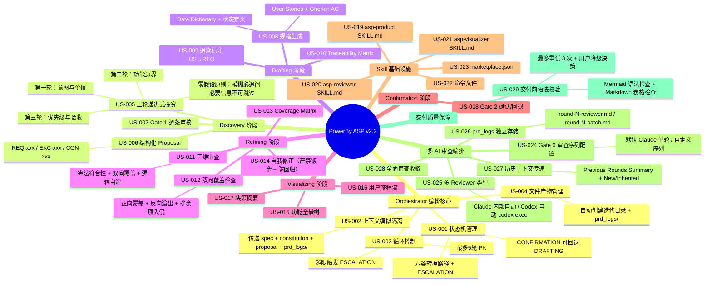
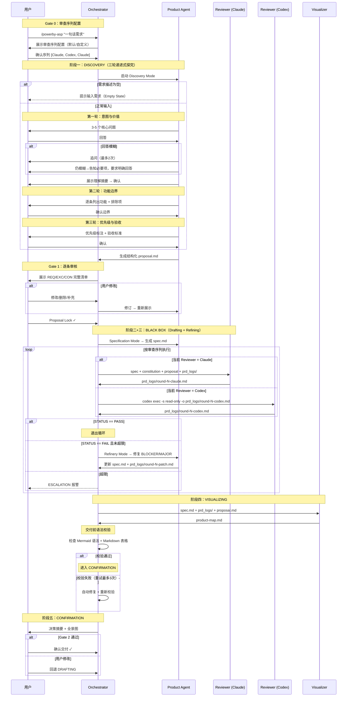

# Product Panorama: PowerBy ASP (Autonomous Spec Protocol)

**版本**: v2.3.1（基于 5 轮多 AI 对抗性审查精炼）

## 1. The Big Picture

## 2. Core Journey

## 3. What We Cut (MVP Strategy)

### In-Scope（v2.2 保留）

完整五阶段流程 + Gate 0 审查序列配置 + 多 AI 审查编排 + 交付前语法校验 + 4 个 Skill 提示词 + 1 个命令文件 + marketplace 注册，共 29 个需求项（REQ-001 ~ REQ-029）。

**v2.2 核心特性**：
- 三轮递进式探究 + 零假设原则强制执行（模糊必追问，必要信息不可跳过）
- 结构化 proposal.md（REQ/EXC/CON 编号清单）
- Gate 0 审查序列配置（用户自定义 Reviewer 类型和顺序）
- Gate 1 逐条审核
- 多 AI 交替审查（Claude 内部自动 + Codex 通过 `codex exec` 自动调用）
- prd_logs/ 独立存储（每轮审查报告和修复记录独立文件）
- 历史上下文传递（Previous Rounds Summary + New/Inherited 标注）
- 双向覆盖检查（正向覆盖 + 反向溢出 + 排除项入侵）
- US→REQ 追溯标注 + Traceability Matrix
- Drafting 信息不足时回退 Discovery（不允许带缺失项的规格产出）
- **交付前语法校验**（Mermaid + Markdown 表格，最多重试 3 次，超限用户降级决策）

### Out-of-Scope（明确砍掉）

| 被砍功能 | 砍掉理由 |
|---------|---------|
| 多 Agent 真隔离（独立会话） | 需要 Claude Code 支持独立会话管理，当前技术约束不支持 |
| constitution.md 自动生成 | 宪法文件应由用户手动维护，不属于 ASP 职责 |
| 跨迭代 Spec 关联 | 复杂度高，MVP 不需要 |
| Spec 版本对比 (diff) | 增强功能，非核心价值 |
| 自动化测试用例生成 | 属于后续实现阶段职责 |
| 与 CI/CD 集成 | 超出 ASP 流程范围 |
| 编写任何代码 | 本产品纯 Skill 提示词实现 |

### 关键权衡

- **选择了「单会话模拟隔离」而非「多 Agent 真隔离」**：务实方案，通过 Prompt 策略最大化隔离效果，接受上下文可能轻微污染的风险
- **选择了「零假设原则强制执行」而非「容忍模糊推进」**：宁可多追问用户，也不允许基于推断的信息进入 proposal.md

## 4. Risk Alerts

### v2.2 审查发现（3 轮精炼，已修复）

| 风险来源 | 描述 | 当前状态 |
|---------|------|---------|
| Round 1 (Claude) R1-001 | proposal/spec 缺少多 AI 审查相关需求，实现已超出 proposal 范围 | ✅ 已修复（补齐 REQ-024~028） |
| Round 1 (Claude) R1-002 | 上下文隔离描述过时，未包含 prd_logs/ 历史记录 | ✅ 已修复 |
| Round 1 (Claude) R1-003 | 文件产物仍引用旧的 review_log.md | ✅ 已修复（统一为 prd_logs/） |
| Round 2 (Codex) R2-001 | **零假设原则被显式破坏**：允许"基于推断继续"和"标注不确定项" | ✅ 已修复（强制追问 + 必要信息不可跳过） |
| Round 2 (Codex) R2-002 | Drafting 允许产出带缺失项的规格 | ✅ 已修复（回退 Discovery 补充信息） |
| Round 4 (Codex) R4-001 | 双向覆盖检查前提写死 REQ 范围 | ✅ 已修复（改为动态 REQ-xxx） |
| Round 4 (Codex) R4-002 | 语法校验流程可能无限循环（死胡同） | ✅ 已修复（3 次重试上限 + 用户降级决策） |

### 遗留 MINOR（不阻塞交付，后续优化）

| Issue | 描述 |
|-------|------|
| R1-007 / R2-004 | 五阶段表述未显式纳入 Gate 0（Gate 0 不算独立阶段，表述风险低） |
| R2-003 | 禁用模糊词字面量出现在规则定义示例中（机械扫描可能误报） |

### 架构性风险（持续关注）

| 风险 | 描述 |
|------|------|
| 单会话模拟隔离 | Reviewer 可能受上下文污染，通过严格 Prompt 策略缓解 |
| Token 消耗 | 多轮多 AI PK 循环消耗大量 token，MINOR 延后策略缓解 |
| Codex exec 依赖 | Codex 自动审查依赖 codex-cli 本地安装和 read-only 沙箱支持 |

## 5. Executive Summary

> **一句话价值**：用户输入一句话需求，系统自动完成「三轮递进式探究 → 结构化提案 → 规格草拟 → 多 AI 交替对抗审查 → 自我修正 → 可视化交付」全流程，产出逻辑自洽、边界清晰、不多不少的产品规格。

**实现载体**：纯 Skill 提示词（4 个 SKILL.md + 1 个命令文件），不写任何代码。

**v2.2 核心改进**（相对 v2.0）：
- 新增 **Gate 0 审查序列配置**，用户可自定义多 AI 审查顺序
- 新增 **多 AI 交替审查**（Claude 内部自动 + Codex 通过 `codex exec` 自动调用）
- 新增 **prd_logs/ 独立存储**，每轮审查报告和修复记录独立文件，完整可追溯
- 新增 **历史上下文传递**，Reviewer 读取前序审查记录，问题逐轮收敛
- 新增 **交付前语法校验**（REQ-029）：Mermaid + Markdown 表格语法检查，3 次重试上限
- 强化 **零假设原则**：模糊回答必须追问，必要信息不可跳过，Drafting 信息不足回退 Discovery

**精炼过程**：
- Round 1 (Claude): FAIL → 修复 3 BLOCKER + 3 MAJOR
- Round 2 (Codex): FAIL → 修复 1 BLOCKER + 1 MAJOR
- Round 3 (Claude): PASS
- Round 4 (Codex): FAIL → 修复 2 MAJOR（新增 REQ-029 后重新审查）
- Round 5 (Claude): **PASS** → 遗留 2 MINOR

**最大风险**：单会话模拟隔离的上下文污染 + Codex exec 依赖本地 CLI 安装。
