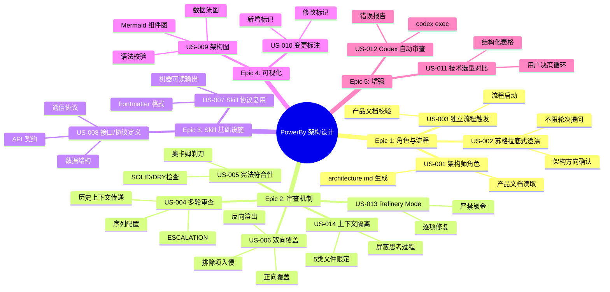
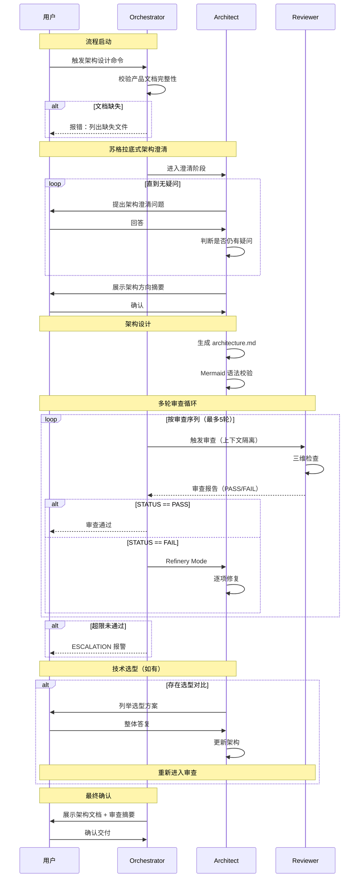

# Product Panorama: PowerBy Architecture Design (架构设计流程)

**版本**: v1.0.0
**基于**: spec.md v1.2.0

---

## 1. The Big Picture (功能全景树)

## 2. Core Journey (核心流程)

## 3. Executive Summary (决策摘要)

### 一句话价值
将产品规格自动转化为经过多 AI 对抗审查的高质量架构文档，前期苏格拉底式澄清最大化减少后期返工。

### MVP 裁剪报告
- ✅ 保留：架构师角色、苏格拉底式澄清、多轮审查、双向覆盖、接口/协议定义、架构可视化、变更标注
- ⚠️ 应该级：技术选型对比流程、Codex 自动化审查
- ❌ 排除：业务代码生成、任务拆解（tasks.md）、跨迭代架构关联

### 风险提示
| 风险 | 来源 | 状态 |
|------|------|------|
| Codex 审查失败可能中断审查链 | Round 2 Codex #001 | ✅ 已修复（生成错误报告保持链完整） |
| 架构修复流程缺失导致审查无法闭环 | Round 1 Claude #001 | ✅ 已修复（新增 Refinery Mode） |
| Reviewer 上下文污染导致审查不可复现 | Round 1 Claude #002 | ✅ 已修复（新增上下文隔离） |
| Data Dictionary 行业术语未定义 | Round 2 Codex #002 | ⚠️ MINOR，不影响可执行性 |
