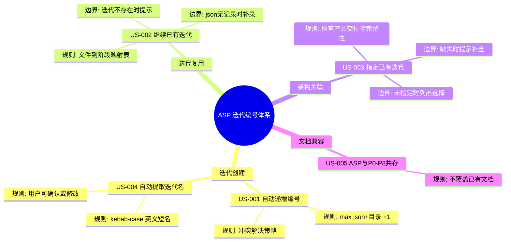
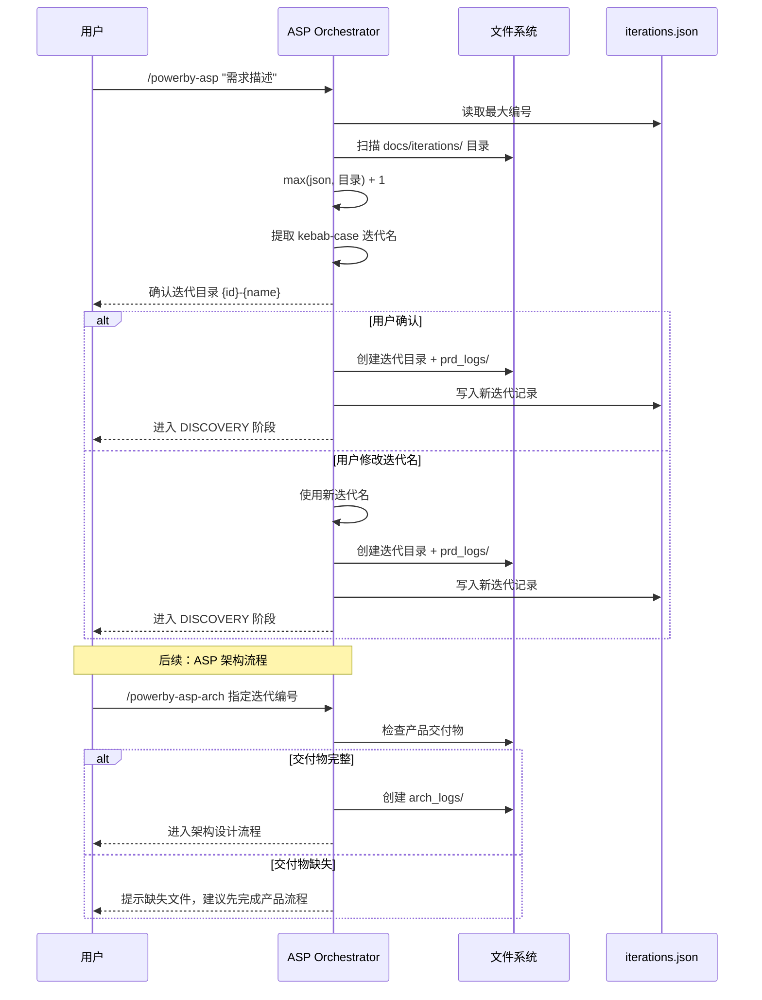

# Product Panorama: ASP 迭代编号体系

## 1. The Big Picture

## 2. Core Journey

## 3. What we cut (MVP Strategy)

- 无功能裁剪。proposal.md 中所有 REQ 均已在 spec.md 中完整覆盖。
- 2 个 MINOR 建议延期处理：P0-P8 文件保护清单显式化、迭代名提取算法确定性定义。

## 4. Risk Alerts

- Round 1 (Claude) 指出编号双源逻辑存在冲突风险（已修复：明确 max 取值策略），但实际使用中仍需注意手动创建目录可能导致编号跳跃。
- Round 2 (Codex) 指出 US-003 范围加严问题（已修复：移除 product-map.md 前置要求），需注意后续如果 ASP 流程变更交付物清单，需同步更新 proposal 和 spec。
