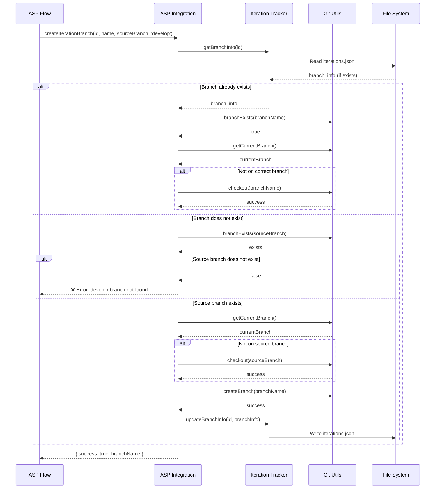
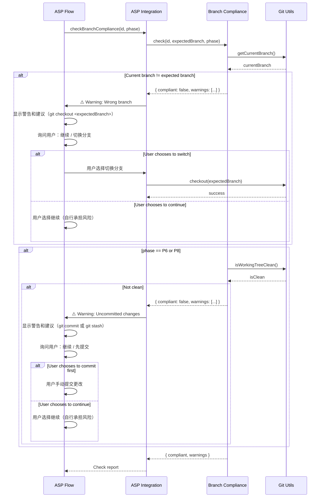
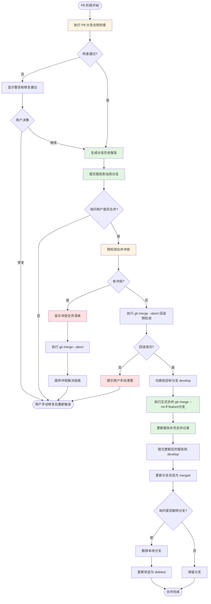
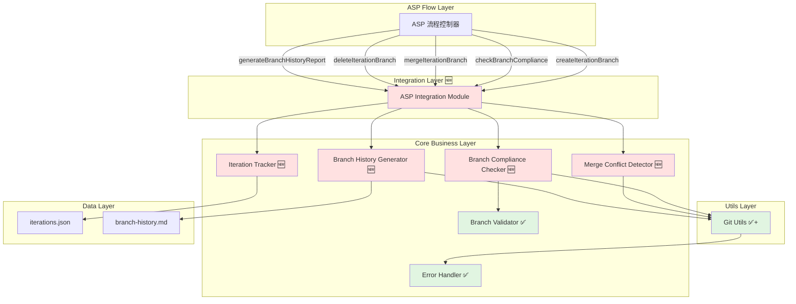

# Architecture: Git分支自动化管理

**迭代编号**: 008
**迭代名称**: git-branch-automation
**文档版本**: v1.0.0
**创建日期**: 2026-03-06
**架构师**: powerby-asp-architect

---

## 目录

1. [系统架构概览](#1-系统架构概览)
2. [现有架构继承](#2-现有架构继承)
3. [组件划分](#3-组件划分)
4. [数据流设计](#4-数据流设计)
5. [接口与协议定义](#5-接口与协议定义)
6. [架构图](#6-架构图)
7. [架构追溯矩阵](#7-架构追溯矩阵)

---

## 1. 系统架构概览

### 1.1 架构目标

在现有 `powerby-git` 技能基础上，扩展 ASP 流程集成能力，实现迭代分支的自动化管理，确保每个迭代在独立的 feature 分支上开发，遵循 GitFlow 最佳实践。

### 1.2 架构原则

1. **横切关注点分离**：Git 分支管理作为基础设施层，独立于业务流程
2. **复用优先**：最大化复用 powerby-git 现有能力，避免重复造轮子
3. **警告优先，不强制阻塞**：检测到不规范操作时警告用户，但尊重用户决策
4. **本地优先**：专注本地分支流程，远程操作交给用户
5. **渐进式增强**：P0 实现核心流程，P1 增强用户体验

### 1.3 技术栈

- **语言**: Node.js (ES6+)
- **Git 操作库**: simple-git
- **CLI 框架**: commander + chalk
- **测试框架**: Jest
- **数据存储**: JSON 文件 (`.powerby/iterations.json`)

---

## 2. 现有架构继承

### 2.1 复用的现有服务

#### powerby-github-branch 技能（兼容层）

**模块**: `skills/powerby-github-branch/`

**兼容性说明**:
- 本次架构设计需与现有 `powerby-github-branch` 技能保持兼容（CON-004）
- `powerby-github-branch` 是基于 `powerby-git` 的上层封装，提供 GitHub 工作流集成
- 本次设计复用 `powerby-git` 底层能力，不直接依赖 `powerby-github-branch`
- 如需扩展 `powerby-github-branch` 的 `create_feature_branch()` 和 `merge_branch()` 方法，可在其内部调用本次新增的 ASP Integration Module

**适配方式**:
- 保持 `powerby-github-branch` 现有 API 不变
- 新增的 ASP Integration Module 可作为 `powerby-github-branch` 的底层依赖
- 两者通过 `powerby-git` 共享 Git 操作能力

---

#### powerby-git 技能（完全复用）

**模块**: `skills/powerby-git/src/utils/git.js`

**复用能力**:
- `getCurrentBranch()` - 获取当前分支名
- `createBranch(branchName)` - 创建并切换分支
- `branchExists(branchName)` - 检查分支是否存在
- `deleteBranch(branchName)` - 删除本地分支
- `getBranchStatus()` - 获取分支和工作区状态
- `getMergedBranches(mainBranch)` - 获取已合并分支列表
- `getLastCommit()` - 获取最后一次提交信息

**适配方式**: 直接调用，无需修改

---

#### powerby-git 分支验证器（完全复用）

**模块**: `skills/powerby-git/src/core/branch-validator.js`

**复用能力**:
- `generateBranchName(type, name)` - 生成规范的分支名
- `validateBranchName(branchName, type)` - 验证分支命名规范
- `BRANCH_TYPES` - 分支类型常量（feature/bugfix/hotfix/release）

**适配方式**: 直接调用，无需修改

---

#### .powerby/iterations.json（扩展复用）

**现有字段**:
```json
{
  "id": "008",
  "name": "git-branch-automation",
  "status": "in_progress",
  "phase": "ASP",
  "created_at": "2026-03-06T00:00:00Z",
  "branch": "v2",
  "documents": { ... }
}
```

**扩展字段**（新增 `branch_info`）:
```json
{
  "branch_info": {
    "branch_name": "feature/008-git-branch-automation",
    "status": "active",
    "created_at": "2026-03-06T10:00:00Z",
    "merged_at": null,
    "deleted_at": null,
    "source_branch": "develop",
    "target_branch": "develop"
  }
}
```

**适配方式**: 向后兼容扩展，不影响现有迭代记录

---

### 2.2 新增组件（标注为 🆕）

以下组件为本次迭代全新开发：

1. **ASP Integration Module** (`src/integrations/asp.js`) 🆕
2. **Branch Compliance Checker** (`src/core/branch-compliance.js`) 🆕
3. **Merge Conflict Detector** (`src/core/merge-conflict-detector.js`) 🆕
4. **Branch History Generator** (`src/core/branch-history-generator.js`) 🆕
5. **Iteration Tracker** (`src/core/iteration-tracker.js`) 🆕

---

## 3. 组件划分

### 3.1 组件层次结构

```
powerby-git/
├── src/
│   ├── integrations/          # 🆕 集成层（ASP 流程集成）
│   │   └── asp.js
│   ├── core/                  # 核心业务逻辑层
│   │   ├── branch-validator.js      # ✅ 已有（复用）
│   │   ├── branch-compliance.js     # 🆕 分支规范检查
│   │   ├── merge-conflict-detector.js  # 🆕 合并冲突检测
│   │   ├── branch-history-generator.js # 🆕 分支历史生成
│   │   ├── iteration-tracker.js     # 🆕 迭代追踪
│   │   └── errors.js                # ✅ 已有（复用）
│   ├── utils/                 # 工具层
│   │   └── git.js             # ✅ 已有（扩展）
│   └── commands/              # CLI 命令层
│       ├── start.js           # ✅ 已有（保持兼容）
│       └── cleanup.js         # ✅ 已有（保持兼容）
```

---

### 3.2 组件详细设计

#### 组件 1: ASP Integration Module 🆕

**职责**: ASP 流程与 Git 分支管理的集成协调器

**输入**:
- 迭代 ID (`iterationId`)
- 迭代名称 (`iterationName`)
- ASP 阶段标识 (`phase`: DISCOVERY/DRAFTING/CONFIRMATION/P6/P8)

**输出**:
- 分支操作结果 (`{ success: boolean, message: string, branchName?: string }`)
- 检查报告 (`{ compliant: boolean, warnings: string[] }`)

**依赖**:
- `utils/git.js` - Git 操作
- `core/branch-compliance.js` - 规范检查
- `core/iteration-tracker.js` - 迭代追踪

**核心方法**:
```javascript
// 创建迭代分支（DISCOVERY 阶段后触发）
async createIterationBranch(iterationId, iterationName, sourceBranch = 'develop')

// 检查分支规范性（P1/P6/P8 阶段触发）
async checkBranchCompliance(iterationId, phase)

// 合并迭代分支（P8 阶段触发）
async mergeIterationBranch(iterationId, targetBranch = 'develop')

// 删除迭代分支（P8 阶段用户确认后触发）
async deleteIterationBranch(iterationId)

// 生成分支历史报告（P8 阶段合并前触发）
async generateBranchHistoryReport(iterationId)
```

**复用策略**: 🆕 全新开发

---

#### 组件 2: Branch Compliance Checker 🆕

**职责**: 检查当前分支是否符合迭代规范

**输入**:
- 迭代 ID (`iterationId`)
- 预期分支名 (`expectedBranchName`)
- 检查阶段 (`phase`)

**输出**:
```javascript
{
  compliant: boolean,
  currentBranch: string,
  expectedBranch: string,
  warnings: [
    { level: 'warning'|'error', message: string, suggestion: string }
  ]
}
```

**依赖**:
- `utils/git.js` - 获取当前分支
- `core/branch-validator.js` - 验证分支命名

**核心逻辑**:
```javascript
1. 获取当前分支名
2. 从 iterations.json 读取预期分支名
3. 比较当前分支与预期分支
4. IF 不匹配:
     生成警告信息 + 切换命令建议
5. IF phase == 'P6' or 'P8':
     调用 isWorkingTreeClean() 检查工作区状态
     IF 有未提交更改:
       生成警告信息 + 提交建议（git commit 或 git stash）
6. 返回检查报告
```

**阶段检查规则**:
- **P1 阶段**: 仅检查当前分支是否为 feature/{id}-{name}
- **P6 阶段**: 检查当前分支 + 是否有未提交更改
- **P8 阶段**: 检查当前分支 + 工作区是否干净（必须无未提交更改）

**复用策略**: 🆕 全新开发

---

#### 组件 3: Merge Conflict Detector 🆕

**职责**: 预检测合并冲突，避免破坏工作区

**输入**:
- 源分支 (`sourceBranch`)
- 目标分支 (`targetBranch`)

**输出**:
```javascript
{
  hasConflict: boolean,
  conflictFiles: string[],  // 冲突文件列表
  message: string
}
```

**依赖**:
- `utils/git.js` - Git 合并操作

**核心逻辑**:
```javascript
1. 保存当前分支名（sourceBranch，即 feature 分支）
2. 切换到目标分支（targetBranch，即 develop）
3. 执行 git merge --no-commit --no-ff <sourceBranch>（预检测）
4. IF 合并失败（有冲突）:
     解析冲突文件列表
     执行 git merge --abort（清理现场）
     切换回源分支
     返回 { hasConflict: true, conflictFiles: [...] }
5. ELSE（无冲突）:
     执行 git merge --abort（回滚预检测）
     IF 回滚失败:
       返回错误，提示用户手动清理
     ELSE:
       切换回源分支
       返回 { hasConflict: false }
```

**复用策略**: 🆕 全新开发

---

#### 组件 4: Branch History Generator 🆕

**职责**: 生成分支历史报告（Markdown + Mermaid）

**输入**:
- 分支名 (`branchName`)
- 迭代 ID (`iterationId`)

**输出**:
- Markdown 文件路径 (`docs/iterations/{id}-{name}/branch-history.md`)

**依赖**:
- `utils/git.js` - 获取提交历史

**报告内容**:
```markdown
# Branch History: feature/008-git-branch-automation

## 提交历史
| Commit Hash | Author | Date | Message |
|-------------|--------|------|---------|
| abc1234 | ... | ... | ... |

## 分支图
```mermaid
gitGraph
  commit id: "Initial commit"
  branch feature/008-git-branch-automation
  commit id: "Add ASP integration"
  commit id: "Add conflict detector"
  checkout develop
  merge feature/008-git-branch-automation
```

## 合并记录
- **源分支**: feature/008-git-branch-automation
- **目标分支**: develop
- **合并时间**: 2026-03-06 15:30:00
- **合并者**: chenchiyuan
- **合并提交**: abc1234def5678
- **合并策略**: --no-ff
```

**报告生成时机**:
- 在 P8 阶段合并前生成初始报告（不含合并记录）
- 合并成功后更新报告，补充合并记录（merged_at、merged_by、merge_commit_hash）
- 报告作为迭代交付物的一部分，随代码一起合并到 develop

**Mermaid gitGraph 生成逻辑**:
1. 从 Git 历史提取提交记录（`git log --oneline --graph`）
2. 识别分支创建点（第一个 commit）
3. 识别合并点（merge commit）
4. 构造 gitGraph 语法：
   ```
   gitGraph
     commit id: "<base-commit-message>"
     branch <branch-name>
     commit id: "<commit-1-message>"
     commit id: "<commit-2-message>"
     ...
     checkout <target-branch>
     merge <branch-name>
   ```
5. 处理特殊场景：
   - 如果分支尚未合并，省略 `checkout` 和 `merge` 行
   - 如果提交消息包含特殊字符（如引号），进行转义
   - 限制提交数量（最多显示最近 20 个提交，避免图表过大）

**复用策略**: 🆕 全新开发

---

#### 组件 5: Iteration Tracker 🆕

**职责**: 管理 `.powerby/iterations.json` 中的分支信息

**输入**:
- 迭代 ID (`iterationId`)
- 分支信息 (`branchInfo`)

**输出**:
- 更新后的 iterations.json

**依赖**: 无（纯文件操作）

**核心方法**:
```javascript
// 更新分支信息
async updateBranchInfo(iterationId, branchInfo)

// 获取分支信息
async getBranchInfo(iterationId)

// 更新分支状态
async updateBranchStatus(iterationId, status)  // active/merged/deleted
```

**数据结构**:
```javascript
{
  branch_info: {
    branch_name: string,
    status: 'active' | 'merged' | 'deleted',
    created_at: string,  // ISO 8601
    merged_at: string | null,
    deleted_at: string | null,
    source_branch: string,
    target_branch: string
  }
}
```

**复用策略**: 🆕 全新开发

---

#### 组件 6: Git Utils（扩展复用）

**职责**: Git 操作封装

**新增方法**:
```javascript
// 合并分支（支持 --no-ff）
async mergeBranch(sourceBranch, targetBranch, options = { noFF: true })

// 获取提交历史（支持分支范围）
async getCommitHistory(branchName, baseBranch = 'develop')

// 检查工作区是否干净
async isWorkingTreeClean()
```

**复用策略**: ✅ 扩展复用（在现有 git.js 中新增方法）

---

## 4. 数据流设计

### 4.1 分支创建流程（DISCOVERY 阶段后）



---

### 4.2 分支规范检查流程（P1/P6/P8 阶段）



---

### 4.3 分支合并流程（P8 阶段）



---

## 5. 接口与协议定义

### 5.1 ASP Integration API

#### 5.1.1 createIterationBranch

**描述**: 创建迭代分支（DISCOVERY 阶段后调用）

**签名**:
```javascript
async createIterationBranch(
  iterationId: string,
  iterationName: string,
  sourceBranch: string = 'develop'
): Promise<BranchOperationResult>
```

**输入参数**:
- `iterationId`: 迭代编号（如 "008"）
- `iterationName`: 迭代名称（如 "git-branch-automation"）
- `sourceBranch`: 源分支（默认 "develop"）

**返回值**:
```typescript
interface BranchOperationResult {
  success: boolean;
  branchName: string;
  message: string;
  action: 'created' | 'switched' | 'already_on';
}
```

**错误处理**:
- 源分支不存在 → 抛出 `SourceBranchNotFoundError`（如 develop 分支不存在）
- 分支创建失败 → 抛出 `BranchCreationError`
- Git 仓库不存在 → 抛出 `GitRepositoryNotFoundError`
- 无分支创建权限 → 抛出 `PermissionDeniedError`

**执行流程**:
1. 检查源分支（sourceBranch）是否存在
2. 如源分支不存在 → 返回错误，提示用户先创建 develop 分支
3. 如源分支存在 → 切换到源分支
4. 从源分支创建新的 feature 分支
5. 更新 iterations.json 记录分支信息

---

#### 5.1.2 checkBranchCompliance

**描述**: 检查分支规范性（P1/P6/P8 阶段调用）

**签名**:
```javascript
async checkBranchCompliance(
  iterationId: string,
  phase: 'P1' | 'P6' | 'P8'
): Promise<ComplianceReport>
```

**输入参数**:
- `iterationId`: 迭代编号
- `phase`: 检查阶段

**返回值**:
```typescript
interface ComplianceReport {
  compliant: boolean;
  currentBranch: string;
  expectedBranch: string;
  warnings: Warning[];
  // 注意：用户决策由 ASP Integration 层处理，此接口仅返回检查报告
}

interface Warning {
  level: 'warning' | 'error';
  message: string;
  suggestion: string;
}
```

**检查规则**:
- P1: 检查当前分支是否为 feature/{id}-{name}
- P6: 检查当前分支 + 是否有未提交更改
- P8: 检查当前分支 + 工作区是否干净

**警告策略**:
- 检查失败时生成警告信息和修复建议
- 警告后允许用户选择继续或修复
- 不强制阻塞流程，尊重用户决策

**用户交互处理**:
- 本方法仅返回检查报告，不处理用户交互
- 用户决策（继续/切换分支/中止）由 ASP Integration 或 ASP Flow 层处理
- 如需切换分支，调用方应调用 `git.checkout(expectedBranch)`

---

#### 5.1.3 mergeIterationBranch

**描述**: 合并迭代分支（P8 阶段调用）

**签名**:
```javascript
async mergeIterationBranch(
  iterationId: string,
  targetBranch: string = 'develop'
): Promise<MergeResult>
```

**输入参数**:
- `iterationId`: 迭代编号
- `targetBranch`: 目标分支（默认 "develop"）

**返回值**:
```typescript
interface MergeResult {
  success: boolean;
  hasConflict: boolean;
  conflictFiles?: string[];
  message: string;
}
```

**错误处理**:
- 冲突检测失败 → 返回 `{ success: false, hasConflict: true, conflictFiles: [...] }`
- `git merge --abort` 回滚失败 → 抛出 `MergeRollbackError`（需用户手动清理）
- 切换到目标分支失败 → 抛出 `BranchCheckoutError`
- 正式合并失败 → 抛出 `MergeExecutionError`
- 更新报告失败 → 抛出 `ReportUpdateError`
- Git 提交失败 → 抛出 `GitCommitError`
- 分支状态更新失败 → 抛出 `StateUpdateError`

**执行流程**:
1. 询问用户是否确认合并（CON-003 破坏性操作需用户确认）
2. 用户确认后，调用 Merge Conflict Detector 预检测冲突（切换到 targetBranch，执行 `git merge --no-commit --no-ff <sourceBranch>`）
3. 如有冲突 → 返回冲突文件列表，终止流程
4. 如无冲突 → 回滚预检测，切换到 targetBranch，执行正式合并 `git merge --no-ff <sourceBranch>`
5. 合并成功后，调用 `updateBranchHistoryReport()` 补充合并记录
6. 提交更新后的报告到目标分支
7. 更新分支状态为 `merged`

**前置条件**:
- 用户必须确认合并操作（破坏性操作）
- 分支历史报告已生成并提交到当前分支

---

#### 5.1.4 deleteIterationBranch

**描述**: 删除迭代分支（P8 阶段用户确认后调用）

**签名**:
```javascript
async deleteIterationBranch(
  iterationId: string
): Promise<BranchOperationResult>
```

**输入参数**:
- `iterationId`: 迭代编号

**返回值**:
```typescript
interface BranchOperationResult {
  success: boolean;
  branchName: string;
  message: string;
}
```

**错误处理**:
- 分支状态不是 `merged` → 抛出 `BranchNotMergedError`（未合并的分支不能删除）
- 当前分支是待删除分支 → 抛出 `CannotDeleteCurrentBranchError`（需先切换到其他分支）
- 分支删除失败 → 抛出 `BranchDeletionError`
- 分支状态更新失败 → 抛出 `StateUpdateError`

**执行流程**:
1. 检查分支状态是否为 `merged`
2. 检查当前分支是否为待删除分支
3. 删除本地分支（`git branch -d <branchName>`）
4. 更新分支状态为 `deleted`，记录 `deleted_at` 时间戳
5. 远程分支操作由用户手动管理

**前置条件**:
- 分支状态必须为 `merged`（已合并）
- 当前分支不能是待删除分支

---

#### 5.1.5 generateBranchHistoryReport

**描述**: 生成分支历史报告（P8 阶段合并前调用）

**签名**:
```javascript
async generateBranchHistoryReport(
  iterationId: string
): Promise<ReportResult>
```

**输入参数**:
- `iterationId`: 迭代编号

**返回值**:
```typescript
interface ReportResult {
  success: boolean;
  reportPath: string;
  message: string;
}
```

**错误处理**:
- 分支信息不存在 → 抛出 `BranchInfoNotFoundError`
- Git 提交历史获取失败 → 抛出 `GitHistoryFetchError`
- 报告文件写入失败 → 抛出 `FileWriteError`
- Git 提交失败 → 抛出 `GitCommitError`

**报告内容**:
- 提交历史表格
- 分支图（Mermaid gitGraph）
- 合并记录（初始为空，合并后补充）

**输出路径**: `docs/iterations/{id}-{name}/branch-history.md`

**执行时机**:
- 在 P8 阶段合并前生成初始报告（不含合并记录）
- 合并成功后调用 `updateBranchHistoryReport()` 补充合并记录

---

#### 5.1.6 updateBranchHistoryReport

**描述**: 更新分支历史报告，补充合并记录（合并成功后调用）

**签名**:
```javascript
async updateBranchHistoryReport(
  iterationId: string,
  mergeRecord: MergeRecord
): Promise<ReportResult>
```

**输入参数**:
- `iterationId`: 迭代编号
- `mergeRecord`: 合并记录（包含 merged_at, merged_by, merge_commit_hash）

**返回值**:
```typescript
interface ReportResult {
  success: boolean;
  reportPath: string;
  message: string;
}
```

**错误处理**:
- 报告文件不存在 → 抛出 `ReportFileNotFoundError`
- 报告文件读取失败 → 抛出 `FileReadError`
- 报告文件写入失败 → 抛出 `FileWriteError`
- Git 提交失败 → 抛出 `GitCommitError`

**执行流程**:
1. 读取已生成的 branch-history.md
2. 补充合并记录部分（merged_at, merged_by, merge_commit_hash, strategy）
3. 保存更新后的报告
4. 返回更新结果

**前置条件**:
- branch-history.md 已生成
- 合并操作已成功完成

---

### 5.2 数据结构定义

#### 5.2.1 BranchInfo（扩展 iterations.json）

```typescript
interface BranchInfo {
  branch_name: string;           // 分支名称（如 "feature/008-git-branch-automation"）
  status: 'active' | 'merged' | 'deleted';  // 分支状态
  created_at: string;            // 创建时间（ISO 8601）
  merged_at: string | null;      // 合并时间（ISO 8601，未合并为 null）
  deleted_at: string | null;     // 删除时间（ISO 8601，未删除为 null）
  source_branch: string;         // 源分支（如 "develop"）
  target_branch: string;         // 目标分支（如 "develop"）
}
```

**存储位置**: `.powerby/iterations.json` 中每个迭代的 `branch_info` 字段

---

#### 5.2.2 BranchHistoryReport（Markdown 文档）

```typescript
interface BranchHistoryReport {
  iteration_id: string;
  branch_name: string;
  commits: CommitRecord[];
  merge_record: MergeRecord | null;  // 初始为 null，合并后补充
}

interface CommitRecord {
  hash: string;
  author: string;
  date: string;
  message: string;
}

interface MergeRecord {
  source_branch: string;
  target_branch: string;
  merged_at: string;
  merged_by: string;           // 合并者（Git 用户名）
  merge_commit_hash: string;   // 合并提交的哈希值
  strategy: string;            // "--no-ff"
}
```

**输出格式**: Markdown + Mermaid

---

## 6. 架构图

### 6.1 组件架构图



**图例**:
- 🆕 红色：全新开发组件
- ✅ 绿色：现有组件（完全复用）
- ✅+ 绿色：现有组件（扩展复用）

---

### 6.2 数据流架构图（完整生命周期）

```mermaid
sequenceDiagram
    participant User as 用户
    participant ASP as ASP 流程
    participant Integration as ASP Integration
    participant Git as Git Utils
    participant FS as iterations.json

    Note over User,FS: 阶段 1: DISCOVERY 结束后

    User->>ASP: /powerby-asp "新需求"
    ASP->>ASP: DISCOVERY 阶段（三轮探究）
    ASP->>ASP: 生成 proposal.md
    ASP->>Integration: createIterationBranch(id, name)
    Integration->>Git: branchExists(branchName)?
    Git-->>Integration: false
    Integration->>Git: createBranch(branchName)
    Git-->>Integration: success
    Integration->>FS: 更新 branch_info (status: active)
    Integration-->>ASP: { success: true, branchName }
    ASP-->>User: ✅ 已创建并切换到分支 feature/008-xxx

    Note over User,FS: 阶段 2: P1 开始时

    User->>ASP: 进入 P1 阶段
    ASP->>Integration: checkBranchCompliance(id, 'P1')
    Integration->>Git: getCurrentBranch()
    Git-->>Integration: currentBranch
    alt 分支不符合规范
        Integration-->>User: ⚠️ 警告：当前在 main 分支，应在 feature/008-xxx
        Integration-->>User: 建议：git checkout feature/008-xxx
        User->>Integration: 继续 / 切换分支
    end
    Integration-->>ASP: { compliant: true/false, warnings }

    Note over User,FS: 阶段 3: P6 开始时

    User->>ASP: 进入 P6 阶段
    ASP->>Integration: checkBranchCompliance(id, 'P6')
    Integration->>Git: isWorkingTreeClean()
    Git-->>Integration: isClean
    alt 有未提交更改
        Integration-->>User: ⚠️ 警告：有未提交的更改
        Integration-->>User: 建议：git commit -m "..."
        User->>Integration: 继续 / 先提交
    end

    Note over User,FS: 阶段 4: P8 完成时

    User->>ASP: 进入 P8 阶段
    ASP->>Integration: checkBranchCompliance(id, 'P8')
    Integration->>Git: getCurrentBranch()
    Git-->>Integration: currentBranch
    Integration->>Git: isWorkingTreeClean()
    Git-->>Integration: isClean
    alt 分支或工作区不符合规范
        Integration-->>User: ⚠️ 警告：分支错误或有未提交更改
        Integration-->>User: 建议：切换分支或提交更改
        User->>Integration: 继续 / 修复
    end

    ASP->>Integration: generateBranchHistoryReport(id)
    Integration->>Git: getCommitHistory(branchName)
    Git-->>Integration: commits[]
    Integration->>FS: 写入 branch-history.md（初始版本，无合并记录）
    Integration->>Git: commit("Add branch history report")
    Integration-->>ASP: { success: true, reportPath }

    ASP->>User: 询问是否合并分支？
    User->>ASP: 确认合并

    ASP->>Integration: mergeIterationBranch(id, 'develop')
    Integration->>Git: 保存当前分支名（feature分支）
    Integration->>Git: checkout develop
    Integration->>Git: merge --no-commit --no-ff feature分支（预检测）
    alt 有冲突
        Git-->>Integration: conflict detected
        Integration->>Git: merge --abort
        Integration->>Git: checkout feature分支（切回源分支）
        Integration-->>User: ❌ 合并冲突，文件：[...]
        Integration-->>User: 解决指南：...
    else 无冲突
        Git-->>Integration: no conflict
        Integration->>Git: merge --abort (回滚预检测)
        Integration->>Git: checkout feature分支（切回源分支）
        Integration->>Git: checkout develop（切换到目标分支）
        Integration->>Git: merge --no-ff feature分支（正式合并）
        Git-->>Integration: success
        Integration->>Git: getLastCommit() (获取合并提交信息)
        Git-->>Integration: { hash, author, date }
        Integration->>Integration: updateBranchHistoryReport(id, mergeRecord)
        Integration->>FS: 更新 branch-history.md（补充合并记录）
        Integration->>Git: commit("Update branch history with merge record")
        Integration->>FS: 更新 branch_info (status: merged, merged_at)
        Integration-->>User: ✅ 合并成功

        User->>Integration: 是否删除分支？
        alt 用户确认删除
            Integration->>Git: deleteBranch(branchName)
            Integration->>FS: 更新 branch_info (status: deleted, deleted_at)
            Integration-->>User: ✅ 分支已删除
        else 用户保留分支
            Integration-->>User: ℹ️ 分支已保留
        end
    end
```



---

## 7. 架构追溯矩阵

### 7.1 功能点 → 组件映射

| 功能点 | 对应组件 | 复用策略 | 备注 |
|--------|---------|---------|------|
| FP-001: 迭代创建时自动创建分支 | ASP Integration → Git Utils | 扩展复用 | 调用 createBranch() |
| FP-002: 分支信息追踪 | Iteration Tracker | 🆕 全新开发 | 管理 iterations.json |
| FP-003: 迭代完成时自动合并分支 | ASP Integration → Merge Conflict Detector → Git Utils | 🆕 + 扩展复用 | 新增 mergeBranch() |
| FP-004: 分支清理机制 | ASP Integration → Git Utils | 扩展复用 | 调用 deleteBranch() |
| FP-005: 分支状态检查 | Branch Compliance Checker → Git Utils | 🆕 + 扩展复用 | 调用 isWorkingTreeClean()（新增方法） |
| FP-006: 分支切换提示 | Branch Compliance Checker | 🆕 全新开发 | 警告 + 建议 |
| FP-007: 分支冲突检测 | Merge Conflict Detector | 🆕 全新开发 | 预检测机制 |
| FP-008: 分支历史可视化 | Branch History Generator → Git Utils | 🆕 + 扩展复用 | 生成 Markdown + Mermaid gitGraph |

---

### 7.2 组件 → 需求追溯

| 组件 | 覆盖需求 | 覆盖功能点 |
|------|---------|-----------|
| ASP Integration Module | REQ-001, REQ-003, REQ-004 | FP-001, FP-003, FP-004 |
| Branch Compliance Checker | REQ-005, REQ-006 | FP-005, FP-006 |
| Merge Conflict Detector | REQ-007 | FP-007 |
| Branch History Generator | REQ-008 | FP-008 |
| Iteration Tracker | REQ-002 | FP-002 |
| Git Utils (扩展) | REQ-001, REQ-003, REQ-004, REQ-008 | FP-001, FP-003, FP-004, FP-008 |

---

### 7.3 架构决策记录（ADR）

#### ADR-001: 扩展 powerby-git 并保持与 powerby-github-branch 兼容

**决策**: 在 powerby-git 中增加 ASP 集成模块，同时保持与 powerby-github-branch 的兼容性

**理由**:
- Git 分支管理是横切关注点，应作为基础设施层统一维护
- 避免代码重复（Git 操作封装、分支验证逻辑）
- 保持向后兼容，不影响现有 CLI 命令
- powerby-github-branch 是基于 powerby-git 的上层封装，两者通过 powerby-git 共享底层能力

**影响**:
- 需要在 powerby-git 中新增 `src/integrations/` 目录
- 需要扩展 `utils/git.js`，新增 `mergeBranch()` 等方法
- powerby-github-branch 可选择性地调用 ASP Integration Module 作为底层依赖
- 如需扩展 powerby-github-branch 的 `create_feature_branch()` 和 `merge_branch()` 方法，可在其内部调用 ASP Integration Module

---

#### ADR-002: 警告优先，不强制阻塞

**决策**: 检测到不规范操作时警告用户，但不强制阻塞流程

**理由**:
- 尊重用户决策，避免过度干预
- 某些场景下用户可能有合理理由偏离标准流程
- 提供清晰的警告和建议，帮助用户做出明智决策

**影响**:
- 所有检查方法返回 `{ compliant: boolean, warnings: [] }`
- ASP 流程根据 `compliant` 决定是否继续，但不强制终止

---

#### ADR-003: 本地优先，远程操作交给用户

**决策**: 专注本地分支流程，远程分支操作由用户手动管理

**理由**:
- 简化实现，避免处理远程仓库配置、认证、网络异常等复杂场景
- 用户对远程操作有更强的控制需求（如推送时机、推送策略）
- 保持工具的单一职责（本地分支管理）

**影响**:
- REQ-004 中的分支删除仅删除本地分支，远程分支由用户手动管理
- REQ-005 中的分支检查不包含远程同步检查
- 分支状态模型简化为 active/merged/deleted 三种状态

---

#### ADR-004: 分支历史报告在合并前生成并提交

**决策**: 在 P8 阶段合并前生成初始报告，合并后更新补充合并记录

**理由**:
- 报告作为迭代交付物的一部分，应随代码一起合并到 develop
- 合并前生成可包含完整的提交历史和分支图
- 合并后更新可补充合并者、合并提交哈希等信息

**影响**:
- 报告生成在 `mergeIterationBranch()` 之前调用
- 报告提交后才执行合并操作
- 合并成功后调用 `updateBranchHistoryReport()` 补充 merged_by 和 merge_commit_hash 字段
- 更新后的报告再次提交到目标分支，确保合并记录完整

---

## 8. 技术风险与缓解措施

### 8.1 高风险项

**风险 1**: 与现有 powerby-git CLI 命令冲突

**缓解措施**:
- ASP 集成通过独立模块 `src/integrations/asp.js` 实现
- 不修改现有 CLI 命令（start/cleanup/check/list）
- 通过编程 API 调用，不暴露新的 CLI 命令

---

**风险 2**: `git merge --abort` 回滚失败导致工作区污染

**缓解措施**:
- 在回滚后检查工作区状态，确认回滚成功
- 如回滚失败，提示用户手动清理（`git merge --abort` 或 `git reset --hard`）
- 记录详细错误日志，便于排查

---

### 8.2 中风险项

**风险 3**: 用户在错误分支上进行大量工作，切换分支可能丢失工作

**缓解措施**:
- 在切换分支前检查是否有未提交更改
- 提示用户先提交或使用 `git stash` 保存工作
- 提供清晰的警告信息和操作建议

---

**风险 4**: iterations.json 文件损坏或格式错误

**缓解措施**:
- 读取前验证 JSON 格式
- 使用 JSON Schema 验证数据结构
- 提供修复工具（如重新生成 branch_info）

---

### 8.3 低风险项

**风险 5**: Mermaid 语法错误导致分支历史报告渲染失败

**缓解措施**:
- 使用模板生成 Mermaid 代码，确保语法正确
- 限制 gitGraph 复杂度（最多 20 个提交节点）
- 对提交消息进行转义处理（引号、换行符等特殊字符）
- 提供纯文本备份（提交历史表格）
- 如果 gitGraph 生成失败，降级为纯文本描述

---

**风险 6**: 复杂分支结构（多次合并、分支重命名）导致 gitGraph 渲染异常

**缓解措施**:
- 简化 gitGraph 结构，仅显示主分支和当前 feature 分支
- 忽略中间的临时分支和 rebase 操作
- 如果检测到复杂结构，提示用户使用 `git log --graph` 查看完整历史

---

## 9. 性能与可扩展性

### 9.1 性能考虑

- **Git 操作优化**: 使用 simple-git 的批量操作 API，减少 Git 命令调用次数
- **文件 I/O 优化**: 缓存 iterations.json 读取结果，避免重复读取
- **异步操作**: 所有 Git 操作使用 async/await，避免阻塞

### 9.2 可扩展性

- **多工作流支持**: 当前实现基于 GitFlow，未来可扩展支持 GitHub Flow、Trunk-Based
- **多平台支持**: 当前实现平台无关，未来可集成 GitHub/GitLab API
- **自定义钩子**: 预留钩子机制，允许用户在分支创建/合并前后执行自定义逻辑

---

## 10. 测试策略

### 10.1 单元测试

- **覆盖率目标**: ≥80%
- **测试框架**: Jest
- **测试重点**:
  - ASP Integration 模块的所有公开方法
  - Branch Compliance Checker 的检查逻辑
  - Merge Conflict Detector 的冲突检测逻辑
  - Iteration Tracker 的 JSON 读写逻辑

### 10.2 集成测试

- **测试场景**:
  - 完整的分支创建 → 检查 → 合并 → 删除流程
  - 冲突检测 → 回滚 → 正式合并流程
  - 分支历史报告生成 → 提交 → 合并流程

### 10.3 端到端测试

- **测试场景**:
  - 模拟完整的 ASP 流程（DISCOVERY → DRAFTING → CONFIRMATION → P8）
  - 验证 iterations.json 的状态变更
  - 验证 branch-history.md 的生成

---

## 11. 部署与发布

### 11.1 版本策略

- **版本号**: 遵循语义化版本（Semantic Versioning）
- **发布周期**: 与 powerby-git 技能同步发布

### 11.2 向后兼容性

- **保证**: 不破坏现有 powerby-git CLI 命令
- **迁移**: 现有迭代无需迁移，新迭代自动启用分支管理

---

## 12. 文档与培训

### 12.1 用户文档

- **README.md**: 更新 powerby-git 的 README，增加 ASP 集成说明
- **API 文档**: 生成 JSDoc 文档，说明 ASP Integration API

### 12.2 开发者文档

- **架构文档**: 本文档（architecture.md）
- **代码注释**: 所有公开方法必须包含 JSDoc 注释

---

**文档结束**
