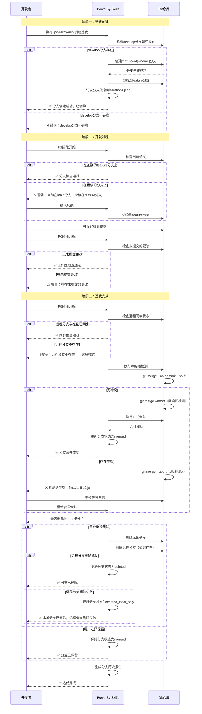

# Product Panorama: Git分支自动化管理

## 1. 功能全景树 (Feature Mindmap)

```mermaid
mindmap
  root((Git分支自动化管理))
    核心分支管理
      US-001: 自动创建迭代分支
        规则: feature/{id}-{name}格式
        规则: 从develop分支创建
        规则: 自动切换到新分支
      US-002: 追踪分支状态
        规则: active/merged/deleted状态
        规则: 记录创建和合并时间
      US-003: 自动合并迭代分支
        规则: 使用--no-ff保留历史
        规则: 合并到develop分支
        边界: 合并冲突处理
      US-004: 清理已合并分支
        规则: 用户确认后删除
        规则: 删除本地和远程分支
        边界: 远程分支删除失败
        边界: 远程分支不存在
      US-005: 检查分支状态
        规则: P1检查当前分支
        规则: P6检查未提交更改
        规则: P8检查远程同步
        边界: 远程分支不存在时降级
    增强功能
      US-006: 分支切换提示
        规则: 检测错误分支
        规则: 一键切换功能
      US-007: 检测合并冲突
        规则: 预检测冲突
        规则: 清理现场
        规则: 无冲突时正式合并
      US-008: 生成分支历史报告
        规则: Markdown格式
        规则: 包含Mermaid分支图
        规则: 记录提交和合并历史
```

## 2. 核心用户旅程 (Core Journey)



## 3. 决策摘要 (Executive Summary)

### 一句话价值
**自动化Git分支管理，让开发者专注于功能实现，而不是手动管理分支，确保每个迭代在独立的feature分支上开发，遵循Git最佳实践。**

### MVP 裁剪报告

为了保证核心功能的稳定性和可实现性，以下功能已推迟到 P2 阶段（Post-MVP）：

| 功能 | 原因 | 影响 |
|------|------|------|
| REQ-009: 多迭代并行开发支持 | 增加复杂度，当前单迭代流程已满足核心需求 | 用户暂时无法在多个feature分支之间快速切换 |
| REQ-010: 自动推送到远程仓库 | 需要处理复杂的远程仓库配置和权限场景 | 用户需要手动推送到远程仓库 |
| REQ-011: 分支保护规则集成 | 依赖GitHub/GitLab平台API，增加外部依赖 | 用户需要手动检查分支保护规则 |

**裁剪策略**：所有远程分支操作（删除、同步检查）已设计为可选，当远程分支不存在时自动降级为本地操作，不阻塞核心流程。这确保了即使 REQ-010（自动推送）推迟，核心功能仍可正常运行。

### 风险提示

#### 已识别并修复的风险

1. **远程分支依赖未定义（Round 2 BLOCKER）**
   - **风险描述**: REQ-004 和 REQ-005 定义了删除远程分支和检查远程同步的 P0 能力，但 REQ-010（自动推送到远程仓库）已推迟到 P2，导致远程分支何时存在、未配置 remote 时如何处理等前置条件未声明，违反零假设原则。
   - **修复方案**: 将所有远程分支操作定义为可选，当远程分支不存在时自动降级为本地操作，不阻塞核心流程。
   - **持续关注**: 实现时需确保远程操作的降级逻辑清晰，错误提示友好。

2. **冲突检测流程死胡同（Round 2 MAJOR）**
   - **风险描述**: US-007 使用 `git merge --no-commit --no-ff` 做冲突预检测，但未定义无冲突后如何回滚预检测现场，也未定义检测后何时执行 `git merge --abort`，导致仓库停留在中间合并态，形成流程死胡同。
   - **修复方案**: 明确定义冲突检测的完整流程：有冲突时执行 `git merge --abort` 清理现场，无冲突时执行 `git merge --abort` 回滚预检测，然后执行正式合并。
   - **持续关注**: 实现时需确保 `git merge --abort` 的执行时机准确，避免仓库状态异常。

3. **破坏性操作缺少错误路径（Round 2 MAJOR）**
   - **风险描述**: US-004 是破坏性操作，但只定义了成功路径，未定义本地删除成功/远程删除失败、权限不足、远程分支不存在时的错误路径和最终状态。
   - **修复方案**: 补充完整的错误路径和状态定义，增加 `deleted_local_only` 状态。
   - **持续关注**: 实现时需确保所有可能的删除结果都有明确的状态归宿，部分失败时有清晰的错误信息和用户指引。

#### 遗留的建议性改进（MINOR）

1. **`BRANCH_EXISTS` 缺少验收场景**
   - **描述**: 错误类型 `BRANCH_EXISTS` 已定义，但缺少对应的 Given/When/Then 验收场景。
   - **影响**: 异常行为不可验证，测试覆盖率可能不足。
   - **建议**: 在后续迭代中补充验收场景。

2. **`deleted_at` 缺少写入时机定义**
   - **描述**: 数据字典中已定义 `deleted_at` 字段，但规格没有定义其写入时机、与 `status=deleted` 的一致性规则。
   - **影响**: 术语未闭环，实现时可能产生猜测。
   - **建议**: 在后续迭代中补充写入时机定义。

### 审查历程

- **Round 1 (Claude)**: PASS - 0 BLOCKER, 0 MAJOR, 3 MINOR
- **Round 2 (Codex)**: FAIL - 1 BLOCKER, 3 MAJOR, 2 MINOR
- **Round 2 Patch**: 修复 1 BLOCKER 和 3 MAJOR
- **Round 3 (Claude)**: PASS - 0 BLOCKER, 0 MAJOR, 2 MINOR

经过 3 轮审查和 1 轮修复，文档质量达到可实现标准。

---

**生成时间**: 2026-03-06
**文档版本**: v1.0.0
