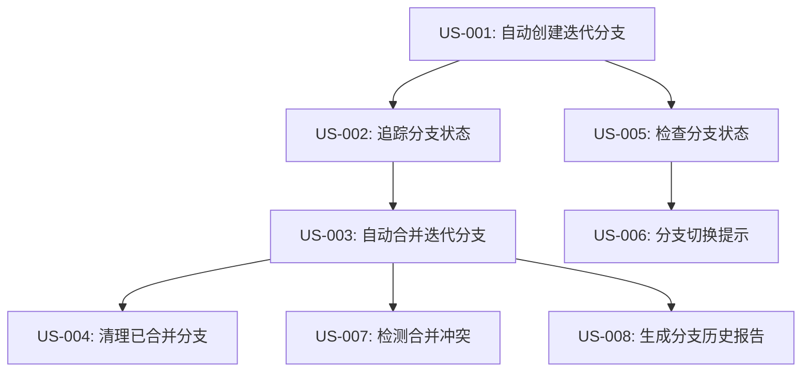

# Specification: Git分支自动化管理

**迭代编号**: 008
**迭代名称**: git-branch-automation
**文档版本**: v1.0.0
**创建日期**: 2026-03-06
**生命周期阶段**: DRAFTING
**状态**: Draft

---

## 目录

1. [概述](#1-概述)
2. [用户故事](#2-用户故事)
3. [验收标准](#3-验收标准)
4. [数据字典](#4-数据字典)
5. [状态定义](#5-状态定义)
6. [追溯矩阵](#6-追溯矩阵)

---

## 1. 概述

### 1.1 产品目标

自动化Git分支管理，让开发者专注于功能实现，而不是手动管理分支，确保每个迭代在独立的feature分支上开发，遵循Git最佳实践。

### 1.2 目标用户

- **主要用户**: 使用PowerBy Skills的开发者（个人或小团队）
- **使用场景**: 在项目中使用GitFlow工作流程进行迭代开发
- **核心痛点**: 迭代开始后没有正确开启Git分支，都在main分支上开发，导致代码管理混乱

### 1.3 核心价值

- **自动化**: 减少手动分支管理的工作量
- **规范化**: 确保所有迭代遵循GitFlow最佳实践
- **可追溯**: 完整记录分支创建、合并、删除的历史

---

## 2. 用户故事

### 2.1 核心功能（P0）

#### US-001 → REQ-001: 自动创建迭代分支

**As a** 开发者
**I want** 在创建新迭代时自动创建对应的feature分支
**So that** 我不需要手动创建分支，可以立即开始在正确的分支上工作

**业务规则**:
- 分支命名格式：`feature/{迭代编号}-{迭代名称}`
- 分支从develop分支创建
- 分支创建后自动切换到该分支
- 分支信息记录到`.powerby/iterations.json`

**依赖**:
- 项目必须是Git仓库
- 必须存在develop分支
- 用户必须有分支创建权限

---

#### US-002 → REQ-002: 追踪分支状态

**As a** 开发者
**I want** 系统自动追踪每个迭代的分支状态
**So that** 我可以随时了解分支的生命周期状态（活跃/已合并/已删除）

**业务规则**:
- 分支状态包括：`active`（活跃）、`merged`（已合并）、`deleted`（已删除）
- 状态变更时自动更新`.powerby/iterations.json`
- 记录分支创建时间和合并时间

**依赖**:
- US-001已实现

---

#### US-003 → REQ-003: 自动合并迭代分支

**As a** 开发者
**I want** 在迭代完成（P8阶段）时系统提示我合并分支
**So that** 我可以将feature分支的代码合并到develop分支，完成迭代交付

**业务规则**:
- 合并目标为develop分支
- 使用`git merge --no-ff`保留提交历史
- 合并成功后更新分支状态为`merged`
- 合并失败时提供清晰的错误信息和解决建议

**依赖**:
- US-001已实现
- US-002已实现
- P8阶段已完成

---

#### US-004 → REQ-004: 清理已合并分支

**As a** 开发者
**I want** 在分支合并后选择是否删除feature分支
**So that** 我可以保持仓库整洁，避免分支堆积

**业务规则**:
- 合并完成后询问用户是否删除feature分支
- 用户确认后删除本地和远程分支（如果远程分支存在）
- 删除成功后更新分支状态为`deleted`
- 用户选择保留时状态保持为`merged`
- 远程分支删除失败时，本地分支仍删除，状态更新为`deleted_local_only`

**依赖**:
- US-003已实现

---

#### US-005 → REQ-005: 检查分支状态

**As a** 开发者
**I want** 系统在关键节点自动检查Git分支状态
**So that** 我可以确保在正确的分支上工作，避免代码提交到错误的分支

**业务规则**:
- P1开始时检查是否在正确的feature分支上
- P6开始时检查是否有未提交的更改
- P8开始时检查是否与远程分支同步（如果远程分支存在）
- 远程分支不存在时跳过同步检查，仅提示用户可选择推送
- 检查失败时提供清晰的提示和修复建议
- 检查通过后才允许继续执行后续流程

**依赖**:
- US-001已实现

---

### 2.2 增强功能（P1）

#### US-006 → REQ-006: 分支切换提示

**As a** 开发者
**I want** 当我在错误的分支上工作时收到警告提示
**So that** 我可以及时切换到正确的分支，避免代码提交错误

**业务规则**:
- 检测到用户在错误的分支上工作时显示警告
- 提示包括：当前分支、应该在的分支、切换命令
- 提供一键切换功能（用户确认后自动执行）

**依赖**:
- US-005已实现

---

#### US-007 → REQ-007: 检测合并冲突

**As a** 开发者
**I want** 在合并前系统自动检测是否存在冲突
**So that** 我可以提前解决冲突，避免合并失败

**业务规则**:
- 合并前执行`git merge --no-commit --no-ff`检测冲突
- 存在冲突时列出冲突文件清单，并执行`git merge --abort`清理现场
- 提供冲突解决指南
- 用户手动解决冲突后，可重新触发合并流程
- 无冲突时执行`git merge --abort`回滚预检测，然后执行正式合并

**依赖**:
- US-003已实现

---

#### US-008 → REQ-008: 生成分支历史报告

**As a** 开发者
**I want** 在迭代完成时自动生成分支历史报告
**So that** 我可以回顾整个迭代的提交历史和分支演进过程

**业务规则**:
- 迭代完成时生成分支历史报告（Markdown格式）
- 报告包含：提交历史、分支图（Mermaid）、合并记录
- 报告保存到`docs/iterations/{id}-{name}/branch-history.md`

**依赖**:
- US-003已实现

---

## 3. 验收标准

### 3.1 US-001: 自动创建迭代分支

**Given** 用户执行`/powerby-asp`或`/powerby.define`创建新迭代
**When** 迭代编号为008，迭代名称为git-branch-automation
**Then** 系统自动创建`feature/008-git-branch-automation`分支

**Given** feature分支创建成功
**When** 分支创建完成
**Then** 系统自动切换到该分支

**Given** feature分支创建成功
**When** 分支创建完成
**Then** `.powerby/iterations.json`中记录分支信息

**Given** develop分支不存在
**When** 尝试创建feature分支
**Then** 系统提示错误：develop分支不存在，请先创建develop分支

**Given** 用户没有分支创建权限
**When** 尝试创建feature分支
**Then** 系统提示错误：权限不足，无法创建分支

---

### 3.2 US-002: 追踪分支状态

**Given** feature分支已创建
**When** 查看`.powerby/iterations.json`
**Then** 包含`branch_info`字段，状态为`active`

**Given** feature分支已合并
**When** 合并完成
**Then** `.powerby/iterations.json`中分支状态更新为`merged`

**Given** feature分支已删除
**When** 删除完成
**Then** `.powerby/iterations.json`中分支状态更新为`deleted`

**Given** 分支状态发生变更
**When** 状态从`active`变为`merged`
**Then** 记录合并时间到`merged_at`字段

---

### 3.3 US-003: 自动合并迭代分支

**Given** P8阶段已完成
**When** 用户确认合并分支
**Then** 系统执行`git merge --no-ff feature/008-git-branch-automation`

**Given** 合并成功
**When** 合并完成
**Then** 分支状态更新为`merged`

**Given** 合并失败（存在冲突）
**When** 合并执行失败
**Then** 系统提示冲突文件清单和解决建议

**Given** 合并失败（网络错误）
**When** 合并执行失败
**Then** 系统提示网络错误，建议检查网络连接后重试

---

### 3.4 US-004: 清理已合并分支

**Given** 分支已合并
**When** 系统询问是否删除分支
**Then** 用户可以选择：删除 / 保留

**Given** 用户选择删除分支且远程分支存在
**When** 删除操作执行
**Then** 本地分支和远程分支都被删除

**Given** 本地和远程分支都删除成功
**When** 删除完成
**Then** 分支状态更新为`deleted`

**Given** 本地分支删除成功但远程分支删除失败
**When** 删除操作部分完成
**Then** 分支状态更新为`deleted_local_only`，并提示用户手动删除远程分支

**Given** 用户选择删除分支但远程分支不存在
**When** 删除操作执行
**Then** 仅删除本地分支，分支状态更新为`deleted`

**Given** 用户选择保留分支
**When** 用户确认保留
**Then** 分支状态保持为`merged`

---

### 3.5 US-005: 检查分支状态

**Given** P1阶段开始
**When** 系统检查当前分支
**Then** 如果不在feature分支上，提示用户切换分支

**Given** P6阶段开始
**When** 系统检查工作区状态
**Then** 如果有未提交的更改，提示用户先提交或暂存

**Given** P8阶段开始且远程分支存在
**When** 系统检查远程同步状态
**Then** 如果本地分支落后于远程，提示用户先拉取最新代码

**Given** P8阶段开始但远程分支不存在
**When** 系统检查远程同步状态
**Then** 跳过同步检查，提示用户可选择推送到远程仓库

**Given** 分支状态检查失败
**When** 检查未通过
**Then** 阻止后续流程执行，直到问题解决

---

### 3.6 US-006: 分支切换提示

**Given** 用户在main分支上工作
**When** 系统检测到当前分支不是feature分支
**Then** 显示警告：当前在main分支，应该在feature/008-git-branch-automation分支

**Given** 系统显示分支切换提示
**When** 用户确认切换
**Then** 系统自动执行`git checkout feature/008-git-branch-automation`

**Given** 切换分支前有未提交的更改
**When** 尝试切换分支
**Then** 提示用户先提交或暂存更改

---

### 3.7 US-007: 检测合并冲突

**Given** 准备合并feature分支到develop
**When** 执行冲突检测
**Then** 系统执行`git merge --no-commit --no-ff`进行预检测

**Given** 检测到合并冲突
**When** 冲突检测完成
**Then** 系统执行`git merge --abort`清理现场，并列出冲突文件清单：`src/file1.js`, `src/file2.js`

**Given** 检测到合并冲突
**When** 显示冲突信息
**Then** 提供冲突解决指南：如何手动解决冲突、如何重新触发合并流程

**Given** 预检测无冲突
**When** 检测完成
**Then** 系统执行`git merge --abort`回滚预检测，然后执行正式合并`git merge --no-ff`

**Given** 用户手动解决冲突后
**When** 用户重新触发合并流程
**Then** 系统重新执行冲突检测和合并流程

---

### 3.8 US-008: 生成分支历史报告

**Given** 迭代完成（P8阶段）
**When** 分支合并成功
**Then** 系统自动生成`docs/iterations/008-git-branch-automation/branch-history.md`

**Given** 分支历史报告生成
**When** 查看报告内容
**Then** 包含提交历史列表（提交哈希、作者、时间、消息）

**Given** 分支历史报告生成
**When** 查看报告内容
**Then** 包含分支图（Mermaid格式），展示分支创建、提交、合并的可视化流程

**Given** 分支历史报告生成
**When** 查看报告内容
**Then** 包含合并记录（合并时间、合并者、合并提交哈希）

---

## 4. 数据字典

### 4.1 核心实体

#### BranchInfo（分支信息）

| 字段名 | 类型 | 必填 | 描述 | 示例值 |
|--------|------|------|------|--------|
| name | String | 是 | 分支名称 | `feature/008-git-branch-automation` |
| status | Enum | 是 | 分支状态 | `active` / `merged` / `deleted` |
| created_at | DateTime | 是 | 创建时间 | `2026-03-06T10:00:00Z` |
| merged_at | DateTime | 否 | 合并时间 | `2026-03-10T15:30:00Z` |
| deleted_at | DateTime | 否 | 删除时间 | `2026-03-10T15:35:00Z` |
| source_branch | String | 是 | 源分支 | `develop` |
| target_branch | String | 是 | 目标分支 | `develop` |

#### IterationMetadata（迭代元数据）

| 字段名 | 类型 | 必填 | 描述 | 示例值 |
|--------|------|------|------|--------|
| id | String | 是 | 迭代编号 | `008` |
| name | String | 是 | 迭代名称 | `git-branch-automation` |
| full_name | String | 是 | 完整名称 | `008-git-branch-automation` |
| description | String | 是 | 迭代描述 | `Git分支自动化管理` |
| status | Enum | 是 | 迭代状态 | `in_progress` / `completed` |
| phase | String | 是 | 当前阶段 | `P1` / `P6` / `P8` |
| branch_info | BranchInfo | 是 | 分支信息 | 见上表 |
| created_at | DateTime | 是 | 创建时间 | `2026-03-06T10:00:00Z` |

#### BranchHistoryReport（分支历史报告）

| 字段名 | 类型 | 必填 | 描述 | 示例值 |
|--------|------|------|------|--------|
| iteration_id | String | 是 | 迭代编号 | `008` |
| branch_name | String | 是 | 分支名称 | `feature/008-git-branch-automation` |
| commits | Array<CommitRecord> | 是 | 提交记录列表 | 见下表 |
| merge_record | MergeRecord | 否 | 合并记录 | 见下表 |
| generated_at | DateTime | 是 | 报告生成时间 | `2026-03-10T16:00:00Z` |

#### CommitRecord（提交记录）

| 字段名 | 类型 | 必填 | 描述 | 示例值 |
|--------|------|------|------|--------|
| hash | String | 是 | 提交哈希 | `a1b2c3d` |
| author | String | 是 | 提交作者 | `张三` |
| email | String | 是 | 作者邮箱 | `zhangsan@example.com` |
| timestamp | DateTime | 是 | 提交时间 | `2026-03-07T14:30:00Z` |
| message | String | 是 | 提交消息 | `feat: 实现分支自动创建` |

#### MergeRecord（合并记录）

| 字段名 | 类型 | 必填 | 描述 | 示例值 |
|--------|------|------|------|--------|
| merge_commit_hash | String | 是 | 合并提交哈希 | `e4f5g6h` |
| merger | String | 是 | 合并者 | `李四` |
| merger_email | String | 是 | 合并者邮箱 | `lisi@example.com` |
| merged_at | DateTime | 是 | 合并时间 | `2026-03-10T15:30:00Z` |
| source_branch | String | 是 | 源分支 | `feature/008-git-branch-automation` |
| target_branch | String | 是 | 目标分支 | `develop` |

---

### 4.2 枚举类型

#### BranchStatus（分支状态）

| 值 | 描述 | 说明 |
|----|------|------|
| active | 活跃 | 分支已创建，正在开发中 |
| merged | 已合并 | 分支已合并到目标分支 |
| deleted | 已删除 | 分支已删除（本地和远程，或仅本地且远程不存在） |
| deleted_local_only | 仅本地删除 | 本地分支已删除，但远程分支删除失败 |

#### IterationPhase（迭代阶段）

| 值 | 描述 | 说明 |
|----|------|------|
| P0 | 项目初始化 | 创建项目宪章 |
| P1 | 需求定义 | 定义产品需求 |
| P3 | 技术调研 | 评估技术方案 |
| P4 | 架构设计 | 设计系统架构 |
| P5 | 开发规划 | 制定开发计划 |
| P6 | 开发实现 | 编写代码和测试 |
| P7 | 代码审查 | 审查代码质量 |
| P8 | 项目交付 | 交付和归档 |

---

## 5. 状态定义

### 5.1 分支创建流程状态

#### Empty State（空状态）
- **触发条件**: 迭代刚创建，尚未创建分支
- **UI表现**: 显示"分支未创建"提示
- **用户操作**: 等待系统自动创建分支

#### Loading State（加载状态）
- **触发条件**: 正在创建分支
- **UI表现**: 显示"正在创建分支..."加载动画
- **用户操作**: 等待创建完成

#### Success State（成功状态）
- **触发条件**: 分支创建成功
- **UI表现**: 显示"分支创建成功：feature/008-git-branch-automation"
- **用户操作**: 可以开始在该分支上工作

#### Error State（错误状态）
- **触发条件**: 分支创建失败
- **UI表现**: 显示错误信息和解决建议
- **用户操作**: 根据提示解决问题后重试

**错误类型**:
- `DEVELOP_NOT_FOUND`: develop分支不存在
- `PERMISSION_DENIED`: 权限不足
- `BRANCH_EXISTS`: 分支已存在
- `NETWORK_ERROR`: 网络错误

---

### 5.2 分支合并流程状态

#### Empty State（空状态）
- **触发条件**: 迭代未完成，尚未开始合并
- **UI表现**: 显示"迭代进行中，尚未到合并阶段"
- **用户操作**: 继续完成迭代开发

#### Loading State（加载状态）
- **触发条件**: 正在合并分支
- **UI表现**: 显示"正在合并分支到develop..."加载动画
- **用户操作**: 等待合并完成

#### Success State（成功状态）
- **触发条件**: 分支合并成功
- **UI表现**: 显示"分支合并成功，是否删除feature分支？"
- **用户操作**: 选择删除或保留分支

#### Error State（错误状态）
- **触发条件**: 分支合并失败
- **UI表现**: 显示错误信息和解决建议
- **用户操作**: 根据提示解决问题后重试

**错误类型**:
- `MERGE_CONFLICT`: 存在合并冲突
- `NOT_SYNCED`: 本地分支未与远程同步（仅当远程分支存在时）
- `PERMISSION_DENIED`: 权限不足
- `NETWORK_ERROR`: 网络错误
- `REMOTE_DELETE_FAILED`: 远程分支删除失败（US-004部分失败场景）

---

### 5.3 分支状态检查流程状态

#### Empty State（空状态）
- **触发条件**: 尚未开始检查
- **UI表现**: 无显示
- **用户操作**: 等待系统自动检查

#### Loading State（加载状态）
- **触发条件**: 正在检查分支状态
- **UI表现**: 显示"正在检查分支状态..."
- **用户操作**: 等待检查完成

#### Success State（成功状态）
- **触发条件**: 分支状态检查通过
- **UI表现**: 显示"分支状态检查通过"
- **用户操作**: 继续执行后续流程

#### Error State（错误状态）
- **触发条件**: 分支状态检查失败
- **UI表现**: 显示错误信息和修复建议
- **用户操作**: 根据提示修复问题

**错误类型**:
- `WRONG_BRANCH`: 当前不在正确的分支上
- `UNCOMMITTED_CHANGES`: 存在未提交的更改
- `NOT_SYNCED`: 本地分支未与远程同步（仅当远程分支存在时）
- `REMOTE_NOT_FOUND`: 远程分支不存在（信息提示，非错误）

---

## 6. 追溯矩阵

### 6.1 需求覆盖追溯

| Proposal REQ | Spec US | 覆盖状态 | 备注 |
|-------------|---------|---------|------|
| REQ-001 | US-001 | ✅ 已覆盖 | 迭代创建时自动创建Git分支 |
| REQ-002 | US-002 | ✅ 已覆盖 | 迭代状态追踪增强 |
| REQ-003 | US-003 | ✅ 已覆盖 | 迭代完成时自动合并分支 |
| REQ-004 | US-004 | ✅ 已覆盖 | 分支清理机制 |
| REQ-005 | US-005 | ✅ 已覆盖 | 分支状态检查 |
| REQ-006 | US-006 | ✅ 已覆盖 | 分支切换提示 |
| REQ-007 | US-007 | ✅ 已覆盖 | 分支冲突检测 |
| REQ-008 | US-008 | ✅ 已覆盖 | 分支历史可视化 |
| REQ-009 | - | ⏸️ 推迟 | 多迭代并行开发支持（P2可选功能） |
| REQ-010 | - | ⏸️ 推迟 | 自动推送到远程仓库（P2可选功能） |
| REQ-011 | - | ⏸️ 推迟 | 分支保护规则集成（P2可选功能） |

### 6.2 用户故事依赖关系

### 6.3 功能优先级分布

| 优先级 | 用户故事数量 | 占比 |
|--------|-------------|------|
| P0（必须） | 5个 | 62.5% |
| P1（应该） | 3个 | 37.5% |
| P2（可选） | 0个 | 0% (已推迟) |
| **总计** | **8个** | **100%** |

---

## 附录

### A. 技术约束

1. **Git版本要求**: Git 2.23+（支持`git switch`命令）
2. **分支命名规范**: 必须遵循`feature/{id}-{name}`格式
3. **合并策略**: 必须使用`--no-ff`保留提交历史
4. **权限要求**: 用户必须有分支创建、合并、删除权限

### B. 兼容性说明

1. **与powerby-github-branch技能兼容**: 扩展现有技能，不破坏原有功能
2. **与P0-P8生命周期流程集成**: 在关键节点（P1/P6/P8）触发分支操作
3. **与迭代追踪机制兼容**: 扩展`.powerby/iterations.json`，不破坏现有字段
4. **远程仓库可选性**: 所有远程分支操作（删除、同步检查）均为可选，当远程分支不存在时自动降级为本地操作，不阻塞核心流程

### C. 排除项说明

以下功能明确排除在本次需求范围外：

1. **自动解决合并冲突**: 合并冲突需要人工判断
2. **支持其他Git工作流**: 当前仅支持GitFlow
3. **Git Hooks自动安装**: 属于powerby-git技能职责
4. **分支权限管理**: 属于Git平台层面功能

---

**文档结束**
