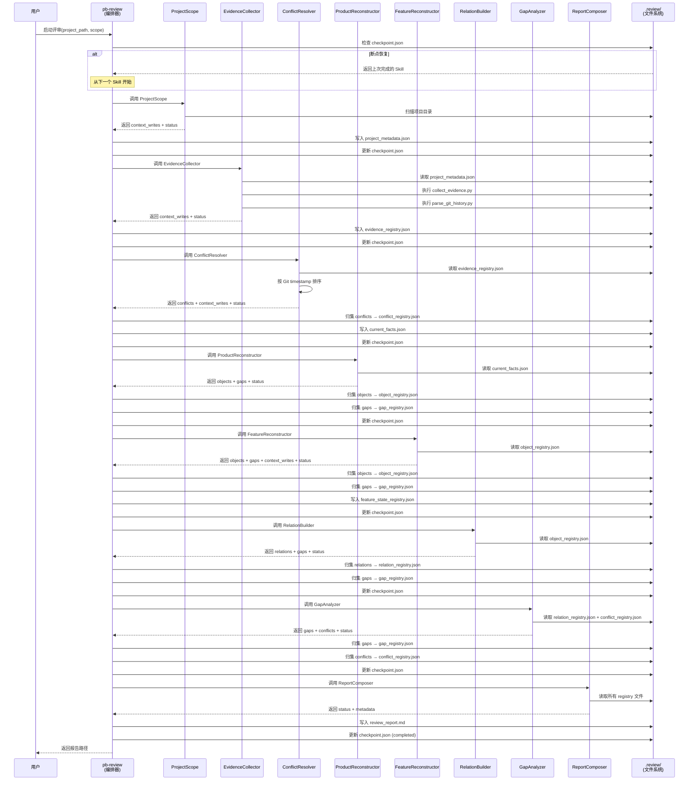
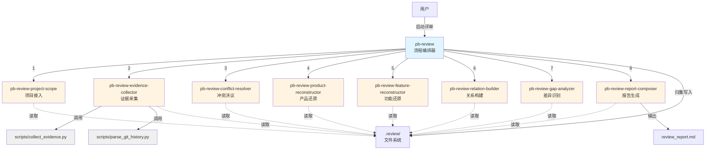
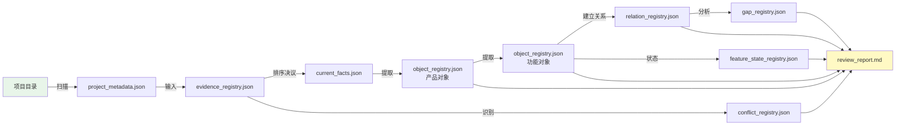

# Architecture: 还原式项目评审框架（Review Framework）

## 1. 系统架构概览

本架构定义了一套基于 Claude Skill 协议的模块化评审框架，通过 8 个独立 Skill 的顺序编排，实现从项目资料接入到评审报告输出的完整链路。

### 1.1 核心设计原则

- **事实优先**：所有还原基于已有证据，不做推断
- **证据驱动**：每个对象都有可追溯的证据来源
- **冲突保留**：显式记录差异，不自动和解
- **断点恢复**：支持流程中断后从断点继续执行
- **增量处理**：支持大型项目的增量证据采集

### 1.2 技术栈

- **Skill 协议**：Claude Skill Protocol（YAML frontmatter + Markdown）
- **数据持久化**：JSON 文件协议
- **证据采集**：Bash 工具 + Python 脚本
- **流程编排**：pb-review 工作流 Skill
- **输出格式**：Markdown 报告

---

## 2. 现有架构继承

**复用策略**：本框架完全独立实现，不依赖现有 powerby-asp 系列 Skill。

**命名空间隔离**：
- 现有：`powerby-asp-*`（产品流程）
- 新增：`pb-review-*`（评审流程）

**原因**：
- 评审框架的数据模型（Evidence Unit、Object Record）与产品流程不兼容
- 评审流程需要独立的状态管理和断点恢复机制
- 避免与现有 ASP 流程产生耦合和冲突

---

## 3. 组件划分

### 3.1 组件总览

| 组件 ID | 组件名称 | 职责 | 复用策略 |
|---------|---------|------|---------|
| C-001 | pb-review（流程编排器） | 编排 8 个 Skill 的顺序执行，管理 Review Context | 🆕 全新开发 |
| C-002 | pb-review-project-scope | 项目接入与范围定义 | 🆕 全新开发 |
| C-003 | pb-review-evidence-collector | 证据采集与标准化 | 🆕 全新开发 |
| C-004 | pb-review-conflict-resolver | 证据优先级与冲突决议 | 🆕 全新开发 |
| C-005 | pb-review-product-reconstructor | 产品事实还原 | 🆕 全新开发 |
| C-006 | pb-review-feature-reconstructor | 功能事实还原 | 🆕 全新开发 |
| C-007 | pb-review-relation-builder | 关系构建 | 🆕 全新开发 |
| C-008 | pb-review-gap-analyzer | 差异与缺口识别 | 🆕 全新开发 |
| C-009 | pb-review-report-composer | 报告编排与导出 | 🆕 全新开发 |
| C-010 | scripts/collect_evidence.py | 证据采集脚本 | 🆕 全新开发 |
| C-011 | scripts/parse_git_history.py | Git 历史解析脚本 | 🆕 全新开发 |

### 3.2 C-001: pb-review（流程编排器）

**职责**：
- 接收用户输入（项目路径、评审范围）
- 初始化 Review Context
- 按顺序调用 8 个 Skill
- 检查每个 Skill 的执行状态（success/partial/failed）
- 支持断点恢复（检查 `.review/` 目录下的已完成标记）
- 汇总最终评审结果

**输入**：
```yaml
parameters:
  project_path: string          # 项目路径
  scope: enum                   # full_project/single_service/single_feature
  resume: boolean               # 是否从断点恢复（默认 false）
```

**输出**（遵循统一协议 5.1）：
```yaml
status: enum                    # success/partial/failed
objects: []                     # 编排器不产出 Object Record
relations: []
conflicts: []
gaps: []
context_writes: {}
metadata:
  total_duration_ms: number
  completed_skills: array       # 已完成的 Skill 列表
  failed_skills: array          # 失败的 Skill 列表
  report_path: string           # 生成的报告路径
errors: array
```

**依赖关系**：依赖所有 8 个 pb-review-* Skill

**断点恢复机制**：
- 检查 `.review/checkpoint.json` 文件
- 记录格式：
  ```json
  {
    "review_id": "review-20260327-001",
    "last_completed_skill": "pb-review-conflict-resolver",
    "timestamp": "2026-03-27T10:05:00Z",
    "completed_writes": [
      "project_metadata.json",
      "evidence_registry.json",
      "conflict_registry.json",
      "current_facts.json"
    ]
  }
  ```
- **写入顺序**：Skill 先写 registry 文件，确认成功后再更新 checkpoint.json
- **恢复时校验**：比对 checkpoint.json 中 `completed_writes` 列表与实际 `.review/` 目录中的文件，如有不一致则重新执行该 Skill
- **幂等性保证**：所有 registry 写入操作基于唯一 ID 去重，重复执行不会产生重复数据
- 从下一个 Skill 开始执行

---

### 3.3 C-002: pb-review-project-scope

**职责**：
- 扫描项目目录结构
- 识别文档、代码、测试、配置文件
- 生成资料清单（resource_inventory）
- 标记缺失的资源类型

**输入**：
```yaml
context: ReviewContext
parameters:
  project_path: string
  scope: enum
  include_patterns: array       # 默认 ["**/*.md", "**/*.py", "**/*.js", ...]
  exclude_patterns: array       # 默认 ["node_modules/**", ".git/**", ...]
```

**输出**（遵循统一协议）：
```yaml
status: enum
objects: []
relations: []
conflicts: []
gaps: []
context_writes:
  project_metadata:
    project_name: string
    project_type: string
    scope: string
    file_count: number
    resource_inventory:
      docs: array               # 文档文件路径列表
      code: array               # 代码文件路径列表
      tests: array              # 测试文件路径列表
      configs: array            # 配置文件路径列表
    missing_resources: array    # 缺失的资源类型
metadata:
  scan_duration_ms: number
errors: array
```

**证据策略**：
```yaml
evidence_policy:
  required_sources: []            # 入口 Skill，不依赖证据
  min_confidence: explicit
  allow_inference: false
```

**依赖关系**：无（入口 Skill）

**持久化**：编排器将 `context_writes.project_metadata` 写入 `.review/project_metadata.json`

---

### 3.4 C-003: pb-review-evidence-collector

**职责**：
- 采集文档内容（Markdown、README、PRD）
- 采集代码片段（函数定义、类定义、API 路由）
- 采集 Git 历史（commit message、author、timestamp）
- 标准化为 Evidence Unit 格式
- 支持增量采集（基于文件 hash 缓存）

**输入**：
```yaml
context: ReviewContext          # 从 context.project_metadata.resource_inventory 读取资料清单
parameters:
  collection_depth: enum        # shallow/deep
  incremental: boolean          # 是否增量采集（默认 true）
```

**输出**：
```yaml
status: enum
objects: []
relations: []
conflicts: []
gaps: []
context_writes:
  evidence_registry: array      # [Evidence Unit, ...]
metadata:
  total_evidence_count: number
  by_source_type:
    doc: number
    code: number
    test: number
    config: number
    commit: number
    issue: number
  cache_hit_rate: number        # 增量采集缓存命中率
errors: array
```

**证据策略**：
```yaml
evidence_policy:
  required_sources: [doc, code]   # 至少需要文档或代码中的一类
  min_confidence: explicit
  allow_inference: false           # 证据采集不做推断
```

**依赖关系**：依赖 pb-review-project-scope 的 project_metadata

**技术实现**：
- 调用 `scripts/collect_evidence.py` 进行批量采集
- 调用 `scripts/parse_git_history.py` 解析 Git 历史
- 使用 Bash 工具执行 `find`、`grep` 快速扫描

**持久化**：编排器将 `context_writes.evidence_registry` 写入 `.review/evidence_registry.json`

> **Spec 偏差说明**：spec Section 5.2 将 `resource_inventory` 声明为 EvidenceCollector 的直接参数。本架构按统一协议 rule 4（下游从 ReviewContext 读取上游数据）修正为从 `context.project_metadata.resource_inventory` 读取。spec 需同步更新。

**增量采集机制**：
- 计算文件 SHA256 hash
- 与 `.review/evidence_cache.json` 中的 hash 对比
- 仅处理变更文件
- `evidence_cache.json` 由 EvidenceCollector 自行管理（非 ReviewContext 标准字段），不经过编排器归集

---

### 3.5 C-004: pb-review-conflict-resolver

**职责**：
- 对证据按 Git commit 时间戳排序
- 识别同一对象的多版本证据（如同一 PRD 的不同版本）
- 应用优先级规则（代码 > 文档，新文档 > 旧文档）
- 生成 Conflict Record
- 输出当前有效事实集（current_facts）

**输入**：
```yaml
context: ReviewContext
```

**输出**：
```yaml
status: enum
objects: []
relations: []
conflicts: array                # Conflict Record 列表
gaps: []
context_writes:
  current_facts:
    product_facts: array        # 当前有效的产品事实证据 ID 列表
    implementation_facts: array # 当前有效的实现事实证据 ID 列表
metadata:
  priority_rules_applied: array
  unresolved_conflicts: number
errors: array
```

**证据策略**：
```yaml
evidence_policy:
  required_sources: [doc, code]   # 至少需要文档和代码证据才能识别冲突
  min_confidence: explicit
  allow_inference: false           # 冲突决议基于显式证据，不做推断
```

**依赖关系**：依赖 pb-review-evidence-collector 的 evidence_registry

**冲突决议算法**：
1. 按 Git commit timestamp 排序（最新优先）
2. 同一文件的多个版本，保留最新版本
3. 文档与代码冲突时，代码优先
4. 时间相同时，按 commit hash 字典序排序

**持久化**：编排器将 `conflicts` 归集到 `.review/conflict_registry.json`，将 `context_writes.current_facts` 写入 `.review/current_facts.json`

---

### 3.6 C-005: pb-review-product-reconstructor

**职责**：
- 从产品文档提取 Goal、Role、Scenario、Constraint、Non-goal
- 每个对象标注证据来源和置信度
- 无证据时记录 gap，不生成对象

**输入**：
```yaml
context: ReviewContext
```

**输出**：
```yaml
status: enum
objects: array                  # Object Record 列表（type: goal/role/scenario/constraint/non_goal）
relations: []
conflicts: []
gaps: array                     # 无产品文档时记录缺口
context_writes: {}
metadata:
  total_goals: number
  total_roles: number
  total_scenarios: number
errors: array
```

**证据策略**：
```yaml
evidence_policy:
  required_sources: [doc]         # 产品还原以文档为主要来源
  min_confidence: explicit
  allow_inference: true            # 无 PRD 时允许从 README/commit 保守推断
```

**依赖关系**：依赖 pb-review-conflict-resolver 的 current_facts

**持久化**：编排器将 `objects` 归集到 `.review/object_registry.json`（追加去重），将 `gaps` 归集到 `.review/gap_registry.json`（追加去重）

---

### 3.7 C-006: pb-review-feature-reconstructor

**职责**：
- 从文档、API、代码、测试提取 Feature、Rule、Boundary
- 标注功能状态（doc_defined/implemented/partial/residual）
- 生成 Feature State 记录

**输入**：
```yaml
context: ReviewContext
```

**输出**：
```yaml
status: enum
objects: array                  # Object Record 列表（type: feature/rule/boundary）
relations: []
conflicts: []
gaps: array
context_writes:
  feature_state_registry: array # Feature State 列表
metadata:
  total_features: number
  code_only_features: number
  doc_only_features: number
errors: array
```

**证据策略**：
```yaml
evidence_policy:
  required_sources: [doc, code]   # 功能还原需要文档和/或代码
  min_confidence: explicit
  allow_inference: true            # 允许从代码推断功能（标注 code_only）
```

**依赖关系**：依赖 pb-review-product-reconstructor 的产品对象

**持久化**：编排器将 `objects` 归集到 `.review/object_registry.json`（追加去重），将 `context_writes.feature_state_registry` 写入 `.review/feature_state_registry.json`，将 `gaps` 归集到 `.review/gap_registry.json`（追加去重）

---

### 3.8 C-007: pb-review-relation-builder

**职责**：
- 建立 Goal → Feature（supports）关系
- 建立 Rule → Feature（constrains）关系
- 识别孤立对象
- 生成追踪矩阵

**输入**：
```yaml
context: ReviewContext
```

**输出**：
```yaml
status: enum
objects: []
relations: array                # Relationship Record 列表
conflicts: []
gaps: array                     # 孤立对象记录为 gap
context_writes: {}
metadata:
  traceability_matrix:
    goals_with_features: array
    goals_without_features: array
    features_with_goals: array
    features_without_goals: array
  coverage_stats:
    goal_coverage_rate: number
    feature_traceability_rate: number
errors: array
```

**证据策略**：
```yaml
evidence_policy:
  required_sources: [doc]         # 关系构建需要文档证据支撑
  min_confidence: explicit
  allow_inference: true            # 允许推断关系（标注 confidence: inferred）
```

**依赖关系**：依赖 pb-review-feature-reconstructor 的功能对象

**持久化**：编排器将 `relations` 归集到 `.review/relation_registry.json`，将 `gaps` 归集到 `.review/gap_registry.json`（追加去重）

---

### 3.9 C-008: pb-review-gap-analyzer

**职责**：
- 识别需求-实现差异（文档有代码无、代码有文档无）
- 识别对象缺失（Goal 无 Feature 支撑）
- 识别链路断点
- 输出 Difference List、Gap List、Conflict List

**输入**：
```yaml
context: ReviewContext
```

**输出**：
```yaml
status: enum
objects: []
relations: []
conflicts: array                # 需求-实现冲突
gaps: array                     # Gap Record 列表
context_writes: {}
metadata:
  difference_list: array
  summary:
    total_gaps: number
    critical_gaps: number
errors: array
```

**证据策略**：
```yaml
evidence_policy:
  required_sources: [doc, code]   # 差异识别需要对比文档和代码
  min_confidence: explicit
  allow_inference: false           # 差异必须基于显式证据，不做推断
```

**依赖关系**：依赖 pb-review-relation-builder 的关系数据

**持久化**：编排器将 `gaps` 归集到 `.review/gap_registry.json`（追加去重），将 `conflicts` 归集到 `.review/conflict_registry.json`（追加去重）

---

### 3.10 C-009: pb-review-report-composer

**职责**：
- 读取所有 registry 文件
- 编排 Markdown 报告
- 生成追踪矩阵、差异清单、证据索引

**输入**：
```yaml
context: ReviewContext
```

**输出**：
```yaml
status: enum
objects: []
relations: []
conflicts: []
gaps: []
context_writes: {}
metadata:
  report_path: string
  report_sections: array
errors: array
```

**证据策略**：
```yaml
evidence_policy:
  required_sources: []            # 报告编排不直接处理证据
  min_confidence: explicit
  allow_inference: false
```

**依赖关系**：依赖所有上游 Skill

**持久化**：编排器将 `metadata.report_path` 指向的报告文件（`review_report.md`）视为最终输出，不归集到 registry

**报告结构**：
```markdown
# 项目还原评审报告
## 1. 项目概览
## 2. 产品层还原
## 3. 功能层还原
## 4. 追踪矩阵
## 5. 差异与缺口
## 6. 证据索引
```

**持久化**：输出写入 `review_report.md`

---

### 3.11 C-010: scripts/collect_evidence.py

**职责**：
- 批量读取文档文件
- 解析 Markdown 结构
- 提取代码函数/类定义
- 标准化为 Evidence Unit JSON

**输入参数**：
```bash
python scripts/collect_evidence.py \
  --project-path /path/to/project \
  --resource-inventory project_metadata.json \
  --output /tmp/evidence_raw.json
```

**输出**：JSON 文件（Evidence Unit 数组），写入临时路径。由 EvidenceCollector Skill 读取后通过 `context_writes.evidence_registry` 返回给编排器持久化，脚本不直接写入 `.review/` 目录。

---

### 3.12 C-011: scripts/parse_git_history.py

**职责**：
- 执行 `git log --all --format=...`
- 解析 commit message、author、timestamp
- 关联文件路径与 commit

**输入参数**：
```bash
python scripts/parse_git_history.py \
  --project-path /path/to/project \
  --output /tmp/git_history.json
```

**输出**：JSON 文件（Git commit 数组），写入临时路径。由 EvidenceCollector Skill 读取后合并到 `context_writes.evidence_registry`，脚本不直接写入 `.review/` 目录。

---

## 4. 数据流设计

### 4.1 整体数据流



### 4.2 文件协议定义

**目录结构**：
```
{project_path}/.review/
├── checkpoint.json              # 断点恢复标记
├── project_metadata.json        # 项目元数据
├── evidence_registry.json       # 证据注册表
├── evidence_cache.json          # 增量采集缓存
├── current_facts.json           # 当前有效事实集
├── object_registry.json         # 对象注册表
├── feature_state_registry.json  # 功能状态注册表
├── relation_registry.json       # 关系注册表
├── conflict_registry.json       # 冲突注册表
└── gap_registry.json            # 缺口注册表
```

**checkpoint.json 格式**：
```json
{
  "review_id": "review-20260327-001",
  "last_completed_skill": "pb-review-conflict-resolver",
  "timestamp": "2026-03-27T10:05:00Z",
  "completed_writes": [
    "project_metadata.json",
    "evidence_registry.json",
    "conflict_registry.json",
    "current_facts.json"
  ]
}
```

**registry 文件追加写入机制**（由编排器执行）：

多个 Skill 的输出会归集到同一 registry 文件（如 ProductReconstructor 和 FeatureReconstructor 的 objects 都归集到 `object_registry.json`，多个 Skill 的 gaps 都归集到 `gap_registry.json`）。编排器执行追加流程如下：

1. **读取**：读取当前 registry 文件的完整 JSON 数组
2. **去重**：按 `object_id`/`relation_id`/`conflict_id`/`gap_id` 等唯一标识去重，避免断点恢复时重复追加
3. **合并**：将新数据追加到数组中
4. **写入**：覆盖写入整个文件

去重规则确保断点恢复时的幂等性：即使同一 Skill 重新执行，也不会产生重复数据。

> **注意**：Skill 本身不直接写入 registry 文件。所有持久化操作由编排器在 Skill 返回结果后统一执行（详见 Section 5.4）。唯一例外是 `evidence_cache.json`，它是 EvidenceCollector 的内部缓存，由 Skill 自行管理。

**evidence_cache.json 格式**（增量采集）：
```json
{
  "docs/prd.md": {
    "hash": "sha256:abc123...",
    "last_modified": "2026-03-27T09:00:00Z",
    "evidence_ids": ["ev-001", "ev-002"]
  }
}
```

---

## 5. 接口/协议定义

### 5.1 统一 Skill 协议

所有 pb-review-* Skill 遵循以下接口规范：

**Skill 定义**：
```yaml
skill:
  name: string                    # Skill 名称
  version: string                 # 版本号
  description: string             # 功能描述
```

**输入**：
```yaml
context: ReviewContext          # 从 .review/ 目录读取（详见 5.3 ReviewContext 物理实现）
parameters: object              # Skill 特定参数
```

**证据策略（evidence_policy）**：
```yaml
evidence_policy:
  required_sources: array       # 必需的证据来源类型（doc/code/test/config/commit/issue）
  min_confidence: enum          # 最低置信度要求：explicit/inferred
  allow_inference: boolean      # 是否允许推断（true 时可生成 confidence: inferred 的对象）
```

每个 Skill 必须声明 evidence_policy，约束其证据处理行为：
- `required_sources`：声明 Skill 运行所需的最低证据类型集合，缺少时返回 partial
- `min_confidence`：低于此置信度的对象不输出，改为记录 gap
- `allow_inference`：false 时仅输出 explicit 对象，true 时可输出 inferred 对象

**输出**：
```yaml
status: enum                    # success/partial/failed
objects: array                  # Object Record 列表
relations: array                # Relationship Record 列表
conflicts: array                # Conflict Record 列表
gaps: array                     # Gap Record 列表
context_writes: object          # 写入 ReviewContext 的字段
metadata: object                # 执行元数据
errors: array                   # 错误列表
```

### 5.2 协议一致性规则

1. **所有 Skill 输出必须包含 `status` 和 `errors` 字段**，即使无错误也必须返回空数组
2. **标准归集规则**：Skill 输出的 objects/relations/conflicts/gaps 由编排器负责归集到对应的 registry 文件（详见 5.4 归集与持久化职责）
3. **context_writes 机制**：当 Skill 需要写入 ReviewContext 的非标准字段（如 `project_metadata`、`evidence_registry`、`current_facts`）时，通过 `context_writes` 字段声明，编排器负责持久化到对应 JSON 文件
4. **下游引用规则**：下游 Skill 必须从 ReviewContext 读取上游数据，不直接引用上游 Skill 的输出变量名

### 5.3 ReviewContext 物理实现

ReviewContext 是一个逻辑抽象，其物理实现为 `.review/` 目录下的 JSON 文件集合：

| ReviewContext 字段 | 物理文件 |
|-------------------|---------|
| project_metadata | `.review/project_metadata.json` |
| evidence_registry | `.review/evidence_registry.json` |
| current_facts | `.review/current_facts.json` |
| object_registry | `.review/object_registry.json` |
| feature_state_registry | `.review/feature_state_registry.json` |
| relation_registry | `.review/relation_registry.json` |
| conflict_registry | `.review/conflict_registry.json` |
| gap_registry | `.review/gap_registry.json` |

Skill 通过读取 `.review/` 目录下的对应文件获取 ReviewContext 数据。Skill 不直接写入这些文件——所有写入由编排器在 Skill 执行完成后统一处理（详见 5.4）。

### 5.4 归集与持久化职责

**核心原则**：Skill 只负责计算和返回结果，编排器负责所有持久化操作。

**编排器在每个 Skill 执行完成后的处理流程**：

1. **标准字段归集**：将 Skill 输出的 `objects`、`relations`、`conflicts`、`gaps` 分别追加到对应的 registry 文件（`object_registry.json`、`relation_registry.json`、`conflict_registry.json`、`gap_registry.json`）
2. **context_writes 持久化**：将 Skill 输出的 `context_writes` 中的字段写入对应的 JSON 文件
3. **去重保证**：追加时按唯一 ID（`object_id`/`relation_id`/`conflict_id`/`gap_id`）去重，确保断点恢复时的幂等性
4. **更新 checkpoint**：更新 `checkpoint.json` 的 `last_completed_skill` 和 `completed_writes`

**写入顺序**（保证原子性）：先写 registry 文件 → 确认成功 → 再更新 checkpoint.json

### 5.5 核心数据结构

**Evidence Unit**：
```json
{
  "evidence_id": "ev-001",
  "source_type": "doc",
  "source_path": "docs/prd.md",
  "timestamp": "2026-03-27T10:00:00Z",
  "author": "user@example.com",
  "content": "产品目标：...",
  "version_hint": "v2.0"
}
```

**Object Record**：
```json
{
  "object_id": "goal-001",
  "object_type": "goal",
  "name": "提升用户留存率",
  "description": "通过个性化推荐...",
  "evidence_refs": ["ev-001", "ev-002"],
  "confidence": "explicit",
  "metadata": {}
}
```

**Relationship Record**：
```json
{
  "relation_id": "rel-001",
  "relation_type": "supports",
  "source_id": "feature-001",
  "target_id": "goal-001",
  "evidence_refs": ["ev-003"],
  "confidence": "explicit"
}
```

**Conflict Record**：
```json
{
  "conflict_id": "conflict-001",
  "conflict_type": "doc_code",
  "evidence_a": "ev-001",
  "evidence_b": "ev-005",
  "description": "PRD 声明功能 X，但代码未实现",
  "resolution": "preserved",
  "priority_winner": "ev-005"
}
```

**Gap Record**：
```json
{
  "gap_id": "gap-001",
  "gap_type": "missing_relation",
  "description": "Goal-001 无对应 Feature 支撑",
  "severity": "major",
  "context": {"goal_id": "goal-001"}
}
```

---

## 6. 架构图

### 6.1 组件架构图



### 6.2 数据流图



---

## 7. 架构追溯矩阵

| 组件 ID | 组件名称 | 对应功能点 | 说明 |
|---------|---------|-----------|------|
| C-001 | pb-review | 跨功能点（cross-cutting） | 编排 8 个 Skill 的顺序执行、断点恢复、标准归集；不实现任何单一 FP，为所有 FP 提供执行基础设施 |
| - | Section 5.1 统一 Skill 协议 | FP-001 | 定义所有 Skill 遵循的统一接口规范 |
| C-002 | pb-review-project-scope | FP-008 | 实现项目接入与范围定义 |
| C-003 | pb-review-evidence-collector | FP-009 | 实现证据采集与标准化 |
| C-004 | pb-review-conflict-resolver | FP-003 | 实现证据优先级与冲突决议 |
| C-005 | pb-review-product-reconstructor | FP-004 | 实现产品事实还原 |
| C-006 | pb-review-feature-reconstructor | FP-005 | 实现功能事实还原 |
| C-007 | pb-review-relation-builder | FP-006 | 实现关系构建 |
| C-008 | pb-review-gap-analyzer | FP-007 | 实现差异与缺口识别 |
| C-009 | pb-review-report-composer | FP-010 | 实现报告编排与导出 |
| C-010 | scripts/collect_evidence.py | FP-009 | 支持证据采集的脚本实现 |
| C-011 | scripts/parse_git_history.py | FP-003, FP-009 | 支持 Git 历史解析 |
| - | .review/ 文件协议 | FP-002 | 实现证据驱动数据模型的持久化 |

**覆盖率统计**：
- V1 必须功能点（FP-001 至 FP-010）：10/10 ✅
- V2 应该功能点（FP-011 至 FP-013）：0/3（V2 阶段实现）

---

## 8. 关键技术决策

### 8.1 为什么选择文件协议而非数据库？

**决策**：使用 JSON 文件协议持久化数据

**理由**：
- **简单性**：无需额外依赖，JSON 文件人类可读
- **可调试性**：开发者可直接查看中间状态
- **版本控制友好**：可将 `.review/` 目录纳入 Git 跟踪
- **跨平台**：无需安装数据库软件

**权衡**：
- 大型项目（10 万+ 文件）可能面临性能瓶颈
- 缓解措施：增量采集 + 文件 hash 缓存

---

### 8.2 为什么不支持并行执行？

**决策**：Skill 顺序执行，不支持并行

**理由**：
- **数据依赖**：下游 Skill 依赖上游输出（如 FeatureReconstructor 依赖 ProductReconstructor）
- **简化调试**：顺序执行便于定位问题
- **断点恢复**：顺序执行的断点恢复逻辑更简单

**权衡**：
- 执行时间较长
- 缓解措施：增量采集减少重复工作

---

### 8.3 为什么使用 Git commit 时间戳判断优先级？

**决策**：基于 Git commit timestamp 判断文档新旧

**理由**：
- **准确性**：Git 时间戳是权威的版本历史记录
- **可追溯**：可通过 commit hash 回溯
- **自动化**：无需人工标注版本号

**权衡**：
- 依赖 Git 仓库（非 Git 项目无法使用）
- 缓解措施：对非 Git 项目回退到文件 mtime

---

## 9. 风险与缓解

| 风险 | 影响 | 概率 | 缓解措施 |
|------|------|------|---------|
| 大型项目性能瓶颈 | 高 | 中 | 增量采集 + 文件 hash 缓存 |
| 非 Git 项目无法判断优先级 | 中 | 低 | 回退到文件 mtime |
| 证据采集脚本失败 | 高 | 低 | 返回 partial 状态，记录错误日志 |
| 断点恢复状态不一致 | 中 | 低 | checkpoint.json 包含 review_id 校验 |
| Skill 执行超时 | 中 | 中 | 设置合理超时时间，支持重试 |

---

## 10. 实施建议

### 10.1 V1 实现优先级

**阶段 1（P0）**：
1. pb-review 流程编排器
2. pb-review-project-scope
3. pb-review-evidence-collector
4. scripts/collect_evidence.py
5. scripts/parse_git_history.py

**阶段 2（P1）**：
6. pb-review-conflict-resolver
7. pb-review-product-reconstructor
8. pb-review-feature-reconstructor

**阶段 3（P2）**：
9. pb-review-relation-builder
10. pb-review-gap-analyzer

**阶段 4（P3）**：
11. pb-review-report-composer

### 10.2 测试策略

- **单元测试**：每个 Skill 独立测试
- **集成测试**：完整流程端到端测试
- **性能测试**：使用 10 万行代码项目测试增量采集
- **断点恢复测试**：模拟中断场景

### 10.3 文档交付

- 每个 Skill 的 SKILL.md（遵循 Skill 最佳实践框架）
- scripts/ 目录下的 Python 脚本
- 用户使用手册（如何启动评审、如何解读报告）

---

**架构设计完成时间**：2026-03-27
**架构版本**：V1.0
