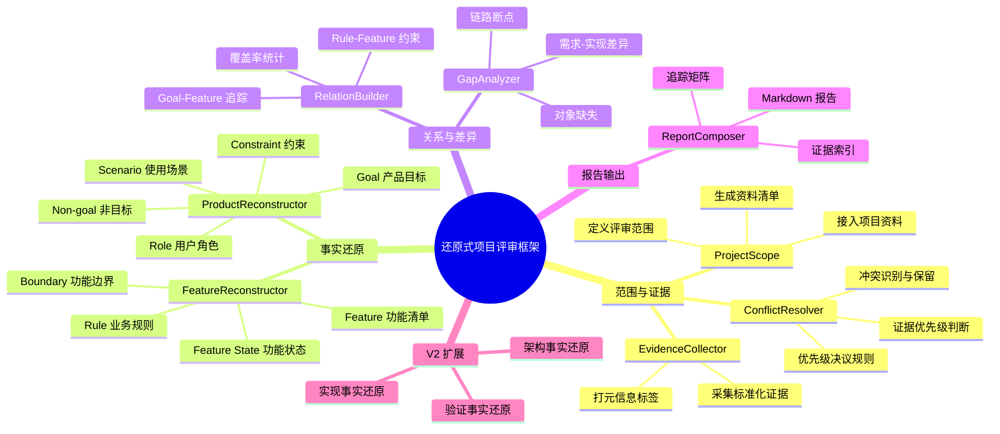
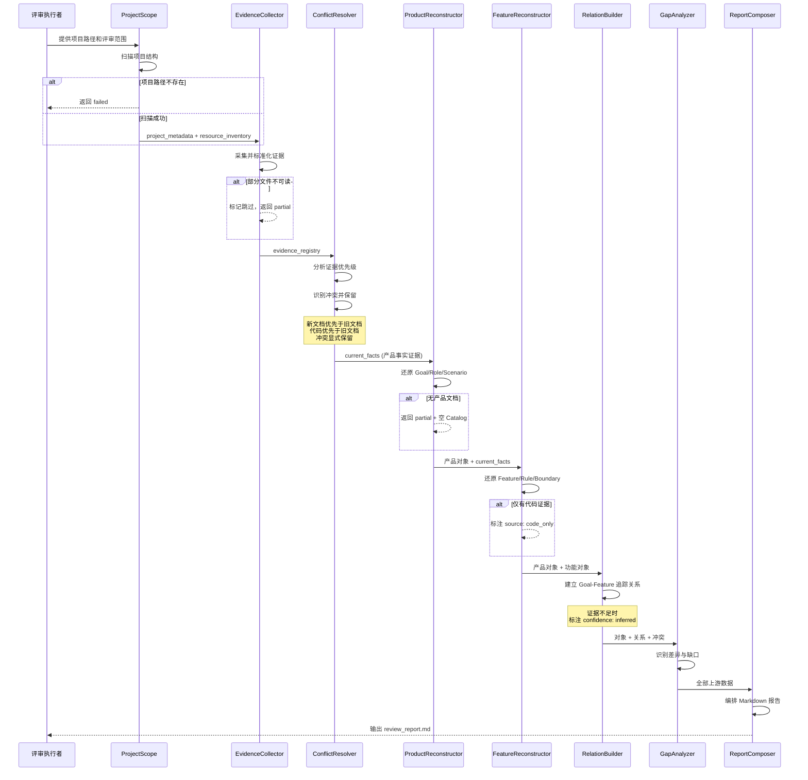

# Product Map: 还原式项目评审框架

## 视图 A: 功能全景树

## 视图 B: 评审执行流程

## 视图 C: 决策摘要

### 一句话价值
基于项目自身材料，将任意项目从产品目标到功能边界逐层还原为结构化对象与追踪关系网络，系统性地识别需求-实现偏差。

### MVP 裁剪报告

| 范围 | 内容 | V1/V2 |
|------|------|-------|
| V1 核心链路 | 产品 → 功能 → 关系 → 差异 | V1 |
| V1 基础设施 | Skill 协议 + 数据模型 + 证据采集 | V1 |
| V2 扩展 | 架构事实还原 | V2 |
| V2 扩展 | 实现事实还原 | V2 |
| V2 扩展 | 验证事实还原 | V2 |

**V1 包含 8 个 Skill**：ProjectScope、EvidenceCollector、ConflictResolver、ProductReconstructor、FeatureReconstructor、RelationBuilder、GapAnalyzer、ReportComposer

**V2 扩展 3 个 Skill**：ArchitectureReconstructor、ImplementationReconstructor、VerificationReconstructor

### 风险提示

| 风险 | 说明 | 缓解措施 |
|------|------|---------|
| 无产品文档 | 部分项目缺少 PRD，产品还原可能不完整 | Empty State 处理：返回 partial + 空 Catalog |
| 证据冲突 | 文档与代码不一致是常态 | 显式保留冲突，不自动和解 |
| 推断边界 | AI 可能过度推断功能关系 | 严格的 confidence 标注 + 不强行连线 |
