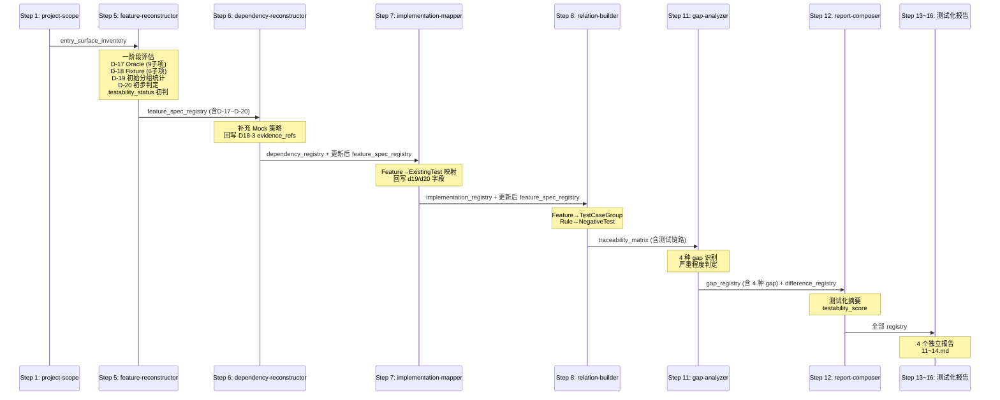
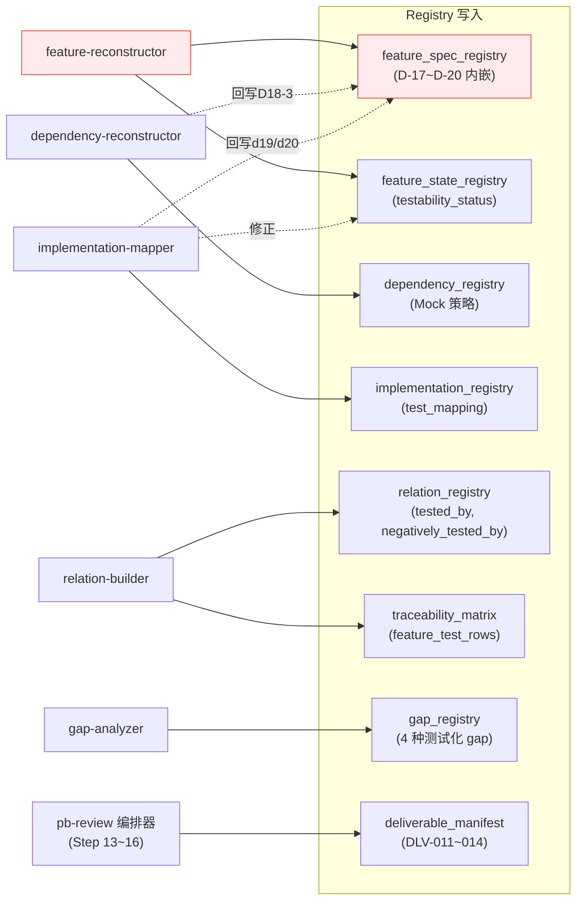

# Architecture: pb-review 标准驱动评估升级

**版本**: 1.3.0
**状态**: Draft (Round 4 修复后)
**迭代**: 010-review-testability-upgrade
**基于**: spec.md v1.3.0, function-points.md (15 FP)

---

## 一、系统架构概览

### 1.1 架构策略

本迭代采用 **扩展复用** 策略：全部 15 个功能点通过升级现有 9 个 Skill + 新增 4 个 renderer 脚本 + 新增共享 schema 文件完成，**零新建 Skill**。

核心变更：

1. **纵向扩展**：feature-reconstructor 从 D-01~D-16 扩展到 D-01~D-20
2. **横向增强**：gap-analyzer、report-composer、project-scope 等 8 个 Skill 增加测试化评估能力
3. **协议层新增**：引入 `schemas/` 目录，将评估标准/协议从 Skill 定义中抽离为独立 schema 文件
4. **交付层扩展**：新增 4 个 Markdown 交付物（11~14），编排器新增 Step 13~16

### 1.2 架构继承

完整继承现有 pb-review 009 架构：

- **12 步顺序流水线** → 扩展为 **16 步**（追加 Step 13~16）
- **16 个 JSON 注册表** → 数据结构扩展（feature_spec_registry 内嵌 D-17~D-20）
- **10 个 Markdown 交付物** → 扩展为 **14 个**
- **三层执行模型**（确定性引导 / 抽象重建 / 报告组合）→ 不变
- **统一输入输出协议** → 不变
- **checkpoint 恢复机制** → 扩展支持 Step 13~16

### 1.3 升级后全景图

```mermaid
flowchart TB
    subgraph Tier1["Tier 1: 确定性引导"]
        S1["Step 1: project-scope<br/>🔧 FP-004 entry surface"]
        S2["Step 2: evidence-collector"]
        S3["Step 3: conflict-resolver"]
    end

    subgraph Tier2["Tier 2: 抽象重建"]
        S4["Step 4: product-reconstructor<br/>🔧 FP-005 完整度评估"]
        S5["Step 5: feature-reconstructor<br/>🔧 FP-001 D-17~D-20<br/>🔧 FP-014/015 模板升级"]
        S6["Step 6: dependency-reconstructor<br/>🔧 FP-006 Mock策略"]
        S7["Step 7: implementation-mapper<br/>🔧 FP-007 测试映射"]
        S8["Step 8: relation-builder<br/>🔧 FP-008 测试链路"]
        S9["Step 9: architecture-builder"]
        S10["Step 10: data-flow-builder"]
    end

    subgraph Tier3["Tier 3: 差距分析 + 报告"]
        S11["Step 11: gap-analyzer<br/>🔧 FP-002 四种Gap"]
        S12["Step 12: report-composer<br/>🔧 FP-003 测试化摘要"]
    end

    subgraph Tier4["Tier 4: 确定性报告渲染 (NEW)"]
        style Tier4 fill:#e8f5e9,stroke:#4caf50
        S13["Step 13: render_testability_scorecard<br/>→ 11-testability-scorecard.md"]
        S14["Step 14: render_test_case_index<br/>→ 12-test-case-index.md"]
        S15["Step 15: render_fixture_contract<br/>→ 13-test-fixture-contract.md"]
        S16["Step 16: render_oracle_matrix<br/>→ 14-test-oracle-matrix.md"]
    end

    S1 --> S2 --> S3
    S3 --> S4 --> S5 --> S6 --> S7 --> S8 --> S9 --> S10
    S10 --> S11 --> S12
    S12 --> S13 --> S14 --> S15 --> S16

    style S1 fill:#fff3e0,stroke:#ff9800
    style S4 fill:#fff3e0,stroke:#ff9800
    style S5 fill:#ffebee,stroke:#f44336
    style S6 fill:#fff3e0,stroke:#ff9800
    style S7 fill:#fff3e0,stroke:#ff9800
    style S8 fill:#fff3e0,stroke:#ff9800
    style S11 fill:#fff3e0,stroke:#ff9800
    style S12 fill:#fff3e0,stroke:#ff9800
```



**图例**：🔴 红色 = 重度升级 | 🟠 橙色 = 轻/中度升级 | 🟢 绿色 = 新增步骤 | 无色 = 不变

---

## 二、协议层设计（Schema Files）

### 2.1 设计原则

评估标准和协议从 SKILL.md 中抽离为独立 schema 文件，实现：

1. **单一权威源**：每个标准定义只有一份，多个 Skill 引用同一 schema
2. **可验证性**：schema 文件可被脚本加载用于自动化验证
3. **可演进性**：标准变更只需修改 schema 文件，不需改动多个 Skill

### 2.2 Schema 文件清单

所有 schema 文件统一放置在 `skills/pb-review/schemas/` 目录下：

| Schema 文件 | 用途 | 引用 Skill |
|------------|------|-----------|
| `d17-oracle-schema.md` | D-17 Test Oracle 9 个子项定义 + 评估规则 | feature-reconstructor, gap-analyzer, pb-review (编排器 Step 16) |
| `d18-fixture-schema.md` | D-18 Fixture Contract 6 个子项定义 + 评估规则 | feature-reconstructor, dependency-reconstructor, pb-review (编排器 Step 15) |
| `d19-test-groups-schema.md` | D-19 Test Case Groups 8 个必需测试组定义 | feature-reconstructor, pb-review (编排器 Step 14) |
| `d20-coverage-claim-schema.md` | D-20 Coverage Claim 8 项条件定义 | feature-reconstructor |
| `testability-status-rules.md` | testability_status 三态判定规则（blocked/partial/test_ready） | feature-reconstructor, gap-analyzer |
| `testability-score-formula.md` | M-01~M-07 加权公式 + 等级判定（A/B/C/D） | pb-review (编排器 Step 13) |
| `gap-severity-rules.md` | Gap 严重程度判定规则（Critical/Major/Minor） | gap-analyzer |
| `entry-surface-types.md` | 5 类入口类型定义（cli/api/page/cron/orchestration） | project-scope |

### 2.3 Schema 文件格式规范

每个 schema 文件必须包含以下结构：

```markdown
# Schema: {名称}

**版本**: x.y.z
**来源**: pb-review-standard.md §x.x
**引用 Skill**: skill-1, skill-2, ...

## 定义

{标准定义表格或结构}

## 评估规则

{评估/判定/计算规则}

## 数据结构

{对应的 JSON schema 或 YAML 结构}

## 示例

{至少一个完整示例}
```

### 2.4 Schema 加载机制

Schema 文件通过 pb-review **编排器统一加载**，下游 Skill 从上下文中读取：

1. **编排器预加载**：pb-review 编排器的 SKILL.md 在 `## References` 段落中声明所有 schema 文件路径。LLM 在加载编排器时读取全部 schema 文件到会话上下文
2. **上下文透传**：编排器切换到下游 Skill 时，schema 内容已在 LLM 会话上下文中，下游 Skill 直接引用
3. **Skill 声明依赖**：每个 Skill 的 SKILL.md 中通过 `## 依赖 Schema` 段落声明需要的 schema，用于文档可追溯性（非加载用途）
4. **Renderer 脚本加载**：Python 渲染脚本通过文件路径直接读取 schema 文件（如解析子项名称、计算公式等）

```
pb-review 编排器
  └─ References 段落声明全部 8 个 schema 文件
  └─ LLM 加载编排器时读取 schema 到上下文
      │
      ├─ Step 5: feature-reconstructor (从上下文读取 d17/d18/d19/d20/testability-status schema)
      ├─ Step 6: dependency-reconstructor (从上下文读取 d18-fixture schema)
      ├─ Step 11: gap-analyzer (从上下文读取 gap-severity/testability-status schema)
      └─ Step 13~16: renderer 脚本 (通过文件路径直接读取 schema)
```

**不采用的方案**：将 schema 复制到各 Skill 的 references/ 目录（违反 DRY，维护成本高）。

---

## 三、组件划分

### 3.1 变更组件总览

| 组件 | 变更类型 | FP 覆盖 | 复用策略 |
|------|---------|---------|---------|
| pb-review-feature-reconstructor | 重度升级 | FP-001, FP-014, FP-015 | 扩展复用 |
| pb-review-report-composer | 轻度升级 | FP-003 | 扩展复用 |
| pb-review-gap-analyzer | 中度升级 | FP-002 | 扩展复用 |
| pb-review (编排器) | 重度升级 | FP-009, FP-010, FP-011, FP-012, FP-013 | 扩展复用 |
| pb-review-project-scope | 轻度升级 | FP-004 | 扩展复用 |
| pb-review-product-reconstructor | 轻度升级 | FP-005 | 扩展复用 |
| pb-review-dependency-reconstructor | 轻度升级 | FP-006 | 扩展复用 |
| pb-review-implementation-mapper | 轻度升级 | FP-007 | 扩展复用 |
| pb-review-relation-builder | 轻度升级 | FP-008 | 扩展复用 |

### 3.2 组件详细设计

#### 3.2.1 pb-review-feature-reconstructor（重度升级）

**FP**: FP-001, FP-014, FP-015

**变更内容**:

1. **SKILL.md 升级**：新增 D-17~D-20 评估指令段落
   - D-17: 基于 `d17-oracle-schema.md` 的 9 个子项逐项评估
   - D-18: 基于 `d18-fixture-schema.md` 的 6 个子项逐项评估
   - D-19: 基于 `d19-test-groups-schema.md` 统计测试分组
   - D-20: 基于 `d20-coverage-claim-schema.md` 判定覆盖声明
   - testability_status 判定：基于 `testability-status-rules.md`

2. **模板升级**:
   - `assets/feature-spec-index-template.md`：新增 5 列（testability_status, oracle_completeness, fixture_readiness, test_case_group_count, coverage_claim_allowed）
   - `assets/feature-spec-card-template.md`：新增 D-17~D-20 四个章节

3. **渲染脚本升级**:
   - `scripts/render_feature_deliverables.py`：支持 D-17~D-20 字段渲染

4. **新增引用文件**:
   - 无（标准已抽离到 `schemas/` 目录）

**Evidence Policy（CON-002 合规）**:

| 维度 | required_sources | min_confidence | allow_inference |
|------|-----------------|---------------|----------------|
| D-17 Test Oracle | code, test | explicit | false |
| D-18 Fixture Contract | test | explicit | false |
| D-19 Test Case Groups | test | explicit | false |
| D-20 Coverage Claim | （聚合 D-17~D-19 结果，无独立 evidence_source） | — | false |

- 所有子项状态必须有直接证据：代码中存在对应定义才标记为 `defined`
- 缺少证据时标记为 `missing`，**严禁**推断为 `defined`
- `not_applicable` 需要有明确的排除理由（如：无文件输出的功能不检查 D17-7）
- 每个 `defined` 子项必须附带 `evidence_refs`，指向具体代码位置（文件路径 + 行号范围）

**输入**: evidence_registry, current_facts, entry_surface_inventory

**输出**: feature_spec_registry（含 D-17~D-20 扩展字段）, feature_state_registry（含 testability_status）

**数据结构扩展**（内嵌于 feature_spec_registry）:

```json
{
  "function_id": "OPR-XX-YY-001",
  "d17_oracle": {
    "completeness": 78,
    "sub_items": [
      {
        "id": "D17-1",
        "name": "成功输出 Schema",
        "status": "defined",
        "evidence_refs": ["ev-xxx"]
      }
    ]
  },
  "d18_fixture": {
    "completeness": 60,
    "sub_items": [
      {
        "id": "D18-1",
        "name": "最小数据集",
        "status": "missing",
        "evidence_refs": null
      }
    ]
  },
  "d19_test_groups": {
    "count": 5,
    "groups": [
      {
        "name": "正向功能测试",
        "test_count": 8,
        "evidence_refs": ["ev-xxx"]
      }
    ]
  },
  "d20_coverage_claim": {
    "allowed": "no",
    "coverage_scope": null,
    "blocking_reasons": ["oracle_completeness < 90"],
    "uncovered_sub_capabilities": ["边界条件未覆盖"],
    "unclosed_assertion_points": ["D17-4 排序规则缺失"],
    "unstandardized_fixtures": ["D18-3 Mock策略未定义"]
  },
  "testability_status": "partial",
  "oracle_completeness": 78,
  "fixture_readiness": 60,
  "test_case_group_count": 5,
  "coverage_claim_allowed": "no"
}
```

#### 3.2.2 pb-review-gap-analyzer（中度升级）

**FP**: FP-002

**变更内容**:

1. **SKILL.md 升级**：扩展 gap 类型识别逻辑
   - 从 1 种（missing_feature）扩展为 4 种 gap 类型
   - 新增严重程度判定：基于 `gap-severity-rules.md`
   - 读取 D-17~D-20 字段进行测试化差距分析

2. **模板升级**:
   - `assets/gap-analysis-template.md`：新增测试化 gap 分类章节

3. **渲染脚本升级**:
   - `scripts/render_gap_analysis.py`：支持 4 种 gap 类型渲染 + 严重程度标注

**输入**: feature_spec_registry（含 D-17~D-20）, traceability_matrix, object_registry

**输出**: gap_registry（含 4 种 gap 类型 + 严重程度）, difference_registry（现有差异类型不变）

**4 种 Gap 类型**:

| Gap 类型 | 触发条件 | 默认严重程度 |
|---------|---------|------------|
| missing_feature | 权威文档声明功能，但功能索引中不存在 | 按规则判定 |
| missing_oracle | D-17 oracle_completeness = 0% 或 < 50% | Critical / Major |
| missing_fixture_contract | D-18 fixture_readiness = 0% | Major |
| missing_test_traceability | 无 Feature→TestCaseGroup 链路 | Major |

#### 3.2.3 pb-review-report-composer（轻度升级）

**FP**: FP-003

**变更内容**:

1. **SKILL.md 升级**：
   - 07-review-report.md 新增「测试化摘要」章节

2. **模板升级（1 个）**:
   - `assets/report-template.md`：新增测试化摘要章节

**输入**: feature_spec_registry, gap_registry, traceability_matrix, implementation_registry, dependency_registry

**输出**: 07-review-report.md（升级版，含测试化摘要）

> **注意**：FP-009~012 的 4 个专项报告（11~14.md）由编排器直接调用渲染脚本生成（Step 13~16），不在 report-composer Skill 的执行范围内。渲染脚本和模板归属编排器，见 §3.2.4。

#### 3.2.4 pb-review 编排器（重度升级）

**FP**: FP-009, FP-010, FP-011, FP-012, FP-013

**变更内容**:

1. **SKILL.md 升级**：工作流追加 Step 13~16
2. **references/skill-sequence.md 升级**：追加 4 步及对应交付物
3. **模板新增（4 个，归属编排器）**:
   - `assets/testability-scorecard-template.md`：评分卡模板
   - `assets/test-case-index-template.md`：测试用例索引模板
   - `assets/fixture-contract-template.md`：Fixture 合约模板
   - `assets/oracle-matrix-template.md`：Oracle 矩阵模板
4. **渲染脚本新增（4 个，归属编排器）**:
   - `scripts/render_testability_scorecard.py`
   - `scripts/render_test_case_index.py`
   - `scripts/render_fixture_contract.py`
   - `scripts/render_oracle_matrix.py`

**4 个专项报告数据源**:

| 交付物 | Renderer | Schema 依赖 | 输入数据 |
|--------|---------|------------|---------|
| 11-testability-scorecard.md | render_testability_scorecard.py | testability-score-formula.md | feature_spec_registry 全量, gap_registry |
| 12-test-case-index.md | render_test_case_index.py | d19-test-groups-schema.md | feature_spec_registry[].d19_test_groups, implementation_registry |
| 13-test-fixture-contract.md | render_fixture_contract.py | d18-fixture-schema.md | feature_spec_registry[].d18_fixture, dependency_registry |
| 14-test-oracle-matrix.md | render_oracle_matrix.py | d17-oracle-schema.md | feature_spec_registry[].d17_oracle |

**升级后执行序列**:

| Step | 执行方式 | Skill / Script | 交付物 | 类型 |
|------|---------|---------------|--------|------|
| 1~12 | （现有不变） | （现有不变） | （现有不变） | 不变 |
| 13 | **确定性脚本** | 编排器直接调用 render_testability_scorecard.py | 11-testability-scorecard.md | **NEW** |
| 14 | **确定性脚本** | 编排器直接调用 render_test_case_index.py | 12-test-case-index.md | **NEW** |
| 15 | **确定性脚本** | 编排器直接调用 render_fixture_contract.py | 13-test-fixture-contract.md | **NEW** |
| 16 | **确定性脚本** | 编排器直接调用 render_oracle_matrix.py | 14-test-oracle-matrix.md | **NEW** |

**Step 13~16 执行模型**:

Step 13~16 属于 **Tier 1 确定性步骤**（与 Step 1~3 同类），而非 Tier 2 抽象重建步骤：
- 编排器直接调用 Python renderer 脚本，**不加载 report-composer Skill**
- Renderer 脚本仅做模板渲染 + 数据聚合，不需要 LLM 判断
- 脚本从 `.review/*.json` 读取 registry 数据，填充模板，输出 Markdown
- 脚本从 `skills/pb-review/schemas/` 读取 schema 文件获取标准定义

**Checkpoint 恢复逻辑**:
- Step 13~16 每步独立记录 checkpoint，支持**单步恢复**
- 如 Step 14 失败，恢复时从 Step 14 开始，不重复 Step 13
- 恢复前检查对应 `.review/*.json` 文件完整性
- 如前置 registry 文件缺失或损坏，回退到产出该 registry 的最近 Skill 重跑

**deliverable_manifest 扩展**：新增 4 个交付物条目（DLV-011 ~ DLV-014）。

#### 3.2.5 pb-review-project-scope（轻度升级）

**FP**: FP-004

**变更内容**:

1. **SKILL.md 升级**：新增 entry surface 扫描逻辑（基于 `entry-surface-types.md`）
2. **模板升级**：`assets/system-context-template.md` 新增 Entry Surface 章节

**输出扩展**：project_metadata 新增 `entry_surface_inventory` 字段：

```json
{
  "entry_surface_inventory": [
    {"type": "cli", "path": "manage.py select_stocks", "name": "盘后选股命令"},
    {"type": "api", "path": "/api/v1/stocks/", "name": "股票查询接口"},
    {"type": "cron", "path": "crontab: 0 18 * * 1-5", "name": "盘后定时任务"}
  ]
}
```

#### 3.2.6 pb-review-product-reconstructor（轻度升级）

**FP**: FP-005

**变更内容**:

1. **SKILL.md 升级**：新增完整度评估逻辑
   - Goal 可量化率
   - Scenario 完整率
   - Constraint 可追踪率
   - 总评分 = 三项平均，等级判定 A/B/C/D

**输出扩展**：metadata 新增 `product_catalog_completeness` 字段：

```json
{
  "product_catalog_completeness": {
    "goal_quantifiable_rate": 80,
    "scenario_completeness_rate": 75,
    "constraint_traceability_rate": 60,
    "total_score": 72,
    "grade": "C"
  }
}
```

#### 3.2.7 pb-review-dependency-reconstructor（轻度升级）

**FP**: FP-006

**变更内容**:

1. **SKILL.md 升级**：新增 Mock/Stub 策略输出
   - 识别外部依赖类型（api/database/cache/message_queue/file_system）
   - 输出 Mock 策略建议（stub/fake/spy/mock_server/not_needed）
   - 标注已有 Mock 和缺失 Mock

**输出扩展**：dependency_registry 条目新增字段：

```json
{
  "dependency_id": "dep-001",
  "function_id": "OPR-XX-YY-001",
  "dependency_name": "payment-gateway-api",
  "dependency_type": "api",
  "has_mock": true,
  "mock_evidence_refs": ["ev-xxx"],
  "mock_strategy": "stub",
  "mock_priority": "high"
}
```

**数据回写**：将 Mock 信息回写到 feature_spec_registry[i].d18_fixture.sub_items 中 D18-3 的 evidence_refs。

#### 3.2.8 pb-review-implementation-mapper（轻度升级）

**FP**: FP-007

**变更内容**:

1. **SKILL.md 升级**：新增 Feature→ExistingTest 函数级映射

**输出扩展**：implementation_registry 新增 `test_mapping` 字段：

```json
{
  "mapping_id": "impl-001",
  "function_id": "OPR-XX-YY-001",
  "test_mapping": [
    {
      "test_file": "tests/test_select_stocks.py",
      "test_function_name": "test_select_stocks_normal",
      "test_level": "unit"
    }
  ],
  "existing_test_count": 5
}
```

**数据回写**：补充/修正 feature_spec_registry 的 d19_test_groups 和 d20_coverage_claim 字段。

#### 3.2.9 pb-review-relation-builder（轻度升级）

**FP**: FP-008

**变更内容**:

1. **SKILL.md 升级**：新增 2 种关系类型
   - `tested_by`：Feature → TestCaseGroup
   - `negatively_tested_by`：Rule → NegativeTest

**输出扩展**：relation_registry 新增关系类型：

```json
{
  "relation_id": "rel-xxx",
  "relation_type": "tested_by",
  "source_id": "OPR-XX-YY-001",
  "target_id": "tg-正向功能测试",
  "evidence_refs": ["ev-xxx"],
  "confidence": "explicit"
}
```

**traceability_matrix 扩展**：新增 `feature_test_rows` 和 `rule_negative_test_rows`。

---

## 四、数据流设计

### 4.1 D-17~D-20 数据在 Skill 间的流转



### 4.2 两阶段评估策略

D-17~D-20 评估存在数据依赖问题：feature-reconstructor (Step 5) 需要 implementation-mapper (Step 7) 的测试映射数据。

**解决方案：两阶段写入**

```
┌─────────────────────────────────────────┐
│ Step 5: feature-reconstructor (一阶段)   │
│  ├─ D-17: 基于代码证据扫描 → 完整评估    │
│  ├─ D-18: 基于测试代码扫描 → 完整评估    │
│  ├─ D-19: 基于测试文件结构 → 初步统计    │
│  ├─ D-20: 基于已有数据 → 初步判定        │
│  └─ testability_status → 初判           │
└──────────────┬──────────────────────────┘
               ↓
┌─────────────────────────────────────────┐
│ Step 7: implementation-mapper (二阶段)   │
│  ├─ Feature→ExistingTest 函数级映射      │
│  ├─ 回写 d19_test_groups (补充精确统计)  │
│  ├─ 回写 d20_coverage_claim (修正判定)   │
│  └─ 回写 testability_status (修正)      │
└─────────────────────────────────────────┘
```

**回写规则**：
- implementation-mapper 只能**补充或上调**数据，不能删除一阶段已有的 evidence_refs
- 如果一阶段 D-19 count = 3，二阶段发现更多测试函数使 count = 5，则更新为 5
- 如果一阶段 testability_status = "blocked"，二阶段数据使其满足 "partial" 条件，则上调

### 4.3 Registry 写入流



---

## 五、接口/协议定义

### 5.1 feature_spec_registry 扩展字段 Schema

完整定义见 `d17-oracle-schema.md` / `d18-fixture-schema.md` / `d19-test-groups-schema.md` / `d20-coverage-claim-schema.md`。

汇总字段结构：

```yaml
feature_spec_registry[i]:
  # === 现有字段 (D-01~D-16) 保持不变 ===
  function_id: string
  function_name: string
  layer: string
  # ...

  # === 新增 D-17~D-20 字段 ===
  d17_oracle:
    completeness: number          # 0-100
    sub_items: array              # 9 项, 结构见 d17-oracle-schema.md
      - id: string               # D17-1 ~ D17-9
        name: string
        status: enum(defined, missing, not_applicable)
        evidence_refs: array | null

  d18_fixture:
    completeness: number          # 0-100
    sub_items: array              # 6 项, 结构见 d18-fixture-schema.md
      - id: string               # D18-1 ~ D18-6
        name: string
        status: enum(defined, missing, not_applicable)
        evidence_refs: array | null

  d19_test_groups:
    count: number                 # >= 0
    groups: array
      - name: string
        test_count: number
        evidence_refs: array

  d20_coverage_claim:
    allowed: enum(yes, no)
    coverage_scope: string | null
    blocking_reasons: array | null
    uncovered_sub_capabilities: array | null
    unclosed_assertion_points: array | null
    unstandardized_fixtures: array | null

  # === 聚合判定 ===
  testability_status: enum(blocked, partial, test_ready)
  oracle_completeness: number     # = d17_oracle.completeness
  fixture_readiness: number       # = d18_fixture.completeness
  test_case_group_count: number   # = d19_test_groups.count
  coverage_claim_allowed: enum(yes, no)  # = d20_coverage_claim.allowed
```

### 5.2 dependency_registry 扩展字段 Schema

```yaml
dependency_registry[i]:
  # === 现有字段保持不变 ===
  dependency_id: string
  source_function_id: string
  target_type: string
  target_id: string
  dependency_type: string
  evidence_refs: array
  confidence: string

  # === 新增字段 ===
  dependency_name: string         # 外部依赖名称
  has_mock: boolean               # 是否已有 Mock
  mock_evidence_refs: array | null  # 已有 Mock 的证据
  mock_strategy: enum(stub, fake, spy, mock_server, not_needed) | null
  mock_priority: enum(high, medium, low)
```

### 5.3 implementation_registry 扩展字段 Schema

```yaml
implementation_registry[i]:
  # === 现有字段保持不变 ===
  mapping_id: string
  function_id: string
  mapping_type: string
  path: string
  role: string
  evidence_refs: array

  # === 新增字段 ===
  test_mapping: array
    - test_file: string
      test_function_name: string
      test_level: enum(unit, integration, e2e)
  existing_test_count: number     # >= 0
```

### 5.4 traceability_matrix 扩展

```yaml
traceability_matrix:
  # === 现有字段保持不变 ===
  goal_rows: array
  rule_rows: array
  feature_dependency_rows: array
  feature_implementation_rows: array
  coverage_stats: object

  # === 新增字段 ===
  feature_test_rows: array
    - function_id: string
      test_groups: array
        - group_name: string
          test_count: number
      coverage_status: enum(covered, partial, uncovered)
      evidence_refs: array

  rule_negative_test_rows: array
    - rule_id: string
      rule_name: string
      negative_tests: array
        - test_file: string
          test_function: string
      coverage_status: enum(covered, uncovered)
      evidence_refs: array

  # === coverage_stats 扩展 ===
  coverage_stats:
    # 现有
    goal_coverage_rate: number
    feature_traceability_rate: number
    dependency_traceability_rate: number
    # 新增
    test_traceability_rate: number     # 有测试链路的功能占比
    rule_negative_test_rate: number    # 有负向测试的规则占比
```

### 5.5 gap_registry 扩展

4 种新增 gap 类型写入 `gap_registry`（非 difference_registry），因其语义为"缺失链接"而非"文档/代码差异"。

```yaml
gap_registry[i]:
  # === 现有字段保持不变 ===
  gap_id: string
  gap_type: string               # 现有 + 新增枚举值
  description: string
  severity: string
  context: object

  # === gap_type 枚举扩展 ===
  # 现有: missing_relation, isolated_feature, broken_dependency, missing_evidence
  # 新增:
  #   - missing_feature: 权威文档声明功能，但功能索引中不存在
  #   - missing_oracle: D-17 oracle_completeness = 0% 或 < 50%
  #   - missing_fixture_contract: D-18 fixture_readiness = 0%
  #   - missing_test_traceability: 无 Feature→TestCaseGroup 链路

  # === 新增字段 ===
  gap_severity: enum(Critical, Major, Minor)  # 严重程度判定
  function_id: string | null                  # 关联的功能 ID（如适用）
  evidence_refs: array | null                 # 支撑证据
```

**difference_registry 不变**：保持原有语义（doc_without_code, code_without_doc, conflicting_versions, partial_implementation），不新增 gap 相关字段。

### 5.6 deliverable_manifest 扩展

新增 4 个交付物条目：

| deliverable_id | deliverable_type | path | producer_skill |
|---------------|-----------------|------|---------------|
| DLV-011 | testability_scorecard | .review/deliverables/11-testability-scorecard.md | pb-review |
| DLV-012 | test_case_index | .review/deliverables/12-test-case-index.md | pb-review |
| DLV-013 | fixture_contract | .review/deliverables/13-test-fixture-contract.md | pb-review |
| DLV-014 | oracle_matrix | .review/deliverables/14-test-oracle-matrix.md | pb-review |

---

## 六、架构图

### 6.1 组件关系图

```mermaid
graph TB
    subgraph schemas["schemas/ (共享协议层)"]
        style schemas fill:#e3f2fd,stroke:#1976d2
        SCH1["d17-oracle-schema.md"]
        SCH2["d18-fixture-schema.md"]
        SCH3["d19-test-groups-schema.md"]
        SCH4["d20-coverage-claim-schema.md"]
        SCH5["testability-status-rules.md"]
        SCH6["testability-score-formula.md"]
        SCH7["gap-severity-rules.md"]
        SCH8["entry-surface-types.md"]
    end

    subgraph skills["Skill 层"]
        PS["project-scope<br/>🔧 FP-004"]
        PR["product-reconstructor<br/>🔧 FP-005"]
        FR["feature-reconstructor<br/>🔧 FP-001,014,015"]
        DR["dependency-reconstructor<br/>🔧 FP-006"]
        IM["implementation-mapper<br/>🔧 FP-007"]
        RB["relation-builder<br/>🔧 FP-008"]
        GA["gap-analyzer<br/>🔧 FP-002"]
        RC["report-composer<br/>🔧 FP-003"]
        PBR["pb-review 编排器<br/>🔧 FP-009~013"]
    end

    subgraph renderers["新增 Renderer Scripts"]
        style renderers fill:#e8f5e9,stroke:#4caf50
        R1["render_testability_scorecard.py"]
        R2["render_test_case_index.py"]
        R3["render_fixture_contract.py"]
        R4["render_oracle_matrix.py"]
    end

    SCH8 -.-> PS
    SCH1 -.-> FR
    SCH2 -.-> FR
    SCH3 -.-> FR
    SCH4 -.-> FR
    SCH5 -.-> FR
    SCH2 -.-> DR
    SCH5 -.-> GA
    SCH7 -.-> GA
    SCH6 -.-> PBR
    SCH1 -.-> PBR
    SCH2 -.-> PBR
    SCH3 -.-> PBR

    PBR --> R1
    PBR --> R2
    PBR --> R3
    PBR --> R4

    PBR --> PS
    PBR --> PR
    PBR --> FR
    PBR --> DR
    PBR --> IM
    PBR --> RB
    PBR --> GA
    PBR --> RC

    style FR fill:#ffebee,stroke:#f44336
    style PBR fill:#ffebee,stroke:#f44336
    style RC fill:#fff8e1,stroke:#ffc107
    style GA fill:#fff3e0,stroke:#ff9800
    style PS fill:#fff8e1,stroke:#ffc107
    style PR fill:#fff8e1,stroke:#ffc107
    style DR fill:#fff8e1,stroke:#ffc107
    style IM fill:#fff8e1,stroke:#ffc107
    style RB fill:#fff8e1,stroke:#ffc107
```



**图例**：🔴 红色 = 重度升级 | 🟠 橙色 = 中度升级 | 🟡 黄色 = 轻度升级 | 🔵 蓝色 = 共享协议层 | 🟢 绿色 = 新增

### 6.2 文件变更清单

```mermaid
graph LR
    subgraph new_files["新增文件"]
        style new_files fill:#e8f5e9,stroke:#4caf50
        N1["schemas/d17-oracle-schema.md"]
        N2["schemas/d18-fixture-schema.md"]
        N3["schemas/d19-test-groups-schema.md"]
        N4["schemas/d20-coverage-claim-schema.md"]
        N5["schemas/testability-status-rules.md"]
        N6["schemas/testability-score-formula.md"]
        N7["schemas/gap-severity-rules.md"]
        N8["schemas/entry-surface-types.md"]
        N9["pb-review/assets/<br/>4 个新报告模板"]
        N10["pb-review/scripts/<br/>4 个新渲染脚本"]
    end

    subgraph modified_files["修改文件"]
        style modified_files fill:#fff3e0,stroke:#ff9800
        M1["feature-reconstructor/SKILL.md"]
        M2["feature-reconstructor/assets/<br/>2 个模板"]
        M3["feature-reconstructor/scripts/<br/>render_feature_deliverables.py"]
        M4["gap-analyzer/SKILL.md"]
        M5["gap-analyzer/assets/<br/>模板"]
        M6["gap-analyzer/scripts/<br/>render_gap_analysis.py"]
        M7["report-composer/SKILL.md"]
        M8["report-composer/assets/<br/>report-template.md"]
        M9["project-scope/SKILL.md"]
        M10["project-scope/assets/<br/>模板"]
        M11["product-reconstructor/SKILL.md"]
        M12["dependency-reconstructor/SKILL.md"]
        M13["implementation-mapper/SKILL.md"]
        M14["relation-builder/SKILL.md"]
        M15["pb-review/SKILL.md"]
        M16["pb-review/references/<br/>skill-sequence.md"]
        M17["pb-review/references/<br/>data-model.md"]
        M18["pb-review/references/<br/>deliverable-standard.md"]
    end
```



---

## 七、架构追溯矩阵

### 7.1 FP → 组件映射

| FP | 功能名称 | 主组件 | 辅助组件 | schema 依赖 | 交付物 |
|----|---------|--------|---------|------------|--------|
| FP-001 | 功能规格卡测试维度评估 | feature-reconstructor | implementation-mapper (回写) | d17, d18, d19, d20, testability-status | feature_spec_registry 扩展 |
| FP-002 | 四种 Gap 类型识别 | gap-analyzer | — | gap-severity-rules | gap_registry 扩展 |
| FP-003 | 测试化摘要报告 | report-composer | — | — | 07-review-report.md 升级 |
| FP-004 | Entry Surface 全面扫描 | project-scope | — | entry-surface-types | project_metadata 扩展 |
| FP-005 | 产品目录完整度评估 | product-reconstructor | — | — | metadata 扩展 |
| FP-006 | 测试依赖识别 | dependency-reconstructor | — | d18-fixture-schema | dependency_registry 扩展 |
| FP-007 | 测试映射建立 | implementation-mapper | — | — | implementation_registry 扩展 |
| FP-008 | 测试追踪链路 | relation-builder | — | — | traceability_matrix 扩展 |
| FP-009 | Testability Scorecard | pb-review (编排器) | — | testability-score-formula | 11-testability-scorecard.md |
| FP-010 | Test Case Index | pb-review (编排器) | — | d19-test-groups-schema | 12-test-case-index.md |
| FP-011 | Fixture Contract 报告 | pb-review (编排器) | — | d18-fixture-schema | 13-test-fixture-contract.md |
| FP-012 | Oracle Matrix 报告 | pb-review (编排器) | — | d17-oracle-schema | 14-test-oracle-matrix.md |
| FP-013 | 编排器工作流升级 | pb-review (编排器) | — | — | checkpoint + manifest |
| FP-014 | Spec Index 模板升级 | feature-reconstructor | — | — | 03-feature-spec-index.md |
| FP-015 | Spec Card 模板升级 | feature-reconstructor | — | d17, d18, d19, d20 | 04-feature-specs/*.md |

### 7.2 覆盖完整性校验

| 维度 | 状态 |
|------|------|
| FP → 组件覆盖 | 15/15 ✅ |
| 组件 → FP 反向覆盖 | 9 组件全部有 FP 归属 ✅ |
| Schema → FP 覆盖 | 8 schema 全部被至少 1 个 FP 引用 ✅ |
| 新增交付物 → FP 覆盖 | 4 新交付物全部有 FP 归属 ✅ |
| 无孤立组件 | ✅ |
| 无孤立 FP | ✅ |

---

## 八、架构决策记录

### ADR-001: 扩展复用 vs 新建 Skill

**决策**: 扩展复用现有 9 个 Skill，零新建。

**替代方案**: 新建 `pb-review-testability-evaluator` Skill 承担 D-17~D-20 评估。

**选择理由**:
- D-17~D-20 评估与 feature-reconstructor 的功能还原紧密耦合，拆分会导致重复读取证据
- 新建 Skill 需要在编排器中插入新步骤，增加依赖链复杂度
- 现有 Skill 结构（SKILL.md + assets + scripts + references）已足够承载扩展

### ADR-002: D-17~D-20 数据内嵌 vs 独立注册表

**决策**: 内嵌在 feature_spec_registry 中。

**替代方案**: 新建 `testability_registry.json`，通过 function_id 关联。

**选择理由**:
- spec.md 数据流设计明确将 D-17~D-20 作为 feature_spec_registry 的扩展字段
- 内嵌避免了跨 registry 的 JOIN 查询，renderer 脚本直接从单个 registry 读取
- 独立注册表需要额外的一致性维护（两个文件的 function_id 必须同步）

### ADR-003: Step 13~16 作为独立步骤 vs Step 12 子步骤

**决策**: 独立步骤（Step 13~16），由编排器直接调用确定性脚本。

**替代方案**: 在 Step 12 report-composer 内部作为子步骤执行。

**选择理由**:
- 独立步骤支持单步 checkpoint 恢复，一个报告失败不影响其他报告
- 与 Tier 1 确定性步骤模型一致（纯模板渲染，无需 LLM 判断）
- report-composer 的职责是组合最终报告（Step 12），4 个专项报告是独立交付物

### ADR-004: 4 种新 gap 写入 gap_registry vs difference_registry

**决策**: 写入 gap_registry。

**替代方案**: 扩展 difference_registry 的 difference_type 枚举。

**选择理由**:
- 语义匹配：4 种新类型描述的是"缺失链接"（missing_xxx），与 gap_registry 的"缺失"语义一致
- difference_registry 的语义是"文档与代码的差异"（doc_without_code 等），语义不匹配
- 保持两个 registry 的职责边界清晰

---

## 九、约束与风险

### 8.1 架构约束

1. **零新建 Skill**：所有变更通过升级现有 Skill 完成
2. **schema 单一权威源**：每个评估标准只在一个 schema 文件中定义
3. **向后兼容**：现有 009 版本的 JSON registry 结构不删除/不改名任何字段，只做扩展
4. **两阶段写入**：implementation-mapper 回写 feature_spec_registry 时只补充不覆盖
5. **No Backend Proxy**：所有抽象判断在当前 LLM 会话中执行

### 8.2 风险评估

| 风险 | 严重程度 | 缓解措施 |
|------|---------|---------|
| feature-reconstructor 上下文过长（D-17~D-20 增加大量指令） | Medium | schema 文件外部化减轻 SKILL.md 体积 |
| 两阶段评估数据一致性 | Medium | 回写规则只允许补充/上调，禁止覆盖已有证据 |
| 4 个新 renderer 脚本的测试覆盖 | Low | 现有 test_pb_review_renderers.py 模式可直接复用 |
| checkpoint 恢复逻辑扩展 | Low | 新增步骤完全顺序，无分支逻辑 |
