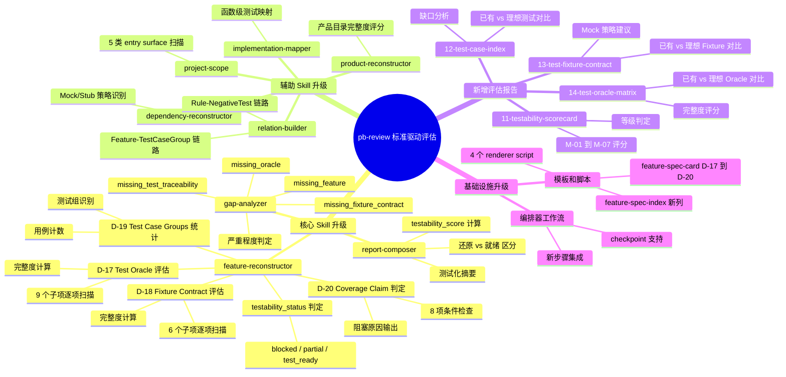
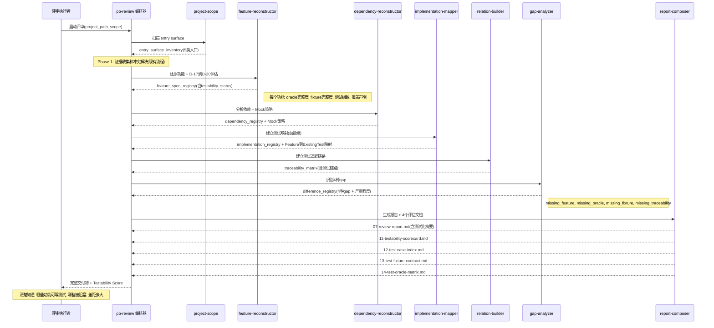
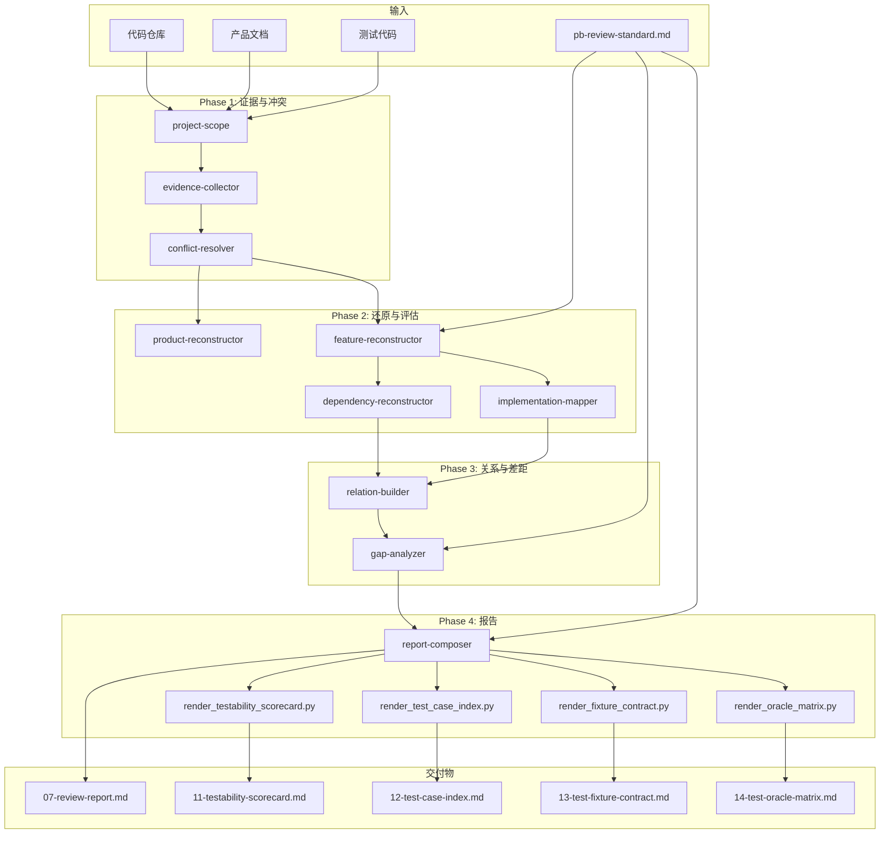

# Product Map: pb-review 标准驱动评估升级

## 决策摘要

**一句话价值**: 让 pb-review 从"能告诉你系统有什么功能"升级为"能告诉你系统离测试就绪还差多远"。

**MVP 裁剪报告**: 全部 15 条需求纳入, 其中 11 条必须(核心升级+报告生成+基础设施)、4 条应该(辅助 skill 升级), 无裁剪。

**风险提示**:
- feature-reconstructor 是最重量级改动(D-17~D-20 + testability_status 判定), 建议最先实现并验证
- 4 个新增 renderer script 需要与现有 render_feature_deliverables.py 保持架构一致
- D-20 的 8 项判定条件较复杂, 需要 gap-analyzer 和 relation-builder 的数据才能完成最终判定

## 功能全景树

## 用户旅程流

## 数据流转全景

