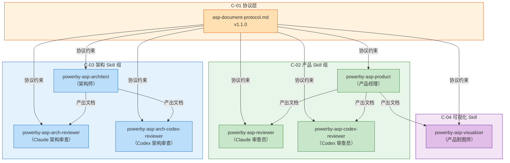
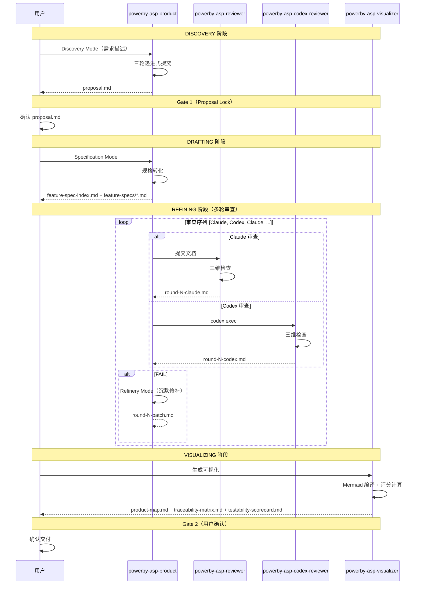
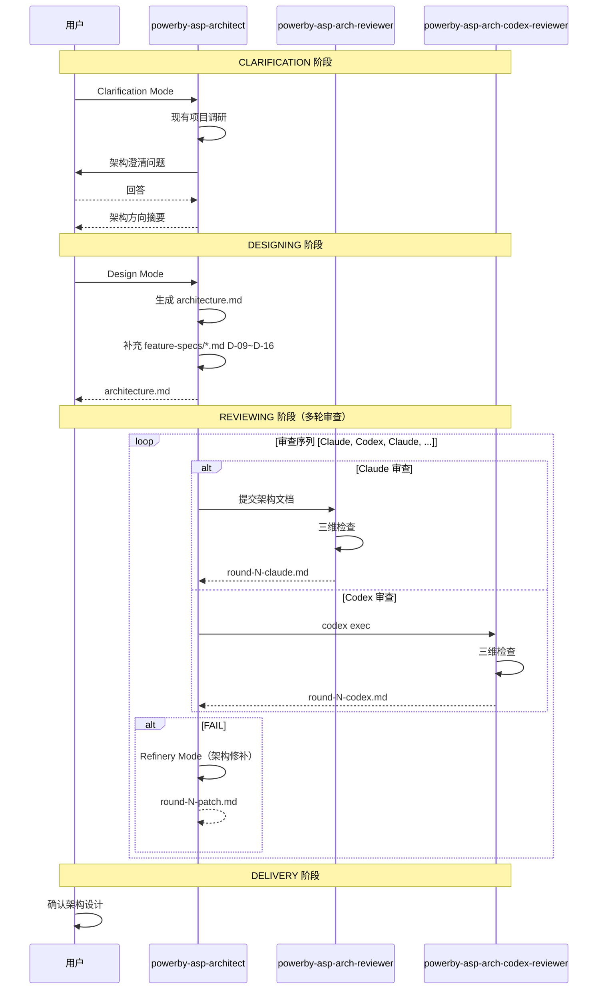
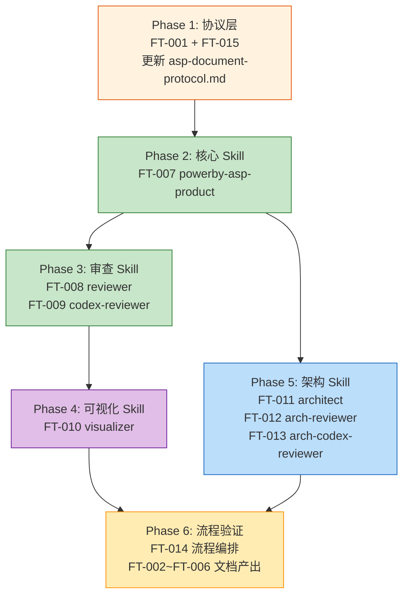

# 架构设计文档

**迭代编号**: 011
**项目名称**: asp-document-upgrade
**生成日期**: 2026-03-30
**状态**: Final

---

## 1. 系统架构概览

本迭代的核心任务是**升级 powerby-asp 流程的文档产出**，使其符合 pb-review 的 D-01~D-20 维度模型。不涉及业务代码开发，所有变更集中在 Skill 定义文件（SKILL.md）和协议文档（asp-document-protocol.md）。

### 1.1 架构范围

```mermaid
flowchart TB
    subgraph 变更范围["🔵 变更范围"]
        PROTO["asp-document-protocol.md<br/>v1.0.0 → v1.1.0"]
        S1["powerby-asp-product"]
        S2["powerby-asp-reviewer"]
        S3["powerby-asp-codex-reviewer"]
        S4["powerby-asp-visualizer"]
        S5["powerby-asp-architect"]
        S6["powerby-asp-arch-reviewer"]
        S7["powerby-asp-arch-codex-reviewer"]
    end

    subgraph 不变范围["⚪ 不变范围"]
        FLOW["ASP 五阶段流程"]
        PBR["pb-review 体系"]
        MAIN["P0-P8 主流程 skill"]
        CONST["consitution.md"]
        SDPROTO["skill-design-protocol.md"]
    end

    PROTO --> S1
    PROTO --> S2
    PROTO --> S3
    PROTO --> S4
    PROTO --> S5
    PROTO --> S6
    PROTO --> S7
    SDPROTO -.->|约束| S1
    SDPROTO -.->|约束| S2
    SDPROTO -.->|约束| S3
    SDPROTO -.->|约束| S4
    SDPROTO -.->|约束| S5
    SDPROTO -.->|约束| S6
    SDPROTO -.->|约束| S7

    style 变更范围 fill:#e3f2fd,stroke:#1565c0
    style 不变范围 fill:#f5f5f5,stroke:#9e9e9e
    style PROTO fill:#bbdefb,stroke:#1565c0
    style S1 fill:#bbdefb,stroke:#1565c0
    style S2 fill:#bbdefb,stroke:#1565c0
    style S3 fill:#bbdefb,stroke:#1565c0
    style S4 fill:#bbdefb,stroke:#1565c0
    style S5 fill:#bbdefb,stroke:#1565c0
    style S6 fill:#bbdefb,stroke:#1565c0
    style S7 fill:#bbdefb,stroke:#1565c0
```



### 1.2 设计约束

| 约束 ID | 约束描述 | 来源 |
|---------|---------|------|
| CON-001 | 所有 skill 必须通过十条核心原则 checklist | proposal.md |
| CON-002 | 文档必须能被 pb-review 零修改复用 | proposal.md |
| CON-003 | 分阶段组装：产品阶段 D-01~D-08 + D-17~D-20，架构阶段 D-09~D-16 | proposal.md |
| CON-004 | 保持 ASP 五阶段流程不变 | proposal.md |
| A-CON-001 | Skill 目录采用 SKILL.md + references/（无 scripts/） | 架构澄清 |
| A-CON-002 | 各 reviewer 独立定义审查协议，不共享 | 架构澄清 |
| A-CON-003 | 架构流程输入文件更新为 proposal.md + feature-spec-index.md + feature-specs/*.md | 架构澄清 |

---

## 2. 现有架构继承

### 2.1 保持不变的组件

| 组件 | 当前状态 | 本次策略 |
|------|---------|---------|
| ASP 五阶段流程 | DISCOVERY → DRAFTING → REFINING → VISUALIZING → CONFIRMATION | 保持不变 |
| 架构四阶段流程 | CLARIFICATION → DESIGNING → REVIEWING → DELIVERY | 保持不变 |
| consitution.md | 项目宪法 | 保持不变 |
| skill-design-protocol.md | 11 section skill 标准结构 | 保持不变（作为约束引用） |
| pb-review 体系 | 成熟的审查框架 | 保持不变 |

### 2.2 复用的现有能力

| 现有能力 | 复用方式 | 保留的核心逻辑 | 变更点 |
|---------|---------|--------------|--------|
| asp-document-protocol.md v1.0.0 | 扩展 | 7 个标准文档定义、5 项核心原则 | 新增分阶段组装机制、更新版本号 |
| powerby-asp-product 三模式 | 重构 | Discovery/Specification/Refinery 三模式调度 | 重写为 11 section 标准结构，Specification 模式产出 feature-spec-index.md + feature-specs/*.md |
| powerby-asp-reviewer 三维检查 | 重构 | 宪法符合性 + 双向覆盖 + 逻辑自洽 | 重写为 11 section 标准结构，审查对象变为新格式文档 |
| powerby-asp-codex-reviewer | 重构 | Codex exec 非交互调用模式 | 重写为 11 section 标准结构 |
| powerby-asp-visualizer | 重构 | Mermaid 三视图生成 | 重写为 11 section 标准结构，输出 product-map.md + traceability-matrix.md + testability-scorecard.md |
| powerby-asp-architect 三模式 | 重构 | Clarification/Design/Refinery 三模式 | 重写为 11 section 标准结构，输入改为新文档格式 |
| powerby-asp-arch-reviewer | 重构 | 架构三维检查 | 重写为 11 section 标准结构 |
| powerby-asp-arch-codex-reviewer | 重构 | Codex 架构审查 | 重写为 11 section 标准结构 |

---

## 3. 组件划分

### 3.1 组件总览



### 3.2 组件详细设计

#### C-01: asp-document-protocol.md（协议层）

| 属性 | 值 |
|------|------|
| **职责** | 定义 ASP 流程的文档标准，约束所有 skill 的文档产出格式 |
| **输入** | 无（静态协议文档） |
| **输出** | 文档协议标准 v1.1.0 |
| **复用策略** | 扩展现有 v1.0.0 |
| **变更内容** | 1. 版本号 v1.0.0 → v1.1.0<br/>2. 新增"分阶段组装机制"章节<br/>3. 新增"feature-spec-index.md 替代 function-points.md"说明<br/>4. 更新文档清单和质量标准 |
| **对应 Feature** | FT-001, FT-004, FT-015 |

#### C-02A: powerby-asp-product（产品经理 Skill）

| 属性 | 值 |
|------|------|
| **职责** | ASP 产品经理角色，支持三种工作模式 |
| **输入** | 用户需求描述、工作模式 |
| **输出** | proposal.md, feature-spec-index.md, feature-specs/*.md, prd_logs/round-{N}-patch.md |
| **复用策略** | 重构（保留三模式调度，重写为 11 section 标准结构） |
| **目录结构** | `skills/powerby-asp-product/SKILL.md` + `references/` |
| **references/** | `asp-document-protocol-ref.md`（协议引用摘要） |
| **核心变更** | 1. Specification 模式产出从 spec.md 改为 feature-spec-index.md + feature-specs/*.md<br/>2. D-01~D-08 + D-17~D-20 按阶段填充<br/>3. SKILL.md 重写为 11 section 标准结构 |
| **对应 Feature** | FT-002, FT-003, FT-004, FT-007 |

#### C-02B: powerby-asp-reviewer（Claude 审查员 Skill）

| 属性 | 值 |
|------|------|
| **职责** | Claude 模式下的 ASP 规格审查，三维检查 |
| **输入** | consitution.md, proposal.md, feature-spec-index.md, feature-specs/*.md, prd_logs/ |
| **输出** | prd_logs/round-{N}-claude.md |
| **复用策略** | 重构（保留三维审查协议，重写为 11 section 标准结构） |
| **目录结构** | `skills/powerby-asp-reviewer/SKILL.md` + `references/` |
| **references/** | `audit-checklist-ref.md`（审查清单引用） |
| **核心变更** | 1. 审查对象从 spec.md 改为 feature-spec-index.md + feature-specs/*.md<br/>2. 上下文隔离文件列表更新<br/>3. SKILL.md 重写为 11 section 标准结构 |
| **对应 Feature** | FT-008 |

#### C-02C: powerby-asp-codex-reviewer（Codex 审查员 Skill）

| 属性 | 值 |
|------|------|
| **职责** | Codex exec 非交互模式下的 ASP 规格审查 |
| **输入** | 同 C-02B（通过 codex exec 参数传递） |
| **输出** | prd_logs/round-{N}-codex.md |
| **复用策略** | 重构（保留 Codex 调用模式，重写为 11 section 标准结构） |
| **目录结构** | `skills/powerby-asp-codex-reviewer/SKILL.md` + `references/` |
| **references/** | `audit-checklist-ref.md`（审查清单引用） |
| **核心变更** | 1. 审查对象更新为新格式文档<br/>2. codex exec 指令模板更新<br/>3. SKILL.md 重写为 11 section 标准结构 |
| **对应 Feature** | FT-009 |

#### C-03A: powerby-asp-architect（架构师 Skill）

| 属性 | 值 |
|------|------|
| **职责** | ASP 架构师角色，支持三种工作模式 |
| **输入** | proposal.md, feature-spec-index.md, feature-specs/*.md, consitution.md |
| **输出** | architecture.md, 补充 feature-specs/*.md 的 D-09~D-16, arch_logs/round-{N}-patch.md |
| **复用策略** | 重构（保留三模式调度，重写为 11 section 标准结构） |
| **目录结构** | `skills/powerby-asp-architect/SKILL.md` + `references/` |
| **references/** | `asp-document-protocol-ref.md`（协议引用摘要） |
| **核心变更** | 1. 输入文件从 spec.md + function-points.md 改为 feature-spec-index.md + feature-specs/*.md<br/>2. Design 模式增加"补充 D-09~D-16"职责<br/>3. 分阶段组装边界校验<br/>4. SKILL.md 重写为 11 section 标准结构 |
| **对应 Feature** | FT-011 |

#### C-03B: powerby-asp-arch-reviewer（Claude 架构审查 Skill）

| 属性 | 值 |
|------|------|
| **职责** | Claude 模式下的架构审查，三维检查 |
| **输入** | consitution.md, proposal.md, feature-spec-index.md, feature-specs/*.md, architecture.md, arch_logs/ |
| **输出** | arch_logs/round-{N}-claude.md |
| **复用策略** | 重构（保留三维审查协议，重写为 11 section 标准结构） |
| **目录结构** | `skills/powerby-asp-arch-reviewer/SKILL.md` + `references/` |
| **references/** | `arch-audit-checklist-ref.md`（架构审查清单引用） |
| **核心变更** | 1. 审查输入文件列表更新<br/>2. 双向覆盖检查从 FP→组件 改为 Feature→组件<br/>3. SKILL.md 重写为 11 section 标准结构 |
| **对应 Feature** | FT-012 |

#### C-03C: powerby-asp-arch-codex-reviewer（Codex 架构审查 Skill）

| 属性 | 值 |
|------|------|
| **职责** | Codex exec 非交互模式下的架构审查 |
| **输入** | 同 C-03B（通过 codex exec 参数传递） |
| **输出** | arch_logs/round-{N}-codex.md |
| **复用策略** | 重构（保留 Codex 调用模式，重写为 11 section 标准结构） |
| **目录结构** | `skills/powerby-asp-arch-codex-reviewer/SKILL.md` + `references/` |
| **references/** | `arch-audit-checklist-ref.md`（架构审查清单引用） |
| **核心变更** | 1. codex exec 指令模板更新<br/>2. SKILL.md 重写为 11 section 标准结构 |
| **对应 Feature** | FT-013 |

#### C-04: powerby-asp-visualizer（产品制图师 Skill）

| 属性 | 值 |
|------|------|
| **职责** | 生成产品全景图、追溯矩阵和测试化评分卡 |
| **输入** | proposal.md, feature-spec-index.md, feature-specs/*.md |
| **输出** | product-map.md, traceability-matrix.md, testability-scorecard.md |
| **复用策略** | 重构（保留 Mermaid 生成逻辑，重写为 11 section 标准结构） |
| **目录结构** | `skills/powerby-asp-visualizer/SKILL.md` + `references/` |
| **references/** | `scoring-formula-ref.md`（评分公式引用） |
| **核心变更** | 1. 产出从 product-map.md 扩展为 product-map.md + traceability-matrix.md + testability-scorecard.md<br/>2. 增加 M-01~M-07 评分计算<br/>3. SKILL.md 重写为 11 section 标准结构 |
| **对应 Feature** | FT-005, FT-006, FT-010 |

---

## 4. 数据流设计

### 4.1 ASP 产品流程数据流



### 4.2 ASP 架构流程数据流



### 4.3 分阶段组装数据流

```mermaid
flowchart LR
    subgraph 产品阶段填充
        D01["D-01 功能标识"]
        D02["D-02 输入规格"]
        D03["D-03 前置条件"]
        D04["D-04 正常输出"]
        D05["D-05 异常行为"]
        D06["D-06 边界值"]
        D07["D-07 后置条件"]
        D08["D-08 副作用"]
        D17["D-17 Test Oracle"]
        D18["D-18 Fixture Contract"]
        D19["D-19 Test Case Groups"]
        D20["D-20 Coverage Claim"]
    end

    subgraph 架构阶段补充
        D09["D-09 性能要求"]
        D10["D-10 安全要求"]
        D11["D-11 并发要求"]
        D12["D-12 数据一致性"]
        D13["D-13 可观测性"]
        D14["D-14 部署约束"]
        D15["D-15 依赖关系"]
        D16["D-16 实现映射"]
    end

    SPEC["feature-specs/*.md<br/>（完整规格卡）"]

    产品阶段填充 -->|产品 CONFIRMATION 后| 架构阶段补充
    产品阶段填充 --> SPEC
    架构阶段补充 --> SPEC

    style 产品阶段填充 fill:#e8f5e9,stroke:#2e7d32
    style 架构阶段补充 fill:#e3f2fd,stroke:#1565c0
    style SPEC fill:#fff3e0,stroke:#e65100
```



---

## 5. 接口/协议定义

### 5.1 Skill 目录结构协议

所有 powerby-asp-* skill 统一采用以下目录结构：

```
skills/powerby-asp-{name}/
├── SKILL.md              # 11 section 标准结构定义
└── references/            # 领域知识引用
    └── {context}-ref.md   # 协议/清单引用摘要
```

### 5.2 SKILL.md 统一结构协议

每个 SKILL.md 必须包含以下 11 个 section（按顺序）：

```markdown
---
name: powerby-asp-{name}
description: {具体能力描述 + 典型触发语境}
compatibility:
  - claude-code
  - local-filesystem
---

## Purpose
## Success criteria
## Strategy
## Tools and capability boundaries
## Important facts and constraints
## Workflow
## Output format
## Resources
## Subtask / parallelism guidance
## Examples
## Safety
```

### 5.3 Skill 间文档传递协议

| 上游 Skill | 产出文档 | 下游 Skill | 消费方式 |
|-----------|---------|-----------|---------|
| powerby-asp-product (Discovery) | proposal.md | powerby-asp-product (Specification) | 读取需求清单 |
| powerby-asp-product (Specification) | feature-spec-index.md + feature-specs/*.md | powerby-asp-reviewer / codex-reviewer | 审查对象 |
| powerby-asp-reviewer / codex-reviewer | prd_logs/round-N-*.md | powerby-asp-product (Refinery) | 修复依据 |
| powerby-asp-product (Refinery) | prd_logs/round-N-patch.md | powerby-asp-reviewer / codex-reviewer | 下轮审查参考 |
| powerby-asp-product (全部产出) | proposal.md + feature-spec-index.md + feature-specs/*.md | powerby-asp-visualizer | 可视化输入 |
| powerby-asp-product (全部产出) | proposal.md + feature-spec-index.md + feature-specs/*.md | powerby-asp-architect | 架构设计输入 |
| powerby-asp-architect | architecture.md + feature-specs/*.md (D-09~D-16) | powerby-asp-arch-reviewer / arch-codex-reviewer | 审查对象 |
| powerby-asp-arch-reviewer / arch-codex-reviewer | arch_logs/round-N-*.md | powerby-asp-architect (Refinery) | 修复依据 |
| powerby-asp-architect (Refinery) | arch_logs/round-N-patch.md | powerby-asp-arch-reviewer / arch-codex-reviewer | 下轮审查参考 |

### 5.4 审查报告输出协议

所有审查员（Claude/Codex，产品/架构）统一输出格式：

```markdown
# ASP {Spec/Architecture} Audit Report

**Reviewer**: {Claude/Codex}
**Round**: {N}
**Audit Date**: {YYYY-MM-DD}
**Status**: {PASS/FAIL}

---

## Previous Rounds Summary
（历史审查摘要）

## 1. 宪法符合性检查
## 2. 双向覆盖检查
## 3. 逻辑自洽性检查
## 4. 问题清单
### 4.1 BLOCKER（阻塞级）
### 4.2 MAJOR（重要级）
### 4.3 MINOR（次要级）
## 5. 审查结论

**审查状态**: {PASS/FAIL}
```

### 5.5 references/ 目录协议

各 Skill 的 references/ 内容规划：

| Skill | references/ 文件 | 内容 |
|-------|-----------------|------|
| powerby-asp-product | asp-document-protocol-ref.md | 协议核心字段摘要：文档清单、字段约束、质量标准 |
| powerby-asp-reviewer | audit-checklist-ref.md | 审查三维清单：宪法条目、覆盖规则、一致性规则 |
| powerby-asp-codex-reviewer | audit-checklist-ref.md | 同上（Codex 版本） |
| powerby-asp-visualizer | scoring-formula-ref.md | M-01~M-07 计算公式和权重 |
| powerby-asp-architect | asp-document-protocol-ref.md | 协议核心字段摘要 + D-09~D-16 填充指南 |
| powerby-asp-arch-reviewer | arch-audit-checklist-ref.md | 架构审查三维清单 |
| powerby-asp-arch-codex-reviewer | arch-audit-checklist-ref.md | 同上（Codex 版本） |

---

## 6. 实现策略

### 6.1 实现顺序



### 6.2 各阶段详细说明

**Phase 1: 协议层更新**
- 更新 asp-document-protocol.md 版本号 v1.0.0 → v1.1.0
- 新增分阶段组装机制章节
- 新增 feature-spec-index.md 替代 function-points.md 说明
- 对应 FT-001, FT-015

**Phase 2: 核心 Skill — powerby-asp-product**
- 重写 SKILL.md 为 11 section 标准结构
- 创建 references/asp-document-protocol-ref.md
- Specification 模式产出升级为 feature-spec-index.md + feature-specs/*.md
- Refinery 模式审查对象更新
- 对应 FT-007

**Phase 3: 审查 Skill — reviewer + codex-reviewer**
- 重写 powerby-asp-reviewer SKILL.md 为 11 section 标准结构
- 重写 powerby-asp-codex-reviewer SKILL.md 为 11 section 标准结构
- 创建 references/audit-checklist-ref.md
- 审查对象更新为新格式文档
- 对应 FT-008, FT-009

**Phase 4: 可视化 Skill — visualizer**
- 重写 SKILL.md 为 11 section 标准结构
- 创建 references/scoring-formula-ref.md
- 产出扩展为 product-map.md + traceability-matrix.md + testability-scorecard.md
- 对应 FT-010

**Phase 5: 架构 Skill — architect + arch-reviewer + arch-codex-reviewer**
- 重写三个 SKILL.md 为 11 section 标准结构
- 创建各自的 references/
- 输入文件列表更新为新格式
- architect 增加 D-09~D-16 补充职责
- 对应 FT-011, FT-012, FT-013

**Phase 6: 流程验证**
- 端到端验证 ASP 产品流程
- 端到端验证 ASP 架构流程
- 确认文档可被 pb-review 零修改复用
- 对应 FT-014, FT-002~FT-006

---

## 7. 架构追溯矩阵

### 7.1 Feature → 组件映射

| Feature ID | 功能名称 | 架构组件 | 复用策略 | 变更类型 |
|-----------|---------|---------|---------|---------|
| FT-001 | 协议标准更新 | C-01 | 扩展 | 文档更新 |
| FT-002 | proposal 格式升级 | C-02A | 重构 | 输出格式 |
| FT-003 | 功能索引生成 | C-02A | 重构 | 新产出物 |
| FT-004 | 分阶段组装 | C-01 + C-02A + C-03A | 全新 | 机制新增 |
| FT-005 | 追溯矩阵 | C-04 | 全新 | 新产出物 |
| FT-006 | 测试化评分 | C-04 | 全新 | 新产出物 |
| FT-007 | powerby-asp-product 重写 | C-02A | 重构 | Skill 重写 |
| FT-008 | powerby-asp-reviewer 重写 | C-02B | 重构 | Skill 重写 |
| FT-009 | powerby-asp-codex-reviewer 重写 | C-02C | 重构 | Skill 重写 |
| FT-010 | powerby-asp-visualizer 重写 | C-04 | 重构 | Skill 重写 |
| FT-011 | powerby-asp-architect 重写 | C-03A | 重构 | Skill 重写 |
| FT-012 | powerby-asp-arch-reviewer 重写 | C-03B | 重构 | Skill 重写 |
| FT-013 | powerby-asp-arch-codex-reviewer 重写 | C-03C | 重构 | Skill 重写 |
| FT-014 | ASP 流程产出升级 | 全部组件 | 扩展 | 流程验证 |
| FT-015 | 协议文档更新 | C-01 | 扩展 | 文档更新 |

### 7.2 覆盖完整性

- **正向覆盖**: 15/15 Feature 均有对应组件，覆盖率 100%
- **反向覆盖**: 所有 8 个组件（C-01, C-02A~C, C-03A~C, C-04）均被 Feature 引用，无孤立组件
- **复用比例**: 扩展 3 个 + 重构 9 个 + 全新 3 个

---

## 8. 风险与缓解

| 风险 | 影响 | 缓解措施 |
|------|------|---------|
| Skill 重写后行为回归 | 重写过程中可能丢失原有逻辑 | 逐个 Skill 重写，每个重写后对比原版核心逻辑 |
| 文档格式不兼容 pb-review | pb-review 无法直接消费 | 对照 feature-specification-standard.md 逐字段验证 |
| 11 section 模板过度约束 ASP Skill | Skill 行为表达受限 | Strategy 层写策略哲学而非死流程，Workflow 保持高层步骤 |
| Codex exec 模式兼容性 | codex exec 对新格式文件的读取 | 审查指令模板中明确列出所有文件路径 |

---

**文档状态**: Final
**阶段归属**: DESIGNING 阶段锁定产物
**阶段归属**: DESIGNING 阶段产出
