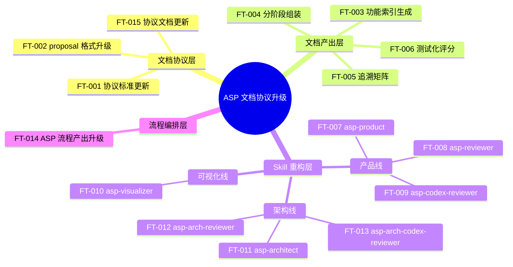
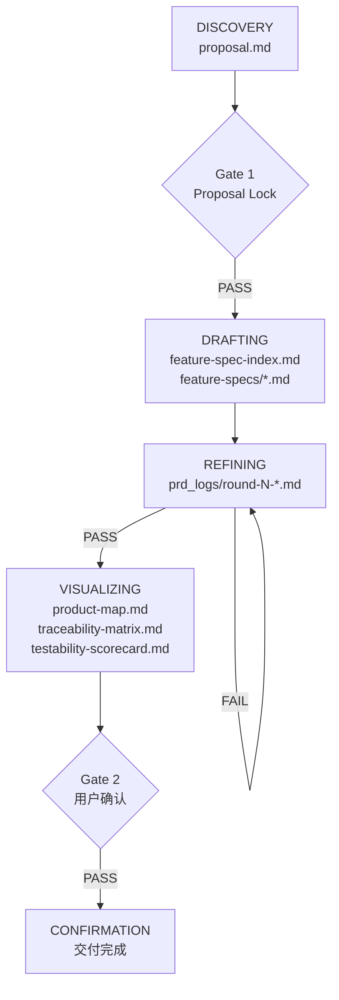
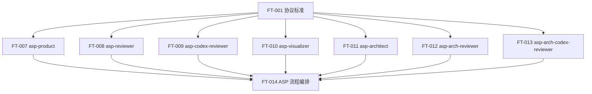

# 产品全景图

**迭代编号**: 011
**项目名称**: asp-document-upgrade
**生成日期**: 2026-03-30
**状态**: Final

---

## 1. 功能全景树

---

## 2. 分阶段组装机制

```mermaid
flowchart LR
    subgraph 产品阶段
        D01[D-01 功能标识]
        D02[D-02 输入规格]
        D03[D-03 前置条件]
        D04[D-04 正常输出]
        D05[D-05 异常行为]
        D06[D-06 边界值]
        D07[D-07 后置条件]
        D08[D-08 副作用]
        D17[D-17 Test Oracle]
        D18[D-18 Fixture Contract]
        D19[D-19 Test Case Groups]
        D20[D-20 Coverage Claim]
    end

    subgraph 架构阶段
        D09[D-09 性能要求]
        D10[D-10 安全要求]
        D11[D-11 并发要求]
        D12[D-12 数据一致性]
        D13[D-13 可观测性]
        D14[D-14 部署约束]
        D15[D-15 依赖关系]
        D16[D-16 实现映射]
    end

    产品阶段 -->|Gate 2| 架构阶段
```

---

## 3. ASP 流程与文档产出映射

---

## 4. Skill 依赖关系

---

## 5. 决策摘要

| 决策 | 选项 | 决定 | 理由 |
|------|------|------|------|
| 文档替代方案 | function-points.md vs feature-spec-index.md | feature-spec-index.md | 支持状态追踪和测试化评分 |
| 维度组装方式 | 一次性填充 vs 分阶段组装 | 分阶段组装 | 产品/架构职责分离，避免信息越界 |
| 审查机制 | 单一审查 vs 多 AI 对抗审查 | 多 AI 对抗审查 | Claude+Codex 交叉审查提高覆盖率 |
| Skill 结构 | 自由结构 vs 11 section 标准结构 | 11 section 标准结构 | 统一规范，确保一致性 |

---

**文档状态**: Final
**阶段归属**: VISUALIZING 阶段产出
