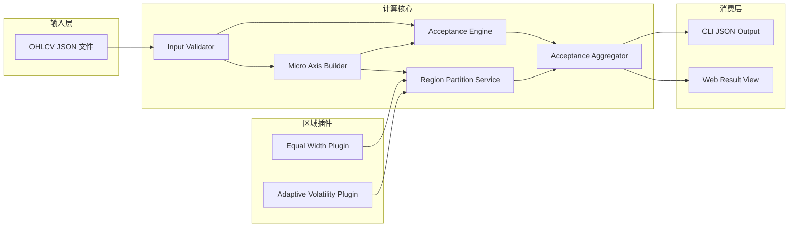
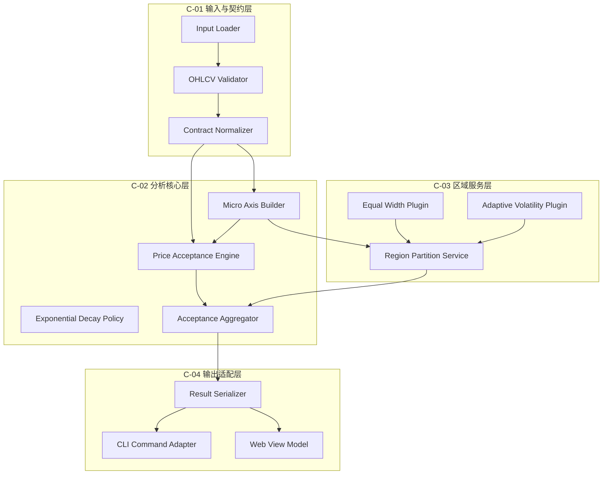
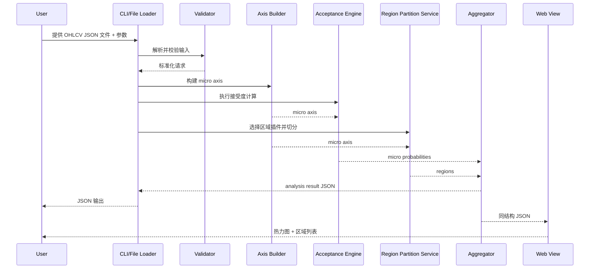

# 架构设计文档

**迭代编号**: 013
**项目名称**: ohlcv-price-acceptance-map
**生成日期**: 2026-03-31
**状态**: Draft

---

## 1. 系统架构概览

本迭代的目标不是构建一个交易执行系统，而是把单交易对、单周期、最近 `N` 根 OHLCV 数据转化为一张可解释的价格接受度地图，并让这份结果同时被 CLI 与 Web 页面消费。

一期架构采用三个核心原则：

1. **纯计算核心优先**
   - 概率计算、区域切分和结果聚合尽量保持无副作用、无外部依赖、无持久化。
2. **插件化区域服务**
   - 核心概率引擎不感知具体区域口径，区域切分通过插件实现。
3. **消费层与计算层分离**
   - CLI 与 Web 只消费统一 JSON 结果，不反向定义算法。

### 1.1 架构范围

### 1.2 非目标边界

- 不提供交易建议、下单信号或仓位控制
- 不实现 Monte Carlo 未来事件概率主链路
- 不引入数据库、任务队列或外部行情依赖
- 不在一期中引入专用 HTTP API

### 1.3 设计约束

| 约束 ID | 约束描述 | 来源 |
|---------|---------|------|
| CON-001 | 单次分析只处理单交易对、单周期、最近 N 根 OHLCV | proposal.md |
| CON-002 | `N >= 1`，输入需升序、连续、字段齐全，默认请求值为 `500` | proposal.md / FT-001 |
| CON-003 | 底层 `micro_bins = 100` | proposal.md / FT-002 |
| CON-004 | 一期时间权重只实现指数衰减 | proposal.md / FT-003 |
| CON-005 | 区域切分必须与核心概率计算分层 | proposal.md / FT-004 |
| CON-006 | 一期必须支持 `equal_width` 与 `adaptive_volatility` 两类区域插件 | proposal.md / FT-005 |
| CON-007 | CLI 默认 `partition_mode = equal_width` | proposal.md / FT-007 |
| CON-008 | Web 页面只消费结果，不定义算法 | proposal.md / FT-008 |

---

## 2. 现有架构继承

### 2.1 当前仓库事实

当前仓库已经具备：

- `docs/iterations/` 的标准迭代落盘结构
- `proposal.md -> feature-spec-index.md -> feature-specs/*.md` 的 ASP 文档链路
- `package.json` 中的文档校验入口
- `powerby/` 作为 Python 包根

当前仓库尚不具备：

- OHLCV 价格接受度计算代码
- 面向该能力的 CLI 命令实现
- 面向该能力的 Web 结果页
- 可复用的领域模型或持久化层

### 2.2 继承策略

| 现有能力 | 架构策略 | 说明 |
|---------|---------|------|
| `powerby/` Python 包 | 继承 | 作为计算核心的主落点 |
| `docs/iterations/013-*` | 继承 | 继续作为单一事实源 |
| `package.json` 文档流程 | 继承 | 保持文档校验与交付检查入口 |
| 领域实现代码 | 新建 | 采用纯计算模块分层 |
| Web 结果页 | 新建 | 作为 JSON 消费层，而非分析主入口 |

---

## 3. 组件划分

### 3.1 组件总览

### 3.2 组件详细设计

#### C-01 输入与契约层

| 组件 | 职责 | 输入 | 输出 |
|------|------|------|------|
| Input Loader | 读取本地 OHLCV JSON 文件 | 文件路径 | 原始 JSON 数据 |
| OHLCV Validator | 校验交易对、周期、时间顺序、OHLC 关系、样本量 | 原始 JSON 数据 | 合法或错误码 |
| Contract Normalizer | 归一化字段类型与价格范围元数据 | 合法输入 | 标准化分析请求 |

#### C-02 分析核心层

| 组件 | 职责 | 输入 | 输出 |
|------|------|------|------|
| Micro Axis Builder | 构建固定 `100` 个 `micro bins` 的底层价格轴 | `price_min` / `price_max` | `micro_axis` |
| Exponential Decay Policy | 计算越近越高的时间权重 | K 线索引、`decay_lambda` | `time_weight` |
| Price Acceptance Engine | 将 `time_weight * volume` 按 `[low, high]` 覆盖范围均匀分配到价格单元 | 标准化 K 线 + `micro_axis` | 底层概率分布 |
| Acceptance Aggregator | 聚合底层概率与区域结果，输出统一 JSON | 底层概率分布 + 区域集合 | 最终分析结果 |

#### C-03 区域服务层

| 组件 | 职责 | 输入 | 输出 |
|------|------|------|------|
| Region Partition Service | 统一管理区域插件选择与合同校验 | `micro_axis` + 模式参数 | 区域集合 |
| Equal Width Plugin | 按固定 `group_size=5` 组宽切分区域 | `micro_axis` | 等宽区域集合 |
| Adaptive Volatility Plugin | 按 `adaptive_group_size = max(1, round(ATR_20 / micro_bin_width))` 切分区域 | `micro_axis` + K 线序列 | 自适应区域集合 |

#### C-04 输出适配层

| 组件 | 职责 | 输入 | 输出 |
|------|------|------|------|
| CLI Command Adapter | 将文件输入和参数透传给分析核心 | 文件路径 + CLI 参数 | 标准输出 JSON |
| Result Serializer | 将分析结果整理为稳定 JSON 契约 | 聚合结果 | 结构化 JSON |
| Web View Model | 将 JSON 结果映射到热力图与区域列表展示 | 分析结果 JSON | 可渲染页面状态 |

---

## 4. 数据流设计

### 4.1 单次分析主流程

### 4.2 核心数据对象

| 对象 | 关键字段 | 说明 |
|------|---------|------|
| `OhlcvCandle` | `timestamp/open/high/low/close/volume` | 单根 K 线标准对象 |
| `AnalysisRequest` | `symbol/timeframe/candles/partition_mode` | 单次分析请求 |
| `MicroBin` | `index/lower_bound/upper_bound/center_price` | 底层价格单元 |
| `MicroAcceptance` | `index/probability/contribution/coverage_count` | 单个底层价格单元的接受度结果 |
| `RegionDefinition` | `region_id/micro_bin_start/micro_bin_end/lower_bound/upper_bound` | 区域插件产出 |
| `AcceptanceMapResult` | `input_summary/params/heatmap/regions` | 最终统一结果 |

---

## 5. 架构决策

### 5.1 决策 A: 计算核心保持无状态

- **决策**: 一期不引入数据库、缓存层、任务队列。
- **原因**:
  - 当前主场景是单交易对、单周期、按需一次性分析
  - 用户主验收目标是算法解释力，而不是大规模并发服务
- **影响**:
  - CLI 可直接调用分析核心
  - Web 页面消费离线或预先计算好的 JSON 结果

### 5.2 决策 B: Web 只消费结果，不承担分析入口

- **决策**: 一期 Web 页面不直接驱动算法执行，只渲染分析结果 JSON。
- **原因**:
  - `proposal.md` 已明确算法优先
  - 这样可以避免在一期里引入额外 API 和服务编排
- **影响**:
  - Web 与 CLI 共用同一结果契约
  - 后续若需要在线分析，再单独扩展 HTTP / RPC 接口

### 5.3 决策 C: 区域服务采用插件化

- **决策**: `equal_width` 与 `adaptive_volatility` 都通过 `Region Partition Service` 接入。
- **原因**:
  - 便于切换区域口径，不污染主概率算法
  - 便于后续新增第三种区域策略
- **影响**:
  - 聚合器只消费统一的 `RegionDefinition`
  - CLI 与 Web 只感知 `partition_mode`

---

## 6. Feature 与架构映射

| Feature ID | 功能名称 | 架构组件 | 复用策略 | 变更类型 |
|-----------|---------|---------|---------|---------|
| FT-001 | OHLCV 输入契约与合法性校验 | C-01 Input Loader / Validator / Normalizer | 新建 | domain |
| FT-002 | Micro Price Axis 构建 | C-02 Micro Axis Builder | 新建 | domain |
| FT-003 | 时间衰减成交量分配引擎 | C-02 Exponential Decay Policy / Price Acceptance Engine | 新建 | domain |
| FT-004 | 区域划分插件框架 | C-03 Region Partition Service | 新建 | orchestration |
| FT-005 | 波动自适应与等宽区域插件 | C-03 Equal Width Plugin / Adaptive Volatility Plugin | 新建 | domain |
| FT-006 | 区域聚合、热力图与诊断输出 | C-02 Acceptance Aggregator / C-04 Result Serializer | 新建 | orchestration |
| FT-007 | CLI JSON 分析入口 | C-04 CLI Command Adapter | 扩展 `powerby/` | entry |
| FT-008 | Web 可视化结果页 | C-04 Web View Model | 新建 | entry |

---

## 7. 实现锚点规划

以下为架构阶段建议的实现锚点，仅用于 `D-16` 追溯，不代表当前仓库已存在这些文件：

| 类型 | 规划路径 | 作用 |
|------|---------|------|
| Domain Contract | `powerby/acceptance_map/contracts.py` | 定义输入、价格轴、区域、输出契约 |
| Input Validation | `powerby/acceptance_map/validation.py` | FT-001 |
| Axis Builder | `powerby/acceptance_map/axis.py` | FT-002 |
| Decay Policy | `powerby/acceptance_map/decay.py` | FT-003 |
| Acceptance Engine | `powerby/acceptance_map/engine.py` | FT-003 |
| Region Service | `powerby/acceptance_map/regions/service.py` | FT-004 |
| Equal Width Plugin | `powerby/acceptance_map/regions/equal_width.py` | FT-005 |
| Adaptive Plugin | `powerby/acceptance_map/regions/adaptive_volatility.py` | FT-005 |
| Aggregator | `powerby/acceptance_map/aggregation.py` | FT-006 |
| Result Serializer | `powerby/acceptance_map/serializer.py` | FT-006 |
| CLI Entry | `powerby/cli/acceptance_map.py` | FT-007 |
| Web View | `web/acceptance-map/index.html` / `web/acceptance-map/app.js` | FT-008 |
| Tests | `tests/acceptance_map/` | 覆盖 FT-001 ~ FT-008 |

---

## 8. 架构结论

一期架构采用“**纯计算核心 + 区域插件 + 结果消费层**”三段式结构：

- `powerby/acceptance_map/` 承载全部领域计算与结果聚合
- `Region Partition Service` 隔离区域口径变化
- CLI 负责触发分析与返回 JSON
- Web 负责消费结果与可视化

这个结构满足当前产品文档的主目标，也保留了后续扩展在线服务、更多区域插件和更多可视化形式的空间。

---

**文档状态**: Draft
**阶段归属**: DESIGNING 阶段主产物
