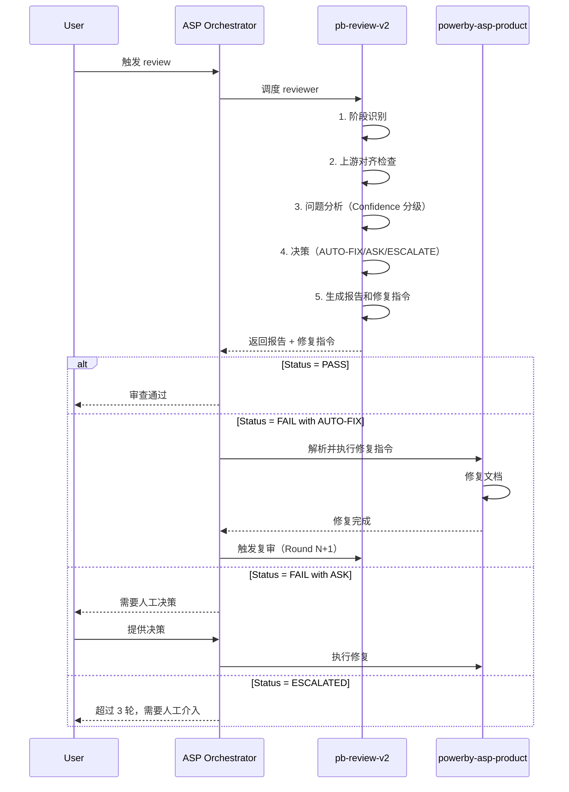
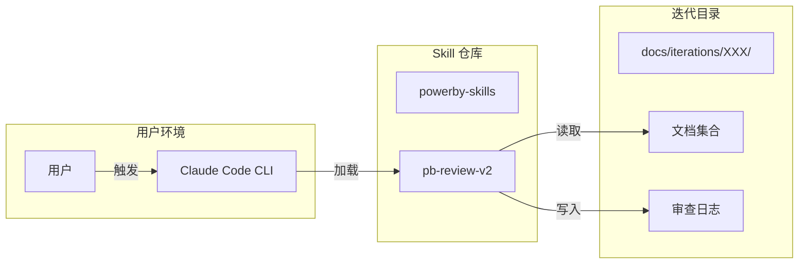

# Architecture: PowerBy ASP 通用 Review Skill 升级

## 1. 架构概述

### 1.1 系统定位
PowerBy ASP Reviewer 是一个通用的、智能的、可自动修复的 ASP 文档审查系统。它不是传统的业务系统，而是一个 **Skill 能力包**，遵循 `docs/skill-design-protocol.md` 的七层结构框架。

### 1.2 核心价值
- **自动对齐**：先检查上游文档对齐，避免基于错误输入做审查
- **智能决策**：基于 Confidence 分级和证据链驱动，自动决策 AUTO-FIX / ASK / ESCALATE
- **指令化修复**：输出结构化修复指令，由编排器调度对应 skill 执行
- **自动复审**：支持多轮 review loop，3 轮内自动收敛

### 1.3 架构原则
1. **Reviewer + Fixer 分离**：Reviewer 只输出审查报告和修复指令，不直接修改文档
2. **协议化设计**：不限定特定 AI 后端，任何遵循协议的审查员都能接入
3. **策略层优先**：判断哲学写在 SKILL.md，差异化配置写在 references/
4. **测试化内建**：所有决策表、审查清单都可被单元测试验证

## 2. 系统架构

### 2.1 整体架构图

```mermaid
graph TB
    subgraph "ASP 主编排器"
        Orchestrator[ASP Orchestrator]
    end
    
    subgraph "Reviewer Skill"
        Entry[Skill Entry Point]
        StageDetector[阶段识别器]
        AlignmentChecker[对齐检查器]
        FindingsAnalyzer[问题分析器]
        DecisionEngine[决策引擎]
        ReportGenerator[报告生成器]
    end
    
    subgraph "References 配置"
        ProductChecklist[product-checklist.md]
        SpecChecklist[spec-checklist.md]
        ArchChecklist[arch-checklist.md]
        PlanChecklist[plan-checklist.md]
        ImplChecklist[impl-checklist.md]
        DecisionTable[decision-table.md]
        AuditTemplate[audit-template.md]
    end
    
    subgraph "输入文档"
        DesignBrief[design-brief.md]
        Proposal[proposal.md]
        FeatureIndex[feature-spec-index.md]
        FeatureSpecs[feature-specs/*.md]
        Architecture[architecture.md]
        HistoryLogs[{stage}_logs/]
    end
    
    subgraph "输出产物"
        AuditReport[{stage}_logs/round-N-claude.md]
        FixInstructions[修复指令]
    end
    
    subgraph "Fixer Skills"
        ProductFixer[powerby-asp-product]
        ArchitectFixer[powerby-asp-architect]
    end
    
    Orchestrator -->|调度| Entry
    Entry --> StageDetector
    StageDetector -->|加载对应清单| ProductChecklist
    StageDetector -->|加载对应清单| SpecChecklist
    StageDetector -->|加载对应清单| ArchChecklist
    StageDetector -->|加载对应清单| PlanChecklist
    StageDetector -->|加载对应清单| ImplChecklist
    StageDetector -->|识别阶段| AlignmentChecker
    
    AlignmentChecker -->|读取上游| DesignBrief
    AlignmentChecker -->|读取上游| Proposal
    AlignmentChecker -->|读取上游| FeatureIndex
    AlignmentChecker -->|读取上游| FeatureSpecs
    AlignmentChecker -->|读取上游| Architecture
    AlignmentChecker -->|读取历史| HistoryLogs
    AlignmentChecker -->|对齐结果| FindingsAnalyzer
    
    FindingsAnalyzer -->|问题清单| DecisionEngine
    DecisionEngine -->|加载决策表| DecisionTable
    DecisionEngine -->|决策结果| ReportGenerator
    
    ReportGenerator -->|加载模板| AuditTemplate
    ReportGenerator -->|生成报告| AuditReport
    ReportGenerator -->|生成指令| FixInstructions
    
    Orchestrator -->|解析指令| ProductFixer
    Orchestrator -->|解析指令| ArchitectFixer
    ProductFixer -->|修复文档| Proposal
    ArchitectFixer -->|修复文档| Architecture
    
    ProductFixer -->|触发复审| Entry
    ArchitectFixer -->|触发复审| Entry
```

### 2.2 核心组件说明

#### 2.2.1 阶段识别器（StageDetector）
**职责**：根据迭代目录内容自动判断当前处于哪个 ASP 阶段

**输入**：
- 迭代目录路径

**输出**：
```yaml
stage: enum [product, spec, architecture, plan, implementation]
review_target: string  # 主审查对象文件
upstream_chain: array  # 上游产物链
```

**识别规则**：
- 有 `architecture.md` → architecture 阶段
- 有 `feature-spec-index.md` + `feature-specs/*.md` → spec 阶段
- 有 `proposal.md` → product 阶段
- 有 `tasks.md` 或 `implementation-plan.md` → plan 阶段
- 有 `implementation/` 目录 → implementation 阶段

#### 2.2.2 对齐检查器（AlignmentChecker）
**职责**：检查当前文档是否与上游文档对齐

**输入**：
- 当前阶段
- 当前文档
- 上游文档链

**输出**：
```yaml
alignment_summary:
  upstream_complete: boolean  # 上游定义是否完整覆盖
  downstream_clean: boolean   # 当前文档是否无溢出
  gaps: array                 # 缺口清单
    - type: enum [missing, overflow, conflict]
      description: string
      evidence: string
  status: enum [PASS, FAIL]
```

**对齐链映射**：
- product 阶段：`design-brief.md` → `proposal.md`
- spec 阶段：`proposal.md` → `feature-spec-index.md` + `feature-specs/*.md`
- architecture 阶段：`proposal.md` + `feature-specs/*.md` → `architecture.md`
- plan 阶段：`architecture.md` → `tasks.md`
- implementation 阶段：`tasks.md` → 代码实现

#### 2.2.3 问题分析器（FindingsAnalyzer）
**职责**：基于审查清单发现问题，并进行 Confidence 分级

**输入**：
- 当前阶段
- 审查清单（从 references/ 加载）
- 当前文档
- 上游文档

**输出**：
```yaml
findings: array
  - id: string
    severity: enum [BLOCKER, MAJOR, MINOR]
    confidence: enum [C1, C2, C3, C4]
    description: string
    evidence: array
    location: string
```

**Confidence 分级规则**：
- **C1（猜测）**：基于经验推断，无直接证据
- **C2（推理）**：基于间接证据推理
- **C3（观察）**：基于直接观察到的事实
- **C4（明确）**：基于协议明确规定或文件缺失

#### 2.2.4 决策引擎（DecisionEngine）
**职责**：基于 Confidence 分级和证据链，决策 AUTO-FIX / ASK / ESCALATE

**输入**：
- Finding（包含 severity, confidence, evidence）
- Context（包含 stage, round, scope）

**输出**：
```yaml
decision: enum [AUTO-FIX, ASK, ESCALATE]
reason: string
fix_instruction: object (仅 AUTO-FIX)
  - finding_id: string
    target_doc: string
    fix_action: string
    evidence_summary: array
    verification: string
```

**决策表**（存储在 `references/decision-table.md`）：

| Confidence | Severity | Round | 职责范围 | 证据充分 | 决策 |
|-----------|---------|-------|---------|---------|------|
| C1/C2 | 任意 | 任意 | 任意 | 任意 | ASK |
| C3/C4 | BLOCKER | ≤3 | 职责内 | 是 | AUTO-FIX |
| C3/C4 | MAJOR | ≤3 | 职责内 | 是 | AUTO-FIX |
| C3/C4 | MINOR | ≤3 | 职责内 | 是 | AUTO-FIX |
| C3/C4 | 任意 | ≤3 | 职责外 | 任意 | ASK |
| C3/C4 | 任意 | ≤3 | 职责内 | 否 | ASK |
| 任意 | 任意 | >3 | 任意 | 任意 | ESCALATE |

**Boil the Lake 规则**：
- 职责内 + C3/C4 + 证据充分 → **必须** AUTO-FIX，不允许 defer

#### 2.2.5 报告生成器（ReportGenerator）
**职责**：生成统一格式的审查报告和修复指令

**输入**：
- Alignment Summary
- Findings
- Decisions
- 审查模板（从 references/ 加载）

**输出**：
- `{stage}_logs/round-{N}-claude.md`（审查报告）
- 修复指令（嵌入在报告中或单独文件）

### 2.3 数据流设计



## 3. 关键技术决策

### 3.1 决策 1：单一 Skill vs 多个 Skill

**选择**：单一 `pb-review-v2` skill

**理由**：
- 5 个阶段的审查逻辑高度相似（对齐 → 发现 → 决策 → 报告）
- 差异化部分通过 `references/` 配置文件处理
- 降低维护成本，避免代码重复
- 符合 CON-004 约束（SKILL.md 正文不超过 200 行）

**备选方案**：
- 方案 B：5 个独立 skill（`powerby-asp-product-reviewer`, `powerby-asp-arch-reviewer` 等）
- 缺点：代码重复，维护成本高

### 3.2 决策 2：Reviewer + Fixer 分离 vs 一体化

**选择**：Reviewer + Fixer 分离

**理由**：
- 符合单一职责原则
- Reviewer 专注于审查和决策，Fixer 专注于修复
- 支持不同阶段使用不同的 Fixer（product 用 powerby-asp-product，architecture 用 powerby-asp-architect）
- 符合 EXC-007 排除项

**备选方案**：
- 方案 B：Reviewer 直接修改文档
- 缺点：职责混乱，难以测试，违反排除项

### 3.3 决策 3：协议化 vs 绑定特定 AI 后端

**选择**：协议化设计

**理由**：
- 符合 REQ-006（AI Reviewer 协议化）
- 支持 Claude 和 Codex 等多种审查员
- 输入输出格式标准化，易于集成
- 符合 EXC-009 排除项

**备选方案**：
- 方案 B：只支持 Claude
- 缺点：灵活性差，无法利用 Codex 的优势

### 3.4 决策 4：决策表存储位置

**选择**：存储在 `references/decision-table.md`

**理由**：
- 符合 skill-design-protocol 的策略层设计
- 决策表可被单元测试验证
- 易于维护和更新
- 不需要外部脚本

**备选方案**：
- 方案 B：硬编码在 SKILL.md 中
- 缺点：难以维护，违反 CON-005（不允许脚本外包抽象判断）

### 3.5 决策 5：Review Loop 控制

**选择**：最多 3 轮，第 4 轮强制 ESCALATE

**理由**：
- 符合 REQ-013
- 平衡质量和效率
- 避免无限循环
- 3 轮足够覆盖大部分场景

**备选方案**：
- 方案 B：无限循环直到 PASS
- 缺点：可能陷入死循环，效率低

## 4. 组件详细设计

### 4.1 Skill 文件结构

```
skills/pb-review-v2/
├── SKILL.md                    # 主文件（遵循七层结构框架）
└── references/
    ├── audit-checklist-ref.md  # 通用审查清单摘要
    ├── product-checklist.md    # 产品阶段审查清单
    ├── spec-checklist.md       # 规格阶段审查清单
    ├── arch-checklist.md       # 架构阶段审查清单
    ├── plan-checklist.md       # 计划阶段审查清单
    ├── impl-checklist.md       # 实现阶段审查清单
    ├── decision-table.md       # AUTO-FIX/ASK/ESCALATE 决策表
    └── audit-template.md       # 审查报告模板
```

### 4.2 SKILL.md 结构（七层框架）

```markdown
---
name: pb-review-v2
description: ASP 文档的自动化审计程序
compatibility: [claude-code, local-filesystem]
---

# pb-review-v2

## Purpose
对 ASP 文档做审查收敛，输出机器可读的审查报告

## Success criteria
- 审查输入切换为 design-brief.md、proposal.md、feature-specs/*.md
- 报告明确给出 Reviewer、Round、Status
- 完成宪法符合性、双向覆盖、逻辑自洽三维检查

## Strategy
1. 先确认成功标准
2. 优先用上游链路做覆盖核查
3. 把历史记录当作收敛证据
4. 满足报告契约后停止

## Tools and capability boundaries
- 可以读取文档和历史记录
- 可以输出审查报告
- 不修改被审查文档

## Important facts and constraints
- design-brief.md 是前置探讨事实源
- proposal.md 是范围边界
- 双向覆盖既检查 REQ → Feature，也检查 Feature → REQ

## Workflow
1. 读取审查清单和历史记录
2. 校验输入文档齐备性
3. 执行对齐检查、宪法符合性、双向覆盖、逻辑自洽
4. 输出问题清单和行动要求

## Output format
- {stage}_logs/round-{N}-claude.md

## Resources
- references/audit-checklist-ref.md
- docs/asp-document-protocol.md

## Subtask / parallelism guidance
- 可以并行读取历史记录和规格卡
- 审查结论必须统一汇总

## Examples
- design-brief.md 与 proposal.md 锁定后做第一轮审查

## Safety
- 不允许审查旧协议文档集
- 不允许把缺失输入静默视为通过
```

### 4.3 决策表详细设计（references/decision-table.md）

```markdown
# AUTO-FIX / ASK / ESCALATE 决策表

## 决策规则

### 规则 1：C1/C2 问题禁止 AUTO-FIX
**条件**：Confidence = C1 或 C2
**决策**：ASK
**理由**：猜测性或推理性问题不应自动修复

### 规则 2：职责外问题 ASK
**条件**：问题超出 reviewer 职责范围
**决策**：ASK
**理由**：不越权修改

### 规则 3：证据不足 ASK
**条件**：证据维度 < 2
**决策**：ASK
**理由**：避免猜测性修复

### 规则 4：Boil the Lake
**条件**：职责内 + C3/C4 + 证据充分
**决策**：AUTO-FIX（必须）
**理由**：有能力修复的问题必须修复，不允许 defer

### 规则 5：超过 3 轮 ESCALATE
**条件**：Round > 3
**决策**：ESCALATE
**理由**：避免无限循环

## 职责范围定义

### Reviewer 职责内
- 文档格式问题
- 字段缺失问题
- 追溯链断裂问题
- 协议违规问题

### Reviewer 职责外
- 业务逻辑决策
- 架构选型决策
- 技术方案选择
- 需求优先级调整
```

### 4.4 审查清单设计（references/product-checklist.md）

```markdown
# 产品阶段审查清单

## 1. 前置探讨追溯
- [ ] design-brief.md 存在
- [ ] proposal.md 第 0 节存在
- [ ] 目标、验证方式、推荐方向一致

## 2. 宪法符合性
- [ ] 零假设原则
- [ ] 简单性原则
- [ ] 顾问式流程
- [ ] 测试驱动

## 3. 双向覆盖
- [ ] REQ → Feature 覆盖率 100%
- [ ] Feature → REQ 覆盖率 100%
- [ ] 排除项未在规格中重新出现

## 4. 逻辑自洽
- [ ] 需求内部一致性
- [ ] Feature 规格完整性
- [ ] 测试化完整性
```

## 5. 部署与运维

### 5.1 部署架构



### 5.2 性能要求
- 单次审查响应时间：< 2 分钟（产品阶段）
- 单次审查响应时间：< 5 分钟（架构阶段）
- 并发支持：单用户单迭代（无并发需求）

### 5.3 可观测性
- 审查日志：`{stage}_logs/round-{N}-claude.md`
- 修复记录：嵌入在审查报告中
- 复审记录：`{stage}_logs/round-{N}-review-result.md`（可选）

### 5.4 错误处理
- 文档缺失：输出 FAIL 报告，明确指出缺失文件
- 格式错误：尽力解析，无法解析时输出 FAIL 报告
- 超时：第 4 轮自动 ESCALATE

## 6. 测试策略

### 6.1 单元测试
- 阶段识别器：5 个阶段识别测试
- 对齐检查器：上游对齐测试
- 决策引擎：决策表规则测试
- 报告生成器：格式验证测试

### 6.2 集成测试
- 完整 review loop 测试（Round 1 → Round 2 → PASS）
- 超限 ESCALATE 测试（Round 4 自动 ESCALATE）
- 多阶段测试（product → spec → architecture）

### 6.3 验收测试
- 一次通过率 > 80%
- 自动修复率 > 60%
- 平均收敛轮次 ≤ 2 轮

## 7. 风险与缓解

### 7.1 风险 1：决策表规则冲突
**风险**：不同规则可能产生冲突决策
**缓解**：
- 规则按优先级排序
- 单元测试覆盖所有规则组合
- 冲突时优先选择保守决策（ASK > AUTO-FIX）

### 7.2 风险 2：无限循环
**风险**：AUTO-FIX 可能引入新问题，导致无限循环
**缓解**：
- 第 4 轮强制 ESCALATE
- 每轮记录修复内容，避免重复修复同一问题
- 复审时验证修复效果

### 7.3 风险 3：证据链不足
**风险**：某些问题难以找到充分证据
**缓解**：
- 证据不足时选择 ASK
- 不强制要求所有问题都 AUTO-FIX
- 允许人工介入

### 7.4 风险 4：跨阶段一致性
**风险**：产品阶段和架构阶段的规格卡可能不一致
**缓解**：
- 架构阶段只补充 D-09~D-16，不修改 D-01~D-08
- 架构审查时验证与产品阶段的一致性
- 冲突时以产品阶段为准

## 8. 未来扩展

### 8.1 Phase 1（MVP）：产品阶段
- 实现产品阶段的完整 review loop
- 验证核心机制（阶段识别、对齐、决策、修复指令）

### 8.2 Phase 2（扩展）：全阶段支持
- 扩展到 spec、architecture、plan、implementation 阶段
- 补充 5 个阶段的差异化审查清单

### 8.3 Phase 3（优化）：智能化提升
- 根据历史数据优化决策表
- 引入机器学习提升 Confidence 分级准确率
- 支持自定义审查清单

---

**架构设计完成时间**: 2026-03-31
**设计者**: Claude (powerby-asp-architect)
**版本**: 1.0.0
