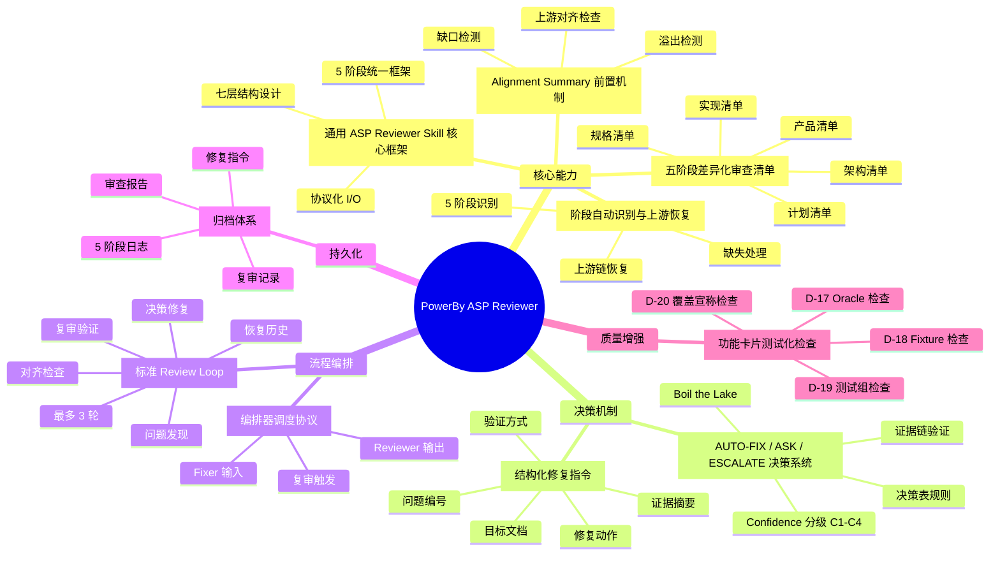
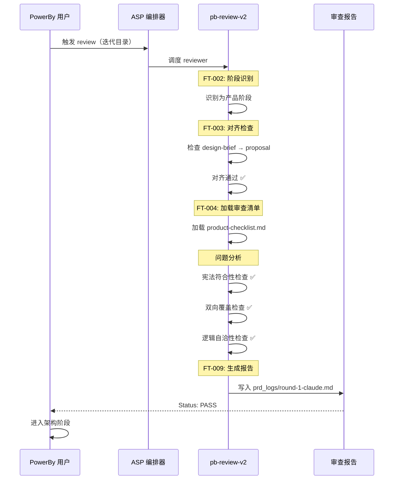
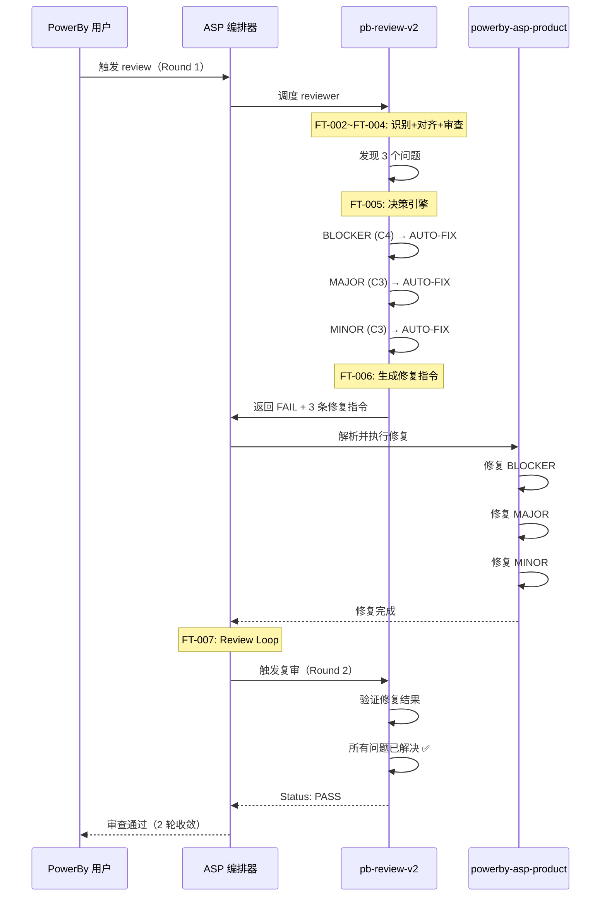
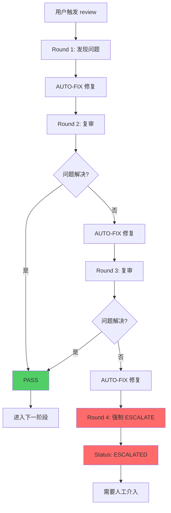

# Product Panorama: PowerBy ASP 通用 Review Skill 升级

**版本**: 1.0.0  
**生成日期**: 2026-03-31  
**基于文档**: proposal.md, feature-spec-index.md, feature-specs/*.md

---

## 1. 功能全景树

## 2. 核心用户旅程

### 2.1 主成功路径：首次审查通过

### 2.2 典型路径：多轮修复收敛

### 2.3 异常路径：超限 ESCALATE

## 3. 决策摘要

### 3.1 核心架构决策

| 决策点 | 选择 | 理由 | 风险 |
|--------|------|------|------|
| **体系定位** | 全新独立体系 | 与 pb-review 并行，不引入复杂依赖 | 初期开发工作量较大 |
| **Skill 拆分** | 单一通用 skill | 5 阶段逻辑相似，通过 references/ 差异化 | 单文件复杂度较高 |
| **修复模式** | Reviewer + Fixer 分离 | 职责单一，支持不同阶段不同 Fixer | 需要编排器协调 |
| **AI 后端** | 协议化设计 | 支持 Claude/Codex 等多种审查员 | 协议维护成本 |
| **Review Loop** | 最多 3 轮 | 平衡质量和效率，避免无限循环 | 可能有极端情况需要 >3 轮 |

### 3.2 关键技术选型

| 技术点 | 选择 | 备选方案 |
|--------|------|---------|
| **决策表存储** | references/decision-table.md | 硬编码在 SKILL.md |
| **审查清单** | 5 个独立 references/ 文件 | 单一通用清单 |
| **报告格式** | Markdown + YAML | JSON |
| **阶段识别** | 基于文件存在性 | 基于用户输入 |
| **对齐检查** | 上游链映射表 | 人工指定 |

### 3.3 MVP 范围与分期

**Phase 1（MVP）**：产品阶段完整 review loop
- ✅ 阶段识别（只识别产品阶段）
- ✅ 上游对齐（design-brief.md → proposal.md）
- ✅ 决策引擎（AUTO-FIX / ASK / ESCALATE）
- ✅ 修复指令生成
- ✅ Review Loop（最多 3 轮）

**Phase 2（扩展）**：全阶段支持
- 补充 5 个阶段的差异化审查清单
- 完善阶段识别逻辑
- 完善上游对齐链

**Phase 3（优化）**：智能化提升
- 根据历史数据优化决策表
- 提升 Confidence 分级准确率
- 支持自定义审查清单

### 3.4 风险与缓解

| 风险 | 严重度 | 缓解措施 | 状态 |
|------|--------|---------|------|
| **决策表规则冲突** | 中 | 规则按优先级排序，单元测试覆盖 | ✅ 已缓解 |
| **无限循环** | 高 | 第 4 轮强制 ESCALATE | ✅ 已缓解 |
| **证据链不足** | 中 | 证据不足时选择 ASK | ✅ 已缓解 |
| **跨阶段一致性** | 中 | 架构阶段只补 D-09~D-16 | ✅ 已缓解 |

### 3.5 成功指标

| 指标 | 目标值 | 当前状态 | 验证方式 |
|------|--------|---------|---------|
| **一次通过率** | > 80% | 待验证 | 统计 Round 1 PASS 比例 |
| **自动修复率** | > 60% | 待验证 | 统计 AUTO-FIX 成功率 |
| **平均收敛轮次** | ≤ 2 轮 | 待验证 | 统计平均 Round 数 |
| **ESCALATE 率** | < 5% | 待验证 | 统计 Round 4 比例 |

### 3.6 排除项提示

以下功能**明确排除**，不在本次升级范围内：

- ❌ 与 pb-review 体系兼容映射
- ❌ 独立编排器 skill
- ❌ CI/CD 自动化集成
- ❌ 自动化测试生成
- ❌ P0-P8 兼容
- ❌ 统计面板 / metrics 可视化
- ❌ Reviewer 直接修改文档
- ❌ 脚本化抽象判断
- ❌ 限定特定 AI 后端

---

**生成工具**: powerby-asp-visualizer  
**数据来源**: proposal.md, feature-spec-index.md, feature-specs/*.md  
**审查状态**: 产品阶段 PASS (Round 2), 架构阶段 PASS (Round 1)
