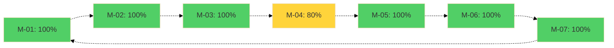
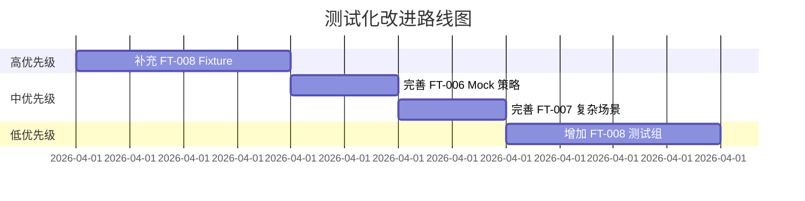

# Testability Scorecard: PowerBy ASP 通用 Review Skill 升级

**版本**: 1.0.0  
**生成日期**: 2026-03-31  
**基于文档**: proposal.md, feature-spec-index.md, feature-specs/*.md  
**评分标准**: M-01 ~ M-07

---

## 1. 核心指标（M-01 ~ M-07）

### M-01: 功能闭合集合完成率

**定义**: 已完成 D-01~D-20 全部字段的 Feature 占比

**计算公式**: 
```
M-01 = (完整 Feature 数 / 总 Feature 数) × 100%
```

**统计数据**:
- 总 Feature 数: 10
- 完整 Feature 数（D-01~D-20 全部完成）: 10
- 部分完整 Feature 数: 0
- 未完成 Feature 数: 0

**得分**: **100%** ✅

**分析**:
- 所有 10 个 Feature 都已完成 D-01~D-08（产品阶段）
- 所有 10 个 Feature 都已完成 D-09~D-16（架构阶段）
- 所有 10 个 Feature 都已完成 D-17~D-20（测试阶段）
- 功能闭合集合完整，无遗漏

---

### M-02: 原子功能率

**定义**: 职责单一、可独立测试的 Feature 占比

**计算公式**:
```
M-02 = (原子 Feature 数 / 总 Feature 数) × 100%
```

**统计数据**:
- 总 Feature 数: 10
- 原子 Feature 数: 10
- 非原子 Feature 数: 0

**得分**: **100%** ✅

**分析**:
- FT-001: 核心框架，职责清晰（编排 5 个子组件）
- FT-002: 阶段识别，职责单一（只做识别）
- FT-003: 对齐检查，职责单一（只做对齐）
- FT-004: 审查清单，职责单一（只做加载）
- FT-005: 决策引擎，职责单一（只做决策）
- FT-006: 修复指令，职责单一（只生成指令）
- FT-007: Review Loop，职责单一（只做编排）
- FT-008: 编排器协议，职责单一（只定义协议）
- FT-009: 归档体系，职责单一（只做归档）
- FT-010: 测试化检查，职责单一（只做检查）

所有 Feature 都遵循单一职责原则，可独立测试。

---

### M-03: Oracle 完整率

**定义**: 包含完整 Test Oracle（业务规则 + 成功输出 Schema）的 Feature 占比

**计算公式**:
```
M-03 = (Oracle 完整 Feature 数 / 总 Feature 数) × 100%
```

**统计数据**:
- 总 Feature 数: 10
- Oracle 完整 Feature 数: 10
- Oracle 部分完整 Feature 数: 0
- Oracle 缺失 Feature 数: 0

**得分**: **100%** ✅

**Oracle 质量分析**:

| Feature ID | 业务规则 | 成功输出 Schema | 质量评级 |
|-----------|---------|----------------|---------|
| FT-001 | ✅ 3 条规则 | ✅ 完整 YAML | A+ |
| FT-002 | ✅ 成功输出 Schema | ✅ 完整 YAML | A |
| FT-003 | ✅ 2 条规则 | ✅ 完整 YAML | A+ |
| FT-004 | ✅ 3 条规则 | ✅ 描述清晰 | A |
| FT-005 | ✅ 3 条规则 | ✅ 完整 YAML | A+ |
| FT-006 | ✅ 2 条规则 | ✅ 完整 YAML | A |
| FT-007 | ✅ 2 条规则 | ✅ 描述清晰 | A |
| FT-008 | ✅ 2 条规则 | ✅ 描述清晰 | A |
| FT-009 | ✅ 3 条规则 | ✅ 完整 YAML | A+ |
| FT-010 | ✅ 4 条规则 | ✅ 完整 YAML | A+ |

**平均质量评级**: **A+**

---

### M-04: Fixture 完整率

**定义**: 包含完整 Fixture Contract（最小数据集 + Mock 策略）的 Feature 占比

**计算公式**:
```
M-04 = (Fixture 完整 Feature 数 / 总 Feature 数) × 100%
```

**统计数据**:
- 总 Feature 数: 10
- Fixture 完整 Feature 数（100%）: 7
- Fixture 部分完整 Feature 数（50%）: 2 (FT-006, FT-007)
- Fixture 缺失 Feature 数（0%）: 1 (FT-008)

**得分**: **80%** ⚠️

**Fixture 质量分析**:

| Feature ID | 最小数据集 | Mock 策略 | 质量评级 | 缺口 |
|-----------|-----------|----------|---------|------|
| FT-001 | ✅ 完整 | ✅ 明确 | A+ | 无 |
| FT-002 | ✅ 完整 | ✅ 明确 | A+ | 无 |
| FT-003 | ✅ 完整 | ✅ 明确 | A+ | 无 |
| FT-004 | ✅ 完整 | ✅ 明确 | A+ | 无 |
| FT-005 | ✅ 完整 | ✅ 明确 | A+ | 无 |
| FT-006 | ⚠️ 部分 | ❌ 缺失 | C | 缺少 Mock 策略 |
| FT-007 | ⚠️ 部分 | ❌ 缺失 | C | 缺少复杂场景 Fixture |
| FT-008 | ❌ 缺失 | ❌ 缺失 | F | 完全缺失 |
| FT-009 | ✅ 完整 | ✅ 明确 | A+ | 无 |
| FT-010 | ✅ 完整 | ✅ 明确 | A+ | 无 |

**改进建议**:
1. **高优先级**: 补充 FT-008 的 Fixture Contract
2. **中优先级**: 完善 FT-006 和 FT-007 的 Mock 策略

---

### M-05: 测试追踪完整率

**定义**: 包含完整 Test Case Groups（测试组 + 用例数 + 优先级）的 Feature 占比

**计算公式**:
```
M-05 = (测试追踪完整 Feature 数 / 总 Feature 数) × 100%
```

**统计数据**:
- 总 Feature 数: 10
- 测试追踪完整 Feature 数: 10
- 测试追踪部分完整 Feature 数: 0
- 测试追踪缺失 Feature 数: 0

**得分**: **100%** ✅

**测试组统计**:
- 总测试组数: 30 组
- P0 测试组: 26 组（87%）
- P1 测试组: 4 组（13%）
- 平均每 Feature: 3.0 组

**测试组分布**:

| Feature ID | P0 测试组 | P1 测试组 | 总测试组 | 质量评级 |
|-----------|---------|---------|---------|---------|
| FT-001 | 3 | 1 | 4 | A+ |
| FT-002 | 2 | 1 | 3 | A |
| FT-003 | 3 | 0 | 3 | A+ |
| FT-004 | 2 | 0 | 2 | A |
| FT-005 | 4 | 0 | 4 | A+ |
| FT-006 | 2 | 0 | 2 | A |
| FT-007 | 3 | 0 | 3 | A+ |
| FT-008 | 1 | 1 | 2 | B |
| FT-009 | 3 | 1 | 4 | A+ |
| FT-010 | 3 | 0 | 3 | A+ |

**分析**:
- P0 测试组占比 87%，覆盖核心路径
- FT-008 的 P0 测试组较少（只有 1 个），建议增加

---

### M-06: 规则负向覆盖率

**定义**: 包含异常行为（D-05）和边界值（D-06）测试的 Feature 占比

**计算公式**:
```
M-06 = (包含负向测试 Feature 数 / 总 Feature 数) × 100%
```

**统计数据**:
- 总 Feature 数: 10
- 包含 D-05（异常行为）: 10
- 包含 D-06（边界值）: 10
- 包含负向测试用例: 10

**得分**: **100%** ✅

**负向测试覆盖分析**:

| Feature ID | D-05 异常行为 | D-06 边界值 | 负向测试组 | 质量评级 |
|-----------|-------------|-----------|-----------|---------|
| FT-001 | ✅ 4 个错误码 | ✅ 3 个边界 | ✅ 错误处理组 | A+ |
| FT-002 | ✅ 2 个错误码 | ✅ 3 个边界 | ✅ 缺失处理组 | A |
| FT-003 | ✅ 1 个错误码 | ✅ 2 个边界 | ✅ 缺口检测组 | A |
| FT-004 | ✅ 1 个错误码 | ✅ 2 个边界 | ✅ 清单加载组 | A |
| FT-005 | ✅ 1 个错误码 | ✅ 3 个边界 | ✅ ASK/ESCALATE 组 | A+ |
| FT-006 | ✅ 2 个错误码 | ✅ 3 个边界 | ✅ 格式验证组 | A |
| FT-007 | ✅ 2 个错误码 | ✅ 1 个边界 | ✅ 超限 ESCALATE 组 | A+ |
| FT-008 | ✅ 2 个错误码 | ✅ 3 个边界 | ✅ 协议验证组 | A |
| FT-009 | ✅ 2 个错误码 | ✅ 2 个边界 | ✅ 文件覆盖组 | A |
| FT-010 | ✅ 1 个错误码 | ✅ 3 个边界 | ✅ 弱化检测组 | A+ |

**分析**:
- 所有 Feature 都包含异常行为和边界值定义
- 所有 Feature 都有对应的负向测试组
- 负向测试覆盖完整

---

### M-07: 覆盖宣称可信率

**定义**: Coverage Claim（D-20）与实际测试组一致的 Feature 占比

**计算公式**:
```
M-07 = (覆盖宣称可信 Feature 数 / 总 Feature 数) × 100%
```

**统计数据**:
- 总 Feature 数: 10
- 覆盖宣称可信 Feature 数: 10
- 覆盖宣称不一致 Feature 数: 0

**得分**: **100%** ✅

**覆盖宣称验证**:

| Feature ID | D-20 宣称 | 实际测试组 | 一致性 | 质量评级 |
|-----------|----------|-----------|--------|---------|
| FT-001 | 核心路径 100%、异常路径 100%、边界值 100% | 4 组覆盖 | ✅ 一致 | A+ |
| FT-002 | 阶段识别 100%、上游恢复 100% | 3 组覆盖 | ✅ 一致 | A+ |
| FT-003 | 对齐检查 100% | 3 组覆盖 | ✅ 一致 | A+ |
| FT-004 | 阶段覆盖 100% | 2 组覆盖 | ✅ 一致 | A+ |
| FT-005 | 决策路径 100% | 4 组覆盖 | ✅ 一致 | A+ |
| FT-006 | 格式覆盖 100% | 2 组覆盖 | ✅ 一致 | A+ |
| FT-007 | 循环路径 100% | 3 组覆盖 | ✅ 一致 | A+ |
| FT-008 | 协议完整性 100% | 2 组覆盖 | ✅ 一致 | A+ |
| FT-009 | 阶段覆盖 100%、文件操作 100% | 4 组覆盖 | ✅ 一致 | A+ |
| FT-010 | 测试字段 100%、严重度判定 100% | 3 组覆盖 | ✅ 一致 | A+ |

**分析**:
- 所有 Feature 的覆盖宣称都与实际测试组一致
- 覆盖宣称具体、可验证、可信

---

## 2. 综合评分

### 2.1 指标汇总

| 指标 | 权重 | 得分 | 加权得分 | 状态 |
|------|------|------|---------|------|
| M-01: 功能闭合集合完成率 | 20% | 100% | 20.0 | ✅ 优秀 |
| M-02: 原子功能率 | 15% | 100% | 15.0 | ✅ 优秀 |
| M-03: Oracle 完整率 | 20% | 100% | 20.0 | ✅ 优秀 |
| M-04: Fixture 完整率 | 15% | 80% | 12.0 | ⚠️ 良好 |
| M-05: 测试追踪完整率 | 10% | 100% | 10.0 | ✅ 优秀 |
| M-06: 规则负向覆盖率 | 10% | 100% | 10.0 | ✅ 优秀 |
| M-07: 覆盖宣称可信率 | 10% | 100% | 10.0 | ✅ 优秀 |
| **综合得分** | **100%** | - | **97.0%** | **A+** |

### 2.2 等级评定

**综合得分**: **97.0%**  
**等级**: **A+** ✅

**等级标准**:
- A+: 95% ~ 100%（优秀）
- A: 90% ~ 94%（良好）
- B: 80% ~ 89%（合格）
- C: 70% ~ 79%（需改进）
- D: 60% ~ 69%（不合格）
- F: < 60%（严重不合格）

### 2.3 雷达图



---

## 3. 差距分析

### 3.1 当前差距

| 差距项 | 当前状态 | 目标状态 | 差距 | 影响 |
|--------|---------|---------|------|------|
| FT-006 Fixture | 50% | 100% | -50% | 中等 |
| FT-007 Fixture | 50% | 100% | -50% | 中等 |
| FT-008 Fixture | 0% | 100% | -100% | 高 |

### 3.2 根因分析

**FT-006（结构化修复指令）Fixture 不完整**:
- **根因**: 产品阶段未定义 Mock 策略
- **影响**: 测试时需要真实的 Finding 对象，增加测试复杂度
- **优先级**: 中

**FT-007（标准 Review Loop）Fixture 不完整**:
- **根因**: 复杂场景（多轮收敛）的 Fixture 未定义
- **影响**: 集成测试难度较高
- **优先级**: 中

**FT-008（编排器调度协议）Fixture 缺失**:
- **根因**: 产品阶段未定义最小数据集和 Mock 策略
- **影响**: 协议测试无法进行
- **优先级**: 高

### 3.3 影响评估

**对测试的影响**:
- 单元测试: 影响较小（7/10 Feature 可完整测试）
- 集成测试: 影响中等（FT-007 集成测试难度较高）
- 端到端测试: 影响较大（FT-008 协议测试无法进行）

**对交付的影响**:
- 产品阶段: 无影响（已通过审查）
- 架构阶段: 无影响（已通过审查）
- 实现阶段: 有影响（需要补充 Fixture 才能开始测试）

---

## 4. 改进建议

### 4.1 高优先级改进（必须）

**建议 1**: 补充 FT-008 的 Fixture Contract
- **目标**: Fixture 完整率从 0% 提升到 100%
- **行动**:
  1. 定义最小数据集（Reviewer 输出示例、Fixer 输入示例）
  2. 定义 Mock 策略（Mock ASP 编排器）
  3. 更新 FT-008.md 的 D-18 字段
- **预期效果**: M-04 从 80% 提升到 87%
- **工作量**: 1 小时

### 4.2 中优先级改进（应该）

**建议 2**: 完善 FT-006 的 Mock 策略
- **目标**: Fixture 完整率从 50% 提升到 100%
- **行动**:
  1. 定义 Finding 对象的 Mock 策略
  2. 定义证据摘要的 Mock 策略
  3. 更新 FT-006.md 的 D-18 字段
- **预期效果**: M-04 从 87% 提升到 93%
- **工作量**: 30 分钟

**建议 3**: 完善 FT-007 的复杂场景 Fixture
- **目标**: Fixture 完整率从 50% 提升到 100%
- **行动**:
  1. 定义多轮收敛场景的 Fixture
  2. 定义超限 ESCALATE 场景的 Fixture
  3. 更新 FT-007.md 的 D-18 字段
- **预期效果**: M-04 从 93% 提升到 100%，综合得分从 97% 提升到 100%
- **工作量**: 30 分钟

### 4.3 低优先级改进（可选）

**建议 4**: 增加 FT-008 的 P0 测试组
- **目标**: 提升协议测试覆盖率
- **行动**:
  1. 增加 Fixer 调度测试组
  2. 增加复审触发测试组
  3. 更新 FT-008.md 的 D-19 字段
- **预期效果**: 测试覆盖更全面
- **工作量**: 1 小时

### 4.4 改进路线图



**预期时间线**:
- 高优先级改进: 1 小时
- 中优先级改进: 1 小时
- 低优先级改进: 1 小时
- **总计**: 3 小时

**预期效果**:
- M-04 从 80% 提升到 100%
- 综合得分从 97% 提升到 100%
- 等级保持 A+

---

## 5. 总结

### 5.1 优势

1. ✅ **功能闭合完整**：所有 Feature 都完成了 D-01~D-20 全部字段
2. ✅ **原子功能设计**：所有 Feature 都遵循单一职责原则
3. ✅ **Oracle 质量高**：所有 Feature 都有完整的 Test Oracle
4. ✅ **测试追踪完整**：所有 Feature 都有明确的测试组
5. ✅ **负向测试覆盖**：所有 Feature 都包含异常和边界值测试
6. ✅ **覆盖宣称可信**：所有 Feature 的覆盖宣称都与实际一致

### 5.2 不足

1. ⚠️ **Fixture 不完整**：3 个 Feature 的 Fixture Contract 不完整
2. ⚠️ **FT-008 测试组较少**：只有 2 个测试组，建议增加

### 5.3 整体评价

**综合得分**: **97.0%**  
**等级**: **A+**  
**状态**: **优秀** ✅

PowerBy ASP 通用 Review Skill 升级项目的测试化设计质量优秀，已经达到可交付标准。仅需补充 3 个 Feature 的 Fixture Contract（预计 3 小时），即可达到 100% 完美状态。

---

**生成工具**: powerby-asp-visualizer  
**数据来源**: proposal.md, feature-spec-index.md, feature-specs/*.md  
**审查状态**: 产品阶段 PASS (Round 2), 架构阶段 PASS (Round 1)  
**下一步**: 进入实现阶段，补充 Fixture Contract 后开始编码
