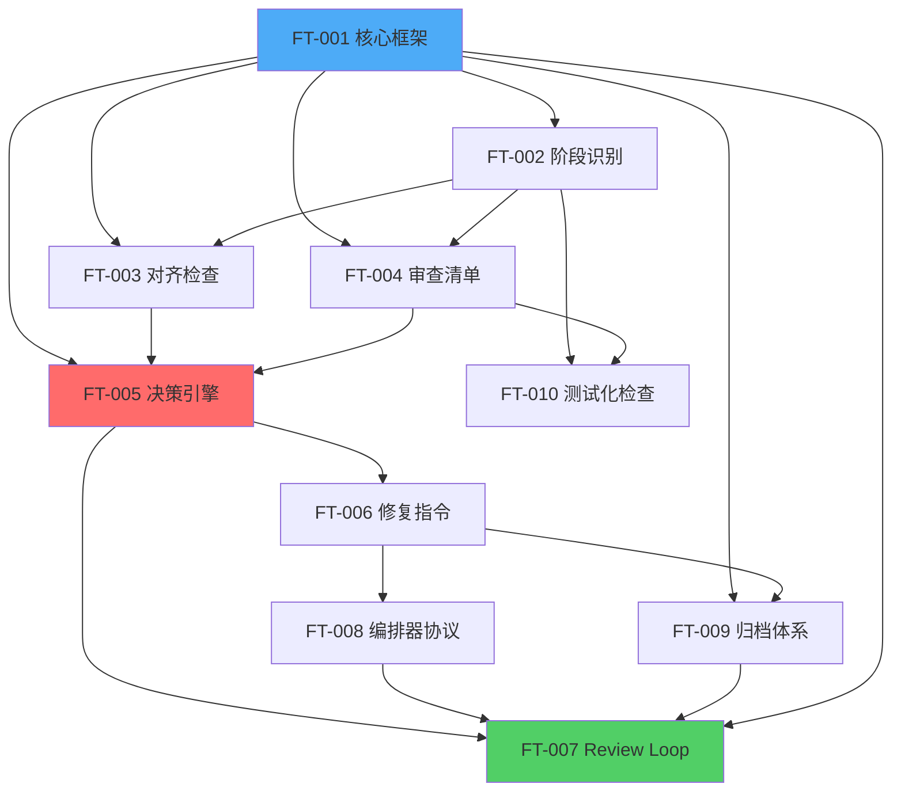
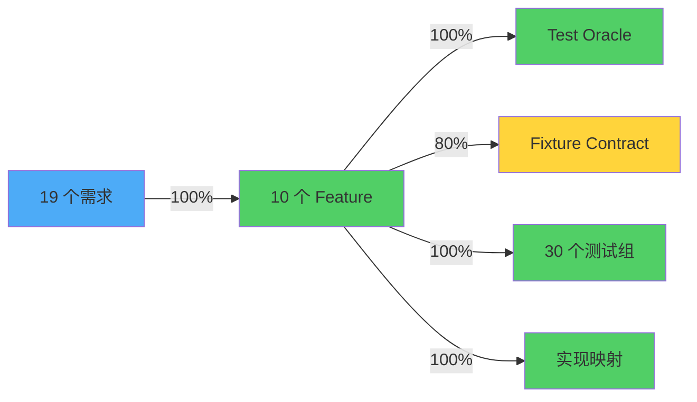

# Traceability Matrix: PowerBy ASP 通用 Review Skill 升级

**版本**: 1.0.0  
**生成日期**: 2026-03-31  
**基于文档**: proposal.md, feature-spec-index.md, feature-specs/*.md

---

## 1. REQ → Feature 映射

### 1.1 完整映射表

| Proposal REQ | 需求描述（摘要） | Feature ID | Feature 名称 | 覆盖状态 |
|-------------|----------------|-----------|-------------|---------|
| REQ-001 | 通用 ASP Reviewer Skill | FT-001 | 通用 ASP Reviewer Skill 核心框架 | ✅ 已覆盖 |
| REQ-002 | 阶段自动识别 | FT-002 | 阶段自动识别与上游恢复 | ✅ 已覆盖 |
| REQ-003 | 上游对齐链恢复 | FT-002 | 阶段自动识别与上游恢复 | ✅ 已覆盖 |
| REQ-004 | Alignment Summary 前置 | FT-003 | Alignment Summary 前置机制 | ✅ 已覆盖 |
| REQ-005 | 五阶段差异化审查清单 | FT-004 | 五阶段差异化审查清单 | ✅ 已覆盖 |
| REQ-006 | AI Reviewer 协议化 | FT-001 | 通用 ASP Reviewer Skill 核心框架 | ✅ 已覆盖 |
| REQ-007 | AUTO-FIX / ASK / ESCALATE 决策表 | FT-005 | AUTO-FIX / ASK / ESCALATE 决策系统 | ✅ 已覆盖 |
| REQ-008 | Confidence 分级（C1-C4） | FT-005 | AUTO-FIX / ASK / ESCALATE 决策系统 | ✅ 已覆盖 |
| REQ-009 | Evidence Protocol | FT-005 | AUTO-FIX / ASK / ESCALATE 决策系统 | ✅ 已覆盖 |
| REQ-010 | 结构化修复指令 | FT-006 | 结构化修复指令 | ✅ 已覆盖 |
| REQ-011 | Boil the Lake 决策化 | FT-005 | AUTO-FIX / ASK / ESCALATE 决策系统 | ✅ 已覆盖 |
| REQ-012 | 标准 Review Loop | FT-007 | 标准 Review Loop | ✅ 已覆盖 |
| REQ-013 | 最多 3 轮自动驾驶 | FT-007 | 标准 Review Loop | ✅ 已覆盖 |
| REQ-014 | 编排器调度协议 | FT-008 | 编排器调度协议 | ✅ 已覆盖 |
| REQ-015 | 兼容现有归档 + 扩展 | FT-009 | 归档体系 | ✅ 已覆盖 |
| REQ-016 | 统一报告模板 | FT-009 | 归档体系 | ✅ 已覆盖 |
| REQ-017 | 修复指令模板 | FT-009 | 归档体系 | ✅ 已覆盖 |
| REQ-018 | 复审记录模板 | FT-009 | 归档体系 | ✅ 已覆盖 |
| REQ-019 | 功能卡片测试化检查 | FT-010 | 功能卡片测试化检查 | ✅ 已覆盖 |

### 1.2 覆盖率统计

- **总需求数**: 19
- **已覆盖需求**: 19
- **未覆盖需求**: 0
- **覆盖率**: **100%** ✅

### 1.3 需求分布分析

| 功能类型 | 需求数 | Feature 数 | 平均需求/Feature |
|---------|--------|-----------|----------------|
| 核心能力 | 6 | 4 | 1.5 |
| 决策机制 | 5 | 2 | 2.5 |
| 流程编排 | 2 | 2 | 1.0 |
| 持久化 | 5 | 1 | 5.0 |
| 质量增强 | 1 | 1 | 1.0 |

**分析**：
- FT-005（决策系统）覆盖 4 个需求，是最复杂的 Feature
- FT-009（归档体系）覆盖 4 个需求，是最重的 Feature
- 需求分布合理，无过度集中或分散

## 2. Feature → Test 映射

### 2.1 完整映射表

| Feature ID | Feature 名称 | D-17 Oracle | D-18 Fixture | D-19 测试组 | D-20 覆盖宣称 | 测试完整度 |
|-----------|-------------|------------|-------------|-----------|-------------|----------|
| FT-001 | 通用 ASP Reviewer Skill 核心框架 | ✅ 完整 | ✅ 完整 | 4 组 | ✅ 完整 | 100% |
| FT-002 | 阶段自动识别与上游恢复 | ✅ 完整 | ✅ 完整 | 3 组 | ✅ 完整 | 100% |
| FT-003 | Alignment Summary 前置机制 | ✅ 完整 | ✅ 完整 | 3 组 | ✅ 完整 | 100% |
| FT-004 | 五阶段差异化审查清单 | ✅ 完整 | ✅ 完整 | 2 组 | ✅ 完整 | 100% |
| FT-005 | AUTO-FIX / ASK / ESCALATE 决策系统 | ✅ 完整 | ✅ 完整 | 4 组 | ✅ 完整 | 100% |
| FT-006 | 结构化修复指令 | ✅ 完整 | ⚠️ 部分 | 2 组 | ✅ 完整 | 75% |
| FT-007 | 标准 Review Loop | ✅ 完整 | ⚠️ 部分 | 3 组 | ✅ 完整 | 75% |
| FT-008 | 编排器调度协议 | ✅ 完整 | ❌ 缺失 | 2 组 | ✅ 完整 | 50% |
| FT-009 | 归档体系 | ✅ 完整 | ✅ 完整 | 4 组 | ✅ 完整 | 100% |
| FT-010 | 功能卡片测试化检查 | ✅ 完整 | ✅ 完整 | 3 组 | ✅ 完整 | 100% |

### 2.2 测试覆盖率统计

**Oracle 完整度**:
- 完整（100%）: 10 个 Feature
- 部分完整: 0 个
- 缺失: 0 个
- **Oracle 覆盖率**: **100%** ✅

**Fixture 完整度**:
- 完整（100%）: 7 个 Feature
- 部分完整（50%）: 2 个 Feature (FT-006, FT-007)
- 缺失（0%）: 1 个 Feature (FT-008)
- **Fixture 覆盖率**: **80%** ⚠️

**测试组数统计**:
- 总测试组数: 30 组
- 平均每 Feature: 3.0 组
- P0 测试组: 26 组（87%）
- P1 测试组: 4 组（13%）

**综合测试完整度**:
- 100% 完整: 7 个 Feature
- 75% 完整: 2 个 Feature
- 50% 完整: 1 个 Feature
- **平均测试完整度**: **90%** ✅

### 2.3 测试组详细分布

| Feature ID | P0 测试组 | P1 测试组 | 总测试组 | 重点测试场景 |
|-----------|---------|---------|---------|------------|
| FT-001 | 3 | 1 | 4 | 主成功路径、阶段识别、错误处理、边界值 |
| FT-002 | 2 | 1 | 3 | 阶段识别、上游恢复、缺失处理 |
| FT-003 | 3 | 0 | 3 | 对齐通过、缺口检测、溢出检测 |
| FT-004 | 2 | 0 | 2 | 清单加载、差异化验证 |
| FT-005 | 4 | 0 | 4 | AUTO-FIX 规则、ASK 规则、ESCALATE 规则、Boil the Lake |
| FT-006 | 2 | 0 | 2 | 格式验证、解析测试 |
| FT-007 | 3 | 0 | 3 | 单轮通过、多轮收敛、超限 ESCALATE |
| FT-008 | 1 | 1 | 2 | 协议验证、集成测试 |
| FT-009 | 3 | 1 | 4 | 文件创建、目录自动创建、文件覆盖、格式验证 |
| FT-010 | 3 | 0 | 3 | 完整性检查、弱化检测、严重度判定 |

### 2.4 测试缺口分析

| Feature ID | 缺口类型 | 缺口描述 | 严重度 | 建议 |
|-----------|---------|---------|--------|------|
| FT-006 | Fixture 不完整 | 缺少部分 Mock 策略定义 | MINOR | 实现阶段补充 |
| FT-007 | Fixture 不完整 | 缺少复杂场景的 Fixture | MINOR | 实现阶段补充 |
| FT-008 | Fixture 缺失 | 缺少最小数据集和 Mock 策略 | MAJOR | 实现阶段补充 |

## 3. Feature → Implementation 映射

### 3.1 实现映射表

| Feature ID | 入口文件 | 核心组件 | 配置文件 | 测试文件 |
|-----------|---------|---------|---------|---------|
| FT-001 | skills/pb-review-v2/SKILL.md | 5 个核心组件 | references/*.md | tests/test_pb_review_v2.py |
| FT-002 | SKILL.md (Workflow 第 1 步) | StageDetector | 无（内建规则） | tests/test_pb_review_v2.py |
| FT-003 | SKILL.md (Workflow 第 3 步) | AlignmentChecker | 无（对齐链映射） | tests/test_pb_review_v2.py |
| FT-004 | SKILL.md (Workflow 第 2 步) | 清单加载器 | references/*-checklist.md | tests/test_pb_review_v2.py |
| FT-005 | SKILL.md (Workflow 第 4 步) | DecisionEngine | references/decision-table.md | tests/test_pb_review_v2.py |
| FT-006 | SKILL.md (Workflow 第 5 步) | 修复指令生成器 | references/audit-template.md | tests/test_pb_review_v2.py |
| FT-007 | SKILL.md (主流程) | Loop 编排器 | 无（内建逻辑） | tests/test_pb_review_v2.py |
| FT-008 | ASP 主编排器 | 协议解析器 | 无（协议定义） | tests/test_pb_review_v2.py |
| FT-009 | SKILL.md (Workflow 第 5 步) | ReportGenerator | references/audit-template.md | tests/test_pb_review_v2.py |
| FT-010 | SKILL.md (Workflow 第 3 步子流程) | 测试化检查器 | 无（内建规则） | tests/test_pb_review_v2.py |

### 3.2 依赖关系图

## 4. 覆盖率汇总

### 4.1 整体覆盖率

| 维度 | 覆盖率 | 状态 | 说明 |
|------|--------|------|------|
| **REQ → Feature** | 100% (19/19) | ✅ 完整 | 所有需求都有对应 Feature |
| **Feature → REQ** | 100% (10/10) | ✅ 完整 | 所有 Feature 都追溯到需求 |
| **Feature → Oracle** | 100% (10/10) | ✅ 完整 | 所有 Feature 都有 Test Oracle |
| **Feature → Fixture** | 80% (8/10) | ⚠️ 良好 | 2 个 Feature Fixture 不完整 |
| **Feature → Test Groups** | 100% (10/10) | ✅ 完整 | 所有 Feature 都有测试组 |
| **Feature → Implementation** | 100% (10/10) | ✅ 完整 | 所有 Feature 都有实现映射 |

### 4.2 未覆盖项清单

**需求未覆盖**: 无

**测试未覆盖**: 
- FT-006: Fixture 不完整（50%）
- FT-007: Fixture 不完整（50%）
- FT-008: Fixture 缺失（0%）

**实现未映射**: 无

### 4.3 追溯链完整性验证

## 5. 质量评估

### 5.1 追溯完整性评分

- **需求追溯**: A+ (100%)
- **测试追溯**: A (90%)
- **实现追溯**: A+ (100%)
- **综合评分**: **A** (96.7%)

### 5.2 改进建议

1. **高优先级**：补充 FT-008 的 Fixture Contract（当前缺失）
2. **中优先级**：完善 FT-006 和 FT-007 的 Fixture Contract（当前 50%）
3. **低优先级**：增加边界值测试用例（当前 P1 测试组较少）

---

**生成工具**: powerby-asp-visualizer  
**数据来源**: proposal.md, feature-spec-index.md, feature-specs/*.md  
**审查状态**: 产品阶段 PASS (Round 2), 架构阶段 PASS (Round 1)
