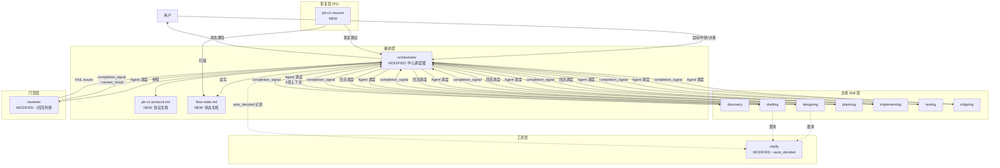
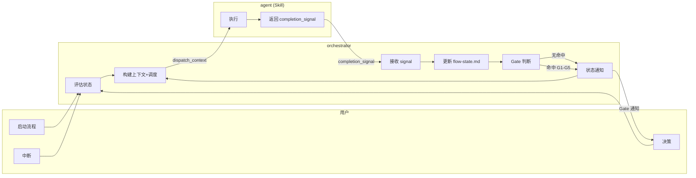
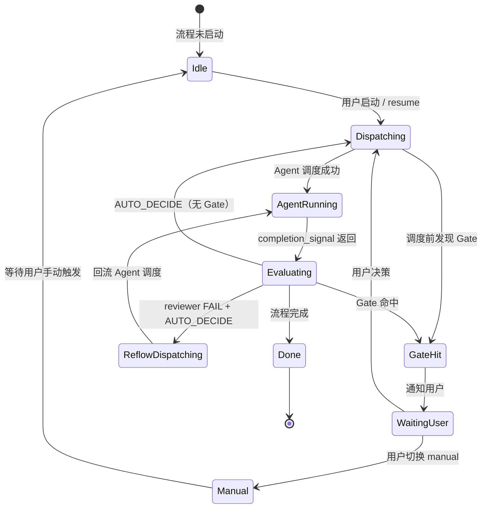
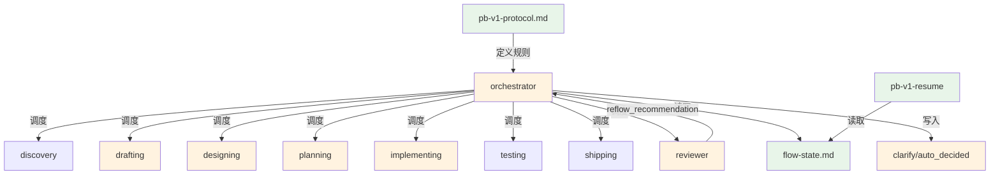

# Architecture: pb-v1 流程自推进机制

生成时间: 2026-04-17
状态: DRAFT
关联 Proposal: proposal.md

---

## 1. 需求概述

### 1.1 核心业务目标

将 pb-v1 流程控制模型从"用户驱动一切"翻转为"系统驱动执行、用户驱动决策"，减少不必要的用户打断。

### 1.2 关键功能点

| F-ID | 功能 | 优先级 |
|------|------|--------|
| F-001 | 流程自推进协议定义 | P0 |
| F-002 | orchestrator 中心调度器 | P0 |
| F-003 | orchestrator 状态管理 | P0 |
| F-004 | orchestrator 状态通知 | P0 |
| F-005 | reviewer 自动回流判断 | P0 |
| F-006 | clarify auto_decided 分类 | P0 |
| F-007 | 核心 skill 对接协议 | P0 |
| F-008 | pb-v1-resume 断点恢复 | P1 |

---

## 2. 现有架构分析

### 2.1 现有组件清单

| 组件 | 版本 | 规模 | 当前角色 |
|------|------|------|---------|
| pb-v1-orchestrator | 3.0.0 | 462 行 | 只读建议者：评估状态、输出建议，不调度 |
| pb-v1-reviewer | 3.1.0 | 682 行 | 对齐审查：PASS/FAIL 判定，Refinery 3 轮上限 |
| pb-v1-clarify | 1.0.0 | 625 行 | 澄清工具：user_confirmed / model_inferred 两种分类 |
| pb-v1-drafting | 3.0.0 | 500 行 | 规格拆解：proposal → feature-specs |
| pb-v1-designing | 4.0.0 | 830 行 | 架构收敛：feature-specs → architecture.md |
| pb-v1-planning | 2.0.0 | 623 行 | 约束传递：architecture → tasks.md |
| pb-v1-implementing | 3.0.0 | 597 行 | 约束还原：tasks → 代码 |

### 2.2 技术栈盘点

- 运行环境：Claude Code CLI / Desktop App
- 调度机制：Agent 工具（subagent，独立 context window）
- 持久化：文件系统（markdown 文档）
- 通信：无进程间通信，通过文档契约衔接

### 2.3 可复用能力评估

| P0 功能点 | 现有组件 | 复用策略 | 适配成本 | 风险 |
|-----------|---------|---------|---------|------|
| F-001 协议定义 | 无 | 新建 | 低 | 低 |
| F-002 中心调度器 | orchestrator（状态评估框架） | 扩展 | 中 | 中 |
| F-003 状态管理 | orchestrator（flow_state.json） | 扩展 | 低 | 低 |
| F-004 状态通知 | 无 | 新建（嵌入 orchestrator） | 低 | 低 |
| F-005 回流判断 | reviewer（Refinery 机制） | 扩展 | 中 | 中 |
| F-006 auto_decided | clarify（source_classification） | 扩展 | 低 | 低 |
| F-007 对接协议 | drafting/designing/planning/implementing | 扩展 | 低 | 低 |
| F-008 断点恢复 | 无 | 新建 | 中 | 低 |

### 2.4 技术债务识别

| 债务 | 影响 | 处理策略 |
|------|------|---------|
| orchestrator 红线声明"绝不代理调用任何 Skill"与新角色矛盾 | 阻塞 F-002 | 重写红线声明，反映新角色定位 |
| orchestrator 使用 flow_state.json（JSON），新设计使用 flow-state.md（Markdown） | 格式不一致 | 统一为 flow-state.md |
| 各 Skill 无统一的完成信号格式 | 阻塞 F-007 | 定义 completion_signal 协议 |

---

## 3. 目标架构

### 3.1 核心架构图



### 3.2 组件职责说明

| 组件 | 变更类型 | 职责 |
|------|---------|------|
| orchestrator | MODIFIED | 从只读建议者升级为中心调度器：通过 Agent 工具调度 Skill、构建调度上下文、接收 completion_signal、判断 Gate、管理 flow-state.md、输出状态通知 |
| reviewer | MODIFIED | 新增回流判断能力：FAIL 后在 completion_signal 中附加 reflow_recommendation（AUTO_DECIDE / USER_GATE_REQUIRED / ESCALATE） |
| clarify | MODIFIED | 新增 auto_decided 分类值：source_classification 从 2 种扩展为 3 种 |
| drafting | MODIFIED | 新增 completion_signal 输出：支持被 orchestrator 调度，返回结构化完成信号 |
| designing | MODIFIED | 同上 |
| planning | MODIFIED | 同上 |
| implementing | MODIFIED | 同上 |
| pb-v1-protocol.md | NEW | 协议文档：定义设计思想、流程全景、Skill 角色、执行模型、状态管理 |
| flow-state.md | NEW | 状态文档格式：阶段进度、Gate 记录、假设记录、Refinery 记录 |
| pb-v1-resume | NEW (P1) | 断点恢复：扫描 flow-state.md + 文件系统，确定恢复点 |

### 3.3 组件与需求映射表

| 组件 | 负责的 Feature | 变更类型 | 复用/新增 |
|------|---------------|---------|----------|
| orchestrator | FT-002, FT-003, FT-004, FT-005 | MODIFIED | 扩展现有状态评估框架 |
| reviewer | FT-005 | MODIFIED | 扩展现有 Refinery 机制 |
| clarify | FT-006 | MODIFIED | 扩展现有 source_classification |
| drafting | FT-007 | MODIFIED | 新增 completion_signal |
| designing | FT-007 | MODIFIED | 新增 completion_signal |
| planning | FT-007 | MODIFIED | 新增 completion_signal |
| implementing | FT-007 | MODIFIED | 新增 completion_signal |
| pb-v1-protocol.md | FT-001 | NEW | 全新文档 |
| flow-state.md | FT-003 | NEW | 全新文档格式 |
| pb-v1-resume | FT-008 | NEW | 全新 Skill |

---

## 4. 架构变更点

### 4.1 变更概述

本次变更是跨切面的协议升级。核心变更集中在 orchestrator（角色升级），其余 Skill 的变更是对接性的（新增 completion_signal 输出）。

### 4.2 变更清单表

| 组件 | 变更类型 | 描述 | 影响范围 | 风险等级 |
|------|---------|------|---------|---------|
| orchestrator/SKILL.md | MODIFIED | 重写：红线声明、核心哲学、执行流程、输入/输出协议 | 全流程 | 中 |
| reviewer/SKILL.md | MODIFIED | 新增：completion_signal 中的 reflow_recommendation 字段 | 审查层 | 低 |
| clarify/SKILL.md | MODIFIED | 新增：source_classification = auto_decided | 记录层 | 低 |
| drafting/SKILL.md | MODIFIED | 新增：completion_signal 输出协议（Step 7 交付格式） | 对接层 | 低 |
| designing/SKILL.md | MODIFIED | 同上 | 对接层 | 低 |
| planning/SKILL.md | MODIFIED | 同上 | 对接层 | 低 |
| implementing/SKILL.md | MODIFIED | 同上 | 对接层 | 低 |
| docs/pb-v1-protocol.md | NEW | 全新协议文档 | 全流程 | 低（已完成） |
| pb-v1-resume/SKILL.md | NEW | 全新断点恢复 Skill | 恢复层 | 低（P1） |

### 4.3 影响分析

- **高影响**: orchestrator 重写——角色从建议者变为调度器，红线声明、核心哲学、执行流程全部重写
- **中影响**: reviewer 升级——在现有 Refinery 机制上新增回流判断，不改变审查逻辑本身
- **低影响**: 4 个核心 Skill 对接——只在输出协议中新增 completion_signal，不改变内部执行逻辑

---

## 5. 数据模型设计

### 5.1 核心实体

本迭代的"数据"是文档和状态，不涉及数据库。

| 实体 | 格式 | 位置 | 生命周期 |
|------|------|------|---------|
| flow-state.md | Markdown | {iteration_dir}/flow-state.md | 迭代级，流程完成后归档 |
| completion_signal | YAML（嵌入对话） | agent 返回值 | 瞬时，orchestrator 消费后写入 flow-state.md |
| dispatch_context | 结构化文本 | Agent 工具调用参数 | 瞬时，agent 启动时消费 |
| auto_decided 记录 | Markdown | clarifications/ | 持久，跨会话可追溯 |
| Gate 命中记录 | Markdown 表格行 | flow-state.md | 迭代级 |

### 5.2 关系定义

```
dispatch_context --[orchestrator 构建]--> agent
agent --[返回]--> completion_signal
completion_signal --[orchestrator 消费]--> flow-state.md 更新
completion_signal(blocked) --[orchestrator 判断]--> Gate 命中记录
auto_decided 决策 --[agent 写入]--> clarifications/
flow-state.md --[pb-v1-resume 扫描]--> 恢复建议
```

---

## 6. API 契约设计

本迭代的"API"是 Skill 之间的协议接口。

### 6.1 接口列表

| 接口 | 方向 | 说明 |
|------|------|------|
| dispatch_context | orchestrator → agent | 调度上下文 |
| completion_signal | agent → orchestrator | 完成信号 |
| reflow_recommendation | reviewer → orchestrator | 回流建议（FAIL 时） |
| status_notification | orchestrator → 用户 | 状态通知 |

### 6.2 接口定义

#### 6.2.1 dispatch_context

orchestrator 通过 Agent 工具传给每个 Skill 的调度上下文。

```yaml
dispatch_context:
  goal: string          # 必填，可验证的目标
  scope: string         # 必填，工作边界
  verification: string  # 必填，如何判断目标达成
  doc_paths:            # 必填，关键文档路径
    - string
```

示例：
```yaml
dispatch_context:
  goal: "基于 proposal.md 起草功能规格卡片，填充 D-01~D-08 和 D-17~D-20"
  scope: "只处理 P0 功能点（F-001~F-007），P1（F-008）标记但不深入"
  verification: "feature-spec-index.md 和 feature-specs/FT-001~FT-008.md 已生成，产品维度和测试维度完整"
  doc_paths:
    - "docs/iterations/015-pb-v1-flow-autoprogression/proposal.md"
    - "docs/review/feature-specification-standard.md"
```

#### 6.2.2 completion_signal

每个 Skill 完成后返回给 orchestrator 的结构化信号。

```yaml
completion_signal:
  skill: string                    # 必填，Skill 名称
  status: enum                     # 必填，completed | failed | blocked
  artifacts:                       # 必填（completed 时），产出文件
    - path: string
      type: string                 # proposal | feature-spec | architecture | tasks | code | test-report | review-report
  issues: optional array           # blocked 时必填
    - description: string
      gate_candidate: optional enum [G1, G2, G3, G4, G5]
  assumptions: optional array      # AUTO_DECIDE_WITH_ASSUMPTION 时
    - clr_id: string               # CLR-AUTO-{NNN}
      summary: string
```

错误码：
| 状态 | 含义 | orchestrator 行为 |
|------|------|-----------------|
| completed | 正常完成 | 更新 flow-state.md，调度下一个 Skill |
| failed | 执行失败 | 记录失败，评估重试或升级 |
| blocked | 需要决策 | 检查 gate_candidate，判断 Gate |

#### 6.2.3 reflow_recommendation

reviewer FAIL 时附加在 completion_signal 中的回流建议。

```yaml
reflow_recommendation:
  decision: enum                   # AUTO_DECIDE | USER_GATE_REQUIRED | ESCALATE_TO_USER
  responsible_skill: string        # 责任 Skill（AUTO_DECIDE 时必填）
  issues_summary:                  # FAIL issues 摘要
    - id: string
      severity: enum [BLOCKER, MAJOR, MINOR]
      fixable: boolean             # 是否可自动修复
      upstream_issue: boolean      # 是否指向上游约束问题
  refinery_round: integer          # 当前轮次
```

判断逻辑：
```
if refinery_round >= 3:
    decision = ESCALATE_TO_USER
elif any(issue.severity == BLOCKER) or any(issue.upstream_issue):
    decision = USER_GATE_REQUIRED
elif all(issue.fixable):
    decision = AUTO_DECIDE
else:
    decision = USER_GATE_REQUIRED
```

#### 6.2.4 status_notification

orchestrator 向用户输出的状态通知（纯文本）。

| event_type | 格式 |
|-----------|------|
| completed | `✅ {skill} 完成 → 自动推进到 {next_skill}` |
| review_pass | `✅ reviewer({type}) PASS → 自动推进到 {next_skill}` |
| review_fail_auto | `🔄 reviewer({type}) FAIL（{n} 个问题，均可自动修复）→ 回流 {skill}` |
| gate_hit | `⛔ Gate {G1-G5}: {问题描述}\n需要你决定: {问题}` |
| flow_done | `🏁 流程完成` |

---

## 7. 强制中间表示

### 7.1 数据流图



### 7.2 状态机图



### 7.3 依赖图



### 7.4 测试矩阵

| 组件 | 测试策略 | 关键测试场景 |
|------|---------|------------|
| orchestrator | 端到端：启动流程 → 自动调度 → 完成 | 正常链路、Gate 命中、reviewer 回流、mode 切换 |
| reviewer 回流判断 | 场景测试：各种 FAIL issues 组合 | 全 MINOR→AUTO、含 BLOCKER→USER_GATE、第 3 轮→ESCALATE |
| completion_signal | 格式验证：每个 Skill 返回值 | 4 个核心 Skill 各一个 completed + blocked 场景 |
| flow-state.md | 一致性测试：状态 vs 文件系统 | 初始化、更新、不一致修正 |
| clarify auto_decided | 记录验证：写入 + 编号 + 冲突检测 | 首条记录、编号递增、与 user_confirmed 共存 |
| pb-v1-resume | 恢复测试：各种中断点 | 中断在 designing、中断在 Refinery、产物被删除 |

---

## 8. 非功能需求

### 8.1 性能要求

- 单次 Skill 调度延迟：< 5 秒（Agent 工具启动时间）
- flow-state.md 读写：< 1 秒（文件系统操作）
- 全流程端到端：取决于各 Skill 执行时间，orchestrator 本身不引入额外延迟

### 8.2 安全约束

- orchestrator 不传完整文档内容，只传文档路径（agent 自行读取）
- auto_decided 记录不包含敏感信息
- flow-state.md 不包含代码内容，只包含路径和状态

### 8.3 可观测性

- flow-state.md 是全局状态的唯一可观测点
- 状态通知是用户可见的实时进度
- Gate 命中记录和 Refinery 记录提供决策审计轨迹

### 8.4 可实施性验证

| 问题 | 回答 |
|------|------|
| 同步 vs 异步 | 同步：orchestrator 调度 agent 后等待返回，不支持并行调度 |
| 重试与幂等 | agent 失败后 orchestrator 可重试同一 Skill（幂等：Skill 基于文件系统状态执行，重复执行覆盖产物） |
| 失败场景 | agent 异常退出 → orchestrator 记录失败，评估重试；连续 3 次 → G5 升级 |
| 数据持久化 | 每次 agent 返回后立即更新 flow-state.md |
| 单点故障 | orchestrator 是单点，但中断后可通过 flow-state.md + pb-v1-resume 恢复 |
| 安全边界 | 无认证需求（本地 CLI 环境） |

---

## 9. Self-Check Gates 验收

### Gate 1: Simplicity
- [x] 方案是最简单能满足需求的设计——orchestrator 中心化调度，无分布式复杂度
- [x] 无为"未来可能"引入的过度设计——P1 功能（resume）明确标记延后
- [x] 抽象层级 ≤ 3 层——编排层 → Skill 层 → 文档层
- [x] 超过 8 个文件变更已论证必要性——跨切面协议升级，每个 Skill 变更范围有限

### Gate 2: Fidelity（硬性门禁）
- [x] 每个 P0 Feature 都有对应组件——见 §3.3 映射表
- [x] 每个组件都有明确的 Feature 映射——无孤儿组件
- [x] 未新增 proposal.md 中不存在的功能
- [x] 组件与需求映射 100% 覆盖

### Gate 3: Consistency
- [x] 接口定义完整——dispatch_context、completion_signal、reflow_recommendation、status_notification 四个接口全部定义
- [x] 数据流无悬空依赖——见 §7.1 数据流图
- [x] 决策链无矛盾——见 arch_decisions.md
- [x] 变更点标注完整——见 §4.2

### Gate 4: Buildability
- [x] 同步/异步边界明确——全同步，orchestrator 等待 agent 返回
- [x] 失败场景有降级方案——agent 失败 → 重试 → G5 升级
- [x] 无单点故障（或已标注风险）——orchestrator 是单点，flow-state.md + resume 缓解
- [x] 部署复杂度可控——只修改 SKILL.md 文件，无基础设施变更
