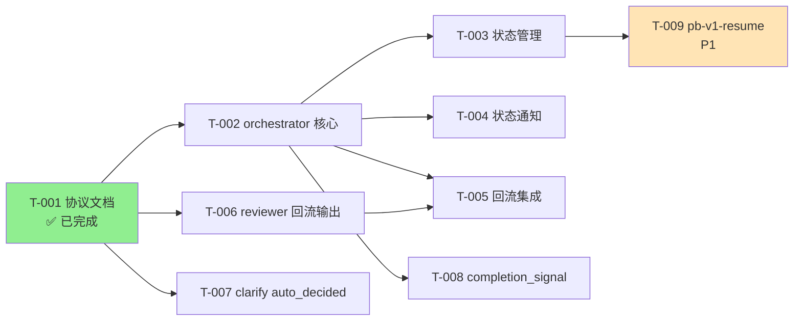

# 工程规划: pb-v1 流程自推进机制

生成时间: 2026-04-17
状态: DRAFT
关联架构: architecture.md
关联决策: arch_decisions.md

## 1. 规划概要

### 1.1 目标
将 architecture.md 中定义的 9 个组件变更转化为可执行的工程任务，按三阶段渐进实施。

### 1.2 范围
- P0 任务: 7 个（Phase 1 + Phase 2）
- P1 任务: 1 个（Phase 3）
- 已完成: 1 个（T-001 协议文档）
- 总预估: 8 人天

### 1.3 关键路径
```
T-001(已完成) → T-002(orchestrator 核心) → T-003(状态管理) → T-004(状态通知) → T-005(回流集成)
                                                                                      ↓
                                                                               T-006(reviewer 回流输出)
```
关键路径长度：5 个任务（T-001 已完成，剩余 4 个串行任务 + 1 个并行任务）

---

## 2. 任务概览

| Task ID | 名称 | 优先级 | 阶段 | 关联 Feature | 关联组件 | 依赖 | 预估 | 状态 |
|---------|------|--------|------|-------------|---------|------|------|------|
| T-001 | 流程自推进协议文档 | P0 | Phase 1 | FT-001 | pb-v1-protocol.md | - | 1d | ✅ 已完成 |
| T-002 | orchestrator 核心重写 | P0 | Phase 1 | FT-002 | orchestrator | T-001 | 2d | TODO |
| T-003 | orchestrator 状态管理 | P0 | Phase 1 | FT-003 | orchestrator + flow-state.md | T-002 | 1d | TODO |
| T-004 | orchestrator 状态通知 | P0 | Phase 1 | FT-004 | orchestrator | T-002 | 0.5d | TODO |
| T-005 | orchestrator 回流集成 | P0 | Phase 1 | FT-005 | orchestrator | T-002, T-006 | 1d | TODO |
| T-006 | reviewer 回流输出 | P0 | Phase 1 | FT-005 | reviewer | T-001 | 0.5d | TODO |
| T-007 | clarify auto_decided 扩展 | P0 | Phase 2 | FT-006 | clarify | T-001 | 0.5d | TODO |
| T-008 | 核心 skill completion_signal | P0 | Phase 2 | FT-007 | drafting/designing/planning/implementing | T-002 | 1d | TODO |
| T-009 | pb-v1-resume 断点恢复 | P1 | Phase 3 | FT-008 | pb-v1-resume (NEW) | T-003 | 1.5d | TODO |

---

## 3. 任务依赖图



**并行度分析**:
- T-001 完成后，T-002、T-006、T-007 可并行
- T-002 完成后，T-003、T-004、T-005、T-008 可并行（T-005 还需等 T-006）
- T-009 (P1) 依赖 T-003，可在 Phase 2 之后启动

---

## 4. 任务详情

### T-001: 流程自推进协议文档
- **优先级**: P0
- **阶段**: Phase 1
- **关联 Feature**: FT-001
- **关联组件**: pb-v1-protocol.md (NEW)
- **状态**: ✅ 已完成
- **产物**: docs/pb-v1-protocol.md (v1.0.0)

---

### T-002: orchestrator 核心重写
- **优先级**: P0
- **阶段**: Phase 1
- **关联 Feature**: FT-002
- **关联组件**: orchestrator (MODIFIED)
- **目标**: 将 orchestrator 从只读建议者重写为中心调度器，具备 Agent 调度和 Gate 判断能力
- **实现方案**:
  - 方案 A（推荐）: 在现有 SKILL.md 基础上重写，保留状态评估框架，新增调度引擎和 Gate 判断引擎
    - 理由：复用现有的流程类型路由和产物验证逻辑，减少重写范围
  - 方案 B: 从零重写 SKILL.md
    - 理由：现有结构与新角色差异大，重写可能更清晰。但丢失已验证的状态评估逻辑
- **验收标准**:
  - [ ] 红线声明已更新：反映"调度执行权 + 决策权在用户"的分离（来源：pb-v1-protocol.md §二）
  - [ ] 核心哲学已更新：从"状态快照→证据评估→风险标注"变为"状态评估→调度执行→Gate判断→状态更新"（来源：pb-v1-protocol.md §五）
  - [ ] 调度引擎：能通过 Agent 工具调度任意 pb-v1 Skill，传入 dispatch_context（goal/scope/verification/doc_paths）（来源：architecture.md §6.2.1）
  - [ ] Gate 判断引擎：能基于 completion_signal 判断是否命中 G1-G5，命中时停止调度并输出 Gate 通知（来源：pb-v1-protocol.md §五.3）
  - [ ] 异常路径：agent 执行异常退出时记录失败并评估重试（来源：FT-002 D-05 ERR-ORC-002）
  - [ ] 异常路径：Gate 判断无法确定时升级给用户（来源：FT-002 D-05 ERR-ORC-003）
- **依赖**: T-001
- **预估**: 2d
- **约束来源**: architecture.md §3.2 组件职责, §6.2.1 dispatch_context, pb-v1-protocol.md §五

---

### T-003: orchestrator 状态管理
- **优先级**: P0
- **阶段**: Phase 1
- **关联 Feature**: FT-003
- **关联组件**: orchestrator (MODIFIED) + flow-state.md (NEW)
- **目标**: 实现 flow-state.md 的创建、读取、更新和一致性校验
- **实现方案**:
  - 方案 A（推荐）: 在 orchestrator SKILL.md 中新增状态管理章节，定义 flow-state.md 的读写流程
    - 理由：状态管理是 orchestrator 的内嵌能力，不需要独立 Skill
  - 方案 B: 将状态管理抽取为独立的工具 Skill
    - 理由：职责分离。但增加调度复杂度，且状态管理与调度紧耦合
- **验收标准**:
  - [ ] flow-state.md 初始化：首次启动时创建包含 5 个区块的状态文档（来源：architecture.md §5.1, pb-v1-protocol.md §八）
  - [ ] 状态更新：每次 agent 返回后更新阶段进度表、产物路径、时间戳（来源：FT-003 D-04）
  - [ ] mode 切换：支持 auto/manual 切换并持久化（来源：FT-003 D-02 mode_switch）
  - [ ] 一致性校验：flow-state.md 与文件系统不一致时以文件系统为准修正（来源：FT-003 D-05 ERR-STATE-002）
  - [ ] 异常路径：flow-state.md 格式损坏时基于文件系统重建（来源：FT-003 D-05 ERR-STATE-001）
- **依赖**: T-002
- **预估**: 1d
- **约束来源**: architecture.md §5, pb-v1-protocol.md §八, FT-003 D-04~D-06

---

### T-004: orchestrator 状态通知
- **优先级**: P0
- **阶段**: Phase 1
- **关联 Feature**: FT-004
- **关联组件**: orchestrator (MODIFIED)
- **目标**: 实现 5 种状态通知格式，每次 agent 返回时输出给用户
- **实现方案**:
  - 方案 A（推荐）: 在 orchestrator 调度流程的"agent 返回后"步骤中嵌入通知逻辑
    - 理由：通知是调度流程的自然延伸，不需要独立机制
  - 方案 B: 通知作为独立的输出协议章节
    - 理由：便于单独测试。但增加了不必要的分离
- **验收标准**:
  - [ ] 正常推进通知：`✅ {skill} 完成 → 自动推进到 {next_skill}`（来源：pb-v1-protocol.md §七.1）
  - [ ] reviewer PASS 通知：`✅ reviewer({type}) PASS → 自动推进到 {next_skill}`（来源：pb-v1-protocol.md §七.2）
  - [ ] reviewer FAIL + 自动回流通知：`🔄 reviewer({type}) FAIL（{n} 个问题）→ 回流 {skill}`（来源：pb-v1-protocol.md §七.3）
  - [ ] Gate 命中通知：`⛔ Gate {G1-G5}: {问题描述}` + "需要你决定"（来源：pb-v1-protocol.md §七.4）
  - [ ] 流程完成通知：`🏁 流程完成`（来源：pb-v1-protocol.md §七.5）
  - [ ] 异常路径：event_type 不在枚举范围时降级为通用通知（来源：FT-004 D-05 ERR-NOTIFY-001）
- **依赖**: T-002
- **预估**: 0.5d
- **约束来源**: pb-v1-protocol.md §七, FT-004 D-04~D-05

---

### T-005: orchestrator 回流集成
- **优先级**: P0
- **阶段**: Phase 1
- **关联 Feature**: FT-005
- **关联组件**: orchestrator (MODIFIED)
- **目标**: 在 orchestrator 中实现 reviewer FAIL 后的回流判断逻辑，消费 reviewer 的 reflow_recommendation
- **实现方案**:
  - 方案 A（推荐）: orchestrator 消费 reviewer 的 reflow_recommendation 作为建议，自行做最终判断
    - 理由：Gate 逻辑集中在 orchestrator（arch_decisions.md 决策 4）
  - 方案 B: 直接信任 reviewer 的 reflow_recommendation
    - 理由：简单。但 Gate 逻辑分散，reviewer 职责越界
- **验收标准**:
  - [ ] AUTO_DECIDE 路径：issues 全部 MINOR/MAJOR 且修复路径明确时，自动调度责任 Skill 修复并重新 review（来源：pb-v1-protocol.md §五.5）
  - [ ] USER_GATE_REQUIRED 路径：issues 指向上游约束问题时停止调度，输出 Gate 通知（来源：FT-005 D-04）
  - [ ] ESCALATE 路径：refinery_round ≥ 3 时 G5 升级给用户（来源：FT-005 D-04）
  - [ ] 异常路径：issues 列表为空但 FAIL 时升级给用户（来源：FT-005 D-05 ERR-REFLOW-001）
  - [ ] 异常路径：无法识别责任 Skill 时升级给用户（来源：FT-005 D-05 ERR-REFLOW-002）
  - [ ] Refinery 记录追加到 flow-state.md（来源：FT-005 D-07）
- **依赖**: T-002, T-006
- **预估**: 1d
- **约束来源**: architecture.md §6.2.3, pb-v1-protocol.md §五.5, FT-005 D-04~D-07

---

### T-006: reviewer 回流输出
- **优先级**: P0
- **阶段**: Phase 1
- **关联 Feature**: FT-005
- **关联组件**: reviewer (MODIFIED)
- **目标**: 在 reviewer 的 completion_signal 中新增 reflow_recommendation 字段
- **实现方案**:
  - 方案 A（推荐）: 在 reviewer SKILL.md 的输出协议中新增 reflow_recommendation 章节，FAIL 时附加建议
    - 理由：最小变更，不改变 reviewer 的审查逻辑本身
  - 方案 B: 在审查报告中嵌入回流建议
    - 理由：信息集中。但审查报告是人类可读文档，不适合嵌入机器消费的结构化字段
- **验收标准**:
  - [ ] FAIL 时 completion_signal 包含 reflow_recommendation 字段（来源：architecture.md §6.2.3）
  - [ ] reflow_recommendation 包含 recommendation（AUTO_DECIDE/USER_GATE_REQUIRED/ESCALATE）、responsible_skill、reason（来源：architecture.md §6.2.3 Schema）
  - [ ] PASS 时 reflow_recommendation 为 null（来源：architecture.md §6.2.3）
  - [ ] reviewer 审查逻辑本身不变——只新增输出字段（来源：reviewer SKILL.md Safety）
- **依赖**: T-001
- **预估**: 0.5d
- **约束来源**: architecture.md §6.2.3, FT-005 D-16

---

### T-007: clarify auto_decided 扩展
- **优先级**: P0
- **阶段**: Phase 2
- **关联 Feature**: FT-006
- **关联组件**: clarify (MODIFIED)
- **目标**: 在 clarify SKILL.md 中新增 auto_decided 分类值和对应记录格式
- **实现方案**:
  - 方案 A（推荐）: 在现有 source_classification 枚举中新增 auto_decided，新增记录格式模板
    - 理由：最小变更，与现有 user_confirmed/model_inferred 共存
  - 方案 B: 为 auto_decided 创建独立的存储路径
    - 理由：隔离。但破坏了 clarifications/ 的统一性，reviewer 审计需要扫描多个位置
- **验收标准**:
  - [ ] source_classification 新增 auto_decided 值，与 user_confirmed/model_inferred 共存（来源：FT-006 D-04）
  - [ ] auto_decided 记录格式包含：决策、理由、备选（≥1）、可逆性、决策 Skill、时间戳（来源：FT-006 D-02）
  - [ ] CLR-AUTO 编号全局唯一且单调递增（来源：FT-006 D-17 业务规则）
  - [ ] 与 user_confirmed 记录冲突时不覆盖（来源：FT-006 D-06）
  - [ ] clarifications/index.md 同步更新（来源：FT-006 D-07）
- **依赖**: T-001
- **预估**: 0.5d
- **约束来源**: architecture.md §3.2, FT-006 D-02~D-07

---

### T-008: 核心 skill completion_signal
- **优先级**: P0
- **阶段**: Phase 2
- **关联 Feature**: FT-007
- **关联组件**: drafting/designing/planning/implementing (MODIFIED)
- **目标**: 为 4 个核心 Skill 统一新增 dispatch_context 接收和 completion_signal 输出
- **实现方案**:
  - 方案 A（推荐）: 在每个 Skill 的输入协议新增 dispatch_context 章节，输出协议新增 completion_signal 章节，交付引导步骤新增信号构建
    - 理由：统一模式，4 个 Skill 变更一致
  - 方案 B: 只在 orchestrator 侧适配，不改 Skill 本身
    - 理由：零侵入。但 Skill 不知道自己被调度，无法返回结构化信号
- **验收标准**:
  - [ ] 4 个 Skill 均支持接收 dispatch_context（goal/scope/verification/doc_paths）（来源：architecture.md §6.2.1）
  - [ ] 4 个 Skill 完成后返回 completion_signal（skill/status/artifacts/issues/assumptions）（来源：architecture.md §6.2.2）
  - [ ] dispatch_context 缺少必填字段时拒绝执行（来源：FT-007 D-05 ERR-DOCK-001）
  - [ ] 前置产物不存在时返回 blocked + 问题描述（来源：FT-007 D-05 ERR-DOCK-002）
  - [ ] completion_signal 格式跨 4 个 Skill 统一（来源：FT-007 D-17 业务规则）
- **依赖**: T-002
- **预估**: 1d
- **约束来源**: architecture.md §6.2.1~§6.2.2, FT-007 D-02~D-05

---

### T-009: pb-v1-resume 断点恢复
- **优先级**: P1（Phase 3）
- **关联 Feature**: FT-008
- **关联组件**: pb-v1-resume (NEW)
- **目标**: 新建 pb-v1-resume Skill，实现断点恢复评估和状态修正
- **实现方案**:
  - 方案 A（推荐）: 新建独立 Skill，扫描 flow-state.md + 文件系统，输出恢复评估报告，用户确认后修正状态
    - 理由：独立 Skill 职责清晰，不污染 orchestrator
  - 方案 B: 作为 orchestrator 的内嵌能力
    - 理由：减少 Skill 数量。但 orchestrator 已经很重，恢复逻辑独立更好
- **验收标准**:
  - [ ] 扫描 flow-state.md 和文件系统实际状态（来源：FT-008 D-02）
  - [ ] 产物一致性检查：对比 flow-state 记录与文件系统（来源：FT-008 D-04）
  - [ ] 恢复前请求用户确认（来源：FT-008 D-10 安全约束）
  - [ ] flow-state.md 不存在时快速失败（来源：FT-008 D-05 ERR-RESUME-001）
  - [ ] 产物大面积不一致时建议从最早有效节点重新开始（来源：FT-008 D-05 ERR-RESUME-003）
- **依赖**: T-003
- **预估**: 1.5d
- **约束来源**: FT-008 D-02~D-08

---

## 5. 追溯矩阵

| Feature | 关联任务 | 覆盖状态 |
|---------|---------|---------|
| FT-001 | T-001 ✅ | ✓ 完整 |
| FT-002 | T-002 | ✓ 完整 |
| FT-003 | T-003 | ✓ 完整 |
| FT-004 | T-004 | ✓ 完整 |
| FT-005 | T-005, T-006 | ✓ 完整（orchestrator 判断 + reviewer 输出） |
| FT-006 | T-007 | ✓ 完整 |
| FT-007 | T-008 | ✓ 完整 |
| FT-008 | T-009 (P1) | ✓ 完整 |

**覆盖率**: 8/8 (100%)

---

## 6. 风险评估

| 风险 | 影响 | 概率 | 缓解措施 |
|------|------|------|---------|
| orchestrator 重写范围大（462行→预估 600+行） | 引入回归 | 中 | 分步重写：先核心调度，再状态管理，再通知 |
| Agent 工具调度行为不可控（启动延迟、context window 限制） | 自推进体验差 | 低 | dispatch_context 最小化，agent 自取文档 |
| 4 个核心 Skill 的 completion_signal 一致性 | 对接失败 | 低 | 统一模板，一次定义四处复用 |
| flow-state.md Markdown 解析不稳定 | 状态丢失 | 低 | 以文件系统为准的兜底机制（FT-003 D-14） |

---

## 7. Gate 检查

- [x] **覆盖性**: 每个 P0 Feature 都有对应任务（8/8）
- [x] **粒度**: 每个任务 0.5-2 天（最大 T-002 = 2d）
- [x] **异常覆盖**: P0 任务包含异常路径验收（每个任务至少 1 条异常路径）
- [x] **依赖**: 依赖图无循环（DAG 验证通过）
- [x] **可验证**: 验收标准具体到断言级别（每条标注约束来源）
- [x] **可追溯**: 追溯矩阵完整（任务 → Feature → 组件）
- [x] **方案确定**: 每个任务有 ≥2 方案并已选定
- [x] **无孤儿任务**: 每个任务都有 Feature 映射
