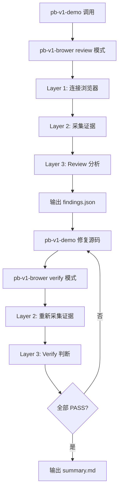
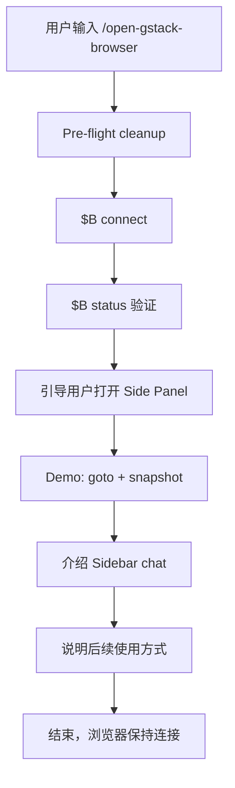

# pb-v1-brower vs open-gstack-browser 对比

## 核心定位差异

| 维度 | pb-v1-brower | open-gstack-browser |
|------|-------------|---------------------|
| **核心职责** | 页面级浏览器评审与验证能力中台 | 启动并连接 GStack Browser 的独立 skill |
| **单一职责** | 浏览器真相源 — 把页面级事实还原为可复用的调试证据和通过/失败结论 | 启动 AI 控制的 Chromium，展示 Side Panel 和实时活动流 |
| **使用场景** | 当需要对页面做 review/verify/iterate 时使用 | 当需要打开可见浏览器窗口时使用 |
| **目标用户** | 其他 pb-v1 skill（demo/preview/frontend/reviewer/testing） | 直接用户 + 其他 gstack skill（qa/design-review/benchmark） |
| **是否修改代码** | 否（观察 + 证明，不修复） | 否（只负责连接） |

---

## 功能范围对比

### pb-v1-brower 提供的能力

1. **4 种执行模式**
   - `connect` — 只保证浏览器 ready
   - `review` — 输出"页面哪里有问题"（findings）
   - `verify` — 输出"页面是否满足明确标准"（PASS/FAIL/BLOCKED）
   - `iterate` — 驱动多轮"发现 → 修复 → 复验"闭环

2. **页面证据采集**
   - 全页截图（`$B screenshot --full`）
   - 页面快照（`$B snapshot -i`）
   - 控制台日志（`$B console`）
   - 网络请求（`$B network`）
   - 焦点区域深入（`$B inspect`）

3. **Review Heuristics（10 条评审规则）**
   - 首屏 5 秒可理解性
   - 信息层级
   - CTA 清晰度
   - 文案一致性
   - 布局完整性
   - 状态处理
   - 表单反馈
   - 响应式
   - 核心路径
   - 控制台/网络

4. **标准化产物输出**
   - `session.md` — 连接信息
   - `round-N-review.md` — 人类可读报告
   - `round-N-findings.json` — 机器可读 findings
   - `round-N-verify.md` — 验收结论
   - `summary.md` — 最终结论
   - 截图、快照、日志等证据文件

5. **迭代闭环管理**
   - Round 管理（多轮验证）
   - Findings 追踪（RESOLVED/未修复/新问题）
   - 终止条件判断（全部 RESOLVED / 连续 3 轮无改善）

### open-gstack-browser 提供的能力

1. **浏览器连接与启动**
   - Pre-flight cleanup（清理 stale server 和 profile locks）
   - `$B connect` — 启动 headed mode
   - `$B status` — 验证连接状态
   - 端口检测（默认 34567）

2. **Side Panel 引导**
   - 详细的用户引导文案（Step 3）
   - Extension 加载指引
   - 手动加载 extension 的备用方案
   - Side Panel 连接故障排查

3. **Demo 演示**
   - 快速 demo（goto + snapshot）
   - Sidebar chat 介绍
   - 使用场景说明

4. **后续使用指引**
   - 如何在其他 skill 中使用
   - 窗口管理命令（`$B focus` / `$B disconnect`）
   - 与其他 gstack skill 的集成说明

---

## 技术实现对比

### 连接层（Layer 1: Session Bootstrap）

| 步骤 | pb-v1-brower | open-gstack-browser |
|------|-------------|---------------------|
| **Step 0: Pre-flight cleanup** | ✅ 完全复用 | ✅ 原始实现 |
| **Step 1: Connect** | ✅ 复用 `$B connect` | ✅ 原始实现 |
| **Step 2: Verify** | ✅ 复用 `$B status`，检查 `Mode: headed` | ✅ 原始实现 |
| **Step 3: Side Panel 引导** | ⚠️ 人机双模式：用户直用时展示，skill 调用时跳过 | ✅ 详细引导（AskUserQuestion） |
| **Step 4: Demo** | ❌ 无 | ✅ goto + snapshot demo |
| **Step 5: Sidebar chat** | ❌ 无 | ✅ 介绍 sidebar agent |
| **Step 6: What's next** | ❌ 无 | ✅ 使用场景说明 |

**关键区别**：
- `pb-v1-brower` 的 Layer 1 **直接复用** `open-gstack-browser` 的 Step 0~2
- `pb-v1-brower` 在 **skill 调用时走静默路径**，跳过 Step 3~6 的教学文案
- `pb-v1-brower` 在 **用户直用时保留** Step 3 的 Side Panel 引导

### 证据采集层（Layer 2: Page Evidence）

| 能力 | pb-v1-brower | open-gstack-browser |
|------|-------------|---------------------|
| **导航到目标页面** | ✅ `$B goto {target}` | ❌ 无（只负责连接） |
| **全页截图** | ✅ `$B screenshot --full` | ❌ 无 |
| **页面快照** | ✅ `$B snapshot -i` | ✅ Demo 中使用 |
| **控制台日志** | ✅ `$B console` | ❌ 无 |
| **网络请求** | ✅ `$B network` | ❌ 无 |
| **焦点区域深入** | ✅ `$B inspect` | ❌ 无 |

### 分析层（Layer 3: Review / Verify Logic）

| 能力 | pb-v1-brower | open-gstack-browser |
|------|-------------|---------------------|
| **Review Heuristics** | ✅ 10 条评审规则 | ❌ 无 |
| **Findings 生成** | ✅ 标准化 JSON 格式 | ❌ 无 |
| **Severity 判定** | ✅ critical/major/minor/cosmetic | ❌ 无 |
| **Verify 判断** | ✅ PASS/FAIL/BLOCKED | ❌ 无 |
| **证据引用** | ✅ 每个 finding 附带证据 | ❌ 无 |

### 迭代层（Layer 4: Iteration Contract）

| 能力 | pb-v1-brower | open-gstack-browser |
|------|-------------|---------------------|
| **多轮验证** | ✅ Round 1, 2, 3... | ❌ 无 |
| **Findings 追踪** | ✅ RESOLVED/未修复/新问题 | ❌ 无 |
| **终止条件** | ✅ 全部 RESOLVED / 3 轮无改善 | ❌ 无 |
| **Summary 输出** | ✅ 汇总所有轮次演进 | ❌ 无 |

---

## 产物对比

### pb-v1-brower 产物

```
docs/iterations/{iteration_id}/browser/
├── session.md              # 连接信息
├── round-1-review.md       # 第 1 轮 review 报告
├── round-1-findings.json   # 机器可读 findings
├── round-1-snapshot.txt    # 页面快照
├── round-1-console.log     # 控制台日志
├── round-1-network.log     # 网络日志
├── round-1-full.png        # 全页截图
├── round-2-verify.md       # 第 2 轮验收结论
└── summary.md              # 最终结论
```

**特点**：
- 标准化目录结构
- 机器可读 + 人类可读双格式
- 多轮产物可追溯
- 证据文件完整

### open-gstack-browser 产物

**无持久化产物**，只负责：
- 启动浏览器
- 验证连接状态
- 引导用户使用 Side Panel

---

## 使用流程对比

### pb-v1-brower 典型流程



### open-gstack-browser 典型流程



---

## 调用关系对比

### pb-v1-brower 的调用方

| 调用方 | 调用时机 | 推荐模式 | 目的 |
|--------|---------|---------|------|
| pb-v1-demo | 每轮生成 demo 版本后 | review | 发现页面问题 |
| pb-v1-preview | 交付前检查关键用户路径 | verify | 验证是否满足标准 |
| pb-v1-frontend | 视觉打磨阶段 | iterate | 多轮优化验证 |
| pb-v1-reviewer | 需要页面事实证据时 | verify | 补充浏览器证据 |
| pb-v1-testing | 复杂交互场景验证 | verify | 页面级交互验证 |

### open-gstack-browser 的调用方

| 调用方 | 调用时机 | 目的 |
|--------|---------|------|
| 用户直接使用 | 需要可见浏览器窗口时 | 观察 AI 操作过程 |
| gstack-qa | 运行测试套件前 | 在可见浏览器中执行测试 |
| gstack-design-review | 设计审查前 | 在真实浏览器中截图 |
| gstack-benchmark | 性能测试前 | 在 headed 模式测量性能 |

---

## 设计哲学对比

### pb-v1-brower

**核心哲学**：浏览器是页面事实的唯一裁判

**设计原则**：
1. 浏览器事实优先 — 以真实渲染结果为准
2. 观察 + 证明，不修复 — 源码修改由调用方承担
3. 证据必须可追溯 — 每个 finding 附带证据
4. 能力中台，不是业务 skill — 为其他 skill 提供统一能力

**红线声明**：
- 绝不代替调用方做产品决策
- 绝不代替调用方做架构判断
- 绝不默认修改业务源码
- 绝不把"代码看起来像对的"当作通过
- 绝不在没有浏览器证据的情况下给出页面级 PASS

### open-gstack-browser

**核心哲学**：让用户看到 AI 在浏览器中的每一个操作

**设计原则**：
1. 可见性优先 — 所有操作在可见窗口中执行
2. 实时反馈 — Side Panel 显示活动流
3. 用户引导 — 详细的 Step-by-Step 指引
4. 独立 skill — 专注于连接和引导

**目标**：
- 让用户建立对 AI 浏览器控制的信任
- 提供实时观察 AI 操作的能力
- 降低使用门槛（详细引导）

---

## 复用关系

```
pb-v1-brower
├── Layer 1: Session Bootstrap
│   ├── ✅ 完全复用 open-gstack-browser 的 Step 0~2
│   ├── ⚠️ 人机双模式分支
│   │   ├── 用户直用 → 保留 Step 3 引导
│   │   └── skill 调用 → 跳过 Step 3~6
│   └── 输出 session.md
├── Layer 2: Page Evidence（独有）
├── Layer 3: Review / Verify Logic（独有）
└── Layer 4: Iteration Contract（独有）
```

**关键设计选择**：
- `pb-v1-brower` 不重复实现浏览器连接逻辑
- `pb-v1-brower` 在 `open-gstack-browser` 的基础上增加了 3 层能力
- `pb-v1-brower` 通过 `owner_skill` 参数判断是否走静默路径

---

## 适用场景对比

### 何时使用 pb-v1-brower

✅ **适用场景**：
- 需要对页面做 review，输出结构化 findings
- 需要验证页面是否满足明确的验收标准
- 需要多轮"发现 → 修复 → 复验"的迭代闭环
- 需要标准化的浏览器证据（截图、快照、日志）
- 被其他 pb-v1 skill 调用，作为浏览器能力中台

❌ **不适用场景**：
- 只需要打开浏览器，不需要 review/verify
- 需要详细的 Side Panel 使用引导
- 需要 Sidebar chat 功能介绍

### 何时使用 open-gstack-browser

✅ **适用场景**：
- 首次使用 GStack Browser，需要详细引导
- 需要观察 AI 在浏览器中的操作过程
- 需要使用 Side Panel 的 Sidebar chat
- 作为其他 gstack skill 的前置步骤

❌ **不适用场景**：
- 需要对页面做结构化 review
- 需要输出标准化的验证报告
- 需要多轮迭代验证

---

## 总结

| 维度 | pb-v1-brower | open-gstack-browser |
|------|-------------|---------------------|
| **定位** | 浏览器能力中台 | 浏览器连接 skill |
| **职责** | 页面级事实采集与验证 | 启动并引导用户使用浏览器 |
| **层次** | 4 层架构（Bootstrap + Evidence + Logic + Iteration） | 1 层（Bootstrap） |
| **产物** | 标准化报告 + 证据文件 | 无持久化产物 |
| **调用方** | 其他 pb-v1 skill | 用户 + 其他 gstack skill |
| **复用关系** | 复用 open-gstack-browser 的 Layer 1 | 被 pb-v1-brower 复用 |
| **人机模式** | 双模式（用户直用 vs skill 调用） | 单模式（用户直用） |
| **核心价值** | 把页面事实还原为可复用的证据和结论 | 让用户看到 AI 操作浏览器的过程 |

**一句话总结**：
- `open-gstack-browser` 是"打开浏览器"的独立 skill
- `pb-v1-brower` 是"用浏览器做页面级事实判断"的能力中台，连接只是它的第一步
