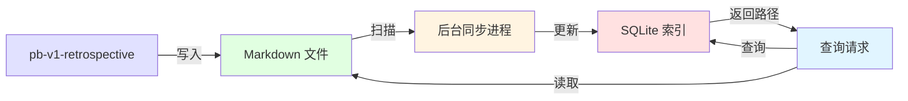

# pb-v1-retrospective 全局经验库优化方案

**日期**: 2026-04-02  
**状态**: 方案设计  
**版本**: 1.0.0

---

## 一、现状分析

### 1.1 当前设计

```mermaid
graph TD
    RET[pb-v1-retrospective] --> |生成| REP[project-retrospective.md]
    RET --> |更新建议| CONST[项目 constitution.md]
    REP --> |存储| PROJ[docs/iterations/{id}/]
    
    style RET fill:#e1e1ff
    style REP fill:#ffe1e1
    style CONST fill:#e1ffe1
    style PROJ fill:#f0f0f0
```

**当前流程**：
1. 复盘分析本次迭代的执行过程
2. 生成 `project-retrospective.md`（存储在项目内）
3. 提出 `constitution.md` 更新建议（项目级）
4. 输出 Retro-Learn 改进清单

**核心问题**：
- ❌ **经验孤岛**：每个项目的经验独立存储，无法跨项目复用
- ❌ **重复犯错**：新项目无法自动引用历史经验，容易重蹈覆辙
- ❌ **方法论缺失**：经验停留在具体案例层面，未抽象为可复用的方法论
- ❌ **检索困难**：即使想查找历史经验，也需要手动翻阅多个项目的复盘文档

### 1.2 为什么需要全局经验库

1. **知识复利**：一次经验，多次复用，让每个项目都站在历史的肩膀上
2. **系统性改进**：从案例到方法论的提炼，形成可持续的改进机制
3. **主动预防**：在新项目启动时主动引用相关经验，而非事后补救
4. **团队记忆**：构建组织级的知识资产，不依赖个人记忆

---

## 二、方案设计

### 2.1 方案 A：轻量级标签索引方案

#### 目录结构

```
~/.powerby/
├── experiences/
│   ├── index.json                    # 经验索引（元数据）
│   ├── exp-001-prd-d05-checklist.md  # 具体经验
│   ├── exp-002-arch-interface-spec.md
│   └── exp-003-test-coverage-gate.md
└── methodologies/
    ├── index.json                    # 方法论索引
    ├── meth-001-prd-quality-gate.md  # 方法论文档
    └── meth-002-arch-review-process.md
```

#### 经验记录格式

**文件名**：`exp-{id}-{slug}.md`

**内容示例**：

```markdown
---
id: exp-001
title: PRD D-05 维度需要强制清单
type: process          # process | technical | collaboration | tool
stage: drafting        # office-hours | discovery | drafting | designing | planning | implementing | testing | shipping | retrospective
level: blocker         # blocker | major | minor | enhancement
tags: [prd, d05, checklist, review-rounds]
created: 2026-04-01
projects: [009-review-framework, 010-review-testability-upgrade]
status: active         # active | deprecated | merged
---

## 背景

在 009-review-framework 项目中，PRD Review 经历了 3 轮才通过，主要原因是 D-05 异常行为定义模糊。

## 症状

- PRD Review 第 1 轮：D-05 维度只有"支持异常处理"，未列出具体场景
- 架构设计阶段：实现者对异常处理理解不一致
- 实现阶段：发现遗漏了 3 种边界情况，需要返工

## 根因分析

D-05 维度缺少强制清单要求 → PRD 作者未意识到需要列举具体场景 → 下游理解不一致 → Review 轮次增加

## 改进方向

在 PRD 模板的 D-05 维度增加强制清单：
- 必须列出至少 3 种异常场景
- 每种场景必须说明处理方式
- 必须说明异常的传播路径

## 结论

**可执行改进**：更新 `pb-v1-drafting` 的 PRD 模板，在 D-05 维度增加清单要求

**验证方式**：下次迭代统计 PRD Review 轮次，预期从 3 轮降至 1-2 轮

## 理由

- 数据支持：009 项目 PRD Review 3 轮，010 项目应用改进后 1 轮通过
- 根因明确：清单要求直接解决了"作者不知道要写什么"的问题
- 可复制性：所有使用 pb-v1-drafting 的项目都能自动受益

## 方法论提炼

→ 已提炼为 `meth-001-prd-quality-gate.md`
```

#### 索引格式

**文件名**：`experiences/index.json`

**内容示例**：

```json
{
  "version": "1.0.0",
  "last_updated": "2026-04-02T10:00:00Z",
  "experiences": [
    {
      "id": "exp-001",
      "title": "PRD D-05 维度需要强制清单",
      "file": "exp-001-prd-d05-checklist.md",
      "type": "process",
      "stage": "drafting",
      "level": "blocker",
      "tags": ["prd", "d05", "checklist", "review-rounds"],
      "created": "2026-04-01",
      "status": "active"
    }
  ],
  "tags": {
    "prd": ["exp-001", "exp-005"],
    "architecture": ["exp-002", "exp-007"],
    "testing": ["exp-003", "exp-008"]
  }
}
```

#### 方法论格式

**文件名**：`meth-{id}-{slug}.md`

**内容示例**：

```markdown
---
id: meth-001
title: PRD 质量门控方法论
category: quality-gate
applies_to: [drafting, reviewing]
derived_from: [exp-001, exp-005, exp-012]
created: 2026-04-01
updated: 2026-04-02
---

## 方法论概述

通过在 PRD 各维度设置强制清单，确保需求定义的完整性和一致性，减少下游理解偏差。

## 核心原则

1. **清单驱动**：每个维度都有明确的必填项清单
2. **具体化要求**：不接受"支持 XX"这种模糊描述，必须列举具体场景
3. **下游视角**：清单项从下游消费者（架构师、实现者）的需求倒推

## 应用场景

- PRD 起草阶段（pb-v1-drafting）
- PRD Review 阶段（pb-v1-reviewer）
- 架构设计前的需求确认

## 实施步骤

1. 在 PRD 模板中为每个维度定义强制清单
2. Review 时检查清单完成度
3. 不满足清单要求的 PRD 直接 REJECT

## 效果验证

- 指标：PRD Review 平均轮次
- 基线：3 轮（009 项目）
- 目标：≤ 1.5 轮
- 实际：1 轮（010 项目）

## 来源经验

- exp-001: PRD D-05 维度需要强制清单
- exp-005: PRD D-02 用户场景需要具体化
- exp-012: PRD D-08 性能指标需要量化
```

#### 多标签查询机制

```bash
# 查询示例（通过 jq 实现）
# 查找 drafting 阶段 + blocker 级别的经验
jq '.experiences[] | select(.stage == "drafting" and .level == "blocker")' ~/.powerby/experiences/index.json

# 查找包含 "prd" 和 "checklist" 标签的经验
jq '.experiences[] | select(.tags | contains(["prd", "checklist"]))' ~/.powerby/experiences/index.json

# 按标签查找所有相关经验
jq '.tags.prd[]' ~/.powerby/experiences/index.json | xargs -I {} jq ".experiences[] | select(.id == \"{}\")" ~/.powerby/experiences/index.json
```

#### 经验生命周期

1. **新增**：复盘时从改进点中提取，生成新的 `exp-{id}.md`
2. **更新**：同一问题在新项目中再次出现，追加到 `projects` 列表，更新验证数据
3. **废弃**：问题已被系统性解决（如流程改进），标记 `status: deprecated`
4. **合并**：多条相似经验提炼为方法论，标记 `status: merged`，指向方法论 ID

#### 冲突处理

- **同一问题的不同解决方案**：记录为独立经验，在方法论中对比优劣
- **经验之间的矛盾**：在方法论中说明适用边界条件

#### pb-v1-retrospective 改进流程

在原有 9 步基础上增加：

**Step 5.5: 全局经验匹配**（插入在 Step 5 和 Step 6 之间）
- 检查本次改进点是否与全局经验库中的经验相似
- 如果相似，更新现有经验的 `projects` 列表和验证数据
- 如果是新问题，生成新的经验记录

**Step 6.5: 方法论提炼**（插入在 Step 6 和 Step 7 之间）
- 检查是否有 3 条以上相似经验可以提炼为方法论
- 如果可以，生成或更新方法论文档
- 将经验标记为 `merged`，指向方法论

**Step 9.5: 全局经验输出**（插入在 Step 9 之后）
- 将新增/更新的经验同步到 `~/.powerby/experiences/`
- 更新 `index.json`
- 通知用户新增的全局经验

#### 经验应用机制

在 `pb-v1-office-hours` 中：
- 在 design-brief 生成后，查询全局经验库
- 根据项目类型、涉及阶段、关键词匹配相关经验
- 在 design-brief 的"风险与约束"部分引用相关经验

示例：
```markdown
## 风险与约束

### 历史经验参考
- [exp-001] PRD D-05 维度需要强制清单（来自 009 项目）
- [exp-003] 测试覆盖率门控需要自动化（来自 010 项目）
```

#### 优点

1. ✅ **实现简单**：纯文件系统 + JSON 索引，无需数据库
2. ✅ **可读性强**：Markdown 格式，人类可直接阅读和编辑
3. ✅ **灵活性高**：标签系统支持多维度查询
4. ✅ **维护成本低**：索引文件小，查询快速
5. ✅ **版本控制友好**：可以用 git 管理全局经验库

#### 缺点

1. ❌ **查询能力有限**：复杂查询需要写脚本
2. ❌ **并发冲突**：多个项目同时复盘时可能冲突（需要手动合并）
3. ❌ **索引维护**：需要手动维护 `index.json` 的一致性
4. ❌ **全文搜索弱**：依赖 grep，无法做语义搜索

#### 实现复杂度

- **开发工作量**：2-3 天
  - 定义经验和方法论的 Markdown 模板
  - 实现索引生成和查询脚本
  - 修改 pb-v1-retrospective 的流程
  - 修改 pb-v1-office-hours 的经验引用逻辑
- **维护成本**：低
- **学习曲线**：平缓（Markdown + 简单的 jq 查询）

---

### 2.2 方案 B：结构化数据库方案

#### 目录结构

```
~/.powerby/
├── experiences.db              # SQLite 数据库
├── experiences/                # Markdown 文档（只读展示）
│   ├── exp-001.md
│   └── exp-002.md
└── methodologies/
    ├── meth-001.md
    └── meth-002.md
```

#### 数据库 Schema

```sql
-- 经验表
CREATE TABLE experiences (
    id TEXT PRIMARY KEY,
    title TEXT NOT NULL,
    type TEXT NOT NULL,
    stage TEXT NOT NULL,
    level TEXT NOT NULL,
    background TEXT,
    symptom TEXT,
    root_cause TEXT,
    improvement TEXT,
    conclusion TEXT,
    reasoning TEXT,
    status TEXT DEFAULT 'active',
    methodology_id TEXT,
    created_at TIMESTAMP DEFAULT CURRENT_TIMESTAMP,
    updated_at TIMESTAMP DEFAULT CURRENT_TIMESTAMP
);

-- 标签表
CREATE TABLE tags (
    id INTEGER PRIMARY KEY AUTOINCREMENT,
    name TEXT UNIQUE NOT NULL
);

-- 经验-标签关联表
CREATE TABLE experience_tags (
    experience_id TEXT,
    tag_id INTEGER,
    PRIMARY KEY (experience_id, tag_id),
    FOREIGN KEY (experience_id) REFERENCES experiences(id),
    FOREIGN KEY (tag_id) REFERENCES tags(id)
);

-- 项目关联表
CREATE TABLE experience_projects (
    experience_id TEXT,
    project_id TEXT,
    iteration_id TEXT,
    PRIMARY KEY (experience_id, project_id),
    FOREIGN KEY (experience_id) REFERENCES experiences(id)
);

-- 方法论表
CREATE TABLE methodologies (
    id TEXT PRIMARY KEY,
    title TEXT NOT NULL,
    category TEXT NOT NULL,
    overview TEXT,
    principles TEXT,
    scenarios TEXT,
    steps TEXT,
    validation TEXT,
    created_at TIMESTAMP DEFAULT CURRENT_TIMESTAMP,
    updated_at TIMESTAMP DEFAULT CURRENT_TIMESTAMP
);
```

#### 优点

1. ✅ **查询能力强**：支持复杂的多维度查询、全文搜索、关联查询
2. ✅ **并发安全**：数据库事务保证一致性
3. ✅ **数据完整性**：外键约束保证引用完整性
4. ✅ **扩展性好**：可以轻松添加新字段、新关系
5. ✅ **统计分析**：可以做聚合统计（如"哪个阶段问题最多"）

#### 缺点

1. ❌ **实现复杂**：需要设计 Schema、实现 ORM 或 SQL 查询
2. ❌ **可读性差**：数据在数据库中，不能直接用编辑器查看
3. ❌ **维护成本高**：需要维护数据库迁移、备份
4. ❌ **版本控制困难**：SQLite 文件不适合 git 管理
5. ❌ **学习曲线陡峭**：需要学习 SQL 或 CLI 工具

#### 实现复杂度

- **开发工作量**：5-7 天
- **维护成本**：中等
- **学习曲线**：陡峭

---

### 2.3 方案 C：混合方案（推荐）⭐

#### 核心设计

结合方案 A 和方案 B 的优点：
- **存储层**：Markdown 文件 + YAML Front Matter（方案 A）
- **索引层**：SQLite 数据库（方案 B）
- **同步机制**：Markdown 是 Source of Truth，数据库是索引缓存

#### 目录结构

```
~/.powerby/
├── experiences/
│   ├── exp-001-prd-d05-checklist.md
│   └── exp-002-arch-interface-spec.md
├── methodologies/
│   ├── meth-001-prd-quality-gate.md
│   └── meth-002-arch-review-process.md
├── index.db                    # SQLite 索引（自动生成）
└── .sync-state.json            # 同步状态（最后同步时间）
```

#### 工作流程



1. **写入**：pb-v1-retrospective 生成 Markdown 文件
2. **索引**：后台进程扫描 Markdown，更新 SQLite 索引
3. **查询**：通过 SQLite 快速查询，返回 Markdown 文件路径
4. **展示**：读取 Markdown 文件内容

#### 同步机制

```bash
# 自动同步（在 pb-v1-retrospective 完成后触发）
powerby-exp sync

# 手动重建索引
powerby-exp reindex

# 验证索引一致性
powerby-exp verify
```

#### CLI 工具设计

```bash
# 添加经验（手动）
powerby-exp add --type process --stage drafting --level blocker

# 查询经验
powerby-exp search --stage drafting --level blocker
powerby-exp search --tags prd,checklist
powerby-exp search --text "Review 轮次"

# 查看经验
powerby-exp show exp-001

# 编辑经验（直接编辑 Markdown，自动触发重新索引）
powerby-exp edit exp-001

# 列出所有经验
powerby-exp list --status active

# 方法论管理
powerby-meth list --category quality-gate
powerby-meth show meth-001
```

#### pb-v1-retrospective 改进流程

在原有 9 步基础上增加：

**Step 5.5: 全局经验匹配**（插入在 Step 5 和 Step 6 之间）
- 检查本次改进点是否与全局经验库中的经验相似
- 如果相似，更新现有经验的 `projects` 列表和验证数据
- 如果是新问题，生成新的经验记录草稿

**Step 6.5: 方法论提炼**（插入在 Step 6 和 Step 7 之间）
- 检查是否有 3 条以上相似经验可以提炼为方法论
- 如果可以，生成或更新方法论文档草稿
- 将经验标记为 `merged`，指向方法论

**Step 9.5: 全局经验输出**（插入在 Step 9 之后）
- 将新增/更新的经验同步到 `~/.powerby/experiences/`
- 调用 `powerby-exp sync` 更新索引
- 通知用户新增的全局经验

**Step 9.6: 索引同步**
- 验证索引一致性
- 生成经验摘要报告

#### 优点

1. ✅ **可读性强**：Markdown 是 Source of Truth，可直接编辑
2. ✅ **查询能力强**：SQLite 提供强大的查询能力
3. ✅ **版本控制友好**：Markdown 可以用 git 管理
4. ✅ **并发安全**：写入 Markdown 时加文件锁，索引通过数据库事务保证
5. ✅ **容错性好**：索引损坏可以重建，不影响数据
6. ✅ **渐进式实现**：先实现 Markdown，后续再加索引

#### 缺点

1. ❌ **同步复杂性**：需要维护 Markdown 和数据库的一致性
2. ❌ **实现成本中等**：比方案 A 复杂，比方案 B 简单
3. ❌ **存储冗余**：Markdown 和数据库都存储数据

#### 实现复杂度

- **开发工作量**：3-5 天
  - 定义 Markdown 模板（同方案 A）
  - 实现 Markdown 解析器（解析 YAML Front Matter）
  - 实现 SQLite 索引（简化版 Schema）
  - 实现同步机制
  - 修改 pb-v1-retrospective 和 pb-v1-office-hours
- **维护成本**：中等
- **学习曲线**：平缓（用户只需要了解 Markdown）

---

## 三、推荐方案

### 3.1 推荐方案 C（混合方案）⭐

**理由**：

#### 1. 平衡了可读性和查询能力

- Markdown 作为 Source of Truth，保证了人类可读性和可编辑性
- SQLite 索引提供了强大的查询能力，支持复杂的多维度查询
- 用户可以选择直接编辑 Markdown（简单场景）或使用 CLI 工具（复杂查询）

#### 2. 版本控制友好

- Markdown 文件可以用 git 管理，支持多人协作
- 可以查看经验的历史变更（通过 git log）
- 索引数据库可以忽略（加入 .gitignore），每个人本地重建

#### 3. 渐进式实现

- **Phase 1**（MVP）：只实现 Markdown + 简单的 grep 查询（类似方案 A）
- **Phase 2**（优化）：增加 SQLite 索引，提升查询性能
- **Phase 3**（增强）：增加全文搜索、关联推荐等高级功能

#### 4. 容错性好

- 索引损坏可以重建，不影响数据完整性
- Markdown 文件是纯文本，不会因为工具版本升级而无法读取

#### 5. 符合 PowerBy 生态的设计哲学

- **Text I/O**：Markdown 是纯文本，符合 PowerBy 的 CLI 哲学
- **可观测性**：经验库的变更可以通过 git diff 观测
- **简单性**：用户不需要学习复杂的数据库操作，只需要了解 Markdown

---

## 四、实施路线图

### Phase 1: MVP（1-2 天）

**目标**：验证全局经验库的核心价值

**交付物**：
1. 定义经验和方法论的 Markdown 模板
2. 实现 `powerby-exp add` 命令（手动添加经验）
3. 实现 `powerby-exp list` 命令（列出所有经验）
4. 实现 `powerby-exp show` 命令（查看经验详情）
5. 修改 pb-v1-retrospective，在 Step 9 后手动提示用户添加经验

**验证指标**：
- 在 1 个项目中手动添加 3-5 条经验
- 在下一个项目中成功引用历史经验

---

### Phase 2: 自动化（2-3 天）

**目标**：自动化经验提取和应用

**交付物**：
1. 修改 pb-v1-retrospective，自动从改进点生成经验草稿
2. 实现经验相似度匹配（基于关键词）
3. 修改 pb-v1-office-hours，自动引用相关经验
4. 实现 `powerby-exp search` 命令（基于 grep 的简单搜索）

**验证指标**：
- 复盘时自动生成经验草稿，用户只需确认
- 新项目启动时自动引用 2-3 条相关经验

---

### Phase 3: 索引优化（2-3 天）

**目标**：提升查询性能和能力

**交付物**：
1. 实现 SQLite 索引
2. 实现 Markdown → SQLite 的同步机制
3. 实现全文搜索（SQLite FTS5）
4. 实现关联推荐（"查看此经验的人也查看了"）

**验证指标**：
- 查询响应时间 < 100ms（即使有 100+ 条经验）
- 全文搜索准确率 > 90%

---

### Phase 4: 方法论提炼（1-2 天）

**目标**：从案例到方法论的自动提炼

**交付物**：
1. 实现经验聚类算法（基于标签和关键词）
2. 实现方法论草稿生成
3. 修改 pb-v1-retrospective，在有 3+ 条相似经验时提示生成方法论

**验证指标**：
- 自动识别 2-3 个可以提炼为方法论的经验簇
- 生成的方法论草稿覆盖 80% 的必需内容

---

## 五、质量标准

### 5.1 经验记录的完成定义

一条经验记录只有满足以下**全部条件**才算完成：

- [ ] 标题清晰，一句话说明问题
- [ ] 背景说明了问题发生的上下文
- [ ] 症状描述了可观测的表象
- [ ] 根因分析追到了可改变的因素（至少 3 层"为什么"）
- [ ] 改进方向给出了具体的变更动作（不是"下次要更仔细"）
- [ ] 结论说明了可执行改进和验证方式
- [ ] 理由提供了数据支持或逻辑推理
- [ ] 标签至少包含：type、stage、level
- [ ] 关联了至少 1 个项目

---

### 5.2 方法论提炼的质量标准

一条方法论只有满足以下**全部条件**才算完成：

- [ ] 至少从 3 条经验中提炼
- [ ] 方法论概述说明了适用场景和核心价值
- [ ] 核心原则不超过 5 条，每条都可验证
- [ ] 实施步骤具体可执行
- [ ] 效果验证有明确的指标和基线
- [ ] 标注了来源经验的 ID
- [ ] 说明了与其他方法论的关系（互补、替代、冲突）

---

## 六、方案对比总结

| 维度 | 方案 A | 方案 B | 方案 C（推荐）|
|------|--------|--------|--------------|
| 实现复杂度 | 低（2-3天） | 高（5-7天） | 中（3-5天） |
| 可读性 | ⭐⭐⭐⭐⭐ | ⭐⭐ | ⭐⭐⭐⭐⭐ |
| 查询能力 | ⭐⭐ | ⭐⭐⭐⭐⭐ | ⭐⭐⭐⭐ |
| 版本控制 | ⭐⭐⭐⭐⭐ | ⭐ | ⭐⭐⭐⭐⭐ |
| 并发安全 | ⭐⭐ | ⭐⭐⭐⭐⭐ | ⭐⭐⭐⭐ |
| 维护成本 | 低 | 高 | 中 |
| 学习曲线 | 平缓 | 陡峭 | 平缓 |
| 容错性 | ⭐⭐⭐ | ⭐⭐ | ⭐⭐⭐⭐⭐ |
| 扩展性 | ⭐⭐⭐ | ⭐⭐⭐⭐⭐ | ⭐⭐⭐⭐ |

---

## 七、下一步行动

### 立即行动

1. **确认方案**：用户确认是否采用方案 C（混合方案）
2. **定义模板**：创建经验和方法论的 Markdown 模板
3. **实现 MVP**：按 Phase 1 路线图实现基础功能

### 后续规划

1. **Phase 2**：自动化经验提取和应用（2-3 天）
2. **Phase 3**：索引优化（2-3 天）
3. **Phase 4**：方法论提炼（1-2 天）

---

**文档状态**: 方案设计完成  
**等待决策**: 用户确认方案选择  
**预计总工期**: 6-10 天（分 4 个 Phase 渐进式实现）
