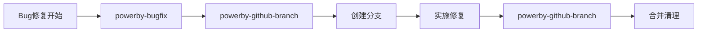

# PowerBy Bug-Fix 流程指南

**文档版本**: v3.1.0
**创建日期**: 2025-12-18
**最后更新**: 2025-12-26
**维护者**: PowerBy Team
**适用范围**: Bug诊断与修复专项流程
**更新说明**:
- v3.0.0 - 三层立体诊断分析框架（表现层-逻辑层-数据层）
- v3.1.0 - 问题报告阶段新增需求对齐与澄清环节

---

## 📑 目录

1. [概述与愿景](#1-概述与愿景)
2. [核心原则](#2-核心原则)
3. [七阶段修复流程](#3-七阶段修复流程)
4. [GitHub分支管理集成](#4-github分支管理集成)
5. [单文档记录标准](#5-单文档记录标准)
6. [质量保障](#6-质量保障)
7. [最佳实践](#7-最佳实践)
8. [常见问题](#8-常见问题)

---

## 1. 概述与愿景

### 1.1 什么是PowerBy Bug-Fix

PowerBy Bug-Fix是一个**专注于小而聚焦问题解决**的专项流程，采用证据驱动的诊断方法和单文档记录完整修复过程。它独立于P0-P8生命周期，完全聚焦于快速、准确地修复代码中的问题。

### 1.2 核心价值

- **快速响应**: 独立于主开发流程，快速处理紧急问题
- **证据驱动**: 所有推论基于错误日志、堆栈信息或代码逻辑
- **三层立体诊断**: 采用表现层-逻辑层-数据层立体诊断框架，确保全面覆盖无死角
- **跨层联动验证**: 两两验证+整体检查，形成完整证据链
- **最小代价**: 遵循奥卡姆剃刀原则，选择最直接的修复方案
- **完整记录**: 单文档记录整个修复过程，形成可复用经验
- **自动化集成**: 自动分支管理，无缝融入开发流程

### 1.3 适用范围

✅ **适用场景**:
- 代码中的bug或异常
- 功能不按预期工作
- 性能问题
- 兼容性问题
- 任何需要调试和修复的技术问题

❌ **不适用场景**:
- 大规模重构
- 新功能开发
- 架构变更

---

## 2. 核心原则

### 2.1 文档驱动 (Document-Driven)
- 所有工作必须严格基于提供的文档（bug报告、代码、日志）
- 严禁超出问题范围进行修改
- 来自核心理念：零假设原则

### 2.2 测试即规格 (Test is Specification)
- "没有测试的代码就是不存在的代码"
- 所有修复必须通过验证测试
- 来自核心理念：测试驱动开发、绝不禁用测试

### 2.3 设计先行 (Design First)
- 必须在修复前分析问题根本原因
- 所有修复方案都必须遵循核心设计哲学
- 来自核心理念：借鉴现有代码而后创造、做好规划

### 2.4 主动解决问题 (Proactive Problem-Solving)
- 遇到技术卡点时，必须立即启动主动式障碍解决协议
- 不仅要分析问题，更要主动设计多套备选解决方案
- 来自核心理念：3次尝试失败后停止并重新评估

### 2.5 Fail-Fast钢铁纪律 (Fail-Fast Iron Discipline)
- **显式抛出，禁止隐藏**：严禁使用try-catch捕获异常后仅打印日志或返回默认值
- **契约先行**：修复代码的每一个入口都必须进行严格的入参校验
- **报错即文档**：抛出的异常必须包含清晰的上下文数据
- **防御性编程**：所有修复代码必须实施边界检查
- **异常即规格**：在修复设计中，必须确保异常情况得到妥善处理
- **抛出确定性**：所有异常必须携带具体的上下文参数
- **禁止静默返回**：严禁在修复代码中返回错误标记，必须抛出异常

### 2.6 语义化文档契约 (Documentation as Truth)
- **注释即负债的抵消**：代码描述"如何修复"，注释必须描述"为什么这样修复"及"边界在哪里"
- **标准化协议**：所有修复代码必须遵循行业标准的文档化注释规范
  - JavaScript/TypeScript: JSDoc/TypeDoc
  - Python: PEP 257 (Docstrings)
  - Go: GoDoc
  - Java: Javadoc
- **同步演进**：修复改动，注释必须先动。严禁出现注释与代码逻辑脱节
- **契约透明化**：注释清晰标注修复原因、问题ID及关联模块
- **禁止描述行为**：注释禁止重复代码逻辑，必须解释修复策略或设计原因
- **文档驱动修复**：在编写修复代码前，必须先完成该修复的标准化文档注释
- **质量门禁锚定**：修复完成后，注释缺失或与代码逻辑不符将被视为严重的修复缺陷

### 2.7 证据驱动诊断 (Evidence-Driven Diagnosis)
- **证据至上**：拒绝"我觉得"、"可能"、"大概"。所有推论必须基于错误日志、堆栈信息或代码逻辑的必然性
- **溯源推理**：从表现层（Symptom）出发，沿着调用栈逆流而上，直至定位到最初的偏离点（Root Cause）
- **零假设分析**：不假设既有代码是正确的。当逻辑矛盾时，必须质疑每一行相关的逻辑
- **最小代价修复**：遵循奥卡姆剃刀原则，在确保修复彻底且不产生回归（Regression）的前提下，选择最直接、影响面最小的方案

### 2.8 三层立体诊断分析 (Three-Layer Diagnostic Analysis)
- **三层架构**：表现层（UI表现）+ 逻辑层（业务逻辑）+ 数据层（数据存储），每层独立分析
- **双重验证**：每层必须进行正确性证明（证据）+ 错误性排除（假设验证）
- **跨层联动**：表现↔逻辑、逻辑↔数据、数据↔表现，两两关系验证
- **整体检查**：从整体角度审视三层关系（闭环、自洽、一致性），防止局部最优
- **严格判定**：数据+逻辑+需求+表现均正确才视为正确，不能因为单一表现无异常就草率标记为正确
- **证据链构建**：正向证据链（表现←逻辑←数据）+ 反向排除链（排除法定位根因）

---

## 3. 七阶段修复流程

Bug-Fix技能采用**七阶段标准流程**：

### 阶段一：问题报告 (Problem Report) 🔍
**目标**: 创建完整的问题记录文档，**先对齐需求再描述问题**

**执行内容**:
- **需求对齐与澄清**：
  - 查找相关PRD文档和需求条目
  - 对齐业务目标和功能期望
  - **量化明确表达正确情况**（功能表现、业务逻辑、数据状态、边界条件、异常处理）
  - 提交用户确认需求理解
- **问题现象描述**：
  - 详细描述问题现象
  - 收集相关日志和错误信息
  - 记录复现步骤
  - 标注影响范围和严重程度

**输出**:
- `docs/bugs/global/bug-{id}.md` - 问题报告部分（包含需求对齐）
- 用户需求确认

**前置条件**:
- 用户必须确认需求理解正确
- 用户必须确认正确状态定义清晰
- 用户必须确认验收标准明确可量化

### 阶段二：诊断分析 (Diagnosis Analysis) 🔬
**目标**: 通过三层立体诊断分析，定位问题根本原因

**执行内容**:
- **表现层诊断**：分析UI表现、用户交互、界面响应
  - 代码分析：前端组件、UI逻辑、交互处理
  - 表现分析：预期vs实际表现、触发条件
  - 验证结论：正确性证明 + 错误性排除
- **逻辑层诊断**：分析业务逻辑、算法流程、数据处理
  - 代码分析：业务规则、算法实现、数据处理
  - 表现分析：逻辑流程、状态变化、调用链
  - 验证结论：正确性证明 + 错误性排除
- **数据层诊断**：分析数据存储、数据传输、数据完整性
  - 代码分析：数据库操作、API调用、数据模型
  - 表现分析：数据流向、数据状态、数据一致性
  - 验证结论：正确性证明 + 错误性排除
- **三层联动验证**：
  - 跨层一致性检查：表现↔逻辑、逻辑↔数据、数据↔表现
  - 反向排除验证：假设某层错误，分析对其他层的影响
  - 整体检查：从整体角度审视三层关系（闭环、自洽、一致性）
  - 证据链构建：正向证据链 + 反向排除链
- **最终结论**：
  - 根因定位（所在层、具体位置、触发机制）
  - 影响范围评估（三层影响 + 用户/功能影响）
  - 严重程度评估（数据+逻辑+需求+表现均正确才视为正确）

**输出**: `docs/bugs/global/bug-{id}.md` - 诊断分析部分（三层立体框架）

### 阶段三：修复方案确认 (Fix Design & Evaluation)
**目标**: 提供修复方案，等待用户确认

**执行内容**:
- 设计至少两个修复选项
- 分析各方案优缺点
- 评估对系统的影响
- 提交用户确认

**用户确认格式**:
```
确认方案：[方案A/方案B/方案C]
意见：[用户意见]
```

**输出**: `docs/bugs/global/bug-{id}.md` - 修复方案确认部分

### 阶段四：用户确认 (User Confirmation)
**目标**: 获取用户对修复方案的确认

**执行内容**:
- 等待用户选择方案
- 记录用户意见
- 准备实施方案

**输出**: `docs/bugs/global/bug-{id}.md` - 用户确认部分

### 阶段五：实施修复 (Implement Fix)
**目标**: 根据确认的方案实施修复

**执行内容**:
- 编写修复代码
- 添加必要的注释
- 编写验证测试
- 提交代码变更

**输出**:
- `docs/bugs/global/bug-{id}.md` - 实施修复部分
- 修复代码和测试

### 阶段六：验证测试 (Verification Testing)
**目标**: 确保修复有效且无副作用

**执行内容**:
- 运行复现测试用例
- 执行回归测试
- 验证边界条件
- 确认修复效果

**输出**: `docs/bugs/global/bug-{id}.md` - 验证测试部分

### 阶段七：交付归档 (Delivery & Archive)
**目标**: 完成修复并归档记录

**执行内容**:
- 提交最终报告
- 合并和清理分支
- 归档修复文档
- 更新知识库

**输出**:
- `docs/bugs/global/bug-{id}.md` - 交付归档部分
- 已清理的分支

---

## 4. GitHub分支管理集成

### 4.1 自动分支管理

Bug-Fix技能集成了完整的GitHub分支管理功能：



### 4.2 分支类型选择

根据Bug严重程度自动选择分支类型：

**P0/P1级别 Bug (紧急修复)**
- 分支类型: `hotfix/{id}-{description}`
- 分支源: 从 `main` 创建
- 合并策略: 同时合并到 `main` 和 `develop`

**P2/P3级别 Bug (一般修复)**
- 分支类型: `bugfix/{id}-{description}`
- 分支源: 从 `develop` 创建
- 合并策略: 合并到 `develop`

### 4.3 自动化流程

**修复开始**:
```bash
powerby-bugfix → powerby-github-branch.create_bugfix_branch()
→ 根据严重程度创建 bugfix/ 或 hotfix/ 分支
```

**修复完成**:
```bash
powerby-bugfix → powerby-github-branch.merge_and_cleanup()
→ 合并到相应分支并清理临时分支
```

### 4.4 技能协作

| 调用方 | 功能 | 触发时机 | 自动化程度 |
|--------|------|---------|-----------|
| powerby-bugfix | 创建bugfix/hotfix分支 | Bug修复开始时 | 全自动 |
| powerby-bugfix | 合并和清理分支 | Bug修复完成后 | 全自动 |

---

## 5. 单文档记录标准

### 5.1 文档结构

所有修复过程都在一个文档中完成：`docs/bugs/global/bug-{id}.md`

```
docs/bugs/global/bug-{id}.md
├── 问题报告
├── 诊断分析
├── 修复方案确认
├── 用户确认
├── 实施修复
├── 验证测试
└── 交付归档
```

### 5.2 文档维护

- **增量更新**: 每个阶段完成后更新文档
- **版本追踪**: 记录每次更新的时间和内容
- **关联引用**: 与相关文档（PRD、架构等）建立关联
- **归档管理**: 修复完成后归档到 `docs/bugs/archived/`

---

## 6. 质量保障

### 6.1 质量门禁

| Gate | 检查要点 | 通过标准 |
|------|----------|----------|
| Gate 1 | 问题报告完整性 | 需求对齐清晰、正确状态定义量化、现象清晰、复现步骤明确 |
| Gate 2 | 诊断分析准确性 | 三层立体诊断完整、跨层验证充分、根因定位准确 |
| Gate 3 | 修复方案合理性 | 方案可行、影响面最小 |
| Gate 4 | 用户确认 | 方案已确认、意见已记录 |
| Gate 5 | 修复实施质量 | 代码规范、注释完整 |
| Gate 6 | 验证测试有效性 | 测试通过、无副作用 |
| Gate 7 | 交付完整性 | 文档完整、分支已清理 |

### 6.2 审查清单

- [ ] 问题报告完整且准确
  - [ ] 需求对齐清晰（相关PRD、业务目标、验收标准）
  - [ ] 正确状态定义量化（功能表现、业务逻辑、数据状态、边界条件、异常处理）
  - [ ] 用户已确认需求理解正确
- [ ] 诊断分析采用三层立体框架（表现层-逻辑层-数据层）
- [ ] 跨层联动验证充分（两两验证+整体检查）
- [ ] 证据链构建完整（正向+反向）
- [ ] 修复方案经过用户确认
- [ ] 代码符合编码规范
- [ ] 测试用例充分覆盖
- [ ] 文档记录完整清晰
- [ ] 分支已正确合并和清理

---

## 7. 最佳实践

### ✅ 推荐做法

1. **证据驱动**: 所有分析基于实际日志和代码
2. **最小影响**: 选择影响面最小的修复方案
3. **充分测试**: 确保修复无副作用
4. **完整记录**: 详细记录整个修复过程
5. **及时清理**: 修复完成后立即清理临时分支

### ❌ 避免做法

1. **假设推理**: 不基于证据的推测
2. **过度修复**: 修改超出问题范围
3. **静默处理**: 不抛出异常或返回错误标记
4. **忽略测试**: 修复不经过验证测试
5. **遗留分支**: 修复后不清理临时分支

---

## 8. 常见问题

### Q1: 如何确定Bug的严重程度？
**A**:
- P0/P1: 影响生产环境，导致系统崩溃或数据丢失
- P2/P3: 影响功能使用，但有替代方案或影响范围有限

### Q2: 何时需要创建hotfix分支？
**A**:
- 生产环境紧急问题
- 安全性问题
- 影响多个用户的关键功能故障

### Q3: 修复方案如何选择？
**A**:
- 优先选择影响面最小的方案
- 考虑长期维护成本
- 遵循奥卡姆剃刀原则

### Q4: 如何确保修复质量？
**A**:
- 编写充分的测试用例
- 执行回归测试
- 进行边界条件验证
- 代码审查

---

**版本**: v3.1.0
**最后更新**: 2025-12-26
**维护者**: PowerBy Team
