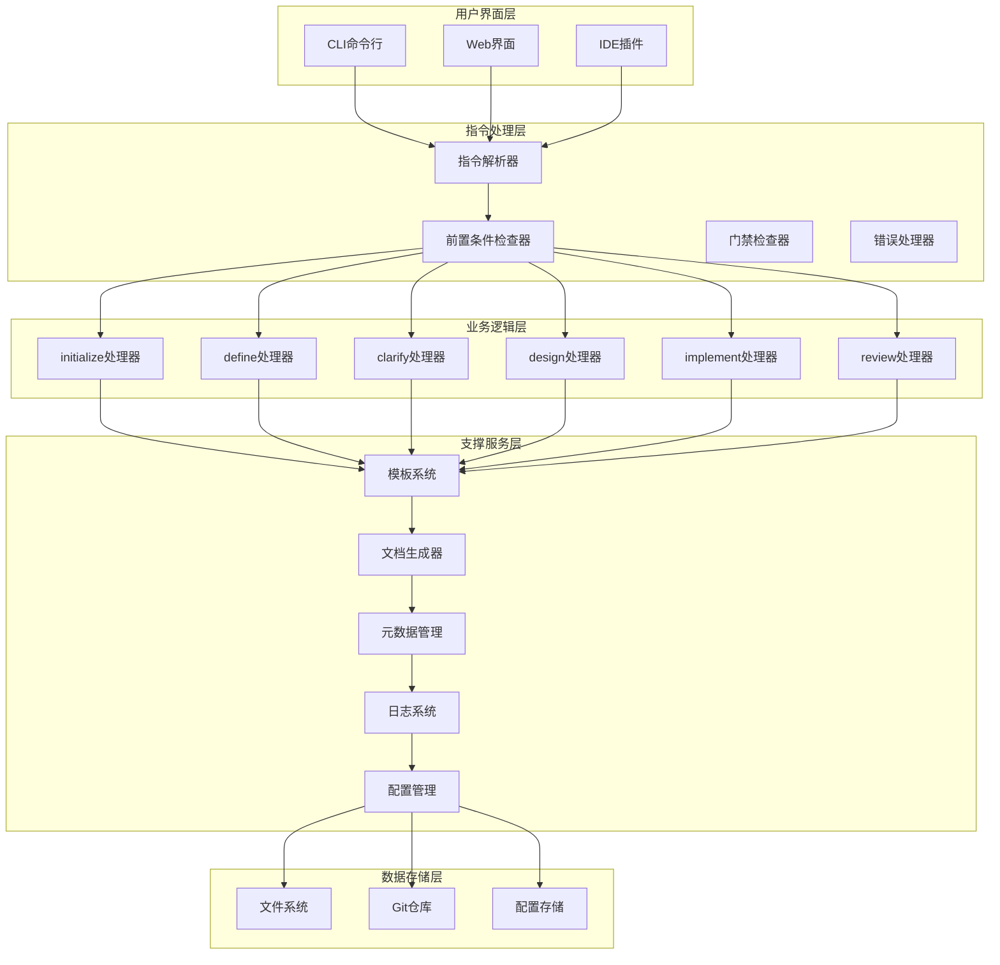

# PowerBy 指令实现细节

**版本**: v1.0.0
**设计日期**: 2025-12-18
**基于**: PowerBy指令流程架构

---

## 一、整体架构设计

### 1.1 系统架构

PowerBy指令系统采用模块化架构，包含以下核心组件：



### 1.2 核心模块

| 模块名称 | 职责 | 主要功能 |
|---------|-----|---------|
| 指令解析器 | 解析用户输入的指令 | 指令识别、参数提取、选项解析 |
| 前置条件检查器 | 验证指令执行的前置条件 | 文件存在性检查、阶段状态检查、依赖关系验证 |
| 门禁检查器 | 执行质量门禁检查 | 检查清单执行、结果验证、报告生成 |
| 错误处理器 | 处理指令执行过程中的错误 | 错误分类、错误消息生成、恢复建议 |
| 模板系统 | 管理文档模板 | 模板加载、模板渲染、模板验证 |
| 文档生成器 | 生成项目文档 | 文档结构生成、内容填充、格式验证 |
| 元数据管理 | 管理项目元数据 | 元数据读写、状态更新、版本管理 |
| 日志系统 | 记录指令执行日志 | 日志记录、日志查询、日志分析 |

---

## 二、指令解析器设计

### 2.1 指令格式规范

**基本格式**:
```bash
/powerby.<command> [参数] [选项]
```

**示例**:
```bash
/powerby.initialize my-project "这是一个示例项目"
/powerby.define "我想要构建一个电商网站" --user-group "消费者" --timeline "2025-12-31"
/powerby.clarify --prd-path docs/iterations/001-ecommerce/prd.md
/powerby.design --prd-path docs/iterations/001-ecommerce/prd.md
/powerby.implement --prd-path docs/iterations/001-ecommerce/prd.md
/powerby.review --prd-path docs/iterations/001-ecommerce/prd.md --pr-link https://github.com/example/repo/pull/1
```

### 2.2 解析器实现

```python
class PowerByCommandParser:
    """PowerBy指令解析器"""

    def __init__(self):
        self.commands = {
            'initialize': self._parse_initialize,
            'define': self._parse_define,
            'clarify': self._parse_clarify,
            'design': self._parse_design,
            'implement': self._parse_implement,
            'review': self._parse_review,
        }

    def parse(self, input_text: str) -> dict:
        """解析指令输入"""
        # 移除前导斜杠和空格
        text = input_text.strip().lstrip('/')

        # 分割指令和参数
        parts = text.split()
        if len(parts) < 2:
            raise ValueError("指令格式错误：请使用 /powerby.<command> 格式")

        command = parts[1]  # 获取指令名称

        # 验证指令是否支持
        if command not in self.commands:
            raise ValueError(f"不支持的指令：{command}")

        # 调用对应的解析函数
        return self.commands[command](parts[2:])

    def _parse_initialize(self, args: list) -> dict:
        """解析initialize指令"""
        # 解析参数
        if len(args) < 2:
            raise ValueError("initialize指令需要项目名称和描述")

        project_name = args[0]
        project_description = ' '.join(args[1:])

        # 解析选项
        options = self._parse_options(args)

        return {
            'command': 'initialize',
            'project_name': project_name,
            'project_description': project_description,
            'options': options
        }

    def _parse_define(self, args: list) -> dict:
        """解析define指令"""
        # 解析参数
        if len(args) < 1:
            raise ValueError("define指令需要产品想法描述")

        product_idea = ' '.join(args)

        # 解析选项
        options = self._parse_options(args)

        return {
            'command': 'define',
            'product_idea': product_idea,
            'options': options
        }

    def _parse_clarify(self, args: list) -> dict:
        """解析clarify指令"""
        # 解析选项
        options = self._parse_options(args)

        return {
            'command': 'clarify',
            'options': options
        }

    def _parse_design(self, args: list) -> dict:
        """解析design指令"""
        # 解析选项
        options = self._parse_options(args)

        return {
            'command': 'design',
            'options': options
        }

    def _parse_implement(self, args: list) -> dict:
        """解析implement指令"""
        # 解析选项
        options = self._parse_options(args)

        return {
            'command': 'implement',
            'options': options
        }

    def _parse_review(self, args: list) -> dict:
        """解析review指令"""
        # 解析选项
        options = self._parse_options(args)

        return {
            'command': 'review',
            'options': options
        }

    def _parse_options(self, args: list) -> dict:
        """解析选项参数"""
        options = {}
        i = 0

        while i < len(args):
            arg = args[i]

            # 检查选项格式
            if arg.startswith('--'):
                # 长选项
                option_name = arg[2:]  # 移除--
                option_value = True

                # 检查是否有值
                if i + 1 < len(args) and not args[i + 1].startswith('--'):
                    option_value = args[i + 1]
                    i += 1

                options[option_name] = option_value

            i += 1

        return options
```

### 2.3 使用示例

```python
# 创建解析器实例
parser = PowerByCommandParser()

# 解析initialize指令
result = parser.parse("/powerby.initialize my-project \"这是一个示例项目\"")
print(result)
# 输出:
# {
#     'command': 'initialize',
#     'project_name': 'my-project',
#     'project_description': '这是一个示例项目',
#     'options': {}
# }

# 解析define指令
result = parser.parse('/powerby.define "我想要构建一个电商网站" --user-group "消费者" --timeline "2025-12-31"')
print(result)
# 输出:
# {
#     'command': 'define',
#     'product_idea': '我想要构建一个电商网站',
#     'options': {
#         'user-group': '消费者',
#         'timeline': '2025-12-31'
#     }
# }
```

---

## 三、前置条件检查器设计

### 3.1 检查器实现

```python
class PreconditionChecker:
    """前置条件检查器"""

    def __init__(self, project_path: str):
        self.project_path = project_path
        self.project_json_path = os.path.join(project_path, '.powerby', 'project.json')

    def check(self, command: str) -> dict:
        """检查前置条件"""
        # 定义各指令的前置条件
        preconditions = {
            'initialize': self._check_initialize,
            'define': self._check_define,
            'clarify': self._check_clarify,
            'design': self._check_design,
            'implement': self._check_implement,
            'review': self._check_review,
        }

        # 调用对应的检查函数
        if command in preconditions:
            return preconditions[command]()
        else:
            return {
                'passed': False,
                'errors': [f"未知指令：{command}"]
            }

    def _check_initialize(self) -> dict:
        """检查initialize前置条件"""
        errors = []

        # 检查目录权限
        if not os.access(self.project_path, os.W_OK):
            errors.append("当前目录没有写权限")

        # 检查磁盘空间
        if self._check_disk_space() < 100:  # 至少需要100MB
            errors.append("磁盘空间不足，至少需要100MB")

        return {
            'passed': len(errors) == 0,
            'errors': errors
        }

    def _check_define(self) -> dict:
        """检查define前置条件"""
        errors = []

        # 检查项目宪章是否存在
        constitution_path = os.path.join(self.project_path, 'docs', 'constitution.md')
        if not os.path.exists(constitution_path):
            errors.append("项目宪章不存在，请先运行 /powerby.initialize")

        # 检查项目元数据是否存在
        if not os.path.exists(self.project_json_path):
            errors.append("项目元数据不存在，请先运行 /powerby.initialize")

        # 检查当前阶段
        current_phase = self._get_current_phase()
        if current_phase != 'P0':
            errors.append(f"当前阶段是 {current_phase}，必须是 P0 才能运行 define")

        return {
            'passed': len(errors) == 0,
            'errors': errors
        }

    def _check_clarify(self) -> dict:
        """检查clarify前置条件"""
        errors = []

        # 检查PRD文档是否存在
        prd_path = self._find_latest_prd()
        if not prd_path:
            errors.append("PRD文档不存在，请先运行 /powerby.define")

        # 检查功能点清单是否存在
        function_points_path = self._find_latest_function_points()
        if not function_points_path:
            errors.append("功能点清单不存在，请先运行 /powerby.define")

        # 检查当前阶段
        current_phase = self._get_current_phase()
        if current_phase != 'P1':
            errors.append(f"当前阶段是 {current_phase}，必须是 P1 才能运行 clarify")

        return {
            'passed': len(errors) == 0,
            'errors': errors
        }

    def _check_design(self) -> dict:
        """检查design前置条件"""
        errors = []

        # 检查澄清记录是否存在
        clarifications_path = self._find_latest_clarifications()
        if not clarifications_path:
            errors.append("澄清记录不存在，请先运行 /powerby.clarify")

        # 检查当前阶段
        current_phase = self._get_current_phase()
        if current_phase != 'P2':
            errors.append(f"当前阶段是 {current_phase}，必须是 P2 才能运行 design")

        return {
            'passed': len(errors) == 0,
            'errors': errors
        }

    def _check_implement(self) -> dict:
        """检查implement前置条件"""
        errors = []

        # 检查架构设计文档是否存在
        architecture_path = self._find_latest_architecture()
        if not architecture_path:
            errors.append("架构设计文档不存在，请先运行 /powerby.design")

        # 检查当前阶段
        current_phase = self._get_current_phase()
        if current_phase != 'P4':
            errors.append(f"当前阶段是 {current_phase}，必须是 P4 才能运行 implement")

        return {
            'passed': len(errors) == 0,
            'errors': errors
        }

    def _check_review(self) -> dict:
        """检查review前置条件"""
        errors = []

        # 检查实现报告是否存在
        implementation_report_path = self._find_latest_implementation_report()
        if not implementation_report_path:
            errors.append("实现报告不存在，请先运行 /powerby.implement")

        # 检查当前阶段
        current_phase = self._get_current_phase()
        if current_phase != 'P6':
            errors.append(f"当前阶段是 {current_phase}，必须是 P6 才能运行 review")

        return {
            'passed': len(errors) == 0,
            'errors': errors
        }

    def _get_current_phase(self) -> str:
        """获取当前阶段"""
        try:
            with open(self.project_json_path, 'r') as f:
                project_data = json.load(f)
                return project_data.get('phase', 'P0')
        except:
            return 'P0'

    def _check_disk_space(self) -> int:
        """检查磁盘空间（MB）"""
        # 这里实现磁盘空间检查逻辑
        # 返回可用空间（MB）
        return 1024  # 模拟值

    def _find_latest_prd(self) -> str:
        """查找最新的PRD文档"""
        iterations_dir = os.path.join(self.project_path, 'docs', 'iterations')
        if not os.path.exists(iterations_dir):
            return None

        for entry in os.listdir(iterations_dir):
            prd_path = os.path.join(iterations_dir, entry, 'prd.md')
            if os.path.exists(prd_path):
                return prd_path

        return None

    def _find_latest_function_points(self) -> str:
        """查找最新的功能点清单"""
        iterations_dir = os.path.join(self.project_path, 'docs', 'iterations')
        if not os.path.exists(iterations_dir):
            return None

        for entry in os.listdir(iterations_dir):
            function_points_path = os.path.join(iterations_dir, entry, 'function-points.md')
            if os.path.exists(function_points_path):
                return function_points_path

        return None

    def _find_latest_clarifications(self) -> str:
        """查找最新的澄清记录"""
        iterations_dir = os.path.join(self.project_path, 'docs', 'iterations')
        if not os.path.exists(iterations_dir):
            return None

        for entry in os.listdir(iterations_dir):
            clarifications_path = os.path.join(iterations_dir, entry, 'clarifications.md')
            if os.path.exists(clarifications_path):
                return clarifications_path

        return None

    def _find_latest_architecture(self) -> str:
        """查找最新的架构设计文档"""
        iterations_dir = os.path.join(self.project_path, 'docs', 'iterations')
        if not os.path.exists(iterations_dir):
            return None

        for entry in os.listdir(iterations_dir):
            architecture_path = os.path.join(iterations_dir, entry, 'architecture.md')
            if os.path.exists(architecture_path):
                return architecture_path

        return None

    def _find_latest_implementation_report(self) -> str:
        """查找最新的实现报告"""
        iterations_dir = os.path.join(self.project_path, 'docs', 'iterations')
        if not os.path.exists(iterations_dir):
            return None

        for entry in os.listdir(iterations_dir):
            implementation_report_path = os.path.join(iterations_dir, entry, 'implementation-report.md')
            if os.path.exists(implementation_report_path):
                return implementation_report_path

        return None
```

### 3.2 使用示例

```python
# 创建检查器实例
checker = PreconditionChecker('/path/to/project')

# 检查define指令前置条件
result = checker.check('define')
if result['passed']:
    print("前置条件检查通过")
else:
    print("前置条件检查失败：")
    for error in result['errors']:
        print(f"  - {error}")
```

---

## 四、模板系统设计

### 4.1 模板管理器

```python
class TemplateManager:
    """模板管理器"""

    def __init__(self, templates_dir: str):
        self.templates_dir = templates_dir
        self.templates = {}
        self._load_templates()

    def _load_templates(self):
        """加载所有模板"""
        # 定义模板文件映射
        template_files = {
            'constitution': 'constitution-template.md',
            'prd': 'prd-template.md',
            'function-points': 'function-points-template.md',
            'clarifications': 'clarifications-template.md',
            'technical-research': 'technical-research-template.md',
            'architecture': 'architecture-template.md',
            'tasks': 'tasks-template.md',
            'implementation-report': 'implementation-report-template.md',
            'code-review-report': 'code-review-report-template.md',
            'delivery-report': 'delivery-report-template.md',
        }

        for template_name, file_name in template_files.items():
            template_path = os.path.join(self.templates_dir, file_name)
            if os.path.exists(template_path):
                with open(template_path, 'r', encoding='utf-8') as f:
                    self.templates[template_name] = f.read()
            else:
                print(f"警告：模板文件不存在 {template_path}")

    def get_template(self, template_name: str) -> str:
        """获取模板"""
        if template_name not in self.templates:
            raise ValueError(f"模板不存在：{template_name}")
        return self.templates[template_name]

    def render_template(self, template_name: str, context: dict) -> str:
        """渲染模板"""
        template = self.get_template(template_name)

        # 使用简单的字符串替换
        # 在实际实现中，可以使用更强大的模板引擎（如Jinja2）
        rendered = template

        for key, value in context.items():
            placeholder = f"{{{key}}}"
            rendered = rendered.replace(placeholder, str(value))

        return rendered

    def validate_template(self, template_name: str) -> dict:
        """验证模板"""
        template = self.get_template(template_name)

        # 检查必填字段
        required_fields = self._get_required_fields(template_name)
        missing_fields = []

        for field in required_fields:
            if f"{{{field}}}" not in template:
                missing_fields.append(field)

        return {
            'valid': len(missing_fields) == 0,
            'missing_fields': missing_fields
        }

    def _get_required_fields(self, template_name: str) -> list:
        """获取模板的必填字段"""
        required_fields_map = {
            'constitution': ['project_name', 'project_description'],
            'prd': ['project_name', 'iteration_id', 'creation_date'],
            'function-points': ['iteration_id', 'creation_date'],
            'clarifications': ['iteration_id', 'creation_date'],
            'technical-research': ['iteration_id', 'branch_name', 'report_date'],
            'architecture': ['project_name', 'iteration_id', 'branch_name', 'creation_date'],
            'tasks': ['iteration_id', 'branch_name', 'creation_date'],
            'implementation-report': ['iteration_id', 'completion_date'],
            'code-review-report': ['iteration_id', 'branch_name', 'review_date'],
            'delivery-report': ['iteration_id', 'project_name', 'delivery_date'],
        }

        return required_fields_map.get(template_name, [])
```

### 4.2 模板渲染器

```python
class TemplateRenderer:
    """模板渲染器"""

    def __init__(self, template_manager: TemplateManager):
        self.template_manager = template_manager

    def render_constitution(self, project_name: str, project_description: str, team: list = None, tech_stack: list = None) -> str:
        """渲染项目宪章"""
        context = {
            'project_name': project_name,
            'project_description': project_description,
            'team': ', '.join(team) if team else '',
            'tech_stack': ', '.join(tech_stack) if tech_stack else '',
            'creation_date': datetime.now().strftime('%Y-%m-%d'),
            'version': '1.0.0'
        }

        return self.template_manager.render_template('constitution', context)

    def render_prd(self, project_name: str, iteration_id: str, product_idea: str, user_input: dict) -> str:
        """渲染PRD文档"""
        context = {
            'project_name': project_name,
            'iteration_id': iteration_id,
            'creation_date': datetime.now().strftime('%Y-%m-%d'),
            'product_idea': product_idea,
            'user_group': user_input.get('user_group', ''),
            'core_problem': user_input.get('core_problem', ''),
            'timeline': user_input.get('timeline', ''),
            'constraints': user_input.get('constraints', '')
        }

        return self.template_manager.render_template('prd', context)

    def render_function_points(self, iteration_id: str, function_points: list) -> str:
        """渲染功能点清单"""
        context = {
            'iteration_id': iteration_id,
            'creation_date': datetime.now().strftime('%Y-%m-%d'),
            'function_points': self._format_function_points(function_points)
        }

        return self.template_manager.render_template('function-points', context)

    def _format_function_points(self, function_points: list) -> str:
        """格式化功能点列表"""
        formatted = ""

        # 按优先级分组
        p0_functions = [fp for fp in function_points if fp['priority'] == 'P0']
        p1_functions = [fp for fp in function_points if fp['priority'] == 'P1']
        p2_functions = [fp for fp in function_points if fp['priority'] == 'P2']

        # 渲染P0功能
        if p0_functions:
            formatted += "### [P0] 核心功能\n\n"
            for fp in p0_functions:
                formatted += f"#### F{fp['id']} {fp['name']}\n"
                formatted += f"- **需求来源**: {fp['source']}\n"
                formatted += f"- **功能描述**: {fp['description']}\n"
                formatted += f"- **用户输入**: {fp['user_input']}\n"
                formatted += f"- **系统输出**: {fp['output']}\n"
                formatted += f"- **关键约束**: {fp['constraints']}\n"
                formatted += f"- **验收标准**: {fp['acceptance_criteria']}\n"
                formatted += f"- **依赖关系**: {fp['dependencies']}\n"
                formatted += f"- **预估工时**: {fp['estimated_hours']}\n\n"

        # 渲染P1功能
        if p1_functions:
            formatted += "### [P1] 重要功能\n\n"
            for fp in p1_functions:
                formatted += f"#### F{fp['id']} {fp['name']}\n"
                formatted += f"[同样结构...]\n\n"

        # 渲染P2功能
        if p2_functions:
            formatted += "### [P2] 增强功能\n\n"
            for fp in p2_functions:
                formatted += f"#### F{fp['id']} {fp['name']}\n"
                formatted += f"[同样结构...]\n\n"

        return formatted
```

### 4.3 使用示例

```python
# 创建模板管理器
template_manager = TemplateManager('/path/to/templates')

# 创建模板渲染器
renderer = TemplateRenderer(template_manager)

# 渲染项目宪章
constitution = renderer.render_constitution(
    project_name="my-project",
    project_description="这是一个示例项目",
    team=["张三", "李四"],
    tech_stack=["Python", "React"]
)

# 写入文件
with open('docs/constitution.md', 'w', encoding='utf-8') as f:
    f.write(constitution)
```

---

## 五、文档生成器设计

### 5.1 文档生成器实现

```python
class DocumentGenerator:
    """文档生成器"""

    def __init__(self, project_path: str, template_renderer: TemplateRenderer):
        self.project_path = project_path
        self.template_renderer = template_renderer
        self.docs_dir = os.path.join(project_path, 'docs')
        self.iterations_dir = os.path.join(self.docs_dir, 'iterations')

    def generate_prd(self, project_name: str, product_idea: str, user_input: dict) -> str:
        """生成PRD文档"""
        # 生成迭代编号
        iteration_id = self._generate_iteration_id()

        # 创建迭代目录
        iteration_dir = os.path.join(self.iterations_dir, iteration_id)
        os.makedirs(iteration_dir, exist_ok=True)

        # 渲染PRD文档
        prd_content = self.template_renderer.render_prd(
            project_name=project_name,
            iteration_id=iteration_id,
            product_idea=product_idea,
            user_input=user_input
        )

        # 写入文件
        prd_path = os.path.join(iteration_dir, 'prd.md')
        with open(prd_path, 'w', encoding='utf-8') as f:
            f.write(prd_content)

        return prd_path

    def generate_function_points(self, iteration_id: str, function_points: list) -> str:
        """生成功能点清单"""
        # 创建迭代目录
        iteration_dir = os.path.join(self.iterations_dir, iteration_id)
        os.makedirs(iteration_dir, exist_ok=True)

        # 渲染功能点清单
        function_points_content = self.template_renderer.render_function_points(
            iteration_id=iteration_id,
            function_points=function_points
        )

        # 写入文件
        function_points_path = os.path.join(iteration_dir, 'function-points.md')
        with open(function_points_path, 'w', encoding='utf-8') as f:
            f.write(function_points_content)

        return function_points_path

    def generate_clarifications(self, iteration_id: str, clarifications: dict) -> str:
        """生成澄清记录"""
        # 创建迭代目录
        iteration_dir = os.path.join(self.iterations_dir, iteration_id)
        os.makedirs(iteration_dir, exist_ok=True)

        # 渲染澄清记录
        clarifications_content = self.template_renderer.render_clarifications(
            iteration_id=iteration_id,
            clarifications=clarifications
        )

        # 写入文件
        clarifications_path = os.path.join(iteration_dir, 'clarifications.md')
        with open(clarifications_path, 'w', encoding='utf-8') as f:
            f.write(clarifications_content)

        return clarifications_path

    def generate_technical_research(self, iteration_id: str, research_data: dict) -> str:
        """生成技术调研报告"""
        # 创建迭代目录
        iteration_dir = os.path.join(self.iterations_dir, iteration_id)
        os.makedirs(iteration_dir, exist_ok=True)

        # 渲染技术调研报告
        research_content = self.template_renderer.render_technical_research(
            iteration_id=iteration_id,
            research_data=research_data
        )

        # 写入文件
        research_path = os.path.join(iteration_dir, 'technical-research.md')
        with open(research_path, 'w', encoding='utf-8') as f:
            f.write(research_content)

        return research_path

    def generate_architecture(self, iteration_id: str, architecture_data: dict) -> str:
        """生成架构设计文档"""
        # 创建迭代目录
        iteration_dir = os.path.join(self.iterations_dir, iteration_id)
        os.makedirs(iteration_dir, exist_ok=True)

        # 渲染架构设计文档
        architecture_content = self.template_renderer.render_architecture(
            iteration_id=iteration_id,
            architecture_data=architecture_data
        )

        # 写入文件
        architecture_path = os.path.join(iteration_dir, 'architecture.md')
        with open(architecture_path, 'w', encoding='utf-8') as f:
            f.write(architecture_content)

        return architecture_path

    def generate_tasks(self, iteration_id: str, tasks: list) -> str:
        """生成开发任务计划"""
        # 创建迭代目录
        iteration_dir = os.path.join(self.iterations_dir, iteration_id)
        os.makedirs(iteration_dir, exist_ok=True)

        # 渲染开发任务计划
        tasks_content = self.template_renderer.render_tasks(
            iteration_id=iteration_id,
            tasks=tasks
        )

        # 写入文件
        tasks_path = os.path.join(iteration_dir, 'tasks.md')
        with open(tasks_path, 'w', encoding='utf-8') as f:
            f.write(tasks_content)

        return tasks_path

    def generate_implementation_report(self, iteration_id: str, report_data: dict) -> str:
        """生成实现报告"""
        # 创建迭代目录
        iteration_dir = os.path.join(self.iterations_dir, iteration_id)
        os.makedirs(iteration_dir, exist_ok=True)

        # 渲染实现报告
        report_content = self.template_renderer.render_implementation_report(
            iteration_id=iteration_id,
            report_data=report_data
        )

        # 写入文件
        report_path = os.path.join(iteration_dir, 'implementation-report.md')
        with open(report_path, 'w', encoding='utf-8') as f:
            f.write(report_content)

        return report_path

    def generate_code_review_report(self, iteration_id: str, review_data: dict) -> str:
        """生成代码审计报告"""
        # 创建迭代目录
        iteration_dir = os.path.join(self.iterations_dir, iteration_id)
        os.makedirs(iteration_dir, exist_ok=True)

        # 渲染代码审计报告
        review_content = self.template_renderer.render_code_review_report(
            iteration_id=iteration_id,
            review_data=review_data
        )

        # 写入文件
        review_path = os.path.join(iteration_dir, 'code-review-report.md')
        with open(review_path, 'w', encoding='utf-8') as f:
            f.write(review_content)

        return review_path

    def generate_delivery_report(self, iteration_id: str, delivery_data: dict) -> str:
        """生成交付报告"""
        # 创建迭代目录
        iteration_dir = os.path.join(self.iterations_dir, iteration_id)
        os.makedirs(iteration_dir, exist_ok=True)

        # 渲染交付报告
        delivery_content = self.template_renderer.render_delivery_report(
            iteration_id=iteration_id,
            delivery_data=delivery_data
        )

        # 写入文件
        delivery_path = os.path.join(iteration_dir, 'delivery-report.md')
        with open(delivery_path, 'w', encoding='utf-8') as f:
            f.write(delivery_content)

        return delivery_path

    def _generate_iteration_id(self) -> str:
        """生成迭代编号"""
        if not os.path.exists(self.iterations_dir):
            return "001"

        # 查找现有的迭代编号
        existing_ids = []
        for entry in os.listdir(self.iterations_dir):
            if os.path.isdir(os.path.join(self.iterations_dir, entry)):
                # 提取编号部分
                parts = entry.split('-')
                if parts[0].isdigit():
                    existing_ids.append(int(parts[0]))

        # 生成下一个编号
        next_id = max(existing_ids) + 1 if existing_ids else 1
        return f"{next_id:03d}"
```

### 5.2 使用示例

```python
# 创建文档生成器
generator = DocumentGenerator('/path/to/project', renderer)

# 生成PRD文档
prd_path = generator.generate_prd(
    project_name="my-project",
    product_idea="我想要构建一个电商网站",
    user_input={
        "user_group": "消费者",
        "core_problem": "在线购物需求",
        "timeline": "2025-12-31",
        "constraints": "预算有限"
    }
)

print(f"PRD文档已生成：{prd_path}")
```

---

## 六、元数据管理系统设计

### 6.1 元数据管理器

```python
class MetadataManager:
    """元数据管理器"""

    def __init__(self, project_path: str):
        self.project_path = project_path
        self.metadata_dir = os.path.join(project_path, '.powerby')
        self.project_json_path = os.path.join(self.metadata_dir, 'project.json')
        self.iterations_json_path = os.path.join(self.metadata_dir, 'iterations.json')

    def initialize_project(self, project_name: str, project_description: str, team: list = None, tech_stack: list = None) -> dict:
        """初始化项目元数据"""
        # 创建目录
        os.makedirs(self.metadata_dir, exist_ok=True)

        # 创建项目元数据
        project_data = {
            "name": project_name,
            "description": project_description,
            "version": "1.0.0",
            "phase": "P0",
            "status": "initialized",
            "created": datetime.now().strftime('%Y-%m-%d'),
            "team": team or [],
            "tech_stack": tech_stack or []
        }

        # 写入项目元数据文件
        with open(self.project_json_path, 'w', encoding='utf-8') as f:
            json.dump(project_data, f, ensure_ascii=False, indent=2)

        # 创建迭代元数据文件
        iterations_data = {
            "iterations": [],
            "current_iteration": None
        }

        with open(self.iterations_json_path, 'w', encoding='utf-8') as f:
            json.dump(iterations_data, f, ensure_ascii=False, indent=2)

        return project_data

    def get_project_metadata(self) -> dict:
        """获取项目元数据"""
        try:
            with open(self.project_json_path, 'r', encoding='utf-8') as f:
                return json.load(f)
        except FileNotFoundError:
            return {}

    def update_project_phase(self, phase: str) -> dict:
        """更新项目阶段"""
        project_data = self.get_project_metadata()
        project_data['phase'] = phase
        project_data['last_updated'] = datetime.now().strftime('%Y-%m-%d %H:%M:%S')

        with open(self.project_json_path, 'w', encoding='utf-8') as f:
            json.dump(project_data, f, ensure_ascii=False, indent=2)

        return project_data

    def update_project_status(self, status: str) -> dict:
        """更新项目状态"""
        project_data = self.get_project_metadata()
        project_data['status'] = status
        project_data['last_updated'] = datetime.now().strftime('%Y-%m-%d %H:%M:%S')

        with open(self.project_json_path, 'w', encoding='utf-8') as f:
            json.dump(project_data, f, ensure_ascii=False, indent=2)

        return project_data

    def add_iteration(self, iteration_id: str, iteration_data: dict) -> dict:
        """添加迭代"""
        iterations_data = self.get_iterations_metadata()

        # 检查迭代是否已存在
        for iteration in iterations_data['iterations']:
            if iteration['id'] == iteration_id:
                # 更新现有迭代
                iteration.update(iteration_data)
                break
        else:
            # 添加新迭代
            iterations_data['iterations'].append({
                "id": iteration_id,
                "created": datetime.now().strftime('%Y-%m-%d'),
                "status": "active",
                **iteration_data
            })

        # 更新当前迭代
        iterations_data['current_iteration'] = iteration_id

        # 写入文件
        with open(self.iterations_json_path, 'w', encoding='utf-8') as f:
            json.dump(iterations_data, f, ensure_ascii=False, indent=2)

        return iterations_data

    def get_iterations_metadata(self) -> dict:
        """获取迭代元数据"""
        try:
            with open(self.iterations_json_path, 'r', encoding='utf-8') as f:
                return json.load(f)
        except FileNotFoundError:
            return {
                "iterations": [],
                "current_iteration": None
            }

    def get_current_iteration(self) -> dict:
        """获取当前迭代"""
        iterations_data = self.get_iterations_metadata()
        current_iteration_id = iterations_data.get('current_iteration')

        if current_iteration_id:
            for iteration in iterations_data['iterations']:
                if iteration['id'] == current_iteration_id:
                    return iteration

        return {}

    def update_iteration_status(self, iteration_id: str, status: str) -> dict:
        """更新迭代状态"""
        iterations_data = self.get_iterations_metadata()

        for iteration in iterations_data['iterations']:
            if iteration['id'] == iteration_id:
                iteration['status'] = status
                iteration['last_updated'] = datetime.now().strftime('%Y-%m-%d %H:%M:%S')
                break

        # 写入文件
        with open(self.iterations_json_path, 'w', encoding='utf-8') as f:
            json.dump(iterations_data, f, ensure_ascii=False, indent=2)

        return iterations_data
```

### 6.2 使用示例

```python
# 创建元数据管理器
metadata_manager = MetadataManager('/path/to/project')

# 初始化项目
project_data = metadata_manager.initialize_project(
    project_name="my-project",
    project_description="这是一个示例项目",
    team=["张三", "李四"],
    tech_stack=["Python", "React"]
)

# 更新项目阶段
metadata_manager.update_project_phase('P1')

# 添加迭代
metadata_manager.add_iteration('001', {
    'name': 'ecommerce-website',
    'description': '电商网站开发',
    'phase': 'P1'
})

# 获取当前迭代
current_iteration = metadata_manager.get_current_iteration()
print(current_iteration)
```

---

## 七、错误处理和日志系统设计

### 7.1 错误处理器

```python
class ErrorHandler:
    """错误处理器"""

    def __init__(self, log_file: str = None):
        self.log_file = log_file
        self.error_types = {
            'VALIDATION_ERROR': '验证错误',
            'PRECONDITION_ERROR': '前置条件错误',
            'TEMPLATE_ERROR': '模板错误',
            'DOCUMENT_ERROR': '文档错误',
            'SYSTEM_ERROR': '系统错误'
        }

    def handle_error(self, error_type: str, error_message: str, context: dict = None) -> dict:
        """处理错误"""
        # 记录错误
        self._log_error(error_type, error_message, context)

        # 生成错误响应
        error_response = {
            'type': error_type,
            'message': error_message,
            'context': context or {},
            'suggestion': self._get_suggestion(error_type, error_message)
        }

        return error_response

    def _log_error(self, error_type: str, error_message: str, context: dict = None):
        """记录错误日志"""
        log_entry = {
            'timestamp': datetime.now().strftime('%Y-%m-%d %H:%M:%S'),
            'type': error_type,
            'message': error_message,
            'context': context or {}
        }

        # 写入日志文件
        if self.log_file:
            with open(self.log_file, 'a', encoding='utf-8') as f:
                f.write(json.dumps(log_entry, ensure_ascii=False) + '\n')

        # 打印到控制台
        print(f"错误 [{error_type}]: {error_message}")
        if context:
            print(f"上下文: {context}")

    def _get_suggestion(self, error_type: str, error_message: str) -> str:
        """获取错误建议"""
        suggestions = {
            'VALIDATION_ERROR': '请检查输入参数是否正确',
            'PRECONDITION_ERROR': '请先完成前置条件检查',
            'TEMPLATE_ERROR': '请检查模板文件是否存在且格式正确',
            'DOCUMENT_ERROR': '请检查文档路径是否正确',
            'SYSTEM_ERROR': '请检查系统环境是否正常'
        }

        return suggestions.get(error_type, '请检查错误信息并重试')

    def validate_input(self, command: str, args: dict) -> dict:
        """验证输入参数"""
        validation_rules = {
            'initialize': {
                'project_name': {'required': True, 'type': str, 'min_length': 1},
                'project_description': {'required': True, 'type': str, 'min_length': 10}
            },
            'define': {
                'product_idea': {'required': True, 'type': str, 'min_length': 20}
            },
            # 其他指令的验证规则...
        }

        if command not in validation_rules:
            return {'valid': True, 'errors': []}

        rules = validation_rules[command]
        errors = []

        for field, rule in rules.items():
            value = args.get(field)

            # 检查必填字段
            if rule.get('required', False) and (value is None or value == ''):
                errors.append(f"{field} 是必填字段")
                continue

            # 检查类型
            if value is not None and not isinstance(value, rule['type']):
                errors.append(f"{field} 必须是 {rule['type']} 类型")
                continue

            # 检查最小长度
            if value is not None and isinstance(value, str) and rule.get('min_length'):
                if len(value) < rule['min_length']:
                    errors.append(f"{field} 长度不能少于 {rule['min_length']} 个字符")

        return {
            'valid': len(errors) == 0,
            'errors': errors
        }
```

### 7.2 日志系统

```python
class Logger:
    """日志系统"""

    def __init__(self, log_dir: str):
        self.log_dir = log_dir
        os.makedirs(log_dir, exist_ok=True)
        self.log_file = os.path.join(log_dir, f"powerby_{datetime.now().strftime('%Y%m%d')}.log")

    def log_info(self, message: str, context: dict = None):
        """记录信息日志"""
        self._write_log('INFO', message, context)

    def log_warning(self, message: str, context: dict = None):
        """记录警告日志"""
        self._write_log('WARNING', message, context)

    def log_error(self, message: str, context: dict = None):
        """记录错误日志"""
        self._write_log('ERROR', message, context)

    def log_debug(self, message: str, context: dict = None):
        """记录调试日志"""
        self._write_log('DEBUG', message, context)

    def _write_log(self, level: str, message: str, context: dict = None):
        """写入日志"""
        log_entry = {
            'timestamp': datetime.now().strftime('%Y-%m-%d %H:%M:%S'),
            'level': level,
            'message': message,
            'context': context or {}
        }

        # 写入文件
        with open(self.log_file, 'a', encoding='utf-8') as f:
            f.write(json.dumps(log_entry, ensure_ascii=False) + '\n')

        # 打印到控制台
        print(f"[{level}] {message}")
        if context:
            print(f"  上下文: {context}")

    def get_logs(self, level: str = None, limit: int = 100) -> list:
        """获取日志"""
        logs = []

        try:
            with open(self.log_file, 'r', encoding='utf-8') as f:
                for line in f:
                    log_entry = json.loads(line.strip())
                    if level is None or log_entry['level'] == level:
                        logs.append(log_entry)

        except FileNotFoundError:
            pass

        # 返回最新的日志
        return logs[-limit:] if limit else logs
```

### 7.3 使用示例

```python
# 创建错误处理器
error_handler = ErrorHandler('/path/to/logs')

# 验证输入
validation_result = error_handler.validate_input('define', {
    'product_idea': '我想要构建一个电商网站'
})

if not validation_result['valid']:
    error_response = error_handler.handle_error(
        'VALIDATION_ERROR',
        '输入参数验证失败',
        {'errors': validation_result['errors']}
    )
    print(error_response)

# 创建日志系统
logger = Logger('/path/to/logs')

# 记录日志
logger.log_info('项目初始化开始', {'project_name': 'my-project'})
logger.log_warning('磁盘空间不足', {'available_space': '50MB'})
logger.log_error('文件不存在', {'file_path': '/path/to/file'})
```

---

## 八、配置管理系统设计

### 8.1 配置管理器

```python
class ConfigManager:
    """配置管理器"""

    def __init__(self, config_path: str = None):
        if config_path is None:
            config_path = os.path.expanduser('~/.powerby/config.json')

        self.config_path = config_path
        self.config = self._load_config()

    def _load_config(self) -> dict:
        """加载配置"""
        default_config = {
            'templates_dir': os.path.expanduser('~/.powerby/templates'),
            'logs_dir': os.path.expanduser('~/.powerby/logs'),
            'default_project_path': os.getcwd(),
            'editor': 'vim',
            'git_auto_commit': True,
            'auto_gate_check': True,
            'language': 'zh-CN'
        }

        try:
            with open(self.config_path, 'r', encoding='utf-8') as f:
                user_config = json.load(f)
                # 合并配置
                config = {**default_config, **user_config}
        except FileNotFoundError:
            # 创建默认配置文件
            config = default_config
            self._save_config(config)

        return config

    def _save_config(self, config: dict):
        """保存配置"""
        os.makedirs(os.path.dirname(self.config_path), exist_ok=True)
        with open(self.config_path, 'w', encoding='utf-8') as f:
            json.dump(config, f, ensure_ascii=False, indent=2)

    def get(self, key: str, default=None):
        """获取配置项"""
        return self.config.get(key, default)

    def set(self, key: str, value):
        """设置配置项"""
        self.config[key] = value
        self._save_config(self.config)

    def get_templates_dir(self) -> str:
        """获取模板目录"""
        return self.get('templates_dir')

    def get_logs_dir(self) -> str:
        """获取日志目录"""
        return self.get('logs_dir')

    def get_default_project_path(self) -> str:
        """获取默认项目路径"""
        return self.get('default_project_path')

    def get_editor(self) -> str:
        """获取编辑器"""
        return self.get('editor')

    def is_git_auto_commit(self) -> bool:
        """是否自动提交Git"""
        return self.get('git_auto_commit', True)

    def is_auto_gate_check(self) -> bool:
        """是否自动执行门禁检查"""
        return self.get('auto_gate_check', True)

    def get_language(self) -> str:
        """获取语言"""
        return self.get('language', 'zh-CN')

    def init_default_dirs(self):
        """初始化默认目录"""
        os.makedirs(self.get_templates_dir(), exist_ok=True)
        os.makedirs(self.get_logs_dir(), exist_ok=True)
```

### 8.2 使用示例

```python
# 创建配置管理器
config_manager = ConfigManager()

# 获取配置
templates_dir = config_manager.get_templates_dir()
logs_dir = config_manager.get_logs_dir()

# 设置配置
config_manager.set('editor', 'code')
config_manager.set('git_auto_commit', False)

# 初始化默认目录
config_manager.init_default_dirs()
```

---

## 九、总结

PowerBy指令实现细节提供了完整的指令系统实现方案，包括：

1. **指令解析器**：解析用户输入的指令，提取参数和选项
2. **前置条件检查器**：验证指令执行的前置条件
3. **模板系统**：管理文档模板，支持渲染和验证
4. **文档生成器**：生成项目文档，遵循标准化格式
5. **元数据管理**：管理项目元数据，支持状态更新
6. **错误处理和日志系统**：处理错误，记录日志
7. **配置管理**：管理系统配置，支持自定义设置

通过这些详细的实现细节，PowerBy-skills能够将松散的对话式开发流程转化为结构化的开发流水线，提高开发效率和交付质量。
