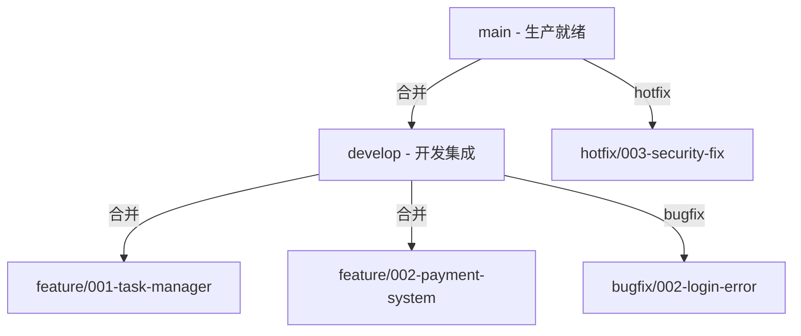

# PowerBy 项目软件生命周期框架
## Project Software Development Lifecycle Framework

**版本**: v3.5.0
**创建日期**: 2025-12-17
**最后更新**: 2025-12-26
**状态**: MVP精简版 - 包含P0+P1合并优化 + Px执行协议 + GitHub分支管理 + 迭代思维增强
**目标**: 专注于MVP的核心流程管理，遵循奥卡姆剃刀原则
**更新说明**:
- v2.2.0 - 引入Px执行协议，强调先拆解任务再执行的抽象原则
- v2.3.0 - 集成GitHub分支管理自动化，实现P0-P8分支生命周期管理
- v2.4.0 - 迭代思维增强：融入"充分了解、严格遵循、优先复用"理念，统一产品、研发和架构技能
- v3.0.0 - 三层立体诊断分析框架（表现层-逻辑层-数据层）
- v3.1.0 - 问题报告阶段新增需求对齐与澄清环节
- v3.5.0 - 迭代思维与复用优先原则融入，文档版本统一

---

## 目录

1. [生命周期概览](#1-生命周期概览)
2. [阶段详细定义](#2-阶段详细定义)
3. [文档体系结构](#3-文档体系结构)
4. [执行哲学：拆解优先](#4-执行哲学拆解优先)
5. [状态流转规则](#5-状态流转规则)
6. [角色与职责矩阵](#6-角色与职责矩阵)
7. [下一步行动](#7-下一步行动)

---

## 1. 生命周期概览

### 1.1 MVP流程图

```mermaid
graph TB
    Start([项目启动]) --> P0[P0: 项目初始化<br/>Constitution Setup]

    P0 --> P1[P1: 需求定义+澄清<br/>Requirement Definition]
    P1 --> Gate1{Gate 1<br/>MVP范围确认}
    Gate1 -->|未通过| P1
    Gate1 -->|通过| P3[P3: 技术调研<br/>Technical Research]

    P3 --> P4[P4: 架构设计<br/>Architecture Design]
    P4 --> Gate3{Gate 3<br/>Constitution Gates}
    Gate3 -->|未通过| P4
    Gate3 -->|通过| P5[P5: 任务规划<br/>Task Planning]

    P5 --> Gate4{Gate 4<br/>计划可行性确认}
    Gate4 -->|未通过| P5
    Gate4 -->|通过| P6[P6: 开发实现<br/>Implementation]

    P6 --> P7[P7: 质量审查<br/>Code Review]
    P7 --> Gate5{Gate 5<br/>代码审查通过}
    Gate5 -->|未通过| P6
    Gate5 -->|通过| MVP([MVP完成])

    Note over MVP,End: 运维交付(P8)为可选流程<br/>独立于MVP开发流程

    style P0 fill:#e3f2fd
    style P1 fill:#fff3e0
    style P3 fill:#f3e5f5
    style P4 fill:#f3e5f5
    style P5 fill:#e8f5e9
    style P6 fill:#e8f5e9
    style P7 fill:#fce4ec

    style Gate1 fill:#ffecb3
    style Gate3 fill:#ffecb3
    style Gate4 fill:#ffecb3
    style Gate5 fill:#ffecb3
```

### 1.2 MVP阶段总览表

| 阶段编号 | 阶段名称 | 核心目标 | 负责角色 | 关键产出 |
|---------|---------|---------|---------|---------|
| **P0** | 项目初始化 | 建立项目宪章和基础设施 | PM/Tech Lead | constitution.md |
| **P1** | 需求定义+澄清 | 定义MVP功能点清单，专注核心价值 | Product Manager | prd.md, function-points.md, clarifications.md |
| **P3** | 技术调研 | 解决技术选型问题 | Architect | technical-research.md |
| **P4** | 架构设计 | 设计最小可行架构 | Architect | architecture.md |
| **P5** | 任务规划 | 分解可执行任务 | Engineer Lead | tasks.md |
| **P6** | 开发实现 | 编码和测试 | Engineers | 代码+测试 |
| **P7** | 质量审查 | 代码审查和验收 | Code Reviewer | code-review-report.md |

> **说明**:
> - P2阶段已合并到P1中，采用"需求定稿制"融合澄清过程
> - P8运维交付为可选流程，独立于MVP开发流程

### 1.3 GitHub分支管理 (GitFlow)

PowerBy集成了完整的GitFlow分支管理策略，通过独立的 `powerby-github-branch` 技能实现自动化分支管理：

**分支策略架构**:


**分支类型**:
- **主分支**: `main` (生产) + `develop` (集成)
- **功能分支**: `feature/{id}-{name}` (P0-P8完整迭代)
- **修复分支**: `bugfix/{id}-{desc}` (P2/P3) + `hotfix/{id}-{desc}` (P0/P1)

**自动化集成**:
- P1完成后 → 自动创建 `feature/{id}-{name}` 分支
- P8完成后 → 自动合并分支到 `develop`
- Bug修复时 → 自动选择 `bugfix/` 或 `hotfix/` 分支

### 1.4 文档目录结构

```
project-root/
├── .powerby/                          # PowerBy元数据目录
│   └── project.json                   # 项目元数据(当前阶段、状态等)
│
├── docs/
│   ├── constitution.md                # [P0] 项目宪章
│   │
│   └── {project-name}/                # 项目文档目录
│       ├── prd.md                     # [P1] 产品需求文档
│       ├── function-points.md         # [P1] 功能点清单
│       ├── clarifications.md          # [P1] 需求澄清记录
│       ├── technical-research.md      # [P3] 技术调研报告
│       ├── architecture.md            # [P4] 架构设计文档
│       ├── tasks.md                   # [P5] 任务计划
│       │
│       ├── contracts/                 # [P4] API契约定义
│       │   ├── user-service.yaml      # OpenAPI规范
│       │   └── graphql-schema.graphql # GraphQL Schema
│       │
│       ├── checklists/                # [P5] 验收清单
│       │   ├── requirements.md        # 需求验收清单
│       │   ├── architecture.md        # 架构验收清单
│       │   ├── testing.md             # 测试验收清单
│       │   └── security.md            # 安全验收清单
│       │
│       ├── implementation/            # [P6] 实现记录
│       │   ├── implementation-report.md  # 实现报告
│       │   └── decisions.md           # 实现决策记录
│       │
│       └── reviews/                   # [P7] 审查记录
│           ├── code-review-report.md  # 代码审查报告
│           └── acceptance-test.md     # 验收测试报告
│
│       └── operations/                # [P8] 运维交付(可选)
│           ├── deployment-guide.md    # 部署指南
│           └── monitoring.md          # 监控配置
│
└── src/                               # 源代码目录
    └── ...
```

---

## 2. 迭代思维与复用优先 ⭐ **新增**

PowerBy框架强调**迭代思维与复用优先**的核心理念，确保在每个阶段都充分了解、严格遵循、优先复用已有的项目架构、规范和服务。

### 2.1 核心理念

- **持续演进**: 项目是迭代演进的，不是一次性完成的。每个功能都应在现有基础上增量改进
- **充分了解**: 在开始任何新工作之前，必须充分了解现有项目架构、技术栈和设计模式
- **严格遵循**: 识别并严格遵循项目已有的编码规范、文档规范和最佳实践
- **优先复用**: 系统性识别可复用的现有服务、组件、工具类和业务逻辑，优先选择复用路径
- **增量扩展**: 优先通过增量扩展现有能力来满足新需求，而非创建孤立的模块

### 2.2 阶段增强

#### P1阶段增强：现有能力分析
在需求定义前，新增**现有能力分析**步骤：
- 现有功能盘点：读取现有PRD文档，分析现有API和服务能力
- 复用可能性评估：评估新需求与现有能力的重叠度
- 一致性检查：确保新功能与现有功能风格一致

#### P5阶段增强：现有代码分析
在任务规划前，新增**现有代码分析**步骤：
- 代码库扫描：了解项目结构和模块组织
- 复用能力评估：识别可直接复用或可扩展的实现
- 规范识别：识别项目编码规范和最佳实践

#### P3/P4阶段增强：现有架构分析（已在v2.3.0实现）
- P3阶段：现有架构调研分析
- P4阶段：架构继承与演进分析

---

## 3. 阶段详细定义

### P0: 项目初始化 (Constitution Setup)

#### 2.1 阶段目标
建立项目的宪章基础,定义团队遵循的核心原则和开发规范。

#### 2.2 输入条件
- ✅ 项目已立项
- ✅ 团队成员已确认

#### 2.3 主要活动
1. 创建项目目录结构
2. 编写项目宪章(constitution.md)
3. 初始化版本控制仓库
4. 配置开发环境基础设施

#### 2.4 输出文档

| 文档名称 | 文档路径 | 模板状态 | 内容要点 |
|---------|---------|---------|---------|
| 项目宪章 | `docs/constitution.md` | 📋 待创建 | - 版本号(v1.0.0)<br/>- 核心原则(SOLID/KISS/DRY)<br/>- 开发规范<br/>- 质量标准 |
| 项目元数据 | `.powerby/project.json` | 📋 待创建 | - 项目名称<br/>- 当前阶段<br/>- 创建时间 |

#### 2.5 验收标准
- [ ] constitution.md已创建且包含所有必需章节
- [ ] 目录结构符合标准规范
- [ ] Git仓库已初始化
- [ ] 项目元数据文件已创建

#### 2.6 状态流转
- **起始状态**: `NOT_STARTED`
- **执行状态**: `P0_IN_PROGRESS`
- **完成状态**: `P0_COMPLETED` → 进入P1

---

### P1: 需求定义 (Requirement Definition)

#### 2.1 阶段目标
将产品想法转化为清晰的、带有MVP优先级的功能点清单。

#### 2.2 输入条件
- ✅ P0已完成
- ✅ 产品初步想法已明确
- ✅ Product Manager已就位

#### 2.3 主要活动 (遵循Px执行协议)

**任务拆解**：
- 收集需求原始输入
- 定义功能规格框架
- 拆解MVP功能点
- 标记P0/P1/P2优先级
- 明确范围边界
- 生成待决策清单

**分步迭代**：
- 按子任务清单逐项执行，完成一个标记[x]
- 确保每个子任务都有明确输出
- 遇到阻塞记录并继续下一个

**合规检查**：
- 对照Gate 1验收标准进行自测
- 确保PRD符合阶段标准

#### 2.4 输出文档

| 文档名称 | 文档路径 | 模板状态 | 内容要点 |
|---------|---------|---------|---------|
| 产品需求文档 | `docs/{project}/prd.md` | 📋 待创建 | - 第一部分:需求原始输入<br/>- 第二部分:功能规格框架<br/>- 第三部分:MVP功能点清单<br/>- 待决策清单 |
| 功能点清单 | `docs/{project}/function-points.md` | 📋 待创建 | - P0/P1/P2优先级标记<br/>- MVP聚焦度评估<br/>- 范围边界定义 |
| 需求澄清记录 | `docs/{project}/clarifications.md` | 📋 待创建 | - 11大类覆盖度分析<br/>- 高优先级模糊点澄清<br/>- Q&A记录同步 |

#### 2.5 验收标准 (Gate 1)
- [ ] MVP核心价值已用一句话定义
- [ ] 所有功能点已标记优先级([P0]/[P1]/[P2])
- [ ] 范围边界已明确(In-Scope / Out-of-Scope)
- [ ] 待决策清单中每项都有2+可行方案
- [ ] P0功能点数量 ≤ 10个(可配置)
- [ ] 11大类覆盖度分析已完成
- [ ] 高优先级模糊点已全部澄清(≤5个问题)
- [ ] 所有澄清已同步回prd.md对应章节
- [ ] 覆盖度状态: 核心类别≥80%为"Clear"

#### 2.6 状态流转
- **起始状态**: `P0_COMPLETED`
- **执行状态**: `P1_IN_PROGRESS`
- **Gate 1检查**: `P1_PENDING_APPROVAL`
- **完成状态**: `P1_COMPLETED` → 进入P3

---

### P3: 技术调研 (Technical Research)

#### 2.1 阶段目标
针对关键技术决策进行调研,解决技术选型和可行性问题。

#### 2.2 输入条件
- ✅ P1已完成（包括澄清）
- ✅ prd.md、clarifications.md已通过Gate 1

#### 2.3 主要活动 (遵循Px执行协议)

**任务拆解**：
- 11大类覆盖度分析
  - 功能范围与边界
  - 数据模型与实体
  - 交互与UX流程
  - 非功能属性(性能/安全/可靠性)
  - 集成与外部依赖
  - 边界情况与失败处理
  - 约束与权衡
  - 术语一致性
  - 完整性信号
  - 待办项/占位符
- 生成澄清问题清单
- 结构化澄清准备

**分步迭代**：
- 按澄清清单逐项执行，完成一个标记[x]
- 逐个问题提供推荐方案+备选项
- 将Q&A记录同步到clarifications.md

**合规检查**：
- 对照Gate 2验收标准进行自测
- 确保澄清记录完整准确

#### 2.4 输出文档

| 文档名称 | 文档路径 | 模板状态 | 内容要点 |
|---------|---------|---------|---------|
| 需求澄清记录 | `docs/{project}/clarifications.md` | 📋 待创建 | - 按日期分组的会话记录<br/>- 每个问题的Q&A<br/>- 覆盖度状态表<br/>- 遗留问题清单 |

#### 2.5 验收标准 (Gate 2)
- [ ] 11大类覆盖度分析已完成
- [ ] 高优先级模糊点已全部澄清(≤5个问题)
- [ ] 所有澄清已同步回prd.md对应章节
- [ ] 覆盖度状态: 核心类别≥80%为"Clear"

#### 2.6 状态流转
- **起始状态**: `P1_COMPLETED`
- **执行状态**: `P2_IN_PROGRESS`
- **Gate 2检查**: `P2_PENDING_APPROVAL`
- **完成状态**: `P2_COMPLETED` → 进入P3

---

### P3: 技术调研 (Technical Research)

#### 2.1 阶段目标
针对关键技术决策进行调研,解决技术选型和可行性问题。

#### 2.2 输入条件
- ✅ P2已完成
- ✅ PRD中的功能需求已明确

#### 2.3 主要活动
1. **识别调研项**: 从PRD中提取需要技术调研的点
   - 技术栈选型(语言/框架/数据库)
   - 第三方服务集成
   - 性能/安全技术方案
   - 技术风险评估

2. **方案调研**: 每个调研项评估2-3个备选方案
3. **决策记录**: 记录最终决策、理由、被拒绝方案

#### 2.4 输出文档

| 文档名称 | 文档路径 | 模板状态 | 内容要点 |
|---------|---------|---------|---------|
| 技术调研报告 | `docs/{project}/research.md` | 📋 待创建 | - 调研项列表<br/>- 每项的备选方案对比<br/>- 最终决策<br/>- 决策理由<br/>- 被拒绝方案及原因 |

#### 2.5 验收标准
- [ ] 所有关键技术选型已完成决策
- [ ] 每个决策都有明确理由
- [ ] 技术风险已识别并有缓解方案
- [ ] 技术栈与团队能力匹配

#### 2.6 状态流转
- **起始状态**: `P2_COMPLETED`
- **执行状态**: `P3_IN_PROGRESS`
- **完成状态**: `P3_COMPLETED` → 进入P4

---

### P4: 架构设计 (Architecture Design)

#### 2.1 阶段目标
将需求和技术方案转化为清晰的、可视化的架构设计。

#### 2.2 输入条件
- ✅ P3已完成
- ✅ research.md已产出
- ✅ Architect已就位

#### 2.3 主要活动 (遵循Px执行协议)

**任务拆解**：
- 解读PRD和功能需求
- 设计目标架构
- 标注架构变更点
- 绘制变更前后对比图
- 分析技术影响
- 评估风险等级

**分步迭代**：
- 按子任务清单逐项执行，完成一个标记[x]
- 确保每个子任务都有明确输出
- 遇到阻塞记录并继续下一个

**合规检查**：
- 对照Gate 3验收标准进行自测
- 确保架构文档符合阶段标准

**详细活动**：
1. **需求解读与对齐**: 复述PRD核心目标和用户流程
2. **架构设计与可视化**:
   - 绘制核心架构图(Mermaid)
   - 定义组件职责
   - 创建组件与需求映射表
   - 设计数据模型(entities/relationships)
   - 定义API契约(OpenAPI/GraphQL)

3. **标注架构变更点** ⭐:
   - 识别NEW/MODIFIED/REMOVED/REFACTORED组件
   - 绘制架构变更前后对比图(Mermaid)
   - 创建变更点清单表格
   - 分析技术影响(技术栈、性能、依赖)
   - 评估风险等级(高/中/低)

4. **关键决策点评估**: 识别2-3个架构决策点,提供多方案对比
5. **Constitution Gates验收**: 通过Simplicity/Anti-Abstraction/Integration-First三大门禁

#### 2.4 输出文档

| 文档名称 | 文档路径 | 模板状态 | 内容要点 |
|---------|---------|---------|---------|
| 架构设计文档 | `docs/{project}/architecture.md` | 📋 待创建 | - 需求对齐章节<br/>- 架构图(Mermaid)<br/>- 组件职责说明<br/>- 组件与需求映射<br/>- **变更点说明章节** ⭐<br/>- 关键决策点分析<br/>- Constitution Gates验收 |
| 数据模型定义 | `docs/{project}/data-model.md` | 📋 待创建 | - 实体定义<br/>- 字段类型<br/>- 关系映射<br/>- 唯一性约束<br/>- 状态机(如适用) |
| API契约 | `docs/{project}/contracts/*.yaml` | 📋 待创建 | - OpenAPI 3.0规范<br/>- 端点定义<br/>- 请求/响应Schema<br/>- 错误码定义 |

#### 2.5 验收标准 (Gate 3: Constitution Gates)

**Gate 3.1: Simplicity Gate**
- [ ] 方案是最简单能满足需求的设计
- [ ] 无为"未来可能"而引入的抽象
- [ ] 复杂度理由: ________

**Gate 3.2: Anti-Abstraction Gate**
- [ ] 避免了不必要的设计模式
- [ ] 抽象层级 ≤ 3层
- [ ] 抽象理由: ________

**Gate 3.3: Integration-First Gate**
- [ ] 优先使用现有库/服务
- [ ] 未重复造轮子
- [ ] 新组件清单: ________

**整体验收**
- [ ] 架构图清晰完整
- [ ] 所有组件都映射到PRD需求
- [ ] **变更点说明完整** ⭐
- [ ] 数据模型已定义
- [ ] API契约已定义
- [ ] 关键决策点已评估并选定方案

**变更点说明检查**
- [ ] 是否有关键概述说明为什么需要变更
- [ ] 是否有Mermaid架构变更前后对比图
- [ ] 是否有NEW/MODIFIED/REMOVED变更点清单表格
- [ ] 是否有技术影响分析(技术栈、性能、依赖)
- [ ] 是否有风险等级评估(高/中/低)

#### 2.6 状态流转
- **起始状态**: `P3_COMPLETED`
- **执行状态**: `P4_IN_PROGRESS`
- **Gate 3检查**: `P4_PENDING_APPROVAL`
- **完成状态**: `P4_COMPLETED` → 进入P5

---

### P5: 任务规划 (Task Planning)

#### 2.1 阶段目标
将架构设计分解为可执行的、按User Story组织的任务清单。

#### 2.2 输入条件
- ✅ P4已完成
- ✅ architecture.md已通过Gate 3
- ✅ Engineer Lead已就位

#### 2.3 主要活动
1. **任务生成**: 基于PRD的User Stories生成任务
   - Setup阶段: 项目初始化
   - Foundational阶段: 基础组件
   - User Story阶段: 按P1/P2/P3优先级组织
   - Polish阶段: 优化和完善

2. **任务标记**:
   - 任务ID: T001, T002...
   - [P]标记: 可并行任务
   - [US1]标记: 关联User Story
   - 文件路径: 明确操作的文件

3. **Checklist生成**: 创建多维度验收清单
   - requirements.md: 需求验收
   - architecture.md: 架构验收
   - testing.md: 测试验收
   - security.md: 安全验收

#### 2.4 输出文档

| 文档名称 | 文档路径 | 模板状态 | 内容要点 |
|---------|---------|---------|---------|
| 任务计划 | `docs/{project}/tasks.md` | 📋 待创建 | - Setup阶段任务<br/>- Foundational阶段任务<br/>- User Story阶段任务<br/>- 依赖关系图<br/>- 并行执行建议 |
| 需求验收清单 | `docs/{project}/checklists/requirements.md` | 📋 待创建 | PRD中每个需求的验收标准 |
| 架构验收清单 | `docs/{project}/checklists/architecture.md` | 📋 待创建 | 架构组件的实现验收 |
| 测试验收清单 | `docs/{project}/checklists/testing.md` | 📋 待创建 | 测试覆盖率和质量标准 |
| 安全验收清单 | `docs/{project}/checklists/security.md` | 📋 待创建 | 安全扫描和漏洞检查 |

#### 2.5 验收标准 (Gate 4)
- [ ] 所有User Story都有对应的任务
- [ ] 任务格式符合规范(`- [ ] [ID] [P] [Story] Description (file)`)
- [ ] 依赖关系已标注
- [ ] 并行任务已标记[P]
- [ ] 4类Checklist已创建
- [ ] 预估工作量已评估

#### 2.6 状态流转
- **起始状态**: `P4_COMPLETED`
- **执行状态**: `P5_IN_PROGRESS`
- **Gate 4检查**: `P5_PENDING_APPROVAL`
- **完成状态**: `P5_COMPLETED` → 进入P6

---

### P6: 开发实现 (Implementation)

#### 2.1 阶段目标
按照tasks.md和架构设计,高质量地实现所有功能。

#### 2.2 输入条件
- ✅ P5已完成
- ✅ tasks.md已通过Gate 4
- ✅ Engineers已就位

#### 2.3 主要活动

**工程师遵循4阶段协议**:

1. **阶段一: 分析与对齐**
   - 产出: 任务分析报告
   - 内容: 核心目标/关联文档/成功标准/范围边界

2. **阶段二: 技术方案设计**
   - 产出: 技术方案评估(2+方案)
   - 内容: 架构遵循性/哲学对齐分析/优缺点

3. **阶段三: 实现与验证**
   - 产出: 测试规格文档 + 代码 + 测试
   - 流程: 测试规格设计 → TDD实现(红-绿-重构)

4. **阶段四: 工作成果交付**
   - 产出: 工作成果交付报告
   - 内容: 可追溯性矩阵/Checklist更新/代码交付物

#### 2.4 输出文档

| 文档名称 | 文档路径 | 模板状态 | 内容要点 |
|---------|---------|---------|---------|
| 工作日志 | `docs/{project}/implementation/work-log.md` | 📋 待创建 | - 每日工作记录<br/>- 完成的任务ID<br/>- 遇到的问题 |
| 实现决策记录 | `docs/{project}/implementation/decisions.md` | 📋 待创建 | - 编码中的技术决策<br/>- 对原设计的调整<br/>- 调整理由 |
| 障碍解决报告 | `docs/{project}/implementation/blockers-{id}.md` | 📋 待创建 | - 障碍描述<br/>- 根本原因分析<br/>- 解决方案(2+)<br/>- 最终决策 |

#### 2.5 验收标准
- [ ] tasks.md中所有任务已标记完成[x]
- [ ] 所有代码已提交到版本控制
- [ ] 单元测试覆盖率 ≥ 80%(可配置)
- [ ] 集成测试已通过
- [ ] checklists/中的Checklist已更新
- [ ] 工作日志已记录

#### 2.6 状态流转
- **起始状态**: `P5_COMPLETED`
- **执行状态**: `P6_IN_PROGRESS`
- **完成状态**: `P6_COMPLETED` → 进入P7

---

### P7: 质量审查 (Code Review)

#### 2.1 阶段目标
通过系统化审查,确保代码质量和需求一致性。

#### 2.2 输入条件
- ✅ P6已完成
- ✅ 代码已提交
- ✅ Code Reviewer已就位

#### 2.3 主要活动

**5大类审计**:

1. **一致性与范围审计**
   - 代码实现是否对应tasks.md
   - 实现方式是否遵循architecture.md
   - 功能点是否与prd.md一致

2. **实现完整性与真实性审计**
   - 是否存在假实现(硬编码/TODO/空函数)
   - 所有函数是否完整实现
   - 业务逻辑是否基于真实数据

3. **设计哲学与代码质量审计**
   - SOLID/KISS/DRY遵循度
   - 代码可读性和可维护性
   - 最小影响面

4. **测试与健壮性审计**
   - 测试覆盖率
   - 错误处理
   - 安全漏洞扫描

5. **Checklist验证审计**
   - Checklist与代码同步性
   - 标记完成但未实现的检测
   - 实现但未标记的检测

#### 2.4 输出文档

| 文档名称 | 文档路径 | 模板状态 | 内容要点 |
|---------|---------|---------|---------|
| 代码审查报告 | `docs/{project}/reviews/code-review-{id}.md` | 📋 待创建 | - 最终结论(APPROVED/CHANGES REQUESTED)<br/>- 总体评价<br/>- 功能完成列表<br/>- 建议测试方案<br/>- 详细修改建议 |
| 验收测试报告 | `docs/{project}/reviews/acceptance-test.md` | 📋 待创建 | - 功能验收测试记录<br/>- 每个User Story的测试结果<br/>- 发现的问题 |

#### 2.5 验收标准 (Gate 5)
- [ ] 代码审查报告状态为[APPROVED]
- [ ] 所有Critical问题已修复
- [ ] 功能验收测试已全部通过
- [ ] Checklist验证无差异
- [ ] 代码已合并到主分支

#### 2.6 状态流转
- **起始状态**: `P6_COMPLETED`
- **执行状态**: `P7_IN_PROGRESS`
- **Gate 5检查**: `P7_PENDING_APPROVAL`
- **如未通过**: 回到 `P6_IN_PROGRESS`
- **完成状态**: `P7_COMPLETED` → 进入P8

---

### P8: 发布交付 (Release & Delivery)

#### 2.1 阶段目标
部署到生产环境,归档文档,总结经验。

#### 2.2 输入条件
- ✅ P7已完成
- ✅ 代码审查已通过
- ✅ DevOps/PM已就位

#### 2.3 主要活动
1. **发布准备**
   - 生成Release Notes
   - 编写部署指南
   - 准备回滚方案

2. **生产部署**
   - 部署到生产环境
   - 验证部署成功
   - 监控关键指标

3. **文档归档**
   - 更新所有文档状态为"已完成"
   - 归档到项目Wiki
   - 生成项目总结报告

4. **经验总结**
   - 项目回顾会议
   - 识别改进点
   - 更新Constitution(如需要)

#### 2.4 输出文档

| 文档名称 | 文档路径 | 模板状态 | 内容要点 |
|---------|---------|---------|---------|
| Release Notes | `docs/{project}/releases/v{version}-release-notes.md` | 📋 待创建 | - 版本号<br/>- 新增功能<br/>- Bug修复<br/>- 已知问题<br/>- 升级说明 |
| 部署指南 | `docs/{project}/releases/deployment-guide.md` | 📋 待创建 | - 部署步骤<br/>- 环境要求<br/>- 配置说明<br/>- 回滚步骤 |
| 项目总结 | `docs/{project}/project-retrospective.md` | 📋 待创建 | - 项目统计数据<br/>- 做得好的地方<br/>- 改进建议<br/>- 经验教训 |

#### 2.5 验收标准
- [ ] 生产环境部署成功
- [ ] Release Notes已发布
- [ ] 用户文档已更新
- [ ] 监控和告警已配置
- [ ] 项目文档已归档
- [ ] 项目总结已完成

#### 2.6 状态流转
- **起始状态**: `P7_COMPLETED`
- **执行状态**: `P8_IN_PROGRESS`
- **完成状态**: `P8_COMPLETED` → `PROJECT_DELIVERED`

---

## 3. 文档体系结构

### 3.1 文档分类

| 文档类型 | 文档数量 | 生命周期 | 更新频率 |
|---------|---------|---------|---------|
| **宪章类** | 1 | 长期 | 低(仅重大变更) |
| **需求类** | 2 | 中期 | 中(需求澄清阶段) |
| **设计类** | 3+ | 中期 | 中(设计阶段) |
| **实现类** | 3+ | 短期 | 高(开发阶段) |
| **审查类** | 2+ | 短期 | 中(审查阶段) |
| **发布类** | 2+ | 长期 | 低(每次发布) |

### 3.2 文档模板清单

以下是待创建的文档模板:

| 序号 | 文档名称 | 模板路径 | 优先级 | 状态 |
|-----|---------|---------|-------|------|
| 1 | 项目宪章模板 | `templates/constitution-template.md` | P0 | 📋 待创建 |
| 2 | PRD模板 | `templates/prd-template.md` | P0 | 📋 待创建 |
| 3 | 需求澄清模板 | `templates/clarifications-template.md` | P0 | 📋 待创建 |
| 4 | 技术调研模板 | `templates/research-template.md` | P0 | 📋 待创建 |
| 5 | 架构设计模板 | `templates/architecture-template.md` | P0 | 📋 待创建 |
| 6 | 数据模型模板 | `templates/data-model-template.md` | P0 | 📋 待创建 |
| 7 | 任务计划模板 | `templates/tasks-template.md` | P0 | 📋 待创建 |
| 8 | Checklist模板(4类) | `templates/checklists/*.md` | P0 | 📋 待创建 |
| 9 | 工作日志模板 | `templates/work-log-template.md` | P1 | 📋 待创建 |
| 10 | 代码审查报告模板 | `templates/code-review-template.md` | P0 | 📋 待创建 |
| 11 | Release Notes模板 | `templates/release-notes-template.md` | P1 | 📋 待创建 |
| 12 | 项目总结模板 | `templates/retrospective-template.md` | P2 | 📋 待创建 |

---

---

## 4. Px执行协议：拆解优先

### 4.1 全局执行准则

基于奥卡姆剃刀原则，PowerBy框架要求任何P阶段（从P1到P8）的执行都必须遵循**1+N模式**：

**1 (拆解任务)**：
- 进入阶段后的第一个动作必须是定义该阶段的子任务清单
- 子任务颗粒度以"单个会话可完成"为准

**N (分步执行)**：
- 根据拆解后的清单逐一执行
- 每完成一个子任务进行一次增量提交或记录
- 确保执行过程透明、可追溯

### 4.2 核心原则

#### 强制任务拆解
❌ **禁止直接交付**：不得跳过任务拆解直接进入文档编写

✅ **必须先拆解**：进入P阶段的第一个动作是列出子任务清单

#### 增量执行
- 完成一个子任务标记一个
- 遇到阻塞记录并继续
- 避免"大爆炸"式一次性输出

#### 贯穿始终
- tasks.md从P1阶段开始使用
- 持续追踪所有阶段进度
- 保持执行可追溯性

---

## 5. 状态流转规则  - 确保所有文档无矛盾
  - 澄清记录完整

⏰ 总计：3小时 (符合快速流程≤5小时要求)
```

### 4.6 AI助手配合指南

当AI协助您执行PowerBy流程时，会自动遵循以下习惯：

#### 4.6.1 进入新阶段时的标准话术
```
"开始执行P{X}阶段。按照Px执行协议，我首先为您拆解本阶段的子任务清单..."
```

#### 4.6.2 执行过程中的标准话术
```
"正在执行子任务 T{XYZ}：{任务描述}
完成后将标记为[x]，然后继续下一个任务..."
```

#### 4.6.3 遇到阻塞时的标准话术
```
"子任务 T{XYZ} 遇到阻塞：{阻塞原因}
记录在tasks.md中，继续执行下一个可进行的任务..."
```

---

## 5. 状态流转规则

### 5.1 项目状态枚举

```json
{
  "project_states": [
    "NOT_STARTED",
    "P0_IN_PROGRESS",
    "P0_COMPLETED",
    "P1_IN_PROGRESS",
    "P1_PENDING_APPROVAL",
    "P1_COMPLETED",
    "P3_IN_PROGRESS",
    "P3_COMPLETED",
    "P4_IN_PROGRESS",
    "P4_PENDING_APPROVAL",
    "P4_COMPLETED",
    "P5_IN_PROGRESS",
    "P5_PENDING_APPROVAL",
    "P5_COMPLETED",
    "P6_IN_PROGRESS",
    "P6_COMPLETED",
    "P7_IN_PROGRESS",
    "P7_PENDING_APPROVAL",
    "P7_COMPLETED",
    "P8_IN_PROGRESS",
    "P8_COMPLETED",
    "PROJECT_DELIVERED",
    "PROJECT_ARCHIVED"
  ]
}
```

### 5.2 状态流转图

```mermaid
stateDiagram-v2
    [*] --> NOT_STARTED
    NOT_STARTED --> P0_IN_PROGRESS: 项目启动

    P0_IN_PROGRESS --> P0_COMPLETED: Constitution完成
    P0_COMPLETED --> P1_IN_PROGRESS: 开始需求定义

    P1_IN_PROGRESS --> P1_PENDING_APPROVAL: 提交审批
    P1_PENDING_APPROVAL --> P1_IN_PROGRESS: 需修改
    P1_PENDING_APPROVAL --> P1_COMPLETED: Gate 1通过（包括澄清）

    P1_COMPLETED --> P3_IN_PROGRESS: 开始技术调研
    P3_IN_PROGRESS --> P3_COMPLETED: 调研完成

    P3_COMPLETED --> P4_IN_PROGRESS: 开始架构设计
    P4_IN_PROGRESS --> P4_PENDING_APPROVAL: 提交审批
    P4_PENDING_APPROVAL --> P4_IN_PROGRESS: 需修改
    P4_PENDING_APPROVAL --> P4_COMPLETED: Gate 3通过

    P4_COMPLETED --> P5_IN_PROGRESS: 开始任务规划
    P5_IN_PROGRESS --> P5_PENDING_APPROVAL: 提交审批
    P5_PENDING_APPROVAL --> P5_IN_PROGRESS: 需修改
    P5_PENDING_APPROVAL --> P5_COMPLETED: Gate 4通过

    P5_COMPLETED --> P6_IN_PROGRESS: 开始开发
    P6_IN_PROGRESS --> P6_COMPLETED: 开发完成

    P6_COMPLETED --> P7_IN_PROGRESS: 开始审查
    P7_IN_PROGRESS --> P7_PENDING_APPROVAL: 提交审批
    P7_PENDING_APPROVAL --> P6_IN_PROGRESS: 需返工
    P7_PENDING_APPROVAL --> P7_COMPLETED: Gate 5通过

    P7_COMPLETED --> P8_IN_PROGRESS: 开始发布
    P8_IN_PROGRESS --> P8_COMPLETED: 发布完成

    P8_COMPLETED --> PROJECT_DELIVERED: 项目交付
    PROJECT_DELIVERED --> PROJECT_ARCHIVED: 项目归档
    PROJECT_ARCHIVED --> [*]
```



### 5.3 项目元数据示例

`.powerby/project.json`:

```json
{
  "project_name": "user-authentication-system",
  "project_version": "1.0.0",
  "constitution_version": "1.0.0",
  "current_phase": "P4_IN_PROGRESS",
  "current_status": "P4_IN_PROGRESS",
  "created_at": "2025-01-01T00:00:00Z",
  "updated_at": "2025-01-15T10:30:00Z",

  "phase_history": [
    {
      "phase": "P0",
      "status": "P0_COMPLETED",
      "started_at": "2025-01-01T00:00:00Z",
      "completed_at": "2025-01-01T12:00:00Z",
      "duration_hours": 12
    },
    {
      "phase": "P1",
      "status": "P1_COMPLETED",
      "started_at": "2025-01-02T00:00:00Z",
      "completed_at": "2025-01-04T18:00:00Z",
      "duration_hours": 66,
      "iterations": 2
    },
    {
      "phase": "P4",
      "status": "P4_IN_PROGRESS",
      "started_at": "2025-01-10T00:00:00Z",
      "completed_at": null,
      "duration_hours": null
    }
  ],

  "team": {
    "product_manager": "Alice",
    "architect": "Bob",
    "tech_lead": "Charlie",
    "engineers": ["Dave", "Eve"],
    "code_reviewer": "Frank"
  },

  "metrics": {
    "total_user_stories": 5,
    "p0_user_stories": 3,
    "total_tasks": 0,
    "completed_tasks": 0,
    "code_review_iterations": 0
  }
}
```

---

## 6. 角色与职责矩阵

### 6.1 RACI矩阵

| 阶段 | Product Manager | Architect | Engineer Lead | Engineers | Code Reviewer | DevOps | PM |
|-----|----------------|-----------|---------------|-----------|---------------|--------|-----|
| **P0: 项目初始化** | I | C | C | I | I | C | **R** |
| **P1: 需求定义** | **R/A** | C | C | I | I | - | I |
| **P2: 需求澄清** | **R/A** | C | C | I | I | - | I |
| **P3: 技术调研** | I | **R/A** | C | C | I | C | I |
| **P4: 架构设计** | C | **R/A** | C | I | I | C | I |
| **P5: 任务规划** | C | C | **R/A** | C | I | I | I |
| **P6: 开发实现** | I | C | C | **R** | I | C | I |
| **P7: 质量审查** | I | I | I | C | **R/A** | I | I |
| **P8: 发布交付** | I | I | I | C | I | **R** | **A** |

**图例**:
- **R** (Responsible): 负责执行
- **A** (Accountable): 最终负责人
- **C** (Consulted): 需咨询
- **I** (Informed): 需告知

### 6.2 角色能力要求

| 角色 | 关键技能 | PowerBy Skills对应 |
|-----|---------|------------------|
| Product Manager | MVP思维、需求分析、优先级排序 | powerby-product<br/>mvp-prioritization<br/>requirement-alignment |
| Architect | 系统设计、技术选型、架构评估 | powerby-architect<br/>solution-evaluation<br/>mermaid-architecture |
| Engineer Lead | 任务分解、进度管理、技术协调 | powerby-engineer |
| Engineers | 编码、测试、文档编写 | powerby-engineer<br/>test-spec-design |
| Code Reviewer | 代码审查、质量保证、流程把控 | powerby-code-review |

---

## 7. 下一步行动

### 7.1 待确认事项

请您审阅本生命周期框架,并反馈以下问题:

1. **阶段划分**: 9个阶段(P0-P8)是否合理?是否需要合并/拆分?
2. **Gate设置**: 5个质量门禁(Gate 1-5)是否足够?验收标准是否合理?
3. **文档体系**: 文档目录结构和分类是否清晰?
4. **状态流转**: 状态定义是否完整?流转规则是否合理?
5. **角色职责**: RACI矩阵是否准确?

### 7.2 后续工作

一旦框架确认,我将开展:

**Phase 1: 模板创建** (优先级P0)
- constitution-template.md
- prd-template.md
- clarifications-template.md
- research-template.md
- architecture-template.md
- data-model-template.md
- tasks-template.md
- checklists/*-template.md (4类)
- code-review-template.md

**Phase 2: 工具开发** (优先级P1)
- 项目初始化脚本
- 状态流转验证工具
- 文档完整性检查工具
- 元数据管理工具

**Phase 3: Skills更新** (优先级P1)
- 更新powerby-product skill(添加澄清阶段)
- 更新powerby-architect skill(添加Constitution Gates)
- 更新powerby-engineer skill(添加User Story标记)
- 更新powerby-code-review skill(添加Checklist验证)

---

## 附录

### A. 术语表

| 术语 | 定义 |
|-----|------|
| **Constitution** | 项目宪章,定义开发原则和规范 |
| **Gate** | 质量门禁,阶段间的验收检查点 |
| **User Story** | 用户故事,描述用户需求的最小单元 |
| **MVP** | Minimum Viable Product,最小可行产品 |
| **P0/P1/P2** | 优先级标记(P0必须,P1重要,P2可选) |
| **[P]标记** | 可并行执行的任务标记 |
| **RACI** | Responsible/Accountable/Consulted/Informed |

### B. 参考资料

- PowerBy Constitution: 使用模板生成 `templates/constitution.md`
- Spec-Kit文档: `references/spec-kit/`
- 对比分析: `docs/spec-kit-vs-powerby-comparison.md`
- P0+P1合并优化方案: `docs/P0_P1_MERGE_OPTIMIZATION_PLAN.md`
- 快速流程定义: `skills/powerby-command/templates/.claude/commands/powerby-quick.md`

---

**文档状态**: 📝 草稿 - 待确认
**维护者**: PowerBy Skills Team
**最后更新**: 2025-12-17
