# PowerBy 项目软件生命周期概览
## Project Software Development Lifecycle Overview

**版本**: v2.1.0
**创建日期**: 2025-12-17
**最后更新**: 2025-12-18
**维护者**: PowerBy Skills Team
**目标**: 流程化、数据化、可追溯的项目管理体系

---

## 📋 目录

1. [生命周期鸟瞰图](#1-生命周期鸟瞰图)
2. [迭代与分支管理](#2-迭代与分支管理)
3. [阶段全景矩阵](#3-阶段全景矩阵)
4. [阶段详细说明](#4-阶段详细说明)
5. [指令流程设计](#5-指令流程设计)
6. [Skills与阶段映射](#6-skills与阶段映射)
7. [原子技能复用模式](#7-原子技能复用模式)
8. [操作流程指引](#8-操作流程指引)
9. [质量门禁机制](#9-质量门禁机制)

---

## 1. 生命周期鸟瞰图

### 1.1 整体流程图

```mermaid
graph TB
    %% 项目启动
    START([项目启动]) --> P0[P0: 项目初始化<br/>Constitution Setup]

    %% 需求阶段
    P0 --> P1[P1: 需求定义<br/>Requirement Definition]
    P1 --> G1{Gate 1<br/>MVP范围确认}
    G1 -->|未通过| P1
    G1 -->|通过| P2[P2: 需求澄清<br/>Requirement Clarification]

    %% 技术阶段
    P2 --> P3[P3: 技术调研<br/>Technical Research]
    P3 --> P4[P4: 架构设计<br/>Architecture Design]
    P4 --> G3{Gate 3<br/>Constitution Gates}
    G3 -->|未通过| P4
    G3 -->|通过| P5[P5: 任务规划<br/>Task Planning]

    %% 执行阶段
    P5 --> G4{Gate 4<br/>计划可行性确认}
    G4 -->|未通过| P5
    G4 -->|通过| P6[P6: 开发实现<br/>Implementation]
    P6 --> P7[P7: 质量审查<br/>Code Review]
    P7 --> G5{Gate 5<br/>代码审查通过}
    G5 -->|未通过| P6
    G5 -->|通过| P8[P8: 发布交付<br/>Release & Delivery]

    %% 项目完成
    P8 --> END([项目完成])

    %% 样式定义
    classDef phaseInit fill:#e3f2fd,stroke:#1976d2,stroke-width:2px
    classDef phaseReq fill:#fff3e0,stroke:#f57c00,stroke-width:2px
    classDef phaseTech fill:#f3e5f5,stroke:#7b1fa2,stroke-width:2px
    classDef phaseExec fill:#e8f5e9,stroke:#388e3c,stroke-width:2px
    classDef phaseReview fill:#fce4ec,stroke:#c2185b,stroke-width:2px
    classDef phaseRelease fill:#e0f2f1,stroke:#00796b,stroke-width:2px
    classDef gate fill:#ffecb3,stroke:#ffa000,stroke-width:3px,stroke-dasharray: 5 5

    class P0 phaseInit
    class P1,P2 phaseReq
    class P3,P4,P5 phaseTech
    class P6 phaseExec
    class P7 phaseReview
    class P8 phaseRelease
    class G1,G3,G4,G5 gate
```

### 1.2 阶段分类

| 类别 | 阶段 | 颜色标识 | 核心特征 |
|-----|------|---------|---------|
| **初始化** | P0 | 🔵 蓝色 | 建立项目基础 |
| **需求** | P1-P2 | 🟠 橙色 | 澄清"做什么" |
| **技术** | P3-P5 | 🟣 紫色 | 设计"如何做" |
| **执行** | P6 | 🟢 绿色 | 具体实现 |
| **审查** | P7 | 🟣 粉色 | 质量保证 |
| **发布** | P8 | 🔷 青色 | 交付上线 |

### 1.3 关键特征

**🔄 循环迭代**
- P1-P2 需求循环：直到所有模糊点澄清
- P4-P5 设计循环：直到架构通过Constitution Gates
- P6-P7 返工循环：直到代码审查通过

**🚦 质量门禁**
- Gate 1: MVP范围确认 (P1→P2)
- Gate 3: Constitution Gates (P4→P5)
- Gate 4: 计划可行性确认 (P5→P6)
- Gate 5: 代码审查通过 (P7→P8)

**📊 数据驱动**
- 每个阶段都有明确的产出文档
- 状态流转可追溯
- 决策过程记录完整

---

## 2. 迭代与分支管理

### 2.1 迭代生命周期核心理念

每个**需求迭代（Iteration）**都是一个独立的需求单元，遵循完整的P0-P8生命周期。迭代是项目管理的基本单位，确保每个功能都能完整地经历从需求定义到发布交付的全过程。

#### 关键原则

1. **迭代完整性**: 每个迭代都必须完整经历P0-P8所有阶段
2. **分支隔离**: 每个迭代拥有独立的Git分支，确保开发隔离
3. **文档驱动**: 迭代内的所有文档都在独立的目录结构中
4. **自动编号**: 迭代采用三位数字自动编号（001, 002, 003...）
5. **语义命名**: 分支名称采用语义化命名规范

### 2.2 迭代命名规范

#### 分支命名格式

```bash
{迭代编号}-{迭代名称}

示例:
001-user-authentication
002-payment-processing
003-inventory-management
```

#### 迭代编号规则

- **三位数字格式**: 001, 002, 003... (最大999)
- **自动分配**: 系统自动扫描现有迭代，分配下一个可用编号
- **不重复使用**: 编号一旦分配，即使迭代被删除也不重复使用
- **保留前缀**: 为特殊迭代保留编号前缀
  - 000: 基础架构/平台级迭代
  - 900-999: 实验性/探索性迭代

#### 迭代名称规则

- **语义化**: 使用功能领域的英文描述
- **短横线分隔**: 使用短横线（-）分隔单词
- **小写字母**: 全部使用小写字母
- **避免缩写**: 优先使用完整单词，避免不必要的缩写

**✅ 正确示例**:
```
001-user-authentication
002-product-catalog
003-shopping-cart
004-order-management
```

**❌ 错误示例**:
```
01-UserAuth (使用大写字母)
001-user_auth (使用下划线)
001-ua (使用缩写)
001-user-auth-extra (名称过长)
```

### 2.3 分支管理规范

#### 分支层级结构

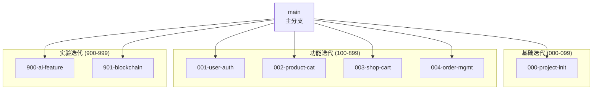

#### 分支生命周期

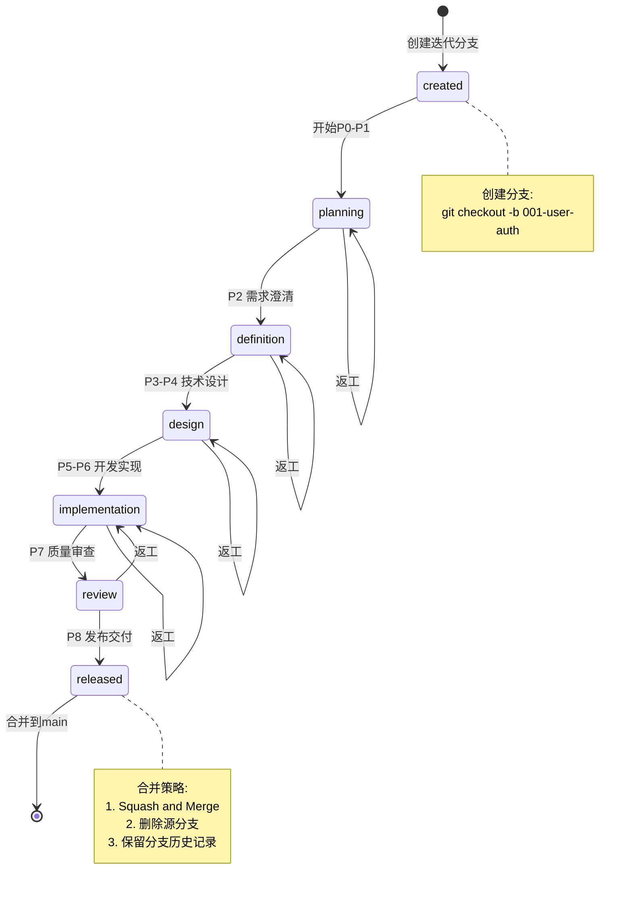

#### 分支操作规范

**创建新迭代分支**:
```bash
# 1. 确保在main分支
git checkout main
git pull origin main

# 2. 创建新分支
git checkout -b 001-user-authentication

# 3. 推送远程分支
git push -u origin 001-user-authentication
```

**迭代开发流程**:
```bash
# 1. 在迭代分支上工作
git checkout 001-user-authentication

# 2. 完成P0-P8各阶段

# 3. 合并到main分支
git checkout main
git merge --squash 001-user-authentication
git commit -m "feat: complete iteration 001-user-authentication

- Implement user authentication system
- Add login/logout functionality
- Support JWT token management
- Include unit tests with 85% coverage
- Pass code review with approval

Closes #001"

# 4. 删除源分支
git branch -d 001-user-authentication
git push origin --delete 001-user-authentication
```

### 2.4 迭代文档结构

每个迭代拥有独立的文档目录结构：

```
project-root/
├── .powerby/                          # PowerBy元数据
│   ├── project.json                   # 项目元数据
│   └── iterations.json                # 迭代元数据
│
├── docs/
│   ├── constitution.md                # 项目宪章 (P0)
│   │
│   └── iterations/                    # 迭代目录
│       ├── 001-user-authentication/   # 迭代001
│       │   ├── prd.md                 # (P1) 产品需求文档
│       │   ├── clarifications.md      # (P2) 需求澄清记录
│       │   ├── research.md            # (P3) 技术调研报告
│       │   ├── architecture.md        # (P4) 架构设计文档
│       │   ├── data-model.md          # (P4) 数据模型定义
│       │   ├── tasks.md               # (P5) 任务计划
│       │   │
│       │   ├── contracts/             # (P4) API契约
│       │   │   ├── user-service.yaml
│       │   │   └── auth-api.graphql
│       │   │
│       │   ├── checklists/            # (P5) 验收清单
│       │   │   ├── requirements.md
│       │   │   ├── architecture.md
│       │   │   ├── testing.md
│       │   │   └── security.md
│       │   │
│       │   ├── implementation/        # (P6) 实现记录
│       │   │   ├── work-log.md
│       │   │   ├── decisions.md
│       │   │   └── blockers-001.md
│       │   │
│       │   ├── reviews/               # (P7) 审查记录
│       │   │   ├── code-review-001.md
│       │   │   └── acceptance-test.md
│       │   │
│       │   └── releases/              # (P8) 发布记录
│       │       ├── v1.0.0-release-notes.md
│       │       └── deployment-guide.md
│       │
│       ├── 002-payment-processing/    # 迭代002
│       │   └── ... (相同结构)
│       │
│       └── 003-inventory-management/  # 迭代003
│           └── ... (相同结构)
│
└── src/                               # 源代码
    ├── features/                      # 按迭代组织的代码
    │   ├── user-auth/                 # 迭代001的代码
    │   ├── payment/                   # 迭代002的代码
    │   └── inventory/                 # 迭代003的代码
    │
    └── shared/                        # 共享代码
```

### 2.5 迭代元数据管理

#### 迭代元数据文件 `.powerby/iterations.json`

```json
{
  "iterations": [
    {
      "id": "001",
      "name": "user-authentication",
      "branch": "001-user-authentication",
      "status": "released",
      "created_at": "2025-12-17T00:00:00Z",
      "started_at": "2025-12-17T00:00:00Z",
      "completed_at": "2025-12-19T18:00:00Z",
      "duration_hours": 42,
      "current_phase": "P8_COMPLETED",
      "phases": {
        "P0": {"status": "completed", "duration_hours": 4},
        "P1": {"status": "completed", "duration_hours": 8},
        "P2": {"status": "completed", "duration_hours": 6},
        "P3": {"status": "completed", "duration_hours": 12},
        "P4": {"status": "completed", "duration_hours": 8},
        "P5": {"status": "completed", "duration_hours": 4},
        "P6": {"status": "completed", "duration_hours": 96},
        "P7": {"status": "completed", "duration_hours": 8},
        "P8": {"status": "completed", "duration_hours": 4}
      },
      "team": {
        "product_manager": "Alice",
        "architect": "Bob",
        "engineer_lead": "Charlie",
        "engineers": ["Dave", "Eve"],
        "code_reviewer": "Frank"
      },
      "metrics": {
        "total_tasks": 24,
        "completed_tasks": 24,
        "test_coverage": 87,
        "code_review_iterations": 1,
        "gates_passed": 5,
        "gates_failed": 0
      },
      "merged_to_main": true,
      "merge_commit": "a1b2c3d",
      "tags": ["auth", "security", "jwt"]
    },
    {
      "id": "002",
      "name": "payment-processing",
      "branch": "002-payment-processing",
      "status": "in_progress",
      "created_at": "2025-12-20T00:00:00Z",
      "started_at": "2025-12-20T00:00:00Z",
      "current_phase": "P4_IN_PROGRESS",
      "phases": {
        "P0": {"status": "completed", "duration_hours": 4},
        "P1": {"status": "completed", "duration_hours": 6},
        "P2": {"status": "completed", "duration_hours": 4},
        "P3": {"status": "completed", "duration_hours": 8},
        "P4": {"status": "in_progress", "duration_hours": 6},
        "P5": {"status": "pending", "duration_hours": null},
        "P6": {"status": "pending", "duration_hours": null},
        "P7": {"status": "pending", "duration_hours": null},
        "P8": {"status": "pending", "duration_hours": null}
      },
      "team": {
        "product_manager": "Alice",
        "architect": "Bob",
        "engineer_lead": "Charlie",
        "engineers": ["Dave", "Eve"],
        "code_reviewer": "Frank"
      },
      "metrics": {
        "total_tasks": 0,
        "completed_tasks": 0,
        "test_coverage": 0,
        "code_review_iterations": 0,
        "gates_passed": 2,
        "gates_failed": 0
      },
      "merged_to_main": false,
      "tags": ["payment", "integration", "stripe"]
    }
  ],
  "statistics": {
    "total_iterations": 2,
    "released_iterations": 1,
    "in_progress_iterations": 1,
    "total_duration_hours": 42,
    "average_iteration_duration": 42,
    "success_rate": 100
  }
}
```

#### 迭代状态枚举

```json
{
  "iteration_statuses": [
    "planning",           // 迭代规划中 (P0-P1)
    "definition",         // 需求定义中 (P1-P2)
    "clarification",      // 需求澄清中 (P2)
    "research",           // 技术调研中 (P3)
    "design",             // 架构设计中 (P4)
    "planning_tasks",     // 任务规划中 (P5)
    "implementation",     // 开发实现中 (P6)
    "review",             // 质量审查中 (P7)
    "released",           // 已发布 (P8完成)
    "archived",           // 已归档
    "cancelled"           // 已取消
  ]
}
```

### 2.6 迭代依赖关系

#### 依赖类型

**强依赖 (Hard Dependency)**:
- 迭代A必须在迭代B完成之后才能开始
- 通常是由于技术架构或业务逻辑的前置要求

**弱依赖 (Soft Dependency)**:
- 迭代A建议在迭代B之后进行，但不是必须的
- 可能出于优化或便利性考虑

**并行依赖 (Parallel Dependency)**:
- 迭代A和迭代B可以并行开发
- 相互独立，没有前置要求

#### 依赖关系图示例

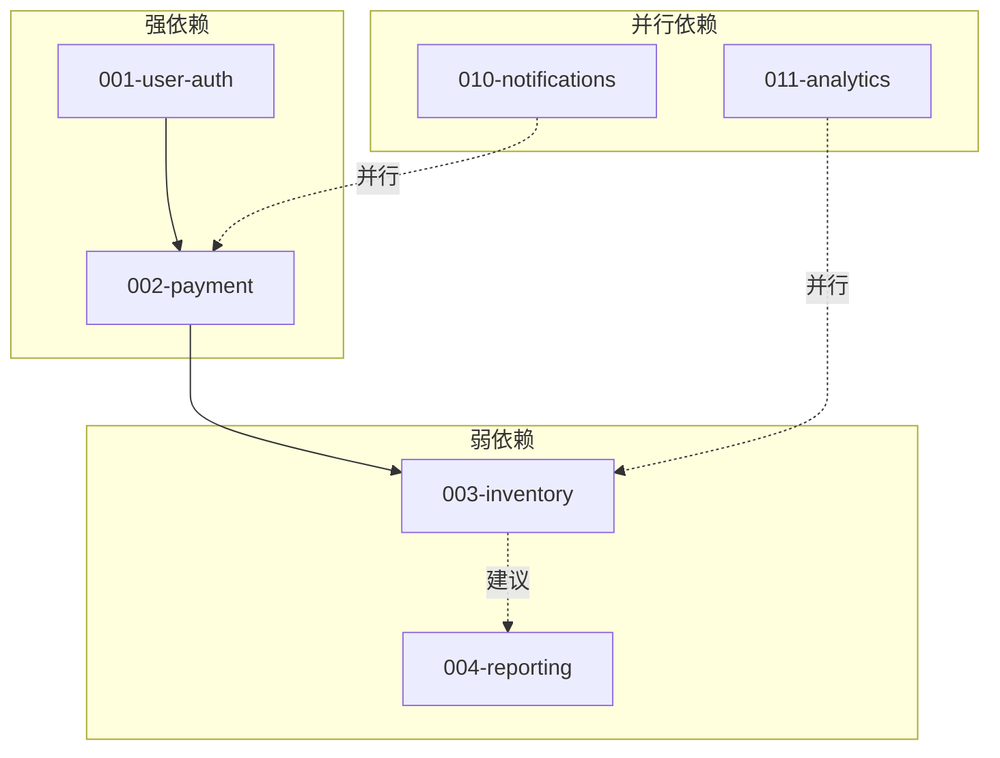

#### 依赖管理规范

**依赖声明**:
在每个迭代的PRD中，必须明确声明依赖关系：

```markdown
## 依赖关系

### 前置依赖 (Prerequisites)
- [ ] 001-user-authentication - 用户认证系统必须先完成
- [ ] 005-database-migration - 数据库迁移需要完成

### 后续影响 (Downstream Impact)
- [ ] 003-inventory-management - 依赖本迭代的库存API
- [ ] 006-reporting-system - 将使用本迭代的数据模型
```

### 2.7 迭代工作流程

#### 标准工作流程

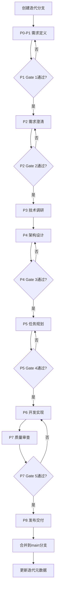

#### 并行开发管理

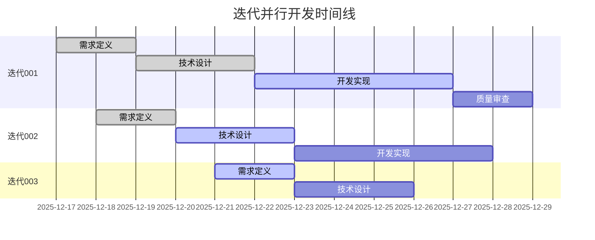

### 2.8 迭代最佳实践

#### ✅ 推荐做法

1. **小步快跑**: 单个迭代周期建议控制在2-4周内
2. **独立完整**: 每个迭代都应该能独立提供业务价值
3. **清晰边界**: 明确迭代的功能边界和不在范围内的内容
4. **及时合并**: 迭代完成后尽快合并到main分支
5. **文档同步**: 保持迭代文档与代码实现同步
6. **度量追踪**: 持续跟踪迭代的度量指标

#### ❌ 避免做法

1. **超大迭代**: 避免超过6周的迭代周期
2. **功能耦合**: 避免将多个独立功能放在同一个迭代中
3. **长期分支**: 避免迭代分支超过1个月未合并
4. **文档滞后**: 避免代码实现与文档不同步
5. **忽略依赖**: 避免忽略迭代间的依赖关系
6. **跳跃阶段**: 避免跳过生命周期的某个阶段

---

## 3. 阶段全景矩阵

### 3.1 核心属性对比

| 阶段 | 阶段名称 | 目标 | 输入 | 输出 | 负责人 | 周期 | 质量门禁 |
|-----|---------|------|------|------|--------|------|---------|
| **P0** | 项目初始化 | 建立项目宪章和基础设施 | 项目立项、团队确认 | constitution.md<br/>项目元数据 | PM/Tech Lead | 0.5天 | 无 |
| **P1** | 需求定义 | 定义MVP功能点清单 | 产品想法 | prd.md | Product Manager | 1-3天 | Gate 1 |
| **P2** | 需求澄清 | 消除需求模糊性 | 已批准的PRD | clarifications.md | Product Manager | 0.5-1天 | Gate 2 |
| **P3** | 技术调研 | 解决技术选型问题 | 澄清后的需求 | research.md | Architect | 1-2天 | 无 |
| **P4** | 架构设计 | 设计技术实现方案 | 技术调研报告 | architecture.md<br/>data-model.md<br/>contracts/ | Architect | 2-5天 | Gate 3 |
| **P5** | 任务规划 | 分解可执行任务 | 架构设计文档 | tasks.md<br/>checklists/ | Engineer Lead | 1-2天 | Gate 4 |
| **P6** | 开发实现 | 编码和测试 | 任务计划 | 代码+测试<br/>implementation/ | Engineers | N天 | 无 |
| **P7** | 质量审查 | 代码审查和验收 | 完成的代码 | review-report.md | Code Reviewer | 0.5-1天 | Gate 5 |
| **P8** | 发布交付 | 部署和文档归档 | 审查通过代码 | release-notes.md | DevOps/PM | 0.5-1天 | 无 |

### 3.2 文档流转图

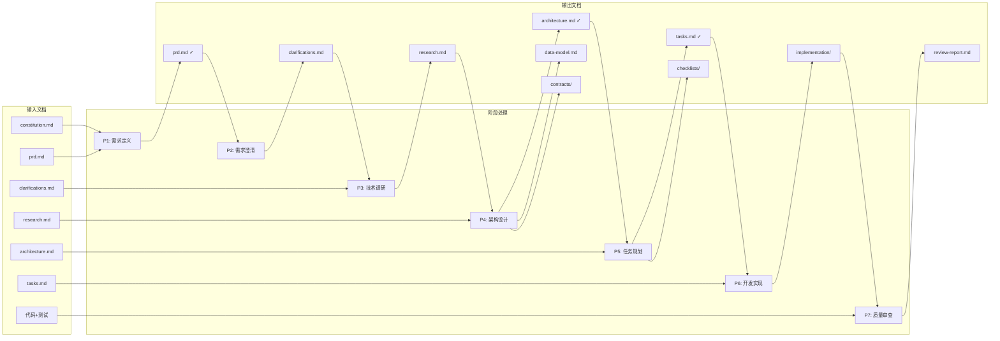

---

## 4. 阶段详细说明

### P0: 项目初始化 (Constitution Setup)

#### 🎯 阶段目标
建立项目的宪章基础，定义团队遵循的核心原则和开发规范。

#### 📥 输入条件
- ✅ 项目已立项
- ✅ 团队成员已确认

#### 🛠️ 主要活动
1. 创建项目目录结构
2. 编写项目宪章(constitution.md)
3. 初始化版本控制仓库
4. 配置开发环境基础设施

#### 📤 输出文档

| 文档名称 | 文档路径 | 模板 | 内容要点 |
|---------|---------|------|---------|
| 项目宪章 | `docs/constitution.md` | ✅ 已存在 | 版本号、核心原则(SOLID/KISS/DRY)、开发规范、质量标准 |
| 项目元数据 | `.powerby/project.json` | 📋 待创建 | 项目名称、当前阶段、创建时间 |

#### 👥 角色与职责 (RACI)

| 角色 | 职责 | R/A/C/I |
|------|------|---------|
| **PM** | 总体协调，批准Constitution | **R/A** |
| Tech Lead | 技术规范定义 | **C** |
| Product Manager | 需求规范参与 | C |
| Architect | 架构规范参与 | C |
| Engineers | 规范确认 | I |

#### ✅ 验收标准
- [ ] constitution.md已创建且包含所有必需章节
- [ ] 目录结构符合标准规范
- [ ] Git仓库已初始化
- [ ] 项目元数据文件已创建

#### 🔄 状态流转
- **起始状态**: `NOT_STARTED`
- **执行状态**: `P0_IN_PROGRESS`
- **完成状态**: `P0_COMPLETED` → 进入P1

---

### P1: 需求定义 (Requirement Definition)

#### 🎯 阶段目标
将产品想法转化为清晰的、带有MVP优先级的功能点清单。

#### 📥 输入条件
- ✅ P0已完成
- ✅ 产品初步想法已明确
- ✅ Product Manager已就位

#### 🛠️ 主要活动
1. **需求原始输入收集**: 收集用户/业务方的需求描述
2. **功能规格框架定义**: 定义功能、交互流程、范围边界
3. **MVP功能分解**: 将宏观功能拆解为原子功能点，标记P0/P1/P2优先级
4. **逻辑审查**: 识别高阶逻辑漏洞和待决策点

#### 📤 输出文档

| 文档名称 | 文档路径 | 模板 | 内容要点 |
|---------|---------|------|---------|
| 产品需求文档 | `docs/iterations/{id}-{name}/prd.md` | ✅ 已存在 | 第一部分:需求原始输入<br/>第二部分:功能规格框架<br/>第三部分:MVP功能点清单<br/>待决策清单 |
| **功能点清单** ⭐新增 | `docs/iterations/{id}-{name}/function-points.md` | ✅ 已存在 | 按模块分组的功能点列表<br/>8要素完整信息<br/>优先级统计和依赖关系图<br/>质量检查和问题标注 |

#### 🔄 P1→P2 过渡：功能点清单生成

**重要原则：一个功能迭代同一份文档只有一份，永远维护最新状态**

当PRD完成后，通过Gate 1检查，**必须**生成功能点清单文档：
- 使用 `function-point-checker` 技能自动提取PRD中的所有功能点
- 生成结构化的功能点清单文档
- 此文档成为P2阶段需求澄清的基础
- 团队审核、讨论和开发时以此文档为准

**流程说明**：
```
P1完成 → Gate 1检查 → 生成function-points.md → P2开始(基于功能点清单澄清)
```

#### 🎭 使用Skills

| 技能类型 | 技能名称 | 使用方式 | 产出 |
|---------|---------|---------|------|
| **核心技能** | `powerby-product` | 主动触发 | prd.md |
| **原子技能** | `requirement-alignment` | 产品技能内部调用 | 结构化需求理解 |
| **原子技能** | `mvp-prioritization` | 产品技能内部调用 | MVP优先级标记 |
| **原子技能** | `function-point-checker` | P1完成后自动调用 | function-points.md ⭐新增 |

#### 👥 角色与职责 (RACI)

| 角色 | 职责 | R/A/C/I |
|------|------|---------|
| **Product Manager** | 主导PRD编写，MVP范围定义 | **R/A** |
| Architect | 技术可行性咨询 | C |
| Engineer Lead | 实现复杂度评估 | C |
| Stakeholders | 业务需求确认 | I |

#### 🚦 验收标准 (Gate 1)
- [ ] MVP核心价值已用一句话定义
- [ ] 所有功能点已标记优先级([P0]/[P1]/[P2])
- [ ] 范围边界已明确(In-Scope / Out-of-Scope)
- [ ] 待决策清单中每项都有2+可行方案
- [ ] P0功能点数量 ≤ 10个(可配置)

#### 🔄 状态流转
- **起始状态**: `P0_COMPLETED`
- **执行状态**: `P1_IN_PROGRESS`
- **Gate 1检查**: `P1_PENDING_APPROVAL`
- **完成状态**: `P1_COMPLETED` → 进入P2

---

### P2: 需求澄清 (Requirement Clarification)

#### 🎯 阶段目标
通过结构化提问，消除需求中的模糊性和缺失决策点。

#### 📥 输入条件
- ✅ P1已完成
- ✅ prd.md已通过Gate 1
- ✅ function-points.md已生成

#### 🛠️ 主要活动
1. **基于功能点清单澄清** ⭐新增: 使用function-points.md作为澄清基础
   - 逐个审查功能点的8要素
   - 在功能点清单上标注澄清结果和修改意见
   - **绝不在其他地方创建功能点列表** - 始终更新function-points.md
2. **分类扫描**: 使用requirement-alignment进行覆盖度分析，检查11大类
   - 功能范围与边界
   - 数据模型与实体
   - 交互与UX流程
   - 非功能属性(性能/安全/可靠性)
   - 集成与外部依赖
   - 边界情况与失败处理
   - 约束与权衡
   - 术语一致性
   - 完整性信号
   - 待办项/占位符

2. **问题生成**: 生成最多5个高优先级问题
3. **结构化澄清**: 逐个问题提供推荐方案+备选项
4. **澄清记录**: 将所有Q&A记录到clarifications.md

#### 📤 输出文档

| 文档名称 | 文档路径 | 模板 | 内容要点 |
|---------|---------|------|---------|
| 需求澄清记录 | `docs/{project}/clarifications.md` | ✅ 已存在 | 按日期分组的会话记录<br/>每个问题的Q&A<br/>覆盖度状态表<br/>遗留问题清单 |

#### 🎭 使用Skills

| 技能类型 | 技能名称 | 使用方式 | 产出 |
|---------|---------|---------|------|
| **核心技能** | `powerby-product` | 继续P1的工作流程 | clarifications.md |
| **原子技能** | `requirement-alignment` | 产品技能内部调用 | 模糊点识别 |

#### 👥 角色与职责 (RACI)

| 角色 | 职责 | R/A/C/I |
|------|------|---------|
| **Product Manager** | 主导澄清过程，记录决策 | **R/A** |
| Architect | 技术细节澄清 | C |
| Engineer Lead | 实现细节澄清 | C |
| Stakeholders | 业务决策确认 | I |

#### 🚦 验收标准 (Gate 2)
- [ ] 11大类覆盖度分析已完成
- [ ] 高优先级模糊点已全部澄清(≤5个问题)
- [ ] 所有澄清已同步回prd.md对应章节
- [ ] 覆盖度状态: 核心类别≥80%为"Clear"

#### 🔄 状态流转
- **起始状态**: `P1_COMPLETED`
- **执行状态**: `P2_IN_PROGRESS`
- **Gate 2检查**: `P2_PENDING_APPROVAL`
- **完成状态**: `P2_COMPLETED` → 进入P3

---

### P3: 技术调研 (Technical Research)

#### 🎯 阶段目标
针对关键技术决策进行调研，解决技术选型和可行性问题。

#### 📥 输入条件
- ✅ P2已完成
- ✅ PRD中的功能需求已明确

#### 🛠️ 主要活动
1. **识别调研项**: 从PRD中提取需要技术调研的点
   - 技术栈选型(语言/框架/数据库)
   - 第三方服务集成
   - 性能/安全技术方案
   - 技术风险评估

2. **方案调研**: 每个调研项评估2-3个备选方案
3. **决策记录**: 记录最终决策、理由、被拒绝方案

#### 📤 输出文档

| 文档名称 | 文档路径 | 模板 | 内容要点 |
|---------|---------|------|---------|
| 技术调研报告 | `docs/{project}/research.md` | 📋 待创建 | 调研项列表<br/>每项的备选方案对比<br/>最终决策<br/>决策理由<br/>被拒绝方案及原因 |

#### 🎭 使用Skills

| 技能类型 | 技能名称 | 使用方式 | 产出 |
|---------|---------|---------|------|
| **核心技能** | `powerby-architect` | 主动触发(Phase 0) | research.md |
| **原子技能** | `solution-evaluation` | 架构师技能内部调用 | 方案对比分析 |

#### 👥 角色与职责 (RACI)

| 角色 | 职责 | R/A/C/I |
|------|------|---------|
| **Architect** | 主导技术调研和决策 | **R/A** |
| Engineer Lead | 实现复杂度评估 | C |
| Engineers | 技术方案验证 | C |
| Product Manager | 业务影响评估 | I |

#### ✅ 验收标准
- [ ] 所有关键技术选型已完成决策
- [ ] 每个决策都有明确理由
- [ ] 技术风险已识别并有缓解方案
- [ ] 技术栈与团队能力匹配

#### 🔄 状态流转
- **起始状态**: `P2_COMPLETED`
- **执行状态**: `P3_IN_PROGRESS`
- **完成状态**: `P3_COMPLETED` → 进入P4

---

### P4: 架构设计 (Architecture Design)

#### 🎯 阶段目标
将需求和技术方案转化为清晰的、可视化的架构设计。

#### 📥 输入条件
- ✅ P3已完成
- ✅ research.md已产出
- ✅ Architect已就位

#### 🛠️ 主要活动
1. **需求解读与对齐**: 复述PRD核心目标和用户流程
2. **架构设计与可视化**:
   - 绘制核心架构图(Mermaid)
   - 定义组件职责
   - 创建组件与需求映射表
   - 设计数据模型(entities/relationships)
   - 定义API契约(OpenAPI/GraphQL)

3. **关键决策点评估**: 识别2-3个架构决策点，提供多方案对比
4. **Constitution Gates验收**: 通过Simplicity/Anti-Abstraction/Integration-First三大门禁

#### 📤 输出文档

| 文档名称 | 文档路径 | 模板 | 内容要点 |
|---------|---------|------|---------|
| 架构设计文档 | `docs/{project}/architecture.md` | 📋 待创建 | 需求对齐章节<br/>架构图(Mermaid)<br/>组件职责说明<br/>组件与需求映射<br/>关键决策点分析<br/>Constitution Gates验收 |
| 数据模型定义 | `docs/{project}/data-model.md` | 📋 待创建 | 实体定义<br/>字段类型<br/>关系映射<br/>唯一性约束<br/>状态机(如适用) |
| API契约 | `docs/{project}/contracts/*.yaml` | 📋 待创建 | OpenAPI 3.0规范<br/>端点定义<br/>请求/响应Schema<br/>错误码定义 |

#### 🎭 使用Skills

| 技能类型 | 技能名称 | 使用方式 | 产出 |
|---------|---------|---------|------|
| **核心技能** | `powerby-architect` | 完整4阶段流程 | architecture.md<br/>data-model.md<br/>contracts/ |
| **原子技能** | `requirement-alignment` | 阶段一内部调用 | 需求对齐报告 |
| **原子技能** | `mermaid-architecture` | 阶段二内部调用 | Mermaid架构图 |
| **原子技能** | `solution-evaluation` | 阶段三内部调用 | 决策点评估 |

#### 👥 角色与职责 (RACI)

| 角色 | 职责 | R/A/C/I |
|------|------|---------|
| **Architect** | 主导架构设计 | **R/A** |
| Product Manager | 需求准确性确认 | C |
| Engineer Lead | 实现可行性评估 | C |
| Engineers | 技术细节讨论 | I |

#### 🚦 验收标准 (Gate 3: Constitution Gates)

**Gate 3.1: Simplicity Gate**
- [ ] 方案是最简单能满足需求的设计
- [ ] 无为"未来可能"而引入的抽象
- [ ] 复杂度理由: ________

**Gate 3.2: Anti-Abstraction Gate**
- [ ] 避免了不必要的设计模式
- [ ] 抽象层级 ≤ 3层
- [ ] 抽象理由: ________

**Gate 3.3: Integration-First Gate**
- [ ] 优先使用现有库/服务
- [ ] 未重复造轮子
- [ ] 新组件清单: ________

**整体验收**
- [ ] 架构图清晰完整
- [ ] 所有组件都映射到PRD需求
- [ ] 数据模型已定义
- [ ] API契约已定义
- [ ] 关键决策点已评估并选定方案

#### 🔄 状态流转
- **起始状态**: `P3_COMPLETED`
- **执行状态**: `P4_IN_PROGRESS`
- **Gate 3检查**: `P4_PENDING_APPROVAL`
- **完成状态**: `P4_COMPLETED` → 进入P5

---

### P5: 任务规划 (Task Planning)

#### 🎯 阶段目标
将架构设计分解为可执行的、按User Story组织的任务清单。

#### 📥 输入条件
- ✅ P4已完成
- ✅ architecture.md已通过Gate 3
- ✅ Engineer Lead已就位

#### 🛠️ 主要活动
1. **任务生成**: 基于PRD的User Stories生成任务
   - Setup阶段: 项目初始化
   - Foundational阶段: 基础组件
   - User Story阶段: 按P1/P2/P3优先级组织
   - Polish阶段: 优化和完善

2. **任务标记**:
   - 任务ID: T001, T002...
   - [P]标记: 可并行任务
   - [US1]标记: 关联User Story
   - 文件路径: 明确操作的文件

3. **Checklist生成**: 创建多维度验收清单
   - requirements.md: 需求验收
   - architecture.md: 架构验收
   - testing.md: 测试验收
   - security.md: 安全验收

#### 📤 输出文档

| 文档名称 | 文档路径 | 模板 | 内容要点 |
|---------|---------|------|---------|
| 任务计划 | `docs/{project}/tasks.md` | 📋 待创建 | Setup阶段任务<br/>Foundational阶段任务<br/>User Story阶段任务<br/>依赖关系图<br/>并行执行建议 |
| 需求验收清单 | `docs/{project}/checklists/requirements.md` | 📋 待创建 | PRD中每个需求的验收标准 |
| 架构验收清单 | `docs/{project}/checklists/architecture.md` | 📋 待创建 | 架构组件的实现验收 |
| 测试验收清单 | `docs/{project}/checklists/testing.md` | 📋 待创建 | 测试覆盖率和质量标准 |
| 安全验收清单 | `docs/{project}/checklists/security.md` | 📋 待创建 | 安全扫描和漏洞检查 |

#### 🎭 使用Skills

| 技能类型 | 技能名称 | 使用方式 | 产出 |
|---------|---------|---------|------|
| **核心技能** | `powerby-engineer` | 任务规划专用流程 | tasks.md<br/>checklists/ |

#### 👥 角色与职责 (RACI)

| 角色 | 职责 | R/A/C/I |
|------|------|---------|
| **Engineer Lead** | 主导任务分解和规划 | **R/A** |
| Architect | 架构可实现性确认 | C |
| Engineers | 任务工作量评估 | C |
| Product Manager | 需求完整性确认 | I |

#### 🚦 验收标准 (Gate 4)
- [ ] 所有User Story都有对应的任务
- [ ] 任务格式符合规范(`- [ ] [ID] [P] [Story] Description (file)`)
- [ ] 依赖关系已标注
- [ ] 并行任务已标记[P]
- [ ] 4类Checklist已创建
- [ ] 预估工作量已评估

#### 🔄 状态流转
- **起始状态**: `P4_COMPLETED`
- **执行状态**: `P5_IN_PROGRESS`
- **Gate 4检查**: `P5_PENDING_APPROVAL`
- **完成状态**: `P5_COMPLETED` → 进入P6

---

### P6: 开发实现 (Implementation)

#### 🎯 阶段目标
按照tasks.md和架构设计，高质量地实现所有功能。

#### 📥 输入条件
- ✅ P5已完成
- ✅ tasks.md已通过Gate 4
- ✅ Engineers已就位

#### 🛠️ 主要活动

**工程师遵循4阶段协议**:

1. **阶段一: 分析与对齐**
   - 产出: 任务分析报告
   - 内容: 核心目标/关联文档/成功标准/范围边界

2. **阶段二: 技术方案设计**
   - 产出: 技术方案评估(2+方案)
   - 内容: 架构遵循性/哲学对齐分析/优缺点

3. **阶段三: 实现与验证**
   - 产出: 测试规格文档 + 代码 + 测试
   - 流程: 测试规格设计 → TDD实现(红-绿-重构)

4. **阶段四: 工作成果交付**
   - 产出: 工作成果交付报告
   - 内容: 可追溯性矩阵/Checklist更新/代码交付物

#### 📤 输出文档

| 文档名称 | 文档路径 | 模板 | 内容要点 |
|---------|---------|------|---------|
| 工作日志 | `docs/{project}/implementation/work-log.md` | 📋 待创建 | 每日工作记录<br/>完成的任务ID<br/>遇到的问题 |
| 实现决策记录 | `docs/{project}/implementation/decisions.md` | 📋 待创建 | 编码中的技术决策<br/>对原设计的调整<br/>调整理由 |
| 障碍解决报告 | `docs/{project}/implementation/blockers-{id}.md` | 📋 待创建 | 障碍描述<br/>根本原因分析<br/>解决方案(2+)<br/>最终决策 |

#### 🎭 使用Skills

| 技能类型 | 技能名称 | 使用方式 | 产出 |
|---------|---------|---------|------|
| **核心技能** | `powerby-engineer` | 完整4阶段协议 | 代码+测试+文档 |
| **原子技能** | `requirement-alignment` | 阶段一内部调用 | 任务对齐报告 |
| **原子技能** | `solution-evaluation` | 阶段二内部调用 | 方案评估 |
| **原子技能** | `test-spec-design` | 阶段三内部调用 | 测试规格 |

#### 👥 角色与职责 (RACI)

| 角色 | 职责 | R/A/C/I |
|------|------|---------|
| **Engineers** | 主导代码实现 | **R** |
| Engineer Lead | 技术协调和进度管理 | **A** |
| Architect | 架构实现指导 | C |
| Product Manager | 需求变更管理 | I |

#### ✅ 验收标准
- [ ] tasks.md中所有任务已标记完成[x]
- [ ] 所有代码已提交到版本控制
- [ ] 单元测试覆盖率 ≥ 80%(可配置)
- [ ] 集成测试已通过
- [ ] checklists/中的Checklist已更新
- [ ] 工作日志已记录

#### 🔄 状态流转
- **起始状态**: `P5_COMPLETED`
- **执行状态**: `P6_IN_PROGRESS`
- **完成状态**: `P6_COMPLETED` → 进入P7

---

### P7: 质量审查 (Code Review)

#### 🎯 阶段目标
通过系统化审查，确保代码质量和需求一致性。

#### 📥 输入条件
- ✅ P6已完成
- ✅ 代码已提交
- ✅ Code Reviewer已就位

#### 🛠️ 主要活动

**5大类审计**:

1. **一致性与范围审计**
   - 代码实现是否对应tasks.md
   - 实现方式是否遵循architecture.md
   - 功能点是否与prd.md一致

2. **实现完整性与真实性审计**
   - 是否存在假实现(硬编码/TODO/空函数)
   - 所有函数是否完整实现
   - 业务逻辑是否基于真实数据

3. **设计哲学与代码质量审计**
   - SOLID/KISS/DRY遵循度
   - 代码可读性和可维护性
   - 最小影响面

4. **测试与健壮性审计**
   - 测试覆盖率
   - 错误处理
   - 安全漏洞扫描

5. **Checklist验证审计**
   - Checklist与代码同步性
   - 标记完成但未实现的检测
   - 实现但未标记的检测

#### 📤 输出文档

| 文档名称 | 文档路径 | 模板 | 内容要点 |
|---------|---------|------|---------|
| 代码审查报告 | `docs/{project}/reviews/code-review-{id}.md` | 📋 待创建 | 最终结论(APPROVED/CHANGES REQUESTED)<br/>总体评价<br/>功能完成列表<br/>建议测试方案<br/>详细修改建议 |
| 验收测试报告 | `docs/{project}/reviews/acceptance-test.md` | 📋 待创建 | 功能验收测试记录<br/>每个User Story的测试结果<br/>发现的问题 |

#### 🎭 使用Skills

| 技能类型 | 技能名称 | 使用方式 | 产出 |
|---------|---------|---------|------|
| **核心技能** | `powerby-code-review` | 5大类审计流程 | code-review-report.md<br/>acceptance-test.md |

#### 👥 角色与职责 (RACI)

| 角色 | 职责 | R/A/C/I |
|------|------|---------|
| **Code Reviewer** | 主导代码审查和质量把控 | **R/A** |
| Engineers | 根据审查意见修改代码 | **R** |
| Engineer Lead | 审查流程协调 | C |
| Architect | 架构一致性确认 | C |
| Product Manager | 功能需求一致性确认 | I |

#### 🚦 验收标准 (Gate 5)
- [ ] 代码审查报告状态为[APPROVED]
- [ ] 所有Critical问题已修复
- [ ] 功能验收测试已全部通过
- [ ] Checklist验证无差异
- [ ] 代码已合并到主分支

#### 🔄 状态流转
- **起始状态**: `P6_COMPLETED`
- **执行状态**: `P7_IN_PROGRESS`
- **Gate 5检查**: `P7_PENDING_APPROVAL`
- **如未通过**: 回到 `P6_IN_PROGRESS`
- **完成状态**: `P7_COMPLETED` → 进入P8

---

### P8: 发布交付 (Release & Delivery)

#### 🎯 阶段目标
部署到生产环境，归档文档，总结经验。

#### 📥 输入条件
- ✅ P7已完成
- ✅ 代码审查已通过
- ✅ DevOps/PM已就位

#### 🛠️ 主要活动
1. **发布准备**
   - 生成Release Notes
   - 编写部署指南
   - 准备回滚方案

2. **生产部署**
   - 部署到生产环境
   - 验证部署成功
   - 监控关键指标

3. **文档归档**
   - 更新所有文档状态为"已完成"
   - 归档到项目Wiki
   - 生成项目总结报告

4. **经验总结**
   - 项目回顾会议
   - 识别改进点
   - 更新Constitution(如需要)

#### 📤 输出文档

| 文档名称 | 文档路径 | 模板 | 内容要点 |
|---------|---------|------|---------|
| Release Notes | `docs/{project}/releases/v{version}-release-notes.md` | 📋 待创建 | 版本号<br/>新增功能<br/>Bug修复<br/>已知问题<br/>升级说明 |
| 部署指南 | `docs/{project}/releases/deployment-guide.md` | 📋 待创建 | 部署步骤<br/>环境要求<br/>配置说明<br/>回滚步骤 |
| 项目总结 | `docs/{project}/project-retrospective.md` | 📋 待创建 | 项目统计数据<br/>做得好的地方<br/>改进建议<br/>经验教训 |

#### 👥 角色与职责 (RACI)

| 角色 | 职责 | R/A/C/I |
|------|------|---------|
| **DevOps** | 主导部署和运维 | **R/A** |
| **PM** | 项目交付管理和总结 | **R/A** |
| Engineer Lead | 技术交付确认 | C |
| Code Reviewer | 质量最终确认 | C |
| 全体团队 | 经验总结和反馈 | C |

#### ✅ 验收标准
- [ ] 生产环境部署成功
- [ ] Release Notes已发布
- [ ] 用户文档已更新
- [ ] 监控和告警已配置
- [ ] 项目文档已归档
- [ ] 项目总结已完成

#### 🔄 状态流转
- **起始状态**: `P7_COMPLETED`
- **执行状态**: `P8_IN_PROGRESS`
- **完成状态**: `P8_COMPLETED` → `PROJECT_DELIVERED`

---

## 5. 指令流程设计

### 5.1 指令流程概述

#### 5.1.1 设计理念

借鉴Spec-Kit的约束机制，PowerBy指令流程通过**强制性命令序列**、**结构化模板**和**质量门禁**三层约束，将松散的对话式开发流程转化为结构化的开发流水线。

#### 5.1.2 核心指令总览

```text
/powerby.initialize → /powerby.define → /powerby.clarify → /powerby.research → /powerby.design → /powerby.plan → /powerby.implement → /powerby.review
```

| 指令名称 | 对应阶段 | 负责角色 | 主要职责 | 质量门禁 | 是否需确认 |
|---------|---------|---------|---------|---------|---------|
| `/powerby.initialize` | P0 | Product | 项目初始化和宪章建立 | Gate 0 | ✅ |
| `/powerby.define` | P1 | Product | 需求定义和功能点清单 | Gate 1 | ✅ |
| `/powerby.clarify` | P2 | Product | 需求澄清和边界明确 | Gate 2 | ✅ |
| `/powerby.research` | P3 | Architect | 技术调研和方案确认 | Gate 3 | ✅ |
| `/powerby.design` | P4 | Architect | 架构设计和方案确认 | Gate 4 | ✅ |
| `/powerby.plan` | P5 | Engineer | 任务规划和方案确认 | Gate 5 | ✅ |
| `/powerby.implement` | P6 | Engineer | 开发实现和交付 | Gate 6 | ❌ |
| `/powerby.review` | P7-P8 | Code Review | 代码审查和项目交付 | Gate 7-8 | ✅ |

#### 5.1.3 指令执行流程图

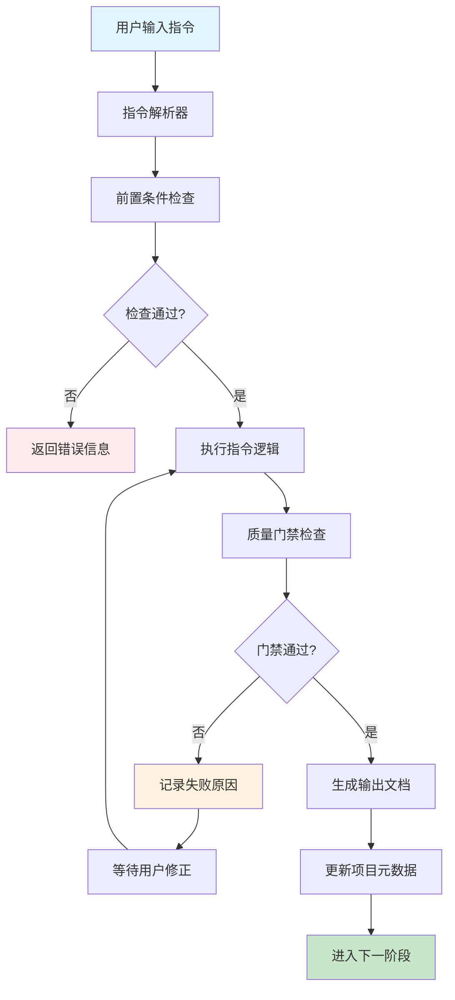

### 5.2 指令与阶段映射

#### 5.2.1 指令-阶段对应表

```mermaid
graph LR
    subgraph "生命周期阶段"
        P0[P0: 项目初始化]
        P1[P1: 需求定义]
        P2[P2: 需求澄清]
        P3[P3: 技术调研]
        P4[P4: 架构设计]
        P5[P5: 开发规划]
        P6[P6: 开发实现]
        P7[P7: 代码审查]
        P8[P8: 交付]
    end

    subgraph "PowerBy指令"
        CMD1[/powerby.initialize]
        CMD2[/powerby.define]
        CMD3[/powerby.clarify]
        CMD4[/powerby.research]
        CMD5[/powerby.design]
        CMD6[/powerby.plan]
        CMD7[/powerby.implement]
        CMD8[/powerby.review]
    end

    CMD1 --> P0
    CMD2 --> P1
    CMD3 --> P2
    CMD4 --> P3
    CMD5 --> P4
    CMD6 --> P5
    CMD7 --> P6
    CMD8 --> P7
    CMD8 --> P8

    classDef phase fill:#fff3e0,stroke:#f57c00
    classDef cmd fill:#e3f2fd,stroke:#1976d2
    class P0,P1,P2,P3,P4,P5,P6,P7,P8 phase
    class CMD1,CMD2,CMD3,CMD4,CMD5,CMD6,CMD7,CMD8 cmd
```

#### 5.2.2 指令依赖关系

每个指令都有严格的前置条件：

**`/powerby.define`** 前置条件：
- ✅ `/powerby.initialize` 已完成
- ✅ 项目宪章已创建
- ✅ 当前阶段状态为 P0

**`/powerby.clarify`** 前置条件：
- ✅ `/powerby.define` 已完成
- ✅ PRD文档已创建
- ✅ 功能点清单已生成
- ✅ 当前阶段状态为 P1

**`/powerby.research`** 前置条件：
- ✅ `/powerby.clarify` 已完成
- ✅ 需求澄清记录已创建
- ✅ 所有Gate检查已通过
- ✅ 当前阶段状态为 P2

**`/powerby.design`** 前置条件：
- ✅ `/powerby.research` 已完成
- ✅ 技术调研报告已确认
- ✅ 技术选型方案已批准
- ✅ 当前阶段状态为 P3

**`/powerby.plan`** 前置条件：
- ✅ `/powerby.design` 已完成
- ✅ 架构设计文档已确认
- ✅ 架构方案已批准
- ✅ 当前阶段状态为 P4

**`/powerby.implement`** 前置条件：
- ✅ `/powerby.plan` 已完成
- ✅ 任务计划已确认
- ✅ 开发方案已批准
- ✅ 当前阶段状态为 P5

**`/powerby.review`** 前置条件：
- ✅ `/powerby.implement` 已完成
- ✅ 实现报告已创建
- ✅ 所有开发任务已完成
- ✅ 当前阶段状态为 P6

### 5.3 各指令详细设计

#### 5.3.1 `/powerby.initialize` 指令

**对应阶段**: P0 - 项目初始化
**职责**: 建立项目宪章和基础设施

**指令格式**:
```bash
/powerby.initialize [项目名称] [项目描述] [选项]
```

**选项参数**:
- `--team`: 团队成员（可选）
- `--tech-stack`: 技术偏好（可选）
- `--template`: 宪章模板（可选，默认使用标准模板）

**执行流程**:
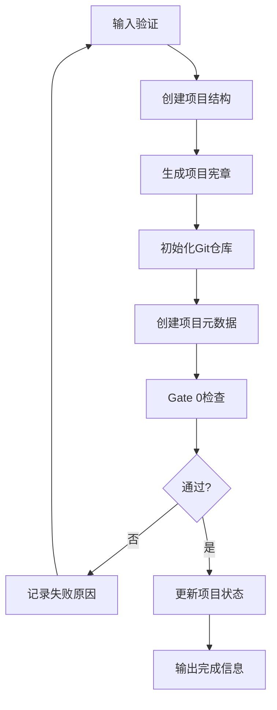

**质量门禁（Gate 0）**:
- [ ] 项目宪章文件存在且包含所有必需章节
- [ ] 目录结构符合PowerBy规范
- [ ] Git仓库已初始化
- [ ] 元数据文件已创建且格式正确

**输出文档**:
- `docs/constitution.md` - 项目宪章
- `.powerby/project.json` - 项目元数据

#### 5.3.2 `/powerby.define` 指令

**对应阶段**: P1 - 需求定义
**职责**: 将产品想法转化为清晰的功能点清单

**指令格式**:
```bash
/powerby.define [产品想法] [选项]
```

**选项参数**:
- `--user-group`: 目标用户群体
- `--problem`: 核心业务问题
- `--timeline`: 预期上线时间
- `--constraints`: 特殊约束条件
- `--iterations`: 迭代编号（可选，默认自动分配）

**执行流程**:
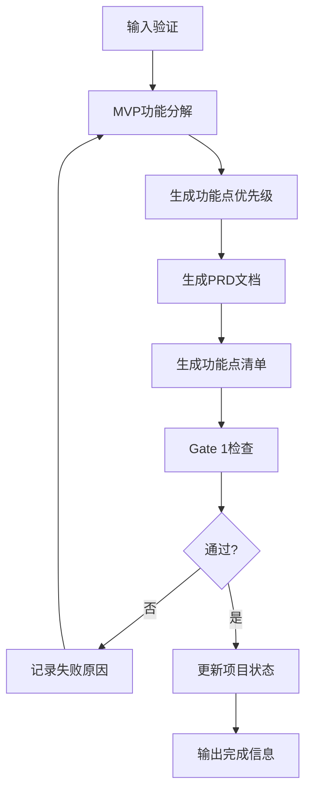

**质量门禁（Gate 1）**:
- [ ] MVP核心价值已用一句话定义
- [ ] 所有功能点已标记优先级([P0]/[P1]/[P2])
- [ ] 范围边界已明确(In-Scope / Out-of-Scope)
- [ ] 待决策清单中每项都有2+可行方案
- [ ] P0功能点数量 ≤ 10个

**输出文档**:
- `docs/iterations/{id}-{name}/prd.md` - 产品需求文档
- `docs/iterations/{id}-{name}/function-points.md` - 功能点清单文档

#### 5.3.3 `/powerby.clarify` 指令

**对应阶段**: P2 - 需求澄清
**职责**: 通过结构化提问消除需求模糊性

**指令格式**:
```bash
/powerby.clarify [选项]
```

**选项参数**:
- `--prd-path`: PRD文档路径（可选，默认使用最新PRD）
- `--function-points-path`: 功能点清单路径（可选，默认使用最新功能点清单）
- `--questions`: 澄清问题数量（可选，默认最大5个）

**执行流程**:
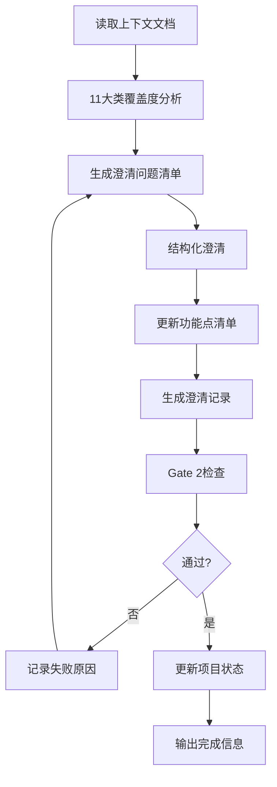

**质量门禁（Gate 2）**:
- [ ] 11大类覆盖度分析已完成
- [ ] 高优先级模糊点已全部澄清(≤5个问题)
- [ ] 所有澄清已同步回prd.md对应章节
- [ ] 覆盖度状态: 核心类别≥80%为"Clear"

**输出文档**:
- `docs/iterations/{id}-{name}/clarifications.md` - 需求澄清记录

#### 5.3.4 `/powerby.research` 指令

**对应阶段**: P3 - 技术调研
**职责**: 针对关键技术决策进行调研，解决技术选型和可行性问题

**指令格式**:
```bash
/powerby.research [选项]
```

**选项参数**:
- `--prd-path`: PRD文档路径（可选，默认使用最新PRD）
- `--function-points-path`: 功能点清单路径（可选，默认使用最新功能点清单）
- `--clarifications-path`: 澄清记录路径（可选，默认使用最新澄清记录）

**执行流程**:
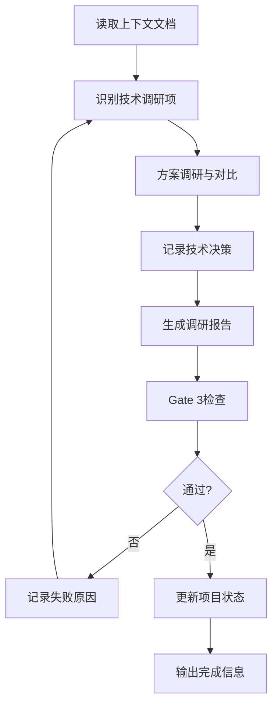

**质量门禁（Gate 3）**:
- [ ] 所有P0功能的技术可行性已评估
- [ ] 核心技术选型已完成决策（至少1个备选方案）
- [ ] 关键技术风险已识别并有缓解措施
- [ ] 技术调研报告结构完整

**输出文档**:
- `docs/iterations/{id}-{name}/research.md` - 技术调研报告

#### 5.3.5 `/powerby.design` 指令

**对应阶段**: P4 - 架构设计
**职责**: 将需求和技术方案转化为清晰的、可视化的架构设计

**指令格式**:
```bash
/powerby.design [选项]
```

**选项参数**:
- `--prd-path`: PRD文档路径（可选，默认使用最新PRD）
- `--function-points-path`: 功能点清单路径（可选，默认使用最新功能点清单）
- `--clarifications-path`: 澄清记录路径（可选，默认使用最新澄清记录）
- `--research-path`: 技术调研报告路径（可选，默认使用最新调研报告）

**执行流程**:
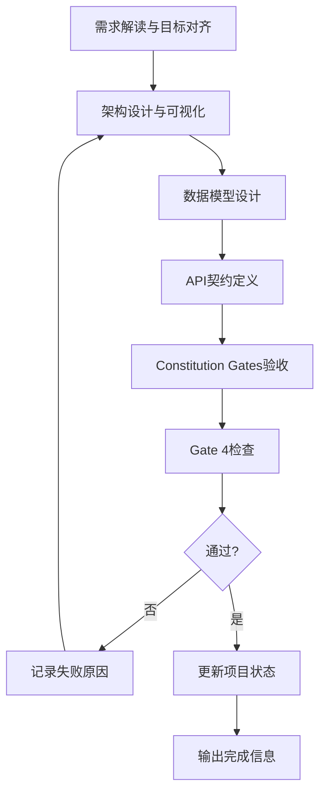

**质量门禁（Gate 4）**:
- [ ] 架构图清晰表达了系统结构
- [ ] 每个组件的职责明确且有需求映射
- [ ] 所有关键技术决策已完成并记录
- [ ] 架构设计符合PRD要求
- [ ] 非功能需求（性能、安全等）已考虑

**输出文档**:
- `docs/iterations/{id}-{name}/architecture.md` - 技术架构设计文档
- `docs/iterations/{id}-{name}/data-model.md` - 数据模型定义
- `docs/iterations/{id}-{name}/contracts/*.yaml` - API契约文件

#### 5.3.6 `/powerby.plan` 指令

**对应阶段**: P5 - 任务规划
**职责**: 将架构设计分解为可执行的、按User Story组织的任务清单

**指令格式**:
```bash
/powerby.plan [选项]
```

**选项参数**:
- `--prd-path`: PRD文档路径（可选，默认使用最新PRD）
- `--architecture-path`: 架构文档路径（可选，默认使用最新架构文档）
- `--tasks-per-day`: 每日任务数（可选，默认2-3个）

**执行流程**:
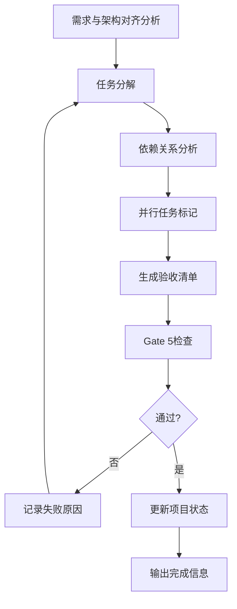

**质量门禁（Gate 5）**:
- [ ] 所有P0功能都有对应的开发任务
- [ ] 任务分解粒度合适（1-2天可完成）
- [ ] 依赖关系清晰合理
- [ ] 验收标准可验证
- [ ] 工作量估算合理

**输出文档**:
- `docs/iterations/{id}-{name}/tasks.md` - 开发任务计划
- `docs/iterations/{id}-{name}/checklists/*.md` - 验收清单

#### 5.3.7 `/powerby.implement` 指令

**对应阶段**: P6 - 开发实现
**职责**: 按照tasks.md和架构设计，高质量地实现所有功能

**指令格式**:
```bash
/powerby.implement [选项]
```

**选项参数**:
- `--tasks-path`: 任务计划路径（可选，默认使用最新任务计划）
- `--architecture-path`: 架构文档路径（可选，默认使用最新架构文档）
- `--tdd`: 启用TDD模式（可选，默认启用）

**执行流程**:
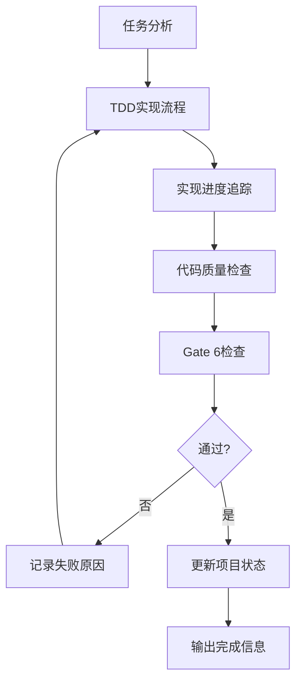

**质量门禁（Gate 6）**:
- [ ] 所有P0任务已完成
- [ ] 测试用例全部通过
- [ ] 测试覆盖率达标（≥80%）
- [ ] 代码通过Linter检查
- [ ] 无严重安全漏洞
- [ ] 可追溯性矩阵完整

**输出文档**:
- `docs/iterations/{id}-{name}/implementation-report.md` - 开发实现报告
- `docs/iterations/{id}-{name}/implementation/work-log.md` - 工作日志

#### 5.3.8 `/powerby.review` 指令

**对应阶段**: P7-P8 - 代码审查和交付
**职责**: 确保代码质量和流程闭环

**指令格式**:
```bash
/powerby.review [选项]
```

**选项参数**:
- `--prd-path`: PRD文档路径（可选，默认使用最新PRD）
- `--function-points-path`: 功能点清单路径（可选，默认使用最新功能点清单）
- `--architecture-path`: 架构文档路径（可选，默认使用最新架构文档）
- `--tasks-path`: 任务计划路径（可选，默认使用最新任务计划）
- `--implementation-report-path`: 实现报告路径（可选，默认使用最新实现报告）
- `--pr-link`: Pull Request链接（可选）

**执行流程**:
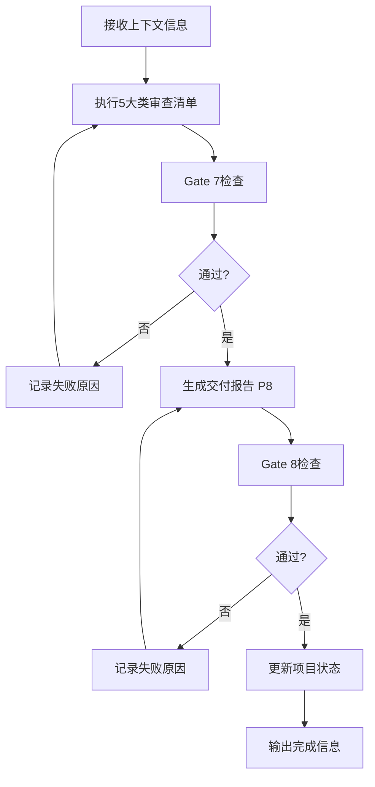

**5大类审查清单**:
1. 一致性与范围审计
2. 实现完整性与真实性审计
3. 设计哲学与代码质量审计
4. 测试与健壮性审计
5. 提交质量审计

**质量门禁（Gate 7）**:
- [ ] 所有5大类审计项已完成检查
- [ ] **功能点一致性验证已完成**
- [ ] 所有P0功能点的验收标准都已满足
- [ ] 最终结论明确（APPROVED或CHANGES REQUESTED）
- [ ] 可追溯性矩阵验证完成
- [ ] 功能验收方案已提供

**质量门禁（Gate 8）**:
- [ ] 所有交付物清单已完成
- [ ] 所有P0功能已实现并通过测试
- [ ] 代码已合并到主干分支
- [ ] 文档完整且最新
- [ ] 部署流程已验证

**输出文档**:
- `docs/iterations/{id}-{name}/code-review-report.md` - 代码审计报告
- `docs/iterations/{id}-{name}/delivery-report.md` - 项目交付报告

### 5.4 指令执行规则

#### 5.4.1 通用执行流程

所有指令都遵循以下通用执行流程：

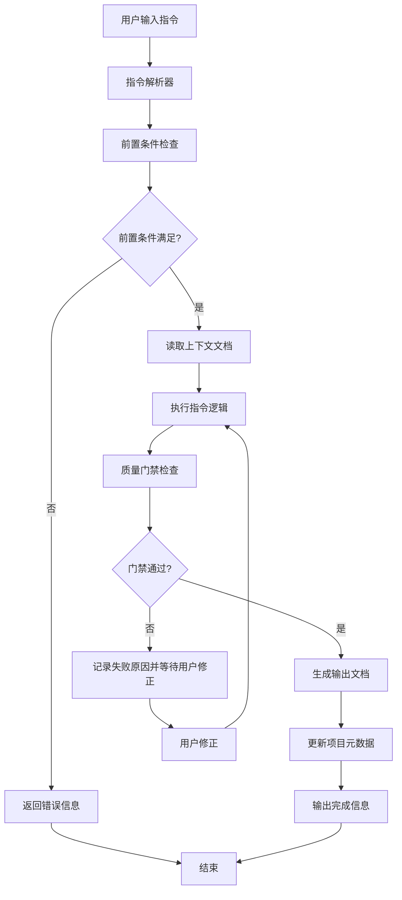

#### 5.4.2 错误处理原则

1. **快速失败**：遇到错误立即停止并报告
2. **明确错误信息**：提供清晰的错误描述和解决方案
3. **重试机制**：允许用户修正错误后重试
4. **升级机制**：连续失败时提供升级选项

#### 5.4.3 日志记录

所有指令执行过程都需要记录日志：

```markdown
[时间] [指令] 开始执行
[时间] [指令] 步骤1完成
[时间] [指令] 步骤2完成
...
[时间] [指令] 执行完成
```

### 5.5 指令使用示例

#### 5.5.1 完整项目流程示例

```bash
# 1. 项目初始化
/powerby.initialize my-project "这是一个示例项目"

# 2. 需求定义
/powerby.define "我想要构建一个电商网站" --user-group "消费者" --timeline "2025-12-31"

# 3. 需求澄清
/powerby.clarify

# 4. 技术调研
/powerby.research

# 5. 架构设计
/powerby.design

# 6. 任务规划
/powerby.plan

# 7. 开发实现
/powerby.implement --tdd

# 8. 代码审查和交付
/powerby.review --pr-link https://github.com/example/repo/pull/1
```

#### 5.5.2 指令执行示例输出

```markdown
✅ 项目初始化完成

📁 项目结构:
  .powerby/
    └── project.json
  docs/
    └── constitution.md
  templates/
  README.md

📋 项目信息:
  名称: my-project
  描述: 这是一个示例项目
  阶段: P0
  状态: initialized

🔍 下一步:
  请使用 /powerby.define 指令开始需求定义阶段
```

---

## 6. Skills与阶段映射

### 6.1 核心技能使用矩阵

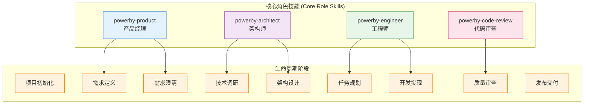

### 6.2 技能使用详细映射

| 阶段 | 主用技能 | 辅助技能 | 原子技能调用 |
|-----|---------|---------|-------------|
| **P0** | - | - | - |
| **P1** | `powerby-product` | - | `requirement-alignment`<br/>`mvp-prioritization` |
| **P2** | `powerby-product` | - | `requirement-alignment` |
| **P3** | `powerby-architect` | - | `solution-evaluation` |
| **P4** | `powerby-architect` | - | `requirement-alignment`<br/>`mermaid-architecture`<br/>`solution-evaluation` |
| **P5** | `powerby-engineer` | - | - |
| **P6** | `powerby-engineer` | - | `requirement-alignment`<br/>`solution-evaluation`<br/>`test-spec-design` |
| **P7** | `powerby-code-review` | - | - |
| **P8** | - | - | - |

### 6.3 技能调用流程图

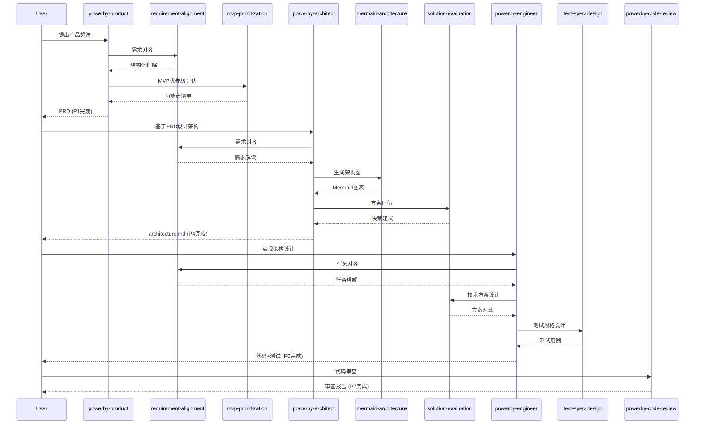

---

## 7. 原子技能复用模式

### 7.1 原子技能特性

| 原子技能 | 核心能力 | 复用场景 | 调用者 |
|---------|---------|---------|--------|
| **requirement-alignment** | 需求对齐与确认<br/>结构化复述<br/>主动澄清 | 产品需求定义<br/>架构需求解读<br/>任务分析对齐 | powerby-product<br/>powerby-architect<br/>powerby-engineer |
| **solution-evaluation** | 多方案权衡分析<br/>哲学对齐评估<br/>风险分析 | 技术选型决策<br/>架构决策点评估<br/>实现方案选择 | powerby-architect<br/>powerby-engineer |
| **mermaid-architecture** | Mermaid可视化<br/>架构图生成<br/>多图表类型支持 | 架构设计可视化<br/>系统设计展示<br/>技术方案演示 | powerby-architect |
| **test-spec-design** | 测试规格设计<br/>TDD支持<br/>验收标准定义 | 功能测试设计<br/>TDD开发<br/>质量保证 | powerby-engineer |
| **mvp-prioritization** | MVP优先级评估<br/>功能原子化<br/>无情削减 | 功能拆解<br/>MVP范围定义<br/>优先级排序 | powerby-product |

### 7.2 复用模式说明

#### 模式1: 阶段内复用 (Within-Stage Reuse)

**示例**: powerby-architect 在P4阶段的内部调用

```mermaid
graph LR
    A[powerby-architect] --> B[requirement-alignment]
    A --> C[mermaid-architecture]
    A --> D[solution-evaluation]
    B --> E[需求对齐报告]
    C --> F[Mermaid架构图]
    D --> G[方案评估报告]
    E --> H[architecture.md]
    F --> H
    G --> H
```

#### 模式2: 跨阶段复用 (Cross-Stage Reuse)

**示例**: requirement-alignment 在P1、P2、P4、P6阶段的复用

```mermaid
graph TB
    subgraph "P1 需求定义"
        PM1[powerby-product] --> RA1[requirement-alignment]
    end
    subgraph "P2 需求澄清"
        PM2[powerby-product] --> RA2[requirement-alignment]
    end
    subgraph "P4 架构设计"
        ARCH[powerby-architect] --> RA3[requirement-alignment]
    end
    subgraph "P6 开发实现"
        ENG[powerby-engineer] --> RA4[requirement-alignment]
    end

    RA1 --> RA_OUT1[结构化需求理解]
    RA2 --> RA_OUT2[模糊点识别]
    RA3 --> RA_OUT3[需求解读]
    RA4 --> RA_OUT4[任务理解]
```

#### 模式3: 技能链复用 (Skill Chain Reuse)

**示例**: 从产品到架构的技能链

```mermaid
sequenceDiagram
    participant PM as powerby-product
    participant MVP as mvp-prioritization
    participant RA1 as requirement-alignment
    participant ARCH as powerby-architect
    participant RA2 as requirement-alignment
    participant MA as mermaid-architecture

    PM->>RA1: 需求对齐
    RA1-->>PM: 结构化理解
    PM->>MVP: 功能点优先级
    MVP-->>PM: P0/P1/P2标记
    PM-->>ARCH: PRD完成

    ARCH->>RA2: 需求解读
    RA2-->>ARCH: 需求复述
    ARCH->>MA: 生成架构图
    MA-->>ARCH: Mermaid图表
    ARCH-->>PM: architecture.md
```

### 7.3 复用最佳实践

#### ✅ 推荐做法
1. **原子技能优先**: 能用原子技能解决的，不要创建新逻辑
2. **保持一致性**: 相同场景使用相同的原子技能
3. **记录复用**: 在文档中说明使用了哪些原子技能
4. **标准化输出**: 确保原子技能的输出格式统一

#### ❌ 避免做法
1. **重复实现**: 不要在多个核心技能中重复相同的逻辑
2. **过度耦合**: 避免核心技能与原子技能强耦合
3. **参数混乱**: 保持原子技能调用参数的一致性
4. **忽略返回**: 必须使用原子技能的输出结果

---

## 8. 操作流程指引

### 8.1 项目启动完整流程

#### Step 1: 初始化项目

```bash
# 1. 创建项目结构
mkdir -p {project-name}/{docs,src,tests}

# 2. 初始化Git仓库
git init

# 3. 进入项目目录
cd {project-name}

# 4. 创建P0阶段产出
echo "# 项目宪章" > docs/constitution.md
```

#### Step 2: 执行各阶段

**P1-P2 需求阶段**:
```bash
# 使用powerby-product skill
# 输入: 产品想法
# 输出: prd.md, clarifications.md
```

**P3-P4 技术阶段**:
```bash
# 使用powerby-architect skill
# 输入: prd.md, clarifications.md
# 输出: research.md, architecture.md, data-model.md, contracts/
```

**P5-P6 执行阶段**:
```bash
# 使用powerby-engineer skill
# 输入: architecture.md
# 输出: tasks.md, 代码, tests, implementation/
```

**P7 审查阶段**:
```bash
# 使用powerby-code-review skill
# 输入: PR + 三份文档
# 输出: review-report.md
```

### 8.2 状态管理

#### 项目元数据示例

`.powerby/project.json`:
```json
{
  "project_name": "example-project",
  "current_phase": "P4_IN_PROGRESS",
  "current_status": "P4_IN_PROGRESS",
  "created_at": "2025-12-17T00:00:00Z",
  "phase_history": [
    {
      "phase": "P0",
      "status": "P0_COMPLETED",
      "completed_at": "2025-12-17T12:00:00Z"
    },
    {
      "phase": "P1",
      "status": "P1_COMPLETED",
      "completed_at": "2025-12-18T18:00:00Z"
    }
  ]
}
```

#### 状态更新流程

```mermaid
flowchart TD
    A[当前阶段完成] --> B[更新project.json]
    B --> C[标记阶段状态]
    C --> D{是否通过Gate?}
    D -->|是| E[进入下一阶段]
    D -->|否| F[返工当前阶段]
    F --> A
    E --> G[更新文档状态]
    G --> H[通知团队]
```

### 8.3 文档管理

#### 文档版本控制

每个文档都应包含版本信息:

```markdown
# 文档标题

**版本**: v1.0.0
**创建日期**: 2025-12-17
**最后更新**: 2025-12-18
**状态**: ✅ 已批准

---

## 版本历史

| 版本 | 日期 | 变更内容 | 修订人 |
|-----|------|---------|-------|
| v1.0.0 | 2025-12-17 | 初始版本 | Alice |
| v1.1.0 | 2025-12-18 | 更新架构设计 | Bob |
```

#### 文档关联追踪

```mermaid
graph LR
    subgraph "需求文档"
        PRD[prd.md v1.0]
        CLAR[clarifications.md v1.0]
    end
    subgraph "设计文档"
        RESEARCH[research.md v1.0]
        ARCH[architecture.md v1.0]
        DM[data-model.md v1.0]
    end
    subgraph "执行文档"
        TASKS[tasks.md v1.0]
        CODE[代码实现]
        TEST[测试用例]
    end

    PRD --> CLAR
    CLAR --> RESEARCH
    RESEARCH --> ARCH
    ARCH --> DM
    DM --> TASKS
    TASKS --> CODE
    CODE --> TEST

    %% 关联标记
    PRD -.-> ARCH
    CLAR -.-> ARCH
    ARCH -.-> CODE
```

### 8.4 决策记录

#### 决策日志模板

```markdown
# 决策日志 (Decision Log)

## 决策 #001: [决策主题]

**日期**: 2025-12-17
**决策人**: [姓名]
**状态**: ✅ 已决策

### 问题描述
[简明扼要描述需要决策的问题]

### 候选方案

#### 方案A: [方案名称]
- **描述**: [具体内容]
- **优点**: ✅ [优点列表]
- **缺点**: ❌ [缺点列表]
- **复杂度**: [低/中/高]
- **MVP适用性**: [最适合/适合/不适合]

#### 方案B: [方案名称]
[同上格式]

### 最终决策
**选择**: 方案[A/B]
**理由**: [决策原因]

### 后续行动
- [ ] [行动项1]
- [ ] [行动项2]

---

## 决策 #002: [下一个决策]
```

---

## 9. 质量门禁机制

### 9.1 门禁总览

| Gate | 阶段 | 触发条件 | 检查要点 | 通过标准 | 失败处理 |
|-----|------|---------|---------|---------|---------|
| **Gate 1** | P1→P2 | PRD草稿完成 | MVP范围、优先级、边界 | 5项验收标准 | 返工P1 |
| **Gate 2** | P2→P3 | 澄清记录完成 | 11类覆盖度、模糊点 | 4项验收标准 | 继续P2 |
| **Gate 3** | P4→P5 | 架构设计完成 | Constitution Gates | 3大门禁+5项验收 | 返工P4 |
| **Gate 4** | P5→P6 | 任务计划完成 | 任务完整性、Checklist | 6项验收标准 | 返工P5 |
| **Gate 5** | P7→P8 | 代码审查完成 | 5大类审计 | 5项验收标准 | 返工P6 |

### 9.2 Gate 3 详细说明

#### Constitution Gates 三大门禁

**Gate 3.1: Simplicity Gate**
```markdown
### Simplicity Gate 检查清单

- [ ] **方案简单性**: 方案是最简单能满足需求的设计
  - 理由: [填写为什么这是最简单的方案]
  - 对比: [与其他方案对比如何更简单]

- [ ] **避免过度设计**: 无为"未来可能"而引入的抽象
  - 未来场景: [列出假设的未来需求]
  - 决策: [说明为什么不在当前实现]

- [ ] **复杂度追踪**: 明确说明复杂度的理由
  - 必要复杂度: [哪些复杂度是不可避免的]
  - 可避免复杂度: [哪些复杂度已被消除]
```

**Gate 3.2: Anti-Abstraction Gate**
```markdown
### Anti-Abstraction Gate 检查清单

- [ ] **模式适度性**: 避免了不必要的设计模式
  - 使用的模式: [列出实际使用的模式]
  - 避免的模式: [说明为什么避免某些模式]

- [ ] **抽象层级控制**: 抽象层级 ≤ 3层
  - 当前抽象层级: [具体数字]
  - 层级说明: [每层的作用]

- [ ] **抽象必要性**: 每个抽象都有明确理由
  - 抽象1: [名称] - 理由: [为什么需要]
  - 抽象2: [名称] - 理由: [为什么需要]
```

**Gate 3.3: Integration-First Gate**
```markdown
### Integration-First Gate 检查清单

- [ ] **库/服务复用**: 优先使用现有库/服务
  - 复用清单:
    - [库/服务1] - 用途: [具体用途]
    - [库/服务2] - 用途: [具体用途]

- [ ] **避免重复造轮子**: 未重复造轮子
  - 现有方案调研: [说明调研了哪些现有方案]
  - 选择理由: [为什么选择复用而非自建]

- [ ] **新组件清单**: 明确列出所有新组件
  - 新组件1: [名称] - 理由: [为什么必须新建]
  - 新组件2: [名称] - 理由: [为什么必须新建]
```

### 9.3 代码审查审计清单

#### 审计维度1: 一致性与范围

```markdown
### 一致性审计

#### 需求一致性
- [ ] 代码实现与prd.md中的功能点一致
  - 检查项1: [具体检查内容]
  - 检查项2: [具体检查内容]

- [ ] 实现方式与architecture.md中的设计一致
  - 检查项1: [具体检查内容]
  - 检查项2: [具体检查内容]

#### 任务一致性
- [ ] 实现与tasks.md中的任务项一致
  - 完成的任务: [列出完成的任务ID]
  - 变更的任务: [如有变更，说明原因]

#### 范围控制
- [ ] 无超出范围的功能实现
- [ ] 无遗漏的核心功能
```

#### 审计维度2: 实现完整性

```markdown
### 完整性审计

#### 假实现检测
- [ ] 无硬编码数据
- [ ] 无TODO注释
- [ ] 无空函数/空类
- [ ] 无placeholder代码

#### 业务逻辑完整性
- [ ] 所有分支路径已实现
- [ ] 错误处理已完善
- [ ] 边界条件已考虑

#### 数据完整性
- [ ] 所有数据模型字段已实现
- [ ] 数据验证已添加
- [ ] 数据一致性已保证
```

### 9.4 返工流程

#### 返工触发条件

```mermaid
graph TD
    A[质量门禁检查] --> B{是否通过?}
    B -->|是| C[进入下一阶段]
    B -->|否| D[识别问题]
    D --> E{问题严重程度}
    E -->|Critical| F[立即返工]
    E -->|Major| G[限期返工]
    E -->|Minor| H[记录但可继续]

    F --> I[更新任务状态]
    G --> I
    H --> C

    I --> J[执行返工]
    J --> A
```

#### 返工管理

```markdown
# 返工记录 (Rework Log)

## 返工 #001: Gate 5 失败

**日期**: 2025-12-18
**Gate**: Gate 5 - 代码审查
**审查人**: Code Reviewer
**严重程度**: Critical

### 问题描述
1. 用户认证功能存在硬编码密码
2. 缺少错误处理机制
3. 测试覆盖率仅60%，低于80%标准

### 返工要求
- [ ] 移除所有硬编码，使用配置文件
- [ ] 为所有公共方法添加错误处理
- [ ] 补充单元测试，覆盖率达到80%

### 预估返工时间
2天

### 责任人
Engineer A

---

## 返工 #002: [下一次返工]
```

---

## 📚 附录

### A. 快速参考

#### 技能调用速查表

| 需求场景 | 使用技能 | 命令示例 |
|---------|---------|---------|
| 定义产品需求 | `powerby-product` | "使用 powerby-product skill，我想做一个..." |
| 设计技术架构 | `powerby-architect` | "使用 powerby-architect skill，基于 prd.md 设计架构" |
| 实现功能 | `powerby-engineer` | "使用 powerby-engineer skill，实现 tasks.md 中的 T001" |
| 代码审查 | `powerby-code-review` | "使用 powerby-code-review skill，审查 PR #123" |
| 需求对齐 | `requirement-alignment` | "使用 requirement-alignment skill，帮我确认对...的理解" |
| 方案评估 | `solution-evaluation` | "使用 solution-evaluation skill，帮我评估方案A和B" |
| 架构可视化 | `mermaid-architecture` | "使用 mermaid-architecture skill，画一个...架构图" |
| 测试设计 | `test-spec-design` | "使用 test-spec-design skill，设计...的测试用例" |
| MVP优先级 | `mvp-prioritization` | "使用 mvp-prioritization skill，帮我评估这些功能的优先级" |

#### 迭代管理速查表

| 操作场景 | Git命令 | 示例 |
|---------|---------|------|
| 创建新迭代分支 | `git checkout -b {id}-{name}` | `git checkout -b 001-user-authentication` |
| 切换到迭代分支 | `git checkout {branch}` | `git checkout 001-user-authentication` |
| 合并迭代到main | `git merge --squash {branch}` | `git merge --squash 001-user-authentication` |
| 删除已合并分支 | `git branch -d {branch}` | `git branch -d 001-user-authentication` |
| 强制删除分支 | `git branch -D {branch}` | `git branch -D 001-user-authentication` |
| 查看所有分支 | `git branch -a` | `git branch -a` |
| 推送新分支 | `git push -u origin {branch}` | `git push -u origin 001-user-authentication` |
| 删除远程分支 | `git push origin --delete {branch}` | `git push origin --delete 001-user-authentication` |

#### 文档路径速查表

| 文档类型 | 路径 | 模板 | 阶段 |
|---------|------|------|------|
| 项目宪章 | `docs/constitution.md` | ✅ | P0 |
| 迭代元数据 | `.powerby/iterations.json` | 📋 | 全阶段 |
| 产品需求 | `docs/iterations/{id}-{name}/prd.md` | ✅ | P1 |
| 需求澄清 | `docs/iterations/{id}-{name}/clarifications.md` | ✅ | P2 |
| 技术调研 | `docs/iterations/{id}-{name}/research.md` | 📋 | P3 |
| 架构设计 | `docs/iterations/{id}-{name}/architecture.md` | 📋 | P4 |
| 数据模型 | `docs/iterations/{id}-{name}/data-model.md` | 📋 | P4 |
| API契约 | `docs/iterations/{id}-{name}/contracts/*.yaml` | 📋 | P4 |
| 任务计划 | `docs/iterations/{id}-{name}/tasks.md` | 📋 | P5 |
| 验收清单 | `docs/iterations/{id}-{name}/checklists/*.md` | 📋 | P5 |
| 工作日志 | `docs/iterations/{id}-{name}/implementation/work-log.md` | 📋 | P6 |
| 审查报告 | `docs/iterations/{id}-{name}/reviews/code-review-*.md` | 📋 | P7 |
| 发布记录 | `docs/iterations/{id}-{name}/releases/*.md` | 📋 | P8 |

### B. 最佳实践

#### 文档编写最佳实践

1. **结构化**: 使用一致的标题层级和格式
2. **可视化**: 多使用Mermaid图表增强可读性
3. **可追溯**: 确保文档之间有关联和引用
4. **版本化**: 所有文档都有版本号和变更记录
5. **可验证**: 每个结论都有明确的验收标准

#### 阶段执行最佳实践

1. **严格遵循**: 不跳过任何阶段或门禁
2. **充分确认**: 每个阶段都等待用户确认
3. **记录决策**: 所有重要决策都有记录
4. **及时更新**: 状态变化立即更新到project.json
5. **主动澄清**: 遇到模糊点主动询问

#### 技能使用最佳实践

1. **正确调用**: 使用正确的技能解决正确的问题
2. **组合使用**: 核心技能+原子技能的组合
3. **输出利用**: 充分利用技能的输出结果
4. **避免重复**: 不在多个地方重复相同的逻辑
5. **持续改进**: 根据使用反馈优化技能调用

#### 迭代管理最佳实践

1. **小步快跑**: 单个迭代周期建议控制在2-4周内
2. **独立完整**: 每个迭代都应该能独立提供业务价值
3. **清晰边界**: 明确迭代的功能边界和不在范围内的内容
4. **及时合并**: 迭代完成后尽快合并到main分支
5. **文档同步**: 保持迭代文档与代码实现同步
6. **度量追踪**: 持续跟踪迭代的度量指标
7. **依赖管理**: 明确声明和管理迭代间的依赖关系
8. **分支清理**: 及时清理已合并的迭代分支

### C. 常见问题

#### Q1: 如何处理需求变更？

**A**: 遵循以下流程：
1. 评估变更对当前阶段的影响
2. 如果是P6之后的大变更，建议新开项目
3. 如果是P6之前的变更，更新相关文档
4. 必要时回到前一阶段重新评估

#### Q2: 多个架构方案如何选择？

**A**: 使用solution-evaluation原子技能：
1. 提供至少2个可行方案
2. 从MVP、技术复杂度、维护成本等维度评估
3. 基于SOLID/KISS/DRY哲学分析
4. 明确推荐方案和理由

#### Q3: 如何处理技能之间的冲突？

**A**: 建立清晰的职责边界：
- Product: 定义"做什么"（功能需求）
- Architect: 设计"如何做"（技术方案）
- Engineer: 实现"做出来"（代码实现）
- Code Review: 确保"做得好"（质量保证）

#### Q4: 原子技能被多个核心技能调用时如何保证一致性？

**A**:
1. 标准化原子技能的输入输出格式
2. 在文档中明确说明每个原子技能的使用场景
3. 保持调用参数的一致性
4. 定期审查原子技能的使用情况

#### Q5: 如何管理迭代之间的依赖关系？

**A**:
1. **在PRD中明确声明**: 每个迭代的PRD都应包含依赖关系章节
2. **使用强依赖标记**: 对于必须的依赖，标记为"Hard Dependency"
3. **规划开发顺序**: 根据依赖关系规划迭代的开发顺序
4. **并行开发评估**: 对于可以并行开发的迭代，评估潜在的集成点
5. **更新iterations.json**: 在元数据中记录依赖关系，便于追踪

#### Q6: 迭代分支应该何时创建？

**A**:
1. **需求定义前**: 在P0-P1阶段开始前创建分支
2. **基于最新main**: 确保从最新的main分支创建
3. **命名规范**: 遵循`{编号}-{功能名}`的命名规范
4. **立即推送**: 创建后立即推送到远程，便于团队协作
5. **自动化工具**: 考虑使用脚本自动化分支创建和初始化

#### Q7: 如何处理长期未合并的迭代分支？

**A**:
1. **设置超时机制**: 建议迭代分支不超过4周未合并
2. **定期审查**: 每周审查所有活跃分支的状态
3. **识别阻塞点**: 找出未合并的原因（技术问题、依赖阻塞等）
4. **小步提交**: 将大迭代拆分为更小的迭代
5. **分支归档**: 对于超过8周未活跃的分支，考虑归档而非删除

### D. 术语表

| 术语 | 英文 | 定义 |
|-----|------|------|
| **Constitution** | Constitution | 项目宪章，定义开发原则和规范 |
| **Gate** | Quality Gate | 质量门禁，阶段间的验收检查点 |
| **User Story** | User Story | 用户故事，描述用户需求的最小单元 |
| **MVP** | Minimum Viable Product | 最小可行产品 |
| **P0/P1/P2** | Priority Levels | 优先级标记（P0必须，P1重要，P2可选） |
| **[P]标记** | Parallel Marker | 可并行执行的任务标记 |
| **RACI** | Responsible/Accountable/Consulted/Informed | 角色职责矩阵 |
| **TDD** | Test-Driven Development | 测试驱动开发 |
| **SOLID** | SOLID Principles | 面向对象设计五大原则 |
| **KISS** | Keep It Simple, Stupid | 保持简单 |
| **DRY** | Don't Repeat Yourself | 不要重复自己 |
| **Atomic Skill** | Atomic Skill | 原子技能，可复用的最小能力单元 |
| **Core Skill** | Core Skill | 核心技能，完整的端到端工作流程技能 |
| **Iteration** | Iteration | 需求迭代，独立的功能开发单元 |
| **Branch** | Git Branch | Git分支，用于隔离迭代开发 |
| **Feature Branch** | Feature Branch | 功能分支，以迭代编号命名的开发分支 |
| **Main Branch** | Main Branch | 主分支，集成所有已发布的迭代 |
| **Iteration Metadata** | Iteration Metadata | 迭代元数据，存储在`.powerby/iterations.json`中的迭代信息 |

---

**文档状态**: ✅ 生效中
**版本**: v2.0.0
**最后更新**: 2025-12-17
**下次审查**: 2026-03-17

---

*本概览文档基于 `docs/powerby-lifecycle-framework.md` 优化整合，融合了Spec-Kit的最佳实践，引入了迭代与分支管理机制，提供了完整的操作指引和Skills映射。每个需求迭代都遵循完整的P0-P8生命周期，确保开发流程的系统性和可追溯性。*
