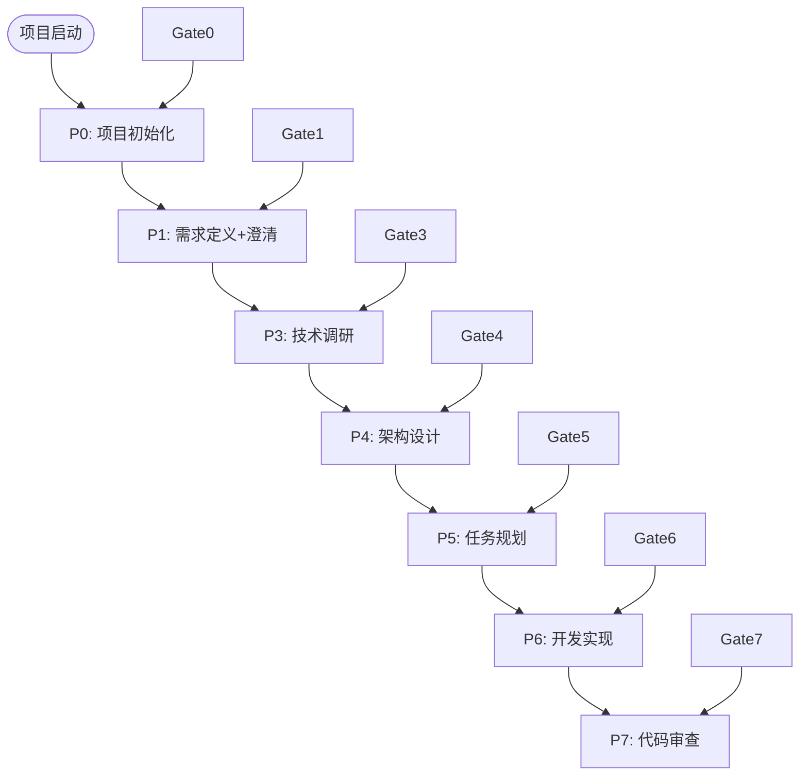

# PowerBy 项目软件生命周期概览
## Project Software Development Lifecycle Overview

**版本**: v4.0.0
**适用范围**: MVP产品开发生命周期管理

---

## 目录

1. [生命周期鸟瞰图](#1-生命周期鸟瞰图)
2. [标准流程与快速流程](#2-标准流程与快速流程)
3. [迭代与分支管理](#3-迭代与分支管理)
4. [阶段详细说明](#4-阶段详细说明)
5. [质量门禁机制](#5-质量门禁机制)

---

## 1. 生命周期鸟瞰图

### 1.1 整体流程图


```mermaid
graph TB
    START([项目启动]) --> P0[P0: 项目初始化]
    P0 --> P1[P1: 需求定义+澄清]
    P1 --> P3[P3: 技术调研]
    P3 --> P4[P4: 架构设计]
    P4 --> P5[P5: 任务规划]
    P5 --> P6[P6: 开发实现]
    P6 --> P7[P7: 代码审查]

    Gate0 --> P0
    Gate1 --> P1
    Gate3 --> P3
    Gate4 --> P4
    Gate5 --> P5
    Gate6 --> P6
    Gate7 --> P7
```

### 1.2 阶段分类

| 类别 | 阶段 | 核心特征 |
|-----|------|---------|
| **初始化** | P0 | 建立项目基础 + Git初始化 |
| **需求** | P1 | 澄清"做什么" |
| **技术** | P3-P4 | 设计"如何做" |
| **执行** | P5-P6 | 具体实现与开发 |
| **审查** | P7 | 质量保证 |

### 1.3 关键特征

**循环迭代**
- P1 需求循环：直到所有模糊点澄清
- P3-P4 设计循环：直到架构通过质量门禁
- P6-P7 返工循环：直到代码审查通过

**质量门禁**
- Gate 0: 项目可行性
- Gate 1: 需求定稿
- Gate 3: 技术可行性
- Gate 4: 架构设计清晰性
- Gate 5: 任务计划完整性
- Gate 6: 实现完整性
- Gate 7: 代码审查完整性

---

## 2. 标准流程与快速流程

### 2.1 流程类型概览

| 流程类型 | 适用场景 | 时间周期 | 阶段范围 | 分支创建时机 |
|---------|---------|---------|---------|-------------|
| **标准流程** | 完整功能开发 | 2-4周 | P0-P7 | P1完成后（Gate 1通过） |
| **快速流程** | 小需求/增量开发 | ≤5小时 | P0-P5 | P5完成后（Q-Gate 5通过） |
| **Bug修复** | Bug诊断与修复 | 视复杂度 | 独立流程 | bugfix开始时（自动） |

### 2.2 标准流程 (P0-P7)

```
P0: 项目初始化 → P1: 需求定义+澄清 → [创建feature分支] → P3: 技术调研 → P4: 架构设计 → P5: 任务规划 → P6: 开发实现 → P7: 代码审查
                      ↑ Gate 1通过后自动创建分支
```

### 2.3 快速流程 (P0-P5)

```
P0+P1: 需求定义+澄清(自动初始化) → P3: 技术调研 → P4: 架构设计 → P5: 任务规划 → [创建feature分支] → 交付
                                                      ↑ Q-Gate 5通过后创建分支
```

### 2.4 分支创建时机规则 ⭐

| 流程类型 | 分支类型 | 创建时机 | 触发方式 |
|---------|---------|---------|---------|
| 标准流程 | feature/{id}-{name} | P1完成后（Gate 1通过） | 自动触发 powerby-git start |
| 快速流程 | feature/{id}-{name} | P5完成后（Q-Gate 5通过） | 人工确认后创建 |
| Bug修复 | bugfix/{id}-{desc} | bugfix流程开始时 | 自动创建 powerby-git start |
| Bug修复 | hotfix/{id}-{desc} | 紧急修复开始时 | 自动创建 powerby-git start |

**分支创建原则**：
- 标准流程：需求确认后立即创建分支，确保开发在规范分支上进行
- 快速流程：任务规划完成后创建分支，此时所有设计已确认
- Bug修复：立即创建分支，确保修复在规范分支上进行

**快速流程适用场景**：
- 基于现有架构的小功能需求（≤3天工作量）
- 临时性功能开发
- 简单Bug修复或优化

---

## 3. 迭代与分支管理

### 3.1 分支类型

| 类型 | 命名规范 | 来源 | 合并目标 |
|-----|---------|------|---------|
| 主分支 | main | - | - |
| 开发分支 | develop | - | - |
| 功能分支 | feature/{id}-{name} | develop | develop |
| Bug修复 | bugfix/{id}-{desc} | develop | develop |
| 紧急修复 | hotfix/{id}-{desc} | main | main + develop |

### 3.2 分支创建时机（按流程类型）⭐

| 流程类型 | 命令 | 创建时机 | 说明 |
|---------|------|---------|------|
| 标准流程 | `powerby-git start --type=feature` | P1完成后 | Gate 1通过后自动触发 |
| 快速流程 | `powerby-git start --type=feature` | P5完成后 | Q-Gate 5通过+人工确认后 |
| Bug修复 | `powerby-git start --type=bugfix` | bugfix开始时 | 自动触发 |
| 紧急修复 | `powerby-git start --type=hotfix` | hotfix开始时 | 自动触发 |

### 3.3 powerby-git 命令

```bash
# 创建分支
powerby-git start --type=feature --name=001-user-authentication
powerby-git start --type=bugfix --name=login-timeout

# 检查合规性
powerby-git check --type=commit      # 提交检查
powerby-git check --type=merge       # 合并检查

# 分支清理
powerby-git cleanup --dry-run        # 预览
powerby-git cleanup --force          # 执行
```

### 3.3 Git Hooks

```bash
# pre-commit - 提交时自动检查
powerby-git check --type=commit

# pre-merge - 合并时自动检查
powerby-git check --type=merge
```

### 3.4 分支生命周期

```
创建 → 开发 → 提交(pre-commit) → 合并(pre-merge) → 清理(cleanup)
```

---

## 4. 阶段详细说明

### P0: 项目初始化

**阶段目标**: 建立项目的宪章基础，定义核心原则和开发规范，完成Git初始化。

**执行步骤**:
1. 创建项目目录结构
2. 编写项目宪章(constitution.md)
3. 初始化Git仓库
4. 配置开发环境

**输出文档**: constitution.md, .powerby/project.json

**验收标准 (Gate 0)**:
- [ ] constitution.md已创建
- [ ] Git仓库已初始化

---

### P1: 需求定义+澄清

**阶段目标**: 将产品想法转化为清晰的带MVP优先级的功能点清单。

**执行步骤**:
1. 需求原始输入收集
2. 功能规格框架定义
3. MVP功能分解（P0/P1/P2优先级）
4. 同步澄清过程
5. **分支创建**（仅标准流程，Gate 1通过后；快速流程在P5创建）

**输出文档**: prd.md, function-points.md, clarifications.md

**验收标准 (Gate 1)**:
- [ ] PRD结构完整，所有P0功能点已定义
- [ ] 文档中无模糊描述
- [ ] **标准流程**: 分支已创建，Git Hooks已安装
- [ ] **快速流程**: 等待P5完成后创建分支

---

### P3: 技术调研

**阶段目标**: 深度技术方案研究，评估技术可行性。

**执行步骤**:
1. 需求解读与目标对齐
2. 技术调研分析（技术栈、架构模式、关键技术）
3. 技术决策点识别（至少2种可行方案）

**输出文档**: technical-research.md

**验收标准 (Gate 3)**:
- [ ] 所有P0功能的技术可行性已评估
- [ ] 核心技术选型已完成决策

---

### P4: 架构设计

**阶段目标**: 将技术方案转化为清晰、可执行的技术架构设计。

**执行步骤**:
1. 需求解读与目标对齐
2. 架构设计与可视化（Mermaid架构图）
3. 关键决策点与方案评估
4. 寻求最终决策与交付

**输出文档**: architecture.md

**验收标准 (Gate 4)**:
- [ ] 架构图清晰表达系统结构
- [ ] 组件职责明确且有需求映射

---

### P5: 任务规划

**阶段目标**: 将功能需求分解为可执行的开发任务。

**执行步骤**:
1. 任务分解（基于架构设计）
2. 哲学对齐分析（SOLID、KISS、DRY）
3. 任务定义（包含验收标准）
4. **分支创建**（仅快速流程，Q-Gate 5通过后）

**输出文档**: tasks.md

**验收标准 (Gate 5)**:
- [ ] 所有P0功能点已分解为具体任务
- [ ] 每个任务都有明确的验收标准
- [ ] **快速流程**: 分支已创建，Git Hooks已安装
- [ ] **标准流程**: 分支已在P1创建，无需重复创建

---

### P6: 开发实现

**阶段目标**: 完成代码实现、测试和文档编写。

**执行步骤** (TDD流程):
1. 理解 - 研究代码库中的现有模式
2. 测试 - 编写失败的测试（红灯）
3. 实现 - 编写最精简的代码（绿灯）
4. 重构 - 在测试保护下清理和优化代码
5. 提交 - 撰写清晰的提交信息

**输出文档**: implementation-report.md

**验收标准 (Gate 6)**:
- [ ] 所有P0任务已完成
- [ ] 代码质量符合项目标准

---

### P7: 代码审查

**阶段目标**: 对代码实现进行全面审查，完成分支合并与清理。

**执行步骤**:
1. 上下文信息收集（收集所有基准文档）
2. 执行审查清单（5大类审计项）
3. 生成审计报告
4. 分支合并与清理

**输出文档**: code-review-report.md

**验收标准 (Gate 7)**:
- [ ] 所有5大类审计项已完成
- [ ] 分支已合并到develop
- [ ] 本地feature分支已清理

---

## 5. 质量门禁机制

### 质量门禁清单

| Gate | 名称 | 检查内容 | 通过标准 |
|------|------|----------|----------|
| Gate 0 | 项目可行性 | 项目章程、Git初始化 | 所有检查项通过 |
| Gate 1 | 需求定稿 | PRD、功能点清单、澄清记录 | 所有检查项通过 |
| Gate 3 | 技术可行性 | 技术调研深度和准确性 | 所有检查项通过 |
| Gate 4 | 架构设计清晰性 | 架构图、组件映射、决策记录 | 所有检查项通过 |
| Gate 5 | 任务计划完整性 | 任务分解、验收标准 | 所有检查项通过 |
| Gate 6 | 实现完整性 | 任务完成、测试覆盖 | 所有检查项通过 |
| Gate 7 | 代码审查完整性 | 5大类审计项 | 所有检查项通过 |

### 门禁执行流程

1. 自检 - 当前阶段完成后进行自检
2. 交叉审查 - 由下游技能进行交叉审查
3. 问题修复 - 发现问题则返回修改
4. 门禁通过 - 所有检查项通过后进入下一阶段

---

**文档状态**: v4.0.0 - 精简版，仅保留流程生命周期核心内容
