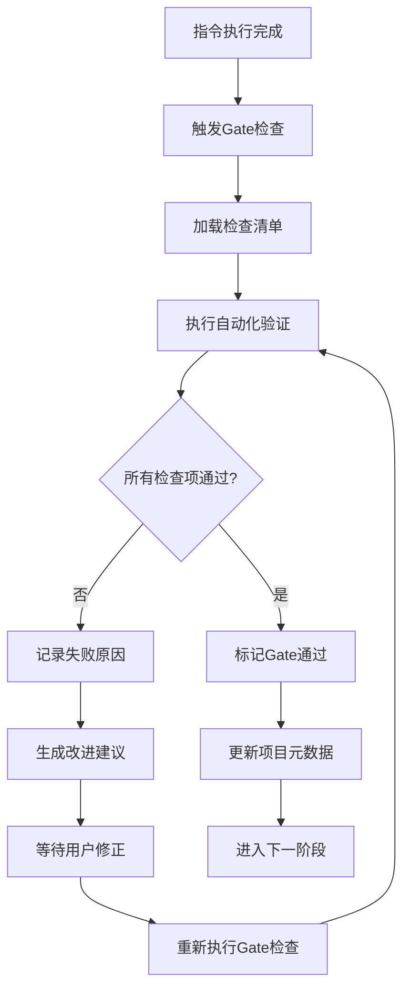
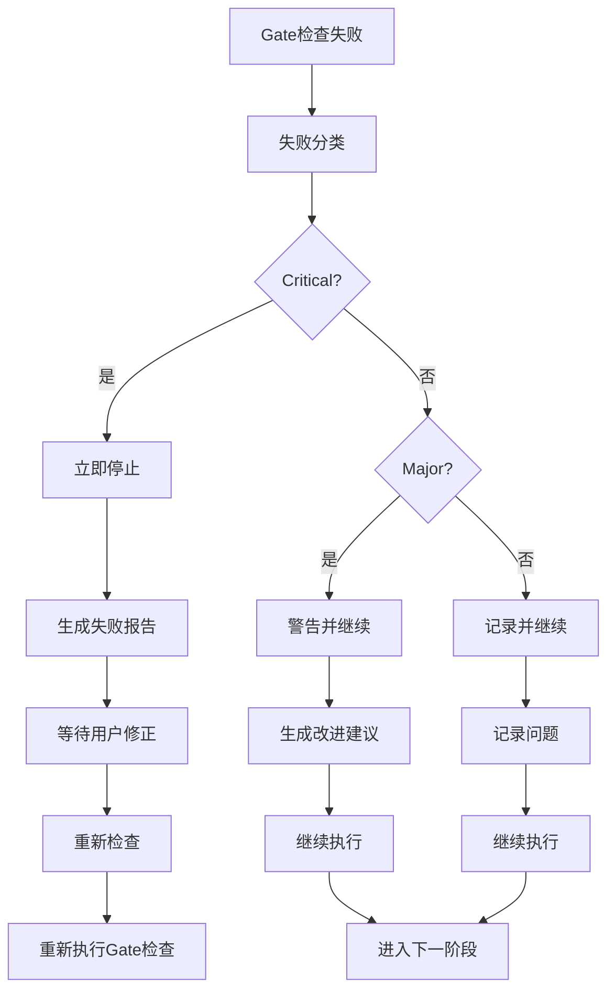

# PowerBy 质量门禁和验证机制

**版本**: v2.0.0
**设计日期**: 2025-12-18
**最后更新**: 2025-12-19
**基于**: PowerBy指令流程架构 + Spec-kit约束机制
**更新说明**: v2.0.0 - MVP精简优化：移除非功能性属性扫描，专注于MVP核心质量保证

---

## 一、质量门禁系统概述

### 1.1 设计理念

PowerBy质量门禁系统借鉴spec-kit的Constitution Gates理念，为每个阶段设计严格的验收标准，确保：

1. **阶段完整性**：每个阶段都必须完成所有必要工作
2. **质量保证**：输出质量符合预期标准
3. **流程闭环**：确保信息传递的完整性和一致性
4. **风险控制**：及早发现并解决问题

### 1.2 门禁分类

PowerBy质量门禁系统分为两大类：

#### A. 阶段门禁（Phase Gates）
- Gate 0 - Gate 7：对应P0-P7 MVP核心阶段
- 确保前置条件满足和输出质量合格
- Gate 8 (可选)：运维交付流程，独立于MVP开发

#### B. 专项门禁（Special Gates）
- Constitution Gates：架构原则检查
- Security Gates：安全检查
- Performance Gates：性能检查
- Quality Gates：代码质量检查

### 1.3 门禁检查原则

1. **强制性**：所有门禁都必须通过才能进入下一阶段
2. **可验证性**：每个检查项都必须有明确的验证方法
3. **文档化**：所有检查结果都必须记录在案
4. **可追溯性**：检查结果必须能够追溯到具体的文档或代码

---

## 二、阶段门禁详细设计

### 2.1 Gate 0: 项目初始化检查（P0→P1）

**对应阶段**: P0 - 项目初始化
**检查时机**: `/powerby.initialize` 指令完成后
**检查目标**: 确保项目基础设施完整

#### 检查清单

**项目宪章完整性**
- [ ] 项目宪章文件存在 (`docs/constitution.md`)
- [ ] 宪章包含核心理念章节（零假设原则、MVP优先等）
- [ ] 宪章包含技术标准章节（SOLID、DRY、KISS等）
- [ ] 宪章包含工作流程规范
- [ ] 宪章包含质量门禁机制
- [ ] 宪章包含项目特定配置

**目录结构规范性**
- [ ] `.powerby/` 目录存在
- [ ] `docs/` 目录存在
- [ ] `docs/iterations/` 目录存在
- [ ] `templates/` 目录存在
- [ ] 目录结构符合PowerBy规范

**Git仓库初始化状态**
- [ ] Git仓库已初始化
- [ ] `.git/` 目录存在
- [ ] 初始提交已创建
- [ ] `.gitignore` 文件已创建

**元数据文件创建**
- [ ] `.powerby/project.json` 文件存在
- [ ] 项目元数据格式正确（JSON）
- [ ] 包含必需字段（name, description, version, phase, status）
- [ ] 包含可选字段（team, techStack等）

#### 验证方法

**自动化验证**：
```bash
# 检查文件存在
ls -la docs/constitution.md
ls -la .powerby/project.json

# 检查JSON格式
cat .powerby/project.json | jq .

# 检查Git仓库
git rev-parse --git-dir
```

**手动验证**：
- 检查项目宪章内容完整性
- 检查目录结构规范性
- 检查Git提交历史

#### 失败处理

如果Gate 0检查失败：

1. **记录失败原因**：
   ```markdown
   ## Gate 0 检查失败报告

   **失败时间**: YYYY-MM-DD HH:MM:SS
   **失败项目**: [项目名称]
   **失败原因**:
   - [ ] 项目宪章文件不存在
   - [ ] 目录结构不符合规范
   - [ ] Git仓库未初始化

   **建议解决方案**:
   - 运行 /powerby.initialize 重新初始化项目
   - 检查磁盘空间和权限
   ```

2. **重新执行初始化**：
   ```bash
   /powerby.initialize [项目名称] [项目描述]
   ```

3. **重新检查**：
   ```bash
   # 重新运行Gate 0检查
   ```

---

### 2.2 Gate 1: MVP需求定稿（P1→P3）

**对应阶段**: P1 - 需求定义+澄清（融合原P1+P2）
**检查时机**: `/powerby.define` 指令完成后
**检查目标**: 确保MVP需求定稿，专注核心价值，避免过度工程化

#### 检查清单

**MVP核心价值定义**
- [ ] MVP核心价值已用一句话定义
- [ ] 核心价值描述清晰、简洁
- [ ] 核心价值与产品想法一致
- [ ] 核心价值可测试、可验证

**功能点优先级标记**
- [ ] 所有功能点已标记优先级([P0]/[P1]/[P2])
- [ ] P0功能点数量 ≤ 10个
- [ ] P1功能点数量合理（≤20个）
- [ ] P2功能点数量合理（≤30个）
- [ ] 优先级标记格式正确

**范围边界明确性**
- [ ] In-Scope范围已明确列出
- [ ] Out-of-Scope范围已明确列出
- [ ] 范围边界清晰、无歧义
- [ ] 范围边界与MVP核心价值一致

**决策方案完整性**
- [ ] 待决策清单中每项都有2+可行方案
- [ ] 每个方案都有清晰的描述
- [ ] 每个方案都有优缺点分析
- [ ] 有明确的推荐方案和理由

**文档完整性**
- [ ] PRD文档存在且格式正确
- [ ] 功能点清单存在且格式正确
- [ ] 文档内容完整、结构清晰
- [ ] 文档路径符合规范

#### 验证方法

**自动化验证**：
```bash
# 检查文件存在
ls -la docs/iterations/*/prd.md
ls -la docs/iterations/*/function-points.md

# 检查JSON格式（如适用）
cat docs/iterations/*/function-points.json | jq .

# 检查功能点数量
grep -c "P0" docs/iterations/*/function-points.md
```

**手动验证**：
- 检查MVP核心价值定义
- 检查功能点优先级标记
- 检查范围边界明确性
- 检查决策方案完整性

#### 失败处理

如果Gate 1检查失败：

1. **记录失败原因**：
   ```markdown
   ## Gate 1 检查失败报告

   **失败时间**: YYYY-MM-DD HH:MM:SS
   **失败项目**: [项目名称]
   **迭代编号**: [迭代编号]
   **失败原因**:
   - [ ] MVP核心价值未定义
   - [ ] P0功能点数量超过10个
   - [ ] 待决策清单中某项缺少可行方案

   **建议解决方案**:
   - 重新定义MVP核心价值
   - 削减P0功能点数量
   - 完善待决策清单
   ```

2. **重新执行需求定义**：
   ```bash
   /powerby.define [产品想法]
   ```

3. **重新检查**：
   ```bash
   # 重新运行Gate 1检查
   ```

---

### 2.3 Gate 3: 技术调研完整性检查（P3→P4）

**对应阶段**: P3 - 技术调研
**检查时机**: `/powerby.design` 指令P3阶段完成后
**检查目标**: 确保技术调研充分且可行

#### 检查清单

**P0功能技术可行性评估**
- [ ] 所有P0功能的技术可行性已评估
- [ ] 每个P0功能都有技术实现方案
- [ ] 技术方案可行性已验证
- [ ] 技术风险已识别

**核心技术选型决策**
- [ ] 核心技术选型已完成决策
- [ ] 每个技术选型都有至少1个备选方案
- [ ] 技术选型有充分的理由说明
- [ ] 技术选型符合项目需求

**关键技术风险识别**
- [ ] 关键技术风险已识别并记录
- [ ] 每个风险都有缓解措施
- [ ] 风险评估合理、准确
- [ ] 风险应对策略明确

**技术调研报告结构完整性**
- [ ] 技术调研报告存在且格式正确
- [ ] 报告包含所有必需章节
- [ ] 报告内容完整、结构清晰
- [ ] 报告路径符合规范

#### 验证方法

**自动化验证**：
```bash
# 检查文件存在
ls -la docs/iterations/*/technical-research.md

# 检查P0功能覆盖
grep -c "P0" docs/iterations/*/technical-research.md

# 检查决策点数量
grep -c "决策点" docs/iterations/*/technical-research.md
```

**手动验证**：
- 检查P0功能技术可行性评估
- 检查核心技术选型决策
- 检查关键技术风险识别
- 检查技术调研报告结构完整性

#### 失败处理

如果Gate 3检查失败：

1. **记录失败原因**：
   ```markdown
   ## Gate 3 检查失败报告

   **失败时间**: YYYY-MM-DD HH:MM:SS
   **失败项目**: [项目名称]
   **迭代编号**: [迭代编号]
   **失败原因**:
   - [ ] 部分P0功能的技术可行性未评估
   - [ ] 核心技术选型缺少备选方案
   - [ ] 关键技术风险未识别

   **建议解决方案**:
   - 完善P0功能的技术可行性评估
   - 为技术选型提供备选方案
   - 识别并记录关键技术风险
   ```

2. **重新执行技术调研**：
   ```bash
   /powerby.design
   ```

3. **重新检查**：
   ```bash
   # 重新运行Gate 3检查
   ```

---

### 2.4 Gate 4: 架构方案评审（P4→P5）

**对应阶段**: P4 - 架构设计
**检查时机**: `/powerby.design` 指令P4阶段完成后
**检查目标**: 确保架构设计清晰且可行

#### 检查清单

**架构图清晰性**
- [ ] 架构图清晰表达了系统结构
- [ ] 架构图使用标准格式（Mermaid）
- [ ] 架构图包含所有核心组件
- [ ] 架构图包含组件间关系
- [ ] 架构图易于理解和解释

**组件职责明确性**
- [ ] 每个组件的职责明确
- [ ] 组件职责与需求对应
- [ ] 组件职责无重叠、无遗漏
- [ ] 组件职责可测试、可验证

**组件与需求映射**
- [ ] 每个组件都有对应的需求映射
- [ ] 需求映射清晰、准确
- [ ] 无未映射的需求
- [ ] 无未映射的组件
- [ ] 映射关系可追溯

**技术决策记录完整性**
- [ ] 所有关键技术决策已完成并记录
- [ ] 每个决策都有明确理由
- [ ] 每个决策都有风险评估
- [ ] 每个决策都有影响分析

**非功能需求考虑**
- [ ] 性能需求已考虑并有应对方案
- [ ] 安全需求已考虑并有应对方案
- [ ] 可靠性需求已考虑并有应对方案
- [ ] 可扩展性需求已考虑并有应对方案

#### 验证方法

**自动化验证**：
```bash
# 检查文件存在
ls -la docs/iterations/*/architecture.md

# 检查架构图存在
grep -c "mermaid" docs/iterations/*/architecture.md

# 检查组件映射
grep -c "组件与需求映射" docs/iterations/*/architecture.md
```

**手动验证**：
- 检查架构图清晰性
- 检查组件职责明确性
- 检查组件与需求映射
- 检查技术决策记录完整性
- 检查非功能需求考虑

#### 失败处理

如果Gate 4检查失败：

1. **记录失败原因**：
   ```markdown
   ## Gate 4 检查失败报告

   **失败时间**: YYYY-MM-DD HH:MM:SS
   **失败项目**: [项目名称]
   **迭代编号**: [迭代编号]
   **失败原因**:
   - [ ] 架构图无法清晰表达系统结构
   - [ ] 部分组件没有对应的需求映射
   - [ ] 非功能需求未考虑

   **建议解决方案**:
   - 重新设计架构图，确保清晰性
   - 为每个组件建立需求映射
   - 补充非功能需求考虑
   ```

2. **重新执行架构设计**：
   ```bash
   /powerby.design
   ```

3. **重新检查**：
   ```bash
   # 重新运行Gate 4检查
   ```

---

### 2.5 Gate 5: 开发规划完整性检查（P5→P6）

**对应阶段**: P5 - 开发规划
**检查时机**: `/powerby.implement` 指令P5阶段完成后
**检查目标**: 确保开发规划详细且可行

#### 检查清单

**P0功能任务覆盖**
- [ ] 所有P0功能都有对应的开发任务
- [ ] 每个P0功能的任务列表完整
- [ ] 任务与功能对应关系清晰
- [ ] 无未分配任务的P0功能

**任务分解粒度合适**
- [ ] 任务分解粒度合适（1-2天可完成）
- [ ] 大任务已拆分为小任务
- [ ] 任务描述具体、可执行
- [ ] 任务边界清晰、无重叠

**依赖关系清晰性**
- [ ] 依赖关系清晰合理
- [ ] 依赖关系已记录并可视化
- [ ] 无循环依赖
- [ ] 并行任务已标识[P]

**验收标准可验证性**
- [ ] 每个任务都有明确的验收标准
- [ ] 验收标准可测试、可验证
- [ ] 验收标准具体、可量化
- [ ] 验收标准与需求一致

**工作量估算合理性**
- [ ] 工作量估算合理
- [ ] 估算基于实际经验
- [ ] 估算包含测试和文档时间
- [ ] 估算有缓冲时间

#### 验证方法

**自动化验证**：
```bash
# 检查文件存在
ls -la docs/iterations/*/tasks.md

# 检查任务数量
grep -c "TASK-" docs/iterations/*/tasks.md

# 检查P0任务覆盖
grep -c "P0" docs/iterations/*/tasks.md

# 检查并行任务
grep -c "\[P\]" docs/iterations/*/tasks.md
```

**手动验证**：
- 检查P0功能任务覆盖
- 检查任务分解粒度合适性
- 检查依赖关系清晰性
- 检查验收标准可验证性
- 检查工作量估算合理性

#### 失败处理

如果Gate 5检查失败：

1. **记录失败原因**：
   ```markdown
   ## Gate 5 检查失败报告

   **失败时间**: YYYY-MM-DD HH:MM:SS
   **失败项目**: [项目名称]
   **迭代编号**: [迭代编号]
   **失败原因**:
   - [ ] 部分P0功能没有对应的开发任务
   - [ ] 任务分解粒度过大（超过2天）
   - [ ] 依赖关系不清晰

   **建议解决方案**:
   - 为所有P0功能分配开发任务
   - 重新分解大任务，确保粒度合适
   - 明确任务依赖关系
   ```

2. **重新执行开发规划**：
   ```bash
   /powerby.implement
   ```

3. **重新检查**：
   ```bash
   # 重新运行Gate 5检查
   ```

---

### 2.6 Gate 6: 开发完成度检查（P6→P7）

**对应阶段**: P6 - 开发实现
**检查时机**: `/powerby.implement` 指令P6阶段完成后
**检查目标**: 确保开发实现完整且质量达标

#### 检查清单

**P0任务完成状态**
- [ ] 所有P0任务已完成
- [ ] 任务状态准确反映实际进度
- [ ] 任务完成质量符合预期
- [ ] 任务完成时间合理

**测试用例通过率**
- [ ] 测试用例全部通过
- [ ] 测试用例覆盖所有P0功能
- [ ] 测试用例覆盖所有关键路径
- [ ] 测试用例质量符合标准

**测试覆盖率达标**
- [ ] 测试覆盖率达标（≥80%）
- [ ] 单元测试覆盖率达标（≥80%）
- [ ] 集成测试覆盖率达标（≥60%）
- [ ] 端到端测试覆盖率达标（≥40%）

**代码质量检查**
- [ ] 代码通过Linter检查
- [ ] 代码符合项目编码规范
- [ ] 代码复杂度合理
- [ ] 代码重复率低于10%

**安全漏洞检查**
- [ ] 无严重安全漏洞
- [ ] 无高危安全漏洞
- [ ] 中危安全漏洞已修复或评估
- [ ] 安全扫描已通过

**可追溯性矩阵完整性**
- [ ] 可追溯性矩阵完整
- [ ] 任务项与需求点对应
- [ ] 架构组件与需求对应
- [ ] 测试用例与需求对应

#### 验证方法

**自动化验证**：
```bash
# 检查文件存在
ls -la docs/iterations/*/implementation-report.md

# 运行测试
npm test
# 或
pytest

# 检查测试覆盖率
npm run coverage
# 或
pytest --cov

# 检查代码质量
npm run lint
# 或
flake8

# 检查安全漏洞
npm audit
# 或
safety check
```

**手动验证**：
- 检查P0任务完成状态
- 检查测试用例通过率
- 检查测试覆盖率达标
- 检查代码质量检查
- 检查安全漏洞检查
- 检查可追溯性矩阵完整性

#### 失败处理

如果Gate 6检查失败：

1. **记录失败原因**：
   ```markdown
   ## Gate 6 检查失败报告

   **失败时间**: YYYY-MM-DD HH:MM:SS
   **失败项目**: [项目名称]
   **迭代编号**: [迭代编号]
   **失败原因**:
   - [ ] 部分P0任务未完成
   - [ ] 测试覆盖率低于80%
   - [ ] 代码未通过Linter检查

   **建议解决方案**:
   - 完成剩余的P0任务
   - 补充测试用例，提高覆盖率
   - 修复代码质量问题
   ```

2. **继续开发实现**：
   ```bash
   /powerby.implement
   ```

3. **重新检查**：
   ```bash
   # 重新运行Gate 6检查
   ```

---

### 2.7 Gate 7: 代码审查完整性检查（P7→MVP完成）

**对应阶段**: P7 - 代码审查
**检查时机**: `/powerby.review` 指令P7阶段完成后
**检查目标**: 确保MVP代码审查严格且全面，完成MVP开发流程

#### 检查清单

**5大类审计项完成**
- [ ] 一致性与范围审计已完成
- [ ] 实现完整性与真实性审计已完成
- [ ] 设计哲学与代码质量审计已完成
- [ ] 测试与健壮性审计已完成
- [ ] 提交质量审计已完成

**功能点一致性验证完成**
- [ ] 功能点一致性验证已完成
- [ ] 所有P0功能点的验收标准都已满足
- [ ] 功能点与代码实现一致
- [ ] 功能点清单已更新

**最终结论明确性**
- [ ] 最终结论明确（APPROVED或CHANGES REQUESTED）
- [ ] 结论有充分的依据和理由
- [ ] 结论符合审查标准
- [ ] 结论已记录在案

**可追溯性矩阵验证完成**
- [ ] 可追溯性矩阵验证完成
- [ ] 任务项与需求点对应
- [ ] 架构组件与需求对应
- [ ] 测试用例与需求对应
- [ ] 代码实现与需求对应

**功能验收方案提供**
- [ ] 功能验收方案已提供
- [ ] 验收方案具体、可执行
- [ ] 验收方案覆盖所有P0功能
- [ ] 验收方案有明确的成功标准

#### 验证方法

**自动化验证**：
```bash
# 检查文件存在
ls -la docs/iterations/*/code-review-report.md

# 检查审计项数量
grep -c "审计" docs/iterations/*/code-review-report.md

# 检查结论明确性
grep -c "APPROVED\|CHANGES REQUESTED" docs/iterations/*/code-review-report.md
```

**手动验证**：
- 检查5大类审计项完成
- 检查功能点一致性验证完成
- 检查最终结论明确性
- 检查可追溯性矩阵验证完成
- 检查功能验收方案提供

#### 失败处理

如果Gate 7检查失败：

1. **记录失败原因**：
   ```markdown
   ## Gate 7 检查失败报告

   **失败时间**: YYYY-MM-DD HH:MM:SS
   **失败项目**: [项目名称]
   **迭代编号**: [迭代编号]
   **失败原因**:
   - [ ] 5大类审计项未全部完成
   - [ ] 最终结论不明确
   - [ ] 可追溯性矩阵验证未完成

   **建议解决方案**:
   - 完成缺失的审计项
   - 明确最终结论
   - 完成可追溯性矩阵验证
   ```

2. **继续代码审查**：
   ```bash
   /powerby.review
   ```

3. **重新检查**：
   ```bash
   # 重新运行Gate 7检查
   ```

---

### 2.8 Gate 8 (可选): 运维交付验收检查（P8→完成）

> **说明**: Gate 8属于运维流程，独立于MVP开发流程。在MVP验证成功后再进行。

**对应阶段**: P8 - 运维交付（可选）
**检查时机**: 运维交付完成后
**检查目标**: 确保运维交付完整且MVP可以稳定运行

#### 检查清单

**运维交付清单**
- [ ] 代码交付完成
- [ ] 文档交付完成
- [ ] 部署交付完成
- [ ] 监控配置完成
- [ ] 日志配置完成

**部署流程验证**
- [ ] 部署流程已验证
- [ ] 部署脚本可用
- [ ] 部署环境配置正确
- [ ] 部署后功能正常

**监控和日志配置**
- [ ] 监控配置完成
- [ ] 日志配置完成
- [ ] 告警配置完成
- [ ] 监控和日志可用

#### 验证方法

**自动化验证**：
```bash
# 检查文件存在
ls -la docs/iterations/*/delivery-report.md

# 检查代码合并
git branch --merged main

# 检查部署流程
./deploy.sh --dry-run

# 检查监控配置
curl -f http://localhost:9090/api/v1/query
```

**手动验证**：
- 检查交付物清单完成
- 检查P0功能实现验证
- 检查代码合并状态
- 检查文档完整性
- 检查部署流程验证
- 检查监控和日志配置

#### 失败处理

如果Gate 8检查失败：

1. **记录失败原因**：
   ```markdown
   ## Gate 8 检查失败报告

   **失败时间**: YYYY-MM-DD HH:MM:SS
   **失败项目**: [项目名称]
   **迭代编号**: [迭代编号]
   **失败原因**:
   - [ ] 部分交付物未完成
   - [ ] 代码未合并到主干分支
   - [ ] 部署流程未验证

   **建议解决方案**:
   - 完成剩余的交付物
   - 合并代码到主干分支
   - 验证部署流程
   ```

2. **继续项目交付**：
   ```bash
   /powerby.review
   ```

3. **重新检查**：
   ```bash
   # 重新运行Gate 8检查
   ```

---

## 三、专项门禁详细设计

### 3.1 Constitution Gates

**目的**: 确保架构设计符合PowerBy核心原则

#### Gate C1: Simplicity Gate

**检查内容**:
- [ ] 使用 ≤ 3个项目？
- [ ] 无过度工程？
- [ ] 无未来-proofing？
- [ ] 解决方案简单、直接？

**验证方法**:
```markdown
1. 统计项目数量
2. 检查是否有过度工程
3. 检查是否有未来-proofing
4. 评估解决方案复杂度
```

#### Gate C2: Anti-Abstraction Gate

**检查内容**:
- [ ] 使用框架直接？
- [ ] 单一模型表示？
- [ ] 无过早抽象？
- [ ] 无过度设计？

**验证方法**:
```markdown
1. 检查框架使用情况
2. 检查模型表示
3. 检查抽象层级
4. 检查设计复杂度
```

#### Gate C3: Integration-First Gate

**检查内容**:
- [ ] 优先考虑集成？
- [ ] 集成点清晰？
- [ ] 集成测试完整？
- [ ] 集成风险可控？

**验证方法**:
```markdown
1. 检查集成优先级
2. 检查集成点定义
3. 检查集成测试
4. 检查集成风险评估
```

### 3.2 Security Gates

**目的**: 确保系统安全符合标准

#### Gate S1: Authentication & Authorization

**检查内容**:
- [ ] 认证机制完整？
- [ ] 授权机制正确？
- [ ] 会话管理安全？
- [ ] 权限控制严格？

**验证方法**:
```markdown
1. 测试认证流程
2. 测试授权流程
3. 检查会话管理
4. 检查权限控制
```

#### Gate S2: Data Protection

**检查内容**:
- [ ] 数据加密完整？
- [ ] 敏感数据保护？
- [ ] 数据传输安全？
- [ ] 数据存储安全？

**验证方法**:
```markdown
1. 检查数据加密
2. 检查敏感数据处理
3. 检查数据传输
4. 检查数据存储
```

#### Gate S3: Input Validation

**检查内容**:
- [ ] 输入验证完整？
- [ ] 输出编码正确？
- [ ] SQL注入防护？
- [ ] XSS防护？

**验证方法**:
```markdown
1. 测试输入验证
2. 测试输出编码
3. 测试SQL注入
4. 测试XSS攻击
```

### 3.3 Performance Gates

**目的**: 确保系统性能符合要求

#### Gate P1: Response Time

**检查内容**:
- [ ] API响应时间 < 200ms？
- [ ] 页面加载时间 < 2s？
- [ ] 数据库查询时间 < 100ms？
- [ ] 缓存命中率 > 80%？

**验证方法**:
```markdown
1. 测量API响应时间
2. 测量页面加载时间
3. 测量数据库查询时间
4. 测量缓存命中率
```

#### Gate P2: Throughput

**检查内容**:
- [ ] 支持1000并发用户？
- [ ] 支持10000请求/分钟？
- [ ] 支持100000数据记录？
- [ ] 支持水平扩展？

**验证方法**:
```markdown
1. 进行并发测试
2. 进行负载测试
3. 进行压力测试
4. 测试水平扩展
```

#### Gate P3: Resource Usage

**检查内容**:
- [ ] CPU使用率 < 80%？
- [ ] 内存使用率 < 80%？
- [ ] 磁盘使用率 < 80%？
- [ ] 网络带宽合理？

**验证方法**:
```markdown
1. 监控CPU使用率
2. 监控内存使用率
3. 监控磁盘使用率
4. 监控网络带宽
```

---

## 四、门禁执行机制

### 4.1 门禁检查流程



### 4.2 门禁检查工具

**自动化检查工具**:
- 文件存在性检查
- JSON格式验证
- Git状态检查
- 测试覆盖率检查
- 代码质量检查
- 安全漏洞检查

**手动检查工具**:
- 文档内容检查
- 代码质量检查
- 功能验收检查
- 用户体验检查

### 4.3 门禁检查报告

**Gate检查报告模板**:
```markdown
# Gate {n} 检查报告

**检查时间**: YYYY-MM-DD HH:MM:SS
**检查项目**: [项目名称]
**迭代编号**: [迭代编号]
**Gate状态**: [通过/失败]

## 检查清单

| 检查项 | 状态 | 备注 |
|-------|------|------|
| 检查项1 | ✅ 通过 | - |
| 检查项2 | ❌ 失败 | 原因说明 |
| 检查项3 | ✅ 通过 | - |

## 检查结果

**通过率**: X%
**失败项数**: X
**建议**: [改进建议]

## 后续行动

- [ ] 修正失败项
- [ ] 重新执行Gate检查
- [ ] 进入下一阶段
```

---

## 五、门禁失败处理机制

### 5.1 失败分类

**Critical（严重）**:
- 影响核心功能
- 存在安全风险
- 违反架构原则

**Major（主要）**:
- 影响非核心功能
- 存在性能问题
- 违反编码规范

**Minor（次要）**:
- 不影响功能
- 代码风格问题
- 文档不完整

### 5.2 失败处理流程



### 5.3 失败报告模板

```markdown
# Gate {n} 失败报告

**失败时间**: YYYY-MM-DD HH:MM:SS
**失败项目**: [项目名称]
**迭代编号**: [迭代编号]
**失败类型**: [Critical/Major/Minor]

## 失败详情

### 失败项1
- **检查项**: [检查项名称]
- **期望结果**: [期望结果]
- **实际结果**: [实际结果]
- **失败原因**: [失败原因]
- **影响范围**: [影响范围]
- **修复建议**: [修复建议]

### 失败项2
[同样结构...]

## 改进建议

1. **短期改进**:
   - [改进项1]
   - [改进项2]

2. **长期改进**:
   - [改进项1]
   - [改进项2]

## 后续行动

- [ ] 修正失败项
- [ ] 重新执行Gate检查
- [ ] 进入下一阶段
```

---

## 六、门禁指标和监控

### 6.1 门禁指标

**通过率指标**:
- Gate 0通过率: X%
- Gate 1通过率: X%
- ...
- Gate 8通过率: X%

**失败原因统计**:
- 文档问题: X%
- 代码质量问题: X%
- 测试问题: X%
- 安全问题: X%

**检查效率**:
- 平均检查时间: X分钟
- 检查覆盖率: X%
- 自动化检查比例: X%

### 6.2 监控仪表板


### 6.3 持续改进

**改进流程**:
1. 收集门禁指标
2. 分析失败原因
3. 识别改进机会
4. 优化门禁检查
5. 更新检查清单

---

## 七、总结

PowerBy质量门禁和验证机制通过借鉴spec-kit的成功经验，建立了完整的质量保障体系，确保：

1. **阶段完整性**：每个阶段都必须完成所有必要工作
2. **质量保证**：输出质量符合预期标准
3. **流程闭环**：确保信息传递的完整性和一致性
4. **风险控制**：及早发现并解决问题

通过这套质量门禁系统，PowerBy-skills能够将松散的对话式开发流程转化为结构化的开发流水线，提高开发效率和交付质量。
