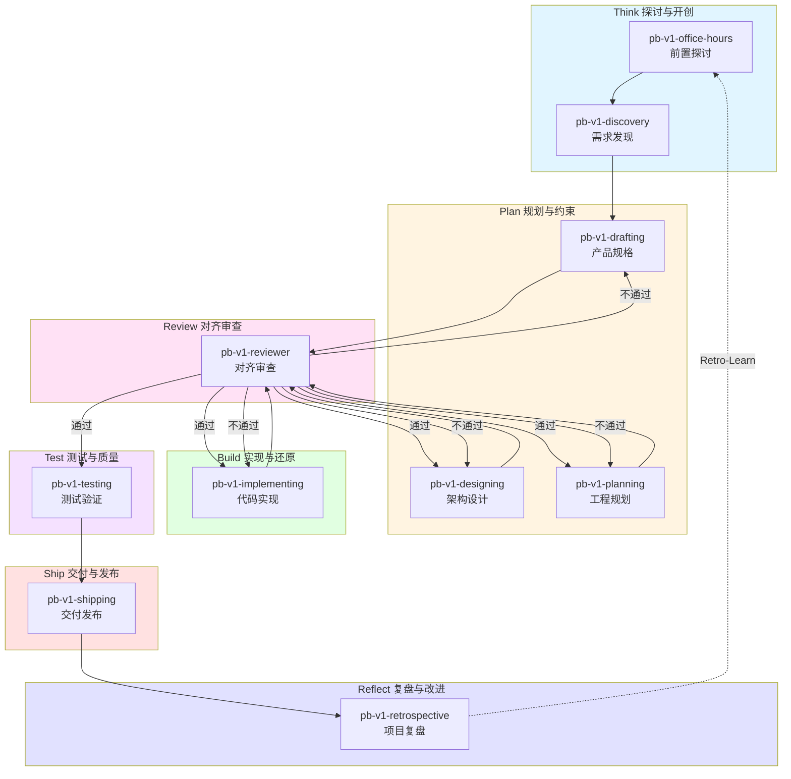
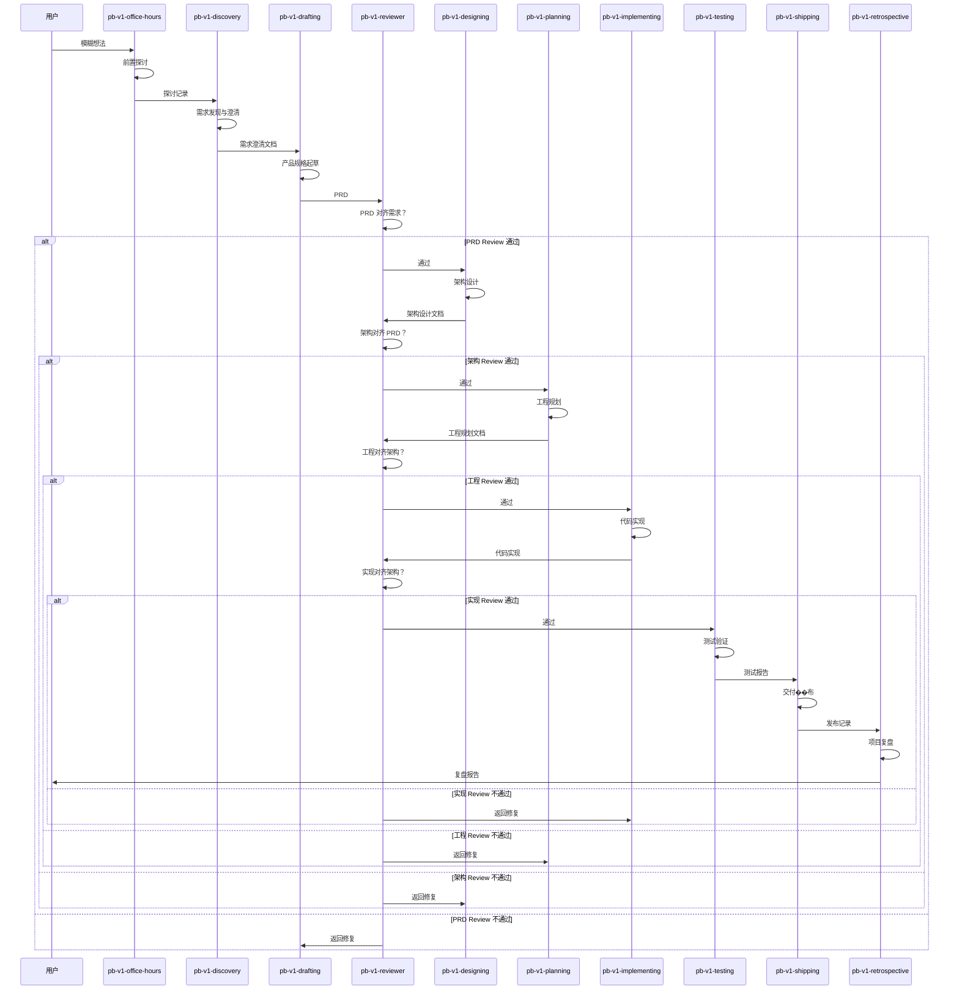
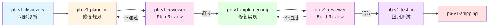
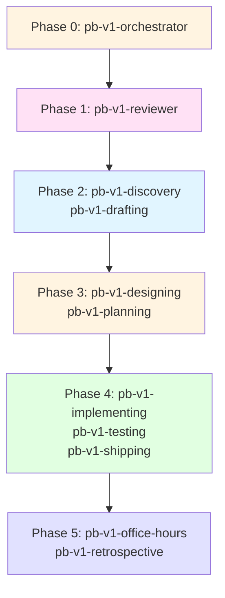

# PowerBy v1 核心 Skill 清单（原子化版）

**版本**: 3.0.0  
**日期**: 2026-04-01  
**状态**: 设计完成

---

## 核心理念

### 原子化原则

**每个 Skill 只做一件事**。编排和组合是流程的职责，不是 Skill 的职责。

- 一个 Skill = 一个原子功能
- Skill 之间通过输入/输出协议连接
- 流程决定 Skill 的编排顺序
- Skill 不感知自己在哪个流程中被调用

### 执行是约束还原的过程

问题应该尽早发现解决，越早发现成本越小。每次交付前必须 Review，确保产物与目标对齐还原。

---

## 1. 原子 Skill 全景图



---

## 2. 原子 Skill 详细定义

### 2.1 pb-v1-office-hours

**原子功能**: 前置探讨  
**阶段**: Think  
**单一职责**: 探讨目标、验证方向、挑战前提

| 项目 | 内容 |
|------|------|
| 输入 | 用户的模糊想法或需求描述 |
| 输出 | 探讨记录（目标共识、方向验证、前提挑战结果） |
| 下游 | pb-v1-discovery |

#### 做什么
- 与用户探讨产品目标和成功标准
- 挑战前提假设，验证方向可行性
- 输出探讨记录，形成初步方向共识

#### 不做什么
- 不写 PRD（交给 pb-v1-drafting）
- 不做需求澄清（交给 pb-v1-discovery）
- 不做任何设计和实现

---

### 2.2 pb-v1-discovery

**原子功能**: 需求发现与澄清  
**阶段**: Think  
**单一职责**: 收集、澄清、确认需求

| 项目 | 内容 |
|------|------|
| 输入 | 探讨记录（来自 pb-v1-office-hours）或用户直接需求 |
| 输出 | 需求澄清文档（明确的需求列表、边界定义、约束条件） |
| 下游 | pb-v1-drafting |

#### 做什么
- 收集和整理需求
- 澄清模糊需求，消除歧义
- 定义 Feature List 边界（In-Scope / Out-of-Scope）
- 识别约束条件和依赖关系

#### 不做什么
- 不探讨方向（交给 pb-v1-office-hours）
- 不写 PRD（交给 pb-v1-drafting）
- 不做任何设计和实现

---

### 2.3 pb-v1-drafting

**原子功能**: 产品规格起草  
**阶段**: Plan  
**单一职责**: 将需求转化为产品规格文档（PRD）

| 项目 | 内容 |
|------|------|
| 输入 | 需求澄清文档（来自 pb-v1-discovery） |
| 输出 | PRD（产品规格文档，包含功能规格、验收标准） |
| 下游 | pb-v1-reviewer → pb-v1-designing |

#### 做什么
- 将需求转化为结构化的产品规格
- 定义功能规格和验收标准
- 明确 MVP 范围和优先级

#### 不做什么
- 不做需求探讨（交给 pb-v1-office-hours / pb-v1-discovery）
- 不做架构设计（交给 pb-v1-designing）
- 不做技术选型（交给 pb-v1-designing）

---

### 2.4 pb-v1-designing

**原子功能**: 架构设计  
**阶段**: Plan  
**单一职责**: 将 PRD 转化为技术架构设计

| 项目 | 内容 |
|------|------|
| 输入 | PRD（来自 pb-v1-drafting，经过 pb-v1-reviewer 审查） |
| 输出 | 架构设计文档（技术选型、模块划分、接口定义） |
| 下游 | pb-v1-reviewer → pb-v1-planning |

#### 做什么
- 将 PRD 转化为技术架构设计
- 技术选型（应用 Constitution Gates）
- 验证技术可行性
- 定义模块划分和接口

#### 不做什么
- 不做需求定义（交给 pb-v1-drafting）
- 不做工程规划（交给 pb-v1-planning）
- 不做代码实现（交给 pb-v1-implementing）

---

### 2.5 pb-v1-planning

**原子功能**: 工程规划  
**阶段**: Plan  
**单一职责**: 将架构设计拆解为可执行的工程任务

| 项目 | 内容 |
|------|------|
| 输入 | 架构设计文档（来自 pb-v1-designing，经过 pb-v1-reviewer 审查） |
| 输出 | 工程规划文档（任务拆解、实现顺序、技术方案） |
| 下游 | pb-v1-reviewer → pb-v1-implementing |

#### 做什么
- 将架构设计拆解为可执行的工程任务
- 定义实现顺序和依赖关系
- 制定技术方案和实现细节

#### 不做什么
- 不做架构设计（交给 pb-v1-designing）
- 不做代码实现（交给 pb-v1-implementing）
- 不做需求定义（交给 pb-v1-drafting）

---

### 2.6 pb-v1-reviewer

**原子功能**: 对齐审查  
**阶段**: Review（贯穿全流程）  
**单一职责**: 验证产物与目标的对齐还原

| 项目 | 内容 |
|------|------|
| 输入 | 本轮产物 + 上轮产物（作为对齐基准） |
| 输出 | Review 报告（通过/不通过 + 具体问题） |
| 下游 | 通过 → 下一个 Skill；不通过 → 返回当前 Skill |

#### 做什么
- **PRD Review**: PRD 是否对齐还原需求
- **架构 Review**: 架构是否对齐还原 PRD
- **工程 Review**: 工程规划是否对齐还原架构
- **实现 Review**: 代码实现是否对齐还原架构
- **上轮产出 Review**: 确保上轮产出本身经过验证
- **用户主动触发 Review**: 随时可调用

#### 不做什么
- 不做需求定义
- 不做架构设计
- 不做工程规划
- 不做代码实现

#### Review 对齐矩阵

| 触发点 | 本轮产物 | 对齐基准 | 审查内容 |
|-------|---------|---------|---------|
| PRD 完成后 | PRD | 需求澄清文档 | PRD 是否对齐还原需求 |
| 架构完成后 | 架构设计 | PRD | 架构是否对齐还原 PRD |
| 工程规划完成后 | 工程规划 | 架构设��� | 工程是否对齐还原架构 |
| 代码实现完成后 | 代码实现 | 架构设计 | 实现是否对齐还原架构 |

---

### 2.7 pb-v1-implementing

**原子功能**: 代码实现  
**阶段**: Build  
**单一职责**: 基于工程规划还原为高质量代码

| 项目 | 内容 |
|------|------|
| 输入 | 工程规划文档（来自 pb-v1-planning，经过 pb-v1-reviewer 审查） |
| 输出 | 代码实现（可编译、可运行的代码） |
| 下游 | pb-v1-reviewer → pb-v1-testing |

#### 做什么
- 基于工程规划实现代码
- 确保代码可编译、可运行
- 遵循项目现有模式和规范

#### 不做什么
- 不做工程规划（交给 pb-v1-planning）
- 不做架构设计（交给 pb-v1-designing）
- 不做测试验证（交给 pb-v1-testing）

---

### 2.8 pb-v1-testing

**原子功能**: 测试验证  
**阶段**: Test  
**单一职责**: 通过测试验证功能正确性

| 项目 | 内容 |
|------|------|
| 输入 | 代码实现（来自 pb-v1-implementing，经过 pb-v1-reviewer 审查） |
| 输出 | 测试报告（测试结果、覆盖率、问题列表） |
| 下游 | pb-v1-shipping |

#### 做什么
- 编写和执行测试用例
- 验证功能正确性
- 生成测试报告

#### 不做什么
- 不做代码实现（交给 pb-v1-implementing）
- 不做代码审查（交给 pb-v1-reviewer）

---

### 2.9 pb-v1-shipping

**原子功能**: 交付发布  
**阶段**: Ship  
**单一职责**: 将代码交付到生产环境

| 项目 | 内容 |
|------|------|
| 输入 | 测试报告（来自 pb-v1-testing） |
| 输出 | 发布记录（版本号、变更日志、发布状态） |
| 下游 | pb-v1-retrospective |

#### 做什么
- 执行交付发布流程
- 生成发布记录和变更日志

#### 不做什么
- 不做测试验证（交给 pb-v1-testing）
- 不做代码实现（交给 pb-v1-implementing）

---

### 2.10 pb-v1-retrospective

**原子功能**: 项目复盘  
**阶段**: Reflect  
**单一职责**: 总结经验教训并持续改进

| 项目 | 内容 |
|------|------|
| 输入 | 发布记录 + 全流程产物 |
| 输出 | 复盘报告（经验教训、改进建议） |
| 下游 | - （Retro-Learn 循环回到 pb-v1-office-hours） |

#### 做什么
- 项目复盘，识别问题和亮点
- 提取经验教训
- 提出改进建议

#### 不做什么
- 不做 Review 审查（交给 pb-v1-reviewer）
- 不做需求/设计/实现

### 2.11 pb-v1-orchestrator

**原子功能**: 流程调度与编排  
**阶段**: 贯穿全流程  
**单一职责**: 维护流程状态，决策下一步调用哪个 Skill

| 项目 | 内容 |
|------|------|
| 输入 | 当前流程状态 + 上一个 Skill 的输出 |
| 输出 | 下一个 Skill 的调用指令 + 更新后的流程状态 |
| 下游 | 任意原子 Skill |

#### 做什么
- 维护流程状态（当前阶段、已完成的 Skill、待执行的 Skill）
- 根据流程类型（标准/快速/Bugfix）决定 Skill 调用顺序
- 根据 Review 结果决定是前进还是回退
- 处理用户主动触发的 Review 请求
- 记录流程执行日志

#### 不做什么
- 不执行任何具体的产品/架构/工程/实现工作
- 不做 Review 审查（交给 pb-v1-reviewer）
- 不修改任何产物内容

#### 调度决策逻辑

**标准流程调度**:
```
用户需求 → pb-v1-discovery → pb-v1-drafting → pb-v1-reviewer
  ↓ (PRD Review 通过)
pb-v1-designing → pb-v1-reviewer
  ↓ (架构 Review 通过)
pb-v1-planning → pb-v1-reviewer
  ↓ (工程 Review 通过)
pb-v1-implementing → pb-v1-reviewer
  ↓ (实现 Review 通过)
pb-v1-testing → pb-v1-shipping → pb-v1-retrospective
```

**Review 不通过时的回退逻辑**:
- PRD Review 不通过 → 返回 pb-v1-drafting
- 架构 Review 不通过 → 返回 pb-v1-designing
- 工程 Review 不通过 → 返回 pb-v1-planning
- 实现 Review 不通过 → 返回 pb-v1-implementing

**流程状态维护**:
```json
{
  "flow_type": "standard|quick|bugfix",
  "current_phase": "Think|Plan|Build|Test|Ship|Reflect",
  "current_skill": "pb-v1-discovery",
  "completed_skills": ["pb-v1-discovery"],
  "pending_skills": ["pb-v1-drafting", "pb-v1-reviewer", ...],
  "review_results": {
    "prd_review": "passed|failed|pending",
    "arch_review": "passed|failed|pending",
    "plan_review": "passed|failed|pending",
    "impl_review": "passed|failed|pending"
  },
  "artifacts": {
    "需求澄清文档": "path/to/discovery.md",
    "PRD": "path/to/prd.md",
    "架构设计": "path/to/architecture.md",
    ...
  }
}
```

---
---

## 3. 核心骨架 vs 可选 Skill

### 3.1 核心骨架定义

**核心骨架** = 流程无法跳过的环节。缺少任何一个，流程就断裂。

### 3.2 核心骨架 Skill（9 个）

```mermaid
graph TD
    ORC[pb-v1-orchestrator<br/>流程调度] --> DIS[pb-v1-discovery]
    DIS --> ORC
    ORC --> DRA[pb-v1-drafting]
    DRA --> ORC
    ORC --> REV1[pb-v1-reviewer]
    REV1 --> ORC
    ORC --> DES[pb-v1-designing]
    DES --> ORC
    ORC --> REV2[pb-v1-reviewer]
    REV2 --> ORC
    ORC --> PLA[pb-v1-planning]
    PLA --> ORC
    ORC --> REV3[pb-v1-reviewer]
    REV3 --> ORC
    ORC --> IMP[pb-v1-implementing]
    IMP --> ORC
    ORC --> REV4[pb-v1-reviewer]
    REV4 --> ORC
    ORC --> TST[pb-v1-testing]
    TST --> ORC
    ORC --> SHP[pb-v1-shipping]
    
    style ORC fill:#fff4e1
    style DIS fill:#e1f5ff
    style DRA fill:#e1f5ff
    style DES fill:#e1f5ff
    style PLA fill:#e1f5ff
    style REV1 fill:#ffe1f5
    style REV2 fill:#ffe1f5
    style REV3 fill:#ffe1f5
    style REV4 fill:#ffe1f5
    style IMP fill:#e1ffe1
    style TST fill:#e1ffe1
    style SHP fill:#e1ffe1
```



| # | Skill | 原子功能 | 为什么不可或缺 |
|---|-------|---------|--------------|
| 1 | pb-v1-orchestrator | 流程调度与编排 | 没有调度器，无法决策下一步执行哪个 Skill |
| 2 | pb-v1-discovery | 需求发现与澄清 | 没有明确需求，后续一切无从谈起 |
| 3 | pb-v1-drafting | 产品规格 | 没有 PRD，架构和工程无基准可还原 |
| 4 | pb-v1-designing | 架构设计 | 没有架构，实现无结构可依 |
| 5 | pb-v1-planning | 工程规划 | 没有规划，实现无序可循 |
| 6 | pb-v1-reviewer | 对齐审查 | 没有 Review，无法保证约束还原 |
| 7 | pb-v1-implementing | 代码实现 | 没有实现，需求无法落地 |
| 8 | pb-v1-testing | 测试验证 | 没有测试，质量无法保证 |
| 9 | pb-v1-shipping | 交付发布 | 没有交付，用户无法使用 |

### 3.3 可选 Skill（2 个）

| # | Skill | 原子功能 | 为什么可选 |
|---|-------|---------|----------|
| 10 | pb-v1-office-hours | 前置探讨 | 简单需求可跳过探讨，直接进入 discovery |
| 11 | pb-v1-retrospective | 项目复盘 | 单个项目可不复盘，但长期缺失会影响改进 |

---

## 4. 标准流程编排（10 个原子 Skill）



---

## 5. 简化流程编排

### 5.1 快速流程（跳过 office-hours，合并部分环节）

适用场景：工作量 ≤ 3 天，P0 功能 ≤ 5 个

```mermaid
graph LR
    DIS[pb-v1-discovery] --> DRA[pb-v1-drafting]
    DRA --> DES[pb-v1-designing]
    DES --> PLA[pb-v1-planning]
    PLA --> REV[pb-v1-reviewer<br/>Plan Review]
    REV -->|通过| IMP[pb-v1-implementing]
    REV -->|不通过| DRA
    IMP --> REV2[pb-v1-reviewer<br/>Build Review]
    REV2 -->|通过| TST[pb-v1-testing]
    REV2 -->|不通过| IMP
    TST --> SHP[pb-v1-shipping]
    
    style DIS fill:#e1f5ff
    style DRA fill:#fff4e1
    style DES fill:#fff4e1
    style PLA fill:#fff4e1
    style REV fill:#ffe1f5
    style REV2 fill:#ffe1f5
    style IMP fill:#e1ffe1
    style TST fill:#f5e1ff
    style SHP fill:#ffe1e1
```



**区别**: 跳过 office-hours，跳过 retrospective，Plan 阶段合并为一次 Review。

### 5.2 Bugfix 流程

适用场景：Bug 修复



**区别**: 跳过 office-hours、drafting、designing、retrospective。discovery 复用为问题诊断，planning 复用为修复规划。

---


## 6. 原子化带来的关键变化

### 6.1 与旧版本的映射

| 旧版本 Skill | 拆解后的原子 Skill | 说明 |
|-------------|-------------------|------|
| powerby-product | pb-v1-office-hours<br/>pb-v1-discovery<br/>pb-v1-drafting | 产品经理拆为 3 个原子功能 |
| powerby-asp-product | pb-v1-office-hours<br/>pb-v1-discovery<br/>pb-v1-drafting | 与 powerby-product 统一后再拆解 |
| powerby-architect | pb-v1-designing | 架构师保持单一职责 |
| powerby-asp-architect | pb-v1-designing | 与 powerby-architect 统一 |
| powerby-engineer | pb-v1-planning<br/>pb-v1-implementing<br/>pb-v1-testing<br/>pb-v1-shipping | 工程师拆为 4 个原子功能 |
| powerby-code-review | pb-v1-reviewer | 扩展为全流程对齐审查 |
| powerby-reviewer | pb-v1-reviewer<br/>pb-v1-retrospective | 拆为审查和复盘两个原子功能 |
| powerby-fullstack | 无对应 | 通过简化流程编排实现（跳过部分 Skill） |
| powerby-bugfix | 无对应 | 通过 Bugfix 流程编排实现（复用原子 Skill） |

### 6.2 原子化的核心收益

1. **可组合**: 同一组原子 Skill 通过不同编排，形成标准流程、快速流程、Bugfix 流程
2. **可复用**: pb-v1-discovery 既用于需求发现，也复用为问题诊断
3. **可替换**: 升级某个原子 Skill 不影响其他 Skill
4. **可测试**: 每个原子 Skill 独立验证，输入/输出协议明确
5. **Review 贯穿**: pb-v1-reviewer 在每次交付后自动触发，问题尽早暴露

### 6.3 不再需要的 Skill

| 旧版本 Skill | 取消原因 |
|-------------|---------|
| powerby-fullstack | 通过简化流程编排实现，不需要单独的 Skill |
| powerby-bugfix | 通过 Bugfix 流程编排实现，复用原子 Skill |
| powerby-asp-* 系列 | 已统一到原子 Skill，通过流程编排选择深度 |
| powerby-command | 流程编排由外部驱动，不需要命令管理 Skill |

---

## 7. 升级优先级

### 7.1 升级顺序

基于流程依赖关系，从上游到下游逐个升级：



| 阶段 | Skill | 原因 |
|------|-------|------|
| Phase 0 | pb-v1-orchestrator | 流程调度器，必须最先实现 |
| Phase 1 | pb-v1-reviewer | Review 是质量基石，必须第二就位 |
| Phase 2 | pb-v1-discovery, pb-v1-drafting | 需求入口，上游就绪才能验证下游 |
| Phase 3 | pb-v1-designing, pb-v1-planning | Plan 层，依赖 Phase 2 的输出 |
| Phase 4 | pb-v1-implementing, pb-v1-testing, pb-v1-shipping | Build/Test/Ship 层，依赖 Phase 3 的输出 |
| Phase 5 | pb-v1-office-hours, pb-v1-retrospective | 可选 Skill，最后补全 |

---

## 8. 总结

### 8.1 原子化原则

**每个 Skill 只做一件事**。编排和组合是流程的职责，不是 Skill 的职责。

### 8.2 Skill 全表

| # | Skill | 原子功能 | 阶段 | 骨架/可选 |
|---|-------|---------|------|----------|
| 1 | pb-v1-orchestrator | 流程调度与编排 | 全流程 | 骨架 |
| 2 | pb-v1-office-hours | 前置探讨 | Think | 可选 |
| 3 | pb-v1-discovery | 需求发现与澄清 | Think | 骨架 |
| 4 | pb-v1-drafting | 产品规格 | Plan | 骨架 |
| 5 | pb-v1-designing | 架构设计 | Plan | 骨架 |
| 6 | pb-v1-planning | 工程规划 | Plan | 骨架 |
| 7 | pb-v1-reviewer | 对齐审查 | Review | 骨架 |
| 8 | pb-v1-implementing | 代码实现 | Build | 骨架 |
| 9 | pb-v1-testing | 测试验证 | Test | 骨架 |
| 10 | pb-v1-shipping | 交付发布 | Ship | 骨架 |
| 11 | pb-v1-retrospective | 项目复盘 | Reflect | 可选 |

### 8.3 核心理念

- **执行是约束还原的过程**: 每次交付前 Review，确保对齐还原
- **问题尽早发现**: pb-v1-reviewer 在每次交付后触发
- **原子化**: 一个 Skill = 一个原子功能
- **可组合**: 相同的原子 Skill，不同的编排 = 不同的流程

---

**文档状态**: 设计完成  
**版本**: 3.0.0  
**创建日期**: 2026-04-01  
**修订说明**: 
- 原子化拆解：从 4 个复合 Skill 拆为 10 个原子 Skill
- 消除 fullstack/bugfix/asp 等复合 Skill，通过流程编排实现
- 明确核心骨架（8 个）和可选（2 个）
- 升级优先级：reviewer 最先，可选 Skill 最后
