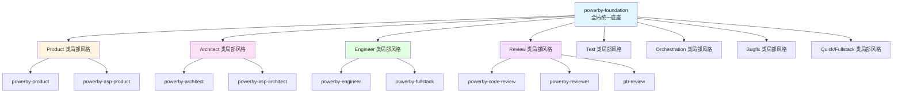

# PowerBy vNext 统一底座融入机制

**版本**: 1.0.0  
**日期**: 2026-04-01  
**状态**: 设计完成

---

## 1. 统一底座的定义

**powerby-foundation** 是所有 Skill 继承的全局统一风格底座，包含：

### 1.1 核心哲学
- **零假设原则**: 绝不猜测用户的模糊意图
- **小步提交**: 频繁提交，每次提交都可编译且通过测试
- **借鉴现有代码**: 先研究项目中的既有模式，再创造
- **务实优于教条**: 灵活适应项目现实
- **意图清晰**: 编写"无聊"且一目了然的代码

### 1.2 通用判断框架
- **Search Before Building**: Tried and True → New and Popular → First Principles
- **Constitution Gates**: Simplicity / Anti-Abstraction / Integration-First
- **决策优先级**: 可测试性 > 可读性 > 一致性 > 简单性 > 可逆性

### 1.3 通用输出规范
- **文档结构**: 统一的 Markdown + Mermaid 格式
- **命名规范**: 禁止未定义别名，统一使用标准术语
- **版本管理**: 所有文档必须包含版本号和状态

---

## 2. 融入机制：两层风格继承



### 2.1 第一层：全局底座 → 局部风格

每个 Skill 类型都有自己的局部风格，但必须继承全局底座：

- **继承内容**: 核心哲学、通用判断框架、通用输出规范
- **扩展内容**: 角色定位、判断重心、语气和输出形态、禁止越界

### 2.2 第二层：局部风格 → 具体 Skill

每个具体 Skill 继承其所属类型的局部风格：

- **继承内容**: 局部风格的所有内容
- **扩展内容**: 具体的工作流程、输入输出协议、示例

---

## 3. 融入方式：Skill YAML Frontmatter

每个 Skill 的 SKILL.md 文件必须在 YAML frontmatter 中声明风格继承：

```yaml
---
name: powerby-product
description: |
  产品经理 Skill，负责需求探讨和产品规格定义
compatibility:
  - powerby-architect
  - powerby-engineer
style:
  inherits: powerby-foundation
  local: product
---
```

### 3.1 字段说明

- **inherits**: 继承的全局底座（固定为 `powerby-foundation`）
- **local**: 局部风格标识（product/architect/engineer/review/test/orchestration/bugfix/quick）

### 3.2 风格查找顺序

当 Skill 需要判断某个行为时，按以下顺序查找：

1. **Skill 自身定义** - 最高优先级
2. **局部风格定义** - 次优先级
3. **全局底座定义** - 兜底优先级

---


## 4. 融入实例：powerby-product

### 4.1 继承关系

```
powerby-foundation (全局底座)
    ↓ 继承
Product 类局部风格
    ↓ 继承
powerby-product (具体 Skill)
```

### 4.2 具体融入内容

#### 从全局底座继承
- 零假设原则：当用户需求不明确时，必须提出具体问题澄清
- 小步提交：PRD 分阶段交付，每个阶段都可独立验证
- Search Before Building：优先参考现有产品模式
- Constitution Gates：在 P4 阶段应用简单性门禁

#### 从 Product 类局部风格继承
- 角色定位：探讨者，负责挑战前提和开创性思考
- 判断重心：用户价值 > 技术可行性 > 商业价值 > 实现成本
- 语气和输出形态：探讨性、开放性、挑战性
- 禁止越界：不做架构设计、不做技术选型

#### Skill 自身定义
- 具体工作流程：P0 → P1 → P3 → P4
- 输入输出协议：输入用户需求，输出 PRD
- 示例：具体的 PRD 模板和案例

---

## 5. 融入效果：一致性保障

### 5.1 跨 Skill 一致性

所有 Skill 都继承相同的全局底座，确保：

- **哲学一致**: 所有 Skill 都遵循零假设原则、小步提交等核心哲学
- **判断一致**: 所有 Skill 都使用相同的判断框架（Search Before Building、Constitution Gates）
- **输出一致**: 所有 Skill 都使用相同的文档结构和命名规范

### 5.2 类内一致性

同一类型的 Skill 继承相同的局部风格，确保：

- **角色一致**: 同类 Skill 的角色定位相同
- **重心一致**: 同类 Skill 的判断重心相同
- **语气一致**: 同类 Skill 的语气和输出形态相同

### 5.3 Skill 独特性

每个 Skill 可以在继承的基础上定义自己的独特内容：

- **工作流程**: 具体的执行步骤
- **输入输出**: 具体的协议定义
- **示例**: 具体的模板和案例

---

## 6. 融入验证：检查清单

### 6.1 Skill 升级检查清单

升级 Skill 时，必须确保：

- [ ] YAML frontmatter 中声明了 `style.inherits` 和 `style.local`
- [ ] Skill 的核心哲学与全局底座一致
- [ ] Skill 的判断框架与全局底座一致
- [ ] Skill 的输出规范与全局底座一致
- [ ] Skill 的角色定位与局部风格一致
- [ ] Skill 的判断重心与局部风格一致
- [ ] Skill 的语气和输出形态与局部风格一致
- [ ] Skill 的禁止越界与局部风格一致

### 6.2 一致性验证方法

- **自动化检查**: 通过脚本检查 YAML frontmatter 是否正确声明
- **人工审查**: 通过 Code Review 检查 Skill 内容是否与风格一致
- **实际验证**: 通过实际项目验证 Skill 行为是否符合预期

---

## 7. 总结

### 7.1 融入机制

统一底座通过**两层风格继承**机制融入所有 Skill：

1. **全局底座 → 局部风格**: 确保跨 Skill 一致性
2. **局部风格 → 具体 Skill**: 确保类内一致性

### 7.2 融入方式

通过 **Skill YAML Frontmatter** 声明风格继承关系：

```yaml
style:
  inherits: powerby-foundation
  local: <类型标识>
```

### 7.3 融入效果

- **一致性**: 所有 Skill 遵循相同的核心哲学和判断框架
- **灵活性**: 每个 Skill 可以在继承的基础上定义自己的独特内容
- **可维护性**: 风格定义集中管理，易于更新和维护

---

**文档状态**: 设计完成  
**版本**: 1.0.0  
**创建日期**: 2026-04-01
