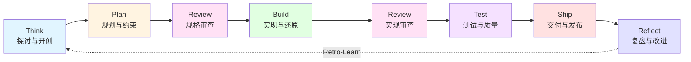
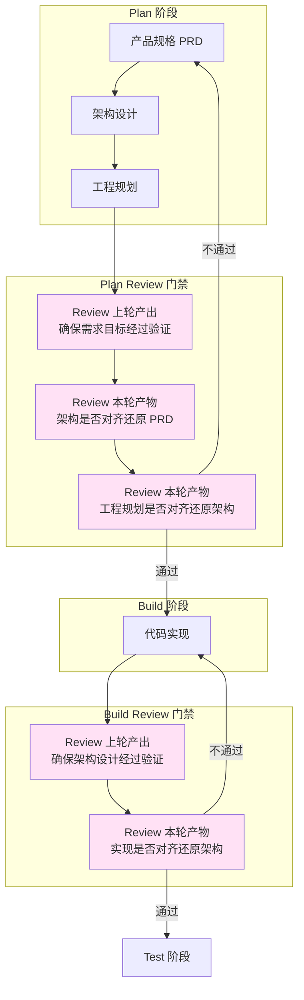
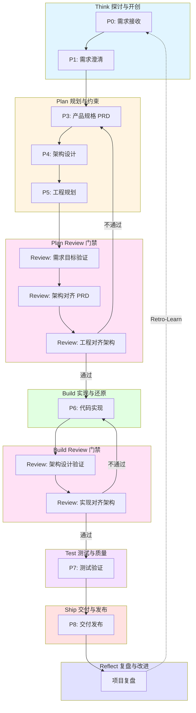
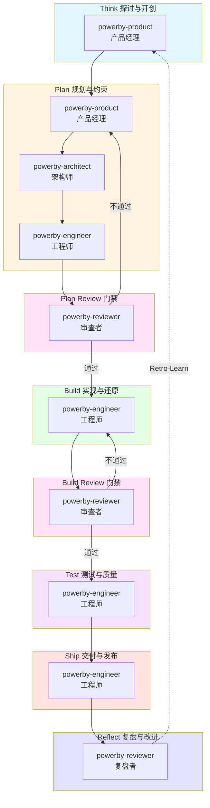
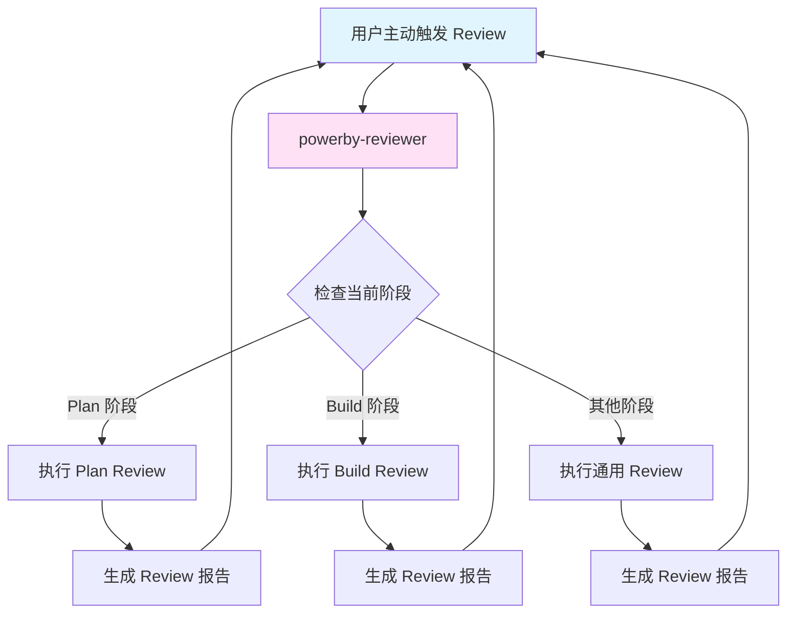
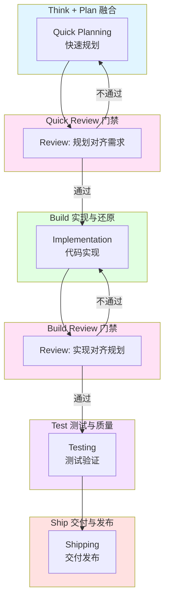
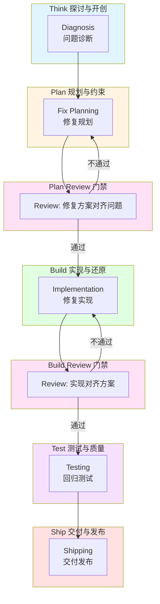
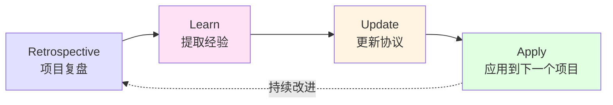
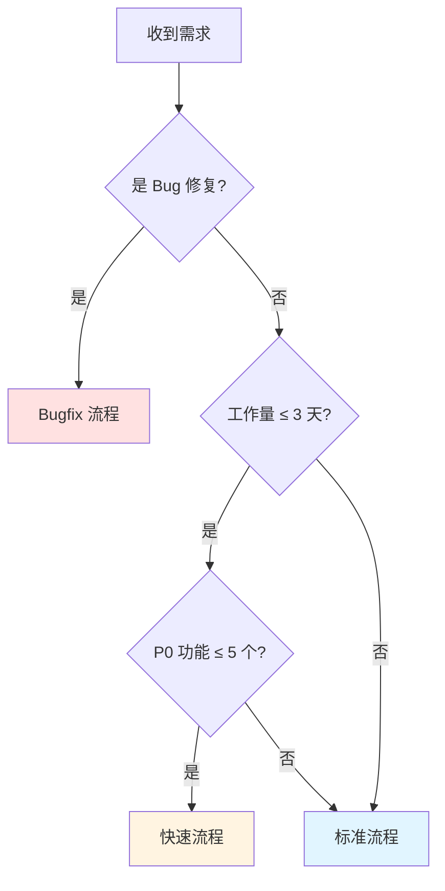

# PowerBy vNext 整体流程图

**版本**: 2.0.0  
**日期**: 2026-04-01  
**状态**: 设计完成

---

## 核心理念

**执行是约束还原的过程**。问题应该尽早发现解决，越早发现成本越小。我们的交付都是为了让整体损耗最小，效果更优。

每次整体结果交付都必须触发 Review，确保本轮产物与目标对齐还原：
- 功能是否对齐还原产品
- 架构是否对齐还原功能/产品
- 实现是否对齐还原架构

---

## 1. 总循环框架

### 1.1 七个阶段 + Review 门禁

| 阶段 | 英文 | 核心职责 | 关键产物 | Review 门禁 |
|------|------|---------|---------|-----------|
| 探讨与开创 | Think | 挑战前提、探索可能性 | 需求理解、问题定义 | - |
| 规划与约束 | Plan | 将探讨转化为可执行规格 | PRD、架构设计、工程规划 | 规格审查 |
| 实现与还原 | Build | 基于规格还原为高质量代码 | 代码实现 | 实现审查 |
| 测试与质量 | Test | 通过自动化测试验证功能 | 测试报告 | - |
| 交付与发布 | Ship | 将代码交付到生产环境 | 发布记录 | - |
| 复盘与改进 | Reflect | 总结经验教训并持续改进 | 复盘报告 | - |

### 1.2 Review 门禁机制

**核心原则**: 执行是约束还原的过程，每次交付前必须 Review

### 1.3 Review 触发机制

Review 可以通过以下三种方式触发：

1. **自动触发**: 每次阶段交付前自动触发 Review 门禁
2. **用户主动触发**: 用户可以随时主动触发 Review 流程
3. **上轮产出 Review**: 本轮任务开始之前，先 Review 上轮的产出

---

## 2. 标准流程（统一版）

### 2.1 阶段映射关系（统一版）

| 总循环阶段 | P0-P8 阶段 | 负责 Skill | 核心产物 | Review 内容 |
|-----------|-----------|-----------|---------|-----------|
| Think | P0, P1 | powerby-product | 需求理解文档 | - |
| Plan | P3, P4, P5 | powerby-product powerby-architect powerby-engineer | PRD 架构设计 工程规划 | 需求验证 架构对齐 PRD 工程对齐架构 |
| Build | P6 | powerby-engineer | 代码实现 | 架构验证 实现对齐架构 |
| Test | P7 | powerby-engineer | 测试报告 | - |
| Ship | P8 | powerby-engineer | 发布记录 | - |
| Reflect | - | powerby-reviewer | 复盘报告 | - |

**说明**: 
- powerby-product 和 powerby-asp-product 已统一为 powerby-product
- powerby-architect 和 powerby-asp-architect 已统一为 powerby-architect
- powerby-product 支持两种模式：标准模式（P0-P1-P3）和深度探讨模式（OFFICE_HOURS-DISCOVERY-DRAFTING-REFINING-REVIEWING-VISUALIZING-CONFIRMATION）

---

## 3. 核心 Skill 编排链路（骨架版）

基于"核心骨架就是不可或缺的环节"原则，以下是必须的 Skill：

### 3.1 核心 Skill 清单（必不可缺）

| Skill | 角色 | 阶段 | 职责 | 为什么必不可缺 |
|-------|------|------|------|--------------|
| powerby-product | 产品经理 | Think + Plan (P0, P1, P3) | 需求探讨和产品规格定义 | 唯一的需求入口和 PRD 产出者 |
| powerby-architect | 架构师 | Plan (P4) | 架构设计和技术选型 | 唯一的架构设计者和技术选型决策者 |
| powerby-engineer | 工程师 | Plan (P5) + Build (P6) + Test (P7) + Ship (P8) | 工程规划、代码实现、测试验证、交付发布 | 唯一的代码实现者和交付发布者 |
| powerby-reviewer | 审查者 | Plan Review + Build Review + Reflect | 规格审查、实现审查、项目复盘 | 唯一的质量守门人和对齐验证者 |

### 3.2 核心 Skill 输入输出协议

| Skill | 输入 | 输出 | 下游 Skill | Review 内容 |
|-------|------|------|-----------|-----------|
| powerby-product | 用户需求 | PRD | powerby-architect | - |
| powerby-architect | PRD | 架构设计 | powerby-engineer | 架构对齐 PRD |
| powerby-engineer (P5) | 架构设计 | 工程规划 | powerby-reviewer | 工程对齐架构 |
| powerby-reviewer (Plan Review) | PRD + 架构设计 + 工程规划 | Review 报告 | powerby-engineer (P6) 或 powerby-product | 需求验证、架构对齐、工程对齐 |
| powerby-engineer (P6) | 工程规划 | 代码实现 | powerby-reviewer | - |
| powerby-reviewer (Build Review) | 架构设计 + 代码实现 | Review 报告 | powerby-engineer (P7) 或 powerby-engineer (P6) | 架构验证、实现对齐 |
| powerby-engineer (P7) | 代码实现 | 测试报告 | powerby-engineer (P8) | - |
| powerby-engineer (P8) | 测试报告 | 发布记录 | powerby-reviewer | - |
| powerby-reviewer (Reflect) | 发布记录 | 复盘报告 | - | - |

---

## 4. Review 门禁详细机制

### 4.1 Plan Review 门禁

**触发时机**: P5 工程规划完成后

**Review 内容**:
1. **Review 上轮产出**: 确保需求目标本身是经过验证的
2. **Review 架构对齐 PRD**: 架构设计是否对齐还原 PRD
3. **Review 工程对齐架构**: 工程规划是否对齐还原架构设计

**负责 Skill**: powerby-reviewer

**输入**:
- PRD（来自 powerby-product）
- 架构设计（来自 powerby-architect）
- 工程规划（来自 powerby-engineer）

**输出**:
- Review 报告（包含通过/不通过决策和具体问题）

**决策**:
- 通过 → 进入 Build 阶段（P6）
- 不通过 → 返回 Plan 阶段（P3/P4/P5）修复问题

---

### 4.2 Build Review 门禁

**触发时机**: P6 代码实现完成后

**Review 内容**:
1. **Review 上轮产出**: 确保架构设计本身是经过验证的
2. **Review 实现对齐架构**: 代码实现是否对齐还原架构设计

**负责 Skill**: powerby-reviewer

**输入**:
- 架构设计（来自 powerby-architect）
- 代码实现（来自 powerby-engineer）

**输出**:
- Review 报告（包含通过/不通过决策和具体问题）

**决策**:
- 通过 → 进入 Test 阶段（P7）
- 不通过 → 返回 Build 阶段（P6）修复问题

---

### 4.3 用户主动触发 Review

用户可以在任何时候主动触发 Review 流程：

---

## 5. 快速流程（简化版）

快速流程是标准流程的简化版，适用于小需求（工作量 ≤ 3 天，P0 功能 ≤ 5 个）。

### 5.1 快速流程特点

- **Think + Plan 融合**: 产品理解 + 架构适配 + 工程规划在同一角色完成
- **负责 Skill**: powerby-fullstack（执行）+ powerby-reviewer（Review）
- **适用场景**: 工作量 ≤ 3 天，P0 功能 ≤ 5 个
- **核心产物**: 快速规划文档（包含产品 + 架构 + 工程三视角）
- **Review 门禁**: 简化为两个门禁（Quick Review + Build Review）

---

## 6. Bugfix 流程（简化版）

Bugfix 流程是标准流程的简化版，适用于 Bug 修复。

### 6.1 Bugfix 流程特点

- **Think 阶段**: 问题诊断（证据驱动、三层诊断）
- **Plan 阶段**: 修复规划（至少 2 个备选方案）
- **负责 Skill**: powerby-bugfix（执行）+ powerby-reviewer（Review）
- **适用场景**: Bug 修复、问题诊断
- **核心产物**: 诊断报告 + 修复方案
- **Review 门禁**: Plan Review + Build Review

---

## 7. Retro-Learn 自我改进循环

### 7.1 Retro-Learn 四阶段

| 阶段 | 职责 | 负责 Skill | 核心产物 |
|------|------|-----------|---------|
| Retrospective | 项目复盘，识别问题和亮点 | powerby-reviewer | 复盘报告 |
| Learn | 提取经验教训，形成可复用知识 | powerby-reviewer | 经验库 |
| Update | 更新协议、流程、Skill | powerby-reviewer | 更新记录 |
| Apply | 应用到下一个项目 | 所有 Skill | 实践验证 |

---

## 8. 流程选择决策树

### 8.1 流程选择标准

| 流程类型 | 适用场景 | 工作量 | P0 功能数 | 核心 Skill |
|---------|---------|--------|----------|-----------|
| 标准流程 | 常规需求开发 | > 3 天 | > 5 个 | powerby-product powerby-architect powerby-engineer powerby-reviewer |
| 快速流程 | 临时小需求 | ≤ 3 天 | ≤ 5 个 | powerby-fullstack powerby-reviewer |
| Bugfix 流程 | Bug 修复 | 不限 | 不限 | powerby-bugfix powerby-reviewer |

---

## 9. 核心原则总结

### 9.1 执行是约束还原的过程

- **功能对齐还原产品**: 架构设计必须对齐还原 PRD
- **架构对齐还原功能**: 工程规划必须对齐还原架构设计
- **实现对齐还原架构**: 代码实现必须对齐还原架构设计

### 9.2 问题尽早发现解决

- **Plan Review 门禁**: 在 Build 之前发现问题，成本最小
- **Build Review 门禁**: 在 Test 之前发现问题，成本较小
- **上轮产出 Review**: 确保需求目标本身是经过验证的

### 9.3 Review 触发机制

1. **自动触发**: 每次阶段交付前自动触发 Review 门禁
2. **用户主动触发**: 用户可以随时主动触发 Review 流程
3. **上轮产出 Review**: 本轮任务开始之前，先 Review 上轮的产出

### 9.4 核心 Skill 统一

- **powerby-product**: 统一标准模式和深度探讨模式（原 powerby-asp-product）
- **powerby-architect**: 统一标准模式和深度探讨模式（原 powerby-asp-architect）
- **powerby-reviewer**: 负责所有 Review 门禁和项目复盘

---

## 10. 总结

### 10.1 核心流程

PowerBy vNext 的核心流程是 **Think → Plan → Review → Build → Review → Test → Ship → Reflect** 八阶段总循环（包含两个 Review 门禁）。

### 10.2 核心 Skill（必不可缺）

1. **powerby-product** - 产品经理（Think + Plan P3）
2. **powerby-architect** - 架构师（Plan P4）
3. **powerby-engineer** - 工程师（Plan P5 + Build + Test + Ship）
4. **powerby-reviewer** - 审查者（Plan Review + Build Review + Reflect）

### 10.3 Review 门禁机制

- **Plan Review**: 确保架构对齐 PRD、工程对齐架构
- **Build Review**: 确保实现对齐架构
- **三种触发方式**: 自动触发、用户主动触发、上轮产出 Review

### 10.4 流程变体

- **标准流程**: 完整的 Think → Plan → Review → Build → Review → Test → Ship → Reflect
- **快速流程**: Think + Plan 融合，简化 Review 门禁
- **Bugfix 流程**: 简化版标准流程，保留 Review 门禁

---

**文档状态**: 设计完成  
**版本**: 2.0.0  
**创建日期**: 2026-04-01  
**修订说明**: 
- 统一 powerby-product 和 powerby-asp-product
- 统一 powerby-architect 和 powerby-asp-architect
- 引入 Review 门禁机制（Plan Review + Build Review）
- 明确核心 Skill 清单（4 个必不可缺）
- 强调执行是约束还原的过程
