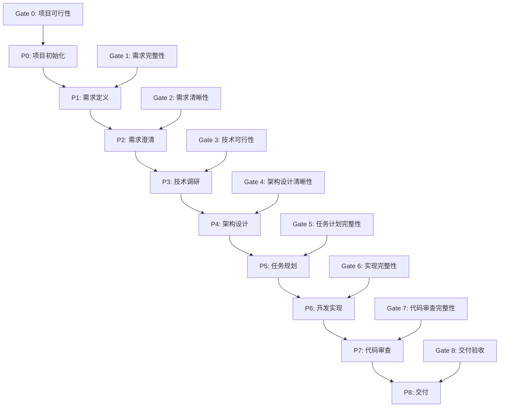
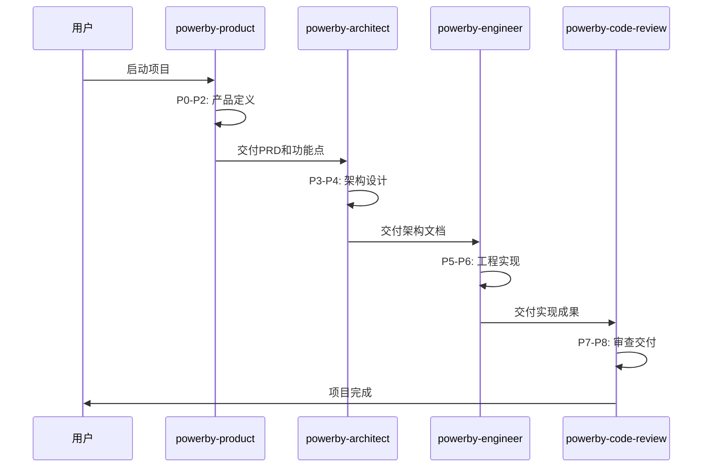

# PowerBy 工作流完整指南
**Complete Guide to PowerBy Workflow**

**文档版本**: v3.0.0
**创建日期**: 2025-12-18
**维护者**: PowerBy Team
**适用范围**: 完整的产品开发生命周期管理框架

---

## 📑 目录

1. [概述与愿景](#1-概述与愿景)
2. [核心理念与原则](#2-核心理念与原则)
3. [完整生命周期概览](#3-完整生命周期概览)
4. [阶段详细说明](#4-阶段详细说明)
   - [P0-P2: 产品定义阶段](#p0-p2-产品定义阶段)
   - [P3-P4: 架构设计阶段](#p3-p4-架构设计阶段)
   - [P5-P6: 工程实现阶段](#p5-p6-工程实现阶段)
   - [P7-P8: 审查交付阶段](#p7-p8-审查交付阶段)
5. [技能协作模型](#5-技能协作模型)
6. [文档管理体系](#6-文档管理体系)
7. [质量门禁机制](#7-质量门禁机制)
8. [迭代管理规范](#8-迭代管理规范)
9. [受阻处理协议](#9-受阻处理协议)
10. [最佳实践](#10-最佳实践)
11. [常见问题](#11-常见问题)
12. [附录](#12-附录)

---

## 1. 概述与愿景

### 1.1 什么是PowerBy

PowerBy是一个**结构化的产品开发生命周期管理框架**，旨在通过AI协作实现从需求到交付的完整闭环。它将产品开发过程分解为9个明确的阶段（P0-P8），每个阶段都有清晰的职责、产出和验收标准。

### 1.2 核心价值

- **结构化**: 将复杂的开发过程分解为可管理的阶段
- **可追溯**: 每个决策都有清晰的依据和文档记录
- **质量保证**: 通过质量门禁确保每个阶段的输出质量
- **AI友好**: 专为AI协作设计的工作流程
- **迭代式**: 支持增量开发和持续改进

### 1.3 设计目标

1. **消除模糊性**: 每个阶段都有明确的输入、输出和验收标准
2. **建立共识**: 通过结构化的协作建立团队共识
3. **提高效率**: 减少返工和沟通成本
4. **保证质量**: 通过多层次的审查确保交付质量
5. **知识沉淀**: 形成完整的项目知识库

---

## 2. 核心理念与原则

### 2.1 核心理念

PowerBy框架建立在以下核心理念之上：

#### 🎯 零假设原则 (Zero-Assumption Principle)
**绝不猜测用户的模糊意图**。当指令不明确或缺少关键信息时，首要职责是提出具体问题以澄清需求，而不是基于假设进行工作。

**应用**:
- 在任何阶段遇到模糊需求时，立即停止并请求澄清
- 假设会导致错误的方向，必须通过结构化的问题消除不确定性

#### 🚀 小步提交原则 (Small Steps Principle)
**优于"大爆炸"式开发**。代码应频繁提交，每次提交都需确保可编译且通过测试。

**应用**:
- 将大任务分解为小的、可验证的步骤
- 每个迭代都有明确的、可测试的产出
- 避免长时间的开发周期导致的风险累积

#### 🔍 借鉴现有原则 (Learn from Existing)
**借鉴现有代码，而后创造**。在动手实现前，先研究项目中的既有模式，做好规划。

**应用**:
- 分析项目中已有的模式和最佳实践
- 从成功的案例中学习
- 避免重复发明轮子

#### 🎨 务实原则 (Pragmatism Over Dogma)
**拥抱务实，而非固守教条**。灵活适应项目现实，选择最合适的解决方案。

**应用**:
- 根据项目特点选择合适的工具和方法
- 避免过度工程化和过早优化
- 关注实际的业务价值

#### 💎 意图清晰原则 (Intent Clarity)
**意图清晰，优于炫技代码**。编写"无聊"且一目了然的代码。

**应用**:
- 代码和文档应该易于理解
- 优先选择简单直接的解决方案
- 避免不必要的复杂性和抽象

### 2.2 设计哲学

#### SOLID原则
- **单一职责**: 每个模块只做一件事
- **开放封闭**: 对扩展开放，对修改封闭
- **里氏替换**: 子类可以替换父类
- **接口隔离**: 依赖最小化的接口
- **依赖倒置**: 依赖抽象而非具体实现

#### DRY原则 (Don't Repeat Yourself)
- 消除重复代码
- 将通用逻辑抽象为可复用的组件
- 保持代码的单一来源

#### KISS原则 (Keep It Simple)
- 选择最简单的解决方案
- 避免不必要的复杂性
- 奥卡姆剃刀：如无必要，勿增实体

#### Mixin思维 (Mixin Thinking)
- 增量式协作和贡献
- 每个决策都是可回滚的Mixin单元
- 技术文档与产品文档融合
- 跨角色协作桥梁

### 2.3 协作原则

#### 轮询协作模型
采用**回合制协作模式**：
1. **第一回合致意**: 明确角色和职责
2. **后续回合循环**: 持续迭代和优化
3. **最终交付**: 明确的完成标志

#### 顾问式流程
作为**顾问和思维伙伴**，而不是决策者：
- 提供专业的分析和建议
- 等待用户的最终指令
- 基于用户决策进行下一步

#### 3次尝试原则
**针对同一问题，最多尝试3次。如果依然无法解决，立刻停止。**

四步处理流程：
1. **记录失败过程**: 详细记录尝试的方法、错误和原因
2. **研究替代方案**: 寻找2-3个类似实现案例
3. **反思基本问题**: 思考抽象层级、问题拆分、整体方案
4. **尝试不同角度**: 技术栈、架构模式、简化策略

---

## 3. 完整生命周期概览

### 3.1 生命周期图表



### 3.2 阶段概览表

| 阶段 | 名称 | 主要职责 | 核心技能 | 关键产出 | 质量门禁 |
|------|------|----------|----------|----------|----------|
| P0 | 项目初始化 | 明确项目范围和目标 | powerby-product | 项目章程 | Gate 0 |
| P1 | 需求定义 | 结构化PRD和功能点 | powerby-product | prd.md, function-points.md | Gate 1 |
| P2 | 需求澄清 | 消除需求模糊点 | powerby-product | clarifications.md | Gate 2 |
| P3 | 技术调研 | 技术可行性评估 | powerby-architect | technical-research.md | Gate 3 |
| P4 | 架构设计 | 技术架构设计 | powerby-architect | architecture.md | Gate 4 |
| P5 | 任务规划 | 开发任务分解 | powerby-engineer | tasks.md | Gate 5 |
| P6 | 开发实现 | 代码实现和测试 | powerby-engineer | implementation-report.md | Gate 6 |
| P7 | 代码审查 | 代码质量审查 | powerby-code-review | code-review-report.md | Gate 7 |
| P8 | 交付 | 项目交付和总结 | powerby-code-review | delivery-report.md | Gate 8 |

### 3.3 阶段流转规则

1. **顺序性**: 严格按照P0→P1→P2→...→P8的顺序执行
2. **质量门禁**: 每个阶段必须通过相应的质量门禁才能进入下一阶段
3. **迭代性**: 支持在任一阶段进行迭代优化
4. **回滚性**: 未通过门禁可以返回上一阶段或相关阶段

---

## 4. 阶段详细说明

## P0-P2: 产品定义阶段

### P0: 项目初始化 (Project Initialization)

#### 🎯 阶段目标
明确项目的范围、目标、成功标准和初始约束，为整个项目奠定基础。

#### 📥 输入条件
- 项目初步想法或需求描述
- 项目发起人的初步说明

#### 🛠️ 执行步骤

**Step 1: 项目范围界定**
- 明确项目要解决的核心问题
- 定义项目的边界（做什么、不做什么）
- 识别关键干系人

**Step 2: 目标设定**
- 设定SMART目标（具体、可衡量、可达成、相关、有时限）
- 定义成功标准
- 识别关键里程碑

**Step 3: 约束识别**
- 时间约束
- 资源约束
- 技术约束
- 合规约束

#### 📄 产出文档
- **项目章程** (project-charter.md)
  - 项目概述
  - 核心目标
  - 成功标准
  - 关键里程碑
  - 约束条件

#### ✅ 验收标准 (Gate 0)
- [ ] 项目范围明确且有文档记录
- [ ] 成功标准可衡量且达成一致
- [ ] 关键里程碑已识别
- [ ] 项目章程获得干系人确认

#### 🎭 执行角色
**powerby-product** (产品经理)

#### 💡 最佳实践
- 保持项目章程简洁明了（1-2页）
- 定期回顾和更新项目章程
- 确保所有干系人对项目范围有一致理解

---

### P1: 需求定义 (Requirement Definition)

#### 🎯 阶段目标
将项目的初步想法转化为结构化的产品需求文档（PRD），包括完整的功能点清单。

#### 📥 输入条件
- ✅ P0已完成
- ✅ 项目章程已通过Gate 0
- ✅ 核心需求已明确

#### 🛠️ 执行步骤

**Step 1: 需求收集与分析**
- 从项目章程中提取核心需求
- 分析用户画像和使用场景
- 识别功能优先级（P0/P1/P2）

**Step 2: 功能点结构化**
采用**3部分模板结构**：
1. **需求分析**: 明确需求来源、用户价值、业务目标
2. **方案设计**: 提出具体的功能设计和实现思路
3. **实施路径**: 定义MVP路径和迭代计划

**Step 3: 功能点清单生成**
为每个P0功能点创建完整的功能点定义，包含8要素：
1. **需求来源**: 来自哪个用户或业务需求
2. **功能描述**: 清晰的功能说明
3. **用户输入**: 用户如何与功能交互
4. **系统输出**: 功能的预期输出
5. **关键约束**: 技术和业务约束
6. **验收标准**: 功能完成的判定标准
7. **依赖关系**: 与其他功能的关系
8. **预估工时**: 开发工作量估算

#### 📄 产出文档
- **产品需求文档** (prd.md)
  - 项目概述
  - 用户画像
  - 核心功能
  - 非功能需求
  - 约束条件

- **功能点清单** (function-points.md)
  - P0功能点列表（必须实现）
  - P1功能点列表（重要但不紧急）
  - P2功能点列表（未来规划）
  - 每个功能点的8要素定义

#### ✅ 验收标准 (Gate 1)
- [ ] PRD结构完整且内容清晰
- [ ] 所有P0功能点已定义且包含8要素
- [ ] 功能优先级已明确且有依据
- [ ] PRD与项目章程一致

#### 🎭 执行角色
**powerby-product** (产品经理)

#### 💡 最佳实践
- 采用轮询协作模型：回合致意→回合循环→最终交付
- 每个功能点都要有清晰的验收标准
- 功能点清单是后续所有阶段的审查基准

---

### P2: 需求澄清 (Requirement Clarification)

#### 🎯 阶段目标
通过结构化的澄清过程，消除PRD中的所有模糊点，确保需求100%清晰明确。

#### 📥 输入条件
- ✅ P1已完成
- ✅ prd.md和function-points.md已通过Gate 1
- ✅ 产品需求已结构化

#### 🛠️ 执行步骤

**Step 1: 澄清问题识别**
- 系统性检查PRD和功能点清单
- 识别可能的模糊点、矛盾点、缺失点
- 从技术、业务、用户体验等角度审视

**Step 2: 结构化澄清**
采用**3部分澄清模板**：
1. **问题描述**: 清晰描述需要澄清的问题
2. **影响分析**: 分析模糊点对后续阶段的影响
3. **澄清方案**: 提出具体的澄清建议

**Step 3: 澄清记录**
- 记录所有澄清问题和答案
- 更新相关文档
- 确保澄清后的内容无歧义

#### 📄 产出文档
- **需求澄清记录** (clarifications.md)
  - 澄清问题列表
  - 澄清过程记录
  - 最终确认的需求
  - 变更记录

#### ✅ 验收标准 (Gate 2)
- [ ] 所有模糊点已识别并澄清
- [ ] 澄清记录完整且有据可查
- [ ] PRD和功能点清单已更新
- [ ] 干系人对澄清结果达成一致

#### 🎭 执行角色
**powerby-product** (产品经理)

#### 💡 最佳实践
- 澄清过程应该结构化，避免遗漏
- 每个澄清点都要记录决策依据
- 确保澄清后没有遗留的模糊空间

---

## P3-P4: 架构设计阶段

### P3: 技术调研 (Technical Research)

#### 🎯 阶段目标
深度技术方案研究，评估技术可行性，为架构设计提供技术选型依据。

#### 📥 输入条件
- ✅ P2已完成
- ✅ prd.md、clarifications.md、function-points.md已通过Gate 2
- ✅ 产品需求已明确

#### 🛠️ 执行步骤

**Step 1: 需求解读与目标对齐**
- 深入分析PRD中的功能点清单
- 提炼核心业务目标和关键用户流程
- 向用户寻求确认

**Step 2: 技术调研分析**
针对每个核心功能点，进行深度技术调研：

**调研维度**：
1. **技术栈选型**: 前端、后端、数据库、缓存、中间件
2. **架构模式**: 单体/微服务/事件驱动/函数式等
3. **关键技术**: 第三方服务、SDK、API集成
4. **性能与扩展**: 并发处理、横向扩展、缓存策略
5. **安全与合规**: 认证授权、数据加密、合规要求

**Step 3: 技术决策点识别**
- 识别关键技术决策点
- 提供至少2种可行方案
- 进行结构化评估（优点、缺点、适用场景）

#### 📄 产出文档
- **技术调研报告** (technical-research.md)
  - 核心技术选型
  - 关键技术决策点
  - 方案评估与推荐
  - 技术风险分析

#### ✅ 验收标准 (Gate 3)
- [ ] 所有P0功能的技术可行性已评估
- [ ] 核心技术选型已完成决策（至少1个备选方案）
- [ ] 关键技术风险已识别并有缓解措施
- [ ] 技术调研报告结构完整

#### 🎭 执行角色
**powerby-architect** (系统架构师)

#### 💡 最佳实践
- 保持技术选型与MVP目标一致
- 优先考虑成熟稳定的技术
- 记录所有技术决策的依据

---

### P4: 架构设计 (Architectural Design)

#### 🎯 阶段目标
将已调研的技术方案转化为清晰、可执行的技术架构设计。

#### 📥 输入条件
- ✅ P3已完成
- ✅ technical-research.md已通过Gate 3
- ✅ 技术选型已确认

#### 🛠️ 执行步骤

**遵循4阶段强制工作流程**：

##### 阶段一：需求解读与目标对齐
- 深入分析PRD中的功能点清单
- 提炼核心业务目标和关键用户流程
- **必须停止并向用户请求确认**

##### 阶段二：架构设计与可视化
- 生成Mermaid架构图（C4 Component图、系统架构图等）
- 提供架构图说明（概念解读、组件职责）
- **组件与需求映射**（关键的可追溯性保证）
- 交互说明

##### 阶段三：关键决策点与方案评估
- 识别2-3个最关键的架构决策点
- 提供至少2种可行方案的结构化评估
- 明确给出推荐方案和理由

##### 阶段四：寻求最终决策与交付
- 汇总所有分析
- 明确请求用户做出最终选择
- 生成architecture.md文档

#### 📄 产出文档
- **技术架构设计文档** (architecture.md)
  - 需求概述
  - 核心技术选型
  - 核心架构设计（Mermaid图）
  - 组件与需求映射
  - 关键技术决策
  - 技术栈清单
  - 扩展性考虑
  - 非功能需求

#### ✅ 验收标准 (Gate 4)
- [ ] 架构图清晰表达了系统结构
- [ ] 每个组件的职责明确且有需求映射
- [ ] 所有关键技术决策已完成并记录
- [ ] 架构设计符合PRD要求
- [ ] 非功能需求（性能、安全等）已考虑

#### 🎭 执行角色
**powerby-architect** (系统架构师)

#### 💡 最佳实践
- 架构图应该清晰易懂
- 组件与需求映射是强制要求
- 关键决策点要有充分的理由支撑

---

## P5-P6: 工程实现阶段

### P5: 任务规划 (Task Planning)

#### 🎯 阶段目标
基于架构设计，将功能需求分解为可执行的开发任务，并为每个任务定义清晰的验收标准。

#### 📥 输入条件
- ✅ P4已完成
- ✅ architecture.md已通过Gate 4
- ✅ 技术架构已确认

#### 🛠️ 执行步骤

**Step 1: 任务分解**
- 基于architecture.md中的组件划分
- 将功能点分解为具体的开发任务
- 确保每个任务都有明确的产出

**Step 2: 哲学对齐分析**
在技术设计阶段融入**5大设计哲学评估**：
1. **SOLID原则**: 评估代码是否符合单一职责、开放封闭等
2. **KISS原则**: 评估设计是否足够简单
3. **DRY原则**: 评估是否存在重复代码
4. **最小影响面**: 评估变更的影响范围
5. **最小惊讶原则**: 评估设计是否符合用户期望

**Step 3: 任务定义**
为每个任务定义：
- 任务ID和名称
- 所属组件
- 关联的功能点
- 详细描述
- 验收标准
- 预估工时
- 依赖关系

#### 📄 产出文档
- **开发任务清单** (tasks.md)
  - 任务列表
  - 任务详情
  - 依赖关系图
  - 优先级排序
  - 迭代计划

#### ✅ 验收标准 (Gate 5)
- [ ] 所有P0功能点已分解为具体任务
- [ ] 每个任务都有明确的验收标准
- [ ] 任务依赖关系清晰
- [ ] 哲学对齐分析已完成

#### 🎭 执行角色
**powerby-engineer** (软件工程师)

#### 💡 最佳实践
- 任务粒度要适中（1-3天可完成）
- 验收标准要可测试
- 考虑并行开发的可能性

---

### P6: 开发实现 (Development Implementation)

#### 🎯 阶段目标
基于任务规划，完成代码实现、测试和文档编写，形成可交付的实现成果。

#### 📥 输入条件
- ✅ P5已完成
- ✅ tasks.md已通过Gate 5
- ✅ 开发任务已明确

#### 🛠️ 执行步骤

**Step 1: 实现策略制定**
- 根据tasks.md中的任务清单
- 制定实现顺序和策略
- 识别技术风险和缓解措施

**Step 2: 代码实现**
遵循**TDD（测试驱动开发）**流程：
1. **理解**: 研究代码库中的现有模式
2. **测试**: 编写失败的测试（红灯）
3. **实现**: 编写最精简的代码，让测试通过（绿灯）
4. **重构**: 在测试的保护下，清理和优化代码
5. **提交**: 撰写清晰的提交信息，并关联到开发计划

**Step 3: 测试验证**
- 单元测试
- 集成测试
- 端到端测试
- 性能测试

**Step 4: 文档编写**
- API文档
- 代码注释
- 部署文档
- 用户指南

#### 📄 产出文档
- **实现报告** (implementation-report.md)
  - 实现概述
  - 任务完成情况
  - 测试覆盖率
  - 技术决策记录
  - 性能指标
  - 已知问题和解决方案

#### ✅ 验收标准 (Gate 6)
- [ ] 所有P0任务已完成
- [ ] 代码质量符合项目标准
- [ ] 测试覆盖率达标
- [ ] 实现报告完整且准确

#### 🎭 执行角色
**powerby-engineer** (软件工程师)

#### 💡 最佳实践
- 保持小步提交的习惯
- 每个提交都要有清晰的说明
- 及时更新任务状态

---

## P7-P8: 审查交付阶段

### P7: 代码审查 (Code Review)

#### 🎯 阶段目标
对代码实现进行全面审查，确保代码质量、流程闭环和文档一致性，为最终交付做好准备。

#### 📥 输入条件
- ✅ P6已完成
- ✅ implementation-report.md已通过Gate 6
- ✅ 代码实现已完成并提交PR

#### 🛠️ 执行步骤

**Step 1: 上下文信息收集**
必须接收的基准文档：
1. **产品需求文档**（prd.md）：定义功能点
2. **功能点清单**（function-points.md）：结构化的功能点列表
3. **架构设计文档**（architecture.md）：定义组件职责
4. **任务计划文档**（tasks.md）：定义开发任务
5. **实现报告**（implementation-report.md）：开发成果
6. **合并请求**（PR）：代码变更集

**Step 2: 执行审查清单**
按照**5大类审计清单**逐项检查：

##### 1. 一致性与范围审计
- 功能点一致性验证
- 任务一致性验证
- 架构一致性验证
- 需求一致性验证
- 范围控制验证

##### 2. 实现完整性与真实性审计
- 避免假实现（硬编码、空函数、TODO等）
- 确保所有调用都有实现
- 业务逻辑基于真实数据流

##### 3. 设计哲学与代码质量审计
- SOLID原则
- KISS原则
- DRY原则
- 代码可读性
- 最小影响面

##### 4. 测试与健壮性审计
- 自动化测试充分性
- 错误处理恰当性
- 安全性检查

##### 5. 提交质量审计
- 提交信息清晰性
- 小步提交
- 关联任务ID

**Step 3: 生成审计报告**
使用**7部分结构化审计报告**：
1. 最终结论（APPROVED/CHANGES REQUESTED）
2. 总体评价
3. 功能实现与验收方案
4. 一致性与可追溯性验证
5. 详细修改建议
6. 优秀实践亮点
7. 审计摘要统计

#### 📄 产出文档
- **代码审计报告** (code-review-report.md)
  - 审查结果
  - 功能点完成情况
  - 详细修改建议
  - 审计统计

#### ✅ 验收标准 (Gate 7)
- [ ] 所有5大类审计项已完成检查
- [ ] 功能点一致性验证已完成
- [ ] 所有P0功能点的验收标准都已满足
- [ ] 最终结论明确（APPROVED或CHANGES REQUESTED）
- [ ] 可追溯性矩阵验证完成

#### 🎭 执行角色
**powerby-code-review** (首席工程师 & 流程守护者)

#### 💡 最佳实践
- 严格对照基准文档进行审查
- 保持客观、公正、有据可依
- 提供可执行的功能验收方案

---

### P8: 交付 (Delivery)

#### 🎯 阶段目标
完成最终交付，包括文档整理、部署准备和项目总结，确保项目顺利交付和上线。

#### 📥 输入条件
- ✅ P7已完成
- ✅ code-review-report.md已通过Gate 7
- ✅ 代码已通过审查并合并到主干

#### 🛠️ 执行步骤

**Step 1: 交付准备**
整理所有交付物：

1. **代码交付**：
   - 已审查并合并的代码
   - 完整的测试套件
   - 构建和部署脚本

2. **文档交付**：
   - PRD文档
   - 架构文档
   - API文档
   - 部署文档
   - 运维文档

3. **项目总结**：
   - 实现报告
   - 审查报告
   - 经验教训
   - 后续建议

**Step 2: 最终验收**
验证所有交付物符合要求：
- [ ] 所有P0功能已实现并通过测试
- [ ] 代码已合并到主干分支
- [ ] 文档完整且最新
- [ ] 部署流程已验证
- [ ] 监控和日志已配置

**Step 3: 生成交付报告**
输出完整的项目交付报告，包含：
- 项目概述
- 交付清单
- 质量指标
- 项目成果
- 经验总结
- 后续建议

#### 📄 产出文档
- **项目交付报告** (delivery-report.md)
  - 项目概述
  - 交付清单
  - 质量指标
  - 项目成果
  - 经验总结

#### ✅ 验收标准 (Gate 8)
- [ ] 所有交付物清单已完成
- [ ] 所有P0功能已实现并通过测试
- [ ] 代码已合并到主干分支
- [ ] 文档完整且最新
- [ ] 部署流程已验证
- [ ] 监控和日志已配置

#### 🎭 执行角色
**powerby-code-review** (首席工程师 & 流程守护者)

#### 💡 最佳实践
- 确保交付物完整且可追溯
- 总结经验教训，为未来项目提供参考
- 提供清晰的后续优化建议

---

## 5. 技能协作模型

### 5.1 技能角色定义

| 技能名称 | 核心角色 | 主要职责 | 协作阶段 |
|----------|----------|----------|----------|
| powerby-product | 产品经理 | 需求定义、澄清、产品规划 | P0-P2 |
| powerby-architect | 系统架构师 | 技术调研、架构设计 | P3-P4 |
| powerby-engineer | 软件工程师 | 任务规划、开发实现 | P5-P6 |
| powerby-code-review | 首席工程师 | 代码审查、项目交付 | P7-P8 |
| powerby-fullstack ⭐ | 全栈工程师 | 快速处理临时小需求 | P0-P5 |

### 5.2 协作流程



### 5.3 协作原则

1. **Mixin思维**: 每个技能的输出都是对前一阶段成果的增量补充
2. **可追溯性**: 保持从需求到实现的完整追溯链
3. **质量门禁**: 每个阶段的输出都要通过质量门禁
4. **文档驱动**: 所有决策都要有文档记录

---

## 6. 文档管理体系

### 6.1 文档层级结构

```
项目根目录/
├── .powerby/                 # 项目元数据
│   ├── project.json         # 项目基本信息
│   └── iterations.json      # 迭代状态追踪
├── docs/                     # 项目文档
│   ├── constitution.md       # 项目章程
│   └── iterations/           # 迭代文档
│       └── {id}-{name}/      # 具体迭代
│           ├── prd.md        # 产品需求文档
│           ├── clarifications.md # 需求澄清
│           ├── function-points.md # 功能点清单
│           ├── technical-research.md # 技术调研
│           ├── architecture.md # 架构设计
│           ├── tasks.md      # 任务清单
│           ├── implementation-report.md # 实现报告
│           ├── code-review-report.md # 审查报告
│           └── delivery-report.md # 交付报告
```

### 6.2 核心文档说明

#### PRD (Product Requirements Document)
- **路径**: `docs/iterations/{id}-{name}/prd.md`
- **内容**: 产品概述、用户画像、核心功能、非功能需求
- **维护者**: powerby-product
- **更新频率**: P1阶段创建，P2阶段更新

#### Function Points (功能点清单)
- **路径**: `docs/iterations/{id}-{name}/function-points.md`
- **内容**: 结构化的功能点列表，每个功能点包含8要素
- **维护者**: powerby-product
- **更新频率**: P1阶段创建，后续阶段参考

#### Architecture (架构设计)
- **路径**: `docs/iterations/{id}-{name}/architecture.md`
- **内容**: 技术架构图、组件职责、决策记录
- **维护者**: powerby-architect
- **更新频率**: P4阶段创建，P5阶段参考

#### Tasks (任务清单)
- **路径**: `docs/iterations/{id}-{name}/tasks.md`
- **内容**: 开发任务列表、依赖关系、验收标准
- **维护者**: powerby-engineer
- **更新频率**: P5阶段创建，P6阶段更新

#### Implementation Report (实现报告)
- **路径**: `docs/iterations/{id}-{name}/implementation-report.md`
- **内容**: 实现成果、测试结果、技术决策
- **维护者**: powerby-engineer
- **更新频率**: P6阶段创建

#### Code Review Report (审查报告)
- **路径**: `docs/iterations/{id}-{name}/code-review-report.md`
- **内容**: 审查结果、修改建议、审计统计
- **维护者**: powerby-code-review
- **更新频率**: P7阶段创建

#### Delivery Report (交付报告)
- **路径**: `docs/iterations/{id}-{name}/delivery-report.md`
- **内容**: 项目总结、交付清单、经验教训
- **维护者**: powerby-code-review
- **更新频率**: P8阶段创建

### 6.3 文档编写规范

#### Markdown规范
- 使用标准Markdown语法
- 标题层级不超过4级
- 代码块使用语法高亮
- 表格要对齐且简洁

#### Mermaid图表规范
- 架构图使用Mermaid语法
- 图表要清晰易懂
- 包含必要的说明

#### 命名规范
- 文件名使用小写和连字符
- 目录名使用数字编号
- 保持命名的一致性

---

## 7. 质量门禁机制

### 7.1 质量门禁概述

质量门禁（Quality Gate）是PowerBy框架的核心质量保证机制。每个阶段都必须通过相应的质量门禁才能进入下一阶段。

### 7.2 质量门禁清单

| 门禁编号 | 名称 | 检查内容 | 通过标准 |
|----------|------|----------|----------|
| Gate 0 | 项目可行性 | 项目章程的完整性和可行性 | 所有检查项✅ |
| Gate 1 | 需求完整性 | PRD和功能点清单的完整性 | 所有检查项✅ |
| Gate 2 | 需求清晰性 | 澄清记录的完整性和一致性 | 所有检查项✅ |
| Gate 3 | 技术可行性 | 技术调研的深度和准确性 | 所有检查项✅ |
| Gate 4 | 架构设计清晰性 | 架构图、组件映射、决策记录 | 所有检查项✅ |
| Gate 5 | 任务计划完整性 | 任务分解、验收标准、哲学对齐 | 所有检查项✅ |
| Gate 6 | 实现完整性 | 任务完成、质量标准、测试覆盖 | 所有检查项✅ |
| Gate 7 | 代码审查完整性 | 5大类审计项、功能点验证 | 所有检查项✅ |
| Gate 8 | 交付验收 | 交付物完整性和部署验证 | 所有检查项✅ |

### 7.3 门禁执行流程

1. **自检**: 当前阶段完成后进行自检
2. **交叉审查**: 由下游技能进行交叉审查
3. **问题修复**: 发现问题则返回修改
4. **门禁通过**: 所有检查项通过后进入下一阶段

### 7.4 门禁失败处理

当门禁失败时：
1. 记录失败原因
2. 制定修复计划
3. 修复问题
4. 重新提交门禁检查

---

## 8. 迭代管理规范

### 8.1 迭代编号规则

- **格式**: `{三位数字}-{功能名}` (例如: `001-dex-aggregator`)
- **编号**: 从001开始递增
- **命名**: 使用有意义的英文名称

### 8.2 分支管理

- **分支命名**: 与迭代编号保持一致
- **分支隔离**: 每个迭代有独立的Git分支
- **合并策略**: 通过Pull Request进行代码合并

### 8.3 文档组织

- **根目录**: `docs/iterations/{id}-{name}/`
- **元数据**: `.powerby/iterations.json`
- **版本控制**: 所有文档都纳入版本控制

### 8.4 状态追踪

在 `.powerby/iterations.json` 中记录：
- 迭代基本信息
- 当前阶段
- 完成状态
- 质量门禁状态
- 关键日期

---

## 9. 受阻处理协议

### 9.1 3次尝试原则

**针对同一问题，最多尝试3次。如果依然无法解决，立刻停止。**

### 9.2 四步处理流程

#### 第一步：记录失败过程
详细记录：
1. 具体尝试内容
2. 错误信息
3. 失败原因分析

#### 第二步：研究替代方案
寻找并分析2-3个类似实现案例：
1. 搜索项目中是否有类似场景
2. 查找其他工程师的处理方法
3. 记录不同方法的差异和优缺点

#### 第三步：反思基本问题
深入思考：
1. 抽象层级是否正确
2. 能否拆分得更小
3. 是否存在更简单的整体方案

#### 第四步：尝试不同角度
1. 技术栈角度
2. 架构模式角度
3. 简化策略角度

### 9.3 阻塞报告格式

当3次尝试后仍无法解决时，生成结构化的阻塞报告：
```markdown
# 阻塞问题报告

## 问题描述
[清晰描述遇到的具体阻塞问题]

## 尝试记录
[详细记录三次尝试的过程]

## 替代方案研究
[记录找到的类似实现案例]

## 根本问题分析
[深入分析根本原因]

## 最终建议
[基于分析的建议]

## 需要用户决策的问题
[需要用户明确指示的问题]
```

### 9.4 执行要求

- **立即停止**: 3次尝试后必须立即停止
- **结构化输出**: 必须按照标准格式生成报告
- **寻求指导**: 将报告提交给用户
- **不跳过原则**: 绝对不允许跳过此协议

---

## 10. 最佳实践

### 10.1 需求阶段最佳实践

1. **保持简洁**: PRD应该简洁明了，避免冗长
2. **用户视角**: 始终从用户角度思考需求
3. **优先级明确**: P0/P1/P2优先级要有明确依据
4. **可测试**: 每个功能点都要有可测试的验收标准
5. **及时澄清**: 发现模糊点立即澄清

### 10.2 架构阶段最佳实践

1. **MVP优先**: 优先考虑MVP实现路径
2. **扩展性**: 为未来发展预留扩展点
3. **组件化**: 保持高内聚、低耦合
4. **决策记录**: 记录所有技术决策的依据
5. **可视化**: 使用图表辅助说明

### 10.3 实现阶段最佳实践

1. **TDD**: 采用测试驱动开发
2. **小步提交**: 保持小步提交的节奏
3. **代码审查**: 及时进行代码审查
4. **持续集成**: 建立持续集成流程
5. **文档同步**: 代码和文档同步更新

### 10.4 审查阶段最佳实践

1. **基准文档**: 严格对照基准文档审查
2. **结构化**: 使用结构化的审查清单
3. **客观公正**: 保持客观公正的态度
4. **建设性**: 提供建设性的修改建议
5. **可追溯**: 保持完整的追溯链

### 10.5 协作最佳实践

1. **Mixin思维**: 采用增量式协作
2. **及时沟通**: 及时沟通问题和风险
3. **文档共享**: 及时共享文档和决策
4. **相互尊重**: 尊重不同角色的专业意见
5. **持续改进**: 从每个迭代中学习和改进

---

## 11. 常见问题

### Q1: 如果某个阶段的质量门禁失败怎么办？

**A**: 当质量门禁失败时，应该：
1. 详细分析失败原因
2. 制定修复计划
3. 修复问题
4. 重新提交门禁检查
5. 如果多次失败，触发受阻处理协议

### Q2: 是否可以跳过某个阶段？

**A**: 不建议跳过任何阶段。每个阶段都有其存在的价值和必要性。如果确实需要跳过，必须：
1. 明确记录跳过的原因
2. 获得所有干系人的同意
3. 评估跳过可能带来的风险

### Q3: 如何处理需求变更？

**A**: 需求变更是常态，处理方式：
1. 评估变更的影响范围
2. 更新相关文档
3. 重新进行质量门禁
4. 记录变更历史

### Q4: 如何平衡进度和质量？

**A**: 质量和进度都很重要，建议：
1. 设定合理的质量标准
2. 采用分阶段的质量检查
3. 及时识别和解决风险
4. 保持透明和开放的沟通

### Q5: 多人协作时如何保持一致性？

**A**: 多人协作时：
1. 使用统一的文档模板
2. 建立清晰的协作流程
3. 使用版本控制管理文档
4. 定期进行同步会议
5. 建立决策记录机制

---

## 12. 附录

### 12.1 术语表

| 术语 | 定义 |
|------|------|
| PRD | Product Requirements Document，产品需求文档 |
| Gate | 质量门禁，阶段间的质量检查点 |
| MVP | Minimum Viable Product，最小可行产品 |
| TDD | Test-Driven Development，测试驱动开发 |
| SOLID | 面向对象设计的五大原则 |
| DRY | Don't Repeat Yourself，不要重复自己 |
| KISS | Keep It Simple，保持简单 |
| Mixin | 增量式协作和贡献模式 |

### 12.2 文档模板

#### PRD模板
```markdown
# 产品需求文档

## 项目概述
[项目名称、目标、背景]

## 用户画像
[目标用户特征]

## 核心功能
[P0/P1/P2功能列表]

## 非功能需求
[性能、安全、可维护性等]

## 约束条件
[技术、业务、时间约束]
```

#### Architecture模板
```markdown
# 技术架构设计

## 需求概述
[从PRD提炼的需求]

## 核心技术选型
[技术栈选择和理由]

## 核心架构设计
[Mermaid架构图]

## 组件与需求映射
[组件与功能点的对应关系]

## 关键技术决策
[技术决策点记录]

## 非功能需求
[性能、安全等考虑]
```

### 12.3 检查清单

#### P1阶段检查清单
- [ ] PRD结构完整
- [ ] 功能点清单包含所有P0功能
- [ ] 每个功能点包含8要素
- [ ] 功能优先级明确

#### P4阶段检查清单
- [ ] 架构图清晰
- [ ] 组件职责明确
- [ ] 组件与需求映射完整
- [ ] 技术决策记录完整

#### P7阶段检查清单
- [ ] 5大类审计项完成
- [ ] 功能点一致性验证
- [ ] 审计报告结构完整
- [ ] 结论明确

### 12.4 参考资源

- [PowerBy Constitution](../powerby-constitution.md)
- [PowerBy Command 文档](../powerby-command/README.md)
- [技能定义文档](../skills/)

---

**文档版本**: v3.0.0
**最后更新**: 2025-12-18
**维护者**: PowerBy Team
**审核状态**: 待AI审核

---

## 📋 审核清单

本文档已准备好接受AI审核，请重点关注以下方面：

1. **完整性**: 是否涵盖了PowerBy工作流的所有重要方面？
2. **准确性**: 流程和原则的描述是否准确？
3. **清晰性**: 文档结构是否清晰，易于理解？
4. **一致性**: 前后内容是否一致？
5. **实用性**: 是否提供了足够的实践指导？
6. **可操作性**: 是否具有可操作性？

**请提供具体的优化建议和修改意见。**
