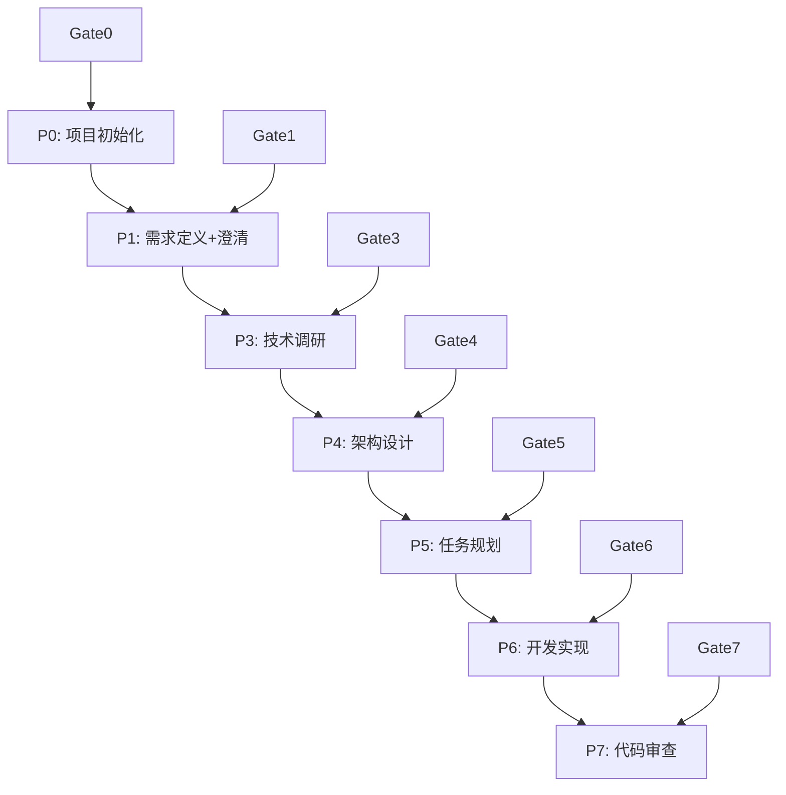

# PowerBy 工作流完整指南
**Complete Guide to PowerBy Workflow**

**文档版本**: v4.0.0
**适用范围**: 专注MVP的产品开发生命周期管理框架

---

## 目录

1. [概述与愿景](#1-概述与愿景)
2. [核心理念与原则](#2-核心理念与原则)
3. [MVP生命周期概览](#3-mvp生命周期概览)
4. [阶段详细说明](#4-阶段详细说明)
5. [质量门禁机制](#5-质量门禁机制)
6. [Git分支管理](#6-git分支管理)
7. [受阻处理协议](#7-受阻处理协议)

---

## 1. 概述与愿景

### 1.1 什么是PowerBy

PowerBy是一个**专注于MVP的结构化产品开发生命周期管理框架**，通过AI协作实现从需求到可运行产品的快速闭环。

### 1.2 核心价值

- **MVP专注**: 专注于最小可行产品的核心价值实现
- **奥卡姆剃刀**: 如无必要，勿增实体
- **快速闭环**: 从需求到可运行产品的最短路径
- **可追溯**: 每个决策都有清晰的依据和文档记录

---

## 2. 核心理念与原则

### 2.1 核心理念

#### 零假设原则 (Zero-Assumption Principle)
绝不猜测用户的模糊意图。当指令不明确或缺少关键信息时，首要职责是提出具体问题以澄清需求。

#### 小步提交原则 (Small Steps Principle)
代码应频繁提交，每次提交都需确保可编译且通过测试。

#### 3次尝试原则
针对同一问题，最多尝试3次。如果依然无法解决，立刻停止并报告。

### 2.2 设计哲学

- **SOLID原则**: 单一职责、开放封闭、里氏替换、接口隔离、依赖倒置
- **DRY原则**: 消除重复，保持代码单一来源
- **KISS原则**: 选择最简单的解决方案
- **Mixin思维**: 增量式协作和贡献

---

## 3. MVP生命周期概览

### 3.1 生命周期图表


```mermaid
graph TD
    P0[P0: 项目初始化] --> P1[P1: 需求定义+澄清]
    P1 --> P3[P3: 技术调研]
    P3 --> P4[P4: 架构设计]
    P4 --> P5[P5: 任务规划]
    P5 --> P6[P6: 开发实现]
    P6 --> P7[P7: 代码审查]

    Gate0 --> P0
    Gate1 --> P1
    Gate3 --> P3
    Gate4 --> P4
    Gate5 --> P5
    Gate6 --> P6
    Gate7 --> P7
```

### 3.2 阶段概览表

| 阶段 | 名称 | 主要职责 | 关键产出 | 质量门禁 |
|------|------|----------|----------|----------|
| P0 | 项目初始化 | 明确MVP范围和目标 | project-charter.md | Gate 0 |
| P1 | 需求定义+澄清 | 结构化PRD、功能点 | prd.md, function-points.md | Gate 1 |
| P3 | 技术调研 | MVP技术可行性评估 | technical-research.md | Gate 3 |
| P4 | 架构设计 | 最小可行架构设计 | architecture.md | Gate 4 |
| P5 | 任务规划 | MVP开发任务分解 | tasks.md | Gate 5 |
| P6 | 开发实现 | MVP代码实现和测试 | implementation-report.md | Gate 6 |
| P7 | 代码审查 | MVP代码质量审查 | code-review-report.md | Gate 7 |

### 3.3 阶段流转规则

1. **MVP专注**: 严格按照P0→P1→P3→...→P7的MVP核心流程执行
2. **质量门禁**: 每个阶段必须通过相应的质量门禁才能进入下一阶段
3. **迭代性**: 支持在任一阶段进行迭代优化
4. **回滚性**: 未通过门禁可以返回上一阶段或相关阶段

### 3.4 流程类型与分支创建时机 ⭐

PowerBy支持三种流程类型，分支创建时机不同：

| 流程类型 | 适用场景 | 分支类型 | 创建时机 | 触发方式 |
|---------|---------|---------|---------|---------|
| **标准流程** | 完整功能开发 | feature/{id}-{name} | P1完成后 | Gate 1通过后自动触发 |
| **快速流程** | 小需求/增量开发 | feature/{id}-{name} | P5完成后 | Q-Gate 5通过+人工确认 |
| **Bug修复** | Bug诊断与修复 | bugfix/{id}-{desc} | bugfix开始时 | 自动触发 powerby-git |
| **紧急修复** | 紧急修复 | hotfix/{id}-{desc} | hotfix开始时 | 自动触发 powerby-git |

**分支创建原则**：
- 标准流程：需求确认后立即创建分支，确保开发在规范分支上进行
- 快速流程：任务规划完成后创建分支，此时所有设计已确认
- Bug修复：立即创建分支，确保修复在规范分支上进行

---

## 4. 阶段详细说明

### P0: 项目初始化

**阶段目标**: 明确项目的范围、目标、成功标准和初始约束。

**输入条件**: 项目初步想法或需求描述。

**执行步骤**:
1. 项目范围界定 - 明确核心问题和边界
2. 目标设定 - 设定SMART目标
3. 约束识别 - 时间、资源、技术约束
4. Git环境初始化 - 创建main和develop分支

**产出文档**: project-charter.md

**验收标准 (Gate 0)**:
- [ ] 项目范围明确且有文档记录
- [ ] 成功标准可衡量
- [ ] Git仓库已初始化

---

### P1: 需求定义+澄清

**阶段目标**: 将MVP核心想法转化为结构化的PRD和功能点清单。

**输入条件**: P0已完成，项目章程已通过Gate 0。

**执行步骤**:
1. 需求收集与分析 - 提取核心需求，识别优先级
2. 功能点结构化 - 采用3部分模板
3. 功能点清单生成 - 每个功能点包含8要素
4. 同步澄清过程 - 识别并消除模糊点
5. **分支创建** - 仅标准流程在P1完成后创建；快速流程在P5创建

**产出文档**:
- prd.md - 产品需求文档
- function-points.md - 功能点清单
- clarifications.md - 需求澄清记录

**验收标准 (Gate 1)**:
- [ ] PRD结构完整，所有P0功能点已定义
- [ ] 文档中无模糊描述
- [ ] 功能点清单与业务逻辑无矛盾
- [ ] **标准流程**: 分支已创建，Git Hooks已安装
- [ ] **快速流程**: 等待P5完成后创建分支

---

### P3: 技术调研

**阶段目标**: 深度技术方案研究，评估技术可行性。

**输入条件**: P1已完成，PRD和功能点清单已通过Gate 1。

**执行步骤**:
1. 需求解读与目标对齐
2. 技术调研分析 - 技术栈、架构模式、关键技术
3. 技术决策点识别 - 提供至少2种可行方案

**产出文档**: technical-research.md

**验收标准 (Gate 3)**:
- [ ] 所有P0功能的技术可行性已评估
- [ ] 核心技术选型已完成决策
- [ ] 关键技术风险已识别

---

### P4: 架构设计

**阶段目标**: 将技术方案转化为清晰、可执行的技术架构设计。

**输入条件**: P3已完成，技术调研报告已通过Gate 3。

**执行步骤**:
1. 需求解读与目标对齐
2. 架构设计与可视化 - 生成Mermaid架构图
3. 关键决策点与方案评估 - 至少2种方案
4. 寻求最终决策与交付

**产出文档**: architecture.md

**验收标准 (Gate 4)**:
- [ ] 架构图清晰表达系统结构
- [ ] 组件职责明确且有需求映射
- [ ] 所有关键技术决策已完成

---

### P5: 任务规划

**阶段目标**: 将功能需求分解为可执行的开发任务。

**输入条件**: P4已完成，架构设计已通过Gate 4。

**执行步骤**:
1. 任务分解 - 基于架构设计分解任务
2. 哲学对齐分析 - SOLID、KISS、DRY
3. 任务定义 - 每个任务包含验收标准
4. **分支创建** - 仅快速流程在P5完成后创建

**产出文档**: tasks.md

**验收标准 (Gate 5)**:
- [ ] 所有P0功能点已分解为具体任务
- [ ] 每个任务都有明确的验收标准
- [ ] 任务依赖关系清晰
- [ ] **快速流程**: 分支已创建，Git Hooks已安装
- [ ] **标准流程**: 分支已在P1创建，无需重复创建

---

### P6: 开发实现

**阶段目标**: 完成代码实现、测试和文档编写。

**输入条件**: P5已完成，任务清单已通过Gate 5。

**执行步骤** (遵循TDD流程):
1. 理解 - 研究代码库中的现有模式
2. 测试 - 编写失败的测试（红灯）
3. 实现 - 编写最精简的代码（绿灯）
4. 重构 - 在测试保护下清理和优化代码
5. 提交 - 撰写清晰的提交信息

**产出文档**: implementation-report.md

**验收标准 (Gate 6)**:
- [ ] 所有P0任务已完成
- [ ] 代码质量符合项目标准
- [ ] 实现报告完整

---

### P7: 代码审查

**阶段目标**: 对MVP代码实现进行全面审查，完成分支合并与清理。

**输入条件**: P6已完成，实现报告已通过Gate 6。

**执行步骤**:
1. 上下文信息收集 - 收集所有基准文档
2. 执行审查清单 - 5大类审计项
3. 生成审计报告 - 7部分结构化报告
4. 分支合并与清理

**产出文档**: code-review-report.md

**验收标准 (Gate 7)**:
- [ ] 所有5大类审计项已完成检查
- [ ] 功能点一致性验证完成
- [ ] 分支已合并到develop
- [ ] 本地feature分支已清理

---

## 5. 质量门禁机制

### 质量门禁清单

| Gate | 名称 | 检查内容 | 通过标准 |
|------|------|----------|----------|
| Gate 0 | 项目可行性 | 项目章程的完整性和可行性 | 所有检查项通过 |
| Gate 1 | 需求定稿 | PRD、功能点清单和澄清记录 | 所有检查项通过 |
| Gate 3 | 技术可行性 | 技术调研的深度和准确性 | 所有检查项通过 |
| Gate 4 | 架构设计清晰性 | 架构图、组件映射、决策记录 | 所有检查项通过 |
| Gate 5 | 任务计划完整性 | 任务分解、验收标准 | 所有检查项通过 |
| Gate 6 | 实现完整性 | 任务完成、测试覆盖 | 所有检查项通过 |
| Gate 7 | 代码审查完整性 | 5大类审计项 | 所有检查项通过 |

---

## 6. Git分支管理

### 6.1 分支类型

| 类型 | 命名规范 | 来源 | 合并目标 |
|------|----------|------|----------|
| 主分支 | main | - | - |
| 开发分支 | develop | - | - |
| 功能分支 | feature/{id}-{name} | develop | develop |
| Bug修复 | bugfix/{id}-{desc} | develop | develop |
| 紧急修复 | hotfix/{id}-{desc} | main | main + develop |

### 6.2 分支创建时机（按流程类型）⭐

| 流程类型 | 命令 | 创建时机 | 说明 |
|---------|------|---------|------|
| 标准流程 | `powerby-git start --type=feature` | P1完成后 | Gate 1通过后自动触发 |
| 快速流程 | `powerby-git start --type=feature` | P5完成后 | Q-Gate 5通过+人工确认后 |
| Bug修复 | `powerby-git start --type=bugfix` | bugfix开始时 | 自动触发 |
| 紧急修复 | `powerby-git start --type=hotfix` | hotfix开始时 | 自动触发 |

### 6.3 powerby-git 命令

```bash
# 创建分支
powerby-git start --type=feature --name=001-user-authentication
powerby-git start --type=bugfix --name=login-timeout

# 检查合规性
powerby-git check --type=commit      # 提交检查
powerby-git check --type=merge       # 合并检查

# 分支清理
powerby-git cleanup --dry-run        # 预览
powerby-git cleanup --force          # 执行
```

### Git Hooks

```bash
# pre-commit - 提交时自动检查
powerby-git check --type=commit

# pre-merge - 合并时自动检查
powerby-git check --type=merge
```

---

## 7. 受阻处理协议

### 3次尝试原则

针对同一问题，最多尝试3次。如果依然无法解决，立刻停止。

### 四步处理流程

1. **记录失败过程**: 详细记录尝试的方法、错误和原因
2. **研究替代方案**: 寻找2-3个类似实现案例
3. **反思基本问题**: 思考抽象层级、问题拆分、整体方案
4. **尝试不同角度**: 技术栈、架构模式、简化策略

### 阻塞报告格式

```markdown
# 阻塞问题报告

## 问题描述
[清晰描述遇到的具体阻塞问题]

## 尝试记录
[详细记录三次尝试的过程]

## 替代方案研究
[记录找到的类似实现案例]

## 根本问题分析
[深入分析根本原因]

## 最终建议
[基于分析的建议]

## 需要用户决策的问题
[需要用户明确指示的问题]
```

---

**文档状态**: v4.0.0 - 精简版，仅保留流程生命周期核心内容
