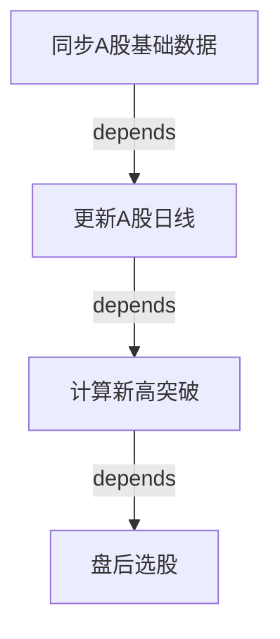

# 功能规格定义标准 (Feature Specification Standard)

**版本**: 1.0.0
**制定日期**: 2026-03-27
**适用范围**: 所有需要进行功能定义、测试设计、架构对照的软件系统

---

## 元思维：为什么需要这个标准

### 核心问题

当前软件行业在功能定义上存在三大系统性缺陷：

1. **定义维度不完整** - 只描述"做什么"，不描述"怎么验证"
2. **组织关系缺失** - 功能之间的层级、依赖、组合关系不清晰
3. **标准不统一** - 每个团队自创规格格式，无法复用和对比

### 本标准的设计哲学

我们借鉴以下成熟行业协议：

- **[OpenAPI 3.0 Operation Object](https://swagger.io/specification/)** - 输入/输出/参数/响应的完整定义模型
- **[ISO/IEC 25010 Functional Suitability](https://iso25000.com/index.php/en/iso-25000-standards/iso-25010)** - 功能完整性、正确性、适当性三维质量模型
- **[IEEE 29148-2011](https://standards.ieee.org/standard/29148-2011.html)** (替代 IEEE 830) - 需求工程的可验证性、可追溯性、无二义性原则
- **[C4 Model](https://c4model.com/)** - 系统/容器/组件/代码四层架构组织模型

### 本标准的三大支柱

1. **完整性** (Completeness) - 定义维度覆盖输入、输出、前置、后置、异常、边界、性能、安全
2. **可验证性** (Verifiability) - 每个维度都可量化、可测试、可自动化验证
3. **可追溯性** (Traceability) - 功能与需求、架构、测试、代码的双向映射关系

---

## 第一部分：功能定义的维度模型

### 1.1 核心维度 (必填)

基于 OpenAPI 3.0 和 ISO/IEC 25010，我们定义 8 个核心维度：

| 维度 ID | 维度名称 | 定义 | 量化标准 | 验证方式 |
|---------|----------|------|----------|----------|
| D-01 | 功能标识 | 全局唯一的功能 ID + 名称 | 符合命名规范 `[Domain]-[Module]-[Seq]` | 正则表达式校验 |
| D-02 | 输入规格 | 参数列表、类型、约束、默认值 | 每个参数有类型+约束+示例 | JSON Schema 验证 |
| D-03 | 前置条件 | 执行前必须满足的状态/数据/权限 | 可检查的布尔条件列表 | 前置断言测试 |
| D-04 | 正常输出 | 成功场景的输出格式、字段、示例 | 输出 Schema + 示例数据 | 输出 Schema 验证 |
| D-05 | 异常行为 | 错误场景 → 错误码 + 错误信息 | 每个异常有唯一错误码 | 异常路径测试 |
| D-06 | 边界值 | 空值、极值、特殊值的处理规则 | 边界值列表 + 预期行为 | 边界值测试 |
| D-07 | 后置条件 | 执行后系统状态的变化 | 可检查的状态变更列表 | 后置断言测试 |
| D-08 | 副作用 | 对其他模块/数据/外部系统的影响 | 副作用清单 + 影响范围 | 集成测试 |

### 1.2 扩展维度 (按需填写)

| 维度 ID | 维度名称 | 定义 | 量化标准 | 验证方式 |
|---------|----------|------|----------|----------|
| D-09 | 性能要求 | 响应时间、吞吐量、并发数 | 具体数值 + 测量方法 | 性能测试 |
| D-10 | 安全约束 | 认证、授权、数据加密要求 | 安全检查清单 | 安全测试 |
| D-11 | 幂等性 | 重复执行是否产生相同结果 | 是/否 + 幂等键设计 | 幂等性测试 |
| D-12 | 事务性 | 是否需要原子性、一致性保证 | 事务边界定义 | 事务测试 |
| D-13 | 可观测性 | 日志、指标、追踪要求 | 日志级别 + 关键指标 | 可观测性验证 |
| D-14 | 降级策略 | 依赖不可用时的降级行为 | 降级条件 + 降级行为 | 降级测试 |
| D-15 | 依赖关系 | 上游依赖、下游被依赖、依赖类型、证据与置信度 | Function ID / External ID / Data Object 列表 | 依赖图拓扑检查 + 证据回溯 |
| D-16 | 实现映射 | 入口、服务、仓储、模型、测试、配置等实现锚点 | 代码路径 / 配置路径 / 测试路径列表 | 路径存在性检查 + 证据回溯 |

说明：

- `D-09 ~ D-14` 保留为质量属性扩展维度，不得被依赖关系、实现映射等其他语义覆盖。
- `D-15`、`D-16` 用于补齐“组织关系缺失”和“实现可追溯性不足”问题，尤其适用于 `pb-review` 这类还原式评审流程。

### 1.3 维度完备性检查清单

功能规格必须通过以下检查：

- [ ] **输入完整性** - 所有输入参数都有类型、约束、默认值
- [ ] **输出完整性** - 正常输出和所有异常输出都有 Schema
- [ ] **前置明确性** - 前置条件可转化为可执行的检查代码
- [ ] **后置明确性** - 后置条件可转化为可执行的断言代码
- [ ] **边界覆盖性** - 至少覆盖空值、最小值、最大值、非法值
- [ ] **异常完备性** - 所有可能的失败路径都有定义
- [ ] **副作用透明性** - 所有副作用都被显式声明
- [ ] **可测试性** - 每个维度都可以编写自动化测试

---

## 第二部分：功能组织的层级模型

### 2.1 四层架构模型 (基于 C4 Model)

我们采用四层架构来组织功能：

```
System (系统)
  └─ Domain (业务域)
       └─ Module (模块)
            └─ Operation (操作)
```

#### Layer 1: System (系统层)

- **定义**: 完整的软件系统边界
- **示例**: Archer 量化分析平台
- **标识**: `SYS-{SystemName}`
- **职责**: 定义系统目标、角色、场景、约束

#### Layer 2: Domain (业务域层)

- **定义**: 系统内的业务领域划分
- **示例**: A股域、Token域、商品域
- **标识**: `DOM-{DomainName}`
- **职责**: 定义域内的核心概念、数据模型、业务规则

#### Layer 3: Module (模块层)

- **定义**: 域内的功能模块
- **示例**: 数据同步模块、趋势分析模块、选股模块
- **标识**: `MOD-{DomainName}-{ModuleName}`
- **职责**: 定义模块的服务接口、依赖关系、生命周期

#### Layer 4: Operation (操作层)

- **定义**: 模块内的原子操作
- **示例**: 同步A股基础数据、计算新高突破、盘后选股
- **标识**: `OPR-{DomainName}-{ModuleName}-{OperationName}`
- **职责**: 定义操作的输入/输出/前置/后置/异常/边界

### 2.2 功能 ID 命名规范

```
格式: {Layer}-{Domain}-{Module}-{Sequence}

示例:
- OPR-AS-SYNC-001  (A股域-同步模块-操作001)
- OPR-AS-ANLZ-005  (A股域-分析模块-操作005)
- OPR-TK-MNTR-003  (Token域-监控模块-操作003)

规则:
- Layer: SYS/DOM/MOD/OPR
- Domain: 2-4个大写字母缩写
- Module: 4个大写字母缩写
- Sequence: 3位数字，从001开始
```

### 2.2.1 `runtime_layer` 运行层补充字段

为了避免把“功能组织层级”和“技术运行层级”混为一谈，规格卡可选填 `runtime_layer` 字段，用于表达实现侧分层位置。

推荐取值：

| runtime_layer | 含义 |
|---------------|------|
| `entry` | CLI / API / 定时任务 / 页面入口 |
| `orchestration` | 编排器、应用服务、跨模块调度 |
| `service` | 领域服务、规则计算、读写协调 |
| `foundation` | Repository、模型、缓存、外部基础设施 |

约束：

- `layer` 继续表示 `System / Domain / Module / Operation` 这一功能组织层级。
- `runtime_layer` 只表达运行时职责分层，不能替代 `layer`。
- 当系统已有 L1-L4 / Hexagonal / Clean Architecture 等术语时，应通过 `metadata` 或扩展说明映射，而不是重定义 `layer`。

### 2.3 功能关系模型

功能之间存在五种关系：

| 关系类型 | 定义 | 表示方法 | 验证方式 |
|----------|------|----------|----------|
| **依赖** (Depends) | A 必须在 B 之后执行 | `A --depends--> B` | 依赖图拓扑排序 |
| **组合** (Composes) | A 由 B、C、D 组合而成 | `A --composes--> [B,C,D]` | 组合完整性检查 |
| **互斥** (Excludes) | A 和 B 不能同时执行 | `A --excludes--> B` | 互斥约束检查 |
| **触发** (Triggers) | A 执行后自动触发 B | `A --triggers--> B` | 触发链路追踪 |
| **替代** (Replaces) | A 可以替代 B | `A --replaces--> B` | 替代等价性验证 |

### 2.4 功能依赖图 (Mermaid 表示)



---

## 第三部分：功能规格卡模板

### 3.1 完整规格卡模板

```yaml
# 功能规格卡

## 基本信息
function_id: OPR-AS-SLCT-001
function_name: 盘后选股
layer: Operation
runtime_layer: entry
domain: A股域 (AShare)
module: 选股模块 (Selection)
version: 1.0.0
status: 已实现
owner: 选股服务团队

## 功能描述
summary: 整合新高突破和智能回调策略，输出候选股票列表
description: |
  基于已计算的新高突破缓存和智能回调算法，对A股市场进行盘后选股。
  输出符合条件的候选股票，并支持导出为CSV格式。

## D-01: 功能标识
function_id: OPR-AS-SLCT-001
function_name: 盘后选股
entry_point:
  type: CLI Command
  path: archer/apps/ashare/management/commands/select_stocks.py
  command: python manage.py select_stocks

## D-02: 输入规格
parameters:
  - name: date
    type: string
    format: YYYY-MM-DD
    required: false
    default: 最近交易日
    constraints:
      - 必须是有效的交易日
      - 不能是未来日期
    example: "2026-03-27"

  - name: output
    type: string
    format: file_path
    required: false
    default: null
    constraints:
      - 必须是有效的文件路径
      - 父目录必须存在
    example: "/tmp/selected_stocks.csv"

input_schema:
  type: object
  properties:
    date:
      type: string
      pattern: '^\d{4}-\d{2}-\d{2}$'
    output:
      type: string
  additionalProperties: false

## D-03: 前置条件
preconditions:
  - id: PRE-001
    description: A股日线数据已更新到目标日期
    check: |
      SELECT COUNT(*) FROM ashare_kline
      WHERE trade_date = :target_date
    expected: > 0

  - id: PRE-002
    description: 新高突破缓存已计算
    check: |
      SELECT COUNT(*) FROM breakout_cache
      WHERE calc_date = :target_date
    expected: > 0

  - id: PRE-003
    description: 数据库连接可用
    check: connection.is_alive()
    expected: true

## D-04: 正常输出
success_output:
  stdout:
    format: table
    columns:
      - name: 股票代码
        type: string
        example: "000001.SZ"
      - name: 股票名称
        type: string
        example: "平安银行"
      - name: 策略类型
        type: enum
        values: [新高突破, 智能回调]
      - name: 信号强度
        type: float
        range: [0.0, 1.0]

  csv_file:
    condition: output 参数不为空
    format: CSV
    encoding: UTF-8
    schema: 同 stdout

  return_code: 0

output_schema:
  type: object
  properties:
    candidates:
      type: array
      items:
        type: object
        properties:
          code: {type: string}
          name: {type: string}
          strategy: {type: string, enum: [新高突破, 智能回调]}
          signal_strength: {type: number, minimum: 0, maximum: 1}
        required: [code, name, strategy, signal_strength]

## D-05: 异常行为
exceptions:
  - error_code: ERR-SLCT-001
    scenario: 目标日期无K线数据
    trigger: precondition PRE-001 失败
    behavior: 快速失败，输出错误信息
    message: "目标日期 {date} 无K线数据，请先执行 update_ashare_klines"
    return_code: 1

  - error_code: ERR-SLCT-002
    scenario: 新高突破缓存未计算
    trigger: precondition PRE-002 失败
    behavior: 快速失败，输出错误信息
    message: "目标日期 {date} 新高突破缓存未计算，请先执行 compute_new_high_breakout"
    return_code: 1

  - error_code: ERR-SLCT-003
    scenario: 输出文件路径无效
    trigger: output 参数的父目录不存在
    behavior: 快速失败，输出错误信息
    message: "输出路径 {output} 的父目录不存在"
    return_code: 1

## D-06: 边界值
boundary_cases:
  - case: 空结果
    input: date = 某个无符合条件股票的日期
    expected: 输出空表格，CSV 文件包含表头但无数据行

  - case: 大量结果
    input: date = 某个符合条件股票超过1000只的日期
    expected: 正常输出所有结果，不截断

  - case: date 为 null
    input: date = null
    expected: 自动使用最近交易日

  - case: date 为非交易日
    input: date = "2026-03-29" (周六)
    expected: 报错 ERR-SLCT-004 "非交易日"

## D-07: 后置条件
postconditions:
  - id: POST-001
    description: 如果指定了 output 参数，CSV 文件已创建
    check: os.path.exists(output_path)
    expected: true

  - id: POST-002
    description: 数据库连接已正确关闭
    check: connection.is_closed()
    expected: true

## D-08: 副作用
side_effects:
  - target: 文件系统
    description: 如果指定 output 参数，会创建或覆盖 CSV 文件
    scope: 单个文件
    reversible: 是

  - target: 日志系统
    description: 记录选股执行日志
    scope: 日志文件
    reversible: 否

## D-15: 依赖关系
dependencies:
  upstream:
    - function_id: OPR-AS-ANLZ-001
      function_name: 计算新高突破
      dependency_type: data
      description: 盘后选股依赖已完成的新高突破缓存
      evidence_refs:
        - ev-010
      confidence: explicit
  downstream:
    - function_id: OPR-AS-EXPT-001
      function_name: 导出选股结果
      dependency_type: trigger
      description: 当传入 output 参数时触发 CSV 导出
      evidence_refs:
        - ev-011
      confidence: inferred
  external:
    - external_id: tushare-api
      dependency_type: external_system
      description: 需要 Tushare 提供补数能力
      evidence_refs:
        - ev-012
      confidence: explicit

## D-16: 实现映射
implementation_mapping:
  entrypoints:
    - path: archer/apps/ashare/management/commands/select_stocks.py
      role: command
  services:
    - path: archer/apps/ashare/services/select_stocks_overview_service.py
      role: core_service
  repositories:
    - path: archer/apps/ashare/repositories/trend_result_repository.py
      role: read_model
  models:
    - path: archer/apps/ashare/models.py
      symbols:
        - TrendResult
  tests:
    - path: archer/apps/ashare/tests/test_select_stocks_command.py
      role: verification
  configs:
    - path: archer/projects/quant/settings.py
      role: runtime_settings

## D-09: 性能要求 (可选)
performance:
  response_time:
    p50: < 5s
    p95: < 10s
    p99: < 15s
  throughput: N/A (非高频操作)
  concurrency: 1 (不支持并发)

## D-10: 安全约束 (可选)
security:
  authentication: 不需要
  authorization: 需要数据库读权限
  data_encryption: 不需要
  audit_log: 是

## 功能关系
relationships:
  depends_on:
    - OPR-AS-SYNC-002  # 更新A股日线
    - OPR-AS-ANLZ-001  # 计算新高突破
  composed_of: []
  excludes: []
  triggers: []
  replaces: []

## 验证方式
verification:
  unit_tests:
    - path: archer/apps/ashare/tests/test_select_stocks_command.py
      coverage: 85%

  integration_tests:
    - path: archer/apps/ashare/tests/integration/test_select_stocks_flow.py
      coverage: 90%

  e2e_tests:
    - path: tests/e2e/test_ashare_selection_workflow.py
      coverage: 100%

## 追溯关系
traceability:
  requirements:
    - REQ-AS-001: A股盘后选股需求
  architecture:
    - ARCH-AS-MOD-003: 选股模块设计
  code:
    - archer/apps/ashare/management/commands/select_stocks.py
    - archer/apps/ashare/services/selection_service.py
  tests:
    - archer/apps/ashare/tests/test_select_stocks_command.py

## 规格完备度
completeness:
  core_dimensions: 8/8  # D-01 到 D-08 全部完成
  extended_dimensions: 2/6  # D-09, D-10 完成
  verification_coverage: 85%
  traceability_coverage: 100%
  status: 完整
```

---

## 第四部分：功能规格文档结构

### 4.1 文档层级结构

```
{project}/docs/specifications/
├── system.md                    # 系统层规格
├── domains/                     # 业务域层规格
│   ├── ashare/
│   │   ├── domain.md           # A股域规格
│   │   ├── modules/            # 模块层规格
│   │   │   ├── sync.md         # 同步模块
│   │   │   ├── analysis.md     # 分析模块
│   │   │   └── selection.md    # 选股模块
│   │   └── operations/         # 操作层规格
│   │       ├── OPR-AS-SYNC-001.yaml
│   │       ├── OPR-AS-SYNC-002.yaml
│   │       └── OPR-AS-SLCT-001.yaml
│   ├── token/
│   └── commodity/
├── relationships/               # 关系定义
│   ├── dependency-graph.mmd    # 依赖图
│   ├── composition-map.mmd     # 组合图
│   └── trigger-chain.mmd       # 触发链
└── verification/                # 验证矩阵
    ├── test-coverage.md        # 测试覆盖
    └── traceability-matrix.md  # 追溯矩阵
```

### 4.2 系统层规格模板 (system.md)

```markdown
# 系统规格: {SystemName}

## 系统标识
- System ID: SYS-{SystemName}
- Version: x.y.z
- Owner: {TeamName}

## 系统目标 (Goal)
{系统要解决的核心问题}

## 角色定义 (Roles)
| 角色 ID | 角色名称 | 职责 | 权限 |
|---------|----------|------|------|
| ...     | ...      | ...  | ...  |

## 业务场景 (Scenarios)
| 场景 ID | 场景名称 | 涉及功能 | 优先级 |
|---------|----------|----------|--------|
| ...     | ...      | ...      | ...    |

## 系统约束 (Constraints)
| 约束 ID | 约束描述 | 影响范围 |
|---------|----------|----------|
| ...     | ...      | ...      |

## 非目标 (Non-goals)
- ...
```

### 4.3 业务域层规格模板 (domain.md)

```markdown
# 业务域规格: {DomainName}

## 域标识
- Domain ID: DOM-{DomainName}
- Parent System: SYS-{SystemName}

## 核心概念
| 概念 | 定义 | 数据模型 |
|------|------|----------|
| ...  | ...  | ...      |

## 业务规则
| 规则 ID | 规则描述 | 关联功能 |
|---------|----------|----------|
| ...     | ...      | ...      |

## 模块列表
| 模块 ID | 模块名称 | 职责 |
|---------|----------|------|
| ...     | ...      | ...  |
```

### 4.4 模块层规格模板 (module.md)

```markdown
# 模块规格: {ModuleName}

## 模块标识
- Module ID: MOD-{DomainName}-{ModuleName}
- Parent Domain: DOM-{DomainName}

## 服务接口
| 接口 | 操作列表 |
|------|----------|
| ...  | ...      |

## 依赖关系
- 依赖模块: [...]
- 被依赖模块: [...]

## 操作列表
| 操作 ID | 操作名称 | 规格文件 |
|---------|----------|----------|
| ...     | ...      | ...      |
```

---

## 第五部分：验证与追溯体系

### 5.1 测试覆盖矩阵

```markdown
# 测试覆盖矩阵

| 功能 ID | 单元测试 | 集成测试 | E2E测试 | 覆盖率 | 状态 |
|---------|----------|----------|---------|--------|------|
| OPR-AS-SLCT-001 | ✓ | ✓ | ✓ | 85% | 通过 |
| OPR-AS-SYNC-001 | ✓ | ✓ | ✗ | 60% | 待补 |
| ...             | ... | ... | ... | ... | ... |

## 覆盖率统计
- 单元测试覆盖: 85/100 (85%)
- 集成测试覆盖: 70/100 (70%)
- E2E测试覆盖: 50/100 (50%)
```

### 5.2 追溯矩阵

```markdown
# 追溯矩阵

| 需求 ID | 架构 ID | 功能 ID | 测试 ID | 代码路径 | 状态 |
|---------|---------|---------|---------|----------|------|
| REQ-AS-001 | ARCH-AS-MOD-003 | OPR-AS-SLCT-001 | TEST-AS-SLCT-001 | select_stocks.py | 已实现 |
| ...        | ...             | ...             | ...              | ...              | ...    |
```

### 5.3 规格完备度检查

```python
# 规格完备度自动检查脚本

def check_specification_completeness(spec_file):
    """检查功能规格的完备度"""

    checks = {
        'core_dimensions': [
            'D-01: 功能标识',
            'D-02: 输入规格',
            'D-03: 前置条件',
            'D-04: 正常输出',
            'D-05: 异常行为',
            'D-06: 边界值',
            'D-07: 后置条件',
            'D-08: 副作用',
        ],
        'relationships': [
            'depends_on',
            'composed_of',
        ],
        'verification': [
            'unit_tests',
            'integration_tests',
        ],
        'traceability': [
            'requirements',
            'architecture',
            'code',
            'tests',
        ],
    }

    # 检查逻辑...
    return completeness_score
```

---

## 第六部分：标准应用指南

### 6.1 何时使用本标准

**必须使用**:
- 新系统的功能定义
- 现有系统的功能重构
- 需要编写测试用例的场景
- 需要进行架构对照的场景
- 需要进行交付验收的场景

**可选使用**:
- 原型验证阶段
- 一次性脚本
- 内部工具

### 6.2 标准实施流程


### 6.3 标准演进机制

本标准采用语义化版本控制:

- **主版本** (Major): 维度模型或层级模型的重大变更
- **次版本** (Minor): 新增维度或关系类型
- **修订版本** (Patch): 模板优化或示例更新

---

## 附录 A: 术语表

| 术语 | 定义 | 来源标准 |
|------|------|----------|
| Operation | 原子级的可执行功能单元 | OpenAPI 3.0 |
| Functional Suitability | 功能适用性，包括完整性、正确性、适当性 | ISO/IEC 25010 |
| Verifiability | 可验证性，需求可被测试验证 | IEEE 29148 |
| Traceability | 可追溯性，需求与实现的双向映射 | IEEE 29148 |
| Component | 组件，容器内的功能模块 | C4 Model |

---

## 附录 B: 参考资料

1. [OpenAPI Specification 3.0](https://swagger.io/specification/) - API 规格定义标准
2. [ISO/IEC 25010:2011](https://iso25000.com/index.php/en/iso-25000-standards/iso-25010) - 软件质量模型
3. [IEEE 29148-2011](https://standards.ieee.org/standard/29148-2011.html) - 需求工程标准
4. [C4 Model](https://c4model.com/) - 软件架构可视化模型
5. [JSON Schema](https://json-schema.org/) - 数据结构验证标准

---

**文档状态**: 草案
**下一步**: 基于本标准重构 Archer 评审报告
