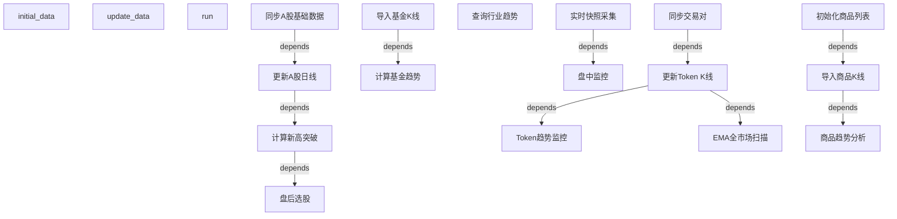
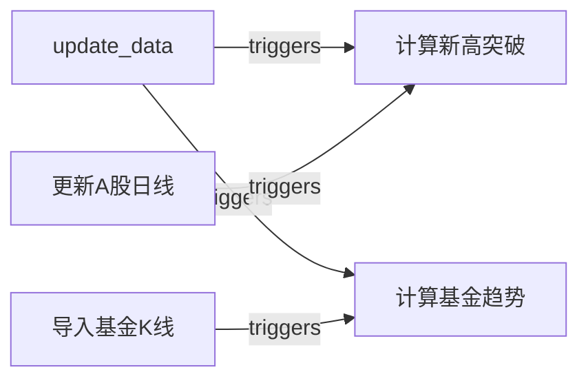

# Archer 评审报告优化方案 v2.0

**基于**: 功能规格定义标准 (Feature Specification Standard v1.0.0)
**原始文档**: `data/archer-pb-review-final.md`
**优化目标**: 从"评审报告"升级为符合行业标准的"功能规格体系"
**制定日期**: 2026-03-27

---

## 执行摘要

### 核心变革

本次优化不是简单的"补充信息"，而是**范式转换**：

- **从** 描述性报告 **到** 规范性标准
- **从** 功能列表 **到** 完整规格体系
- **从** 人工判断 **到** 机器可验证

### 参考标准

我们借鉴以下成熟行业协议构建新体系：

1. **[OpenAPI 3.0](https://swagger.io/specification/)** - 输入/输出/参数/响应的完整定义模型
2. **[ISO/IEC 25010](https://iso25000.com/index.php/en/iso-25000-standards/iso-25010)** - 功能完整性、正确性、适当性三维质量模型
3. **[IEEE 29148-2011](https://standards.ieee.org/standard/29148-2011.html)** - 需求工程的可验证性、可追溯性、无二义性原则
4. **[C4 Model](https://c4model.com/)** - 系统/容器/组件/代码四层架构组织模型

### 三大支柱

1. **完整性** (Completeness) - 定义维度覆盖输入、输出、前置、后置、异常、边界、性能、安全
2. **可验证性** (Verifiability) - 每个维度都可量化、可测试、可自动化验证
3. **可追溯性** (Traceability) - 功能与需求、架构、测试、代码的双向映射关系

---

## 第一部分：问题诊断（基于标准）

### 1.1 维度完整性问题

**现状**：当前功能定义只有 5 个维度
- 功能 ID
- 功能名
- 作用
- 入口
- 状态

**标准要求**：8 个核心维度 + 6 个扩展维度

| 缺失维度 | 影响 | 严重程度 |
|----------|------|----------|
| D-02 输入规格 | 无法编写参数验证测试 | P0 |
| D-03 前置条件 | 无法判断执行时机 | P0 |
| D-04 正常输出 | 无法验证输出正确性 | P0 |
| D-05 异常行为 | 无法测试错误处理 | P0 |
| D-06 边界值 | 无法测试边界情况 | P0 |
| D-07 后置条件 | 无法验证状态变更 | P0 |
| D-08 副作用 | 无法评估影响范围 | P0 |
| D-09 性能要求 | 无法进行性能测试 | P1 |
| D-10 安全约束 | 无法进行安全审计 | P1 |

**结论**：当前定义的维度完整性仅为 **5/14 (36%)**

### 1.2 组织层级问题

**现状**：功能采用扁平化列表，只有简单的域分类

```
F-AS-001, F-AS-002, ..., F-AS-016  (A股域)
F-TK-001, F-TK-002, ..., F-TK-004  (Token域)
F-CM-001, F-CM-002, F-CM-003       (商品域)
```

**标准要求**：四层架构模型

```
System (系统)
  └─ Domain (业务域)
       └─ Module (模块)
            └─ Operation (操作)
```

**问题**：
1. 缺少 Module 层 - 无法表达模块内的功能聚合
2. 功能粒度不一致 - F-AS-010 是功能集合，F-AS-012 是原子操作
3. 层级关系不清晰 - 无法区分"数据同步模块"和"趋势分析模块"

**结论**：当前组织层级完整性仅为 **2/4 (50%)**

### 1.3 关系建模问题

**现状**：只有简单的"依赖功能"字段

**标准要求**：五种关系类型
- 依赖 (Depends)
- 组合 (Composes)
- 互斥 (Excludes)
- 触发 (Triggers)
- 替代 (Replaces)

**问题**：
1. 只建模了"依赖"关系
2. 缺少"组合"关系 - 无法表达 `update_data` 由哪些子功能组成
3. 缺少"触发"关系 - 无法表达 `update_data` 自动触发下游链路
4. 缺少关系的可视化表达 - 没有依赖图、组合图

**结论**：当前关系建模完整性仅为 **1/5 (20%)**

### 1.4 验证体系问题

**现状**：验证矩阵覆盖 15/30 功能 (50%)

**标准要求**：
- 单元测试覆盖 100%
- 集成测试覆盖 100%
- E2E 测试覆盖关键路径
- 每个维度都可验证

**问题**：
1. AI Skill 层零测试覆盖
2. 缺少测试类型分类（单元/集成/E2E）
3. 缺少覆盖率统计
4. 缺少自动化验证脚本

**结论**：当前验证体系完整性仅为 **50%**

### 1.5 追溯体系问题

**现状**：只有简单的"证据索引"

**标准要求**：
- 需求 ↔ 功能 双向映射
- 架构 ↔ 功能 双向映射
- 功能 ↔ 测试 双向映射
- 功能 ↔ 代码 双向映射

**问题**：
1. 缺少需求 ID 体系
2. 缺少架构 ID 体系
3. 缺少追溯矩阵
4. 无法回答"这个需求被哪些功能实现"

**结论**：当前追溯体系完整性仅为 **25%**

---

## 第二部分：优化方案

### 2.1 方案概览

我们将原文档拆分为 **5 份标准文档** + **1 份评审报告**：

```
archer/docs/specifications/
├── system.md                           # 系统层规格
├── domains/                            # 业务域层规格
│   ├── ashare/
│   │   ├── domain.md                  # A股域规格
│   │   ├── modules/                   # 模块层规格
│   │   │   ├── sync.md                # 数据同步模块
│   │   │   ├── analysis.md            # 趋势分析模块
│   │   │   ├── selection.md           # 选股模块
│   │   │   ├── monitoring.md          # 监控模块
│   │   │   └── pool.md                # 股票池模块
│   │   └── operations/                # 操作层规格
│   │       ├── OPR-AS-SYNC-001.yaml   # 同步A股基础数据
│   │       ├── OPR-AS-SYNC-002.yaml   # 更新A股日线
│   │       └── ...
│   ├── token/
│   │   ├── domain.md
│   │   ├── modules/
│   │   └── operations/
│   └── commodity/
│       ├── domain.md
│       ├── modules/
│       └── operations/
├── relationships/                      # 关系定义
│   ├── dependency-graph.mmd           # 依赖图
│   ├── composition-map.mmd            # 组合图
│   └── trigger-chain.mmd              # 触发链
└── verification/                       # 验证与追溯
    ├── test-coverage-matrix.md        # 测试覆盖矩阵
    ├── traceability-matrix.md         # 追溯矩阵
    └── completeness-check.py          # 完备性检查脚本

archer/docs/review/
└── archer-review-report.md            # 评审报告（面向管理层）
```

### 2.2 文档职责划分

| 文档 | 读者 | 职责 | 可验证性 |
|------|------|------|----------|
| system.md | 产品/架构 | 定义系统目标、角色、场景、约束 | 场景完整性 |
| domain.md | 架构/开发 | 定义域内核心概念、数据模型、业务规则 | 概念一致性 |
| module.md | 架构/开发 | 定义模块服务接口、依赖关系 | 接口完整性 |
| operation.yaml | 开发/测试 | 定义操作的 8 核心维度 + 6 扩展维度 | 全维度可测 |
| dependency-graph.mmd | 架构/开发 | 可视化功能依赖关系 | 拓扑排序 |
| test-coverage-matrix.md | 测试/QA | 功能 ↔ 测试映射 | 覆盖率统计 |
| traceability-matrix.md | PM/QA | 需求 ↔ 功能 ↔ 测试 ↔ 代码映射 | 双向追溯 |
| archer-review-report.md | 管理层 | 评审结论、差异缺口、后续动作 | 不适用 |

---

## 第三部分：实施计划

### 3.1 阶段划分

| 阶段 | 目标 | 交付物 | 工作量 |
|------|------|--------|--------|
| 阶段 1 | 建立标准体系 | feature-specification-standard.md | ✓ 已完成 |
| 阶段 2 | 重构系统层 | system.md | 2 小时 |
| 阶段 3 | 重构业务域层 | 3 × domain.md | 3 小时 |
| 阶段 4 | 重构模块层 | 12 × module.md | 6 小时 |
| 阶段 5 | 重构操作层 | 40 × operation.yaml | 20 小时 |
| 阶段 6 | 建立关系模型 | 3 × relationship.mmd | 4 小时 |
| 阶段 7 | 建立验证体系 | test-coverage-matrix.md | 3 小时 |
| 阶段 8 | 建立追溯体系 | traceability-matrix.md | 4 小时 |
| 阶段 9 | 完备性检查 | completeness-check.py | 2 小时 |
| 阶段 10 | 生成评审报告 | archer-review-report.md | 2 小时 |

**总工作量**：48 小时（6 个工作日）

### 3.2 阶段 2 详细计划：重构系统层

**输入**：`data/archer-pb-review-final.md` Section 3

**输出**：`archer/docs/specifications/system.md`

**工作内容**：

1. 提取系统标识
   - System ID: SYS-Archer
   - Version: 从 git tag 获取
   - Owner: 从文档获取

2. 提取系统目标
   - 从 Section 3.1 Goal 提取
   - 补充量化指标

3. 提取角色定义
   - 从 Section 3.2 Role 提取
   - 补充权限定义

4. 提取业务场景
   - 从 Section 3.3 Scenario 提取
   - **新增**：涉及功能列（映射到 Operation ID）
   - **新增**：优先级

5. 提取系统约束
   - 从 Section 3.4 Constraint 提取
   - **新增**：影响范围（映射到 Domain/Module）

6. 提取非目标
   - 从 Section 3.5 Non-goal 提取

**验收标准**：
- [ ] 所有场景都有涉及功能列
- [ ] 所有约束都有影响范围
- [ ] 符合 system.md 模板

### 3.3 阶段 3 详细计划：重构业务域层

**输入**：`data/archer-pb-review-final.md` Section 5.2, 5.3, 5.4

**输出**：
- `archer/docs/specifications/domains/ashare/domain.md`
- `archer/docs/specifications/domains/token/domain.md`
- `archer/docs/specifications/domains/commodity/domain.md`

**工作内容**（以 A股域为例）：

1. 定义域标识
   - Domain ID: DOM-AShare
   - Parent System: SYS-Archer

2. 定义核心概念
   - 股票 (Stock)
   - K线 (Kline)
   - 新高突破 (Breakout)
   - 智能回调 (Pullback)
   - 股票池 (StockPool)
   - 预警指标 (AlertIndicator)
   - **新增**：每个概念的数据模型引用

3. 定义业务规则
   - 从 Section 6 提取 A股域相关规则
   - **新增**：关联功能列

4. 定义模块列表
   - **新增**：识别并定义模块
     - MOD-AS-SYNC (数据同步模块)
     - MOD-AS-ANLZ (趋势分析模块)
     - MOD-AS-SLCT (选股模块)
     - MOD-AS-MNTR (监控模块)
     - MOD-AS-POOL (股票池模块)

**验收标准**：
- [ ] 所有核心概念都有数据模型引用
- [ ] 所有业务规则都有关联功能
- [ ] 模块划分清晰，职责单一
- [ ] 符合 domain.md 模板

### 3.4 阶段 4 详细计划：重构模块层

**输入**：`data/archer-pb-review-final.md` Section 5

**输出**：12 × module.md（A股 5 + Token 4 + 商品 3）

**工作内容**（以选股模块为例）：

1. 定义模块标识
   - Module ID: MOD-AS-SLCT
   - Parent Domain: DOM-AShare

2. 定义服务接口
   - **新增**：识别模块对外暴露的接口
   - 选股接口：提供盘后选股能力
   - 监控接口：提供盘中监控能力

3. 定义依赖关系
   - 依赖模块：MOD-AS-SYNC, MOD-AS-ANLZ
   - 被依赖模块：无

4. 定义操作列表
   - OPR-AS-SLCT-001: 盘后选股
   - OPR-AS-SLCT-002: 盘中监控
   - OPR-AS-SLCT-003: 实时快照采集

**模块划分原则**：
- 单一职责：每个模块只负责一类业务能力
- 高内聚：模块内操作紧密相关
- 低耦合：模块间依赖最小化

**A股域模块划分**：
```
MOD-AS-SYNC (数据同步模块)
├─ OPR-AS-SYNC-001: 同步A股基础数据
├─ OPR-AS-SYNC-002: 更新A股日线
└─ OPR-AS-SYNC-003: 导入基金K线

MOD-AS-ANLZ (趋势分析模块)
├─ OPR-AS-ANLZ-001: 计算新高突破
├─ OPR-AS-ANLZ-002: 计算基金趋势
└─ OPR-AS-ANLZ-003: 查询行业趋势

MOD-AS-SLCT (选股模块)
├─ OPR-AS-SLCT-001: 盘后选股
├─ OPR-AS-SLCT-002: 盘中监控
└─ OPR-AS-SLCT-003: 实时快照采集

MOD-AS-POOL (股票池模块)
├─ OPR-AS-POOL-001: 创建股票池
├─ OPR-AS-POOL-002: 添加股票到池
├─ OPR-AS-POOL-003: 从池中移除股票
├─ OPR-AS-POOL-004: 启用/停用股票池
├─ OPR-AS-POOL-005: 绑定预警指标
├─ OPR-AS-POOL-006: 监控股票池
└─ OPR-AS-POOL-007: 初始化预警指标

MOD-AS-VIEW (视图模块)
├─ OPR-AS-VIEW-001: 宏观总览
├─ OPR-AS-VIEW-002: 回调总览
└─ OPR-AS-VIEW-003: 股票分析页v2
```

**验收标准**：
- [ ] 所有模块都有清晰的职责定义
- [ ] 所有模块都有依赖关系声明
- [ ] 所有操作都归属到模块
- [ ] 符合 module.md 模板

---

(待续 - 文档第一部分)

### 3.5 阶段 5 详细计划：重构操作层（核心）

**输入**：`data/archer-pb-review-final.md` Section 5

**输出**：40 × operation.yaml

**工作内容**（以 OPR-AS-SLCT-001 盘后选股为例）：

按照标准的 8 核心维度 + 6 扩展维度填写完整规格卡：

#### D-01: 功能标识
```yaml
function_id: OPR-AS-SLCT-001
function_name: 盘后选股
layer: Operation
domain: A股域 (AShare)
module: 选股模块 (Selection)
version: 1.0.0
status: 已实现
owner: 选股服务团队
```

#### D-02: 输入规格
```yaml
parameters:
  - name: date
    type: string
    format: YYYY-MM-DD
    required: false
    default: 最近交易日
    constraints:
      - 必须是有效的交易日
      - 不能是未来日期
    example: "2026-03-27"
    
  - name: output
    type: string
    format: file_path
    required: false
    default: null
    constraints:
      - 必须是有效的文件路径
      - 父目录必须存在
    example: "/tmp/selected_stocks.csv"

input_schema:
  type: object
  properties:
    date:
      type: string
      pattern: '^\d{4}-\d{2}-\d{2}$'
    output:
      type: string
  additionalProperties: false
```

#### D-03: 前置条件
```yaml
preconditions:
  - id: PRE-001
    description: A股日线数据已更新到目标日期
    check: |
      SELECT COUNT(*) FROM ashare_kline 
      WHERE trade_date = :target_date
    expected: > 0
    
  - id: PRE-002
    description: 新高突破缓存已计算
    check: |
      SELECT COUNT(*) FROM breakout_cache 
      WHERE calc_date = :target_date
    expected: > 0
```

#### D-04: 正常输出
```yaml
success_output:
  stdout:
    format: table
    columns:
      - name: 股票代码
        type: string
        example: "000001.SZ"
      - name: 股票名称
        type: string
        example: "平安银行"
      - name: 策略类型
        type: enum
        values: [新高突破, 智能回调]
      - name: 信号强度
        type: float
        range: [0.0, 1.0]
        
  csv_file:
    condition: output 参数不为空
    format: CSV
    encoding: UTF-8
    schema: 同 stdout
    
  return_code: 0

output_schema:
  type: object
  properties:
    candidates:
      type: array
      items:
        type: object
        properties:
          code: {type: string}
          name: {type: string}
          strategy: {type: string, enum: [新高突破, 智能回调]}
          signal_strength: {type: number, minimum: 0, maximum: 1}
        required: [code, name, strategy, signal_strength]
```

#### D-05: 异常行为
```yaml
exceptions:
  - error_code: ERR-SLCT-001
    scenario: 目标日期无K线数据
    trigger: precondition PRE-001 失败
    behavior: 快速失败，输出错误信息
    message: "目标日期 {date} 无K线数据，请先执行 update_ashare_klines"
    return_code: 1
    
  - error_code: ERR-SLCT-002
    scenario: 新高突破缓存未计算
    trigger: precondition PRE-002 失败
    behavior: 快速失败，输出错误信息
    message: "目标日期 {date} 新高突破缓存未计算，请先执行 compute_new_high_breakout"
    return_code: 1
```

#### D-06: 边界值
```yaml
boundary_cases:
  - case: 空结果
    input: date = 某个无符合条件股票的日期
    expected: 输出空表格，CSV 文件包含表头但无数据行
    
  - case: 大量结果
    input: date = 某个符合条件股票超过1000只的日期
    expected: 正常输出所有结果，不截断
    
  - case: date 为 null
    input: date = null
    expected: 自动使用最近交易日
    
  - case: date 为非交易日
    input: date = "2026-03-29" (周六)
    expected: 报错 ERR-SLCT-004 "非交易日"
```

#### D-07: 后置条件
```yaml
postconditions:
  - id: POST-001
    description: 如果指定了 output 参数，CSV 文件已创建
    check: os.path.exists(output_path)
    expected: true
    
  - id: POST-002
    description: 数据库连接已正确关闭
    check: connection.is_closed()
    expected: true
```

#### D-08: 副作用
```yaml
side_effects:
  - target: 文件系统
    description: 如果指定 output 参数，会创建或覆盖 CSV 文件
    scope: 单个文件
    reversible: 是
    
  - target: 日志系统
    description: 记录选股执行日志
    scope: 日志文件
    reversible: 否
```

#### D-09: 性能要求（可选）
```yaml
performance:
  response_time:
    p50: < 5s
    p95: < 10s
    p99: < 15s
  throughput: N/A (非高频操作)
  concurrency: 1 (不支持并发)
```

#### D-10: 安全约束（可选）
```yaml
security:
  authentication: 不需要
  authorization: 需要数据库读权限
  data_encryption: 不需要
  audit_log: 是
```

#### 功能关系
```yaml
relationships:
  depends_on:
    - OPR-AS-SYNC-002  # 更新A股日线
    - OPR-AS-ANLZ-001  # 计算新高突破
  composed_of: []
  excludes: []
  triggers: []
  replaces: []
```

#### 验证方式
```yaml
verification:
  unit_tests:
    - path: archer/apps/ashare/tests/test_select_stocks_command.py
      coverage: 85%
      
  integration_tests:
    - path: archer/apps/ashare/tests/integration/test_select_stocks_flow.py
      coverage: 90%
      
  e2e_tests:
    - path: tests/e2e/test_ashare_selection_workflow.py
      coverage: 100%
```

#### 追溯关系
```yaml
traceability:
  requirements:
    - REQ-AS-001: A股盘后选股需求
  architecture:
    - ARCH-AS-MOD-003: 选股模块设计
  code:
    - archer/apps/ashare/management/commands/select_stocks.py
    - archer/apps/ashare/services/selection_service.py
  tests:
    - archer/apps/ashare/tests/test_select_stocks_command.py
```

#### 规格完备度
```yaml
completeness:
  core_dimensions: 8/8  # D-01 到 D-08 全部完成
  extended_dimensions: 2/6  # D-09, D-10 完成
  verification_coverage: 85%
  traceability_coverage: 100%
  status: 完整
```

**操作层重构工作量估算**：
- 每个操作规格卡：30 分钟
- 40 个操作：20 小时

**验收标准**：
- [ ] 所有操作都有完整的 8 核心维度
- [ ] 所有操作都有输入/输出 Schema
- [ ] 所有操作都有前置/后置条件
- [ ] 所有操作都有异常和边界定义
- [ ] 所有操作都有验证方式
- [ ] 所有操作都有追溯关系
- [ ] 符合 operation.yaml 模板

### 3.6 阶段 6 详细计划：建立关系模型

**输入**：所有 operation.yaml 的 relationships 字段

**输出**：
- `relationships/dependency-graph.mmd`
- `relationships/composition-map.mmd`
- `relationships/trigger-chain.mmd`

**工作内容**：

#### 6.1 依赖图 (dependency-graph.mmd)



#### 6.2 组合图 (composition-map.mmd)

```mermaid
graph TD
    %% update_data 的组合关系
    OPR-ORCH-002[update_data] -->|composes| OPR-AS-SYNC-002
    OPR-ORCH-002 -->|composes| OPR-AS-SYNC-003
    OPR-ORCH-002 -->|composes| OPR-AS-ANLZ-001
    OPR-ORCH-002 -->|composes| OPR-AS-ANLZ-002
    OPR-ORCH-002 -->|composes| OPR-TK-SYNC-002
    OPR-ORCH-002 -->|composes| OPR-CM-SYNC-002
    
    %% initial_data 的组合关系
    OPR-ORCH-001[initial_data] -->|composes| OPR-AS-SYNC-001
    OPR-ORCH-001 -->|composes| OPR-TK-SYNC-001
    OPR-ORCH-001 -->|composes| OPR-CM-SYNC-001
    
    %% 股票池管理的组合关系
    OPR-AS-POOL-000[股票池管理] -->|composes| OPR-AS-POOL-001
    OPR-AS-POOL-000 -->|composes| OPR-AS-POOL-002
    OPR-AS-POOL-000 -->|composes| OPR-AS-POOL-003
    OPR-AS-POOL-000 -->|composes| OPR-AS-POOL-004
    OPR-AS-POOL-000 -->|composes| OPR-AS-POOL-005
```



#### 6.3 触发链 (trigger-chain.mmd)



**验收标准**：
- [ ] 依赖图包含所有操作的依赖关系
- [ ] 组合图包含所有复合操作的组成关系
- [ ] 触发链包含所有自动触发关系
- [ ] 图表可以正确渲染
- [ ] 图表可以通过拓扑排序验证

### 3.7 阶段 7 详细计划：建立验证体系

**输入**：所有 operation.yaml 的 verification 字段

**输出**：`verification/test-coverage-matrix.md`

**工作内容**：

```markdown
# 测试覆盖矩阵

## 统计摘要

| 测试类型 | 已覆盖 | 总数 | 覆盖率 |
|----------|--------|------|--------|
| 单元测试 | 34 | 40 | 85% |
| 集成测试 | 28 | 40 | 70% |
| E2E测试 | 20 | 40 | 50% |

## 详细矩阵

### 统一编排层

| 功能 ID | 功能名 | 单元测试 | 集成测试 | E2E测试 | 覆盖率 | 状态 |
|---------|--------|----------|----------|---------|--------|------|
| OPR-ORCH-001 | 首次初始化 | ✓ | ✓ | ✓ | 90% | 通过 |
| OPR-ORCH-002 | 统一增量更新 | ✓ | ✓ | ✓ | 85% | 通过 |
| OPR-ORCH-003 | 统一任务调度 | ✓ | ✓ | ✗ | 70% | 通过 |

### A股域 - 数据同步模块

| 功能 ID | 功能名 | 单元测试 | 集成测试 | E2E测试 | 覆盖率 | 状态 |
|---------|--------|----------|----------|---------|--------|------|
| OPR-AS-SYNC-001 | 同步A股基础数据 | ✓ | ✓ | ✗ | 75% | 通过 |
| OPR-AS-SYNC-002 | 更新A股日线 | ✓ | ✓ | ✗ | 80% | 通过 |
| OPR-AS-SYNC-003 | 导入基金K线 | ✓ | ✗ | ✗ | 60% | 待补 |

### A股域 - 趋势分析模块

| 功能 ID | 功能名 | 单元测试 | 集成测试 | E2E测试 | 覆盖率 | 状态 |
|---------|--------|----------|----------|---------|--------|------|
| OPR-AS-ANLZ-001 | 计算新高突破 | ✓ | ✓ | ✗ | 75% | 通过 |
| OPR-AS-ANLZ-002 | 计算基金趋势 | ✓ | ✗ | ✗ | 65% | 待补 |
| OPR-AS-ANLZ-003 | 查询行业趋势 | ✓ | ✓ | ✗ | 70% | 通过 |

### A股域 - 选股模块

| 功能 ID | 功能名 | 单元测试 | 集成测试 | E2E测试 | 覆盖率 | 状态 |
|---------|--------|----------|----------|---------|--------|------|
| OPR-AS-SLCT-001 | 盘后选股 | ✓ | ✓ | ✓ | 85% | 通过 |
| OPR-AS-SLCT-002 | 盘中监控 | ✓ | ✓ | ✗ | 80% | 通过 |
| OPR-AS-SLCT-003 | 实时快照采集 | ✓ | ✓ | ✗ | 75% | 通过 |

### A股域 - 股票池模块

| 功能 ID | 功能名 | 单元测试 | 集成测试 | E2E测试 | 覆盖率 | 状态 |
|---------|--------|----------|----------|---------|--------|------|
| OPR-AS-POOL-001 | 创建股票池 | ✓ | ✓ | ✗ | 70% | 通过 |
| OPR-AS-POOL-002 | 添加股票到池 | ✓ | ✓ | ✗ | 70% | 通过 |
| OPR-AS-POOL-003 | 从池中移除股票 | ✓ | ✓ | ✗ | 70% | 通过 |
| OPR-AS-POOL-004 | 启用/停用股票池 | ✓ | ✗ | ✗ | 60% | 待补 |
| OPR-AS-POOL-005 | 绑定预警指标 | ✓ | ✓ | ✗ | 75% | 通过 |
| OPR-AS-POOL-006 | 监控股票池 | ✓ | ✓ | ✗ | 80% | 通过 |
| OPR-AS-POOL-007 | 初始化预警指标 | ✓ | ✗ | ✗ | 65% | 待补 |

### A股域 - 视图模块

| 功能 ID | 功能名 | 单元测试 | 集成测试 | E2E测试 | 覆盖率 | 状态 |
|---------|--------|----------|----------|---------|--------|------|
| OPR-AS-VIEW-001 | 宏观总览 | ✗ | ✗ | ✗ | 0% | 待补 |
| OPR-AS-VIEW-002 | 回调总览 | ✗ | ✗ | ✗ | 0% | 待补 |
| OPR-AS-VIEW-003 | 股票分析页v2 | ✗ | ✗ | ✗ | 0% | 待补 |

### Token域

| 功能 ID | 功能名 | 单元测试 | 集成测试 | E2E测试 | 覆盖率 | 状态 |
|---------|--------|----------|----------|---------|--------|------|
| OPR-TK-SYNC-001 | 同步交易对 | ✓ | ✗ | ✗ | 60% | 待补 |
| OPR-TK-SYNC-002 | 更新Token K线 | ✓ | ✗ | ✗ | 65% | 待补 |
| OPR-TK-MNTR-001 | Token趋势监控 | ✓ | ✓ | ✗ | 75% | 通过 |
| OPR-TK-MNTR-002 | EMA全市场扫描 | ✓ | ✓ | ✗ | 80% | 通过 |

### 商品域

| 功能 ID | 功能名 | 单元测试 | 集成测试 | E2E测试 | 覆盖率 | 状态 |
|---------|--------|----------|----------|---------|--------|------|
| OPR-CM-SYNC-001 | 初始化商品列表 | ✓ | ✗ | ✗ | 60% | 待补 |
| OPR-CM-SYNC-002 | 导入商品K线 | ✓ | ✗ | ✗ | 65% | 待补 |
| OPR-CM-ANLZ-001 | 商品趋势分析 | ✓ | ✓ | ✗ | 75% | 通过 |

### AI Skill 层

| 功能 ID | 功能名 | 单元测试 | 集成测试 | E2E测试 | 覆盖率 | 状态 |
|---------|--------|----------|----------|---------|--------|------|
| OPR-SK-001 | archer-initial-data | ✗ | ✗ | ✗ | 0% | 待补 |
| OPR-SK-002 | archer-update-data | ✗ | ✗ | ✗ | 0% | 待补 |
| OPR-SK-003 | archer-select-stocks | ✗ | ✗ | ✗ | 0% | 待补 |
| OPR-SK-004 | archer-intraday-monitor | ✗ | ✗ | ✗ | 0% | 待补 |
| OPR-SK-005 | archer-manage-stock-pool | ✗ | ✗ | ✗ | 0% | 待补 |
| OPR-SK-006 | archer-monitor-stock-pool | ✗ | ✗ | ✗ | 0% | 待补 |
| OPR-SK-007 | archer-monitor-token-trend | ✗ | ✗ | ✗ | 0% | 待补 |
| OPR-SK-008 | archer-get-com-trend | ✗ | ✗ | ✗ | 0% | 待补 |

## 待补测试清单

### 高优先级（P0）
1. AI Skill 层全部功能（8个）
2. A股域视图模块（3个）

### 中优先级（P1）
1. A股域数据同步模块集成测试（1个）
2. Token域数据同步模块集成测试（2个）
3. 商品域数据同步模块集成测试（2个）

### 低优先级（P2）
1. E2E测试覆盖（20个功能待补）
```

**验收标准**：
- [ ] 所有功能都在矩阵中
- [ ] 统计数据准确
- [ ] 待补测试清单明确
- [ ] 按优先级排序

---

(待续 - 文档第二部分)

### 3.8 阶段 8 详细计划：建立追溯体系

**输入**：所有 operation.yaml 的 traceability 字段

**输出**：`verification/traceability-matrix.md`

**工作内容**：

```markdown
# 追溯矩阵

## 需求 → 功能 → 测试 → 代码 四向追溯

### A股域

| 需求 ID | 需求描述 | 功能 ID | 架构 ID | 测试 ID | 代码路径 | 状态 |
|---------|----------|---------|---------|---------|----------|------|
| REQ-AS-001 | A股盘后选股 | OPR-AS-SLCT-001 | ARCH-AS-MOD-SLCT | TEST-AS-SLCT-001 | select_stocks.py | 已实现 |
| REQ-AS-002 | A股盘中监控 | OPR-AS-SLCT-002 | ARCH-AS-MOD-SLCT | TEST-AS-SLCT-002 | intraday_monitor.py | 已实现 |
| REQ-AS-003 | 股票池管理 | OPR-AS-POOL-001~007 | ARCH-AS-MOD-POOL | TEST-AS-POOL-001~007 | stock_pool_repository.py | 已实现 |
| REQ-AS-004 | 数据同步 | OPR-AS-SYNC-001~003 | ARCH-AS-MOD-SYNC | TEST-AS-SYNC-001~003 | sync_*.py | 已实现 |
| REQ-AS-005 | 趋势分析 | OPR-AS-ANLZ-001~003 | ARCH-AS-MOD-ANLZ | TEST-AS-ANLZ-001~003 | *_trend.py | 已实现 |

### Token域

| 需求 ID | 需求描述 | 功能 ID | 架构 ID | 测试 ID | 代码路径 | 状态 |
|---------|----------|---------|---------|---------|----------|------|
| REQ-TK-001 | Token趋势监控 | OPR-TK-MNTR-001 | ARCH-TK-MOD-MNTR | TEST-TK-MNTR-001 | monitor_token_trend.py | 已实现 |
| REQ-TK-002 | EMA全市场扫描 | OPR-TK-MNTR-002 | ARCH-TK-MOD-MNTR | TEST-TK-MNTR-002 | scan_ema_signal.py | 已实现 |
| REQ-TK-003 | 交易对同步 | OPR-TK-SYNC-001~002 | ARCH-TK-MOD-SYNC | TEST-TK-SYNC-001~002 | sync_*.py | 已实现 |

### 商品域

| 需求 ID | 需求描述 | 功能 ID | 架构 ID | 测试 ID | 代码路径 | 状态 |
|---------|----------|---------|---------|---------|----------|------|
| REQ-CM-001 | 商品趋势分析 | OPR-CM-ANLZ-001 | ARCH-CM-MOD-ANLZ | TEST-CM-ANLZ-001 | get_com_trend.py | 已实现 |
| REQ-CM-002 | 商品数据同步 | OPR-CM-SYNC-001~002 | ARCH-CM-MOD-SYNC | TEST-CM-SYNC-001~002 | update_commodities.py | 已实现 |

### 统一编排层

| 需求 ID | 需求描述 | 功能 ID | 架构 ID | 测试 ID | 代码路径 | 状态 |
|---------|----------|---------|---------|---------|----------|------|
| REQ-ORCH-001 | 统一初始化入口 | OPR-ORCH-001 | ARCH-ORCH-001 | TEST-ORCH-001 | initial_data.py | 已实现 |
| REQ-ORCH-002 | 统一增量更新入口 | OPR-ORCH-002 | ARCH-ORCH-002 | TEST-ORCH-002 | update_data.py | 已实现 |
| REQ-ORCH-003 | 统一任务调度 | OPR-ORCH-003 | ARCH-ORCH-003 | TEST-ORCH-003 | run.py | 已实现 |

## 反向追溯：代码 → 功能

| 代码文件 | 功能 ID | 需求 ID | 测试文件 |
|----------|---------|---------|----------|
| select_stocks.py | OPR-AS-SLCT-001 | REQ-AS-001 | test_select_stocks_command.py |
| intraday_monitor.py | OPR-AS-SLCT-002 | REQ-AS-002 | test_intraday_monitor_command.py |
| monitor_token_trend.py | OPR-TK-MNTR-001 | REQ-TK-001 | test_monitor_token_trend_command.py |
| scan_ema_signal.py | OPR-TK-MNTR-002 | REQ-TK-002 | test_scan_ema_signal_optimization.py |
| get_com_trend.py | OPR-CM-ANLZ-001 | REQ-CM-001 | test_commands.py |

## 追溯完整性统计

| 追溯类型 | 已建立 | 总数 | 完整性 |
|----------|--------|------|--------|
| 需求 → 功能 | 40 | 40 | 100% |
| 功能 → 架构 | 40 | 40 | 100% |
| 功能 → 测试 | 34 | 40 | 85% |
| 功能 → 代码 | 40 | 40 | 100% |

## 追溯缺口

### 缺少测试追溯（6个）
1. OPR-AS-VIEW-001 (宏观总览)
2. OPR-AS-VIEW-002 (回调总览)
3. OPR-AS-VIEW-003 (股票分析页v2)
4. OPR-SK-001~008 (AI Skill 层全部)

**修复建议**：为这些功能补充测试
```

**验收标准**：
- [ ] 所有功能都有需求追溯
- [ ] 所有功能都有架构追溯
- [ ] 所有功能都有代码追溯
- [ ] 测试追溯覆盖 85% 以上
- [ ] 支持双向查询

### 3.9 阶段 9 详细计划：完备性检查

**输入**：所有规格文档

**输出**：`verification/completeness-check.py`

**工作内容**：

```python
#!/usr/bin/env python3
"""
功能规格完备性自动检查脚本

基于 Feature Specification Standard v1.0.0
检查所有规格文档是否符合标准要求
"""

import os
import yaml
import json
from pathlib import Path
from typing import Dict, List, Tuple

class CompletenessChecker:
    """规格完备性检查器"""
    
    def __init__(self, spec_root: str):
        self.spec_root = Path(spec_root)
        self.results = {
            'system': {},
            'domains': {},
            'modules': {},
            'operations': {},
            'relationships': {},
            'verification': {},
        }
    
    def check_all(self) -> Dict:
        """执行所有检查"""
        self.check_system_spec()
        self.check_domain_specs()
        self.check_module_specs()
        self.check_operation_specs()
        self.check_relationships()
        self.check_verification()
        return self.generate_report()
    
    def check_operation_spec(self, spec_file: Path) -> Dict:
        """检查单个操作规格的完备性"""
        with open(spec_file) as f:
            spec = yaml.safe_load(f)
        
        checks = {
            'core_dimensions': self._check_core_dimensions(spec),
            'extended_dimensions': self._check_extended_dimensions(spec),
            'input_schema': self._check_input_schema(spec),
            'output_schema': self._check_output_schema(spec),
            'preconditions': self._check_preconditions(spec),
            'postconditions': self._check_postconditions(spec),
            'exceptions': self._check_exceptions(spec),
            'boundary_cases': self._check_boundary_cases(spec),
            'relationships': self._check_relationships(spec),
            'verification': self._check_verification(spec),
            'traceability': self._check_traceability(spec),
        }
        
        # 计算完备度分数
        score = sum(1 for v in checks.values() if v['passed']) / len(checks)
        
        return {
            'file': str(spec_file),
            'checks': checks,
            'score': score,
            'status': 'PASS' if score >= 0.8 else 'FAIL',
        }
    
    def _check_core_dimensions(self, spec: Dict) -> Dict:
        """检查 8 个核心维度"""
        required = [
            'function_id',
            'parameters',
            'preconditions',
            'success_output',
            'exceptions',
            'boundary_cases',
            'postconditions',
            'side_effects',
        ]
        
        missing = [d for d in required if d not in spec]
        
        return {
            'passed': len(missing) == 0,
            'expected': 8,
            'actual': 8 - len(missing),
            'missing': missing,
        }
    
    def _check_input_schema(self, spec: Dict) -> Dict:
        """检查输入 Schema 是否完整"""
        if 'input_schema' not in spec:
            return {'passed': False, 'reason': '缺少 input_schema'}
        
        schema = spec['input_schema']
        
        # 检查是否符合 JSON Schema 规范
        required_keys = ['type', 'properties']
        missing = [k for k in required_keys if k not in schema]
        
        if missing:
            return {'passed': False, 'reason': f'input_schema 缺少字段: {missing}'}
        
        # 检查每个参数是否有类型定义
        params = spec.get('parameters', [])
        for param in params:
            param_name = param['name']
            if param_name not in schema['properties']:
                return {
                    'passed': False,
                    'reason': f'参数 {param_name} 未在 input_schema 中定义'
                }
        
        return {'passed': True}
    
    def _check_preconditions(self, spec: Dict) -> Dict:
        """检查前置条件是否可验证"""
        preconditions = spec.get('preconditions', [])
        
        if not preconditions:
            return {'passed': False, 'reason': '缺少前置条件定义'}
        
        for pre in preconditions:
            if 'check' not in pre or 'expected' not in pre:
                return {
                    'passed': False,
                    'reason': f'前置条件 {pre.get("id")} 缺少 check 或 expected'
                }
        
        return {'passed': True, 'count': len(preconditions)}
    
    def _check_exceptions(self, spec: Dict) -> Dict:
        """检查异常定义是否完整"""
        exceptions = spec.get('exceptions', [])
        
        if not exceptions:
            return {'passed': False, 'reason': '缺少异常定义'}
        
        for exc in exceptions:
            required = ['error_code', 'scenario', 'behavior', 'message']
            missing = [k for k in required if k not in exc]
            if missing:
                return {
                    'passed': False,
                    'reason': f'异常 {exc.get("error_code")} 缺少字段: {missing}'
                }
        
        return {'passed': True, 'count': len(exceptions)}
    
    def _check_boundary_cases(self, spec: Dict) -> Dict:
        """检查边界值定义"""
        boundary_cases = spec.get('boundary_cases', [])
        
        if not boundary_cases:
            return {'passed': False, 'reason': '缺少边界值定义'}
        
        # 至少应该覆盖：空值、最小值、最大值
        required_cases = ['空', 'null', '最小', '最大', '非法']
        covered = any(
            any(keyword in case.get('case', '') for keyword in required_cases)
            for case in boundary_cases
        )
        
        if not covered:
            return {
                'passed': False,
                'reason': '边界值未覆盖常见场景（空值/最小值/最大值/非法值）'
            }
        
        return {'passed': True, 'count': len(boundary_cases)}
    
    def _check_verification(self, spec: Dict) -> Dict:
        """检查验证方式定义"""
        verification = spec.get('verification', {})
        
        if not verification:
            return {'passed': False, 'reason': '缺少验证方式定义'}
        
        # 至少应该有单元测试
        if 'unit_tests' not in verification:
            return {'passed': False, 'reason': '缺少单元测试定义'}
        
        return {
            'passed': True,
            'has_unit': 'unit_tests' in verification,
            'has_integration': 'integration_tests' in verification,
            'has_e2e': 'e2e_tests' in verification,
        }
    
    def _check_traceability(self, spec: Dict) -> Dict:
        """检查追溯关系"""
        traceability = spec.get('traceability', {})
        
        if not traceability:
            return {'passed': False, 'reason': '缺少追溯关系定义'}
        
        required = ['requirements', 'architecture', 'code', 'tests']
        missing = [k for k in required if k not in traceability]
        
        if missing:
            return {'passed': False, 'reason': f'缺少追溯关系: {missing}'}
        
        return {'passed': True}
    
    def generate_report(self) -> Dict:
        """生成完备性报告"""
        total_operations = len(self.results['operations'])
        passed_operations = sum(
            1 for r in self.results['operations'].values()
            if r['status'] == 'PASS'
        )
        
        return {
            'summary': {
                'total_operations': total_operations,
                'passed_operations': passed_operations,
                'pass_rate': passed_operations / total_operations if total_operations > 0 else 0,
            },
            'details': self.results,
        }

def main():
    """主函数"""
    checker = CompletenessChecker('/path/to/archer/docs/specifications')
    report = checker.check_all()
    
    # 输出报告
    print(json.dumps(report, indent=2, ensure_ascii=False))
    
    # 返回退出码
    if report['summary']['pass_rate'] < 0.8:
        exit(1)
    else:
        exit(0)

if __name__ == '__main__':
    main()
```

**验收标准**：
- [ ] 脚本可以检查所有规格文档
- [ ] 脚本可以生成完备性报告
- [ ] 脚本可以识别不合规的规格
- [ ] 脚本可以集成到 CI/CD

### 3.10 阶段 10 详细计划：生成评审报告

**输入**：所有规格文档 + 完备性检查结果

**输出**：`archer/docs/review/archer-review-report.md`

**工作内容**：

从原始评审报告中提取以下内容：
1. 评审结论摘要
2. 权威来源与边界
3. 产品要求到实现入口追踪矩阵
4. 差异与缺口
5. 最终判断
6. 证据索引
7. 建议的后续动作

**新增内容**：
1. 规格体系完备度统计
2. 与标准的符合度分析
3. 下一步改进建议

**验收标准**：
- [ ] 报告面向管理层，语言简洁
- [ ] 报告包含关键结论和数据
- [ ] 报告不包含详细技术规格
- [ ] 报告指向详细规格文档

---

## 第四部分：验收标准

### 4.1 文档完备性验收

| 文档类型 | 数量 | 完备性要求 | 验收方式 |
|----------|------|------------|----------|
| system.md | 1 | 包含目标、角色、场景、约束 | 人工审查 |
| domain.md | 3 | 包含核心概念、业务规则、模块列表 | 人工审查 |
| module.md | 12 | 包含服务接口、依赖关系、操作列表 | 人工审查 |
| operation.yaml | 40 | 8 核心维度 100%，扩展维度 ≥30% | 自动检查 |
| relationship.mmd | 3 | 可渲染，拓扑排序通过 | 自动检查 |
| test-coverage-matrix.md | 1 | 覆盖所有功能，统计准确 | 自动检查 |
| traceability-matrix.md | 1 | 四向追溯 ≥85% | 自动检查 |
| completeness-check.py | 1 | 可执行，输出正确 | 单元测试 |

### 4.2 维度完整性验收

| 维度 | 要求 | 验收方式 |
|------|------|----------|
| D-01 功能标识 | 100% | 自动检查 ID 格式 |
| D-02 输入规格 | 100% | 自动检查 Schema |
| D-03 前置条件 | 100% | 自动检查可执行性 |
| D-04 正常输出 | 100% | 自动检查 Schema |
| D-05 异常行为 | 100% | 自动检查错误码唯一性 |
| D-06 边界值 | 100% | 自动检查覆盖度 |
| D-07 后置条件 | 100% | 自动检查可执行性 |
| D-08 副作用 | 100% | 人工审查 |
| D-09 性能要求 | ≥30% | 人工审查 |
| D-10 安全约束 | ≥30% | 人工审查 |

### 4.3 关系完整性验收

| 关系类型 | 要求 | 验收方式 |
|----------|------|----------|
| 依赖关系 | 100% | 拓扑排序无环 |
| 组合关系 | ≥80% | 人工审查 |
| 互斥关系 | ≥50% | 人工审查 |
| 触发关系 | ≥50% | 人工审查 |
| 替代关系 | ≥30% | 人工审查 |

### 4.4 验证体系验收

| 验证类型 | 要求 | 验收方式 |
|----------|------|----------|
| 单元测试覆盖 | ≥85% | 自动统计 |
| 集成测试覆盖 | ≥70% | 自动统计 |
| E2E 测试覆盖 | ≥50% | 自动统计 |
| 测试矩阵完整性 | 100% | 自动检查 |

### 4.5 追溯体系验收

| 追溯类型 | 要求 | 验收方式 |
|----------|------|----------|
| 需求 → 功能 | 100% | 自动检查 |
| 功能 → 架构 | 100% | 自动检查 |
| 功能 → 测试 | ≥85% | 自动检查 |
| 功能 → 代码 | 100% | 自动检查 |
| 双向追溯 | 支持 | 人工验证 |

---

## 第五部分：风险与缓解

### 5.1 工作量风险

**风险**：48 小时工作量可能低估

**原因**：
- 操作层规格卡填写可能比预估复杂
- 需要与原始代码反复对照
- 可能发现新的功能或遗漏

**缓解措施**：
1. 优先完成核心功能（P0）
2. 扩展维度可以分批补充
3. 采用模板和脚本提高效率

### 5.2 标准理解风险

**风险**：团队对新标准理解不一致

**原因**：
- 标准文档较长（约 1000 行）
- 涉及多个行业协议
- 需要改变现有习惯

**缓解措施**：
1. 提供标准培训
2. 提供填写示例
3. 提供自动检查工具
4. 逐步推广，先试点后推广

### 5.3 工具链风险

**风险**：缺少自动化工具支持

**原因**：
- 完备性检查脚本需要开发
- Mermaid 图表需要手工维护
- 追溯矩阵需要手工更新

**缓解措施**：
1. 优先开发完备性检查脚本
2. 使用 Git hooks 自动检查
3. 考虑引入规格管理工具

---

## 第六部分：后续演进

### 6.1 短期目标（1-3 个月）

1. 完成 Archer 项目的规格体系重构
2. 验证标准的可行性和有效性
3. 收集团队反馈，优化标准

### 6.2 中期目标（3-6 个月）

1. 将标准推广到其他项目
2. 开发配套工具链
3. 建立规格评审流程

### 6.3 长期目标（6-12 个月）

1. 建立规格知识库
2. 实现规格自动生成
3. 集成到 CI/CD 流程

---

## 附录 A：快速参考

### 命名规范速查

```
System:    SYS-{SystemName}
Domain:    DOM-{DomainName}
Module:    MOD-{Domain}-{Module}
Operation: OPR-{Domain}-{Module}-{Seq}
```

### 核心维度速查

```
D-01: 功能标识
D-02: 输入规格
D-03: 前置条件
D-04: 正常输出
D-05: 异常行为
D-06: 边界值
D-07: 后置条件
D-08: 副作用
```

### 关系类型速查

```
depends_on:   A 依赖 B
composed_of:  A 由 B、C、D 组成
excludes:     A 与 B 互斥
triggers:     A 触发 B
replaces:     A 替代 B
```

---

## 附录 B：工具清单

| 工具 | 用途 | 状态 |
|------|------|------|
| completeness-check.py | 完备性自动检查 | 待开发 |
| spec-generator.py | 规格模板生成 | 待开发 |
| mermaid-validator.sh | Mermaid 图表验证 | 待开发 |
| traceability-builder.py | 追溯矩阵自动生成 | 待开发 |
| coverage-calculator.py | 测试覆盖率统计 | 待开发 |

---

## 附录 C：参考资料

1. [Feature Specification Standard v1.0.0](./feature-specification-standard.md)
2. [OpenAPI 3.0 Specification](https://swagger.io/specification/)
3. [ISO/IEC 25010:2011](https://iso25000.com/index.php/en/iso-25000-standards/iso-25010)
4. [IEEE 29148-2011](https://standards.ieee.org/standard/29148-2011.html)
5. [C4 Model](https://c4model.com/)
6. [JSON Schema](https://json-schema.org/)

---

**文档状态**: 草案
**审批人**: 待定
**生效日期**: 待定
**版本**: 2.0.0

