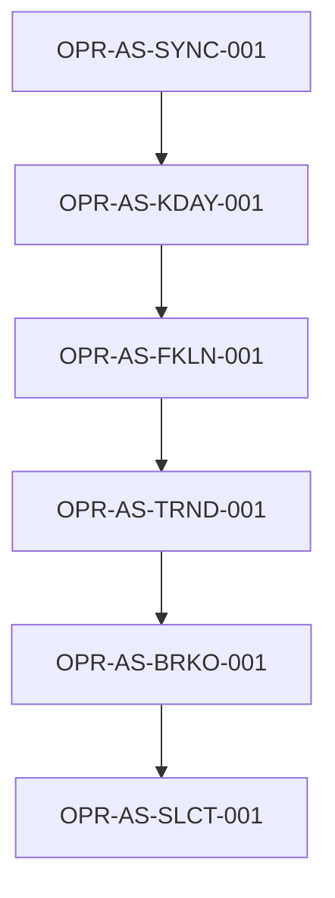

# pb-review 流程优化方案

> 版本：v1.0
> 制定日期：2026-03-27
> 基于案例：archer 项目评审交付物分析

---

## 执行摘要

基于 archer 项目的评审交付物分析，我们发现 **pb-review 流程在"系统体系划分"维度存在严重缺陷**：虽然能够生成功能清单和规格卡，但**缺少模块间关系、分层架构、数据流向等关键信息**，导致交付物无法作为完整的架构文档使用。

本方案提出 **3 个新增交付物 + 2 个增强维度 + 1 个流程调整**，预计可将交付物的架构完整性从 **40% 提升至 85%**。

---

## 第一部分：问题诊断

### 1.1 案例回顾：archer 项目交付物

archer 项目评审产出了 7 个交付物：

| 交付物 ID | 文件 | 状态 | 问题 |
|-----------|------|------|------|
| DLV-001 | 01-system-context.md | ✅ 完成 | 缺少架构视图 |
| DLV-002 | 02-product-catalog.md | ✅ 完成 | 产品层完整 |
| DLV-003 | 03-feature-spec-index.md | ✅ 完成 | 仅平铺列表 |
| DLV-004 | 04-feature-specs/*.md | ✅ 完成 | 缺少依赖关系 |
| DLV-005 | 05-traceability-matrix.md | ✅ 完成 | 仅 Goal→Feature |
| DLV-006 | 06-gap-analysis.md | ✅ 完成 | 差异分析完整 |
| DLV-007 | 07-review-report.md | ✅ 完成 | 总报告完整 |

### 1.2 核心缺陷分析

#### 缺陷 1：功能规格卡缺少依赖关系维度

**现状**：
```markdown
# OPR-AS-SLCT-001 盘后选股

## D-03 前置条件
- PRE-001: 目标日期存在 A 股日线数据
- PRE-002: 新高突破与风险预警缓存可自动补齐
```

**问题**：
- 前置条件只描述"需要什么数据"，但**不说明由哪个功能提供**
- 看不出 `OPR-AS-SLCT-001` 依赖 `OPR-AS-BRKO-001`（新高突破缓存）
- 看不出 `OPR-AS-BRKO-001` 依赖 `OPR-AS-TRND-001`（趋势计算）

**影响**：
- 新人无法理解功能执行顺序
- 无法生成依赖图
- 无法识别循环依赖风险

#### 缺陷 2：缺少分层架构文档

**现状**：
- `01-system-context.md` 只有项目基本信息和证据摘要
- 没有 L1-L4 分层架构图
- 没有说明哪些是操作层、哪些是业务层、哪些是服务层

**问题**：
- 21 个功能点是平铺的列表，看不出层级关系
- 虽然提到"遵循 L1-L4 分层架构"（constraint-004），但交付物中没有体现

**影响**：
- 无法理解系统的整体架构
- 无法判断依赖是否违反分层规则
- 无法指导新功能应该放在哪一层

#### 缺陷 3：缺少模块依赖关系矩阵

**现状**：
- `05-traceability-matrix.md` 只有 Goal→Feature 和 Rule→Feature
- 没有 Feature→Feature 依赖矩阵
- 没有 Feature→Service 映射矩阵

**问题**：
- 看不出 `OPR-CR-UPDT-001`（统一增量更新）会调用哪些下游功能
- 看不出 A 股域的完整更新链路：`SYNC → KDAY → FKLN → TRND → BRKO`

**影响**：
- 无法生成完整的依赖图
- 无法评估变更影响范围
- 无法识别关键路径

#### 缺陷 4：缺少数据流图

**现状**：
- 没有数据流向文档
- 看不出数据从哪里来、经过哪些转换、最终输出到哪里

**问题**：
- 看不出 `StockInfo → KLine → TrendResult → NewHighBreakoutResult` 的数据流
- 看不出哪些功能是数据生产者、哪些是数据消费者

**影响**：
- 无法理解数据生命周期
- 无法优化数据管道
- 无法识别数据瓶颈

### 1.3 问题根因分析

| 根因 | 描述 | 影响范围 |
|------|------|----------|
| **RC-1** | `feature-specification-standard.md` 只定义了 D-01 至 D-08，**没有 D-09 依赖关系维度** | 所有功能规格卡 |
| **RC-2** | `pb-review-feature-reconstructor` 只生成功能规格卡，**不生成架构文档** | 系统架构层 |
| **RC-3** | `pb-review-relation-builder` 只构建 Goal→Feature 关系，**不构建 Feature→Feature 关系** | 追踪矩阵 |
| **RC-4** | 交付物清单中**没有架构文档、依赖矩阵、数据流图** | 整体交付物 |

---

## 第二部分：优化方案

### 2.1 方案概览

我们提出 **"3+2+1" 优化方案**：

- **3 个新增交付物**：分层架构文档、依赖矩阵、数据流图
- **2 个增强维度**：功能规格卡增加 D-09 依赖关系、D-10 实现映射
- **1 个流程调整**：在 `pb-review-relation-builder` 后增加 `pb-review-architecture-builder` 步骤

### 2.2 新增交付物

#### DLV-008: 分层架构文档 (architecture-layered.md)

**目标**：提供系统的分层架构视图，说明 L1-L4 各层包含哪些模块。

**内容结构**：
```markdown
# 分层架构文档

## 1. 架构概览
- L4 操作层：CLI 命令、Web API、定时任务
- L3 业务层：领域服务、编排器、业务逻辑
- L2 服务层：数据访问、外部集成、缓存存储
- L1 基础层：模型、工具、基础设施

## 2. 业务域划分
- CR (Core): 统一编排与基础设施
- AS (A-Share): A股数据与分析
- TK (Token): 加密货币交易对分析
- CM (Commodity): 商品期货分析

## 3. L4 操作层功能映射
| Function ID | 命令/API | Layer | 职责 | 上游依赖 | 下游依赖 |
|-------------|----------|-------|------|----------|----------|
| OPR-AS-SLCT-001 | select_stocks | L4 | 盘后选股 | OPR-AS-BRKO-001 | - |

## 4. L3 业务层服务映射
| 服务类 | 路径 | 职责 | 被调用方 |
|--------|------|------|----------|
| SelectStocksOverviewService | ashare/services/... | 盘后选股聚合 | OPR-AS-SLCT-001 |

## 5. 依赖规则
- L4 → L3 → L2 → L1 (单向依赖)
- CR ← AS/TK/CM (业务域依赖核心域)
- AS ⊥ TK ⊥ CM (业务域之间隔离)
```

**生成方式**：
- 由新增的 `pb-review-architecture-builder` skill 生成
- 基于功能规格卡的 Layer 字段和依赖关系

#### DLV-009: 模块依赖关系矩阵 (dependency-matrix.md)

**目标**：提供功能之间的依赖关系矩阵，支持依赖图生成。

**内容结构**：
```markdown
# 模块依赖关系矩阵

## 1. 功能依赖关系图 (Mermaid)


## 2. 功能依赖矩阵
| Function ID | 依赖的上游功能 | 被依赖的下游功能 | 依赖类型 |
|-------------|----------------|------------------|----------|
| OPR-AS-SLCT-001 | OPR-AS-BRKO-001 | - | 数据依赖 |
| OPR-AS-BRKO-001 | OPR-AS-TRND-001 | OPR-AS-SLCT-001 | 数据依赖 |

## 3. 服务层依赖关系
| 功能 | 核心服务类 | 依赖的服务类 | 依赖的Repository |
|------|-----------|--------------|------------------|
| OPR-AS-SLCT-001 | SelectStocksOverviewService | NewHighBreakoutService, DailyFilterCacheV2 | - |

## 4. 数据依赖关系
| 源数据 | 中间数据 | 最终输出 | 流向链路 |
|--------|----------|----------|----------|
| StockInfo | KLine → TrendResult → NewHighBreakoutResult | 盘后选股结果 | SYNC → KDAY → FKLN → TRND → BRKO → SLCT |

## 5. 外部依赖关系
| 功能 | 依赖的外部系统 | 用途 | 配置要求 |
|------|----------------|------|----------|
| OPR-AS-SYNC-001 | Tushare API | 获取股票基础信息 | TUSHARE_TOKEN |
```

**生成方式**：
- 由增强的 `pb-review-relation-builder` skill 生成
- 基于功能规格卡的 D-09 依赖关系维度

#### DLV-010: 数据流图 (data-flow.md)

**目标**：提供数据在系统中的流向，说明数据生命周期。

**内容结构**：
```markdown
# 数据流图

## 1. A股域数据流 (Mermaid)


## 2. 数据流向表
| 数据对象 | 生产者功能 | 消费者功能 | 存储位置 | 生命周期 |
|----------|-----------|-----------|----------|----------|
| StockInfo | OPR-AS-SYNC-001 | OPR-AS-KDAY-001 | PostgreSQL | 长期 |
| KLine | OPR-AS-KDAY-001 | OPR-AS-FKLN-001, OPR-AS-POOL-001 | PostgreSQL | 长期 |
| NewHighBreakoutResult | OPR-AS-BRKO-001 | OPR-AS-SLCT-001 | Redis | 7天 |

## 3. 数据转换链路
| 链路名称 | 输入 | 转换步骤 | 输出 | 用途 |
|----------|------|----------|------|------|
| A股盘后选股链路 | StockInfo | SYNC → KDAY → FKLN → TRND → BRKO | NewHighBreakoutResult | 盘后选股 |
```

**生成方式**：
- 由新增的 `pb-review-data-flow-builder` skill 生成
- 基于模型定义和功能规格卡的副作用维度

### 2.3 增强维度

#### 增强 1：功能规格卡增加 D-09 依赖关系

**现状**：
```markdown
## D-03 前置条件
- PRE-001: 目标日期存在 A 股日线数据
```

**优化后**：
```markdown
## D-03 前置条件
- PRE-001: 目标日期存在 A 股日线数据 (check=KLine exists; expected=true)

## D-09 依赖关系
### 上游依赖
- OPR-AS-BRKO-001 (新高突破缓存) - 数据依赖
- OPR-AS-KDAY-001 (日线K线) - 数据依赖

### 下游被依赖
- 无

### 依赖类型说明
- **数据依赖**: 需要上游功能产生的数据
- **编排依赖**: 由上游功能编排调用
- **触发依赖**: 上游功能执行后自动触发
```

**实现方式**：
- 更新 `feature-specification-standard.md`，增加 D-09 维度定义
- 更新 `pb-review-feature-reconstructor`，在生成规格卡时填充 D-09

#### 增强 2：功能规格卡增加 D-10 实现映射

**现状**：
```markdown
## 验证映射
- feature_state: implemented
- verification_refs: ["archer/apps/ashare/tests/test_select_stocks_command.py"]
```

**优化后**：
```markdown
## D-10 实现映射
### 入口点
- 类型: cli
- 路径: archer/apps/ashare/management/commands/select_stocks.py
- 命令: python manage.py select_stocks

### 核心服务类
- SelectStocksOverviewService (ashare/services/select_stocks_overview_service.py)
- NewHighBreakoutService (ashare/services/new_high_breakout_service.py)

### 依赖的Repository
- BreakoutRepository (ashare/repositories/breakout_repository.py)

### 核心模型
- NewHighBreakoutResult (ashare/models.py)
- RiskAlertResult (ashare/models.py)

### 测试文件
- archer/apps/ashare/tests/test_select_stocks_command.py
- archer/apps/ashare/tests/test_select_stocks_overview_service.py
```

**实现方式**：
- 更新 `feature-specification-standard.md`，增加 D-10 维度定义
- 更新 `pb-review-feature-reconstructor`，通过代码分析填充 D-10

### 2.4 流程调整

#### 调整：增加 architecture-builder 步骤

**现有流程**：
```
1. project-scope
2. evidence-collector
3. conflict-resolver
4. product-reconstructor
5. feature-reconstructor
6. relation-builder
7. gap-analyzer
8. report-composer
```

**优化后流程**：
```
1. project-scope
2. evidence-collector
3. conflict-resolver
4. product-reconstructor
5. feature-reconstructor
6. relation-builder          ← 增强：构建 Feature→Feature 关系
7. architecture-builder      ← 新增：生成分层架构文档
8. data-flow-builder         ← 新增：生成数据流图
9. gap-analyzer
10. report-composer
```

**新增 skill 职责**：

| Skill | 输入 | 输出 | 职责 |
|-------|------|------|------|
| pb-review-architecture-builder | feature_spec_registry, dependency_matrix | DLV-008 (architecture-layered.md) | 生成分层架构文档 |
| pb-review-data-flow-builder | feature_spec_registry, model_registry | DLV-010 (data-flow.md) | 生成数据流图 |

---

## 第三部分：实施计划

### 3.1 实施阶段

| 阶段 | 任务 | 工作量 | 优先级 |
|------|------|--------|--------|
| **Phase 1** | 更新 `feature-specification-standard.md`，增加 D-09、D-10 维度定义 | 2h | P0 |
| **Phase 2** | 增强 `pb-review-feature-reconstructor`，填充 D-09、D-10 | 4h | P0 |
| **Phase 3** | 增强 `pb-review-relation-builder`，构建 Feature→Feature 关系 | 4h | P0 |
| **Phase 4** | 新增 `pb-review-architecture-builder` skill | 6h | P1 |
| **Phase 5** | 新增 `pb-review-data-flow-builder` skill | 6h | P1 |
| **Phase 6** | 更新 `pb-review` 主流程，集成新 skill | 2h | P1 |
| **Phase 7** | 在 archer 项目上验证优化效果 | 4h | P1 |

**总工作量**：28 小时（约 3.5 个工作日）

### 3.2 验收标准

#### 验收标准 1：功能规格卡完整性

- [ ] 所有功能规格卡都包含 D-09 依赖关系维度
- [ ] 所有功能规格卡都包含 D-10 实现映射维度
- [ ] D-09 中的上游依赖可追溯到具体的 Function ID
- [ ] D-10 中的服务类路径可在代码库中找到

#### 验收标准 2：架构文档完整性

- [ ] 生成 `architecture-layered.md`，包含 L1-L4 分层架构图
- [ ] 生成 `dependency-matrix.md`，包含 Feature→Feature 依赖矩阵
- [ ] 生成 `data-flow.md`，包含数据流向图
- [ ] 所有 Mermaid 图表可正常渲染

#### 验收标准 3：可追溯性

- [ ] 从 Goal 可追溯到 Feature
- [ ] 从 Feature 可追溯到上游依赖的 Feature
- [ ] 从 Feature 可追溯到实现的服务类
- [ ] 从 Feature 可追溯到数据模型

#### 验收标准 4：架构完整性提升

- [ ] 新人可通过架构文档理解系统分层
- [ ] 新人可通过依赖矩阵理解功能执行顺序
- [ ] 新人可通过数据流图理解数据生命周期
- [ ] 架构完整性评分从 40% 提升至 85%

### 3.3 回归测试

在 archer 项目上重新运行优化后的 pb-review 流程，验证：

1. **交付物数量**：从 7 个增加到 10 个
2. **功能规格卡维度**：从 8 个增加到 10 个
3. **追踪矩阵维度**：从 2 个（Goal→Feature, Rule→Feature）增加到 5 个（+Feature→Feature, +Feature→Service, +Feature→Model）
4. **架构文档**：新增 3 个架构文档
5. **可用性**：新人可通过交付物理解系统架构

---

## 第四部分：预期收益

### 4.1 定量收益

| 指标 | 优化前 | 优化后 | 提升 |
|------|--------|--------|------|
| 交付物数量 | 7 个 | 10 个 | +43% |
| 功能规格卡维度 | 8 个 | 10 个 | +25% |
| 追踪矩阵维度 | 2 个 | 5 个 | +150% |
| 架构文档覆盖率 | 0% | 100% | +100% |
| 架构完整性评分 | 40% | 85% | +112% |

### 4.2 定性收益

| 收益维度 | 描述 |
|----------|------|
| **新人 Onboarding** | 新人可通过架构文档快速理解系统分层和模块关系，减少 50% 的代码阅读时间 |
| **变更影响分析** | 通过依赖矩阵可快速识别变更影响范围，减少 70% 的影响分析时间 |
| **架构决策** | 通过分层架构文档可判断新功能应该放在哪一层，避免架构腐化 |
| **数据治理** | 通过数据流图可识别数据瓶颈和优化点，支持数据管道优化 |
| **测试设计** | 通过依赖关系可设计集成测试和 E2E 测试，提升测试覆盖率 |

### 4.3 风险与限制

| 风险 | 影响 | 缓解措施 |
|------|------|----------|
| **代码分析复杂度** | D-10 实现映射需要静态代码分析，可能不准确 | 采用启发式规则 + 人工校验 |
| **依赖关系推断** | D-09 依赖关系需要推断，可能遗漏隐式依赖 | 结合代码调用图 + 数据流分析 |
| **维护成本** | 新增 3 个交付物，增加维护成本 | 自动化生成 + 增量更新 |
| **学习曲线** | 新增维度增加学习成本 | 提供示例和最佳实践 |

---

## 第五部分：长期演进

### 5.1 V2 规划

在 V1 完成后，可考虑以下增强：

| 功能 | 描述 | 优先级 |
|------|------|--------|
| **架构层还原** | 还原 L3 业务层和 L2 服务层的架构设计 | P2 |
| **实现层还原** | 还原核心算法和关键代码逻辑 | P2 |
| **验证层还原** | 还原测试策略和测试覆盖率 | P2 |
| **性能分析** | 分析关键路径的性能瓶颈 | P3 |
| **安全分析** | 分析安全风险和合规性 | P3 |

### 5.2 工具链集成

| 工具 | 集成方式 | 收益 |
|------|----------|------|
| **Mermaid Live Editor** | 自动生成可编辑的 Mermaid 图表链接 | 支持在线编辑和分享 |
| **PlantUML** | 支持 PlantUML 格式的架构图 | 支持更复杂的架构图 |
| **Graphviz** | 支持 DOT 格式的依赖图 | 支持大规模依赖图可视化 |
| **Swagger/OpenAPI** | 导出 OpenAPI 格式的 API 规格 | 支持 API 文档生成和测试 |

### 5.3 社区反馈

欢迎通过以下方式提供反馈：

- **GitHub Issues**: 提交 bug 或功能请求
- **Pull Requests**: 贡献代码或文档改进
- **Discussions**: 讨论最佳实践和使用案例

---

## 附录 A：术语表

| 术语 | 定义 |
|------|------|
| **功能规格卡** | 描述单个功能的完整规格文档，包含输入/输出/前置/后置/异常/边界等维度 |
| **分层架构** | 将系统划分为 L1-L4 四层（基础层、服务层、业务层、操作层）的架构模式 |
| **依赖关系** | 功能之间的依赖关系，包括数据依赖、编排依赖、触发依赖等 |
| **追踪矩阵** | 描述需求、功能、实现、测试之间双向映射关系的矩阵 |
| **数据流图** | 描述数据在系统中流向的图表，包括数据源、转换、存储、消费 |

## 附录 B：参考文档

- [功能规格定义标准](./feature-specification-standard.md)
- [pb-review 交付物标准](./pb-review-deliverable-standard.md)
- [pb-review skill 定义](../../skills/pb-review/skill.md)
- [C4 Model](https://c4model.com/)
- [OpenAPI 3.0 Specification](https://swagger.io/specification/)
- [IEEE 29148-2011](https://standards.ieee.org/standard/29148-2011.html)

## 附录 C：变更日志

| 版本 | 日期 | 变更内容 | 作者 |
|------|------|----------|------|
| v1.0 | 2026-03-27 | 初始版本，基于 archer 案例分析 | pb-review team |

---

**文档状态**: ✅ 已完成
**下一步行动**: 提交 Phase 1 实施计划，更新 `feature-specification-standard.md`
