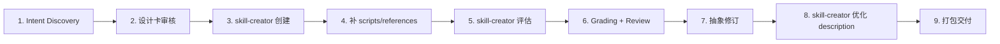

# Skill 设计原则与协议

**版本**: 3.0.0
**制定日期**: 2026-03-30
**最后更新**: 2026-04-01
**适用范围**: 所有 powerby-skills 项目中的 Skill 设计、开发、升级、评估与迭代
**参考文档**: `docs/skill_best.md`, `docs/consitution.md`, `docs/powerby-lifecycle-framework.md`, `docs/review/feature-specification-standard.md`, `docs/review/pb-review-standard.md`, `skills/pb-review/` 体系
**参考实践**: `skills/pb-v1-implementing/` 体系（pb-v1 原子 Skill 设计范本）
**官方工具**: [Anthropic skill-creator](https://github.com/anthropics/skills/blob/main/skills/skill-creator/SKILL.md)
**参考实现**: [web-access skill](https://github.com/eze-is/web-access)

---

## 一、核心定义

> **Skill 不是一段提示词，而是一个可触发、可执行、可评估、可迭代的能力包。**
> 
> **激发模型能力上限的 Skill = 策略哲学 + 最小完备工具集 + 必要的事实说明**（详见第二章）

Skill 是给 AI Agent 安装的"可升级能力模块"。它必须同时满足：

- **可触发** — description 精准命中用户意图
- **可泛化** — 换项目/场景依然有效
- **可评估** — 有 baseline 对照、有断言、有 review
- **可迭代** — 能从反馈中抽象提升，不越改越脆
- **可交付** — 包结构清晰、资源分层、易维护

---

## 二、Skill 哲学式设计

> **激发模型能力上限的 Skill = 策略哲学 + 最小完备工具集 + 必要的事实说明**

通用场景的 Skill 设计，需避免过度指定 Agent「该怎么做」。Skill 的核心价值不是给模型一份操作手册，而是：
- 重新**校准**模型在对应场景的「策略哲学」
- **补充** Agent 框架缺少的「基础工具」
- 提前**强调**模型未必及时想起的「事实说明」

这三者构成 Skill 哲学式设计的三大支柱。每个支柱解决的是不同层次的问题，缺一个 Skill 就会退化。

### 2.1 为什么需要哲学式设计

模型的思考是上下文的惯性衔接。模型容易陷入「刻板印象」，在复杂任务中做「惯性不思考」：

| 模型惯性 | 真实情况 |
|---------|---------|
| 联网查数据？那必然用 Web Search 工具 | 反爬站点需要 CDP 直接访问主站 |
| 网上搜到这么多站点都这么写？那肯定是事实 | 多个媒体引用同一个错误会造成循环印证假象 |
| 网站用 fetch 加载不出来？肯定是网站挂了 | 可能是工具不匹配，不是内容不存在 |
| 任务很复杂？那我按步骤一步步来 | 应该先定义成功标准，再选最短路径 |

**为了对抗模型的显式惯性，Skill 应为模型提供闭合、高度抽象的思考策略哲学，而非详细的操作指令。**

### 2.2 支柱一：策略哲学 — 校准思考方式

**目标**：让模型在场景中自主判断，而非执行指令。

| 原则 | 说明 |
|------|------|
| **不写规则，写思考框架** | 给模型的是判断方式，不是 if-else 分支 |
| **闭合、高度抽象** | 策略哲学换任何项目/场景依然成立 |
| **对抗模型惯性思维** | 显式打断模型的刻板印象，引导重新评估 |
| **让模型自主判断** | 提供判断的锚点（成功标准、切换条件、停止条件），不提供步骤清单 |

**检验标准**：如果把策略哲学放到一个全新的项目/场景中，它仍然能指导模型做出正确判断，说明写对了。如果它只在原始场景有效，那写的是流程，不是哲学。

**范例**（来自 web-access）：

```
差：1. 搜索 → 2. 打开网页 → 3. 提取内容 → 4. 总结
好：① 拿到请求，定义成功标准
    ② 选择最可能直达的起点去验证
    ③ 每一步的结果都是证据，不只是成败信号
    ④ 对照成功标准，满足即停止
```

### 2.3 支柱二：最小完备工具集 — 补充缺失能力

**目标**：补充 Agent 框架缺失的能力，不是罗列所有可用工具。

| 原则 | 说明 |
|------|------|
| **识别场景的原子化行为** | 先抽象出"搜、看、做"等原子行为，再映射到具体工具 |
| **描述能力边界而非使用规则** | 写清"什么时候用/什么时候不用"，不写"先用 A 再用 B" |
| **场景驱动选择，非固定层级** | 工具之间没有固定优先级，由任务特征决定 |
| **确定性下沉** | 重复的确定性操作交给 scripts/，不让模型每次临时写 |

**检验标准**：工具集中每个工具都有明确的"不适用场景"。如果一个工具"什么时候都能用"，说明边界没写清楚。

### 2.4 支柱三：事实说明 — 补足推理原料

**目标**：补足模型的「惰性知识」，提供推理原料而非行为规则。

| 原则 | 说明 |
|------|------|
| **补足惰性知识** | 模型"知道但不一定及时调用"的事实，显式写出来 |
| **验证惰性知识边界** | 识别哪些是模型真的不知道的（需要事实说明），哪些是知道但不调用的（需要提醒） |
| **唯一最优路径直接指定** | 已有明确最优解时不假装开放，直接指定 |
| **强调安全风险边界** | 哪些资源不能碰、哪些动作必须谨慎，显式声明 |
| **是推理原料，不是行为规则** | 事实说明帮模型做出更好的判断，而不是限制模型的行为 |

**检验标准**：事实说明中的每一条，要么能在模型推理时被直接引用为判断依据，要么能阻止一个常见的误判。如果一条事实说明既不影响推理也不阻止误判，它就是噪音。

### 2.5 三大支柱的协同关系

```
策略哲学        →  校准「怎么想」  →  模型获得判断框架
最小完备工具集  →  补充「用什么」  →  模型获得行动能力
事实说明        →  提供「凭什么」  →  模型获得推理原料
```

三者缺一不可：
- 有哲学无工具 → 模型知道该怎么想，但没有手段执行
- 有工具无哲学 → 模型有手段，但按惯性选错工具
- 有哲学有工具无事实 → 模型判断框架正确，但基于错误的前提推理

### 2.6 与后续章节的关系

本章定义的三大支柱，在后续章节中落地为具体的设计规范：

| 支柱 | 落地章节 | 核心 Section |
|------|---------|-------------|
| 策略哲学 | 四·4.3.3 Strategy | 认知层 — 校准思考方式，对抗惯性思维 |
| 最小完备工具集 | 四·4.3.4 Tools and capability boundaries | 执行层 — 先做原子行为抽象，再映射工具 |
| 事实说明 | 四·4.3.5 Important facts and constraints | 约束层 — 补足推理原料，非行为规则 |

---

## 三、宪法约束（继承自 constitution.md）

所有 Skill 的设计必须遵守项目宪法中的核心原则：

### 3.1 基本信念

| 原则 | 在 Skill 设计中的体现 |
|------|----------------------|
| **零假设原则** | Skill 遇到模糊输入时，必须引导澄清，不猜测 |
| **小步提交** | Skill 输出应增量式产出，支持 checkpoint 断点恢复 |
| **借鉴现有，而后创造** | 新 Skill 先研究已有 Skill 的模式，遵循已有约定 |
| **务实优于教条** | Skill 策略层教判断哲学，不写死僵化流程 |
| **意图清晰** | SKILL.md 正文、references、scripts 职责分明 |

### 3.2 何谓简单

- **单一职责**: 一个 Skill 只做一件事
- **避免过早抽象**: 只在职责确实不同时才拆分子 Skill
- **拒绝奇技淫巧**: 用最直接的方式组织 Skill 结构
- **无需解释**: 如果 SKILL.md 的策略层读不懂，说明写太复杂了

### 3.3 决策框架（优先级排序）

设计 Skill 时，面对多个可行方案，按此优先级选择：

1. **可测试性** — 这个 Skill 的输出能被评估吗？
2. **可读性** — 6 个月后其他人能看懂这个 Skill 吗？
3. **一致性** — 是否符合项目已有的 Skill 模式？
4. **简单性** — 这是能解决问题的最简单方案吗？
5. **可逆性** — 如果发现设计有误，修改成本有多高？

### 3.4 受阻原则

同一个 Skill 设计问题，最多尝试 3 次。如果依然无法解决，立刻停止，记录失败过程，研究替代方案。

---

## 四、SKILL.md 七层结构框架

每个 Skill 统一采用以下结构，这是 `skill_best.md` 七层框架与 `pb-review` 实践的融合。**七层结构是第二章三大支柱的具体落地形式。**

### 4.1 层级总览

| 层级 | Section | 核心问题 | 哲学支柱 | 对应 skill_best.md |
|------|---------|----------|---------|-------------------|
| **触发层** | `frontmatter` | 什么时候被调用？ | — | Intent Layer |
| **定位层** | `Purpose` + `Success criteria` | 做什么？怎样算成功？ | — | Intent Layer |
| **认知层** | `Strategy` | 如何判断和决策？ | **支柱一：策略哲学** | Strategy Layer |
| **执行层** | `Tools and capability boundaries` | 靠什么完成？边界在哪？ | **支柱二：最小完备工具集** | Capability Layer |
| **约束层** | `Important facts and constraints` | 哪些事实/风险必须强调？ | **支柱三：事实说明** | Knowledge Layer |
| **扩展层** | `Resources` + `Subtask guidance` | 如何处理复杂任务？ | — | Structure Layer |
| **安全层** | `Safety` | 哪些事绝不能做？ | 支柱三延伸 | Knowledge Layer |

### 4.2 完整 Section 列表（按顺序）

```
frontmatter (name, description, compatibility)
→ Purpose
→ Success criteria
→ Strategy
→ Tools and capability boundaries
→ Important facts and constraints
→ Workflow
→ Output format
→ Resources
→ Subtask / parallelism guidance
→ Examples
→ Safety
```

### 4.3 各层详细规范

#### 4.3.1 Frontmatter（触发层）

```yaml
---
name: <kebab-case 标识符>
description: <具体能力 + 典型触发语境，中文为主>
compatibility:
  - python3
  - local-filesystem
style:
  inherits: <全局风格继承，如 powerby-foundation>
  local: <局部风格标识，如 implementing>
principles: <原则引用，如 $ref(powerby-foundation/code-principles)>
---
```

**各字段说明**：

| 字段 | 必需 | 说明 |
|------|------|------|
| `name` | 是 | kebab-case 标识符 |
| `description` | 是 | 具体能力 + 典型触发语境 |
| `compatibility` | 是 | 运行环境依赖 |
| `style.inherits` | 否 | 全局风格/原则继承源。引用后，Skill 运行时自动加载对应的全局原则 |
| `style.local` | 否 | 局部风格标识。用于加载 Skill 类型特有的局部原则 |
| `principles` | 否 | 外部原则引用。通过 `$ref()` 引用 foundation 中的原则列表，Skill 运行时动态加载。原则可持续补充，更新 foundation 即全局生效 |

**description 写法原则**：

- 同时包含"做什么"和"什么时候用"
- 略"pushy"（主动），因为模型倾向于 under-trigger
- 包含否定边界（不适用场景）

| 质量等级 | 示例 |
|---------|------|
| 差 | `项目评审工具` |
| 中 | `对仓库做评审分析` |
| 好 | `还原式项目评审框架的流程编排器。当用户要对仓库做事实还原、需求到实现追踪、差异审计，或从 .review/ 断点继续评审时使用。` |

#### 4.3.2 Purpose + Success criteria（定位层）

**Purpose**: 一句话说清核心能力和成功使用的样子。

**Success criteria**: 在开始行动前必须明确的验收标准。这是后续所有判断的锚点。

```markdown
## Success criteria
- [具体的、可量化的成功条件 1]
- [具体的、可量化的成功条件 2]
- [失败时应如何表现]
```

参考 `pb-review` 的写法：不只定义"做成什么"，还定义"不做什么"和"失败时怎么办"。

#### 4.3.3 Strategy（认知层）— 最关键的一层

> **落地支柱一「策略哲学」：校准模型在场景中的思考方式，对抗惯性思维。**

**核心原则：写思考框架，不写死流程。让模型自主判断，非执行指令。**

Strategy 层的本质是为模型提供**闭合、高度抽象**的判断框架。它不是操作手册，而是思考方式的校准器。好的 Strategy 能打断模型的惯性思维，引导模型在每个决策点重新评估而非按刻板印象行事。

采用四段式认知框架：

1. **定义成功标准** — 什么算完成
2. **选择最可能的起点** — 不在错误路径上空转
3. **中间结果当证据** — 不只看成败，看证据是否指向目标
4. **满足标准即停止** — 不追加无意义探索

**检验标准**：换一个新项目/新场景，Strategy 依然有指导意义，说明写对了。

**写法对比**：

| 差（写死流程） | 好（策略哲学） |
|--------------|--------------|
| 1. 搜索 2. 打开网页 3. 点击按钮 | 先判断任务类型，再选择工具，根据反馈切换路径 |
| MUST define success | Start by identifying what would count as a successful outcome |
| Use browser for dynamic pages | Use the browser when the target site depends on login state or dynamic rendering. In these cases, fetch often produces misleading failures |

#### 4.3.4 Tools and capability boundaries（执行层）

> **落地支柱二「最小完备工具集」：补充 Agent 框架缺失的能力，而非罗列工具。**

**原则：识别场景的原子化行为 → 映射到工具 → 描述能力边界而非使用规则 → 场景驱动选择**

先做原子行为抽象，再映射到工具。每个工具写清：

| 项目 | 必须说明 |
|------|---------|
| 适用场景 | 什么时候用它 |
| 不适用场景 | 什么时候不该用它 |
| 边界声明 | 本 Skill 不做什么（显式下放给其他 Skill） |
| 确定性下沉 | 哪些操作通过 scripts/ 完成 |

**关键约束（来自 pb-review）**：
- 确定性工作交给脚本，抽象判断由模型直接完成
- 不允许通过脚本将抽象判断转发到外部 LLM
- 不越权做其他 Skill 的职责

#### 4.3.5 Important facts and constraints（约束层）

> **落地支柱三「事实说明」：为模型提供推理原料，而非行为规则。**

事实说明的每一条都应该是模型在推理时可以直接引用的判断依据。它们不是限制模型的规则，而是帮模型做出更好判断的原料。

补三类模型"容易忘记"的信息：

1. **惰性知识 / 易忘事实** — 模型知道但不一定及时调用的信息。需要验证惰性知识的边界：区分"模型真的不知道"（需要教）和"模型知道但不调用"（需要提醒）
2. **明确最优路径** — 已有最优解时不假装开放，直接指定唯一最优路径
3. **风险边界与禁止事项** — 哪些资源不能碰、哪些动作必须谨慎，显式声明安全风险边界

#### 4.3.6 Workflow（工作流）

高层次的步骤描述，是 Strategy 的具体化。注意：

- 写目标导向的步骤，不写 click-by-click 细节
- 每一步说清输入、处理、输出
- 标明哪些步骤是确定性（脚本），哪些是抽象判断（模型）

#### 4.3.7 Output format（输出层）

统一输出协议（详见第五章）。如果 Skill 是编排器的一部分，必须遵循共享协议。

#### 4.3.8 Resources（扩展层）

列出所有可引用的资源及其加载时机：

```markdown
## Resources
- `references/<file>.md` — <什么时候读取>
- `scripts/<file>.py` — <什么时候执行>
- `assets/<file>` — <什么时候使用>
```

#### 4.3.9 Safety（安全层）

显式声明禁止行为。参考 `pb-review` 的写法：

```markdown
## Safety
- 不允许跳过上游依赖直接调用下游 skill
- 不允许把推断结果写成显式事实
- 不允许用脚本把抽象判断偷偷转发到外部 LLM
```

---

## 五、文件组织 — 渐进披露三层架构

### 5.1 标准目录结构

```
my-skill/
├── SKILL.md              # 第一层：高层策略与工作流
├── references/            # 第二层：按需加载的领域知识
│   ├── task-contract.md   #   - 本 Skill 的详细约束
│   ├── examples.md        #   - 真实案例
│   └── failure-modes.md   #   - 常见失败与规避
├── schemas/               # 第二层：结构化类型定义
│   └── *.md               #   - 共享的数据结构定义
├── scripts/               # 第三层：确定性/重复性操作
│   ├── run.py             #   - 主执行脚本
│   └── render_*.py        #   - 模板渲染脚本
└── assets/                # 第三层：模板文件
    └── template.md        #   - 输出模板
```

### 5.2 各层职责边界

| 层级 | 存放内容 | 加载时机 | 禁止放置 |
|------|---------|---------|---------|
| **SKILL.md** | 策略、工作流、边界、资源索引 | 始终加载 | 大段领域知识、完整 schema |
| **references/** | 领域知识、分支场景、框架差异 | 按需读取 | 可执行代码、模板文件 |
| **schemas/** | 数据结构、类型定义、判定规则 | 需要时加载 | 业务逻辑、策略描述 |
| **scripts/** | 确定性操作、模板渲染、数据转换 | 执行阶段调用 | 抽象判断、LLM 推理 |
| **assets/** | 输出模板、格式定义 | 渲染阶段使用 | 业务逻辑 |

### 5.3 关键原则

1. **SKILL.md 保持精简** — 不超过 200 行正文（不含示例）
2. **references 按主题分文件** — 避免上下文污染，模型按需读取
3. **scripts 只做确定性工作** — 数据转换、模板渲染、文件 I/O，绝不做语义判断
4. **多 Skill 共享的 schema/contract 放在父级目录** — 单点维护，多处引用
5. **重复出现的确定性动作下沉到 scripts/** — 不让模型每次临时写

---

## 六、协议先行与统一输入/输出

### 6.0 协议先行原则

> **先定义协议，再写实现。协议是约束的契约，所有参与者共同遵守。**

协议先行不仅适用于编排器链路，而是 Skill 设计的通用原则：

1. **任何 Skill 的输出如果被下游消费，都必须有明确的协议契约**
2. **协议是提取，不是额外设计** — 约束已经存在于上游产物中，协议只是将它们收敛为一份可执行的契约
3. **所有参与者遵守同一份协议** — 实现者按协议实现，审查者按协议审查，测试者按协议验证

**协议的价值**：
- 消除 Skill 之间的隐式假设
- 为审查和测试提供客观基准
- 新增 Skill 只需遵循已有协议，降低接入成本

**示例**：`pb-v1-implementing` 在实现前从上游的 `architecture.md` 和 `tasks.md` 中**提取** `protocol.md`，作为实现、审查、测试的共同基准。这不是额外的文档负担，而是将分散的约束收敛为一份可执行的契约。

### 6.1 适用场景

当多个 Skill 组成编排链路时（如 `pb-review` 体系），所有子 Skill 必须遵循统一协议。独立 Skill 可根据需要简化。

### 6.2 协议定义（参考 review-contract.md）

```yaml
# 统一输入
context: <共享上下文对象>
parameters: <本次调用参数>

# 统一输出
status: success | partial | failed
objects: []          # 新发现的结构化记录
relations: []        # 新建立的关系
conflicts: []        # 新发现的冲突
gaps: []             # 新发现的缺口
context_writes: {}   # 写回哪些 registry
metadata: {}         # 执行元数据（时间、交付物路径等）
errors: []           # 错误信息
```

### 6.3 状态语义

| 状态 | 含义 | 编排器行为 |
|------|------|-----------|
| `success` | 目标已完成 | 继续下游 |
| `partial` | 产出不完整，但结果仍可用 | 记录警告，继续下游，在 gaps/errors 留证据 |
| `failed` | 无法继续 | 立即停止，保留 checkpoint |

### 6.4 持久化顺序（关键）

```
1. 读取当前 registry 文件
2. 按唯一 ID 去重合并
3. 覆盖写入目标文件
4. 所有写入成功后，更新 checkpoint
```

**绝不能反过来。** 否则恢复逻辑会读取到"宣称已完成但文件未落盘"的伪状态。

### 6.5 Evidence Policy

每个 Skill 都要声明：

- `required_sources` — 必需的证据来源
- `min_confidence` — 最低置信度
- `allow_inference` — 是否允许推断

缺少必需证据时默认返回 `partial`；只有连基础输入都不存在时才返回 `failed`。

---

## 七、Skill 分解原则（编排器 + 子 Skill 模式）

### 7.1 何时需要分解

| 信号 | 应分解 | 不应分解 |
|------|--------|---------|
| 步骤之间有严格的输入输出依赖 | 是 | - |
| 单个 Skill 超过 300 行 SKILL.md | 是 | - |
| 存在确定性步骤和抽象判断步骤的混合 | 是 | - |
| 任务简单，3 步内可完成 | - | 是 |
| 分解后子 Skill 太小（< 50 行） | - | 是 |

### 7.2 三层分解模式（参考 pb-review）

| 层级 | 特征 | 执行方式 | 示例 |
|------|------|---------|------|
| **确定性 Bootstrap** | 文件扫描、数据采集 | 本地 Python 脚本 | project-scope, evidence-collector |
| **抽象判断** | 语义理解、关系推理 | 当前会话直接加载 Skill | feature-reconstructor, gap-analyzer |
| **确定性渲染** | 模板填充、报告生成 | 本地 Python 脚本 | render_testability_scorecard |

### 7.3 分解检验标准

1. **每个子 Skill 只有一个职责（SRP）**
2. **Skill N 的输出是 Skill N+1 的输入（无循环依赖）**
3. **确定性工作 ≠ 抽象判断，不能混合**
4. **不允许并行执行有依赖关系的 Skill**
5. **子任务写目标，不写死方法** — 保留 agent 自主判断空间

### 7.4 共享协议文件体系

编排器维护一组共享协议，所有子 Skill 引用：

| 协议文件 | 作用 |
|---------|------|
| `review-contract.md` | 统一输入/输出格式 |
| `skill-sequence.md` | 执行顺序与依赖原因 |
| `data-model.md` | 所有数据结构定义 |
| `deliverable-standard.md` | 交付物要求 |

**好处**：单点维护，多 Skill 复用；新增 Skill 只需遵循已有协议。

### 7.5 Checkpoint 与断点恢复

```json
{
  "review_id": "string",
  "last_completed_skill": "string",
  "timestamp": "ISO8601",
  "completed_writes": ["file paths"]
}
```

恢复规则：
- 只允许从最近成功步骤之后恢复
- checkpoint 宣称文件存在但实际缺失 → 回退重跑
- 不允许跳步恢复

---

## 八、交付物标准

### 8.1 双层产物体系（参考 pb-review）

| 层级 | 存储位置 | 格式 | 用途 |
|------|---------|------|------|
| **Registry 层** | `.review/*.json` | JSON | 结构化数据，供编排和下游消费 |
| **Deliverable 层** | `.review/deliverables/*.md` | Markdown | 人类可读的交付报告 |

### 8.2 Deliverable Manifest

每个会生成交付物的 Skill 必须：

1. 在 `metadata.deliverables` 中返回本次生成的文档路径
2. 在 `context_writes.deliverable_manifest` 中更新对应状态
3. 使用固定路径，不允许随机命名
4. 模板化输出优先调用 renderer script

### 8.3 功能规格标准（参考 feature-specification-standard.md）

当 Skill 输出功能级内容时，必须遵循 D-01 ~ D-20 维度模型：

- **D-01 ~ D-08**：核心维度（必填）— 标识、输入、前置、输出、异常、边界、后置、副作用
- **D-09 ~ D-14**：扩展维度（按需）— 性能、安全、幂等、事务、可观测、降级
- **D-15 ~ D-16**：关系维度 — 依赖关系、实现映射
- **D-17 ~ D-20**：测试维度 — Oracle、Fixture、TestGroups、Coverage

---

## 九、Prompt 工程规范

### 9.1 写作风格

| 原则 | 说明 |
|------|------|
| **祈使句为主** | `Start by...`, `Choose the...`, `Treat each...` |
| **解释原因** | 不只说"用浏览器打开动态页"，要说"因为 fetch 在动态页上会产生误导性失败" |
| **少用 MUST/NEVER** | 风险边界除外，正文用启发式写法 |
| **真实用户化示例** | Examples 像真实请求，不像教科书 |
| **固定输出模板** | 输出格式单独成 section，明确到可执行 |

### 9.2 子任务 Prompt 写法

- 描述目标（"获取"、"还原"），避免描述手段（"搜索"、"爬取"）
- 在 Prompt 中注明需要加载哪个 Skill
- 不复制 Skill 全文到子任务 Prompt

---

## 十、评估协议

### 10.1 评估三层模型

| 类型 | 适用场景 | 方法 |
|------|---------|------|
| **定性评估** | 写作、设计、研究 | 人工 review |
| **定量断言** | 结构化输出、格式转换 | 自动化检查 |
| **基线对照** | 所有 Skill | with_skill vs without_skill |

### 10.2 最小评估要求

1. **2-3 个真实 prompt** — 覆盖典型任务
2. **定量断言** — 是否生成指定文件、包含指定字段、遵循模板结构
3. **人工 review** — 输出是否清晰、自然、无遗漏、无过度执行
4. **baseline 对照** — 同轮跑 with_skill 和 without_skill

### 10.3 断言区分度

识别并排除：
- 总是通过的断言（无信息量）
- 高方差的 case（不稳定）
- 不区分 with/without skill 的指标（无效）

---

## 十一、迭代与升级协议

### 11.1 核心原则

> **迭代修抽象层，不修案例补丁。**

### 11.2 迭代流程（内部反馈驱动）

```
1. 看 benchmark 和 review
2. 看 transcript（不只看最终输出）
3. 找出错误发生在哪一层
4. 优先修：
   - description 触发错误
   - 成功标准不清
   - 工具边界不清
   - 事实说明缺失
   - 输出模板不稳
5. 再跑同一组 eval
6. 需要时扩展测试集
```

### 11.3 外部借鉴驱动的升级

除了内部反馈，Skill 升级还可以由**外部原则和最佳实践**驱动。当发现新的设计原则、行业实践或团队约定时，应评估是否需要融入现有 Skill。

**外部借鉴来源**：
- 团队级原则（如 `~/.claude/CLAUDE.md` 中的代码原则）
- 工程方法论（如 gstack ETHOS.md 中的 Boil the Lake、Search Before Building）
- 社区最佳实践和新的 Skill 设计模式
- 其他 Skill 的成功经验

**借鉴规则**：
- 借鉴需要经过审核，不能直接照搬
- 外部原则必须适配当前 Skill 的职责和上下文
- 融入后的原则应提升通用能力，而非特化

### 11.4 Skill 升级协议（从 vN 到 vN+1）

当现有 Skill 需要结构性升级（而非小修小补）时，遵循以下流程：


| 阶段 | 核心产出 | 说明 |
|------|---------|------|
| **1. 审视现状** | 问题清单 | 识别当前版本的不足、过时的设计、缺失的能力 |
| **2. 收集优化输入** | 输入源清单 | 内部反馈（benchmark、review、transcript）+ 外部借鉴（原则、实践） |
| **3. 编写优化方案** | `OPTIMIZATION_PROPOSAL.md` | 中间产物，包含每个优化点的问题分析、方案设计、实施建议 |
| **4. 用户审核** | 审核意见 | 用户审核方案，给出确认/修改/否决 |
| **5. 方案修订** | 修订后的方案 | 基于审核意见修订，可能多轮 |
| **6. 应用到 SKILL.md** | SKILL.md vN+1 | 将确认的方案落地为新版本 SKILL.md |
| **7. 验证升级** | 验证报告 | 新版本是否解决了原始问题，是否引入新问题 |

**关键中间产物：OPTIMIZATION_PROPOSAL.md**

```markdown
# <Skill 名称> 优化方案

**版本**: <方案版本>
**状态**: 方案设计 | 审核中 | 已确认 | 已应用
**创建日期**: <日期>

## 优化背景
[优化的驱动因素：内部反馈 + 外部借鉴]

## 优化点
### 1. [优化点名称]
**问题**: [当前版本的不足]
**优化**: [具体的改进方案]
**实施方式**: [如何落地到 SKILL.md]

### 2. ...

## 实施建议
[分阶段实施路径、风险与缓解]
```

**升级 vs 迭代的区别**：

| 维度 | 迭代（11.2） | 升级（11.4） |
|------|------------|------------|
| 驱动 | 内部 benchmark/review | 内部反馈 + 外部借鉴 |
| 范围 | 修某一层（触发、策略、约束等） | 结构性调整（新增阶段、重新定义原则等） |
| 中间产物 | 无 | OPTIMIZATION_PROPOSAL.md |
| 审核 | 自检 | 用户审核 |
| 版本 | patch（1.0.x） | minor/major（1.x.0 / x.0.0） |

### 11.5 避免 Overfit

- 不为修一个 case 把 Skill 变成对那个例子的特化
- 不新增碎片化的 if-else 规则（如"如果小红书就这样"）
- 正确做法：提升成通用策略原则（如"遇到反爬站点优先浏览器"）

### 11.6 资源进化

- 如果多个 run 都在写同一个 helper script → 正式收编进 `scripts/`
- 如果某段指令总让模型浪费时间 → 删掉（没贡献的说明就是噪音）

---

## 十二、核心设计原则（Checklist）

| # | 原则 | 检查方法 |
|---|------|---------|
| 0 | **三大支柱齐备** | Skill 是否同时具备策略哲学、最小完备工具集、事实说明三个维度（第二章） |
| 1 | **用户任务定义 Skill** | description 是否描述了用户要完成什么，而非工具名称 |
| 2 | **description 是第一触发器** | 是否具体、主动、带语境，同时包含适用和不适用场景 |
| 3 | **先写策略哲学，再写流程** | Strategy 换场景是否依然有效；是否对抗了模型惯性思维 |
| 4 | **工具最小完备集** | 每个工具是否有明确的适用/不适用/边界说明；是否先做了原子行为抽象 |
| 5 | **易忘事实前置** | 是否补充了环境前提、典型误判、最优路径、风险边界；每条事实是否是推理原料 |
| 6 | **确定性工作下沉 scripts/** | 是否把重复的模板渲染、数据转换交给脚本 |
| 7 | **多领域内容用 references/ 分层** | SKILL.md 正文是否控制在合理长度 |
| 8 | **子任务写目标不写方法** | 子 Agent prompt 是否只描述目标 |
| 9 | **内建评估闭环** | 是否有 baseline 对照 + 断言 + review |
| 10 | **迭代修抽象层不修补丁** | 修改是否提升了通用策略而非特化 |
| 11 | **协议先行** | Skill 的输出如果被下游消费，是否有明确的协议契约 |
| 12 | **原则可引用** | 共享原则是否通过 `$ref` 外部引用，而非内嵌硬编码 |
| 13 | **升级有方案** | 结构性升级是否先出 OPTIMIZATION_PROPOSAL.md 再改 SKILL.md |

---

## 十三、标准工作流（从 0 到交付）



### 13.1 阶段详情

| 阶段 | 核心产出 | 执行方式 | 检查点 |
|------|---------|---------|--------|
| **1. Intent Discovery** | 设计卡（名称、能力、触发场景、非适用、输入输出、成功标准） | 人工 + 本协议指导 | 能力边界清晰 |
| **2. 设计卡审核** | 确认设计卡符合本协议第三章七层结构 | 人工审核 | 通过十条原则 Checklist |
| **3. skill-creator 创建** | SKILL.md 初稿 + bundled resources | **使用 `/skill-creator`** | 各 Section 齐全 |
| **4. 补资源** | scripts/, references/, assets/ | 人工补充领域知识 | 确定性操作已下沉 |
| **5. skill-creator 评估** | with_skill vs baseline 并行测试 + benchmark.json | **使用 `/skill-creator`** | 有可比较的定量记录 |
| **6. Grading** | 客观断言 + 人工评审 | skill-creator viewer + 人工 | 断言有区分度 |
| **7. 抽象修订** | 更新 Strategy/Knowledge 层 | 人工 + 本协议指导 | 修改是通用提升 |
| **8. 优化触发** | 优化 description（20 条 trigger eval） | **使用 `/skill-creator`** | 触发准确率提升 |
| **9. 打包** | 命名稳定、结构完整 | 人工验收 | 符合目录结构规范 |

> **关键**：阶段 3、5、8 使用官方 skill-creator 工具执行，它提供了标准化的创建、评估、优化能力。阶段 1、2、4、7 由人工按本协议完成设计决策。两者互补，缺一不可。

### 13.2 已有 Skill 的升级流程

当 Skill 需要结构性升级时，不走"从 0 到交付"流程，而是走第十一章 11.4 定义的**升级协议**。


**判断标准：何时走新建 vs 升级**

| 信号 | 新建（13.1） | 升级（11.4） |
|------|------------|------------|
| Skill 不存在 | ✓ | - |
| 需要新增阶段或重新定义原则 | - | ✓ |
| 外部原则需要融入 | - | ✓ |
| 修某一层的具体问题 | - | 走迭代（11.2） |

---

## 十四、SKILL.md 模板骨架

```markdown
---
name: <skill-name>
description: |
  <核心能力 + 典型触发语境>
compatibility:
  - python3
  - local-filesystem
---

# <Skill Title>

Use this skill to <核心任务描述>.
Apply it when <典型触发条件>.
Do not rely on it for <非适用边界>.

## Purpose

<一段话说清能力和成功使用的样子>

## Success criteria

- <可量化的成功条件 1>
- <可量化的成功条件 2>
- <失败时的表现>

## Strategy

1. 先界定本次成功标准。
2. 选择最可能的起点。
3. 把中间结果当证据处理。
4. 满足标准即停止。

<领域特定的策略原则>

## Tools and capability boundaries

- <工具 A>：适用场景 / 不适用场景
- <工具 B>：适用场景 / 不适用场景
- 不做 <其他 Skill 的职责>

## Important facts and constraints

- <环境事实>
- <常见失败模式>
- <已知最优路径>
- <安全/风险约束>

## Workflow

1. <步骤 1 — 目标导向描述>
2. <步骤 2>
3. <步骤 3>

## Output format

<统一协议结构或自定义输出模板>

## Resources

- `references/<file>.md` — <加载时机>
- `scripts/<file>.py` — <执行时机>

## Subtask / parallelism guidance

- <是否允许并行>
- <子任务粒度建议>

## Examples

**Example 1**
Input: <真实用户 prompt>
Output: <期望结果描述>

## Safety

- <禁止行为 1>
- <禁止行为 2>
```

---

## 十四·二、pb-v1 原子 Skill 结构模板

pb-v1 体系中的原子 Skill 采用以下结构，是七层框架在"约束还原"场景下的变体。适用于 pb-v1 体系中所有原子 Skill 的设计。

**与通用模板的关键差异**：
- 新增**核心哲学**和**设计原则**层（原子 Skill 需要明确的哲学定位）
- 新增**原则引用机制**（通过 `$ref` 引用 foundation 中的共享原则）
- 新增**输入/输出协议**（原子 Skill 之间通过协议契约交互）
- 新增**职责边界**（原子 Skill 必须显式声明"做什么"和"不做什么"）
- 新增**Skill 交互图**（原子 Skill 在流程中的上下游关系）

**参考实现**：`skills/pb-v1-implementing/SKILL.md`

```markdown
# <pb-v1-skill-name>

**版本**: <x.y.z>
**状态**: 设计完成
**创建日期**: <日期>

---

## 元信息

\```yaml
name: <pb-v1-skill-name>
description: |
  <核心能力描述>
  <单一职责声明>
compatibility:
  - <上游 Skill>
  - <下游 Skill>
style:
  inherits: powerby-foundation
  local: <skill-type>
principles: $ref(powerby-foundation/<principles-set>)
\```

---

## 核心哲学

> <一句话概括这个 Skill 的核心信念>

<1-2 段解释这个哲学的含义和边界>

---

## 设计原则

1. **<原则 1>**: <解释>
2. **<原则 2>**: <解释>
...

---

## <领域>原则

通过 `style.inherits: powerby-foundation` 动态加载。
<当前原则快照，按类别组织>

---

## 输入协议

### 必需输入
<输入文档及其必须包含的结构>

### 可选输入
<可选的上下文输入>

---

## 输出协议

### 必需输出
<输出文档、代码、记录的结构和标准>

---

## 执行流程

### 总流程
<Mermaid 流程图>

### Step 1: <步骤名>
**目的**: <一句话>
<检查清单 / 执行内容 / 产出>

### Step 2: ...

---

## 职责边界

### 必须做的事
- <职责 1>
- <职责 2>

### 禁止做的事
- **不做 <X>**（交给 <pb-v1-other-skill>）
- **不做 <Y>**: <原因>

---

## 异常处理

### 场景 1: <异常名称>
**触发条件**: <条件>
**处理方式**: <步骤>

---

## 质量标准

### 完成定义
<Task 完成的全部条件清单>

---

## 与其他 Skill 的交互

<Mermaid 交互图 + 交互表>
```

---

## 十五、官方 Skill 创建工具

### 15.1 使用 skill-creator 创建 Skill

所有新 Skill 的创建**必须使用** Anthropic 官方提供的 [skill-creator](https://github.com/anthropics/skills/blob/main/skills/skill-creator/SKILL.md)。这是官方推荐的 Skill 创造器，已集成在本项目的 Claude Code 技能列表中（`/skill-creator`）。

**skill-creator 提供 5 阶段标准流程**：

| 阶段 | 名称 | 产出 |
|------|------|------|
| **1. Capture Intent** | 捕获意图 | 明确 Skill 做什么、何时触发、输出格式、是否需要测试集 |
| **2. Interview & Research** | 访谈与调研 | 确认边缘场景、依赖关系、上下文信息 |
| **3. Write SKILL.md** | 编写 Skill | 按规范结构生成 SKILL.md 及 bundled resources |
| **4. Run & Evaluate** | 运行与评估 | 并行执行 with-skill / baseline 测试，量化 benchmark |
| **5. Improve & Iterate** | 改进与迭代 | 基于反馈修订，直到满意或反馈为空 |

**核心机制**：

- **渐进披露三层加载**：Metadata (~100 词) → SKILL.md 正文 (<500 行) → Bundled Resources (按需)
- **并行评估**：每个测试用例同时跑 with-skill 和 baseline 两个子 Agent
- **定量 Benchmark**：自动记录 tokens、耗时，聚合为 benchmark.json
- **Description 优化**：生成 20 个触发评估查询（should-trigger / should-not-trigger 混合），迭代优化触发准确率

**与本协议的关系**：

- skill-creator 负责**执行层面**的 Skill 创建、测试、优化
- 本协议负责**设计层面**的原则、约定、质量标准
- 二者互补：先按本协议完成 Intent Discovery 和设计卡，再用 skill-creator 落地实现

### 15.2 使用方式

```bash
# 在 Claude Code 中直接调用
/skill-creator

# 或在对话中描述需求，skill-creator 会自动触发
"帮我创建一个新的 skill，用于..."
```

---

## 十六、参考实现：web-access Skill

### 16.1 为什么推荐 web-access 作为范本

[web-access](https://github.com/eze-is/web-access) 是目前社区中 Skill 设计质量最高的参考实现之一，完美体现了本协议的核心原则。

**值得学习的设计亮点**：

| 设计亮点 | 对应本协议的原则 | web-access 的实现 |
|---------|-----------------|------------------|
| **策略哲学而非固定流程** | 第三章 3.3.3 Strategy | "像人一样思考"四段式：拿到请求→选择起点→过程校验→完成判断 |
| **工具最小完备集 + 清晰边界** | 第三章 3.3.4 Tools | WebSearch / WebFetch / curl / Jina / CDP 五工具，每个有明确适用/不适用表格 |
| **惰性知识前置** | 第三章 3.3.5 Constraints | "技术事实"section 补充 DOM shadow boundary、懒加载、反爬等易忘事实 |
| **确定性工作下沉 scripts/** | 第四章 4.3 | `scripts/check-deps.sh` 检查环境依赖，不让模型每次手写 |
| **领域知识用 references/ 分层** | 第四章 4.2 | `references/cdp-api.md` 按需加载，`references/site-patterns/{domain}.md` 按站点积累 |
| **子任务写目标不写方法** | 第六章 6.3 | "主 Agent 的职责是说清楚要什么，避免用暗示具体手段的动词" |
| **经验积累机制** | 第十章 迭代协议 | 站点经验文件自动写入/更新，跨会话复用 |

### 16.2 web-access 的结构示范

```
web-access/
├── SKILL.md                        # 核心：浏览哲学 + 工具选择 + CDP 模式 + 并行策略
├── scripts/
│   └── check-deps.sh               # 确定性：环境检查（Node.js、Chrome、Proxy）
├── references/
│   ├── cdp-api.md                   # 按需加载：CDP API 详细参考
│   └── site-patterns/               # 按需加载：按域名积累的站点经验
│       ├── xiaohongshu.com.md
│       ├── weixin.qq.com.md
│       └── ...
└── (CDP Proxy Server)               # 运行时基础设施
```

### 16.3 web-access 的设计哲学总结

> **"Skill = 策略哲学 + 最小完备工具集 + 必要的事实说明，不是操作手册。校准思考方式，补充缺失能力，提供推理原料，让 AI 自己判断。"**

这一句话概括了好 Skill 的本质，也是本协议第二章三大支柱和第四章 Strategy 层的核心精神。

### 16.4 安装与参考

```bash
# 安装 web-access 作为参考
git clone https://github.com/eze-is/web-access ~/.claude/skills/web-access

# 或直接阅读其 SKILL.md 学习设计模式
# 本项目中的副本：docs/skill_demo.md
```

---

## 十七、协议参考索引

| 分类 | 协议文档 | 路径 / 链接 | 适用范围 |
|------|---------|------------|---------|
| **官方工具** | Anthropic skill-creator | [GitHub](https://github.com/anthropics/skills/blob/main/skills/skill-creator/SKILL.md) | Skill 创建、测试、评估、优化的官方标准工具 |
| **参考实现** | web-access Skill | [GitHub](https://github.com/eze-is/web-access) / `docs/skill_demo.md` | 设计质量最高的社区 Skill 范本 |
| **pb-v1 范本** | pb-v1-implementing | `skills/pb-v1-implementing/SKILL.md` | pb-v1 原子 Skill 设计范本 |
| **升级范本** | pb-v1-implementing 优化方案 | `skills/pb-v1-implementing/OPTIMIZATION_PROPOSAL.md` | Skill 升级优化方案范本 |
| **项目宪法** | constitution.md | `docs/consitution.md` | 所有 Skill 的基本信念和决策框架 |
| **生命周期** | 生命周期框架 | `docs/powerby-lifecycle-framework.md` | Skill 在 P0-P8 中的定位 |
| **设计指南** | Skill 最佳实践 | `docs/skill_best.md` | 7 层设计框架、评估方法、迭代原则 |
| **规格标准** | 功能规格标准 | `docs/review/feature-specification-standard.md` | D-01~D-20 维度模型 |
| **测试标准** | 测试化标准 | `docs/review/pb-review-standard.md` | L1-L4 测试就绪标准 |
| **交付标准** | 交付物标准 | `docs/review/pb-review-deliverable-standard.md` | 交付物完整性要求 |
| **编排协议** | Review Contract | `skills/pb-review/references/review-contract.md` | 编排器统一 I/O 协议 |
| **执行顺序** | Skill Sequence | `skills/pb-review/references/skill-sequence.md` | 执行顺序与依赖原因 |
| **数据模型** | Data Model | `skills/pb-review/references/data-model.md` | 数据结构定义 |
| **提交规范** | 提交信息规范 | `docs/commit-message-convention.md` | Git 提交格式约定 |
