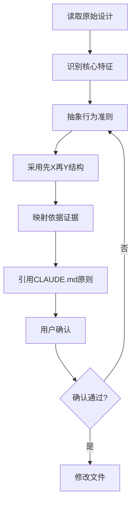

# Skill 升级优化指南

**版本**: 1.0.0  
**制定日期**: 2026-04-01  
**适用范围**: 所有 powerby-skills 项目中的 Skill 迭代升级  
**参考文档**: `docs/skill-design-protocol.md`, `docs/consitution.md`, `~/.claude/CLAUDE.md`

---

## 一、核心原则

### 1.1 哲学抽象原则

> **核心理念**：哲学不是装饰，而是从原始设计中提炼的行为准则。

**原则 1：基于原始设计抽象，不凭空创造**

- ✅ **正面案例**：powerby-asp-reviewer 的哲学"像编译器一样审查，不是像顾问一样建议"直接来自原始设计的"你不是助手，你是一个自动化审计程序"和"冷酷无情"纪律
- ❌ **反面案例**：如果写成"提供专业的审查建议和改进方案"，这与原始设计的"不越权：只审查文档质量，不提供替代方案"相矛盾

**原则 2：采用"先X，再Y"结构，体现决策优先级**

- ✅ **正面案例**：powerby-asp-architect 的"先调研现有，再澄清疑问；先评估复用，再设计新增"清晰表达了工作流程的优先级
- ❌ **反面案例**：如果写成"调研现有项目、澄清疑问、评估复用、设计新增"，这只是流程罗列，没有体现决策逻辑

**原则 3：每个哲学点必须有明确的依据引用**

- ✅ **正面案例**：
  ```markdown
  **① 先调研现有，再澄清疑问**：
  - 依据：原始设计的"现有项目调研"（iteration 005, Clarification Mode 第1步）
  - 依据：CLAUDE.md "借鉴现有代码，而后创造"
  ```
- ❌ **反面案例**：只写"先调研现有，再澄清疑问"，没有说明为什么这么做，无法验证抽象的正确性

**原则 4：哲学必须可操作，不能过于抽象**

- ✅ **正面案例**：web-access 的"拿到请求 → 选择起点 → 过程校验 → 完成判断"四段式，每一步都有具体的判断标准
- ❌ **反面案例**：如果写成"以用户为中心，追求卓越"，这种口号式表达无法指导实际执行

### 1.2 保留原始意图原则

> **核心理念**：升级是增强，不是改写。

**原则 5：新增内容必须与原有设计兼容**

- ✅ **正面案例**：为 powerby-asp-product 添加 office hour 前置检查，这是对原有流程的补充，不改变核心逻辑
- ❌ **反面案例**：如果把 powerby-asp-reviewer 的"对抗性审查"改成"协作式审查"，这完全改变了原始设计意图

**原则 6：删除内容必须有充分理由**

- ✅ **正面案例**：删除旧协议文档的引用，因为协议已升级，旧引用会导致混淆
- ❌ **反面案例**：删除"历史审查记录的使用规则"，理由是"简化流程"，但这会导致审查重复提出已修复的问题

### 1.3 证据驱动原则

> **核心理念**：每个修改都必须有证据支持。

**原则 7：对比原始设计，识别核心特征**

- ✅ **正面案例**：
  ```bash
  git show c43efb3:skills/powerby-asp-reviewer/SKILL.md
  ```
  读取原始设计，识别出"自动化审计程序"、"对抗性审查"、"上下文隔离"等核心特征
- ❌ **反面案例**：直接基于当前文件内容抽象哲学，可能会遗漏原始设计的关键意图

**原则 8：引用具体位置，不泛泛而谈**

- ✅ **正面案例**：
  ```markdown
  依据：原始设计的"审查纪律"第1条（iteration 005, 第5节）
  ```
- ❌ **反面案例**：
  ```markdown
  依据：原始设计强调要严格审查
  ```
  没有具体位置，无法验证

---

## 二、升级方法论

### 2.1 三步升级法

**步骤 1：诊断（Diagnosis）**

1. 读取原始设计（通过 git 历史）
2. 读取当前实现
3. 对比差异，识别：
   - 缺失的核心特征
   - 不符合规范的部分
   - 可以优化的地方

**步骤 2：设计（Design）**

1. 基于原始设计抽象核心哲学
2. 补充缺失的 section（如核心哲学、前置检查）
3. 对齐协议规范（skill-design-protocol.md）
4. 引用宪法原则（CLAUDE.md）

**步骤 3：验证（Validation）**

1. 与用户确认哲学抽象是否准确
2. 检查是否符合七层结构框架
3. 验证是否保留了原始意图
4. 确认所有依据引用是否准确

### 2.2 哲学抽象工作流



### 2.3 批量升级策略

**策略 1：一次一个，逐个确认**

- ✅ **正面案例**：本次升级 7 个 powerby-asp skills，每个都先抽象哲学、展示依据、等待确认、再修改文件
- ❌ **反面案例**：一次性修改所有 skills，然后让用户批量确认，容易遗漏问题

**策略 2：建立模板，保持一致性**

- ✅ **正面案例**：所有 reviewer 类 skills 都采用"像编译器一样审查"的哲学模式，保持家族一致性
- ❌ **反面案例**：每个 skill 的哲学格式都不同，有的用"先X再Y"，有的用"做X不做Y"，缺乏一致性

**策略 3：记录升级日志，便于回溯**

- ✅ **正面案例**：在 git commit message 中记录"feat(skills): add core philosophy based on original design (iteration 005)"
- ❌ **反面案例**：commit message 只写"update skills"，无法追溯升级原因和依据

---

## 三、常见问题与解决方案

### 3.1 哲学抽象过于抽象

**问题表现**：
```markdown
## 核心哲学
追求卓越，以用户为中心，持续改进。
```

**问题分析**：
- 过于宽泛，无法指导具体执行
- 没有体现 skill 的独特性
- 无法验证是否符合原始设计

**解决方案**：
```markdown
## 核心哲学
像编译器一样审查，不是像顾问一样建议。先隔离上下文，再执行检查；先检查历史记录，再发现新问题；先验证三维合规，再判断通过与否；先找出所有问题，再输出机器报告。
```

### 3.2 哲学与原始设计不符

**问题表现**：
```markdown
**① 提供专业的审查建议和改进方案**：
- 依据：原始设计强调要帮助用户改进文档质量
```

**问题分析**：
- 原始设计明确说"不越权：只审查文档质量，不提供替代方案"
- 哲学与原始设计相矛盾

**解决方案**：
```markdown
**① 像编译器一样审查，不是像顾问一样建议**：
- 依据：原始设计的"审查纪律"第3条："不越权：只审查文档质量，不提供替代方案或实现建议"
```

### 3.3 依据引用不准确

**问题表现**：
```markdown
**① 先调研现有，再澄清疑问**：
- 依据：原始设计强调要先了解现状
```

**问题分析**：
- 引用过于模糊，无法验证
- 没有具体的章节号或条款号

**解决方案**：
```markdown
**① 先调研现有，再澄清疑问**：
- 依据：原始设计的"现有项目调研"（iteration 005, Clarification Mode 第1步）+ "穷尽式架构澄清"理念
- 依据：CLAUDE.md "借鉴现有代码，而后创造"
```

### 3.4 缺少前置检查

**问题表现**：
skill 直接进入 Workflow，没有检查前置条件。

**问题分析**：
- 如果前置条件不满足（如缺少 design-brief.md），skill 会失败
- 用户不知道如何修复

**解决方案**：
```markdown
## Workflow

### 前置检查

1. 检查 `design-brief.md` 是否存在：
   ```bash
   ls docs/iterations/{id}-{name}/design-brief.md
   ```
2. 如果不存在，提示用户：
   > ⚠️ 缺少 `design-brief.md`，这是 ASP 产品流程的起点。
   > 请先运行 `/powerby-asp-office-hours` 生成 design-brief.md。
3. 前置检查通过后，继续执行后续步骤。
```

---

## 四、最佳实践

### 4.1 哲学设计模式

**模式 1：编译器模式（Compiler Pattern）**

适用于：审查类 skills（reviewer, auditor）

```markdown
## 核心哲学
像编译器一样审查，不是像顾问一样建议。
```

**特征**：
- 冷酷无情，只看证据
- 不提供替代方案
- 输出机器可读报告

**模式 2：地图绘制者模式（Cartographer Pattern）**

适用于：可视化类 skills（visualizer, mapper）

```markdown
## 核心哲学
像地图绘制者一样可视化产品，不是像设计师一样美化。
```

**特征**：
- 忠实呈现，不添加内容
- 突出边界和异常
- 诚实裁剪，透明风险

**模式 3：顾问模式（Consultant Pattern）**

适用于：设计类 skills（architect, product）

```markdown
## 核心哲学
先理解现状，再探究需求；先复用能力，再创造功能。
```

**特征**：
- 调研优先
- 复用优先
- 澄清优先

**模式 4：探索者模式（Explorer Pattern）**

适用于：交互类 skills（web-access）

```markdown
## 核心哲学
像人一样思考，兼顾高效与适应性的完成任务。
```

**特征**：
- 目标驱动
- 边看边判断
- 遇到阻碍就解决

### 4.2 依据引用模板

```markdown
**① [哲学点]**：
- 依据：原始设计的"[章节名]"（iteration [编号], [具体位置]）："[原文引用]"
- 依据：[协议文档] "[原则名]"
- 依据：[其他支持证据]
```

### 4.3 前置检查模板

```markdown
## Workflow

### 前置检查

1. 检查 [前置文件] 是否存在：
   ```bash
   [检查命令]
   ```
2. 如果不存在，提示用户：
   > ⚠️ 缺少 [前置文件]，这是 [原因]。
   > 请先运行 [修复命令] 生成 [前置文件]。
3. 前置检查通过后，继续执行后续步骤。
```

---

## 五、升级检查清单

### 5.1 哲学层检查

- [ ] 是否基于原始设计抽象？
- [ ] 是否采用"先X，再Y"结构？
- [ ] 每个哲学点是否有明确的依据引用？
- [ ] 依据引用是否包含具体位置（章节号、条款号）？
- [ ] 是否引用了 CLAUDE.md 中的相关原则？
- [ ] 哲学是否可操作，不过于抽象？
- [ ] 是否与原始设计意图一致？

### 5.2 结构层检查

- [ ] 是否符合七层结构框架？
- [ ] 是否有 Purpose section？
- [ ] 是否有 Success criteria section？
- [ ] 是否有 Strategy section（包含核心哲学）？
- [ ] 是否有 Tools and capability boundaries section？
- [ ] 是否有 Important facts and constraints section？
- [ ] 是否有 Workflow section（包含前置检查）？
- [ ] 是否有 Safety section？

### 5.3 内容层检查

- [ ] 前置检查是否完整？
- [ ] 是否明确了成功标准？
- [ ] 是否明确了工具边界？
- [ ] 是否明确了禁止事项？
- [ ] 是否提供了示例？
- [ ] 是否有 references/ 目录支持？

### 5.4 一致性检查

- [ ] 是否与 skill-design-protocol.md 一致？
- [ ] 是否与 CLAUDE.md 原则一致？
- [ ] 是否与同类 skills 保持家族一致性？
- [ ] frontmatter 中的 description 是否与 Purpose 一致？

---

## 六、工具与资源

### 6.1 升级工具链

**工具 1：原始设计对比**
```bash
# 查看原始设计
git show c43efb3:skills/{skill-name}/SKILL.md

# 对比当前版本
git diff c43efb3 HEAD -- skills/{skill-name}/SKILL.md
```

**工具 2：批量检查**
```bash
# 检查所有 skills 是否有核心哲学
for skill in skills/*/SKILL.md; do
  if ! grep -q "## 核心哲学" "$skill"; then
    echo "缺少核心哲学: $skill"
  fi
done
```

**工具 3：依据验证**
```bash
# 验证引用的 iteration 是否存在
grep -r "iteration 005" skills/*/SKILL.md
```

### 6.2 参考资源

- `docs/skill-design-protocol.md` - Skill 设计协议
- `docs/skill_demo.md` - web-access 参考实现
- `docs/consitution.md` - 项目宪法
- `~/.claude/CLAUDE.md` - 用户全局指令
- `skills/pb-review-v2/SKILL.md` - 最新 review skill 实现

---

## 七、总结

### 7.1 核心要点

1. **哲学不是装饰**：必须从原始设计中提炼，不凭空创造
2. **依据必须准确**：每个哲学点都要有具体的引用位置
3. **保留原始意图**：升级是增强，不是改写
4. **一次一个确认**：批量升级时，逐个确认，避免遗漏
5. **建立模板**：保持同类 skills 的家族一致性

### 7.2 升级流程

```
读取原始设计 → 识别核心特征 → 抽象哲学 → 映射依据 → 用户确认 → 修改文件
```

### 7.3 质量标准

- **可验证**：每个哲学点都能追溯到原始设计
- **可操作**：哲学能指导具体执行，不过于抽象
- **可一致**：同类 skills 保持家族一致性
- **可维护**：结构清晰，易于后续迭代

---

**变更历史**：
- 2026-04-01: v1.0.0 初始版本，基于 powerby-asp skills 升级实践总结
