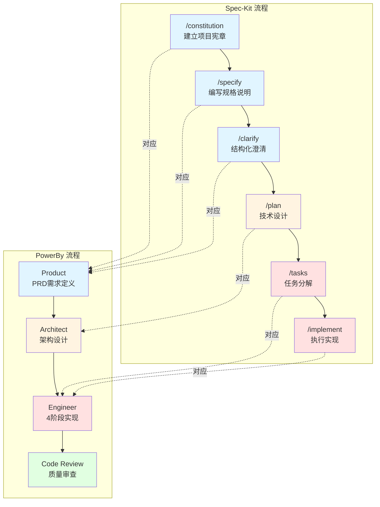
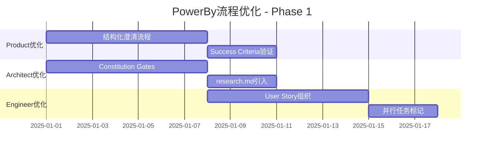

# Spec-Kit 与 PowerBy 流程对比分析及优化建议

**生成日期**: 2025-12-17
**目的**: 全面对比Spec-Kit和PowerBy工作流程，识别异同，提出具体优化建议

---

## 目录

1. [核心理念对比](#1-核心理念对比)
2. [工作流程对比](#2-工作流程对比)
3. [文档结构对比](#3-文档结构对比)
4. [质量保证机制对比](#4-质量保证机制对比)
5. [优化建议清单](#5-优化建议清单)

---

## 1. 核心理念对比

### 1.1 相同点

| 理念维度 | Spec-Kit | PowerBy | 分析 |
|---------|----------|---------|------|
| **零假设原则** | ✅ 最多3个[NEEDS CLARIFICATION]标记 | ✅ 零假设原则(Zero-Assumption Principle) | 两者都强调不做假设 |
| **文档驱动** | ✅ Spec-Driven Development | ✅ 文档驱动(Document-Driven) | 两者都强调先文档后代码 |
| **质量门禁** | ✅ Constitution Check Gates | ✅ Definition of Done | 两者都有明确的质量标准 |
| **简单性原则** | ✅ Anti-Abstraction Gate | ✅ KISS原则 | 两者都反对过度设计 |
| **测试驱动** | ✅ 测试优先(Tests in tasks.md) | ✅ TDD流程(红-绿-重构) | 两者都强调测试的重要性 |

### 1.2 差异点

| 维度 | Spec-Kit | PowerBy | 影响分析 |
|-----|----------|---------|---------|
| **Constitution地位** | 项目根基,有版本管理(vX.Y.Z) | 全局原则,无版本管理 | Spec-Kit的Constitution更正式和可追溯 |
| **规格可执行性** | 规格即代码(specifications become executable) | 文档指导编码 | Spec-Kit更强调规格的技术约束力 |
| **澄清方式** | 结构化澄清命令(/speckit.clarify) | 对话式迭代澄清 | Spec-Kit更系统化 |
| **MVP策略** | 通过优先级(P1/P2/P3)区分 | MVP优先原则作为核心哲学 | PowerBy更激进地强调MVP |
| **方案评估** | 2-3个关键决策点 | 至少2种方案+哲学对齐分析 | PowerBy评估更深入(SOLID/KISS/DRY对齐) |

---

## 2. 工作流程对比

### 2.1 流程阶段映射



### 2.2 流程差异分析

#### 优势对比

| 流程特征 | Spec-Kit优势 | PowerBy优势 |
|---------|-------------|------------|
| **澄清机制** | ✅ 独立的/clarify命令<br/>✅ 结构化分类审查<br/>✅ 最多5个问题限制 | ✅ 对话式灵活调整<br/>✅ 实时反馈循环 |
| **设计阶段** | ✅ 分离research和design<br/>✅ Phase 0专门做调研 | ✅ 4阶段架构流程<br/>✅ 强制多方案对比<br/>✅ 哲学对齐分析 |
| **任务管理** | ✅ 按User Story组织<br/>✅ [P]并行标记<br/>✅ 独立可测试性 | ✅ 3-5阶段计划<br/>✅ 实时更新状态 |
| **质量保证** | ✅ 多类型checklist<br/>✅ implement前检查 | ✅ 独立code review角色<br/>✅ 5大类审计 |
| **分支管理** | ✅ 自动化分支创建<br/>✅ specs/目录结构 | ❌ 未明确定义 |

#### 差距分析

**Spec-Kit缺失的PowerBy特性**:
1. **顾问式设计流程**: PowerBy的Architect有4阶段强制确认机制
2. **哲学对齐分析**: 对SOLID/KISS/DRY的显式评估
3. **主动障碍解决协议**: 遇到问题时的标准化响应流程
4. **MVP战略思维**: 无情削减、推迟非核心功能

**PowerBy缺失的Spec-Kit特性**:
1. **结构化澄清流程**: /clarify命令的分类问题法
2. **宪章版本管理**: Constitution的语义化版本控制
3. **分支自动化**: Feature branch + specs目录的自动创建
4. **并行任务标记**: [P]标记支持并行执行
5. **Checklist系统**: 多维度、多类型的验收检查清单

---

## 3. 文档结构对比

### 3.1 文档类型映射

| 阶段 | Spec-Kit文档 | PowerBy文档 | 核心差异 |
|-----|-------------|------------|---------|
| **需求** | spec.md | prd.md | Spec-Kit包含User Stories优先级 |
| **澄清** | spec.md (Clarifications section) | (融入prd.md迭代) | Spec-Kit独立记录澄清历史 |
| **设计** | plan.md + data-model.md + contracts/ | architecture.md | Spec-Kit更细化(数据/契约分离) |
| **调研** | research.md | (无) | **PowerBy缺失** |
| **任务** | tasks.md | tasks.md (IMPLEMENTATION_PLAN.md) | Spec-Kit按User Story组织 |
| **验收** | checklists/*.md (多文件) | checklist.md (单文件) | Spec-Kit支持多维度检查清单 |
| **宪章** | constitution.md (带版本) | consitution.md (无版本) | Spec-Kit更正式 |

### 3.2 文档模板对比

#### Spec Template (spec-kit) vs PRD (PowerBy)

```markdown
## Spec-Kit: spec.md 结构
- Feature Overview
- User Stories (带P1/P2/P3优先级)
- Functional Requirements
- Success Criteria (技术无关的可测量指标)
- Data Model (可选)
- Clarifications (按日期分组的Q&A历史)

## PowerBy: prd.md 结构
- 第一部分:需求原始输入
- 第二部分:功能规格框架
  - 模块一:功能定义与拆解
  - 模块二:交互流程与规则
  - 模块三:范围边界
- 第三部分:AI分析与建议
  - 📊 建议的MVP功能点清单 ([P0]/[P1])
  - 🗂️ 待决策清单
```

**关键差异**:
- Spec-Kit的Success Criteria更严格(禁止技术细节)
- PowerBy的MVP功能点清单更详细(带"可推迟"标签)
- Spec-Kit有独立的Clarifications历史追踪

#### Plan Template对比

```markdown
## Spec-Kit: plan.md 结构
- Technical Context
- Constitution Check (带gates验收)
  - Simplicity Gate
  - Anti-Abstraction Gate
  - Integration-First Gate
- Phase 0: Research (research.md)
- Phase 1: Design (data-model.md, contracts/)
- Phase 2: Agent Context Update

## PowerBy: architecture.md 结构
- 阶段一:需求解读与目标对齐
- 阶段二:架构设计与可视化
  - 核心架构图(Mermaid)
  - 组件与需求映射
- 阶段三:关键决策点与方案评估
  - 至少2种方案
  - 优缺点分析
- 阶段四:最终决策与交付
```

**关键差异**:
- Spec-Kit的Constitution Check更结构化(3个Gates)
- PowerBy的组件与需求映射更显式
- Spec-Kit有独立的research.md用于技术调研

---

## 4. 质量保证机制对比

### 4.1 质量门禁对比

| 门禁类型 | Spec-Kit | PowerBy | 分析 |
|---------|----------|---------|------|
| **需求阶段** | ✅ Spec Quality Checklist<br/>- 无实现细节<br/>- 无[NEEDS CLARIFICATION]<br/>- Success Criteria可测量 | ✅ MVP功能点清单<br/>✅ 决策点必须有方案 | Spec-Kit更系统化 |
| **设计阶段** | ✅ Constitution Check<br/>- Simplicity Gate<br/>- Anti-Abstraction Gate<br/>- Integration-First Gate | ✅ 哲学对齐分析<br/>- SOLID<br/>- KISS<br/>- DRY<br/>- 最小影响面 | PowerBy分析更深入 |
| **实现前** | ✅ Checklist完整性检查<br/>(如未完成可选择继续) | ✅ 测试规格文档<br/>(关联prd和architecture) | 两者方法不同但都有效 |
| **代码审查** | ❌ 无独立审查流程 | ✅ 5大类审计<br/>✅ 功能验收方案设计 | **Spec-Kit缺失** |

### 4.2 测试策略对比

```markdown
## Spec-Kit测试组织
tasks.md中按User Story组织:
- [ ] T012 [P] [US1] Write contract test for GET /users
- [ ] T013 [US1] Implement User model
- [ ] T014 [US1] Write unit test for UserService
- [ ] T015 [US1] Implement UserService

特点:
✅ 测试与User Story强绑定
✅ [P]标记支持并行测试
✅ 契约测试、单元测试分类清晰
❌ 测试可选(仅在spec要求时生成)

## PowerBy测试组织
测试规格文档(阶段三):
| 测试点ID | 关联需求 | 关联架构 | 测试策略 | 成功标准 |
|---------|---------|---------|---------|---------|
| TC-001  | 用户故事#3.1 | 服务A的API契约 | 单元测试 | createUser返回201 |

TDD实现流程:
1. 红灯: 编写失败测试
2. 绿灯: 最小化实现
3. 重构: 在测试保护下优化

特点:
✅ 测试规格显式设计
✅ 强制TDD流程
✅ 可追溯性矩阵
❌ 无并行测试标记
```

---

## 5. 优化建议清单

### 🔥 高优先级优化 (High Priority)

#### 建议1: 引入Spec-Kit的结构化澄清流程

**当前问题**: PowerBy的澄清过程依赖对话式迭代,缺乏系统性

**Spec-Kit优势**:
- 11大类结构化分类(功能范围、数据模型、交互流程、非功能属性等)
- 最多5个问题限制(强制优先级排序)
- 每个问题有推荐答案和备选方案

**优化方案**:

在PowerBy Product角色中新增**"澄清阶段"**:

```markdown
## 新增:澄清阶段(Clarification Stage)

在MVP功能点清单生成后,自动触发结构化澄清:

### 分类扫描清单
1. **功能范围与边界**
   - 核心目标是否明确?
   - Out-of-scope是否声明?

2. **数据模型与实体**
   - 关键实体是否定义?
   - 唯一性规则是否明确?

3. **非功能属性**
   - 性能目标(响应时间、并发量)?
   - 安全要求(认证/授权)?

### 问题生成规则
- 最多5个问题
- 优先级:范围>安全>UX>技术细节
- 每个问题提供:推荐方案+2-3个备选项
- 问题必须影响MVP实现或验收
```

**预期效果**:
- 减少后续阶段的返工
- PRD质量更稳定
- 澄清过程可追溯

---

#### 建议2: 在Architect角色中添加Constitution Check Gates

**当前问题**: PowerBy的架构设计虽有哲学对齐分析,但缺少阶段性验证门禁

**Spec-Kit优势**:
- Phase -1: Pre-implementation Gates
- 3个显式验收点: Simplicity / Anti-Abstraction / Integration-First
- 违反需显式记录并证明合理性

**优化方案**:

在架构设计阶段三(关键决策点评估)后,新增**"宪章验收门禁"**:

```markdown
## 新增:宪章验收门禁(Constitution Gates)

在提交最终架构方案前,必须通过以下门禁:

### Gate 1: 简单性验收 (Simplicity Gate)
- [ ] 方案是否选择了最简单的能满足需求的设计?
- [ ] 是否存在为"未来可能"而引入的抽象?
- [ ] 违反记录:_____(如违反需证明必要性)

### Gate 2: 反过度抽象验收 (Anti-Abstraction Gate)
- [ ] 是否避免了不必要的设计模式?
- [ ] 抽象层级是否<3层?
- [ ] 违反记录:_____(如违反需证明必要性)

### Gate 3: 集成优先验收 (Integration-First Gate)
- [ ] 是否优先使用现有库/服务?
- [ ] 是否避免重复造轮子?
- [ ] 新组件记录:_____(列出所有新建组件及理由)

### 复杂度追踪
- 组件数量:_____
- 新引入依赖:_____
- 预估代码行数:_____
```

**预期效果**:
- 防止过度设计
- 复杂度可量化追踪
- 架构决策有据可查

---

#### 建议3: 在Engineer角色中引入tasks.md的User Story组织方式

**当前问题**: PowerBy的tasks.md按阶段组织,缺少与需求的显式映射

**Spec-Kit优势**:
- 每个task标记User Story ID ([US1], [US2])
- 支持并行任务标记 ([P])
- 独立可测试性(每个User Story可独立验证)

**优化方案**:

改进PowerBy的IMPLEMENTATION_PLAN.md结构:

```markdown
## 当前结构 (PowerBy)
## 阶段1: 数据模型设计
**目标**: ...
**验收标准**: ...
**状态**: 未开始

## 优化后结构 (结合Spec-Kit)
## 阶段1: Setup & Foundation
**状态**: 未开始

### 任务清单
- [ ] T001 [P] Initialize project structure
- [ ] T002 [P] Setup database connection

## 阶段2: User Story 1 - 用户注册功能 [US1]
**需求来源**: prd.md § 3.1
**状态**: 未开始

### 任务清单
- [ ] T003 [P] [US1] Create User model (src/models/user.py)
- [ ] T004 [P] [US1] Write UserService unit tests
- [ ] T005 [US1] Implement UserService (src/services/user_service.py)
- [ ] T006 [US1] Create POST /register endpoint
- [ ] T007 [US1] Integration test for registration flow

### 验收标准
- User model有email/password/created_at字段
- UserService.create_user方法返回User对象
- POST /register返回201 + user_id

## 阶段3: User Story 2 - 用户登录功能 [US2]
...
```

**标记说明**:
- `[P]`: 可并行执行的任务(不依赖其他未完成任务)
- `[US1]`: 关联到prd.md的User Story 1

**预期效果**:
- 任务与需求可追溯
- 支持增量交付(每个User Story独立可发布)
- 并行任务可视化

---

#### 建议4: 为PowerBy添加独立的research.md文档

**当前问题**: 技术调研内容散落在architecture.md中,难以追溯决策依据

**Spec-Kit优势**:
- Phase 0专门产出research.md
- 记录: Decision / Rationale / Alternatives Considered
- 所有NEEDS CLARIFICATION在此阶段解决

**优化方案**:

在Architect角色的阶段一(需求解读)和阶段二(架构设计)之间,插入**"阶段1.5: 技术调研"**:

```markdown
## 新增:阶段1.5 技术调研 (Technical Research)

在进行架构设计前,针对关键技术决策进行调研并记录。

### 调研触发条件
- 架构中需要选型(数据库、框架、第三方服务)
- 存在技术风险或不确定性
- 需要评估多种技术方案

### 调研输出: research.md

文件路径: docs/{project_name}/research.md

#### 模板结构
```markdown
# 技术调研报告

## 调研项1: [例如:数据库选型]

### 需要解决的问题
prd.md要求存储100万+用户数据,需选择合适的数据库。

### 调研的备选方案
- 方案A: PostgreSQL
- 方案B: MongoDB
- 方案C: MySQL

### 详细分析
| 维度 | PostgreSQL | MongoDB | MySQL |
|-----|-----------|---------|-------|
| 关系型支持 | ✅ 强 | ❌ 弱 | ✅ 强 |
| JSON支持 | ✅ JSONB | ✅ 原生 | ⚠️ 一般 |
| 扩展性 | ⚠️ 垂直为主 | ✅ 水平扩展 | ⚠️ 垂直为主 |
| 团队熟悉度 | ✅ 高 | ⚠️ 中 | ✅ 高 |

### 最终决策: PostgreSQL

### 决策理由
1. 需求需要关系型约束(用户-角色多对多)
2. JSONB支持灵活扩展字段
3. 团队已有运维经验

### 被拒绝的方案及原因
- MongoDB: 缺少事务支持,不适合金融场景
- MySQL: JSON功能不如PostgreSQL完善
```

**预期效果**:
- 技术决策有据可查
- 新团队成员快速了解选型背景
- 避免重复讨论已决策的问题

---

#### 建议5: 在Code Review角色中添加Checklist验证

**当前问题**: Code Review缺少对验收清单的系统性检查

**Spec-Kit优势**:
- /implement命令在执行前检查所有checklists
- 如有未完成项,需用户确认是否继续

**优化方案**:

在Code Review的**"审查清单"**部分新增第6项:

```markdown
## 6. 验收清单完整性审计 (Acceptance Checklist Audit)

### 检查点
- [ ] 本PR声称完成的功能点,是否在checklist.md中有对应项?
- [ ] checklist.md中本应由此PR完成的项,是否都已标记为 [x]?
- [ ] 是否存在checklist.md中标记完成但实际未实现的项?

### 具体验证方法

#### Step 1: 读取checklist.md
提取所有待办项,格式如:
- [ ] 功能A: 用户注册接口
- [x] 功能B: 用户登录接口

#### Step 2: 交叉验证
对于每个 [x] 标记的项:
1. 在代码diff中找到对应实现
2. 验证实现是否完整(无假实现、TODO等)
3. 验证是否有对应测试

#### Step 3: 生成验收差异报告

```markdown
### Checklist验收差异报告

#### ✅ 已验证完成
- 功能B: 用户登录接口
  - 实现文件: src/auth/login.py
  - 测试覆盖: tests/test_login.py ✅

#### ❌ 标记完成但未实现
- 功能C: 密码重置
  - 问题: login.py中reset_password()返回硬编码数据
  - 建议: 移除[x]标记或补充真实实现

#### ⚠️ 实现但未标记
- 功能D: JWT token生成
  - 问题: 代码已实现但checklist.md中仍为[ ]
  - 建议: 更新checklist.md标记为[x]
```

**预期效果**:
- Checklist与代码同步
- 防止虚假完成
- 验收过程可追溯

---

### 📊 中优先级优化 (Medium Priority)

#### 建议6: 引入Constitution的版本管理

**当前问题**: PowerBy的Constitution无版本号,修改历史难以追踪

**Spec-Kit优势**:
- Constitution有语义化版本(vX.Y.Z)
- MAJOR: 不兼容的原则变更
- MINOR: 新增原则
- PATCH: 措辞优化

**优化方案**:

在`docs/powerby-consitution.md`开头添加:

```markdown
# PowerBy Constitution

**版本**: v1.0.0
**批准日期**: 2025-01-01
**最后修订**: 2025-01-01

## 版本历史
| 版本 | 日期 | 变更说明 |
|-----|------|---------|
| v1.0.0 | 2025-01-01 | 初始版本 |

## 版本规则
- MAJOR: 删除或根本改变核心原则(如废除TDD)
- MINOR: 新增原则或重要扩展
- PATCH: 措辞优化、错别字修正
```

---

#### 建议7: 在Engineer角色中添加障碍升级时限

**当前问题**: "主动式障碍解决协议"虽好,但缺少触发时机的量化标准

**Spec-Kit借鉴**: Spec-Kit虽无显式规定,但PowerBy Constitution已有"3次尝试"规则

**优化方案**:

在Engineer的"第四部分:主动式障碍解决协议"开头明确触发条件:

```markdown
## 触发条件 (Trigger Conditions)

你必须在以下任一情况下立即启动障碍解决协议:

### 自动触发场景
1. **3次尝试规则**: 针对同一问题已尝试3种不同方法均失败
2. **2小时卡点**: 在同一任务上卡住超过2小时无进展
3. **文档冲突**: 发现prd/architecture/tasks之间存在矛盾
4. **依赖阻塞**: 发现依赖的外部服务/库不可用或不满足需求
5. **技术债务**: 发现必须修复的现有代码问题才能继续

### 手动判断场景
- 预感当前方向可能导致返工
- 需要架构层面的变更才能继续
```

---

#### 建议8: 为PowerBy添加自动化分支管理脚本

**当前问题**: PowerBy缺少feature branch自动创建流程

**Spec-Kit优势**:
- 自动检测已有分支最大编号
- 生成`{number}-{short-name}`格式分支
- 自动创建`specs/{number}-{short-name}/`目录

**优化方案**:

创建脚本: `scripts/create-feature.sh`

```bash
#!/bin/bash
# PowerBy Feature Branch Creator

# Usage: ./scripts/create-feature.sh "User Authentication"

FEATURE_DESC="$1"

# 1. Generate short-name
SHORT_NAME=$(echo "$FEATURE_DESC" | \
  tr '[:upper:]' '[:lower:]' | \
  tr ' ' '-' | \
  sed 's/[^a-z0-9-]//g')

# 2. Find highest number
HIGHEST=$(git branch -r | \
  grep -oE '[0-9]+-'"$SHORT_NAME"'$' | \
  grep -oE '^[0-9]+' | \
  sort -rn | head -1)

NEXT_NUM=$((HIGHEST + 1))
BRANCH_NAME="$NEXT_NUM-$SHORT_NAME"

# 3. Create branch and directory
git checkout -b "$BRANCH_NAME"
mkdir -p "docs/$BRANCH_NAME"

# 4. Initialize PRD template
cat > "docs/$BRANCH_NAME/prd.md" <<EOF
# $FEATURE_DESC

## 第一部分：需求原始输入

(由用户填写)

## 第二部分：功能规格框架

(待AI生成)

## 第三部分：AI分析与建议

(待AI生成)
EOF

echo "✅ Created branch: $BRANCH_NAME"
echo "✅ Created directory: docs/$BRANCH_NAME/"
echo "📝 Next: Fill in docs/$BRANCH_NAME/prd.md"
```

---

### 💡 低优先级优化 (Low Priority)

#### 建议9: 统一tasks.md的Checkbox格式

**当前问题**: PowerBy的tasks.md无严格格式规范

**Spec-Kit优势**: 强制格式 `- [ ] [ID] [P] [Story] Description`

**优化方案**: 在Engineer和Code Review文档中要求:

```markdown
### 任务格式规范
- [ ] T001 [P] Initialize project
- [ ] T005 [US1] Create User model (src/models/user.py)

格式要求:
- 必须有checkbox: - [ ]
- 必须有ID: T001, T002...
- 可选[P]: 可并行任务
- 可选[US1]: 关联User Story
- 必须有文件路径: (path/to/file)
```

---

#### 建议10: 在Product角色中引入Success Criteria的技术无关性检查

**当前问题**: PRD中的成功标准可能混入技术细节

**Spec-Kit优势**: 严格禁止实现细节(如"API响应时间<200ms"应改为"用户看到结果瞬时")

**优化方案**:

在Product角色的"工作流程"第4步"最终交付"前,新增验证步骤:

```markdown
### 成功标准验证 (Success Criteria Validation)

在生成最终PRD前,检查所有成功标准:

#### ❌ 禁止的技术细节
- 数据库/框架/语言名称
- API响应时间、TPS等技术指标
- 缓存命中率等实现细节

#### ✅ 正确的用户视角描述
- "用户在3分钟内完成注册"
- "系统支持1万并发用户"
- "搜索结果在1秒内显示"

#### 自动检测关键词
如成功标准包含以下词汇,需转换为用户视角:
- API, endpoint, database, cache, Redis, PostgreSQL
- TPS, QPS, latency, throughput
- React, Vue, Django, Spring
```

---

## 6. 优化实施路线图

### Phase 1: 核心流程优化 (Week 1-2)



### Phase 2: 质量保证增强 (Week 3-4)

- Code Review添加Checklist验证
- Constitution版本管理
- 障碍解决时限明确

### Phase 3: 自动化工具 (Week 5-6)

- Feature branch自动创建脚本
- Tasks.md格式校验工具
- 文档一致性检查工具

---

## 7. 总结

### 核心发现

1. **Spec-Kit优势**: 流程工具化、文档结构化、质量门禁系统化
2. **PowerBy优势**: 设计思维深度、MVP战略聚焦、顾问式协作

### 最有价值的5个优化

| 优化项 | 预期ROI | 实施难度 | 优先级 |
|-------|---------|---------|-------|
| 1. 结构化澄清流程 | 🔥🔥🔥🔥🔥 减少50%返工 | ⚙️⚙️ 中等 | P0 |
| 2. Constitution Gates | 🔥🔥🔥🔥 防止过度设计 | ⚙️ 简单 | P0 |
| 3. User Story组织 | 🔥🔥🔥🔥 增强可追溯性 | ⚙️⚙️ 中等 | P0 |
| 4. research.md文档 | 🔥🔥🔥 决策可追溯 | ⚙️ 简单 | P0 |
| 5. Checklist验证 | 🔥🔥🔥 防止虚假完成 | ⚙️⚙️⚙️ 复杂 | P1 |

### 建议优先实施顺序

1. **立即实施** (本周):
   - Constitution Gates (简单且高价值)
   - research.md模板创建

2. **短期实施** (2周内):
   - 结构化澄清流程
   - User Story组织方式

3. **中期实施** (1个月内):
   - Checklist验证机制
   - 自动化脚本开发

---

**文档维护者**: PowerBy Skills Team
**下次审查日期**: 2025-02-01
