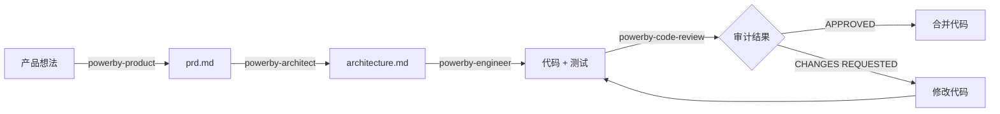

# PowerBy Skills - 工程化研发流程技能集

这是一套完整的、基于文档驱动和严格流程的AI辅助软件研发技能集。所有skills都遵循核心理念宪章（Constitution）中定义的原则，包括零假设原则、小步提交、SOLID/DRY/KISS等核心设计哲学。

## 📦 技能清单

### 核心角色 Skills（Orchestrator 层）

这些是完整的端到端工作流程技能，适合复杂任务的系统化处理。

| Skill | 角色 | 核心能力 | 输入 | 输出 | 适用场景 |
|-------|------|---------|------|------|---------|
| [powerby-product](./powerby-product/SKILL.md) | 世界级AI产品经理 | MVP驱动的需求精炼、功能拆解、优先级评估 | 产品想法、用户需求 | `prd.md` | 需要编写PRD、定义MVP范围、功能点拆解 |
| [powerby-architect](./powerby-architect/SKILL.md) | 首席AI系统架构师 | 技术架构设计、可视化、方案评估 | `prd.md` | `architecture.md` | 需要架构设计、技术方案评估、组件定义 |
| [powerby-engineer](./powerby-engineer/SKILL.md) | 资深软件研发工程师 | TDD实现、测试驱动开发、质量保证 | `prd.md`, `architecture.md`, `tasks.md` | 代码 + 测试 | 需要高质量实现、TDD开发、严格流程 |
| [powerby-code-review](./powerby-code-review/SKILL.md) | 首席工程师 & 流程守护者 | 代码审计、质量把关、验收方案设计 | PR + 三份文档 | 审计报告 | 需要代码审查、PR审批、质量验收 |

### 原子能力 Skills（Atomic 层）✨

这些是可复用的原子能力，既可以被核心 skills 内部调用，也可以独立使用。

| Skill | 核心能力 | 适用场景 | 被谁复用 |
|-------|---------|---------|---------|
| [solution-evaluation](./solution-evaluation/SKILL.md) | 技术方案评估、多方案权衡、哲学对齐分析 | 技术选型、架构决策、实现方案选择 | architect, engineer |
| [requirement-alignment](./requirement-alignment/SKILL.md) | 需求对齐、结构化复述、主动澄清 | 需求确认、任务理解、目标对齐 | product, architect, engineer |
| [mermaid-architecture](./mermaid-architecture/SKILL.md) | Mermaid可视化、架构图生成、多图表类型 | 架构可视化、系统设计展示、技术方案演示 | architect |
| [test-spec-design](./test-spec-design/SKILL.md) | 测试规格设计、TDD支持、验收标准定义 | 测试设计、TDD开发、质量保证 | engineer |
| [mvp-prioritization](./mvp-prioritization/SKILL.md) | MVP优先级评估、功能原子化、无情削减 | 功能评审、MVP定义、优先级排序 | product |
| [function-point-checker](./function-point-checker/SKILL.md) | 功能点检查、格式验证、质量分析 | PRD文档检查、功能点审查、质量保证 | product |

## 🔄 完整工作流程



### 阶段1：产品需求定义（Product）
- **使用**: `powerby-product` skill
- **输入**: 产品想法、用户需求描述
- **流程**: MVP循环迭代，功能拆解，优先级评估
- **输出**: `docs/{project}/prd.md`

### 阶段2：技术架构设计（Architect）
- **使用**: `powerby-architect` skill
- **输入**: `prd.md`
- **流程**: 4阶段架构设计（需求解读→架构设计→决策评估→交付）
- **输出**: `docs/{project}/architecture.md`

### 阶段3：代码实现（Engineer）
- **使用**: `powerby-engineer` skill
- **输入**: `prd.md`, `architecture.md`, `tasks.md`
- **流程**: 4阶段研发协议（分析对齐→方案设计→实现验证→工作交付）
- **输出**: 代码、测试、工作交付报告

### 阶段4：代码审查（Code Review）
- **使用**: `powerby-code-review` skill
- **输入**: Pull Request + 三份基准文档
- **流程**: 5大类审计（一致性、完整性、质量、测试、提交）
- **输出**: 结构化审计报告、功能验收方案

## 🎯 快速开始

### 场景1：从零开始启动新项目（完整流程）

```bash
# 步骤1：定义产品需求
用户: "使用 powerby-product skill，我想做一个区块链交易聚合器"

# 步骤2：设计技术架构
用户: "使用 powerby-architect skill，基于 docs/aggregator/prd.md 设计架构"

# 步骤3：实现核心功能
用户: "使用 powerby-engineer skill，实现 tasks.md 中的 TASK-001"

# 步骤4：代码审查
用户: "使用 powerby-code-review skill，审查 PR #123"
```

### 场景2：单独使用核心技能

```bash
# 只需要架构设计
用户: "使用 powerby-architect skill，我已经有了PRD，需要你帮我设计架构"

# 只需要代码审查
用户: "使用 powerby-code-review skill，请审查这个PR"
```

### 场景3：使用原子能力技能✨

```bash
# 只需要方案评估
用户: "使用 solution-evaluation skill，帮我评估Redis和Memcached两个缓存方案"

# 只需要需求对齐
用户: "使用 requirement-alignment skill，帮我确认对'用户认证'功能的理解是否正确"

# 只需要架构可视化
用户: "使用 mermaid-architecture skill，帮我用Mermaid画一个微服务架构图"

# 只需要测试规格设计
用户: "使用 test-spec-design skill，帮我设计'用户登录'功能的测试规格"

# 只需要MVP优先级评估
用户: "使用 mvp-prioritization skill，我有20个功能想法，帮我评估哪些是MVP必须的"

# 只需要功能点检查
用户: "使用 function-point-checker skill，帮我检查刚完成的PRD文档中的所有功能点"
```

### 场景4：原子能力的内部复用

原子能力 skills 会被核心 skills 自动调用：

- `powerby-product` 内部会使用 `mvp-prioritization` 和 `requirement-alignment`
- `powerby-architect` 内部会使用 `requirement-alignment`, `mermaid-architecture`, `solution-evaluation`
- `powerby-engineer` 内部会使用 `requirement-alignment`, `solution-evaluation`, `test-spec-design`

## 📋 核心原则（来自Constitution）

所有 skills 都严格遵循以下核心理念：

### 1. 零假设原则（Zero-Assumption Principle）
- 绝不猜测用户的模糊意图
- 当指令不明确时，提出具体问题澄清需求

### 2. 小步提交，优于"大爆炸"式开发
- 代码应频繁提交
- 每次提交都可编译且通过测试

### 3. 借鉴现有代码，而后创造
- 先研究项目中的既有模式
- 做好规划后再实施

### 4. 拥抱务实，而非固守教条
- 灵活适应项目现实
- 选择最合适的解决方案

### 5. 意图清晰，优于炫技代码
- 编写"无聊"且一目了然的代码
- 单一职责、避免过早抽象

### 6. 核心设计哲学
- **SOLID原则**: 单一职责、开放封闭、里氏替换、接口隔离、依赖倒置
- **DRY原则**: Don't Repeat Yourself
- **KISS原则**: Keep It Simple, Stupid
- **奥卡姆剃刀**: 如无必要，勿增实体

## 🔧 技能特性对比

| 特性 | Product | Architect | Engineer | Code Review |
|------|---------|-----------|----------|-------------|
| 文档驱动 | ❌ | ✅ | ✅ | ✅ |
| 多阶段流程 | ✅ (循环) | ✅ (4阶段) | ✅ (4阶段) | ✅ (单次) |
| 方案评估 | ✅ (MVP视角) | ✅ (技术视角) | ✅ (哲学对齐) | ✅ (质量视角) |
| 用户确认 | ✅ (每回合) | ✅ (每阶段) | ✅ (每阶段) | ❌ (一次性) |
| 可视化输出 | ❌ | ✅ (Mermaid) | ❌ | ❌ |
| TDD要求 | ❌ | ❌ | ✅ | ✅ (检查) |
| 输出文档 | prd.md | architecture.md | 代码+测试 | 审计报告 |

## 📚 每个Skill的详细工作流程

### PowerBy Product（产品经理）

**核心循环**：
1. 接收产品想法
2. MVP功能分解（区分 [P0] 和 [P1]）
3. 逻辑审查（识别决策点）
4. 用户确认
5. 循环直到PRD完成

**关键能力**：
- 无情地削减非核心功能
- 从MVP角度评估方案（实现复杂度）
- 逻辑闭环分析

### PowerBy Architect（架构师）

**4阶段流程**：
1. **需求解读与目标对齐**：复述理解，等待确认
2. **架构设计与可视化**：Mermaid图 + 组件与需求映射
3. **关键决策点与方案评估**：识别2-3个决策点，至少2个方案
4. **寻求最终决策与交付**：生成 architecture.md

**关键能力**：
- Mermaid 可视化
- 组件与需求的可追溯性映射
- 多方案权衡分析

### PowerBy Engineer（工程师）

**4阶段协议**：
1. **分析与对齐**：任务分析报告（目标、文档、边界、风险）
2. **方案设计与哲学对齐**：评估方案对 SOLID/KISS/DRY 的契合度
3. **实现与验证**：测试规格设计 → TDD实现（红绿重构）
4. **工作交付**：可追溯性矩阵 + 代码交付物

**关键能力**：
- TDD严格执行
- 哲学对齐分析
- 主动式障碍解决协议（3次失败后启动）

### PowerBy Code Review（代码审查）

**5大审计类别**：
1. **一致性与范围审计**：对照 prd/arch/tasks 验证
2. **实现完整性审计**：禁止假实现、占位符、TODO
3. **设计哲学审计**：检查 SOLID/KISS/DRY 遵循情况
4. **测试与健壮性审计**：测试覆盖、错误处理、安全性
5. **提交质量审计**：提交信息、小步提交

**关键能力**：
- 功能验收方案设计
- 结构化审计报告
- 可追溯性验证矩阵

## 🎨 使用技巧

### 技巧1：渐进式文档完善
不要期望一次性产出完美文档。Skills 都支持迭代：
- Product: 循环迭代直到PRD完善
- Architect: 4阶段逐步细化
- Engineer: 每阶段等待确认

### 技巧2：主动沟通障碍
遇到问题时，Skills 会主动提出解决方案：
- Product: 提供多个决策选项
- Architect: 识别决策点并评估方案
- Engineer: 启动障碍解决协议

### 技巧3：保持文档同步
文档是真理的唯一来源：
- 需求变更 → 更新 prd.md
- 架构调整 → 更新 architecture.md
- 任务变化 → 更新 tasks.md

### 技巧4：充分利用可追溯性
每个阶段都强调可追溯性：
- Architect: 组件与需求映射
- Engineer: 可追溯性矩阵
- Code Review: 验证三份文档一致性

## ⚠️ 重要提醒

### 务必做到
- ✅ 使用中文进行所有沟通
- ✅ 遵循每个skill的阶段流程
- ✅ 等待用户确认再进入下一阶段
- ✅ 保持文档、架构、代码的一致性
- ✅ 采用小步提交和TDD

### 绝不做
- ❌ 跳过用户确认直接推进
- ❌ 实现文档外的功能
- ❌ 提交假实现或占位代码
- ❌ 禁用测试或绕过提交钩子
- ❌ 基于假设进行工作

## 🚀 实现状态

### ✅ 已完成（P0 + P1）

**P0: 核心角色 Skills**
- ✅ powerby-product - 产品经理
- ✅ powerby-architect - 架构师
- ✅ powerby-engineer - 工程师
- ✅ powerby-code-review - 代码审查

**P1: 原子能力 Skills**
- ✅ solution-evaluation - 方案评估
- ✅ requirement-alignment - 需求对齐
- ✅ mermaid-architecture - 架构可视化
- ✅ test-spec-design - 测试规格设计
- ✅ mvp-prioritization - MVP优先级评估
- ✅ function-point-checker - 功能点检查

### 🔮 未来演进方向（P2）

根据使用反馈，可以考虑提取更多原子能力：

1. **blocker-resolution**: 障碍解决协议（从engineer提取）
2. **traceability-matrix**: 可追溯性矩阵生成（从engineer/code-review提取）
3. **acceptance-testing**: 验收测试方案设计（从code-review提取）
4. **decision-logging**: 架构决策记录（从architect提取）

## 📝 反馈与改进

如果您在使用过程中有任何问题或建议，请：
1. 提交 Issue 描述具体场景
2. 说明期望的行为
3. 提供相关的上下文信息

我们会持续优化这些 skills，使其更好地服务于工程化研发流程。

---

**版本**: 1.0.0
**最后更新**: 2025-12-17
**协议**: 基于核心理念宪章（Constitution）
