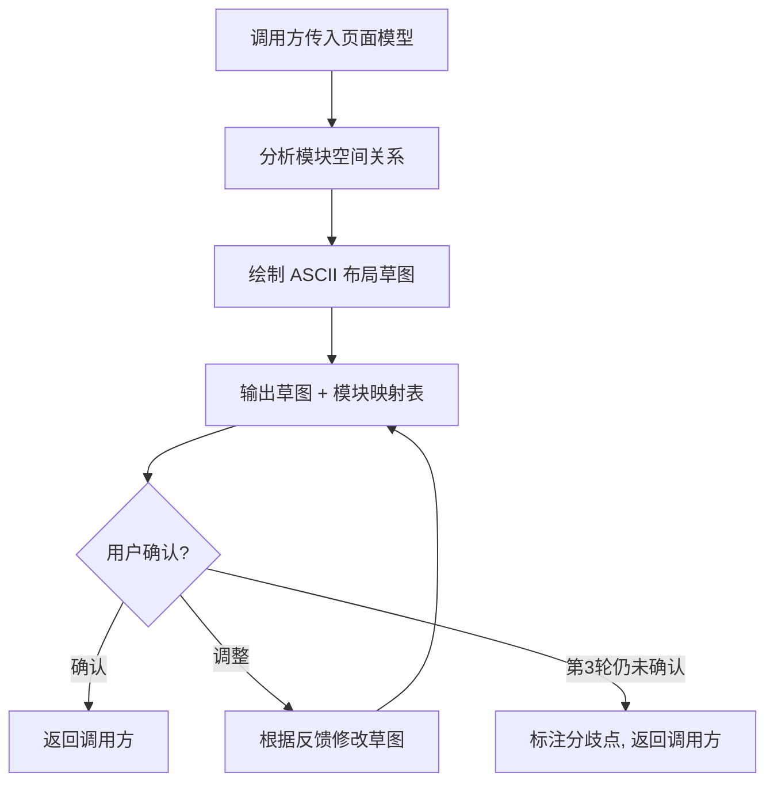
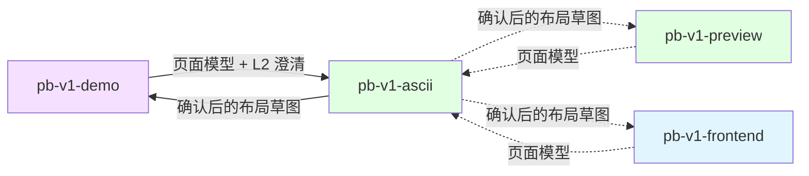

# pb-v1-ascii

**版本**: 1.0.0
**状态**: 设计完成
**创建日期**: 2026-04-16
**最后更新**: 2026-04-16
**流程映射**: vNext Build 阶段（编码前布局可视化）

---

**红线声明**：ASCII 草图是布局结构的快速可视化工具，不是设计稿、不是线框图工具、不是代码生成器。草图必须从已收集的页面模型推导，不从口头描述或个人想象推导。草图中出现的每个模块都必须能追溯到调用方传入的页面模型。绝不在缺少页面模型的情况下开始绘制，绝不生成代码，绝不修改上游产物，绝不替代调用方的决策流程。

---

## 核心规则

以下 7 条规则直接约束执行行为：

1. **页面模型驱动** — ASCII 草图从调用方传入的页面模型推导，不从口头描述或设计灵感推导。页面模型是必需输入，不是可选参考。
2. **结构优先，细节留后** — 草图关注模块的存在性、位置关系和层级结构，不关注颜色、字体、间距等视觉细节。
3. **模块可追溯** — 草图中的每个模块都必须能追溯到页面模型中的定义。页面模型中没有的模块不得出现在草图中。
4. **零开发概念** — 草图中不出现 Feature ID、维度标签、分类标签、版本号。所有标注使用产品语言，面向最终用户。
5. **对话内交付** — 草图直接输出到对话中，不生成独立文件。确认后由调用方决定如何记录。
6. **快速收敛** — 最多 3 轮迭代。草图的目标是对齐布局理解，不是产出完美的布局方案。
7. **工具定位** — 被调用方调用，不自行触发。不替代调用方的决策流程，不做超出布局可视化的事。

---

## 设计原则

1. **还原优先** — 草图是对页面模型的空间还原，不是创意设计。忠实反映模型中定义的模块和关系
2. **一图胜千言** — ASCII 草图的价值在于让抽象的模块清单变成可见的空间关系，减少文字描述的歧义
3. **粗粒度对齐** — 对齐的是模块级布局（哪些模块、在哪个位置、什么层级关系），不是像素级排列
4. **状态可见** — 关键状态变化（空状态、加载中、有数据）用并列草图展示，让状态差异一目了然
5. **快进快出** — 作为轻量级工具嵌入调用方流程，不增加额外的流程负担。能 1 轮确认就不用 3 轮

---

## 输入协议

### 必需输入

| 输入 | 来源 | 用途 |
|------|------|------|
| 页面模型 | 调用方（已完成信息收集） | 用户目标、核心场景、必需模块清单 |

### 可选输入

| 输入 | 来源 | 用途 |
|------|------|------|
| L2 澄清结论 | 调用方（已完成澄清） | 影响布局的关键决策（如分步 vs 同屏） |
| 参考页面截图/描述 | 调用方 | 作为布局参考基线 |
| 布局偏好 | 用户 | 如"侧边栏布局"、"顶部导航" |

### 从输入中提取什么

**页面模型** → 布局要素：
- 用户目标 → 页面的核心动线（用户从上到下/从左到右的操作路径）
- 核心场景 → 模块间的交互顺序和空间邻近关系
- 必需模块清单 → 需要在草图中出现的所有模块
- 模块类型（输入/输出/操作/状态） → 模块的空间权重和位置倾向

**L2 澄清结论** → 布局约束：
- 分步 vs 同屏 → 单页布局 vs 多步骤布局
- 列表 vs 详情 → 主内容区的展示模式
- 侧边栏 vs 顶部导航 → 页面整体框架

---

## 输出协议

### 产出内容（直接输出到对话）

**1. ASCII 布局草图**

```
┌─────────────────────────────────────────────┐
│ [顶部导航栏]                                  │
├──────────┬──────────────────────────────────┤
│          │                                    │
│ [侧边栏]  │  [主内容区]                        │
│          │                                    │
│  · 菜单项1 │  ┌──────────────────────────┐    │
│  · 菜单项2 │  │ [模块A: 搜索/筛选区]       │    │
│  · 菜单项3 │  └──────────────────────────┘    │
│          │                                    │
│          │  ┌──────────────────────────┐      │
│          │  │ [模块B: 数据列表]          │      │
│          │  │  ┌────┬────┬────┬────┐   │      │
│          │  │  │ 列1 │ 列2 │ 列3 │ 操作 │   │  │
│          │  │  ├────┼────┼────┼────┤   │      │
│          │  │  │ ...│ ...│ ...│ ...│   │      │
│          │  │  └────┴────┴────┴────┘   │      │
│          │  └──────────────────────────┘      │
│          │                                    │
│          │  [模块C: 分页器]                    │
├──────────┴──────────────────────────────────┤
│ [底部状态栏]                                  │
└─────────────────────────────────────────────┘
```

**2. 模块映射表**

| 草图标记 | 产品文档来源 | 模块类型 | 说明 |
|---------|------------|---------|------|
| [模块A: 搜索/筛选区] | F-001 D-02 | 输入模块 | 用户输入筛选条件 |
| [模块B: 数据列表] | F-001 D-04 | 输出模块 | 展示查询结果 |

**3. 布局说明**（仅在布局逻辑不自明时附加）
- 简要说明布局选择的理由（如"采用侧边栏布局因为导航项较多"）
- 标注关键交互流向

### 状态变化草图（按需）

当页面有显著的状态差异时，用并列草图展示：

```
(空状态)                    (有数据)
┌──────────────┐           ┌──────────────┐
│              │           │ ┌──────────┐ │
│   📭 暂无数据  │           │ │ 数据行 1  │ │
│   [新建按钮]  │           │ ├──────────┤ │
│              │           │ │ 数据行 2  │ │
└──────────────┘           │ └──────────┘ │
                           └──────────────┘
```

---

## ASCII 绘制规范

### 字符集

| 用途 | 字符 | 示例 |
|------|------|------|
| 外框/区域边界 | `┌ ─ ┐ │ └ ┘ ├ ┤ ┬ ┴ ┼` | `┌────┐` |
| 模块标注 | `[ ]` | `[搜索栏]` |
| 嵌套子模块 | 缩进 + 内框 | 见上方示例 |
| 交互流向 | `→ ← ↑ ↓` | `[按钮] → [结果区]` |
| 列表项 | `·` | `· 菜单项1` |
| 占位内容 | `...` | `│ ... │` |
| 状态标注 | `( )` | `(加载中)` |
| 分隔线 | `─` 或 `═` | `├────────┤` |

### 布局模式

**单栏布局**：适用于表单页、详情页、简单操作页
```
┌─────────────┐
│ [顶部]       │
│ [主内容]     │
│ [底部操作]   │
└─────────────┘
```

**双栏布局**：适用于导航+内容、列表+详情
```
┌────┬────────┐
│侧栏│ 主内容  │
└────┴────────┘
```

**多步骤布局**：适用于向导式流程
```
[步骤1] ──→ [步骤2] ──→ [步骤3]
   ↓
┌─────────────┐
│ 当前步骤内容  │
└─────────────┘
```

### 绘制原则

1. **宽度控制在 60-80 字符**，确保在终端和代码块中可读
2. **模块用 `[名称]` 标注**，名称使用产品语言（中文）
3. **层级用嵌套框表示**，最多 3 层嵌套
4. **空间比例大致反映实际权重**，主内容区占比最大
5. **交互流用箭头标注**，仅标注核心交互路径
6. **响应式差异用多张草图**，标注断点（如 `(桌面端)` `(移动端)`）

---

## 执行流程

### 总流程



### Step 1: 分析模块空间关系

**目的**: 将模块清单转化为空间布局决策

**执行内容**:
1. 从页面模型中提取所有必需模块
2. 分析模块间的关系：
   - **操作顺序**: 用户先操作哪个模块，后操作哪个 → 决定上下/左右顺序
   - **信息层级**: 哪个模块是主角，哪个是辅助 → 决定空间权重
   - **功能分组**: 哪些模块属于同一功能组 → 决定是否嵌套
   - **状态依赖**: 哪个模块的状态影响其他模块 → 决定空间邻近性
3. 选择布局模式（单栏/双栏/多步骤）
4. 确定模块在布局中的位置

### Step 2: 绘制 ASCII 布局草图

**目的**: 将空间关系转化为可视化的 ASCII 草图

**执行内容**:
1. 按选定的布局模式绘制页面外框
2. 逐个放置模块，标注模块名称
3. 对关键模块展开内部结构（如表格的列头、表单的字段）
4. 标注核心交互流向
5. 如有显著状态差异，绘制状态变化草图

**质量检查**:
- 页面模型中的每个必需模块都在草图中出现
- 草图宽度不超过 80 字符
- 嵌套不超过 3 层
- 模块标注使用产品语言

### Step 3: 输出并确认

**目的**: 将草图呈现给用户，收集反馈

**执行内容**:
1. 输出 ASCII 布局草图（代码块格式）
2. 输出模块映射表
3. 如有布局选择需要说明，附加简要说明
4. 通过 AskUserQuestion 确认：
   - 选项 A: 布局结构正确，继续
   - 选项 B: 需要调整（用户说明调整内容）
   - 选项 C: 布局方向有根本偏差，需要重新分析

**迭代规则**:
- 选项 A → 返回调用方，附带确认后的草图
- 选项 B → 根据反馈修改草图，重新输出（最多 3 轮）
- 选项 C → 回到 Step 1 重新分析（计入轮次）
- 第 3 轮仍未确认 → 标注分歧点，返回调用方，由调用方决定是否继续

---

## 调用协议

### 调用方式

调用方通过 `/pb-v1-ascii` 调用，传入已收集的页面模型：

```
/pb-v1-ascii

页面模型:
- 用户目标: {一句话}
- 核心场景: {用户典型路径}
- 必需模块:
  | 模块 | 类型 | 来源 |
  |------|------|------|
  | ... | ... | ... |

L2 澄清结论（如有）:
- {关键决策}

布局偏好（如有）:
- {用户偏好}
```

### 返回结果

确认后返回调用方：
- 确认状态：`confirmed` | `partial`（标注分歧点）
- ASCII 草图文本（供调用方记录）
- 模块映射表

---

## 职责边界

### 必须做

- 从页面模型推导布局结构
- 确保每个模块可追溯到页面模型
- 使用产品语言标注模块
- 控制草图可读性（宽度、嵌套层级）
- 最多 3 轮迭代后返回调用方

### 禁止做

- **不在缺少页面模型时开始绘制** — 页面模型是必需输入
- **不生成代码** — 只做布局可视化
- **不做视觉设计** — 不涉及颜色、字体、间距等视觉细节
- **不生成独立文件** — 草图输出到对话中，由调用方决定记录方式
- **不修改上游产物** — 页面模型、产品文档只读
- **不替代调用方决策** — 布局建议由用户确认，不自行决定
- **不自行触发** — 只被调用方调用
- **不超过 3 轮迭代** — 第 3 轮后返回调用方

---

## 与其他 Skill 的交互



| 交互方 | 方向 | 内容 | 触发条件 |
|-------|------|------|---------|
| pb-v1-demo | 输入（主要调用方） | 页面模型 + L2 澄清结论 | Step 1 完成后、Step 2 开始前 |
| pb-v1-preview | 输入（可选调用方） | 页面模型 | 全站预览前布局对齐 |
| pb-v1-frontend | 输入（可选调用方） | 页面模型 | 设计前布局对齐 |

---

## Safety

- 绝不在缺少页面模型时开始绘制——页面模型是必需输入
- 绝不从口头描述或个人想象推导布局——必须从页面模型推导
- 绝不在草图中放置页面模型未定义的模块——每个模块必须可追溯
- 绝不在草图中出现开发概念——Feature ID、维度标签、分类标签、版本号
- 绝不生成代码——只做布局可视化
- 绝不生成独立文件——草图输出到对话中
- 绝不修改上游产物——页面模型、产品文档只读
- 绝不超过 3 轮迭代——第 3 轮后返回调用方

---

**文档状态**: 设计完成
**版本**: 1.0.0
**创建日期**: 2026-04-16
**最后更新**: 2026-04-16
